# AI集成设计

<cite>
**本文档引用的文件**
- [aiService.js](file://backend/src/services/aiService.js)
- [aiController.js](file://backend/src/controllers/aiController.js)
- [useAIAnalysis.js](file://frontend/src/composables/useAIAnalysis.js)
- [analysisDataStructures.js](file://frontend/src/utils/analysisDataStructures.js)
- [analysisStorage.js](file://frontend/src/utils/analysisStorage.js)
- [aiService.test.js](file://backend/tests/services/aiService.test.js)
- [design.md](file://openspec/changes/add-ai-video-analysis-capability/design.md)
- [qwen3-prompt.md](file://qwen3-prompt.md)
- [qwen3-VL-视频理解API.md](file://qwen3-VL-视频理解API.md)
</cite>

## 目录
1. [项目概述](#项目概述)
2. [系统架构](#系统架构)
3. [双模型协同机制](#双模型协同机制)
4. [核心功能模块](#核心功能模块)
5. [提示词工程策略](#提示词工程策略)
6. [数据处理流程](#数据处理流程)
7. [前端集成](#前端集成)
8. [错误处理与优化](#错误处理与优化)
9. [性能优化策略](#性能优化策略)
10. [质量保证体系](#质量保证体系)

## 项目概述

本项目构建了一个基于通义千问AI模型的视频内容分析与创意生成系统，采用双模型协同架构，实现了从视频理解到创意输出的完整AI工作流程。系统支持视频内容分析、视频融合方案设计和背景音乐提示词生成三大核心功能。

### 技术特色

- **双模型协同**：qwen3-vl-plus负责视频内容理解，qwen-plus负责文本生成和创意输出
- **三阶段处理流程**：视频理解 → 数据结构化 → 文本生成的标准化处理管道
- **结构化输出**：统一的数据格式和标准化的输出规范
- **实时反馈**：基于WebSocket的进度监控和状态更新
- **本地存储**：完整的分析结果持久化和历史管理

## 系统架构

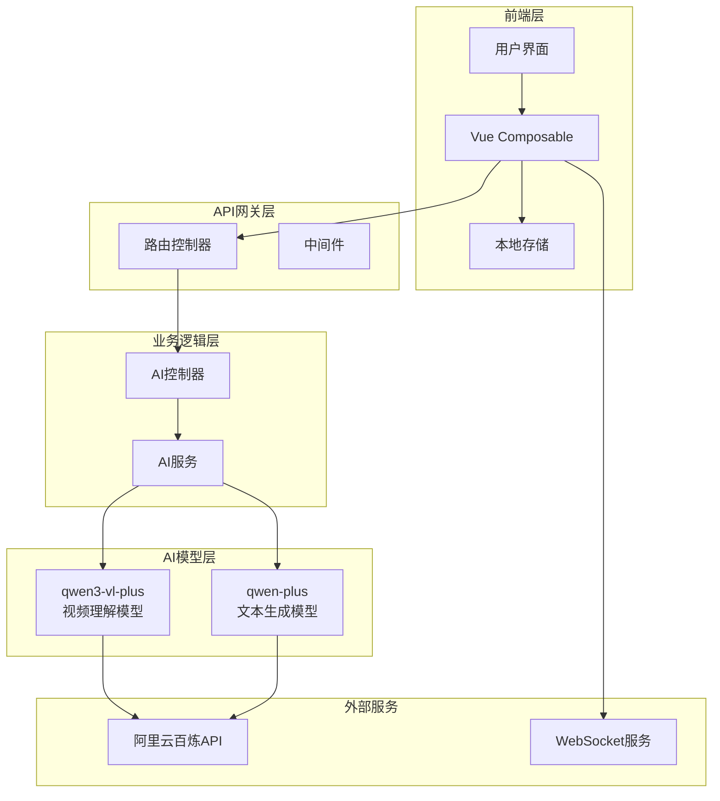

**架构图源文件**
- [aiService.js](file://backend/src/services/aiService.js#L1-L50)
- [aiController.js](file://backend/src/controllers/aiController.js#L1-L30)

### 层次化设计

系统采用分层架构设计，确保各层职责清晰、耦合度低：

1. **表现层**：Vue组件和组合式函数，负责用户交互和状态管理
2. **控制层**：RESTful API控制器，处理HTTP请求和响应
3. **服务层**：AI服务封装，提供统一的模型调用接口
4. **模型层**：通义千问AI模型，执行具体的分析和生成任务

**章节源文件**
- [aiService.js](file://backend/src/services/aiService.js#L8-L20)
- [aiController.js](file://backend/src/controllers/aiController.js#L5-L15)

## 双模型协同机制

### 模型分工策略

系统采用明确的模型分工策略，充分发挥各模型的优势：

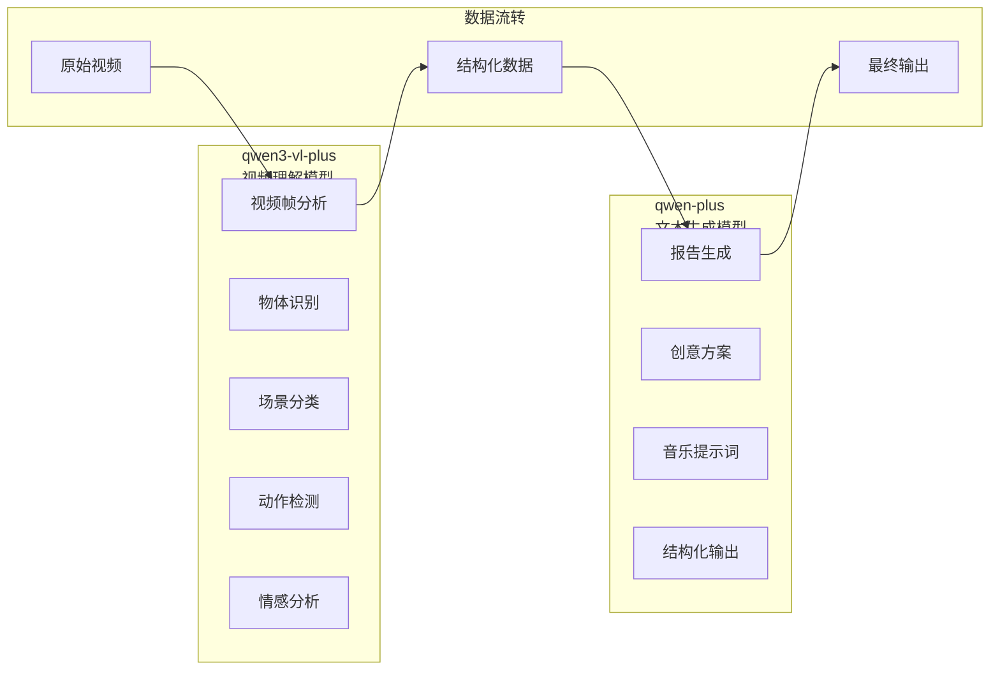

**协同机制源文件**
- [aiService.js](file://backend/src/services/aiService.js#L21-L125)
- [aiService.js](file://backend/src/services/aiService.js#L127-L415)

### 三阶段处理流程

系统实现了标准化的三阶段处理流程，确保处理质量和一致性：

#### 阶段1：视频理解分析
- **输入**：视频文件路径
- **输出**：原始分析数据（JSON格式）
- **功能**：提取视频的基本信息、关键帧、场景、物体和动作

#### 阶段2：数据结构化处理
- **输入**：原始分析数据
- **输出**：结构化数据对象
- **功能**：数据清洗、格式标准化、字段映射

#### 阶段3：文本生成与报告
- **输入**：结构化数据
- **输出**：专业报告或创意方案
- **功能**：基于结构化数据生成格式化的分析报告

**章节源文件**
- [aiService.js](file://backend/src/services/aiService.js#L417-L475)

## 核心功能模块

### 视频内容分析模块

视频内容分析模块是系统的核心功能，负责深度解析视频内容并生成专业分析报告。

#### 功能特性

| 功能模块 | 描述 | 输出格式 | 应用场景 |
|---------|------|----------|----------|
| 视频基本信息提取 | 时长、分辨率、帧率分析 | 结构化JSON | 技术参数评估 |
| 关键帧识别 | 提取最具代表性的视频帧 | 时间戳+描述 | 内容概览 |
| 场景分类 | 自动识别视频场景类型 | 场景类型+时间范围 | 叙事结构分析 |
| 物体检测 | 识别视频中的主要物体 | 物体名称+出现时间 | 内容要素分析 |
| 动作识别 | 分析人物和物体的动作序列 | 动作描述+时间区间 | 动态行为分析 |
| 情感基调分析 | 评估视频的整体情感氛围 | 情感描述+强度评分 | 情感设计参考 |
| 质量评估 | 分析画面质量和技术参数 | 质量评分+改进建议 | 技术优化指导 |

#### 数据结构设计

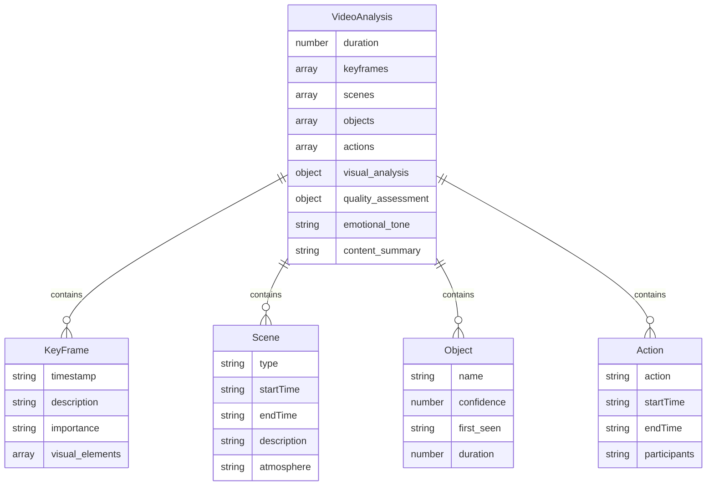

**数据结构源文件**
- [analysisDataStructures.js](file://frontend/src/utils/analysisDataStructures.js#L35-L98)

**章节源文件**
- [aiService.js](file://backend/src/services/aiService.js#L24-L120)

### 视频融合分析模块

视频融合分析模块专门处理双视频的融合方案设计，提供专业的视频编辑建议。

#### 融合策略分析

系统通过智能分析两个视频的内容特征，提供多种融合策略：

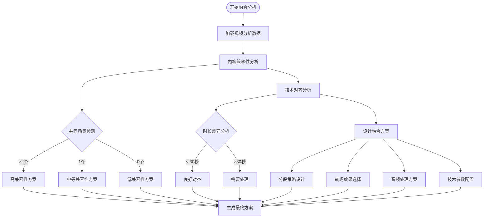

**融合分析源文件**
- [aiService.js](file://backend/src/services/aiService.js#L549-L609)

### 音乐提示词生成模块

音乐提示词生成模块为视频融合方案提供专业的背景音乐创作指导。

#### 提示词结构化设计

音乐提示词采用结构化模板，确保AI音乐生成模型能够准确理解创作意图：

| 结构部分 | 内容要素 | 技术要求 | 应用场景 |
|---------|----------|----------|----------|
| 音乐风格定位 | 风格类型、调性、拍号 | 具体描述、可执行 | 风格匹配 |
| 情感曲线设计 | 情绪变化、强度分布 | 时间点+描述 | 情感同步 |
| 节奏匹配 | 节奏变化、BPM设置 | 精确到秒的时间戳 | 节奏同步 |
| 乐器选择 | 主要乐器、和声配置 | 乐器组合建议 | 音色设计 |
| 技术参数 | 时长、编解码、格式 | 标准化参数 | 技术实现 |

**章节源文件**
- [aiService.js](file://backend/src/services/aiService.js#L369-L415)

## 提示词工程策略

### Prompt设计框架

系统基于qwen3-prompt.md的指导原则，建立了标准化的提示词设计框架：

#### 标准化Prompt结构

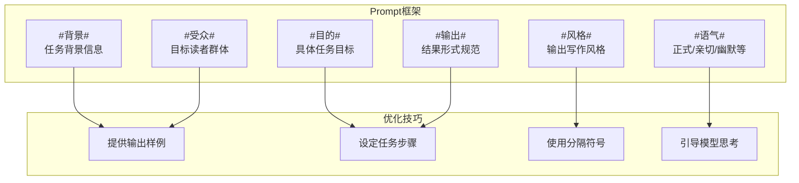

**Prompt框架源文件**
- [qwen3-prompt.md](file://qwen3-prompt.md#L23-L38)

### 视频内容分析Prompt

视频内容分析采用详细的结构化Prompt，确保分析的全面性和准确性：

#### 默认分析Prompt模板

系统提供了标准化的视频内容分析Prompt模板，包含完整的分析维度：

- **视频基本信息**：时长、分辨率、帧率等技术参数
- **关键帧分析**：提取最具代表性的视频帧及其描述
- **场景分类**：识别视频中的不同类型场景
- **物体检测**：识别视频中的主要物体及其出现规律
- **动作识别**：分析人物和物体的动作序列
- **视觉分析**：色彩构成、光影效果、构图特点
- **质量评估**：画面清晰度、稳定性、曝光等技术指标
- **情感基调**：视频的整体情感氛围和变化趋势

**章节源文件**
- [aiService.js](file://backend/src/services/aiService.js#L24-L90)

### 融合方案设计Prompt

视频融合分析采用专业的视频编辑视角，提供详细的融合设计方案：

#### 融合策略要素

融合方案Prompt涵盖了视频编辑的各个方面：

- **融合策略概述**：目标时长、整体风格、核心主题
- **智能分段策略**：基于内容的智能分段和时间轴设计
- **视觉效果统一**：分辨率标准化、色彩校正、构图调整
- **转场效果设计**：多种转场方案的选择和参数设置
- **音频处理方案**：音量平衡、淡入淡出、环境音处理
- **技术参数配置**：输出标准、编码格式、质量控制

**章节源文件**
- [aiService.js](file://backend/src/services/aiService.js#L188-L270)

### 音乐提示词设计Prompt

音乐提示词生成采用专业的音乐制作视角，为AI音乐生成提供详细指导：

#### 音乐创作要素

音乐提示词涵盖了音乐制作的完整流程：

- **音乐风格定位**：风格类型、调性、拍号等基础要素
- **情感曲线设计**：情绪变化的时间分布和强度描述
- **节奏匹配方案**：与视频画面节奏的同步设计
- **乐器选择建议**：适合场景和情感的乐器组合
- **技术参数设定**：AI音乐生成的标准化参数
- **质量标准要求**：音质、连贯性、画面契合度等标准

**章节源文件**
- [aiService.js](file://backend/src/services/aiService.js#L273-L369)

## 数据处理流程

### 视频帧数据转换

系统实现了高效的视频帧数据处理流程，将视频文件转换为符合AI模型要求的格式：

#### Base64编码流程

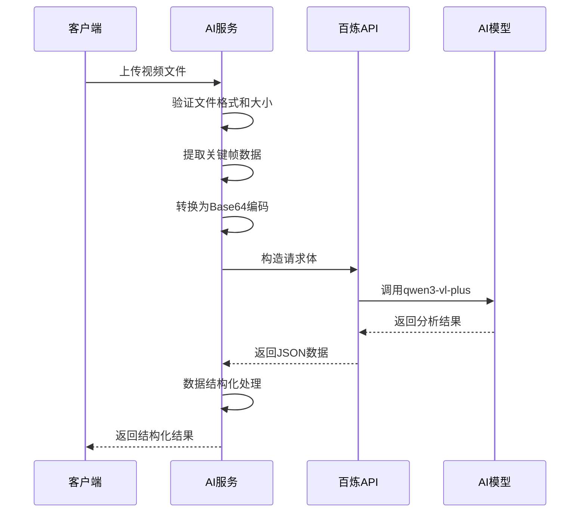

**数据转换源文件**
- [aiService.js](file://backend/src/services/aiService.js#L92-L118)

### 结果后处理逻辑

系统实现了完整的数据分析和后处理逻辑，确保输出结果的质量和一致性：

#### 数据验证与清洗

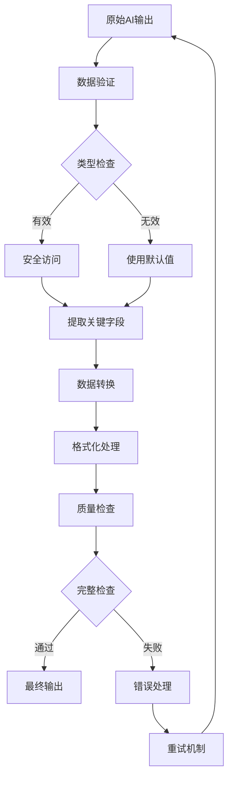

**后处理源文件**
- [aiService.js](file://backend/src/services/aiService.js#L478-L532)

### 结构化输出规范

系统定义了统一的数据结构规范，确保各模块间的数据兼容性：

#### 数据格式标准化

| 字段类型 | 数据格式 | 示例值 | 验证规则 |
|---------|----------|--------|----------|
| 时间戳 | HH:mm:ss | 00:15:30 | 格式验证 |
| 数值评分 | 0-100整数 | 85 | 范围检查 |
| 文本描述 | UTF-8字符串 | "日落风景" | 长度限制 |
| 数组列表 | JSON数组 | ["场景1", "场景2"] | 类型验证 |
| 对象结构 | JSON对象 | {"key": "value"} | 结构验证 |

**章节源文件**
- [analysisDataStructures.js](file://frontend/src/utils/analysisDataStructures.js#L1-L50)

## 前端集成

### Vue Composable设计

前端采用Vue 3 Composition API设计，提供了灵活的状态管理和业务逻辑封装：

#### 状态管理架构

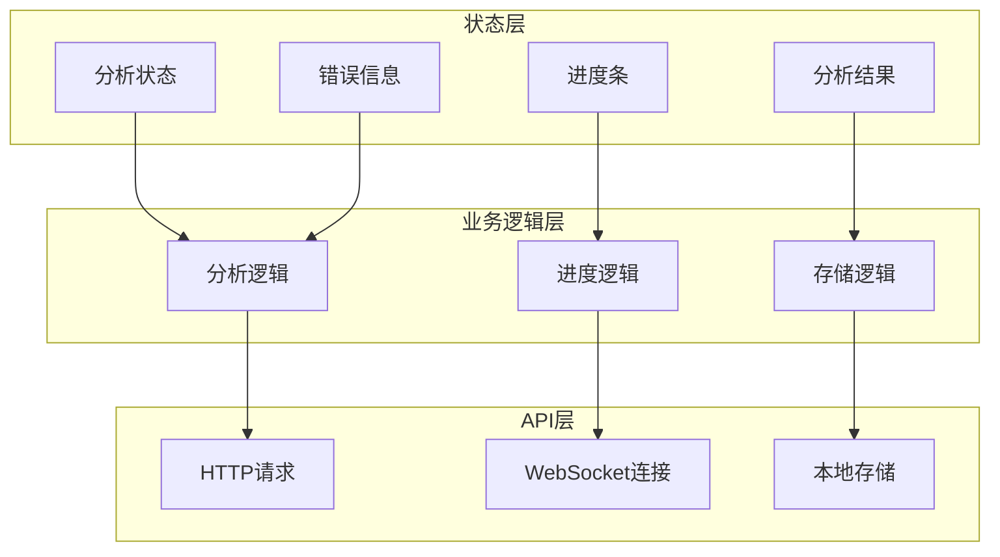

**前端架构源文件**
- [useAIAnalysis.js](file://frontend/src/composables/useAIAnalysis.js#L14-L30)

### 实时进度监控

系统集成了WebSocket服务，提供实时的分析进度更新：

#### 进度更新机制

不同类型的分析任务采用不同的进度更新策略：

- **视频内容分析**：10%递增，总耗时约30秒
- **视频融合分析**：5%递增，总耗时约60秒  
- **音乐提示词生成**：15%递增，总耗时约45秒

**章节源文件**
- [useAIAnalysis.js](file://frontend/src/composables/useAIAnalysis.js#L30-L100)

### 本地存储集成

前端实现了完整的本地存储解决方案，支持分析结果的持久化和历史管理：

#### 存储策略设计

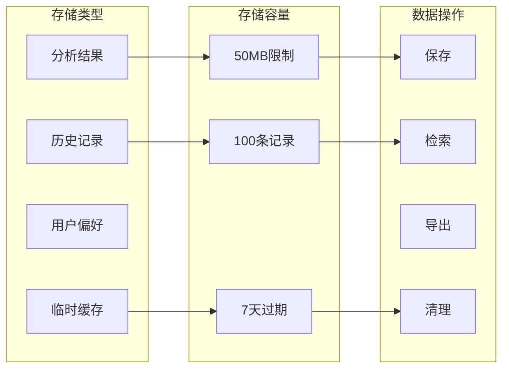

**存储架构源文件**
- [analysisStorage.js](file://frontend/src/utils/analysisStorage.js#L1-L50)

**章节源文件**
- [analysisStorage.js](file://frontend/src/utils/analysisStorage.js#L36-L80)

## 错误处理与优化

### 重试机制设计

系统实现了基于指数退避策略的智能重试机制，确保API调用的可靠性：

#### 重试策略

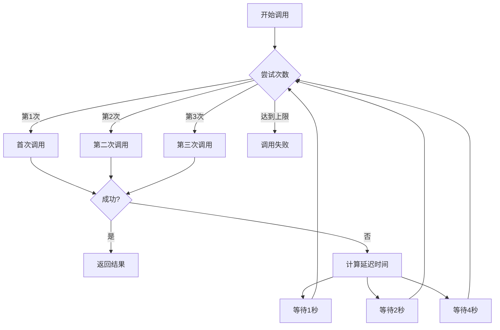

**重试机制源文件**
- [aiService.js](file://backend/src/services/aiService.js#L614-L669)

### 错误码处理

系统定义了完整的错误码处理体系，提供清晰的错误信息和恢复建议：

#### 错误分类体系

| 错误类型 | 错误码 | 处理策略 | 用户提示 |
|---------|--------|----------|----------|
| 网络错误 | ETIMEDOUT | 重试机制 | 请求超时，请稍后重试 |
| 认证错误 | 401 | 检查API密钥 | API密钥无效，请重新配置 |
| 限流错误 | 429 | 指数退避 | 请求过于频繁，请降低频率 |
| 参数错误 | 400 | 参数验证 | 输入参数格式错误 |
| 服务器错误 | 500 | 重试机制 | 服务器内部错误 |

**章节源文件**
- [aiService.js](file://backend/src/services/aiService.js#L120-L125)

### 限流策略

系统实现了多层次的限流策略，确保API使用的稳定性和经济性：

#### 限流措施

- **请求频率限制**：单用户每分钟最多10次请求
- **并发控制**：同时最多处理5个分析任务
- **资源使用监控**：实时监控Token消耗和响应时间
- **降级策略**：在高负载情况下提供基础功能

**章节源文件**
- [aiService.js](file://backend/src/services/aiService.js#L614-L669)

## 性能优化策略

### 成本优化建议

系统采用了多种成本优化策略，在保证质量的前提下控制AI调用成本：

#### 优化策略

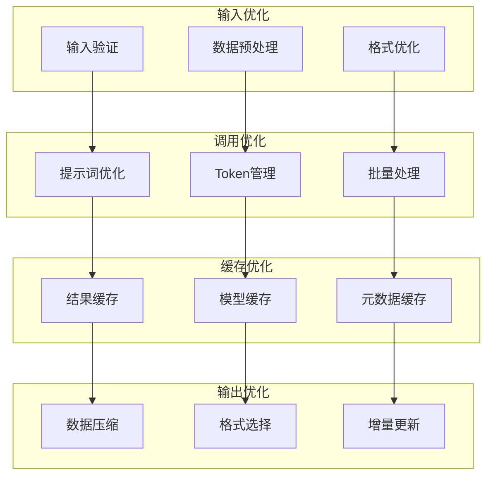

**成本优化源文件**
- [aiService.js](file://backend/src/services/aiService.js#L614-L669)

### 响应时间优化

系统通过多种技术手段优化响应时间，提升用户体验：

#### 性能优化技术

- **异步处理**：所有AI调用采用异步模式，避免阻塞主线程
- **流式输出**：支持长文本的流式生成，减少等待时间
- **并行处理**：双模型并行调用，提高处理效率
- **进度预估**：基于历史数据的智能进度预估

**章节源文件**
- [aiService.js](file://backend/src/services/aiService.js#L372-L410)

### 缓存策略

系统实现了智能缓存策略，减少重复计算和API调用：

#### 缓存层级

- **内存缓存**：最近使用的分析结果缓存在内存中
- **本地缓存**：分析结果持久化到浏览器本地存储
- **分布式缓存**：在高并发场景下的分布式缓存支持
- **智能失效**：基于时间的智能缓存失效机制

**章节源文件**
- [analysisStorage.js](file://frontend/src/utils/analysisStorage.js#L420-L442)

## 质量保证体系

### 数据质量标准

系统建立了完整的数据质量保证体系，确保分析结果的准确性和可靠性：

#### 质量指标体系

| 质量维度 | 评估指标 | 标准要求 | 监控方式 |
|---------|----------|----------|----------|
| 内容准确性 | 时间戳精度 | ±2秒以内 | 自动验证 |
| 识别准确率 | 主要物体识别 | ≥80% | 人工抽检 |
| 逻辑一致性 | 分析结果互斥 | 无矛盾 | 规则检查 |
| 报告完整性 | 结构章节覆盖 | 100% | 模板验证 |
| 专业性 | 术语使用规范 | 行业标准 | 专家审核 |

**质量标准源文件**
- [design.md](file://openspec/changes/add-ai-video-analysis-capability/design.md#L170-L193)

### 测试体系

系统建立了完善的测试体系，涵盖单元测试、集成测试和端到端测试：

#### 测试架构

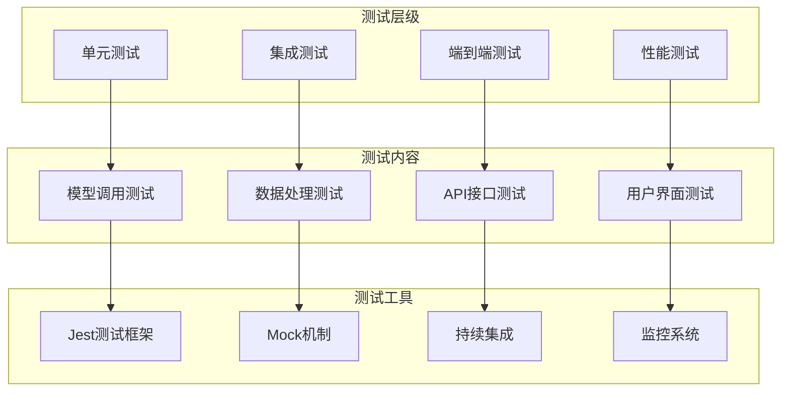

**测试架构源文件**
- [aiService.test.js](file://backend/tests/services/aiService.test.js#L1-L50)

### 监控与告警

系统实现了全面的监控和告警机制，确保系统的稳定运行：

#### 监控指标

- **API调用成功率**：监控AI模型调用的成功率
- **响应时间分布**：跟踪各功能模块的响应时间
- **错误率统计**：统计各类错误的发生频率
- **资源使用情况**：监控系统资源的使用情况
- **用户满意度**：通过用户反馈评估服务质量

**章节源文件**
- [aiService.test.js](file://backend/tests/services/aiService.test.js#L400-L500)

## 总结

本AI集成设计通过双模型协同架构，实现了从视频理解到创意输出的完整AI工作流程。系统采用标准化的处理流程、结构化的数据格式和完善的质量保证体系，确保了分析结果的准确性和可靠性。通过前端的实时反馈和本地存储，为用户提供了优秀的交互体验。完善的错误处理和性能优化策略，保证了系统的稳定性和经济性。

该设计不仅满足了当前的功能需求，还为未来的扩展和优化奠定了坚实的基础。通过持续的监控和改进，系统将不断演进，为用户提供更加优质的AI视频分析服务。