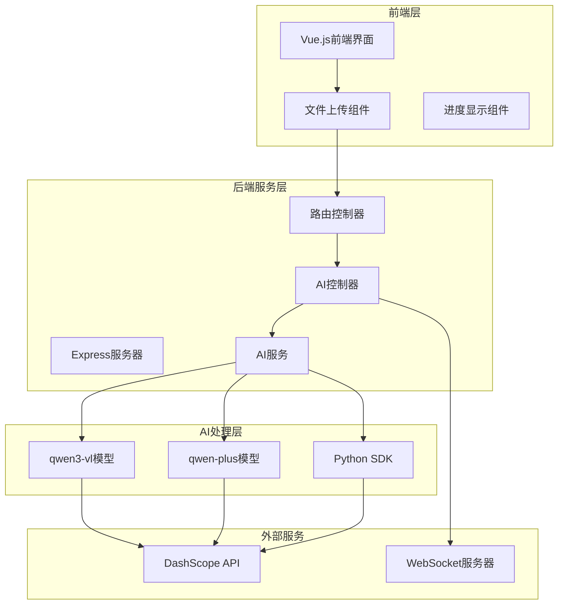
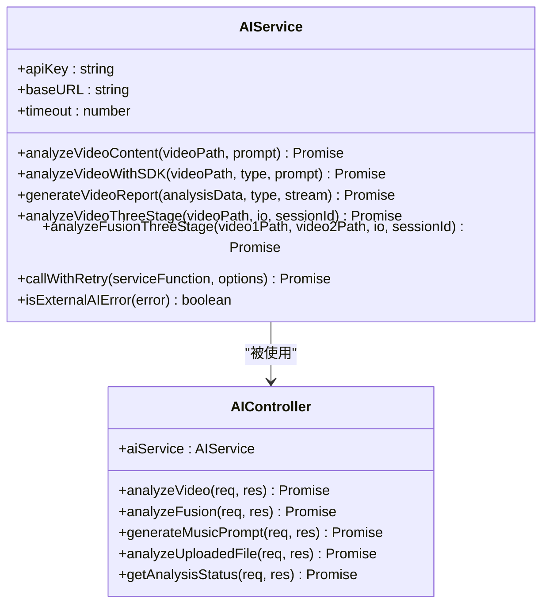
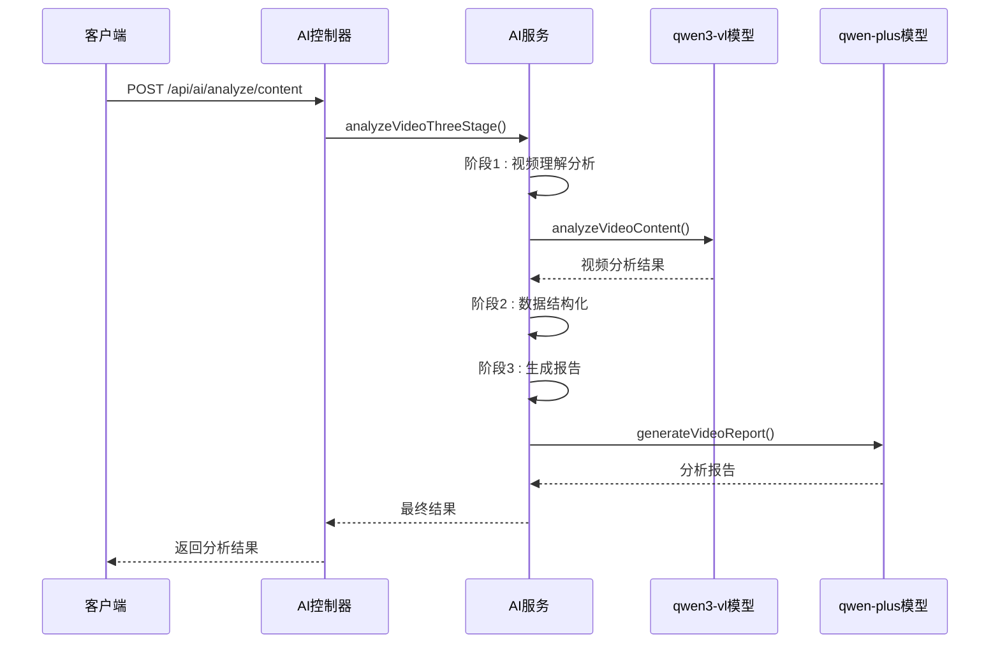
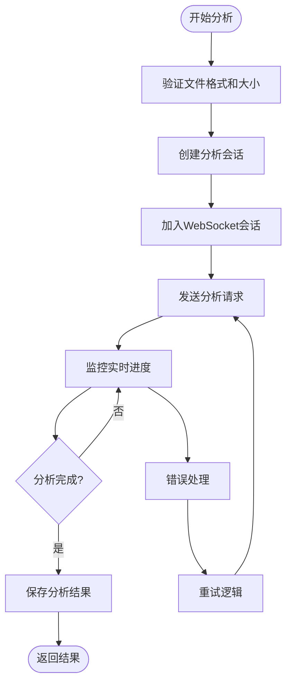
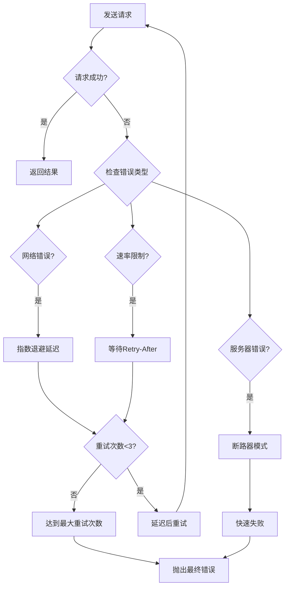

# DashScope集成指南

<cite>
**本文档引用的文件**
- [aiService.js](file://backend/src/services/aiService.js)
- [aiController.js](file://backend/src/controllers/aiController.js)
- [ai.js](file://backend/src/routes/ai.js)
- [video_analyzer.py](file://backend/src/scripts/video_analyzer.py)
- [useAIAnalysis.js](file://frontend/src/composables/useAIAnalysis.js)
- [FileUploader.vue](file://frontend/src/components/FileUploader.vue)
- [qwen-DashScope SDK等接入方式.md](file://qwen-DashScope SDK等接入方式.md)
- [package.json](file://backend/package.json)
- [API.md](file://backend/API.md)
</cite>

## 目录
1. [简介](#简介)
2. [系统架构](#系统架构)
3. [环境配置](#环境配置)
4. [API密钥配置](#api密钥配置)
5. [后端服务集成](#后端服务集成)
6. [前端组件集成](#前端组件集成)
7. [错误处理机制](#错误处理机制)
8. [性能优化](#性能优化)
9. [最佳实践](#最佳实践)
10. [故障排除](#故障排除)

## 简介

本指南详细介绍了如何在视频分析系统中集成阿里云DashScope AI服务。系统采用双模型协同架构，使用qwen3-vl模型进行视频理解分析，qwen-plus模型进行文本生成和报告创作。

### 核心特性
- **双模型协同**：qwen3-vl负责视频内容分析，qwen-plus负责报告生成
- **实时进度跟踪**：支持WebSocket实时进度推送
- **智能重试机制**：基于指数退避算法的重试策略
- **降级处理**：API服务不可用时的备用方案
- **多语言支持**：Python SDK和HTTP API双重访问方式

## 系统架构



**架构图来源**
- [aiService.js](file://backend/src/services/aiService.js#L1-L50)
- [aiController.js](file://backend/src/controllers/aiController.js#L1-L30)
- [ai.js](file://backend/src/routes/ai.js#L1-L20)

## 环境配置

### 1. 系统要求

| 组件 | 版本要求 | 说明 |
|------|----------|------|
| Node.js | ≥ 16.x | 后端运行环境 |
| Python | ≥ 3.8 | Python SDK运行环境 |
| npm | ≥ 8.x | 包管理器 |
| Vue.js | ≥ 3.0 | 前端框架 |

### 2. 依赖包安装

```bash
# 后端依赖
npm install axios socket.io express

# Python SDK依赖
pip install dashscope opencv-python
```

**章节来源**
- [package.json](file://backend/package.json#L20-L35)
- [video_analyzer.py](file://backend/src/scripts/video_analyzer.py#L1-L10)

## API密钥配置

### 1. 获取API密钥

1. **注册阿里云账号**：访问阿里云官网注册账号
2. **开通百炼服务**：前往阿里云百炼大模型服务平台
3. **创建API密钥**：在密钥管理页面创建新的API Key
4. **配置业务空间**：推荐使用主账号空间

### 2. 环境变量配置

创建 `.env` 文件并配置以下环境变量：

```bash
# 必需配置
DASHSCOPE_API_KEY=your-dashscope-api-key

# 可选配置
NODE_ENV=development
SKIP_AUTH=false
JWT_SECRET=your-jwt-secret
```

### 3. 配置验证

```javascript
// 在AI服务初始化时验证API密钥
if (!process.env.DASHSCOPE_API_KEY) {
  throw new Error(
    'DASHSCOPE_API_KEY环境变量未设置。请在.env文件中配置: DASHSCOPE_API_KEY=your-api-key'
  );
}
```

**章节来源**
- [aiService.js](file://backend/src/services/aiService.js#L12-L20)
- [qwen-DashScope SDK等接入方式.md](file://qwen-DashScope SDK等接入方式.md#L15-L30)

## 后端服务集成

### 1. AI服务类实现



**类图来源**
- [aiService.js](file://backend/src/services/aiService.js#L10-L50)
- [aiController.js](file://backend/src/controllers/aiController.js#L6-L15)

### 2. 视频内容分析流程



**序列图来源**
- [aiService.js](file://backend/src/services/aiService.js#L667-L778)
- [aiController.js](file://backend/src/controllers/aiController.js#L14-L65)

### 3. 实时进度推送

系统支持WebSocket实时进度推送，用于向客户端实时更新分析进度：

```javascript
// WebSocket事件处理
io.to(`session:${sessionId}`).emit('analysis:progress', {
  stage: 1,
  progress: 40,
  message: '视频理解完成',
  timestamp: new Date().toISOString()
});
```

**章节来源**
- [aiService.js](file://backend/src/services/aiService.js#L670-L705)
- [aiController.js](file://backend/src/controllers/aiController.js#L62-L65)

## 前端组件集成

### 1. AI分析组合式函数



**流程图来源**
- [useAIAnalysis.js](file://frontend/src/composables/useAIAnalysis.js#L32-L140)
- [useAIAnalysis.js](file://frontend/src/composables/useAIAnalysis.js#L148-L255)

### 2. 文件上传组件

文件上传组件支持多种验证规则：

| 验证项 | 规则 | 说明 |
|--------|------|------|
| 文件格式 | mp4, avi | 支持的视频格式 |
| 文件大小 | ≤ 300MB | 单个文件最大限制 |
| 文件数量 | ≤ 3个 | 批量上传限制 |
| 类型一致性 | 相同格式 | 同批次文件必须相同格式 |

### 3. 进度显示组件

前端提供实时进度显示功能：

```javascript
// 进度状态管理
const analysisProgress = ref(0);
const isAnalyzing = ref(false);
const error = ref(null);
```

**章节来源**
- [FileUploader.vue](file://frontend/src/components/FileUploader.vue#L93-L115)
- [useAIAnalysis.js](file://frontend/src/composables/useAIAnalysis.js#L16-L20)

## 错误处理机制

### 1. 智能重试策略

系统实现了基于指数退避算法的智能重试机制：



**流程图来源**
- [aiService.js](file://backend/src/services/aiService.js#L1060-L1175)

### 2. 降级处理机制

当外部AI服务不可用时，系统提供降级处理：

```javascript
// 降级策略实现
if (this.isExternalAIError(httpError)) {
  console.warn('HTTP API也失败，使用空数据结构:', httpError.message);
  vlAnalysis = {};
}
```

### 3. 错误分类

| 错误类型 | HTTP状态码 | 处理策略 |
|----------|------------|----------|
| 网络超时 | ETIMEDOUT | 重试+延迟 |
| 速率限制 | 429 | 等待Retry-After |
| 服务器错误 | 500, 502, 503, 504 | 重试+断路器 |
| 认证错误 | 401, 403 | 不重试 |
| 请求错误 | 400 | 不重试 |

**章节来源**
- [aiService.js](file://backend/src/services/aiService.js#L1152-L1175)
- [aiService.js](file://backend/src/services/aiService.js#L685-L695)

## 性能优化

### 1. 超时配置

系统设置了合理的超时时间：

| 组件 | 超时时间 | 说明 |
|------|----------|------|
| HTTP API调用 | 120秒 | DashScope API超时 |
| WebSocket连接 | 8秒 | 连接超时 |
| Python SDK调用 | 3分钟 | 视频分析超时 |

### 2. 并发控制

```javascript
// 并发限制示例
const MAX_CONCURRENT_ANALYSES = 3;
const activeAnalyses = new Set();

async function queueAnalysis(videoPath) {
  if (activeAnalyses.size >= MAX_CONCURRENT_ANALYSES) {
    await Promise.race(activeAnalyses);
  }
  
  const promise = performAnalysis(videoPath);
  activeAnalyses.add(promise);
  
  try {
    return await promise;
  } finally {
    activeAnalyses.delete(promise);
  }
}
```

### 3. 缓存策略

- **结果缓存**：缓存分析结果以减少重复计算
- **模型缓存**：保持模型连接以减少初始化开销
- **文件缓存**：缓存已上传的视频文件

**章节来源**
- [aiService.js](file://backend/src/services/aiService.js#L22-L23)
- [useAIAnalysis.js](file://frontend/src/composables/useAIAnalysis.js#L67-L72)

## 最佳实践

### 1. API调用规范

```javascript
// 推荐的API调用方式
const requestData = {
  model: 'qwen3-vl-plus',
  input: {
    messages: [
      {
        role: 'system',
        content: '你是一名专业的视频分析师'
      },
      {
        role: 'user',
        content: [
          { video: videoPath, fps: 2.0 },
          { text: prompt }
        ]
      }
    ]
  },
  parameters: {
    result_format: 'message',
    max_tokens: 4000,
    temperature: 0.2
  }
};
```

### 2. 错误处理最佳实践

```javascript
// 健壮的错误处理
try {
  const result = await aiService.analyzeVideoContent(videoPath);
  return result;
} catch (error) {
  if (aiService.isExternalAIError(error)) {
    // 外部服务错误，使用降级策略
    return fallbackAnalysis(videoPath);
  }
  // 其他错误，重新抛出
  throw error;
}
```

### 3. 性能监控

```javascript
// 性能监控示例
const performanceMetrics = {
  analysisTime: Date.now() - startTime,
  tokenUsage: response.usage,
  retryCount: retryAttempts,
  status: 'completed'
};
```

**章节来源**
- [aiService.js](file://backend/src/services/aiService.js#L94-L120)
- [aiService.js](file://backend/src/services/aiService.js#L1097-L1124)

## 故障排除

### 1. 常见问题及解决方案

| 问题 | 症状 | 解决方案 |
|------|------|----------|
| API密钥无效 | 401认证错误 | 检查DASHSCOPE_API_KEY配置 |
| 网络超时 | 请求超时 | 检查网络连接，增加超时时间 |
| 速率限制 | 429错误 | 实现指数退避重试 |
| Python SDK失败 | 无法找到模型 | 检查Python环境和依赖 |
| WebSocket连接失败 | 实时进度丢失 | 使用HTTP轮询作为后备 |

### 2. 调试技巧

```javascript
// 启用详细日志
console.log('AI服务调用参数:', JSON.stringify(requestData, null, 2));
console.log('AI服务响应:', JSON.stringify(responseData, null, 2));

// 错误追踪
logger.error('AI服务调用失败:', {
  error: error.message,
  stack: error.stack,
  retryAttempt: attempt,
  delaySeconds: delay / 1000
});
```

### 3. 监控指标

- **成功率**：API调用成功的百分比
- **平均响应时间**：从请求到响应的平均时间
- **重试次数**：因错误重试的次数
- **错误类型分布**：不同类型错误的发生频率

**章节来源**
- [aiService.js](file://backend/src/services/aiService.js#L1152-L1175)
- [aiController.js](file://backend/src/controllers/aiController.js#L76-L89)

## 结论

本指南提供了完整的DashScope集成方案，涵盖了从环境配置到生产部署的各个方面。通过遵循本指南的最佳实践，您可以构建一个稳定、高效的AI视频分析系统。

### 关键要点

1. **环境配置**：正确配置API密钥和环境变量
2. **错误处理**：实现智能重试和降级机制
3. **性能优化**：合理设置超时和并发限制
4. **监控调试**：建立完善的监控和日志系统

通过这些措施，您可以确保系统的稳定性和用户体验，充分发挥DashScope AI服务的强大功能。