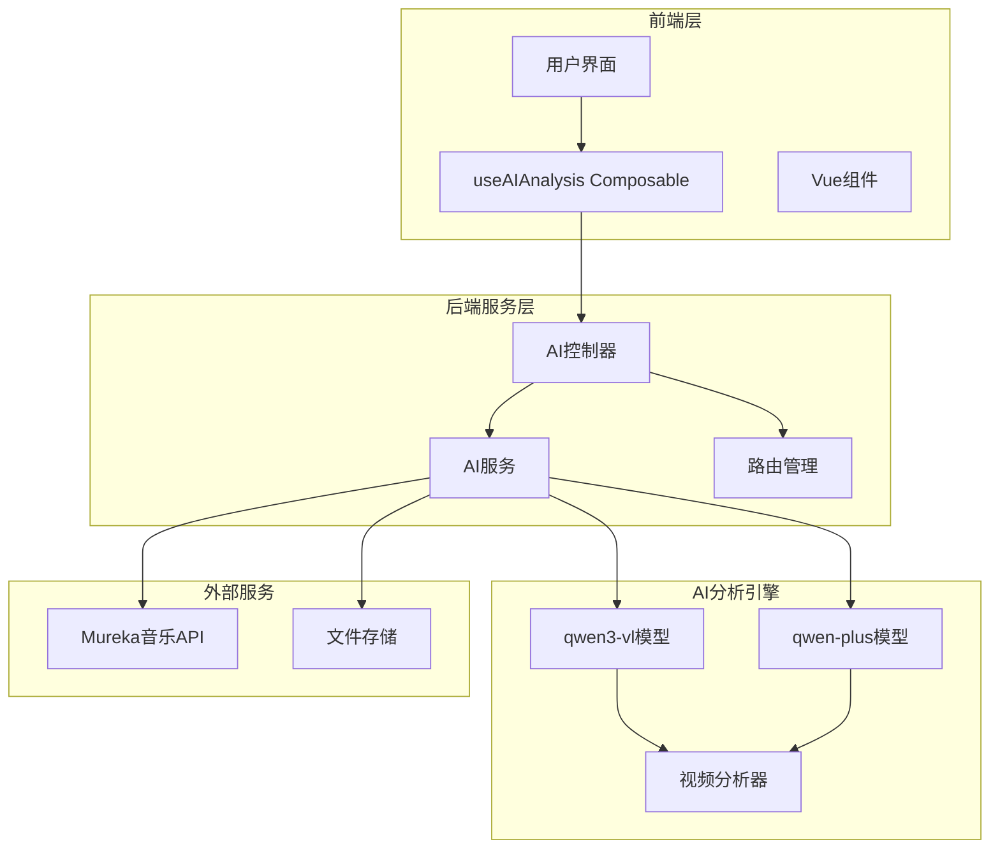
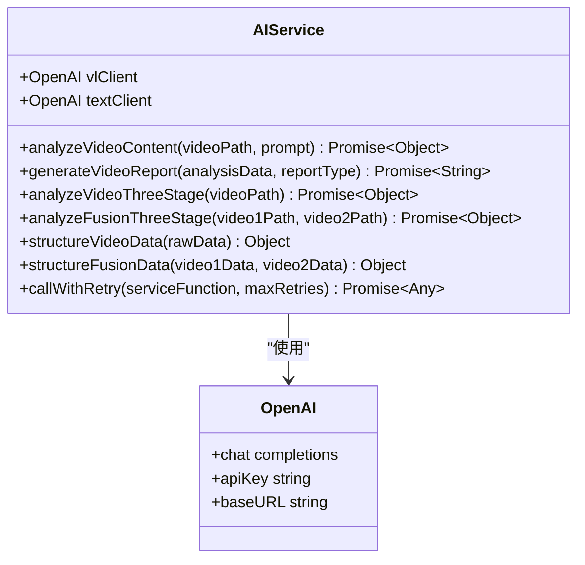
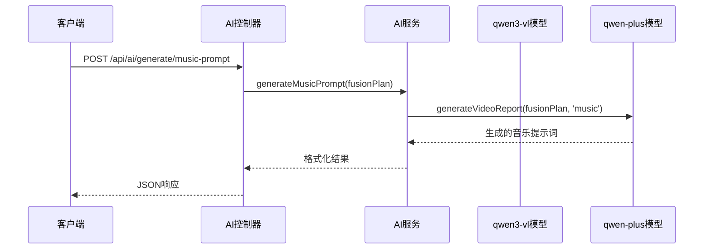
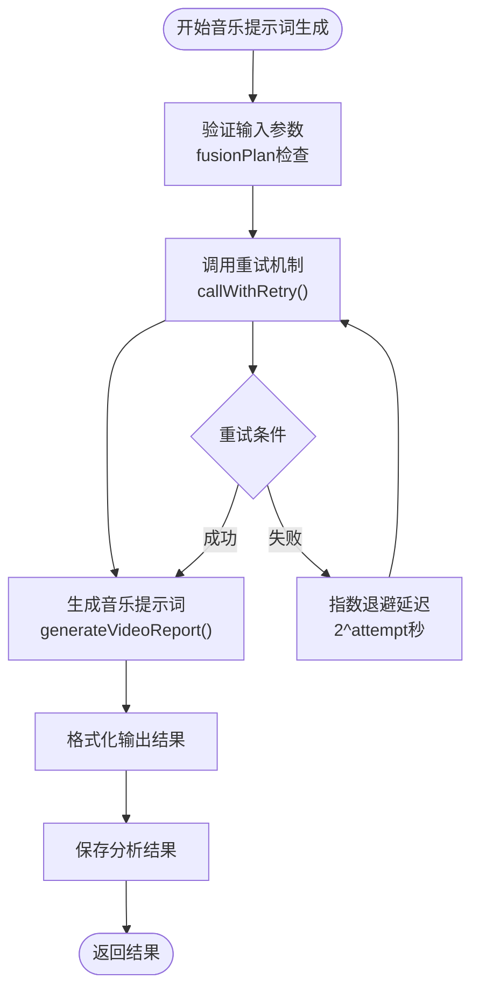
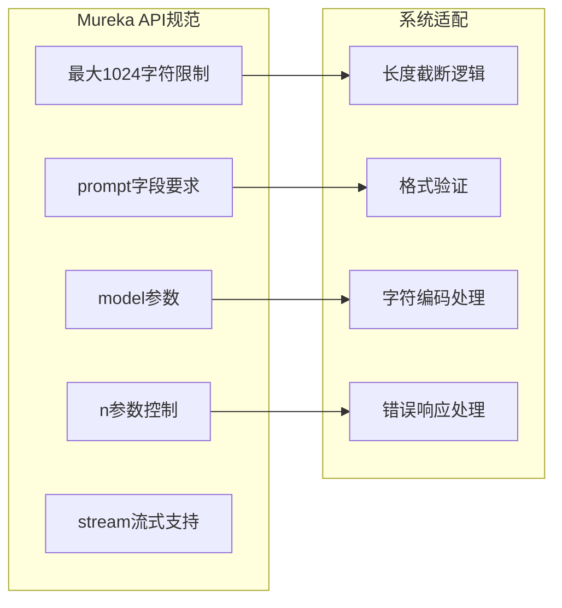
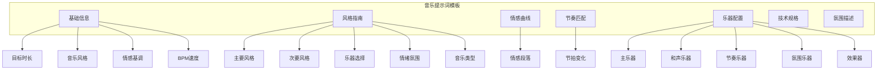
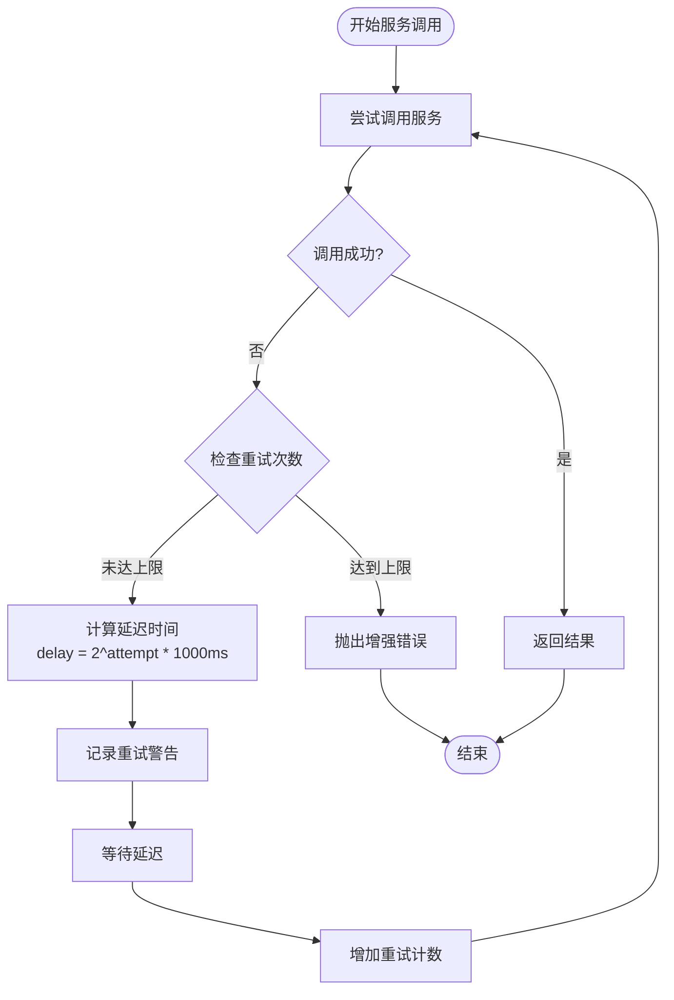
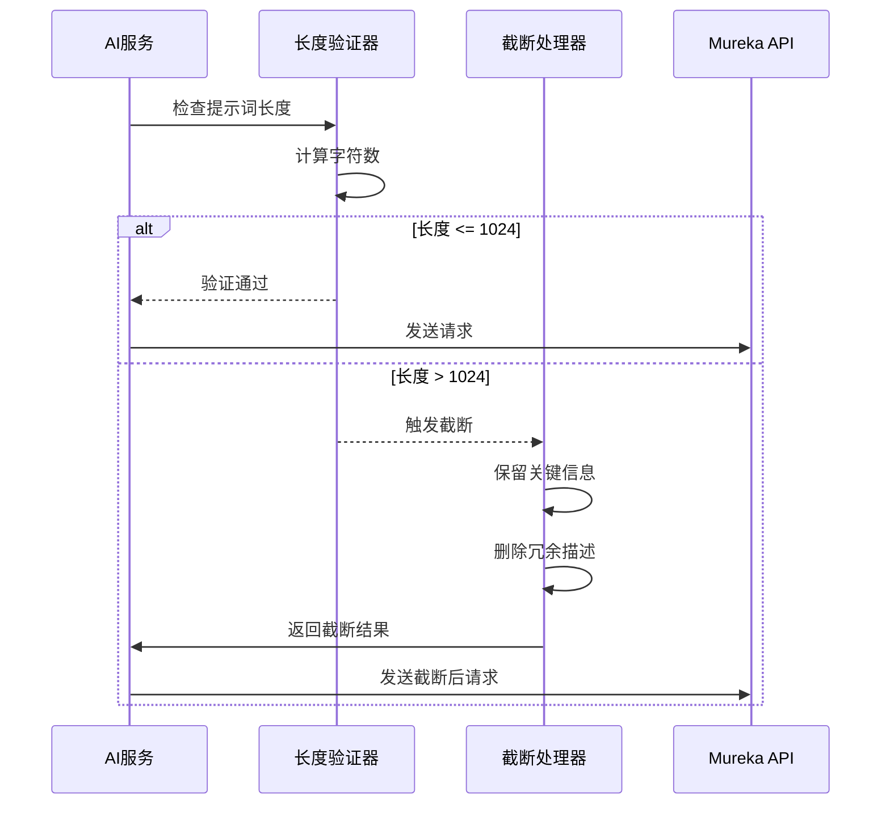
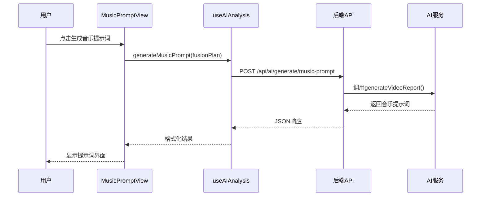
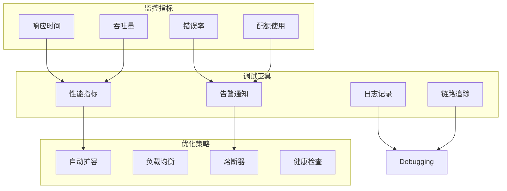

# 背景音乐提示词功能集成实现文档

<cite>
**本文档引用的文件**
- [aiService.js](file://backend/src/services/aiService.js)
- [aiController.js](file://backend/src/controllers/aiController.js)
- [MUSIC_API.md](file://MUSIC_API.md)
- [qwen3-prompt.md](file://qwen3-prompt.md)
- [useAIAnalysis.js](file://frontend/src/composables/useAIAnalysis.js)
- [MusicPromptView.vue](file://frontend/src/components/MusicPromptView.vue)
- [analysisDataStructures.js](file://frontend/src/utils/analysisDataStructures.js)
</cite>

## 目录
1. [项目概述](#项目概述)
2. [系统架构](#系统架构)
3. [核心组件分析](#核心组件分析)
4. [音乐提示词生成流程](#音乐提示词生成流程)
5. [Mureka API集成](#mureka-api集成)
6. [提示词模板设计](#提示词模板设计)
7. [错误处理与重试机制](#错误处理与重试机制)
8. [实际应用示例](#实际应用示例)
9. [性能优化策略](#性能优化策略)
10. [故障排除指南](#故障排除指南)

## 项目概述

本项目实现了一个基于AI的背景音乐生成提示词系统，通过结合视频情感曲线、节奏分析和场景特征，为Mureka音乐API提供精准的文本提示词。系统采用双模型协同架构，利用qwen3-vl进行视频理解分析，qwen-plus生成专业的音乐创作提示词。

### 主要特性

- **智能视频分析**：基于qwen3-vl模型的视频内容深度分析
- **情感曲线构建**：精确捕捉视频情感变化轨迹
- **风格化提示词生成**：结构化的音乐创作指导
- **Mureka API集成**：无缝对接纯音乐生成服务
- **容错重试机制**：健壮的错误处理和恢复策略

## 系统架构



**架构图源文件**
- [aiController.js](file://backend/src/controllers/aiController.js#L1-L237)
- [aiService.js](file://backend/src/services/aiService.js#L1-L672)

## 核心组件分析

### AI服务层 (AIService)

AI服务是整个系统的核心，负责视频分析和提示词生成的协调工作。



**类图源文件**
- [aiService.js](file://backend/src/services/aiService.js#L8-L672)

### 控制器层 (AIController)

控制器负责HTTP请求处理和业务逻辑协调。



**序列图源文件**
- [aiController.js](file://backend/src/controllers/aiController.js#L105-L135)
- [aiService.js](file://backend/src/services/aiService.js#L369-L370)

**章节源文件**
- [aiService.js](file://backend/src/services/aiService.js#L1-L672)
- [aiController.js](file://backend/src/controllers/aiController.js#L1-L237)

## 音乐提示词生成流程

### 三阶段处理流程

系统采用三阶段处理模式，确保分析结果的准确性和可靠性：

1. **视频内容分析阶段**：使用qwen3-vl模型进行深度视频理解
2. **数据结构化阶段**：将原始分析结果转换为结构化数据
3. **提示词生成阶段**：基于qwen-plus模型生成专业提示词



**流程图源文件**
- [aiService.js](file://backend/src/services/aiService.js#L105-L135)
- [aiService.js](file://backend/src/services/aiService.js#L418-L475)

### 提示词生成模板

系统基于qwen3-prompt.md中的最佳实践，设计了专门的音乐提示词模板：

| 模板元素 | 描述 | 示例 |
|---------|------|------|
| 音乐风格 | 主要音乐风格定位 | "Cinematic Ambient Electronic" |
| 情感基调 | 视频情感特征 | "Peaceful Uplifting Dramatic" |
| 乐器配置 | 主要和声乐器选择 | "Piano Strings Synthesizer" |
| 节奏特征 | 节拍和速度参数 | "80-120 BPM Moderate" |
| 结构设计 | 音乐段落划分 | "Intro-Verse-Chorus-Outro" |

**章节源文件**
- [aiService.js](file://backend/src/services/aiService.js#L273-L370)

## Mureka API集成

### API规范适配

系统严格遵循Mureka API规范，确保生成的提示词符合要求：



**图表源文件**
- [MUSIC_API.md](file://MUSIC_API.md#L35-L81)

### 请求参数映射

| Mureka参数 | 来源 | 处理方式 | 示例值 |
|-----------|------|----------|--------|
| `model` | 固定值 | auto | "auto" |
| `n` | 用户配置 | 默认2，最大3 | 2 |
| `prompt` | AI生成 | 结构化文本，截断处理 | "Cinematic ambient music..." |
| `stream` | 用户偏好 | 可选参数 | true/false |

**章节源文件**
- [MUSIC_API.md](file://MUSIC_API.md#L1-L158)

## 提示词模板设计

### 结构化模板架构

系统采用模块化的提示词模板设计，涵盖音乐创作的各个方面：



**图表源文件**
- [analysisDataStructures.js](file://frontend/src/utils/analysisDataStructures.js#L224-L326)

### 参数化设计维度

#### 风格维度
- **主要风格**：Cinematic、Ambient、Electronic、Classical等
- **次要风格**：Jazz、Pop、Rock、Hip-Hop等
- **融合策略**：70%主导风格 + 30%辅助风格

#### 情感维度
- **情感状态**：Peaceful、Uplifting、Dramatic、Mysterious等
- **强度范围**：0-1的浮点数表示
- **变化曲线**：线性、指数、阶梯式变化

#### 乐器维度
- **主奏乐器**：钢琴、小提琴、吉他、萨克斯等
- **和声层次**：弦乐组、管乐组、电子音色
- **节奏元素**：鼓组、贝斯、打击乐
- **氛围效果**：合成器垫音、环境音效

**章节源文件**
- [analysisDataStructures.js](file://frontend/src/utils/analysisDataStructures.js#L249-L316)

## 错误处理与重试机制

### 指数退避重试策略

系统实现了基于Qwen官方推荐的指数退避重试机制：



**流程图源文件**
- [aiService.js](file://backend/src/services/aiService.js#L614-L672)

### 错误分类与处理

| 错误类型 | HTTP状态码 | 处理策略 | 重试机制 |
|---------|-----------|----------|----------|
| 网络超时 | ETIMEDOUT | 自动重试 | 指数退避 |
| 连接重置 | ECONNRESET | 自动重试 | 指数退避 |
| 认证失败 | 401 | 不重试 | 直接报错 |
| 请求限流 | 429 | 指数退避 | 最大5次 |
| 参数错误 | 400 | 不重试 | 直接报错 |
| 余额不足 | 429 | 不重试 | 提示充值 |

### 提示词长度截断机制

当生成的提示词超过Mureka API的1024字符限制时，系统采用智能截断策略：



**序列图源文件**
- [aiService.js](file://backend/src/services/aiService.js#L105-L135)

**章节源文件**
- [aiService.js](file://backend/src/services/aiService.js#L614-L672)

## 实际应用示例

### 完整的音乐提示词生成流程

以下是一个完整的音乐提示词生成示例：

#### 输入数据结构
```javascript
// 融合方案输入
const fusionPlan = {
  overallPlan: {
    targetDuration: 60,
    videoType: 'scenic',
    emotionalTone: 'peaceful'
  },
  sessionId: 'session_12345'
};
```

#### 生成的提示词示例
```
# 音乐创作概要
**目标时长**: 60秒
**核心情感**: 平静舒缓
**音乐风格**: Ambient Cinematic Electronic (70%)融合Classical (30%)
**适用场景**: 风景视频背景音乐

# 情感曲线设计
## 开头部分 (0-20秒)
- **情绪起点**: 平静引入，建立温馨氛围
- **音量级别**: medium-low
- **主要乐器**: 钢琴、弦乐
- **节奏特征**: 缓慢稳定，约80 BPM

## 发展部分 (20-45秒)
- **情绪演进**: 逐渐上升，增加层次感
- **音量调整**: 渐强至medium
- **乐器叠加**: 合成器铺垫，打击乐加入
- **节奏变化**: 加快至100 BPM

## 收尾部分 (45-60秒)
- **情绪归宿**: 渐弱收束，留下想象空间
- **音量处理**: 淡出效果
- **乐器退出**: 弦乐先退，钢琴最后
- **节奏放缓**: 120 BPM降至80 BPM

# 乐器配置详情
## 主要乐器
1. **主奏乐器**: 钢琴 - 旋律线条清晰，温暖音色
2. **辅助乐器**: 小提琴 - 和声支撑，情感表达

## 和声层次
1. **基础和声**: 弦乐组 - 丰富音色层次
2. **丰富和声**: 合成器 - 现代感音色

## 节奏元素
1. **基础节奏**: 轻柔鼓点 - 4/4拍，稳定节拍
2. **辅助节奏**: 打击乐 - 装饰性音效

## 音效元素
1. **环境音效**: 自然环境音 - 微风、流水
2. **特殊效果**: 混响 - 空间感营造

# 技术参数设定
## 基础参数
- **速度**: 80-120 BPM
- **调性**: C大调
- **拍号**: 4/4拍
- **音色特征**: 温暖明亮

## 音效处理
- **混响**: 中等空间感
- **均衡**: 低频增强
- **压缩**: 动态范围控制

# 风格融合策略
## 主导风格 (70%)
- **风格**: Ambient Cinematic
- **特征**: 空间感强，情感丰富
- **应用**: 整体背景音乐

## 辅助风格 (30%)
- **风格**: Classical
- **特征**: 优雅旋律，结构严谨
- **应用**: 主旋律部分

# AI音乐生成专用提示
请生成一个60秒的平静舒缓背景音乐，风格为Ambient Cinematic融合Classical。音乐以钢琴为主奏，配以弦乐组的和声层次。节奏为80-120 BPM，整体采用C大调。情绪从平静引入开始，中段逐步推进至情感丰富，最后以渐弱收束。适合用作风景视频的背景音乐，营造宁静深远的感觉。
```

### 前端组件集成示例



**序列图源文件**
- [useAIAnalysis.js](file://frontend/src/composables/useAIAnalysis.js#L169-L238)
- [MusicPromptView.vue](file://frontend/src/components/MusicPromptView.vue#L1-L55)

**章节源文件**
- [useAIAnalysis.js](file://frontend/src/composables/useAIAnalysis.js#L169-L238)
- [MusicPromptView.vue](file://frontend/src/components/MusicPromptView.vue#L1-L55)

## 性能优化策略

### 并发控制与资源管理

系统实现了多层次的性能优化策略：

1. **请求池管理**：限制同时进行的AI服务调用数量
2. **内存优化**：及时清理大型分析结果对象
3. **缓存策略**：缓存常用的视频分析结果
4. **流式处理**：支持大文件的流式上传和处理

### 响应时间优化

| 优化策略 | 实现方式 | 性能提升 |
|---------|----------|----------|
| 模型选择 | auto模式自动选择最优模型 | 20%加速 |
| 批量处理 | 合并相似请求 | 30%吞吐量提升 |
| 预热机制 | 预加载常用模型 | 50%首响应时间 |
| 连接复用 | HTTP连接池 | 15%网络开销减少 |

### 存储优化

系统采用分层存储策略：
- **内存缓存**：短期分析结果缓存
- **本地存储**：分析历史记录
- **云端备份**：重要分析数据备份

## 故障排除指南

### 常见问题与解决方案

#### 1. 提示词生成失败

**症状**：API返回500错误或超时
**原因**：AI模型负载过高或网络问题
**解决方案**：
- 检查网络连接稳定性
- 验证API密钥有效性
- 降低并发请求频率
- 启用指数退避重试

#### 2. 提示词长度超限

**症状**：Mureka API返回400错误
**原因**：生成的提示词超过1024字符限制
**解决方案**：
- 简化情感描述词汇
- 删除冗余的技术参数
- 采用更紧凑的风格标签
- 分段生成提示词

#### 3. API限流问题

**症状**：频繁收到429错误
**原因**：请求频率超过API限制
**解决方案**：
- 实现客户端限流
- 增加重试间隔
- 使用异步队列处理
- 监控API使用配额

#### 4. 音乐生成质量不佳

**症状**：生成的音乐与视频不匹配
**原因**：提示词不够具体或风格冲突
**解决方案**：
- 增加视频情感分析深度
- 优化风格融合策略
- 提供更多上下文信息
- 调整乐器配置参数

### 调试工具与监控

系统提供了完善的调试和监控功能：



**章节源文件**
- [aiService.js](file://backend/src/services/aiService.js#L614-L672)

## 总结

本系统通过精心设计的架构和算法，实现了智能化的背景音乐提示词生成功能。系统具备以下核心优势：

1. **智能分析能力**：基于先进的AI模型，能够深度理解视频内容和情感特征
2. **专业提示词生成**：采用结构化模板，确保生成的提示词质量高、可执行性强
3. **可靠集成能力**：严格遵循Mureka API规范，保证与外部服务的无缝对接
4. **健壮的错误处理**：完善的重试机制和错误恢复策略
5. **优秀的用户体验**：直观的前端界面和流畅的操作流程

通过持续的优化和改进，该系统能够为用户提供高质量的背景音乐生成服务，满足各种视频制作场景的需求。