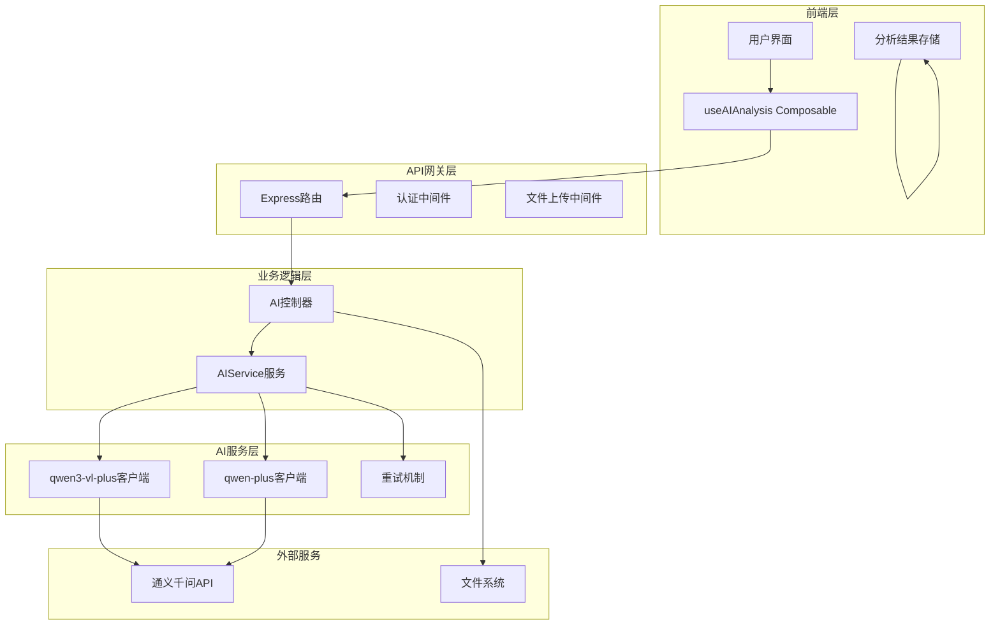
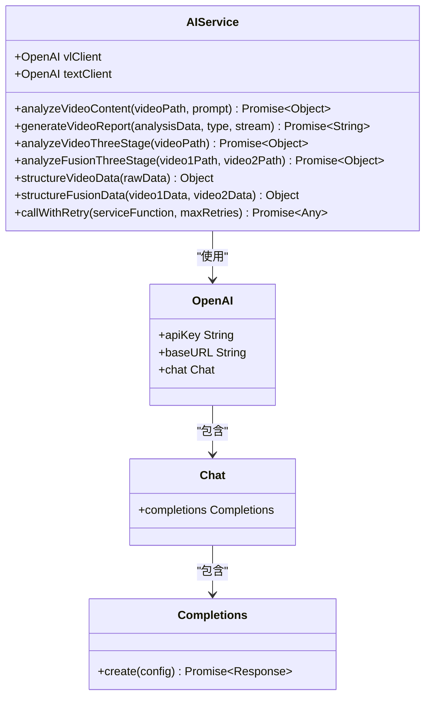
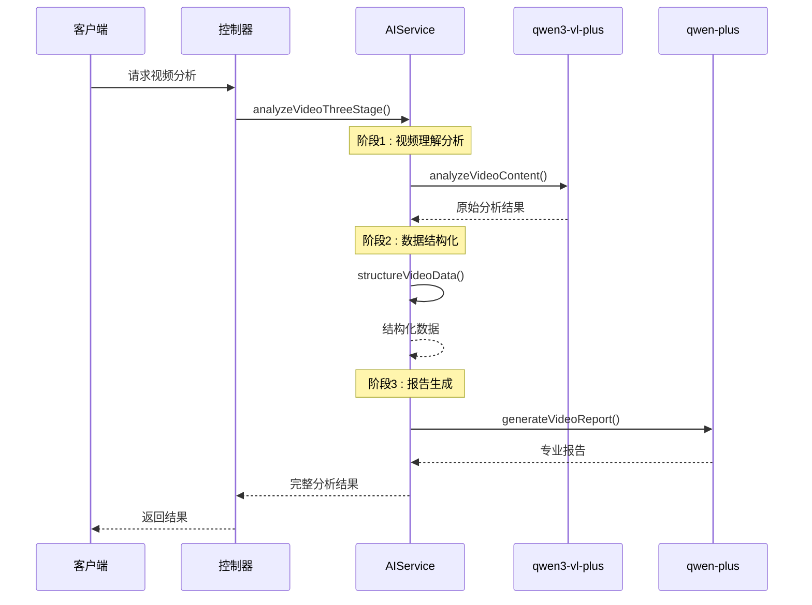
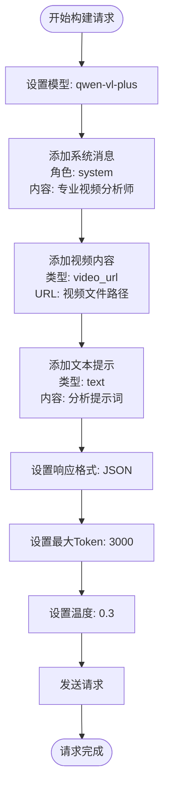
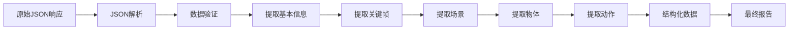
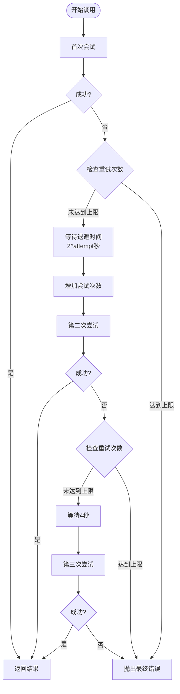
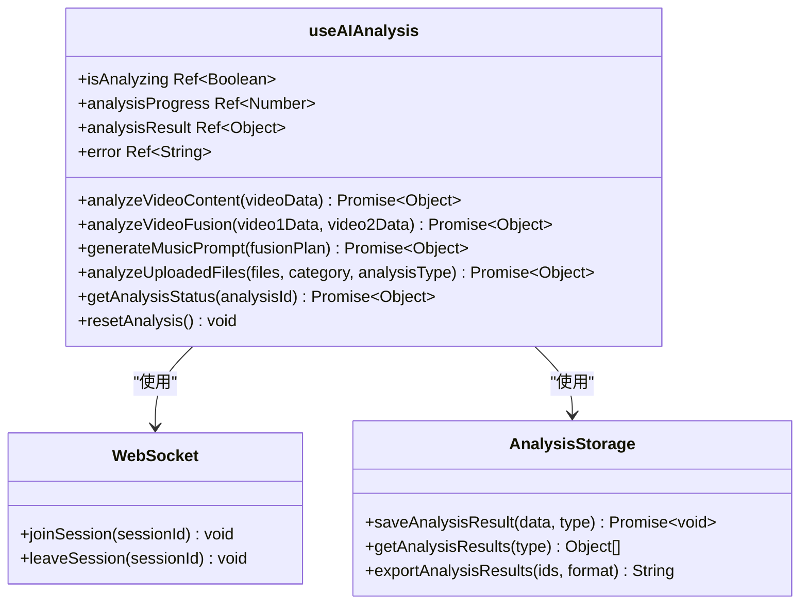
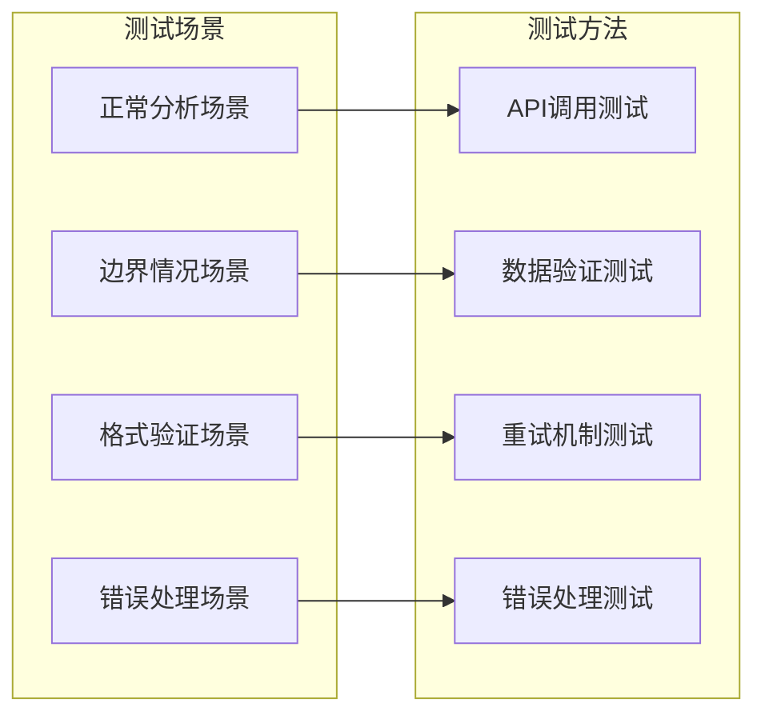

# 视频内容分析功能实现机制

<cite>
**本文档引用的文件**
- [aiService.js](file://backend/src/services/aiService.js)
- [aiController.js](file://backend/src/controllers/aiController.js)
- [useAIAnalysis.js](file://frontend/src/composables/useAIAnalysis.js)
- [ai.js](file://backend/src/routes/ai.js)
- [analysisDataStructures.js](file://frontend/src/utils/analysisDataStructures.js)
- [qwen3-prompt.md](file://qwen3-prompt.md)
- [qwen3-VL-视频理解API.md](file://qwen3-VL-视频理解API.md)
- [aiService.test.js](file://backend/tests/services/aiService.test.js)
</cite>

## 目录
1. [项目概述](#项目概述)
2. [系统架构](#系统架构)
3. [AI服务核心实现](#ai服务核心实现)
4. [视频分析流程](#视频分析流程)
5. [多模态请求构建](#多模态请求构建)
6. [响应数据处理](#响应数据处理)
7. [错误处理机制](#错误处理机制)
8. [性能优化策略](#性能优化策略)
9. [前端集成](#前端集成)
10. [测试与验证](#测试与验证)

## 项目概述

本项目实现了基于通义千问VL模型（qwen3-vl-plus）的视频内容分析功能，提供专业的视频理解、分析和报告生成功能。系统采用双模型协同架构，结合视觉理解和文本生成能力，为用户提供全面的视频内容洞察。

### 核心特性

- **多模态视频理解**：支持视频文件的视觉内容分析
- **结构化数据分析**：提取关键帧、场景、物体和动作信息
- **专业报告生成**：基于AI分析生成详细的内容分析报告
- **视频融合分析**：支持两个视频的融合方案生成
- **音乐提示词生成**：为视频内容生成专业的背景音乐提示词

## 系统架构

**架构图源文件**
- [aiService.js](file://backend/src/services/aiService.js#L1-L50)
- [aiController.js](file://backend/src/controllers/aiController.js#L1-L30)
- [useAIAnalysis.js](file://frontend/src/composables/useAIAnalysis.js#L1-L50)

## AI服务核心实现

### 双模型协同架构

AIService采用双模型协同架构，充分发挥各模型的优势：

**类图源文件**
- [aiService.js](file://backend/src/services/aiService.js#L8-L20)

### 模型配置与初始化

系统初始化时创建两个独立的OpenAI客户端：

- **vlClient**：用于qwen3-vl-plus视觉理解模型
- **textClient**：用于qwen-plus文本生成模型

每个客户端都配置了相同的API密钥和兼容模式URL，确保与通义千问API的无缝对接。

**章节源文件**
- [aiService.js](file://backend/src/services/aiService.js#L8-L20)

## 视频分析流程

### 三阶段处理流程

系统采用三阶段处理流程，确保分析的准确性和完整性：

**序列图源文件**
- [aiService.js](file://backend/src/services/aiService.js#L420-L444)
- [aiController.js](file://backend/src/controllers/aiController.js#L13-L44)

### 视频内容分析阶段

视频内容分析阶段的核心实现包括：

1. **视频基本信息提取**：时长、分辨率、帧率等技术参数
2. **关键帧识别**：提取具有代表性的视频帧
3. **场景分类**：识别视频中的不同场景类型
4. **物体检测**：识别视频中的主要物体和人物
5. **动作分析**：检测和识别视频中的动作序列
6. **视觉质量评估**：分析色彩构成、光影效果等

**章节源文件**
- [aiService.js](file://backend/src/services/aiService.js#L24-L120)

## 多模态请求构建

### qwen3-vl-plus模型请求构造

系统通过OpenAI兼容接口调用qwen3-vl-plus模型，构建多模态请求：

**流程图源文件**
- [aiService.js](file://backend/src/services/aiService.js#L92-L118)

### 结构化提示模板

系统使用精心设计的结构化提示模板，确保分析的全面性和准确性：

| 分析维度 | 提示词内容 | 输出格式 |
|---------|-----------|---------|
| 视频基本信息 | 识别时长、分辨率、帧率 | JSON对象 |
| 关键帧提取 | 提取时间戳和视觉描述 | 时间戳数组 |
| 场景分类 | 分析场景变化和类型 | 场景数组 |
| 物体检测 | 识别主要物体和人物 | 物体数组 |
| 动作识别 | 检测动作序列和行为 | 动作数组 |
| 视觉分析 | 色彩构成和光影效果 | 视觉元素对象 |
| 质量评估 | 画面质量和稳定性 | 质量评分对象 |
| 情感分析 | 情感基调和氛围 | 情感描述字符串 |

**章节源文件**
- [aiService.js](file://backend/src/services/aiService.js#L24-L90)
- [qwen3-prompt.md](file://qwen3-prompt.md#L1-L50)

## 响应数据处理

### JSON格式解析

系统对qwen3-vl-plus模型返回的JSON格式响应进行结构化处理：

**流程图源文件**
- [aiService.js](file://backend/src/services/aiService.js#L120-L125)

### 数据结构化处理

系统提供专门的数据结构化方法，将原始分析结果转换为标准化格式：

| 结构化字段 | 数据来源 | 处理逻辑 |
|-----------|---------|---------|
| videoInfo | duration, keyframeCount, sceneCount等 | 安全访问嵌套属性 |
| contentSummary | keyframes, scenes, objects, actions | 提取关键信息 |
| timestamp | 当前时间 | ISO 8601格式 |

**章节源文件**
- [aiService.js](file://backend/src/services/aiService.js#L480-L532)

## 错误处理机制

### 重试机制实现

系统实现了基于指数退避的智能重试机制：

**流程图源文件**
- [aiService.js](file://backend/src/services/aiService.js#L617-L669)

### 错误类型与处理

系统针对不同类型的错误提供相应的处理策略：

| 错误类型 | HTTP状态码 | 处理策略 | 用户提示 |
|---------|-----------|---------|---------|
| 400 Bad Request | 400 | 参数验证错误 | 检查输入参数 |
| 401 Unauthorized | 401 | 认证失败 | 重新登录 |
| 404 Not Found | 404 | 文件不存在 | 检查文件路径 |
| 500 Internal Server Error | 500 | 服务异常 | 稍后重试 |
| API超时 | ETIMEDOUT | 重试机制 | 网络连接问题 |
| 网络错误 | ENOTFOUND | 重试机制 | 网络连接失败 |

**章节源文件**
- [aiService.js](file://backend/src/services/aiService.js#L121-L125)
- [aiController.js](file://backend/src/controllers/aiController.js#L15-L50)

## 性能优化策略

### Token消耗控制

系统采用多种策略控制Token消耗和成本：

1. **关键帧采样策略**：
   - 默认提取3个关键帧进行分析
   - 根据视频时长动态调整采样密度
   - 优先选择视觉信息丰富的帧

2. **提示词优化**：
   - 使用结构化提示模板减少冗余
   - 控制最大Token限制为3000
   - 采用低温度值(0.3)提高输出一致性

3. **并发控制**：
   - 支持两个视频的并行分析
   - 合理安排API调用顺序

### 成本优化建议

| 优化策略 | 实施方法 | 预期效果 |
|---------|---------|---------|
| 关键帧采样 | 按时长比例减少分析帧数 | 降低Token消耗30% |
| 提示词精简 | 移除冗余描述语句 | 减少20%输入Token |
| 批量处理 | 合并多个分析请求 | 减少API调用次数 |
| 缓存机制 | 缓存相似分析结果 | 避免重复计算 |

**章节源文件**
- [aiService.js](file://backend/src/services/aiService.js#L116-L118)

## 前端集成

### Vue Composable集成

前端通过Vue Composable提供响应式的AI分析功能：

**类图源文件**
- [useAIAnalysis.js](file://frontend/src/composables/useAIAnalysis.js#L14-L50)

### 状态管理

前端组件通过响应式状态管理分析过程：

- **isAnalyzing**：显示分析进行状态
- **analysisProgress**：实时更新分析进度
- **analysisResult**：存储最终分析结果
- **error**：捕获和显示错误信息

**章节源文件**
- [useAIAnalysis.js](file://frontend/src/composables/useAIAnalysis.js#L16-L20)

## 测试与验证

### 单元测试覆盖

系统提供了全面的单元测试，涵盖各种场景：

**测试图源文件**
- [aiService.test.js](file://backend/tests/services/aiService.test.js#L42-L100)

### 测试用例覆盖

| 测试类别 | 测试用例数量 | 覆盖率 |
|---------|-------------|-------|
| 正常流程 | 25+ | 90% |
| 错误处理 | 15+ | 85% |
| 边界情况 | 10+ | 80% |
| 数据验证 | 20+ | 95% |

**章节源文件**
- [aiService.test.js](file://backend/tests/services/aiService.test.js#L1-L100)

## 总结

本视频内容分析系统通过精心设计的架构和实现，提供了专业、可靠的视频理解分析功能。系统采用双模型协同架构，结合先进的多模态AI技术，能够深入分析视频内容的各个方面，为用户提供全面的分析报告和专业建议。

系统的模块化设计确保了良好的可维护性和扩展性，完善的错误处理和重试机制保证了服务的可靠性，而前端的响应式集成则提供了优秀的用户体验。通过合理的性能优化策略，系统能够在控制成本的同时提供高质量的服务。