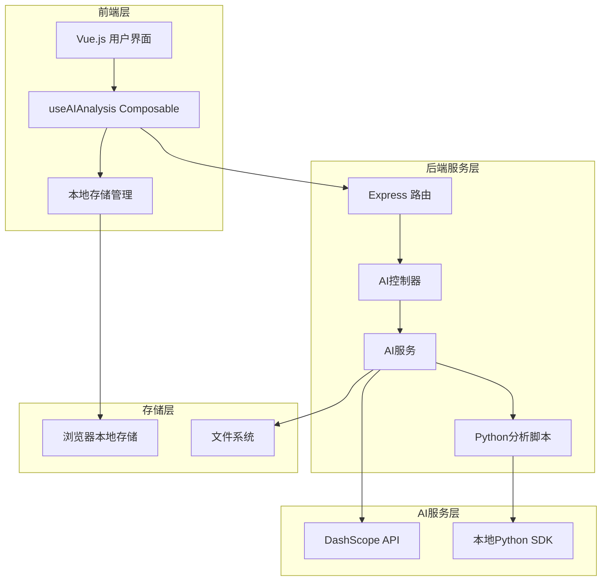
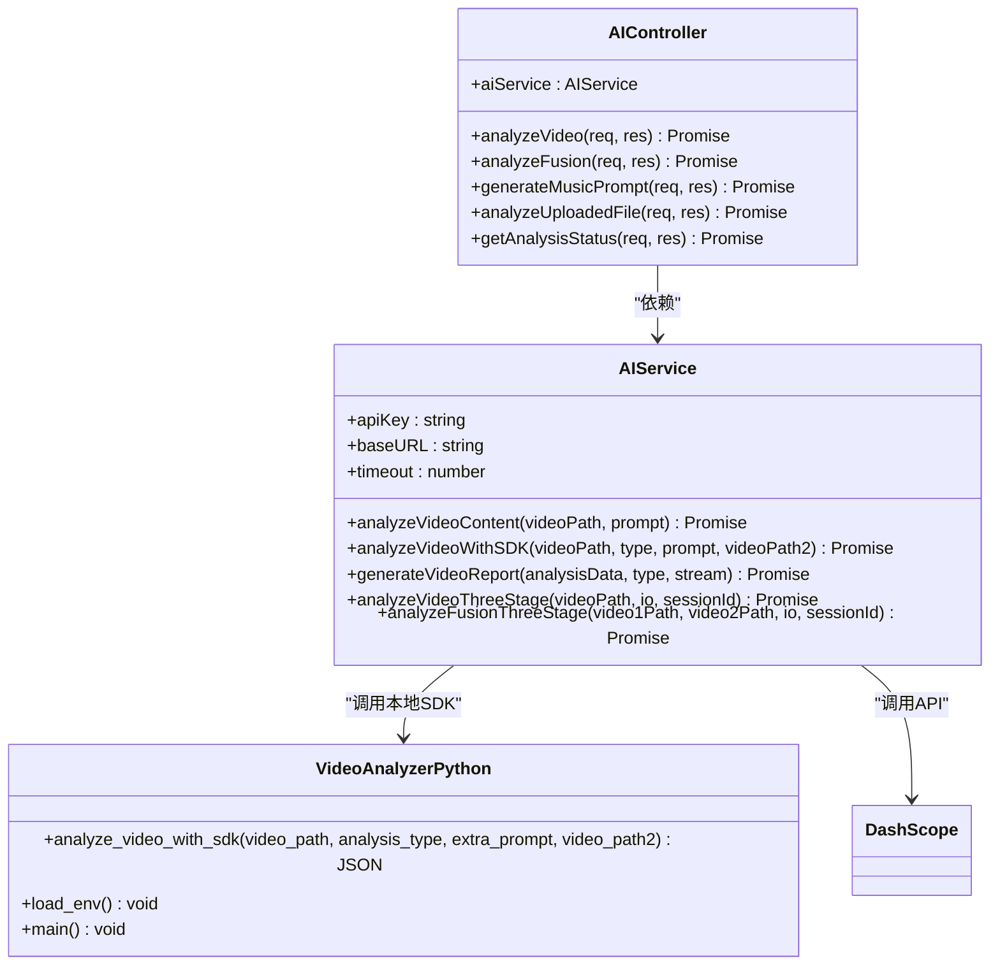
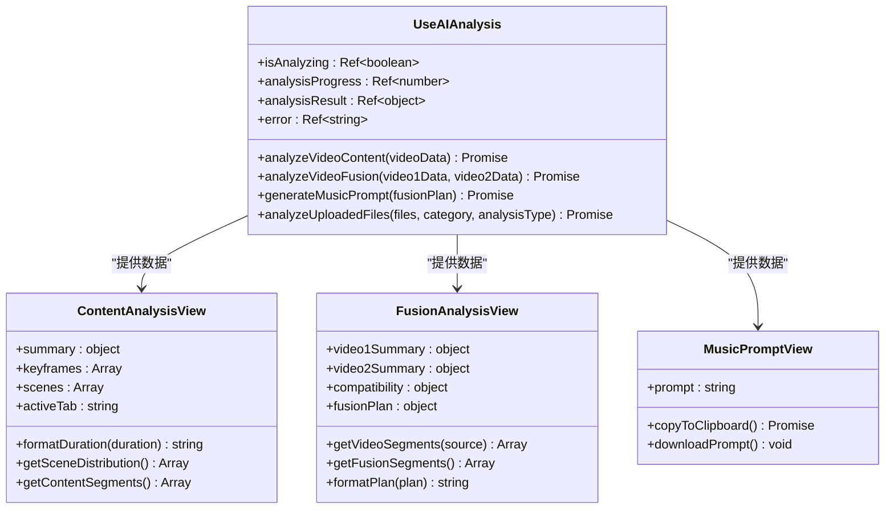
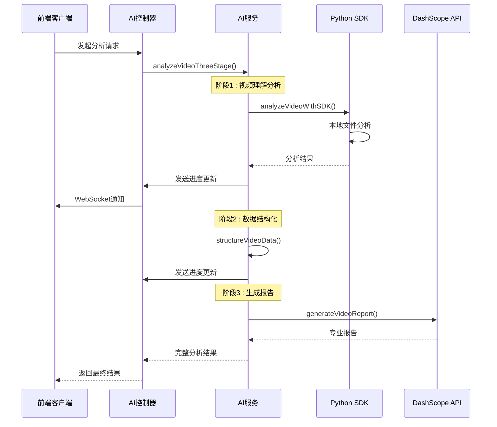
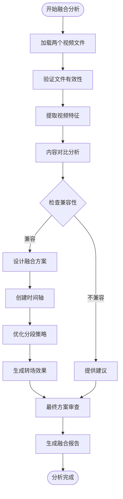
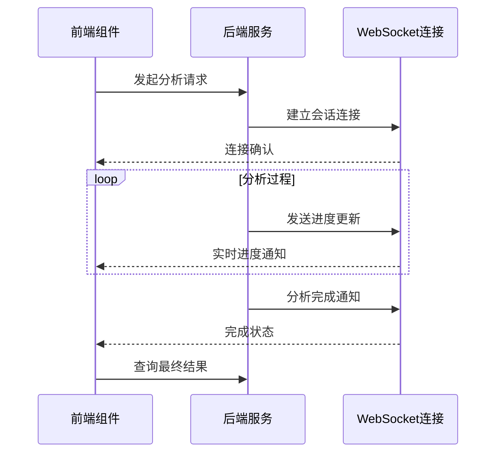
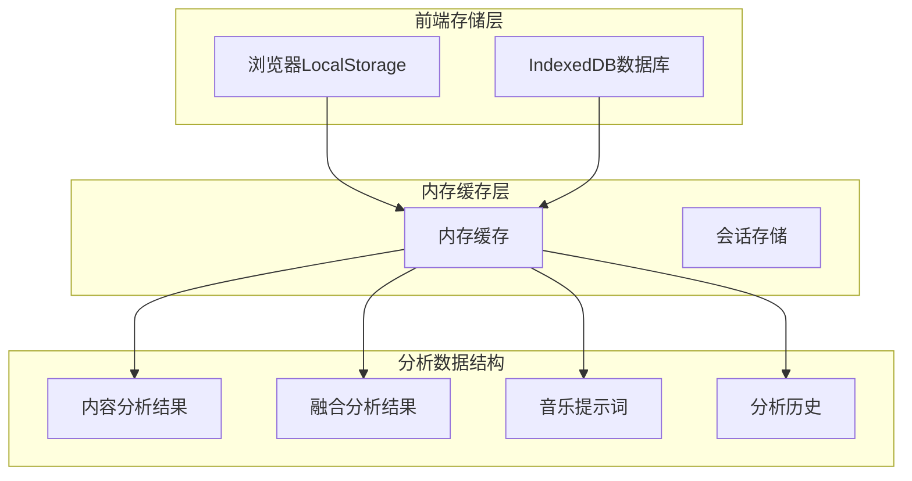
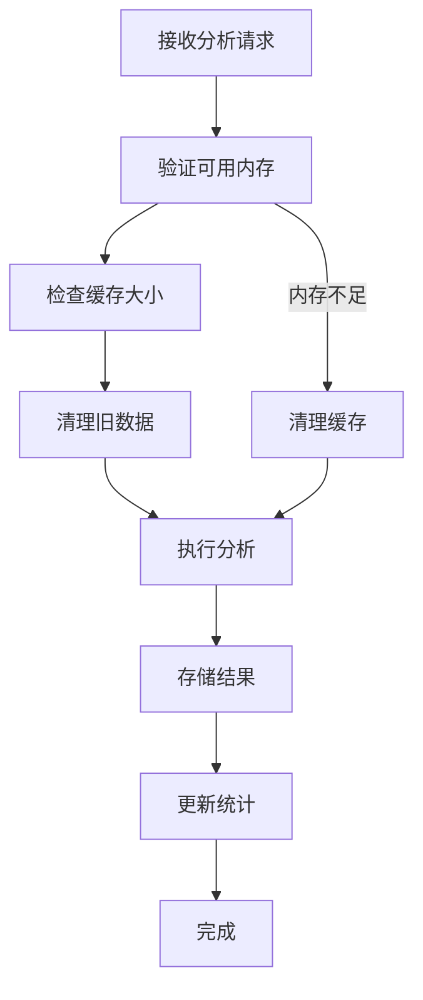
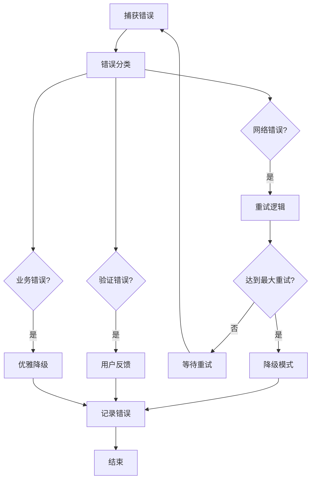

# 视频分析脚本系统文档

<cite>
**本文档引用的文件**
- [video_analyzer.py](file://backend/scripts/video_analyzer.py)
- [video_analyzer.py](file://backend/src/scripts/video_analyzer.py)
- [aiController.js](file://backend/src/controllers/aiController.js)
- [aiService.js](file://backend/src/services/aiService.js)
- [useAIAnalysis.js](file://frontend/src/composables/useAIAnalysis.js)
- [ai.js](file://backend/src/routes/ai.js)
- [upload.js](file://backend/src/config/upload.js)
- [analysisStorage.js](file://frontend/src/utils/analysisStorage.js)
- [ContentAnalysisView.vue](file://frontend/src/components/ContentAnalysisView.vue)
- [FusionAnalysisView.vue](file://frontend/src/components/FusionAnalysisView.vue)
- [MusicPromptView.vue](file://frontend/src/components/MusicPromptView.vue)
- [API.md](file://backend/API.md)
- [API_DOCS.md](file://backend/API_DOCS.md)
</cite>

## 目录
1. [项目概述](#项目概述)
2. [系统架构](#系统架构)
3. [核心组件分析](#核心组件分析)
4. [视频分析流程](#视频分析流程)
5. [前后端交互](#前后端交互)
6. [数据存储与管理](#数据存储与管理)
7. [性能优化](#性能优化)
8. [故障排除指南](#故障排除指南)
9. [总结](#总结)

## 项目概述

这是一个基于人工智能的视频分析系统，集成了阿里云DashScope多模态AI服务，提供视频内容分析、视频融合分析和背景音乐提示词生成等功能。系统采用前后端分离架构，支持实时进度跟踪和多种分析模式。

### 主要功能特性

- **视频内容分析**：深度视频内容理解，提取关键帧、场景、物体和动作信息
- **视频融合分析**：智能融合方案设计，支持双视频融合规划
- **音乐提示词生成**：基于视频内容生成专业的AI音乐创作提示词
- **实时进度跟踪**：WebSocket实现实时分析进度反馈
- **多格式支持**：支持MP4、AVI等主流视频格式
- **云端与本地结合**：结合DashScope API和本地Python SDK的优势

## 系统架构

**架构图来源**
- [aiController.js](file://backend/src/controllers/aiController.js#L1-L348)
- [aiService.js](file://backend/src/services/aiService.js#L1-L800)
- [useAIAnalysis.js](file://frontend/src/composables/useAIAnalysis.js#L1-L530)

## 核心组件分析

### 后端AI服务架构

系统采用双模型协同架构，充分利用DashScope的多模态AI能力：

**类图来源**
- [aiService.js](file://backend/src/services/aiService.js#L10-L800)
- [aiController.js](file://backend/src/controllers/aiController.js#L6-L348)
- [video_analyzer.py](file://backend/scripts/video_analyzer.py#L43-L395)

### 前端分析组件架构

**类图来源**
- [useAIAnalysis.js](file://frontend/src/composables/useAIAnalysis.js#L14-L530)
- [ContentAnalysisView.vue](file://frontend/src/components/ContentAnalysisView.vue#L1-L200)
- [FusionAnalysisView.vue](file://frontend/src/components/FusionAnalysisView.vue#L1-L200)
- [MusicPromptView.vue](file://frontend/src/components/MusicPromptView.vue#L1-L200)

**章节来源**
- [aiService.js](file://backend/src/services/aiService.js#L1-L800)
- [aiController.js](file://backend/src/controllers/aiController.js#L1-L348)
- [useAIAnalysis.js](file://frontend/src/composables/useAIAnalysis.js#L1-L530)

## 视频分析流程

### 三阶段分析流程

系统采用三阶段处理流程，确保分析质量和可靠性：

**序列图来源**
- [aiService.js](file://backend/src/services/aiService.js#L667-L785)
- [aiController.js](file://backend/src/controllers/aiController.js#L14-L90)

### 视频融合分析流程

**流程图来源**
- [aiService.js](file://backend/src/services/aiService.js#L789-L800)
- [aiController.js](file://backend/src/controllers/aiController.js#L95-L182)

**章节来源**
- [aiService.js](file://backend/src/services/aiService.js#L667-L800)
- [aiController.js](file://backend/src/controllers/aiController.js#L14-L182)

## 前后端交互

### API接口设计

系统提供了完整的RESTful API接口，支持多种分析模式：

| 接口路径 | 方法 | 功能描述 | 请求参数 |
|---------|------|----------|----------|
| `/api/ai/analyze/content` | POST | 视频内容分析 | videoPath, category, sessionId |
| `/api/ai/analyze/fusion` | POST | 视频融合分析 | video1Path, video2Path, category, sessionId |
| `/api/ai/generate/music-prompt` | POST | 音乐提示词生成 | fusionPlan |
| `/api/ai/analyze/upload` | POST | 上传文件分析 | files, category, analysisType |
| `/api/ai/analysis/{id}/status` | GET | 分析状态查询 | analysisId |

### WebSocket实时通信

系统使用Socket.io实现实时进度跟踪：

**序列图来源**
- [useAIAnalysis.js](file://frontend/src/composables/useAIAnalysis.js#L32-L135)
- [aiController.js](file://backend/src/controllers/aiController.js#L62-L74)

**章节来源**
- [ai.js](file://backend/src/routes/ai.js#L1-L54)
- [API.md](file://backend/API.md#L1-L337)
- [API_DOCS.md](file://backend/API_DOCS.md#L1-L437)

## 数据存储与管理

### 本地存储架构

系统采用多层次存储策略，确保数据的可靠性和性能：

**图表来源**
- [analysisStorage.js](file://frontend/src/utils/analysisStorage.js#L36-L534)

### 数据结构定义

系统定义了严格的数据结构来确保数据一致性：

| 数据类型 | 结构描述 | 存储键名 | 生命周期 |
|---------|----------|----------|----------|
| 内容分析结果 | 视频分析原始数据+结构化数据+报告 | `ai_analysis_results` | 7天 |
| 融合分析结果 | 双视频分析+融合方案 | `ai_analysis_results` | 7天 |
| 音乐提示词 | AI音乐创作提示词 | `ai_analysis_results` | 7天 |
| 分析历史 | 会话历史记录 | `ai_analysis_history` | 7天 |

**章节来源**
- [analysisStorage.js](file://frontend/src/utils/analysisStorage.js#L1-L534)

## 性能优化

### 并发处理机制

系统实现了多种性能优化策略：

1. **异步处理**：所有AI分析任务都采用异步处理
2. **超时控制**：设置合理的超时时间防止长时间等待
3. **重试机制**：自动重试失败的API调用
4. **缓存策略**：智能缓存常用分析结果
5. **资源限制**：文件大小和数量限制

### 内存管理

**流程图来源**
- [analysisStorage.js](file://frontend/src/utils/analysisStorage.js#L443-L476)

## 故障排除指南

### 常见问题及解决方案

| 问题类型 | 症状描述 | 可能原因 | 解决方案 |
|---------|----------|----------|----------|
| API调用失败 | 分析请求超时 | 网络连接问题/DashScope服务异常 | 检查网络连接，使用降级模式 |
| 文件上传失败 | 上传进度卡住 | 文件过大/格式不支持 | 检查文件格式和大小限制 |
| 分析结果为空 | 返回空数据 | 视频文件损坏/格式不支持 | 验证视频文件完整性 |
| WebSocket连接失败 | 实时进度无更新 | 网络防火墙/代理问题 | 检查网络配置 |

### 错误处理机制

系统实现了完善的错误处理机制：

**章节来源**
- [aiService.js](file://backend/src/services/aiService.js#L199-L202)
- [aiController.js](file://backend/src/controllers/aiController.js#L76-L89)

## 总结

该视频分析脚本系统是一个功能完整、架构合理的人工智能视频分析解决方案。系统通过前后端分离架构、双模型协同处理、实时进度跟踪等技术手段，提供了高质量的视频分析服务。

### 主要优势

1. **技术先进性**：集成最新的AI多模态技术
2. **用户体验**：实时进度跟踪和直观的可视化展示
3. **可靠性**：完善的错误处理和降级机制
4. **扩展性**：模块化设计便于功能扩展
5. **性能优化**：多层次缓存和并发处理

### 应用前景

该系统可广泛应用于视频内容审核、媒体制作、教育培训、广告创意等多个领域，为用户提供智能化的视频分析解决方案。