# 视频融合方案设计功能技术实现文档

<cite>
**本文档引用的文件**
- [aiService.js](file://backend/src/services/aiService.js)
- [qwen3-prompt.md](file://qwen3-prompt.md)
- [useAIAnalysis.js](file://frontend/src/composables/useAIAnalysis.js)
- [analysisDataStructures.js](file://frontend/src/utils/analysisDataStructures.js)
- [aiController.js](file://backend/src/controllers/aiController.js)
- [FusionAnalysisView.vue](file://frontend/src/components/FusionAnalysisView.vue)
- [API.md](file://backend/API.md)
- [API_DOCS.md](file://backend/API_DOCS.md)
</cite>

## 目录
1. [引言](#引言)
2. [系统架构概览](#系统架构概览)
3. [AI服务核心组件](#ai服务核心组件)
4. [视频融合分析流程](#视频融合分析流程)
5. [提示词工程设计](#提示词工程设计)
6. [数据结构与后处理](#数据结构与后处理)
7. [前端交互界面](#前端交互界面)
8. [API接口设计](#api接口设计)
9. [性能优化与重试机制](#性能优化与重试机制)
10. [提示词工程优化](#提示词工程优化)
11. [总结](#总结)

## 引言

视频融合方案设计功能是一个基于通义千问大模型的智能视频编辑辅助系统，通过AI技术将两个视频的内容分析结果转化为专业的融合制作方案。该系统采用双模型协同架构，结合qwen3-vl视觉理解和qwen-plus文本生成能力，为用户提供从视频内容分析到融合方案生成的一站式解决方案。

系统的核心价值在于：
- **智能化分析**：利用AI深度理解视频内容，提取关键信息
- **专业化方案**：生成符合专业制作标准的融合方案
- **可视化呈现**：直观展示融合策略和时间轴设计
- **可操作性强**：提供具体的制作指导和参数配置

## 系统架构概览

视频融合方案设计系统采用前后端分离架构，通过微服务化设计实现功能模块的解耦和扩展。

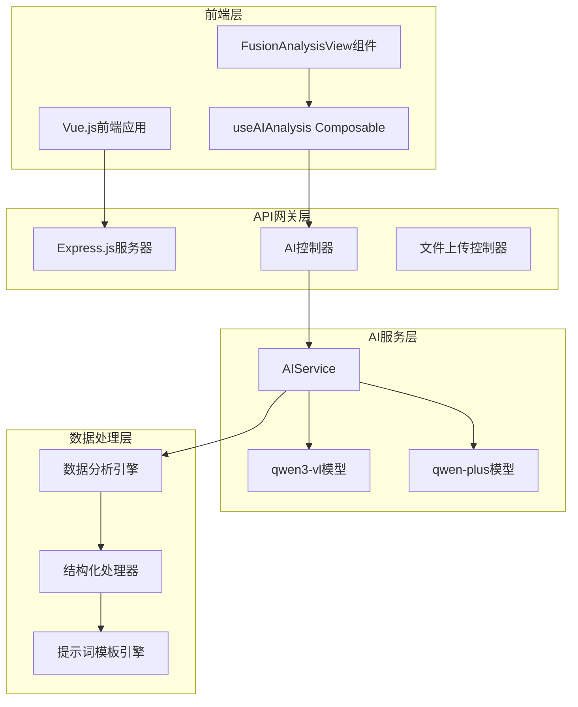

**架构图源文件**
- [aiService.js](file://backend/src/services/aiService.js#L1-L50)
- [aiController.js](file://backend/src/controllers/aiController.js#L1-L30)

**章节源文件**
- [aiService.js](file://backend/src/services/aiService.js#L1-L100)
- [aiController.js](file://backend/src/controllers/aiController.js#L1-L50)

## AI服务核心组件

### 双模型协同架构

AI服务采用双模型协同工作模式，充分发挥各模型的优势：

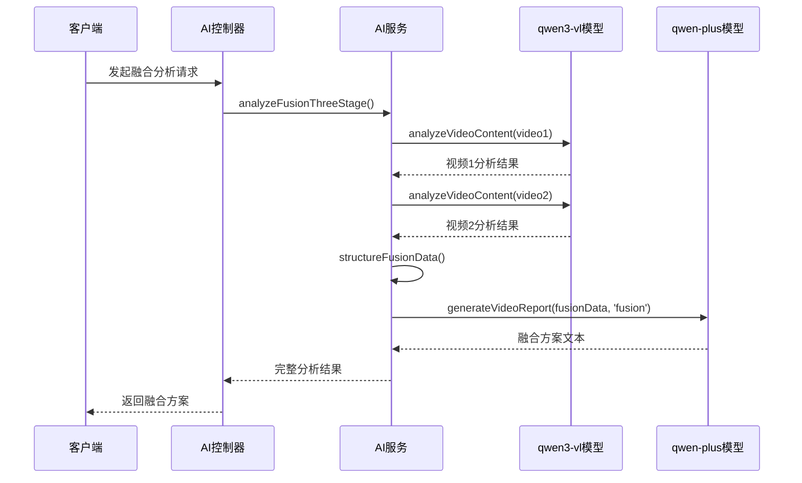

**序列图源文件**
- [aiService.js](file://backend/src/services/aiService.js#L448-L475)
- [aiController.js](file://backend/src/controllers/aiController.js#L57-L92)

### 视频内容分析模块

qwen3-vl模型负责深度视频内容理解，提取结构化信息：

| 分析维度 | 输出格式 | 用途 |
|---------|---------|------|
| 视频基本信息 | JSON对象 | 时长、分辨率、帧率统计 |
| 关键帧提取 | 时间戳+描述 | 画面内容识别和重要性评估 |
| 场景分类 | 类型+描述+氛围 | 叙事逻辑分析和转场设计 |
| 物体检测 | 名称+置信度+时间 | 内容元素识别和关联分析 |
| 动作序列 | 动作描述+参与者 | 行为模式分析和节奏把握 |
| 视觉分析 | 色彩+光影+构图 | 视觉风格统一和美学评估 |
| 质量评估 | 清晰度+稳定性评分 | 技术参数对比和优化建议 |

**章节源文件**
- [aiService.js](file://backend/src/services/aiService.js#L24-L120)

### 文本生成模块

qwen-plus模型基于视频分析结果生成专业的融合方案：

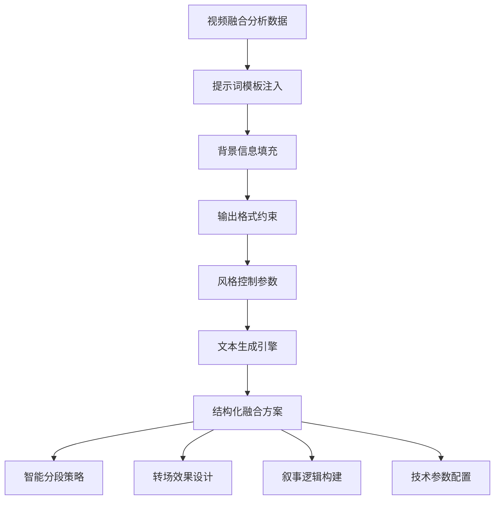

**流程图源文件**
- [aiService.js](file://backend/src/services/aiService.js#L127-L410)

**章节源文件**
- [aiService.js](file://backend/src/services/aiService.js#L127-L270)

## 视频融合分析流程

### 三阶段处理流程

系统采用三阶段处理模式，确保分析结果的质量和可靠性：

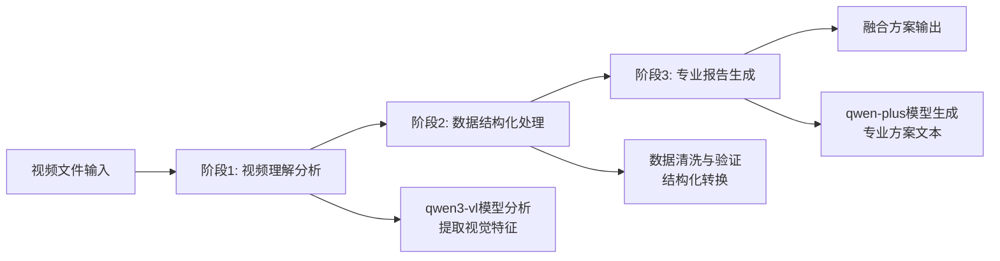

**流程图源文件**
- [aiService.js](file://backend/src/services/aiService.js#L418-L475)

### 融合数据整合

系统将两个视频的分析结果进行智能整合：

| 整合维度 | 处理策略 | 输出结果 |
|---------|---------|---------|
| 内容兼容性 | 场景类型匹配分析 | 兼容性评分和推荐方案 |
| 技术对齐 | 时长差值计算 | 对齐建议和处理方案 |
| 风格统一 | 视觉特征对比 | 风格兼容性评估 |
| 时间协调 | 总时长计算 | 目标时长规划 |

**章节源文件**
- [aiService.js](file://backend/src/services/aiService.js#L537-L610)

## 提示词工程设计

### qwen3-prompt.md中的提示词模板

提示词工程是系统输出质量的关键因素，基于qwen3-prompt.md中的最佳实践设计：

#### 背景信息注入策略

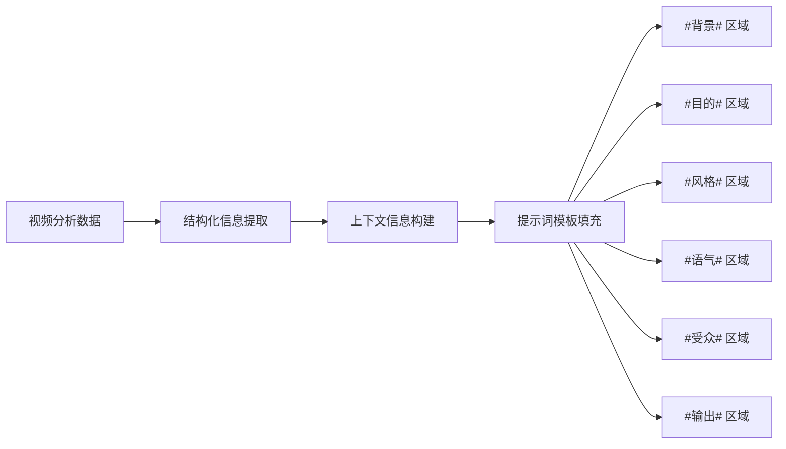

**图表源文件**
- [qwen3-prompt.md](file://qwen3-prompt.md#L24-L35)

#### 输出格式约束

系统严格遵循JSON格式约束，确保输出的可解析性：

| 约束类型 | 实现方式 | 示例 |
|---------|---------|------|
| 结构化输出 | response_format: { type: 'json_object' } | 确保模型返回有效JSON |
| 字段完整性 | 默认值填充 | 防止字段缺失导致解析失败 |
| 数据类型验证 | 后端类型检查 | 确保数值和字符串格式正确 |
| 长度限制 | 字符串截断处理 | 避免超长字段影响性能 |

#### 风格控制参数

通过温度、top_p等参数控制输出风格：

| 参数 | 值 | 效果 | 适用场景 |
|-----|---|------|---------|
| temperature | 0.3 | 降低创造性，提高一致性 | 专业报告生成 |
| top_p | 0.8 | 限制候选词汇范围 | 保持输出质量 |
| frequency_penalty | 0.1 | 减少重复内容 | 增加输出多样性 |
| presence_penalty | 0.1 | 鼓励新话题 | 避免内容单调 |

**章节源文件**
- [aiService.js](file://backend/src/services/aiService.js#L372-L410)
- [qwen3-prompt.md](file://qwen3-prompt.md#L1-L50)

## 数据结构与后处理

### 结构化数据处理

系统采用严格的数据结构定义，确保前后端数据一致性：

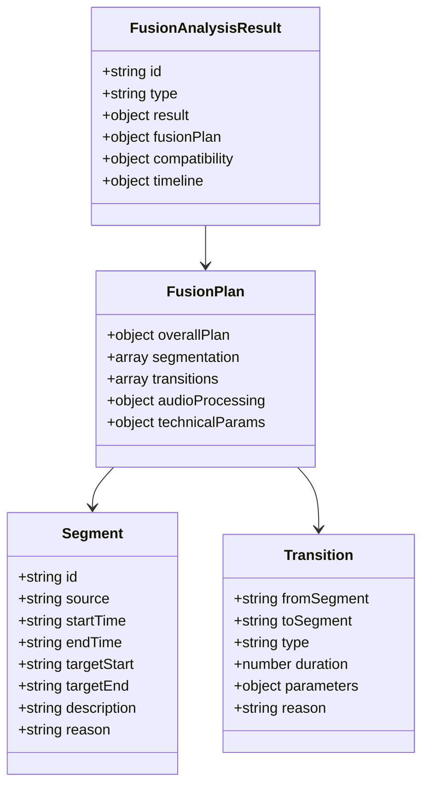

**类图源文件**
- [analysisDataStructures.js](file://frontend/src/utils/analysisDataStructures.js#L101-L220)

### 关键节点提取与逻辑校验

系统实现了智能的关键节点提取和逻辑校验机制：

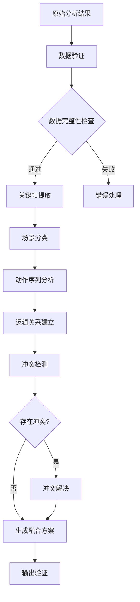

**流程图源文件**
- [aiService.js](file://backend/src/services/aiService.js#L478-L532)

### 后处理流程

从AI响应到结构化FusionPlan对象的转换过程：

| 处理阶段 | 输入格式 | 输出格式 | 处理逻辑 |
|---------|---------|---------|---------|
| 原始响应解析 | JSON字符串 | JavaScript对象 | JSON.parse() |
| 数据清洗 | 原始对象 | 清洗后对象 | 类型转换和格式化 |
| 结构化映射 | 清洗后对象 | FusionPlan对象 | 字段映射和重组 |
| 逻辑验证 | FusionPlan对象 | 验证结果 | 业务规则检查 |
| 格式化输出 | 验证通过对象 | 标准化输出 | 最终格式确认 |

**章节源文件**
- [analysisDataStructures.js](file://frontend/src/utils/analysisDataStructures.js#L1-L100)

## 前端交互界面

### FusionAnalysisView组件架构

前端组件采用响应式设计，提供直观的融合方案展示：

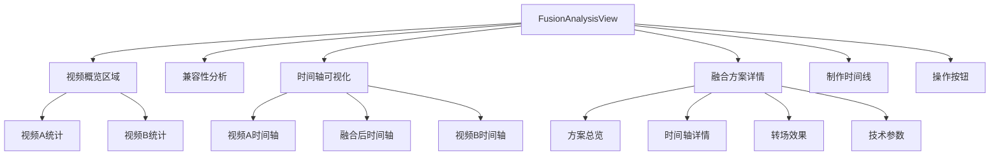

**图表源文件**
- [FusionAnalysisView.vue](file://frontend/src/components/FusionAnalysisView.vue#L1-L50)

### 可视化时间轴设计

系统提供多层次的时间轴可视化：

| 层级 | 显示内容 | 交互功能 | 视觉设计 |
|-----|---------|---------|---------|
| 视频A层 | 原始视频分段 | 时间戳显示、段落描述 | 蓝色色调，A标识 |
| 融合层 | 融合后方案 | 段落切换、参数调整 | 渐变色彩，融合效果 |
| 视频B层 | 原始视频分段 | 时间戳显示、段落描述 | 绿色色调，B标识 |

### 实时状态管理

前端通过Vue响应式系统管理分析状态：

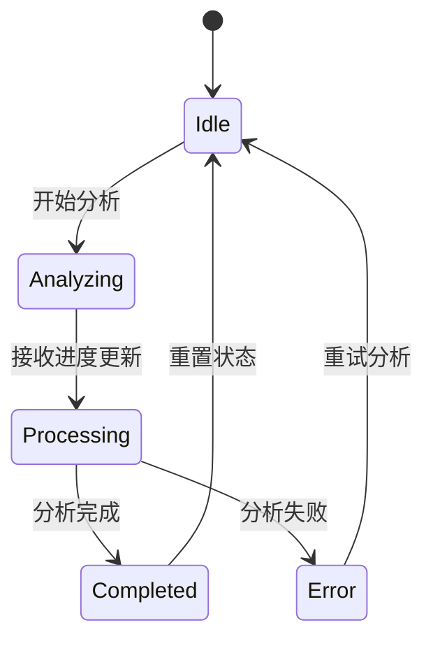

**状态图源文件**
- [useAIAnalysis.js](file://frontend/src/composables/useAIAnalysis.js#L15-L30)

**章节源文件**
- [FusionAnalysisView.vue](file://frontend/src/components/FusionAnalysisView.vue#L1-L100)
- [useAIAnalysis.js](file://frontend/src/composables/useAIAnalysis.js#L1-L100)

## API接口设计

### RESTful API架构

系统提供完整的RESTful API接口，支持视频融合分析的全流程：

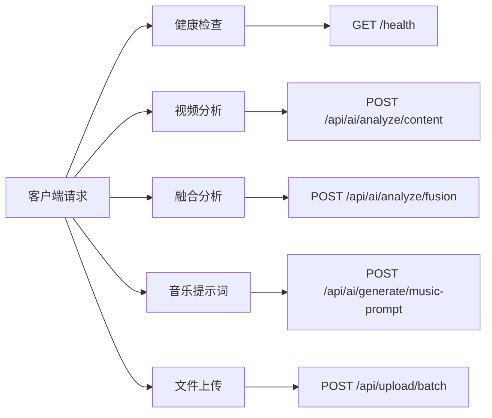

**图表源文件**
- [API.md](file://backend/API.md#L35-L100)
- [API_DOCS.md](file://backend/API_DOCS.md#L29-L80)

### 请求响应模式

| 接口类型 | HTTP方法 | 请求路径 | 响应格式 | 主要功能 |
|---------|---------|---------|---------|---------|
| 健康检查 | GET | /health | JSON | 服务器状态监控 |
| 内容分析 | POST | /api/ai/analyze/content | JSON | 单视频内容分析 |
| 融合分析 | POST | /api/ai/analyze/fusion | JSON | 双视频融合分析 |
| 音乐生成 | POST | /api/ai/generate/music-prompt | JSON | 背景音乐提示词 |
| 文件上传 | POST | /api/upload/batch | JSON | 视频文件批量上传 |

### 错误处理机制

系统实现了完善的错误处理和响应机制：

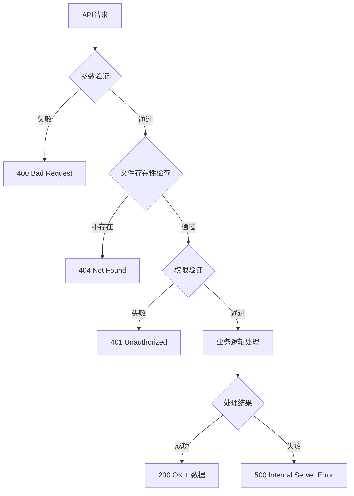

**流程图源文件**
- [aiController.js](file://backend/src/controllers/aiController.js#L13-L100)

**章节源文件**
- [API.md](file://backend/API.md#L1-L100)
- [API_DOCS.md](file://backend/API_DOCS.md#L1-L100)

## 性能优化与重试机制

### 指数退避重试策略

系统实现了基于Qwen官方推荐的指数退避重试机制：

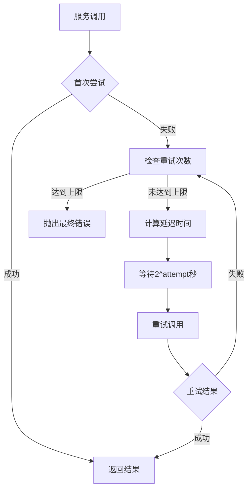

**流程图源文件**
- [aiService.js](file://backend/src/services/aiService.js#L614-L670)

### 性能优化策略

| 优化维度 | 实现方式 | 性能提升 |
|---------|---------|---------|
| 并发处理 | Promise.all | 减少总体处理时间 |
| 缓存机制 | 结果缓存 | 避免重复计算 |
| 流式响应 | Stream API | 提升用户体验 |
| 连接池 | HTTP连接复用 | 减少连接开销 |
| 压缩传输 | Gzip压缩 | 减少网络传输 |

### 资源管理

系统实现了智能的资源管理和清理机制：

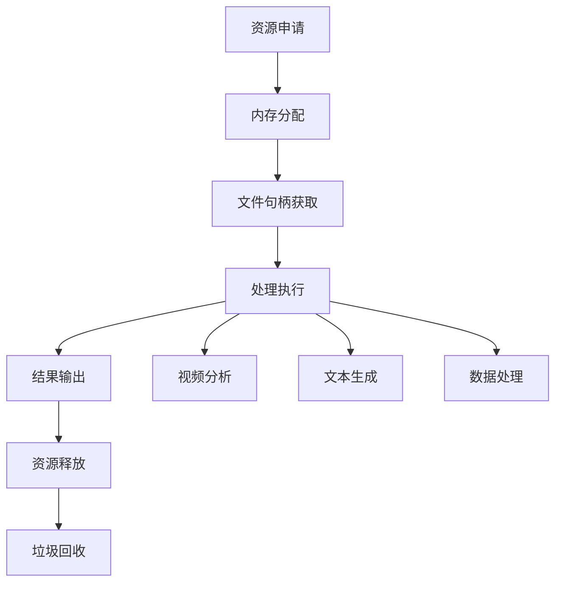

**章节源文件**
- [aiService.js](file://backend/src/services/aiService.js#L614-L670)

## 提示词工程优化

### 提示词模板迭代优化

基于qwen3-prompt.md的最佳实践，系统实现了提示词的持续优化：

#### Prompt框架应用

| 框架元素 | 设计原则 | 实现效果 |
|---------|---------|---------|
| 背景信息 | 明确语境和上下文 | 提高理解准确性 |
| 目的导向 | 具体任务描述 | 减少歧义和误解 |
| 风格控制 | 一致的写作风格 | 提升输出质量 |
| 语气调节 | 适当的语气温和 | 增强可读性 |
| 受众定位 | 目标用户群体 | 提高实用性 |
| 输出格式 | 结构化要求 | 确保可解析性 |

#### 思维链引导

对于复杂的融合分析任务，系统采用思维链引导：

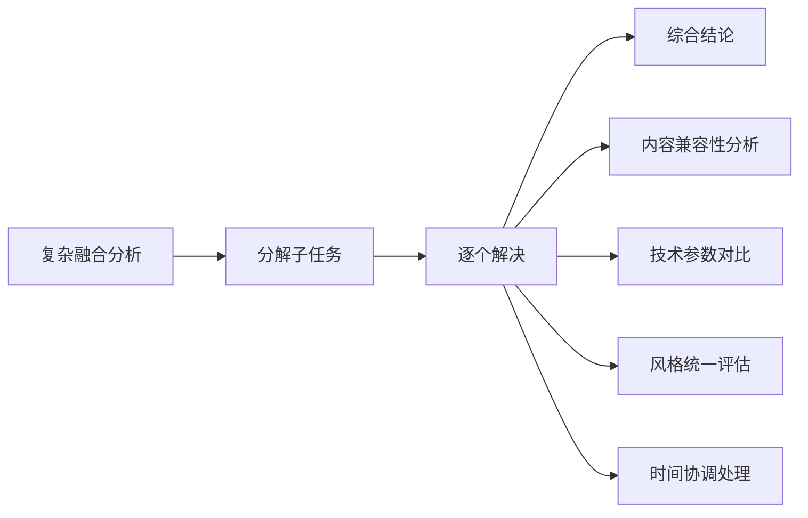

**流程图源文件**
- [qwen3-prompt.md](file://qwen3-prompt.md#L85-L120)

### 输出质量评估

系统建立了多维度的输出质量评估体系：

| 评估维度 | 权重 | 评估指标 | 改进措施 |
|---------|------|---------|---------|
| 内容准确性 | 30% | 事实正确性 | 增加验证步骤 |
| 逻辑一致性 | 25% | 推理合理性 | 引入逻辑检查 |
| 格式规范性 | 20% | 结构完整性 | 严格格式验证 |
| 实用价值 | 15% | 可操作性 | 用户反馈循环 |
| 创新程度 | 10% | 策略新颖性 | 知识库更新 |

### 迭代优化方法

系统采用闭环优化模式，持续改进提示词效果：

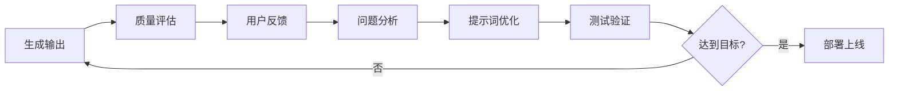

**章节源文件**
- [qwen3-prompt.md](file://qwen3-prompt.md#L160-L181)

## 总结

视频融合方案设计功能通过创新的AI技术应用，实现了从视频内容分析到专业制作方案生成的智能化转型。系统的核心优势体现在：

### 技术创新点

1. **双模型协同架构**：qwen3-vl负责视觉理解，qwen-plus负责文本生成，发挥各自优势
2. **智能提示词工程**：基于最佳实践设计的提示词模板，确保输出质量
3. **结构化数据处理**：严格的类型定义和验证机制，保证数据一致性
4. **可视化交互设计**：直观的时间轴展示和多层级方案对比

### 应用价值

- **提升制作效率**：自动化分析减少人工工作量
- **保证制作质量**：专业化的融合方案确保成品质量
- **降低制作门槛**：AI辅助使非专业人士也能制作专业级视频
- **创新制作模式**：推动视频制作向智能化方向发展

### 发展前景

随着AI技术的不断发展，视频融合方案设计功能将在以下方面持续演进：

- **多模态融合**：整合音频、文本等多种媒体信息
- **实时协作**：支持多人在线协同编辑
- **个性化定制**：根据用户偏好生成定制化方案
- **云端服务**：提供更强大的云端计算能力

该系统为视频制作行业提供了智能化的解决方案，标志着传统视频制作向AI辅助制作的重要转变，具有广阔的应用前景和发展潜力。