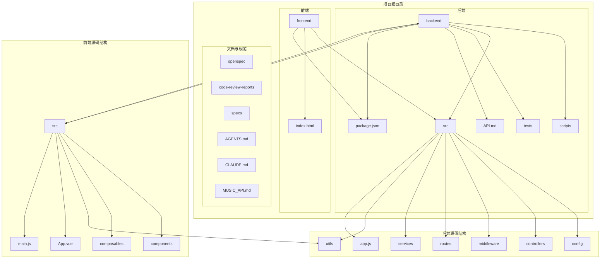
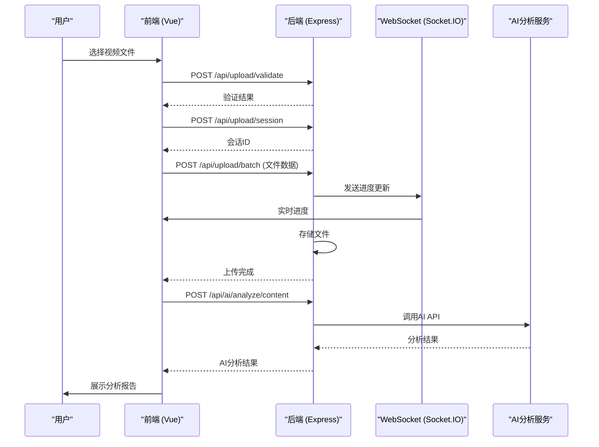
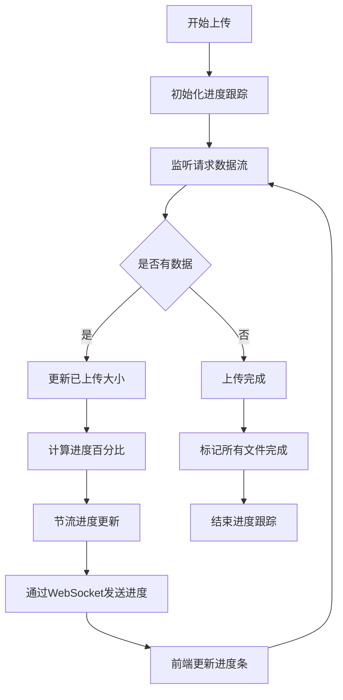
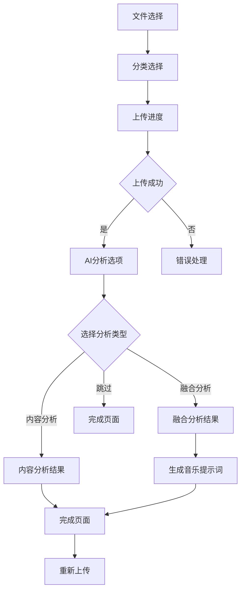
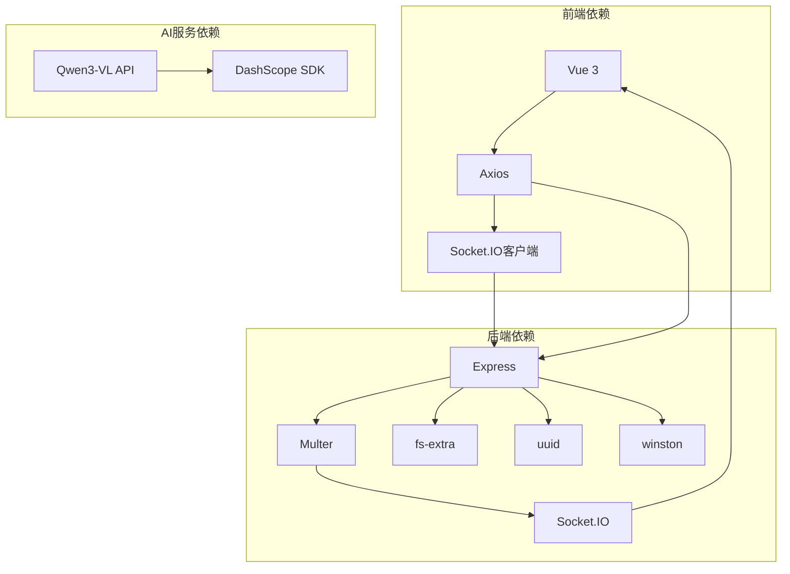

# 视频诊断工具

<cite>
**本文档引用的文件**   
- [app.js](file://backend/src/app.js)
- [upload.js](file://backend/src/routes/upload.js)
- [uploadController.js](file://backend/src/controllers/uploadController.js)
- [uploadService.js](file://backend/src/services/uploadService.js)
- [realtimeUpload.js](file://backend/src/middleware/realtimeUpload.js)
- [upload.js](file://backend/src/config/upload.js)
- [API.md](file://backend/API.md)
- [App.vue](file://frontend/src/App.vue)
- [FileUploader.vue](file://frontend/src/components/FileUploader.vue)
- [useAIAnalysis.js](file://frontend/src/composables/useAIAnalysis.js)
- [video_diagnosis.py](file://backend/src/scripts/video_diagnosis.py)
- [ai.js](file://backend/src/routes/ai.js)
- [aiController.js](file://backend/src/controllers/aiController.js)
</cite>

## 目录
1. [简介](#简介)
2. [项目结构](#项目结构)
3. [核心组件](#核心组件)
4. [架构概述](#架构概述)
5. [详细组件分析](#详细组件分析)
6. [依赖分析](#依赖分析)
7. [性能考虑](#性能考虑)
8. [故障排除指南](#故障排除指南)
9. [结论](#结论)

## 简介
视频诊断工具是一个完整的前后端系统，用于实现视频文件的上传、分类存储和AI智能分析。系统支持MP4和AVI格式的视频文件上传，具备实时进度跟踪、批量上传和文件分类功能。前端采用Vue 3框架构建响应式H5应用，后端使用Node.js和Express提供RESTful API服务。系统集成了WebSocket实现实时进度更新，并通过AI服务提供视频内容分析、融合建议和背景音乐提示词生成功能。

## 项目结构
项目采用分层架构设计，分为前端、后端和文档规范三个主要部分。后端采用典型的Express应用结构，包含控制器、服务、中间件、路由和配置等模块。前端采用Vue 3组合式API架构，包含组件、组合式函数和工具模块。系统还包含详细的API文档、代码审查报告和设计规范。



**图源**
- [backend](file://backend)
- [frontend](file://frontend)

**本节源**
- [backend](file://backend)
- [frontend](file://frontend)

## 核心组件
系统的核心组件包括文件上传服务、实时进度跟踪、AI分析服务和前端用户界面。文件上传服务处理视频文件的验证、分类存储和元数据管理；实时进度跟踪通过WebSocket提供上传进度的实时更新；AI分析服务集成大模型API进行视频内容理解和分析；前端用户界面提供直观的文件上传和分析结果展示。

**本节源**
- [uploadService.js](file://backend/src/services/uploadService.js)
- [realtimeUpload.js](file://backend/src/middleware/realtimeUpload.js)
- [aiController.js](file://backend/src/controllers/aiController.js)
- [App.vue](file://frontend/src/App.vue)

## 架构概述
系统采用前后端分离的微服务架构，前端通过HTTP和WebSocket与后端API进行通信。后端采用Express框架构建RESTful API，使用Multer处理文件上传，通过Socket.IO实现WebSocket通信。数据流从用户上传文件开始，经过验证、存储、进度跟踪，最终触发AI分析流程。



**图源**
- [app.js](file://backend/src/app.js)
- [upload.js](file://backend/src/routes/upload.js)
- [ai.js](file://backend/src/routes/ai.js)
- [App.vue](file://frontend/src/App.vue)

## 详细组件分析

### 文件上传服务分析
文件上传服务是系统的核心功能模块，负责处理视频文件的上传、验证和存储。服务采用分层架构，包含路由、控制器和服务三个层次，每个层次职责分明。

```mermaid
classDiagram
class UploadService {
+setIO(io)
+validateFiles(files)
+createSession(config)
+uploadFiles(sessionId, category, files)
+getProgress(sessionId)
+cancelUpload(sessionId)
+deleteFile(fileId)
-emitProgress(sessionId, data)
}
class UploadController {
+validateFiles(req, res)
+createSession(req, res)
+uploadFiles(req, res)
+getProgress(req, res)
+cancelUpload(req, res)
+deleteFile(req, res)
}
class UploadRoutes {
+POST /validate
+POST /session
+POST /batch
+GET /progress/ : sessionId
+POST /cancel/ : sessionId
+DELETE /file/ : fileId
}
UploadRoutes --> UploadController : "调用"
UploadController --> UploadService : "使用"
UploadService --> "Socket.IO" : "发送进度"
```

**图源**
- [uploadService.js](file://backend/src/services/uploadService.js)
- [uploadController.js](file://backend/src/controllers/uploadController.js)
- [upload.js](file://backend/src/routes/upload.js)

**本节源**
- [uploadService.js](file://backend/src/services/uploadService.js)
- [uploadController.js](file://backend/src/controllers/uploadController.js)
- [upload.js](file://backend/src/routes/upload.js)

### 实时进度跟踪分析
实时进度跟踪模块通过WebSocket技术实现上传进度的实时更新，提供流畅的用户体验。系统采用中间件模式集成进度跟踪功能，确保上传过程的每个阶段都能及时通知客户端。



**图源**
- [realtimeUpload.js](file://backend/src/middleware/realtimeUpload.js)
- [uploadProgressTracker.js](file://backend/src/middleware/uploadProgressTracker.js)

**本节源**
- [realtimeUpload.js](file://backend/src/middleware/realtimeUpload.js)

### AI分析服务分析
AI分析服务模块集成大模型API，提供视频内容分析、融合建议和音乐提示词生成等智能功能。服务通过RESTful API暴露功能，支持多种分析类型和实时进度反馈。

```mermaid
classDiagram
class AIController {
+analyzeVideo(req, res)
+analyzeFusion(req, res)
+generateMusicPrompt(req, res)
+analyzeUploadedFile(req, res)
+getAnalysisStatus(req, res)
}
class AIService {
+analyzeVideoContent(videoPath)
+analyzeVideoFusion(video1Path, video2Path)
+generateMusicPrompt(fusionPlan)
+analyzeUploadedFile(files, category, analysisType)
+getAnalysisStatus(analysisId)
}
class AIComposable {
+analyzeVideoContent(videoData)
+analyzeVideoFusion(video1Data, video2Data)
+generateMusicPrompt(fusionPlan)
+analyzeUploadedFiles(files, category, analysisType)
+getAnalysisStatus(analysisId)
}
AIController --> AIService : "调用"
AIService --> "Qwen3-VL API" : "调用"
AIComposable --> "后端API" : "调用"
```

**图源**
- [aiController.js](file://backend/src/controllers/aiController.js)
- [aiService.js](file://backend/src/services/aiService.js)
- [useAIAnalysis.js](file://frontend/src/composables/useAIAnalysis.js)

**本节源**
- [aiController.js](file://backend/src/controllers/aiController.js)
- [aiService.js](file://backend/src/services/aiService.js)
- [useAIAnalysis.js](file://frontend/src/composables/useAIAnalysis.js)

### 前端用户界面分析
前端用户界面采用Vue 3组合式API构建，提供直观的文件上传和AI分析功能。界面设计遵循用户操作流程，从文件选择到上传进度再到分析结果展示，提供完整的用户体验。



**图源**
- [App.vue](file://frontend/src/App.vue)
- [FileUploader.vue](file://frontend/src/components/FileUploader.vue)

**本节源**
- [App.vue](file://frontend/src/App.vue)
- [FileUploader.vue](file://frontend/src/components/FileUploader.vue)

## 依赖分析
系统依赖关系清晰，前后端通过定义良好的API接口进行通信。后端服务内部采用分层依赖，高层模块依赖低层模块，避免循环依赖。第三方依赖经过精心选择，确保系统稳定性和安全性。



**图源**
- [package.json](file://backend/package.json)
- [package.json](file://frontend/package.json)

**本节源**
- [package.json](file://backend/package.json)
- [package.json](file://frontend/package.json)

## 性能考虑
系统在设计时充分考虑了性能因素，采用多种优化策略确保高效运行。文件上传采用流式处理，避免内存溢出；进度跟踪采用节流机制，减少不必要的网络通信；AI分析服务支持超时控制，防止长时间等待。

**本节源**
- [realtimeUpload.js](file://backend/src/middleware/realtimeUpload.js)
- [useAIAnalysis.js](file://frontend/src/composables/useAIAnalysis.js)

## 故障排除指南
系统提供详细的错误处理机制和日志记录，便于快速定位和解决问题。常见问题包括文件格式不支持、上传超时、AI服务不可用等，系统为每种情况提供明确的错误代码和解决方案。

**本节源**
- [TROUBLESHOOTING.md](file://TROUBLESHOOTING.md)
- [uploadController.js](file://backend/src/controllers/uploadController.js)
- [aiController.js](file://backend/src/controllers/aiController.js)

## 结论
视频诊断工具是一个功能完整、架构清晰的现代化Web应用。系统通过前后端分离架构实现了高可维护性，采用WebSocket技术提供了实时交互体验，集成AI服务实现了智能化分析功能。代码质量高，错误处理完善，日志记录详细，具备良好的可扩展性和可维护性。