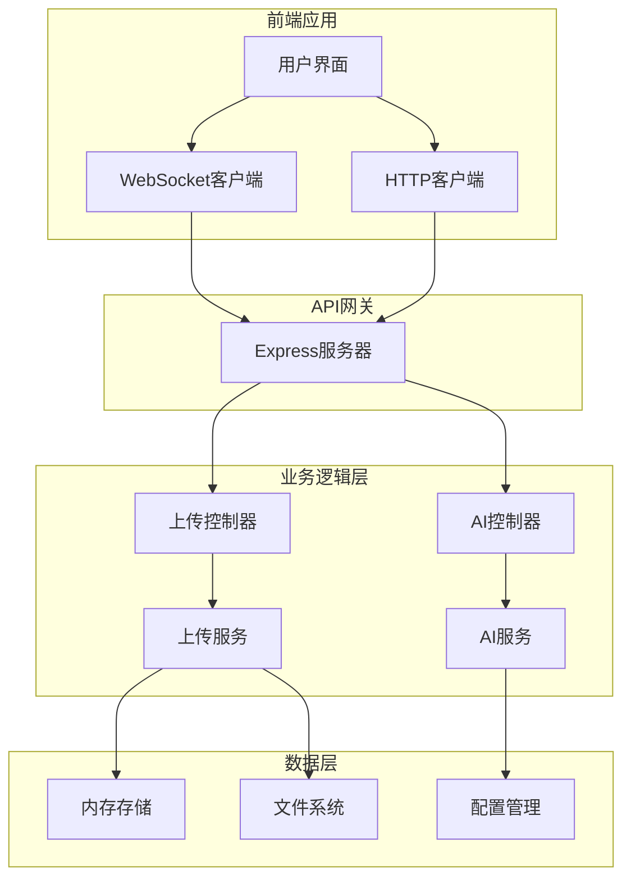
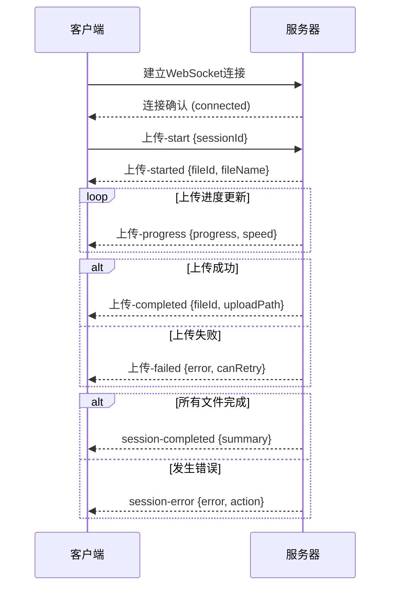

# API参考

<cite>
**本文档中引用的文件**
- [api.yaml](file://specs/001-responsive-h5-upload/contracts/api.yaml)
- [websocket.md](file://specs/001-responsive-h5-upload/contracts/websocket.md)
- [uploadController.js](file://backend/src/controllers/uploadController.js)
- [aiController.js](file://backend/src/controllers/aiController.js)
- [upload.js](file://backend/src/routes/upload.js)
- [ai.js](file://backend/src/routes/ai.js)
- [uploadService.js](file://backend/src/services/uploadService.js)
- [aiService.js](file://backend/src/services/aiService.js)
- [upload.js](file://backend/src/config/upload.js)
- [API.md](file://backend/API.md)
- [useWebSocket.js](file://frontend/src/composables/useWebSocket.js)
- [useAIAnalysis.js](file://frontend/src/composables/useAIAnalysis.js)
</cite>

## 目录
1. [简介](#简介)
2. [API架构概览](#api架构概览)
3. [RESTful API](#restful-api)
4. [WebSocket API](#websocket-api)
5. [错误处理](#错误处理)
6. [使用示例](#使用示例)
7. [故障排除](#故障排除)

## 简介

本文档提供了视频文件上传和AI分析系统的完整API参考。系统支持响应式H5文件上传、实时进度跟踪、AI视频内容分析和融合分析等功能。

### 主要功能特性
- 支持最多3个同类型视频文件上传（MP4/AVI）
- 文件大小限制最大300MB
- 实时上传进度跟踪
- AI视频内容分析
- 视频融合分析
- 背景音乐提示词生成
- WebSocket实时通信

## API架构概览



**图表来源**
- [uploadController.js](file://backend/src/controllers/uploadController.js#L1-L285)
- [aiController.js](file://backend/src/controllers/aiController.js#L1-L237)
- [uploadService.js](file://backend/src/services/uploadService.js#L1-L416)

## RESTful API

### 文件上传API

#### 1. 健康检查

**GET** `/health`

检查服务器状态和健康状况。

**响应示例**:
```json
{
  "status": "OK",
  "timestamp": "2025-11-14T13:54:11.000Z",
  "uptime": 123.45,
  "memory": {
    "rss": 50331648,
    "heapTotal": 20971520,
    "heapUsed": 15728640
  }
}
```

#### 2. 文件验证

**POST** `/api/upload/validate`

在实际上传之前验证文件的格式、大小和数量。

**请求体**:
```json
{
  "files": [
    {
      "name": "video.mp4",
      "size": 104857600,
      "type": "video/mp4"
    }
  ]
}
```

**响应**:
```json
{
  "valid": true,
  "files": [
    {
      "index": 0,
      "valid": true,
      "errors": []
    }
  ],
  "timestamp": "2025-11-14T13:54:11.000Z"
}
```

#### 3. 创建上传会话

**POST** `/api/upload/session`

创建新的批量上传会话，返回会话ID。

**请求体**:
```json
{
  "category": "personal",
  "expectedFiles": 2
}
```

**参数说明**:
- `category`: 文件分类 (`personal` | `scenic`)
- `expectedFiles`: 预期上传的文件数量 (1-3)

**响应**:
```json
{
  "sessionId": "550e8400-e29b-41d4-a716-446655440000",
  "category": "personal",
  "uploadPath": "/backend/upload/personal/",
  "maxFiles": 3,
  "allowedTypes": ["mp4", "avi"],
  "maxFileSize": 314572800,
  "createdAt": "2025-11-14T13:54:11.000Z"
}
```

#### 4. 批量文件上传

**POST** `/api/upload/batch`

上传多个文件到指定分类目录。

**请求类型**: `multipart/form-data`

**请求参数**:
- `files`: 上传的文件(最多3个)
- `sessionId`: 上传会话ID
- `category`: 文件分类 (`personal` | `scenic`)

**响应**:
```json
{
  "success": true,
  "sessionId": "550e8400-e29b-41d4-a716-446655440000",
  "files": [
    {
      "id": "550e8400-e29b-41d4-a716-446655440001",
      "originalName": "我的视频.mp4",
      "fileName": "550e8400-e29b-41d4-a716-446655440001_2025-11-14T13-54-11_我的视频.mp4",
      "filePath": "/backend/upload/personal/550e8400-e29b-41d4-a716-446655440001_2025-11-14T13-54-11_我的视频.mp4",
      "fileSize": 104857600,
      "fileType": "mp4",
      "status": "completed",
      "progress": 100
    }
  ],
  "summary": {
    "totalFiles": 1,
    "completedFiles": 1,
    "failedFiles": 0,
    "totalSize": 104857600
  }
}
```

#### 5. 获取上传进度

**GET** `/api/upload/progress/{sessionId}`

获取指定会话中所有文件的上传进度。

**路径参数**:
- `sessionId`: 上传会话ID

**响应**:
```json
{
  "sessionId": "550e8400-e29b-41d4-a716-446655440000",
  "overallStatus": "uploading",
  "totalProgress": 75,
  "completedFiles": 1,
  "failedFiles": 0,
  "estimatedTimeRemaining": 30,
  "files": [
    {
      "id": "550e8400-e29b-41d4-a716-446655440001",
      "originalName": "我的视频.mp4",
      "status": "completed",
      "progress": 100
    }
  ],
  "lastUpdate": "2025-11-14T13:54:11.000Z"
}
```

#### 6. 取消上传

**POST** `/api/upload/cancel/{sessionId}`

取消指定会话中所有未完成的上传。

**路径参数**:
- `sessionId`: 上传会话ID

**响应**:
```json
{
  "success": true,
  "sessionId": "550e8400-e29b-41d4-a716-446655440000",
  "cancelledFiles": ["550e8400-e29b-41d4-a716-446655440001"],
  "message": "成功取消1个文件的上传"
}
```

#### 7. 删除文件 (管理员功能)

**DELETE** `/api/upload/file/{fileId}`

删除已上传的文件。

**路径参数**:
- `fileId`: 文件ID

**响应**:
```json
{
  "success": true,
  "message": "文件删除成功"
}
```

**章节来源**
- [api.yaml](file://specs/001-responsive-h5-upload/contracts/api.yaml#L27-L253)
- [uploadController.js](file://backend/src/controllers/uploadController.js#L27-L285)
- [API.md](file://backend/API.md#L35-L337)

### AI分析API

#### 1. 视频内容分析

**POST** `/api/ai/analyze/content`

分析单个视频的内容和特征。

**请求体**:
```json
{
  "videoPath": "/path/to/video.mp4",
  "category": "personal"
}
```

**响应**:
```json
{
  "success": true,
  "data": {
    "analysisId": "analysis_123456789",
    "videoPath": "/path/to/video.mp4",
    "rawAnalysis": {...},
    "structuredData": {...},
    "finalReport": "...",
    "createdAt": "2025-11-14T13:54:11.000Z"
  }
}
```

#### 2. 视频融合分析

**POST** `/api/ai/analyze/fusion`

分析两个视频的融合可能性和制作方案。

**请求体**:
```json
{
  "video1Path": "/path/to/video1.mp4",
  "video2Path": "/path/to/video2.mp4",
  "category": "personal"
}
```

**响应**:
```json
{
  "success": true,
  "data": {
    "video1Analysis": {...},
    "video2Analysis": {...},
    "fusionData": {...},
    "fusionPlan": "...",
    "createdAt": "2025-11-14T13:54:11.000Z"
  }
}
```

#### 3. 背景音乐提示词生成

**POST** `/api/ai/generate/music-prompt`

基于融合方案生成背景音乐提示词。

**请求体**:
```json
{
  "fusionPlan": {...}
}
```

**响应**:
```json
{
  "success": true,
  "data": {
    "musicPromptId": "music_123456789",
    "prompt": "45秒的cinematic风格背景音乐...",
    "generatedAt": "2025-11-14T13:54:11.000Z"
  }
}
```

#### 4. 一体化上传分析

**POST** `/api/ai/analyze/upload`

直接上传文件进行分析。

**请求类型**: `multipart/form-data`

**请求参数**:
- `videos`: 上传的视频文件(最多2个)
- `category`: 文件分类
- `analysisType`: 分析类型 (`content` | `fusion`)

**响应**:
```json
{
  "success": true,
  "data": {
    "analysisType": "content",
    "category": "personal",
    "finalReport": "...",
    "processedAt": "2025-11-14T13:54:11.000Z"
  }
}
```

#### 5. 分析状态查询

**GET** `/api/ai/analysis/{analysisId}/status`

查询分析任务的状态。

**路径参数**:
- `analysisId`: 分析任务ID

**响应**:
```json
{
  "success": true,
  "data": {
    "analysisId": "analysis_123456789",
    "status": "completed",
    "progress": 100,
    "estimatedTime": 0
  }
}
```

**章节来源**
- [aiController.js](file://backend/src/controllers/aiController.js#L13-L237)
- [ai.js](file://backend/src/routes/ai.js#L28-L71)

## WebSocket API

### 连接信息

**连接地址**:
```
ws://localhost:8005/socket.io
wss://api.example.com/socket.io (生产环境)
```

**连接参数**:
- `sessionId`: 上传会话ID (必需)
- `clientType`: 客户端类型 (web/mobile)

### 事件类型

#### 客户端发送事件

##### 1. `upload-start`
开始上传会话

```typescript
interface UploadStartEvent {
  sessionId: string;
  fileIds: string[];
  category: 'personal' | 'scenic';
}

// 示例
socket.emit('upload-start', {
  sessionId: '550e8400-e29b-41d4-a716-446655440000',
  fileIds: ['file-1', 'file-2', 'file-3'],
  category: 'personal'
});
```

##### 2. `upload-progress`
手动更新文件进度

```typescript
interface UploadProgressEvent {
  sessionId: string;
  fileId: string;
  progress?: number;
  requestUpdate?: boolean;
}

// 示例
socket.emit('upload-progress', {
  sessionId: '550e8400-e29b-41d4-a716-446655440000',
  fileId: 'file-1',
  requestUpdate: true
});
```

##### 3. `upload-cancel`
取消文件上传

```typescript
interface UploadCancelEvent {
  sessionId: string;
  fileId?: string; // 可选，不指定则取消整个会话
  reason?: string;
}

// 示例
socket.emit('upload-cancel', {
  sessionId: '550e8400-e29b-41d4-a716-446655440000',
  fileId: 'file-1',
  reason: '用户主动取消'
});
```

#### 服务器推送事件

##### 1. `upload-progress`
实时进度更新

```typescript
interface ProgressUpdateEvent {
  sessionId: string;
  fileId: string;
  progress: number;
  speed: number;
  uploadedBytes: number;
  totalBytes: number;
  estimatedTimeRemaining: number;
  timestamp: string;
}

// 示例
socket.on('upload-progress', (data) => {
  console.log(`文件 ${data.fileId} 进度: ${data.progress}%`);
  console.log(`上传速度: ${data.speed} bytes/s`);
  console.log(`预估剩余时间: ${data.estimatedTimeRemaining} 秒`);
});
```

##### 2. `upload-started`
文件开始上传

```typescript
interface UploadStartedEvent {
  sessionId: string;
  fileId: string;
  fileName: string;
  fileSize: number;
  startTime: string;
}

// 示例
socket.on('upload-started', (data) => {
  console.log(`文件 ${data.fileName} 开始上传`);
});
```

##### 3. `upload-completed`
文件上传完成

```typescript
interface UploadCompletedEvent {
  sessionId: string;
  fileId: string;
  fileName: string;
  fileSize: number;
  uploadPath: string;
  endTime: string;
  duration: number;
  finalSpeed: number;
}

// 示例
socket.on('upload-completed', (data) => {
  console.log(`文件 ${data.fileName} 上传完成`);
  console.log(`存储路径: ${data.uploadPath}`);
  console.log(`上传耗时: ${data.duration} 秒`);
});
```

##### 4. `upload-failed`
文件上传失败

```typescript
interface UploadFailedEvent {
  sessionId: string;
  fileId: string;
  fileName: string;
  error: {
    code: string;
    message: string;
    details?: string;
  };
  failedAt: string;
  canRetry: boolean;
  retryCount: number;
  maxRetries: number;
}

// 示例
socket.on('upload-failed', (data) => {
  console.log(`文件 ${data.fileName} 上传失败: ${data.error.message}`);
  if (data.canRetry) {
    console.log(`可以重试，当前重试次数: ${data.retryCount}/${data.maxRetries}`);
  }
});
```

### 连接生命周期



**图表来源**
- [websocket.md](file://specs/001-responsive-h5-upload/contracts/websocket.md#L345-L371)

### 重连机制

```javascript
// 客户端重连配置
const socket = io('ws://localhost:8005', {
  reconnection: true,
  reconnectionAttempts: 5,
  reconnectionDelay: 1000,
  reconnectionDelayMax: 5000,
  timeout: 20000
});

// 监听重连事件
socket.on('reconnecting', (attemptNumber) => {
  console.log(`正在重连，第 ${attemptNumber} 次尝试...`);
});

socket.on('reconnect', (attemptNumber) => {
  console.log(`重连成功，尝试次数: ${attemptNumber}`);
});

socket.on('reconnect_failed', () => {
  console.log('重连失败，请检查网络连接');
});
```

**章节来源**
- [websocket.md](file://specs/001-responsive-h5-upload/contracts/websocket.md#L1-L545)
- [useWebSocket.js](file://frontend/src/composables/useWebSocket.js#L22-L139)

## 错误处理

### HTTP错误响应格式

```json
{
  "error": "ERROR_CODE",
  "message": "错误描述",
  "details": {
    "field": "出错的字段",
    "value": "错误的值",
    "constraint": "约束条件"
  },
  "solution": "解决建议",
  "timestamp": "2025-11-14T13:54:11.000Z",
  "requestId": "req_123456789"
}
```

### 常见错误代码

| 错误代码 | HTTP状态码 | 描述 | 处理建议 |
|---------|-----------|------|----------|
| `VALIDATION_ERROR` | 400 | 文件验证失败 | 检查文件格式和大小 |
| `INVALID_FILE_FORMAT` | 400 | 不支持的文件格式 | 仅支持MP4和AVI格式 |
| `FILE_TOO_LARGE` | 413 | 文件过大 | 选择小于300MB的文件 |
| `TOO_MANY_FILES` | 400 | 文件数量过多 | 最多上传3个文件 |
| `NO_FILES` | 400 | 未选择文件 | 选择要上传的文件 |
| `UPLOAD_FAILED` | 500 | 上传失败 | 检查服务器状态 |
| `SESSION_NOT_FOUND` | 404 | 会话不存在 | 重新创建上传会话 |
| `CANCELLATION_FAILED` | 500 | 取消上传失败 | 重试取消操作 |
| `INTERNAL_SERVER_ERROR` | 500 | 服务器内部错误 | 联系技术支持 |

### WebSocket错误处理

```typescript
// 错误事件格式
interface SocketError {
  event: string;
  error: {
    code: string;
    message: string;
    details?: any;
  };
  timestamp: string;
  requestId?: string;
}

// 常见WebSocket错误代码
interface WebSocketErrors {
  SESSION_NOT_FOUND: '会话不存在';
  INVALID_SESSION: '无效会话';
  FILE_NOT_FOUND: '文件不存在';
  UPLOAD_NOT_STARTED: '上传未开始';
  UPLOAD_ALREADY_COMPLETED: '上传已完成';
  INSUFFICIENT_PERMISSIONS: '权限不足';
  RATE_LIMIT_EXCEEDED: '频率限制';
  CONNECTION_TIMEOUT: '连接超时';
}
```

**章节来源**
- [api.yaml](file://specs/001-responsive-h5-upload/contracts/api.yaml#L481-L520)
- [uploadController.js](file://backend/src/controllers/uploadController.js#L29-L55)

## 使用示例

### 完整上传流程

```javascript
// 1. 验证文件
const validationResponse = await fetch('/api/upload/validate', {
  method: 'POST',
  headers: { 'Content-Type': 'application/json' },
  body: JSON.stringify({
    files: [{ name: 'video.mp4', size: 104857600, type: 'video/mp4' }]
  })
});

// 2. 创建会话
const sessionResponse = await fetch('/api/upload/session', {
  method: 'POST',
  headers: { 'Content-Type': 'application/json' },
  body: JSON.stringify({ category: 'personal', expectedFiles: 1 })
});
const { sessionId } = await sessionResponse.json();

// 3. 上传文件
const formData = new FormData();
formData.append('files', fileInput.files[0]);
formData.append('sessionId', sessionId);
formData.append('category', 'personal');

const uploadResponse = await fetch('/api/upload/batch', {
  method: 'POST',
  body: formData
});
```

### WebSocket连接示例

```javascript
import { io } from 'socket.io-client';

// 创建WebSocket连接
const socket = io('http://localhost:8005', {
  query: {
    sessionId: '550e8400-e29b-41d4-a716-446655440000',
    clientType: 'web'
  }
});

// 监听进度更新
socket.on('upload-progress', (data) => {
  console.log(`进度: ${data.totalProgress}%`);
  console.log(`当前文件: ${data.currentFile?.originalName}`);
});

// 监听完成事件
socket.on('upload-completed', (data) => {
  console.log('上传完成!');
  socket.disconnect();
});
```

### AI分析示例

```javascript
// 视频内容分析
const contentAnalysis = await fetch('/api/ai/analyze/content', {
  method: 'POST',
  headers: {
    'Content-Type': 'application/json',
    'Authorization': `Bearer ${token}`
  },
  body: JSON.stringify({
    videoPath: '/path/to/video.mp4',
    category: 'personal'
  })
}).then(res => res.json());

// 视频融合分析
const fusionAnalysis = await fetch('/api/ai/analyze/fusion', {
  method: 'POST',
  headers: {
    'Content-Type': 'application/json',
    'Authorization': `Bearer ${token}`
  },
  body: JSON.stringify({
    video1Path: '/path/to/video1.mp4',
    video2Path: '/path/to/video2.mp4',
    category: 'personal'
  })
}).then(res => res.json());
```

### curl命令示例

```bash
# 健康检查
curl http://localhost:8005/health

# 文件验证
curl -X POST http://localhost:8005/api/upload/validate \
  -H "Content-Type: application/json" \
  -d '{"files":[{"name":"test.mp4","size":104857600,"type":"video/mp4"}]}'

# 创建会话
curl -X POST http://localhost:8005/api/upload/session \
  -H "Content-Type: application/json" \
  -d '{"category":"personal","expectedFiles":1}'

# 批量上传
curl -X POST http://localhost:8005/api/upload/batch \
  -H "Authorization: Bearer YOUR_TOKEN" \
  -F "files=@video1.mp4" \
  -F "files=@video2.mp4" \
  -F "sessionId=YOUR_SESSION_ID" \
  -F "category=personal"
```

**章节来源**
- [API.md](file://backend/API.md#L288-L337)
- [useAIAnalysis.js](file://frontend/src/composables/useAIAnalysis.js#L30-L448)

## 故障排除

### 常见问题及解决方案

#### 1. 文件上传失败

**问题**: 文件上传过程中断或失败
**可能原因**:
- 网络连接不稳定
- 文件大小超过限制
- 文件格式不支持

**解决方案**:
- 检查网络连接稳定性
- 确认文件大小不超过300MB
- 验证文件格式为MP4或AVI

#### 2. WebSocket连接失败

**问题**: WebSocket无法建立连接
**可能原因**:
- 服务器未启动或端口被占用
- 防火墙阻止WebSocket连接
- 会话ID无效

**解决方案**:
- 检查服务器状态和端口监听
- 配置防火墙允许WebSocket连接
- 确保使用有效的会话ID

#### 3. AI分析超时

**问题**: AI分析请求超时
**可能原因**:
- 视频文件过大
- 服务器负载过高
- API密钥配置错误

**解决方案**:
- 上传较小的视频文件
- 等待服务器空闲后再重试
- 检查OpenAI API密钥配置

#### 4. 权限错误

**问题**: 认证失败或权限不足
**可能原因**:
- JWT令牌过期
- 用户权限不足
- API密钥无效

**解决方案**:
- 重新登录获取新的JWT令牌
- 联系管理员提升权限
- 检查并更新API密钥

### 性能优化建议

#### 1. 文件上传优化
- 使用分块上传处理大文件
- 实现断点续传功能
- 优化网络带宽利用率

#### 2. WebSocket连接优化
- 启用连接池管理
- 实现智能重连机制
- 减少不必要的事件监听

#### 3. AI分析优化
- 使用缓存减少重复计算
- 实现异步处理避免阻塞
- 优化API调用频率

### 监控和日志

#### 关键指标监控
- 上传成功率
- 平均响应时间
- 错误率统计
- WebSocket连接状态

#### 日志记录
- 请求响应日志
- 错误堆栈跟踪
- 性能指标记录
- 用户行为分析

**章节来源**
- [uploadService.js](file://backend/src/services/uploadService.js#L393-L416)
- [aiService.js](file://backend/src/services/aiService.js#L613-L672)