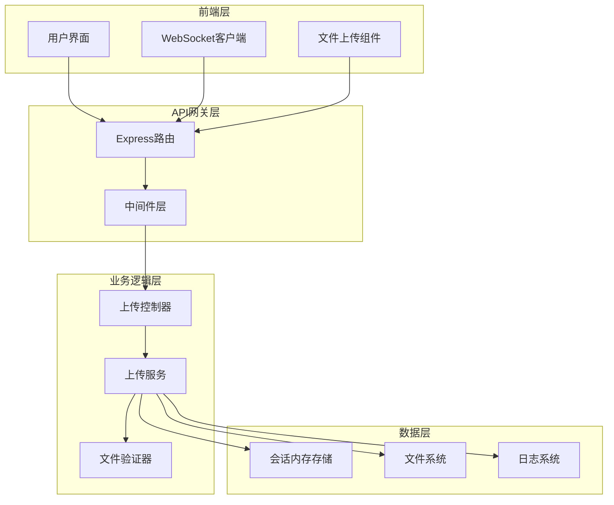
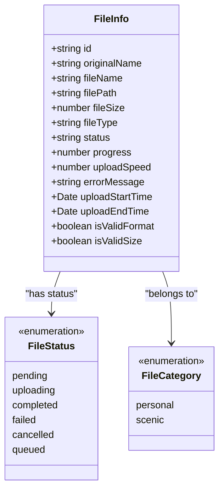
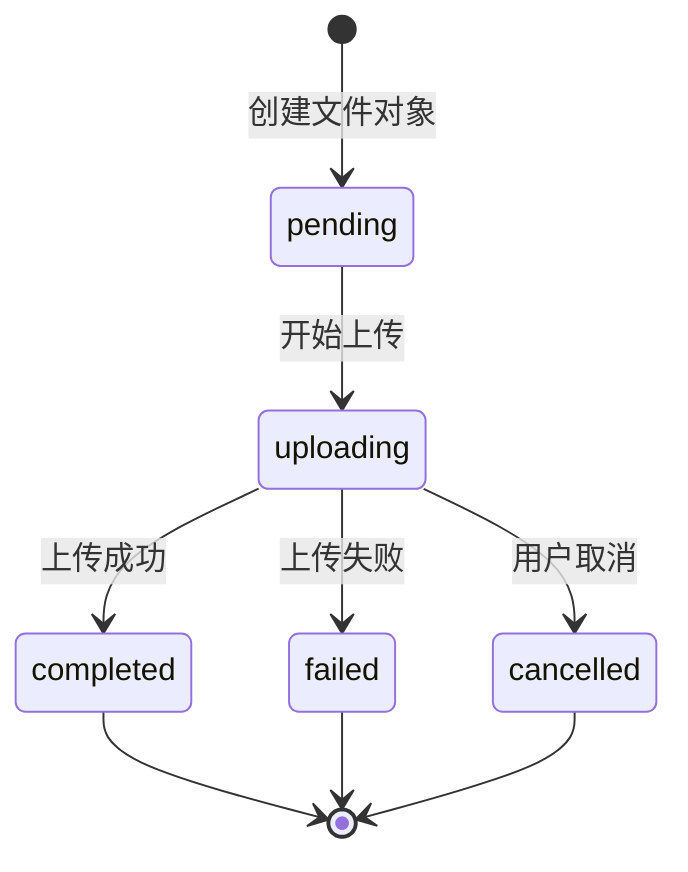
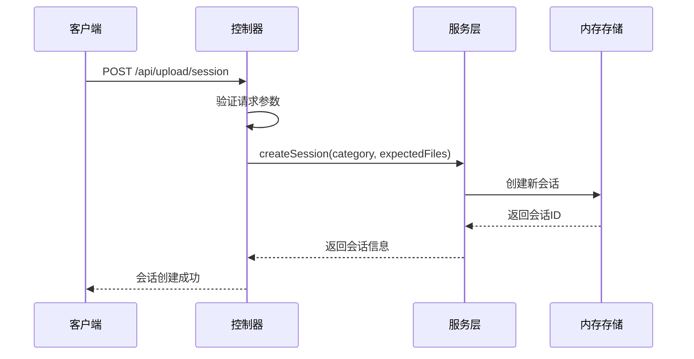
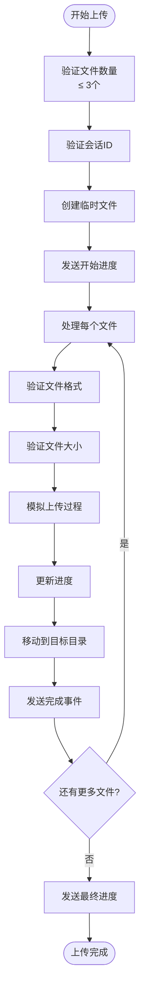
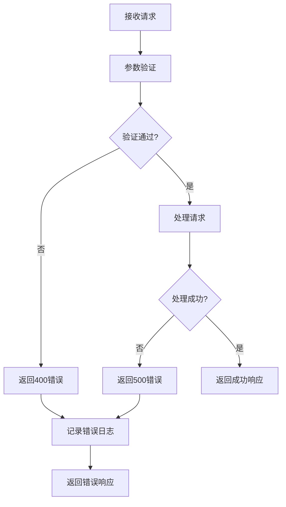
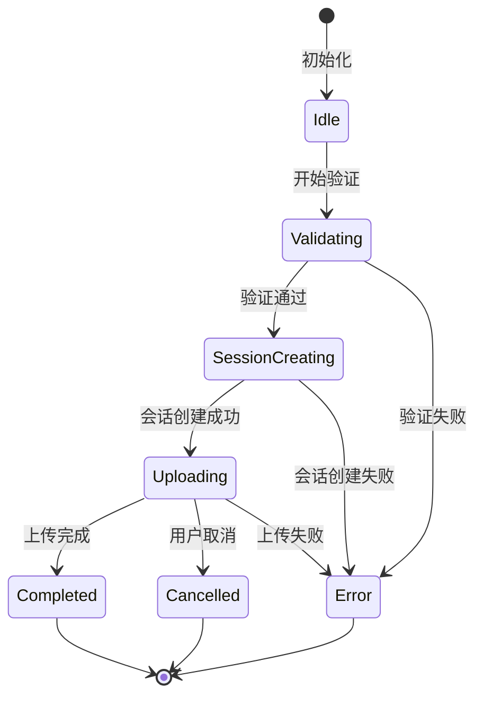

# REST API 文档

<cite>
**本文档中引用的文件**
- [api.yaml](file://specs/001-responsive-h5-upload/contracts/api.yaml)
- [uploadController.js](file://backend/src/controllers/uploadController.js)
- [upload.js](file://backend/src/routes/upload.js)
- [upload.js](file://backend/src/middleware/upload.js)
- [fileValidator.js](file://backend/src/utils/fileValidator.js)
- [uploadService.js](file://backend/src/services/uploadService.js)
- [upload.js](file://backend/src/config/upload.js)
- [API.md](file://backend/API.md)
- [useWebSocket.js](file://frontend/src/composables/useWebSocket.js)
</cite>

## 目录
1. [简介](#简介)
2. [项目架构概览](#项目架构概览)
3. [核心数据模型](#核心数据模型)
4. [文件验证机制](#文件验证机制)
5. [会话管理系统](#会话管理系统)
6. [批量上传接口](#批量上传接口)
7. [进度跟踪系统](#进度跟踪系统)
8. [错误处理机制](#错误处理机制)
9. [完整API端点文档](#完整api端点文档)
10. [前端集成指南](#前端集成指南)
11. [最佳实践](#最佳实践)

## 简介

本REST API为视频文件上传系统提供了完整的文件管理功能，支持最多3个同类型视频文件(mp4/avi)的批量上传，具备实时进度跟踪、文件分类存储和个人/景区视频分类管理等特性。

### 主要功能特性
- **文件验证**: 支持文件格式、大小和数量验证
- **会话管理**: 创建和管理上传会话
- **批量上传**: 支持多文件同时上传
- **实时进度**: WebSocket实时进度跟踪
- **错误处理**: 完整的错误处理和状态反馈
- **分类存储**: 个人视频和景区视频分类管理

## 项目架构概览



**图表来源**
- [upload.js](file://backend/src/routes/upload.js#L1-L62)
- [uploadController.js](file://backend/src/controllers/uploadController.js#L1-L285)
- [uploadService.js](file://backend/src/services/uploadService.js#L1-L416)

**章节来源**
- [upload.js](file://backend/src/routes/upload.js#L1-L62)
- [uploadController.js](file://backend/src/controllers/uploadController.js#L1-L285)

## 核心数据模型

### FileInfo 数据模型

FileInfo 是文件上传过程中的核心数据结构，包含了文件的完整状态信息。



**图表来源**
- [api.yaml](file://specs/001-responsive-h5-upload/contracts/api.yaml#L266-L317)
- [uploadService.js](file://backend/src/services/uploadService.js#L148-L170)

### 状态机转换图



**图表来源**
- [uploadService.js](file://backend/src/services/uploadService.js#L148-L280)

**章节来源**
- [api.yaml](file://specs/001-responsive-h5-upload/contracts/api.yaml#L266-L317)
- [uploadService.js](file://backend/src/services/uploadService.js#L148-L280)

## 文件验证机制

### POST /api/upload/validate

文件验证接口在实际上传前对文件进行完整性检查，确保文件符合系统要求。

#### 验证规则

| 验证项 | 规则 | 错误代码 | 描述 |
|--------|------|----------|------|
| 文件格式 | mp4, avi | INVALID_FILE_FORMAT | 支持的视频格式 |
| 文件大小 | ≤ 300MB | FILE_TOO_LARGE | 单文件最大300MB |
| 文件数量 | 1-3个 | TOO_MANY_FILES | 每次最多3个文件 |
| 类型一致性 | 相同类型 | INCONSISTENT_TYPES | 批次内文件必须相同格式 |

#### 请求示例

```bash
# curl 示例
curl -X POST http://localhost:3000/api/upload/validate \
  -H "Content-Type: application/json" \
  -d '{
    "files": [
      {
        "name": "sample_video.mp4",
        "size": 104857600,
        "type": "video/mp4"
      }
    ]
  }'
```

```javascript
// JavaScript fetch 示例
const response = await fetch('/api/upload/validate', {
  method: 'POST',
  headers: { 'Content-Type': 'application/json' },
  body: JSON.stringify({
    files: [{
      name: 'video.mp4',
      size: 104857600,
      type: 'video/mp4'
    }]
  })
});
```

#### 请求体 Schema

```json
{
  "type": "object",
  "required": ["files"],
  "properties": {
    "files": {
      "type": "array",
      "items": {
        "type": "object",
        "required": ["name", "size", "type"],
        "properties": {
          "name": {
            "type": "string",
            "description": "文件名",
            "example": "sample_video.mp4"
          },
          "size": {
            "type": "integer",
            "description": "文件大小(bytes)",
            "example": 104857600
          },
          "type": {
            "type": "string",
            "description": "文件类型",
            "example": "video/mp4"
          }
        }
      }
    }
  }
}
```

#### 响应格式

```json
{
  "valid": true,
  "files": [
    {
      "index": 0,
      "valid": true,
      "errors": []
    }
  ],
  "timestamp": "2025-11-14T13:54:11.000Z"
}
```

#### 错误响应

```json
{
  "error": "VALIDATION_ERROR",
  "message": "文件验证失败",
  "details": ["文件大小超过限制 (300MB)"],
  "timestamp": "2025-11-14T13:54:11.000Z"
}
```

**章节来源**
- [uploadController.js](file://backend/src/controllers/uploadController.js#L27-L66)
- [fileValidator.js](file://backend/src/utils/fileValidator.js#L67-L101)

## 会话管理系统

### POST /api/upload/session

创建新的批量上传会话，返回唯一的会话ID用于后续文件上传操作。

#### 请求参数

| 参数 | 类型 | 必需 | 描述 | 示例 |
|------|------|------|------|------|
| category | string | 是 | 文件分类 | "personal" |
| expectedFiles | integer | 否 | 预期上传文件数量 | 2 |

#### 分类参数说明

- **personal**: 个人视频分类
- **scenic**: 景区视频分类

#### 请求示例

```bash
# curl 示例
curl -X POST http://localhost:3000/api/upload/session \
  -H "Content-Type: application/json" \
  -d '{
    "category": "personal",
    "expectedFiles": 2
  }'
```

```javascript
// JavaScript fetch 示例
const response = await fetch('/api/upload/session', {
  method: 'POST',
  headers: { 'Content-Type': 'application/json' },
  body: JSON.stringify({
    category: 'personal',
    expectedFiles: 2
  })
});
```

#### 响应格式

```json
{
  "sessionId": "550e8400-e29b-41d4-a716-446655440000",
  "category": "personal",
  "uploadPath": "/backend/upload/personal/",
  "maxFiles": 3,
  "allowedTypes": ["mp4", "avi"],
  "maxFileSize": 314572800,
  "createdAt": "2025-11-14T13:54:11.000Z",
  "timestamp": "2025-11-14T13:54:11.000Z"
}
```

#### 会话生命周期



**图表来源**
- [uploadController.js](file://backend/src/controllers/uploadController.js#L59-L98)
- [uploadService.js](file://backend/src/services/uploadService.js#L89-L115)

**章节来源**
- [uploadController.js](file://backend/src/controllers/uploadController.js#L59-L98)
- [uploadService.js](file://backend/src/services/uploadService.js#L89-L115)

## 批量上传接口

### POST /api/upload/batch

通过multipart/form-data格式上传多个文件到指定分类目录，支持实时进度跟踪。

#### 请求格式

```bash
# curl 示例
curl -X POST http://localhost:3000/api/upload/batch \
  -F "files=@video1.mp4" \
  -F "files=@video2.avi" \
  -F "sessionId=550e8400-e29b-41d4-a716-446655440000" \
  -F "category=personal"
```

```javascript
// JavaScript fetch 示例
const formData = new FormData();
formData.append('files', fileInput.files[0]);
formData.append('files', fileInput.files[1]);
formData.append('sessionId', sessionId);
formData.append('category', 'personal');

const response = await fetch('/api/upload/batch', {
  method: 'POST',
  body: formData
});
```

#### 请求体 Schema

```json
{
  "type": "object",
  "required": ["files", "sessionId"],
  "properties": {
    "files": {
      "type": "array",
      "items": {
        "type": "string",
        "format": "binary",
        "description": "上传的文件(最多3个)"
      }
    },
    "sessionId": {
      "type": "string",
      "description": "上传会话ID",
      "example": "550e8400-e29b-41d4-a716-446655440000"
    },
    "category": {
      "$ref": "#/components/schemas/FileCategory"
    }
  }
}
```

#### 文件流处理机制



**图表来源**
- [upload.js](file://backend/src/routes/upload.js#L14-L43)
- [uploadService.js](file://backend/src/services/uploadService.js#L118-L295)

#### 进度跟踪机制

系统通过WebSocket实现实时进度跟踪：

1. **初始进度**: 5%
2. **文件进度**: 10%, 25%, 50%, 75%, 90%, 100%
3. **总体进度**: 基于已完成文件数计算

**章节来源**
- [upload.js](file://backend/src/routes/upload.js#L50-L54)
- [uploadService.js](file://backend/src/services/uploadService.js#L118-L295)

## 进度查询功能

### GET /api/upload/progress/{sessionId}

实时查询指定会话中所有文件的上传进度。

#### 路径参数

| 参数 | 类型 | 必需 | 描述 |
|------|------|------|------|
| sessionId | string | 是 | 上传会话ID |

#### 请求示例

```bash
# curl 示例
curl -X GET http://localhost:3000/api/upload/progress/550e8400-e29b-41d4-a716-446655440000
```

```javascript
// JavaScript fetch 示例
const response = await fetch(`/api/upload/progress/${sessionId}`);
const progress = await response.json();
```

#### 响应格式

```json
{
  "sessionId": "550e8400-e29b-41d4-a716-446655440000",
  "overallStatus": "uploading",
  "totalProgress": 75,
  "completedFiles": 1,
  "failedFiles": 0,
  "estimatedTimeRemaining": 30,
  "files": [
    {
      "id": "550e8400-e29b-41d4-a716-446655440001",
      "originalName": "我的视频.mp4",
      "status": "completed",
      "progress": 100
    }
  ],
  "lastUpdate": "2025-11-14T13:54:11.000Z",
  "timestamp": "2025-11-14T13:54:11.000Z"
}
```

#### 进度计算方式

- **总体进度**: `(已完成文件数 / 总文件数) × 100`
- **预估剩余时间**: 基于当前上传速度和剩余字节数计算
- **上传速度**: 实时计算的平均传输速度

**章节来源**
- [uploadController.js](file://backend/src/controllers/uploadController.js#L149-L191)
- [uploadService.js](file://backend/src/services/uploadService.js#L298-L323)

## 取消和删除控制接口

### POST /api/upload/cancel/{sessionId}

取消指定会话中所有未完成的上传任务。

#### 请求示例

```bash
# curl 示例
curl -X POST http://localhost:3000/api/upload/cancel/550e8400-e29b-41d4-a716-446655440000
```

```javascript
// JavaScript fetch 示例
const response = await fetch(
  `/api/upload/cancel/${sessionId}`, 
  { method: 'POST' }
);
```

#### 响应格式

```json
{
  "success": true,
  "sessionId": "550e8400-e29b-41d4-a716-446655440000",
  "cancelledFiles": ["550e8400-e29b-41d4-a716-446655440001"],
  "message": "成功取消1个文件的上传",
  "timestamp": "2025-11-14T13:54:11.000Z"
}
```

### DELETE /api/upload/file/{fileId}

删除已上传的文件（管理员功能）。

#### 路径参数

| 参数 | 类型 | 必需 | 描述 |
|------|------|------|------|
| fileId | string | 是 | 文件ID |

#### 请求示例

```bash
# curl 示例
curl -X DELETE http://localhost:3000/api/upload/file/550e8400-e29b-41d4-a716-446655440001
```

```javascript
// JavaScript fetch 示例
const response = await fetch(
  `/api/upload/file/${fileId}`, 
  { method: 'DELETE' }
);
```

#### 响应格式

```json
{
  "success": true,
  "message": "文件删除成功",
  "timestamp": "2025-11-14T13:54:11.000Z"
}
```

**章节来源**
- [uploadController.js](file://backend/src/controllers/uploadController.js#L194-L229)
- [uploadController.js](file://backend/src/controllers/uploadController.js#L240-L282)
- [uploadService.js](file://backend/src/services/uploadService.js#L326-L354)
- [uploadService.js](file://backend/src/services/uploadService.js#L356-L391)

## 错误处理机制

### 错误响应格式

所有错误响应都遵循统一的格式：

```json
{
  "error": "ERROR_CODE",
  "message": "错误描述",
  "details": {
    "field": "出错的字段",
    "value": "错误的值",
    "constraint": "约束条件"
  },
  "solution": "解决建议",
  "timestamp": "2025-11-14T13:54:11.000Z",
  "requestId": "req_123456789"
}
```

### 常见错误代码

| 错误代码 | HTTP状态码 | 描述 | 解决方案 |
|----------|------------|------|----------|
| VALIDATION_ERROR | 400 | 文件验证失败 | 检查文件格式、大小和数量 |
| INVALID_FILE_FORMAT | 400 | 不支持的文件格式 | 使用MP4或AVI格式 |
| FILE_TOO_LARGE | 413 | 文件过大 | 文件大小应≤300MB |
| TOO_MANY_FILES | 400 | 文件数量过多 | 每次最多上传3个文件 |
| NO_FILES | 400 | 未选择文件 | 选择至少一个文件 |
| SESSION_NOT_FOUND | 404 | 会话不存在 | 检查会话ID是否正确 |
| UPLOAD_FAILED | 500 | 上传失败 | 稍后重试或联系支持 |
| CANCELLATION_FAILED | 500 | 取消失败 | 检查网络连接 |

### 错误处理流程



**图表来源**
- [uploadController.js](file://backend/src/controllers/uploadController.js#L27-L66)
- [upload.js](file://backend/src/routes/upload.js#L14-L43)

**章节来源**
- [uploadController.js](file://backend/src/controllers/uploadController.js#L27-L66)
- [upload.js](file://backend/src/routes/upload.js#L14-L43)
- [upload.js](file://backend/src/middleware/upload.js#L57-L104)

## 完整API端点文档

### 1. 文件验证端点

**端点**: `POST /api/upload/validate`

**功能**: 在实际上传前验证文件的格式、大小和数量

**请求体**:
```json
{
  "files": [
    {
      "name": "video.mp4",
      "size": 104857600,
      "type": "video/mp4"
    }
  ]
}
```

**响应**:
```json
{
  "valid": true,
  "files": [
    {
      "index": 0,
      "valid": true,
      "errors": []
    }
  ]
}
```

### 2. 会话创建端点

**端点**: `POST /api/upload/session`

**功能**: 创建新的批量上传会话

**请求体**:
```json
{
  "category": "personal",
  "expectedFiles": 2
}
```

**响应**:
```json
{
  "sessionId": "550e8400-e29b-41d4-a716-446655440000",
  "category": "personal",
  "uploadPath": "/backend/upload/personal/",
  "maxFiles": 3,
  "allowedTypes": ["mp4", "avi"],
  "maxFileSize": 314572800
}
```

### 3. 批量上传端点

**端点**: `POST /api/upload/batch`

**功能**: 上传多个文件到指定分类目录

**请求格式**: `multipart/form-data`

**请求参数**:
- `files`: 上传的文件(最多3个)
- `sessionId`: 上传会话ID
- `category`: 文件分类

**响应**:
```json
{
  "success": true,
  "sessionId": "550e8400-e29b-41d4-a716-446655440000",
  "files": [...],
  "summary": {
    "totalFiles": 2,
    "completedFiles": 2,
    "failedFiles": 0,
    "totalSize": 209715200
  }
}
```

### 4. 进度查询端点

**端点**: `GET /api/upload/progress/{sessionId}`

**功能**: 获取指定会话中所有文件的上传进度

**响应**:
```json
{
  "sessionId": "550e8400-e29b-41d4-a716-446655440000",
  "overallStatus": "uploading",
  "totalProgress": 75,
  "completedFiles": 1,
  "failedFiles": 0,
  "estimatedTimeRemaining": 30,
  "files": [...],
  "lastUpdate": "2025-11-14T13:54:11.000Z"
}
```

### 5. 取消上传端点

**端点**: `POST /api/upload/cancel/{sessionId}`

**功能**: 取消指定会话中所有未完成的上传

**响应**:
```json
{
  "success": true,
  "sessionId": "550e8400-e29b-41d4-a716-446655440000",
  "cancelledFiles": ["550e8400-e29b-41d4-a716-446655440001"],
  "message": "成功取消1个文件的上传"
}
```

### 6. 文件删除端点

**端点**: `DELETE /api/upload/file/{fileId}`

**功能**: 删除已上传的文件（管理员功能）

**响应**:
```json
{
  "success": true,
  "message": "文件删除成功"
}
```

**章节来源**
- [api.yaml](file://specs/001-responsive-h5-upload/contracts/api.yaml#L27-L252)
- [API.md](file://backend/API.md#L35-L337)

## 前端集成指南

### WebSocket 进度监听

前端通过WebSocket实时接收上传进度：

```javascript
import { useWebSocket } from './composables/useWebSocket';

const { progress, connected, onProgress } = useWebSocket(sessionId);

// 监听进度变化
onProgress.value = (data) => {
  console.log('上传进度:', data.totalProgress + '%');
  console.log('当前文件:', data.currentFile?.originalName);
};
```

### 完整上传流程示例

```javascript
async function uploadVideoFiles(files, category) {
  try {
    // 1. 验证文件
    const validationResponse = await validateFiles(files);
    if (!validationResponse.valid) {
      throw new Error('文件验证失败');
    }
    
    // 2. 创建上传会话
    const sessionResponse = await createUploadSession(category, files.length);
    const { sessionId } = sessionResponse;
    
    // 3. 上传文件
    const formData = new FormData();
    files.forEach(file => formData.append('files', file));
    formData.append('sessionId', sessionId);
    formData.append('category', category);
    
    const uploadResponse = await uploadFiles(formData);
    
    return uploadResponse;
  } catch (error) {
    console.error('上传失败:', error);
    throw error;
  }
}
```

### 前端状态管理



**图表来源**
- [useWebSocket.js](file://frontend/src/composables/useWebSocket.js#L1-L139)

**章节来源**
- [useWebSocket.js](file://frontend/src/composables/useWebSocket.js#L1-L139)

## 最佳实践

### 1. 文件上传最佳实践

- **分片上传**: 对于大文件考虑实现分片上传
- **断点续传**: 实现上传中断后的恢复功能
- **并发控制**: 限制同时上传的文件数量
- **重试机制**: 实现自动重试失败的上传

### 2. 性能优化

- **内存管理**: 及时清理临时文件和过期会话
- **并发处理**: 使用异步处理提高吞吐量
- **缓存策略**: 缓存频繁访问的元数据

### 3. 安全考虑

- **文件扫描**: 集成病毒扫描功能
- **权限控制**: 实现细粒度的文件访问权限
- **输入验证**: 严格验证所有用户输入

### 4. 监控和日志

- **性能监控**: 监控上传速度和成功率
- **错误追踪**: 记录详细的错误信息
- **容量规划**: 监控存储使用情况

### 5. 可扩展性设计

- **微服务架构**: 将文件存储与业务逻辑分离
- **CDN集成**: 使用CDN加速文件访问
- **负载均衡**: 实现水平扩展能力

**章节来源**
- [uploadService.js](file://backend/src/services/uploadService.js#L393-L416)
- [upload.js](file://backend/src/config/upload.js#L1-L53)