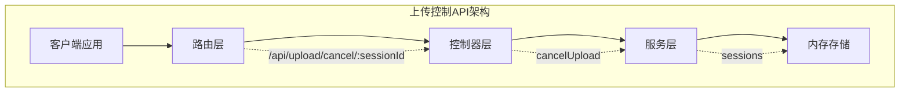
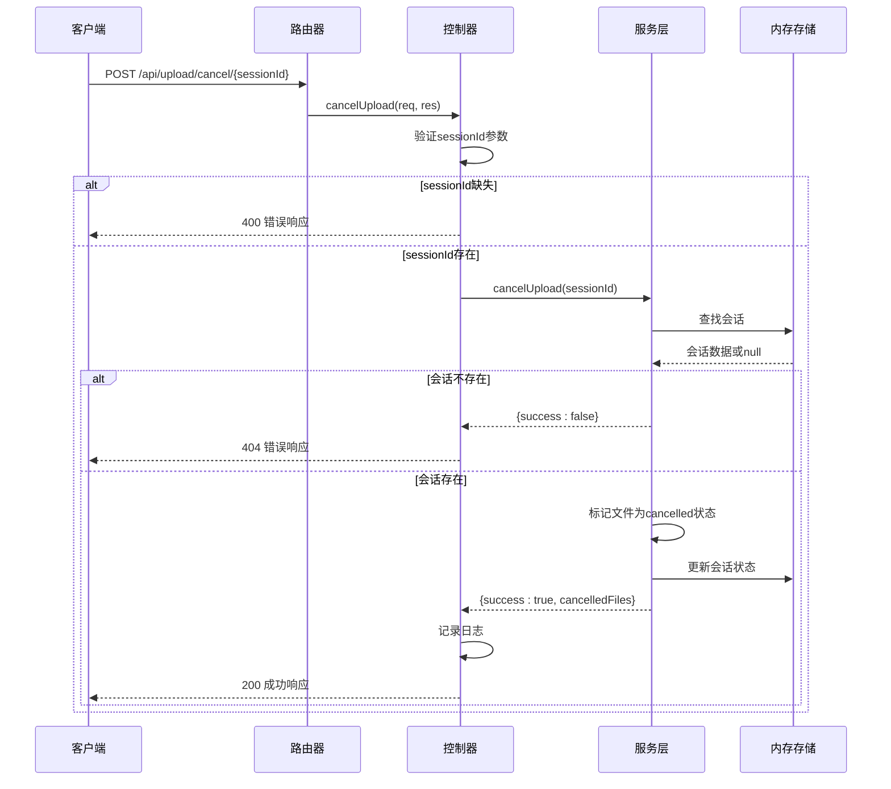
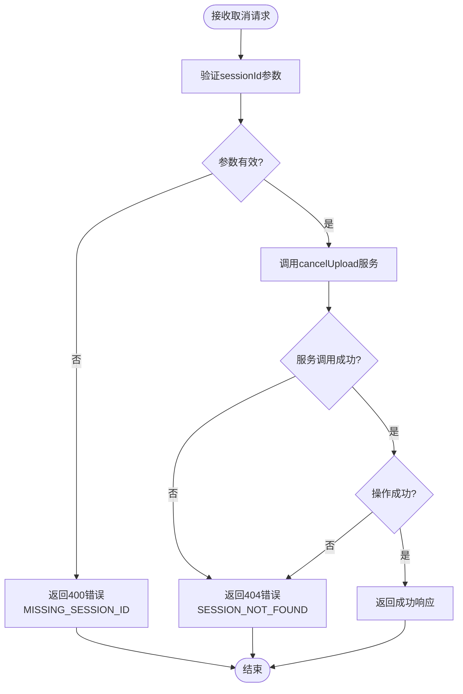
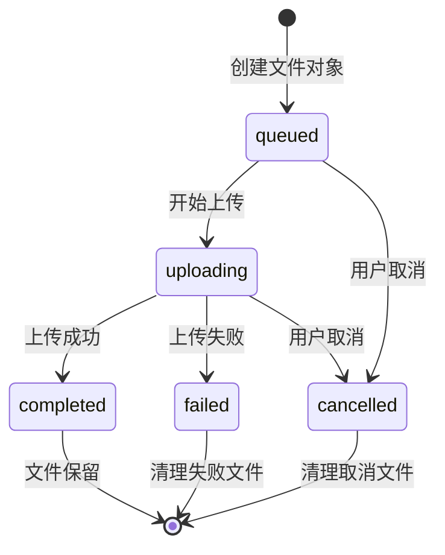

# 上传控制API文档

<cite>
**本文档中引用的文件**
- [uploadController.js](file://backend/src/controllers/uploadController.js)
- [uploadService.js](file://backend/src/services/uploadService.js)
- [upload.js](file://backend/src/routes/upload.js)
- [upload.js](file://backend/src/config/upload.js)
- [FileUploader.vue](file://frontend/src/components/FileUploader.vue)
- [API.md](file://backend/API.md)
- [API_DOCS.md](file://backend/API_DOCS.md)
</cite>

## 目录
1. [简介](#简介)
2. [API端点概述](#api端点概述)
3. [POST /api/upload/cancel/{sessionId} 详细说明](#post-apiuploadcancelsessionid-详细说明)
4. [cancelUpload方法实现分析](#cancelupload方法实现分析)
5. [请求和响应格式](#请求和响应格式)
6. [错误处理机制](#错误处理机制)
7. [文件状态机影响](#文件状态机影响)
8. [使用示例](#使用示例)
9. [最佳实践](#最佳实践)
10. [故障排除指南](#故障排除指南)

## 简介

本文档详细描述了Trae项目中上传控制API的核心功能，特别是`POST /api/upload/cancel/{sessionId}`端点的实现和使用方法。该API允许客户端取消指定会话中所有未完成的上传任务，确保资源的有效管理和用户体验的优化。

## API端点概述

上传控制API提供了以下核心功能：
- **会话管理**: 创建、查询和取消上传会话
- **进度监控**: 实时跟踪上传进度
- **文件控制**: 支持文件的删除和取消操作



**图表来源**
- [upload.js](file://backend/src/routes/upload.js#L58)
- [uploadController.js](file://backend/src/controllers/uploadController.js#L194)
- [uploadService.js](file://backend/src/services/uploadService.js#L8)

## POST /api/upload/cancel/{sessionId} 详细说明

### 端点功能

`POST /api/upload/cancel/{sessionId}`端点用于取消指定会话中所有未完成的上传任务。该操作会立即终止正在进行的上传进程，并清理相关的临时文件。

### 路径参数

| 参数名 | 类型 | 必需 | 描述 |
|--------|------|------|------|
| sessionId | string | 是 | 上传会话的唯一标识符，遵循UUID格式 |

### 请求处理流程



**图表来源**
- [uploadController.js](file://backend/src/controllers/uploadController.js#L195-L237)
- [uploadService.js](file://backend/src/services/uploadService.js#L325-L354)

**章节来源**
- [uploadController.js](file://backend/src/controllers/uploadController.js#L194-L237)
- [upload.js](file://backend/src/routes/upload.js#L58)

## cancelUpload方法实现分析

### 控制器层实现

控制器中的`cancelUpload`方法负责接收请求、验证参数并调用服务层执行取消操作：

#### 参数验证
- 检查`sessionId`路径参数是否存在
- 返回400错误响应如果参数缺失

#### 服务调用
- 调用`uploadService.cancelUpload(sessionId)`执行实际的取消逻辑
- 处理服务返回的结果

#### 响应生成
- 成功时返回包含取消文件列表的JSON响应
- 失败时返回适当的错误信息

### 服务层实现

服务层的`cancelUpload`方法实现了核心的业务逻辑：

#### 会话查找
```javascript
const session = sessions.get(sessionId);
if (!session) {
  return { success: false };
}
```

#### 文件状态更新
```javascript
session.files.forEach(file => {
  if (file.status === 'uploading' || file.status === 'queued') {
    file.status = 'cancelled';
    cancelledFiles.push(file.id);
  }
});
```

#### 状态同步
- 将会话整体状态设置为`cancelled`
- 记录结束时间戳
- 发送用户操作日志

**章节来源**
- [uploadController.js](file://backend/src/controllers/uploadController.js#L194-L237)
- [uploadService.js](file://backend/src/services/uploadService.js#L325-L354)

## 请求和响应格式

### 请求格式

#### HTTP请求
```http
POST /api/upload/cancel/550e8400-e29b-41d4-a716-446655440000
Content-Type: application/json
```

#### 请求头
- `Content-Type: application/json` - 表示请求体为JSON格式

### 成功响应格式

#### HTTP响应
```http
HTTP/1.1 200 OK
Content-Type: application/json

{
  "success": true,
  "sessionId": "550e8400-e29b-41d4-a716-446655440000",
  "cancelledFiles": ["550e8400-e29b-41d4-a716-446655440001"],
  "message": "成功取消1个文件的上传",
  "timestamp": "2025-11-14T14:04:33.889Z"
}
```

#### 响应字段说明

| 字段名 | 类型 | 描述 |
|--------|------|------|
| success | boolean | 操作是否成功 |
| sessionId | string | 取消操作的会话ID |
| cancelledFiles | array | 被取消的文件ID列表 |
| message | string | 操作结果的描述性消息 |
| timestamp | string | ISO格式的时间戳 |

### 错误响应格式

#### 会话不存在错误
```http
HTTP/1.1 404 Not Found
Content-Type: application/json

{
  "error": "SESSION_NOT_FOUND",
  "message": "上传会话不存在",
  "timestamp": "2025-11-14T14:04:33.889Z"
}
```

#### 参数缺失错误
```http
HTTP/1.1 400 Bad Request
Content-Type: application/json

{
  "error": "MISSING_SESSION_ID",
  "message": "缺少会话ID",
  "timestamp": "2025-11-14T14:04:33.889Z"
}
```

#### 服务器内部错误
```http
HTTP/1.1 500 Internal Server Error
Content-Type: application/json

{
  "error": "CANCELLATION_FAILED",
  "message": "取消上传失败",
  "timestamp": "2025-11-14T14:04:33.889Z"
}
```

**章节来源**
- [uploadController.js](file://backend/src/controllers/uploadController.js#L217-L228)
- [API.md](file://backend/API.md#L215-L234)

## 错误处理机制

### SESSION_NOT_FOUND错误

#### 触发条件
- 会话ID不存在于内存存储中
- 会话已过期被自动清理
- 提供了无效的UUID格式会话ID

#### 处理方式
```javascript
if (!result.success) {
  return res.status(404).json({
    error: 'SESSION_NOT_FOUND',
    message: '上传会话不存在',
    timestamp: new Date().toISOString()
  });
}
```

### 参数验证错误

#### MISSING_SESSION_ID
- 当路径参数`sessionId`缺失时触发
- 返回400状态码和详细错误信息

#### CANCELLATION_FAILED
- 服务层抛出异常时触发
- 返回500状态码表示服务器内部错误

### 错误处理流程图



**图表来源**
- [uploadController.js](file://backend/src/controllers/uploadController.js#L195-L237)

**章节来源**
- [uploadController.js](file://backend/src/controllers/uploadController.js#L195-L237)
- [API.md](file://backend/API.md#L274-L284)

## 文件状态机影响

### 状态转换图

取消操作对文件状态机产生直接影响：



### 取消操作的具体影响

#### 对进行中文件的影响
- **状态变更**: 将`uploading`状态改为`cancelled`
- **进度停止**: 中断上传进程，不再发送进度更新
- **资源释放**: 清理临时文件和内存占用

#### 对待上传文件的影响  
- **状态变更**: 将`queued`状态改为`cancelled`
- **队列移除**: 从上传队列中移除
- **立即生效**: 立即停止后续的上传尝试

#### 对已完成文件的影响
- **无影响**: 已完成的文件不受取消操作影响
- **保持不变**: 继续保留在系统中

### 清理机制

服务层实现了完善的清理机制：

```javascript
// 取消文件状态
session.files.forEach(file => {
  if (file.status === 'uploading' || file.status === 'queued') {
    file.status = 'cancelled';
    cancelledFiles.push(file.id);
  }
});

// 更新会话状态
session.overallStatus = 'cancelled';
session.sessionEndTime = new Date();
```

**章节来源**
- [uploadService.js](file://backend/src/services/uploadService.js#L325-L354)

## 使用示例

### curl命令示例

#### 基本取消请求
```bash
curl -X POST \
  http://localhost:8005/api/upload/cancel/550e8400-e29b-41d4-a716-446655440000 \
  -H "Content-Type: application/json"
```

#### 带详细输出的取消请求
```bash
curl -X POST \
  http://localhost:8005/api/upload/cancel/550e8400-e29b-41d4-a716-446655440000 \
  -H "Content-Type: application/json" \
  -v
```

### JavaScript示例

#### Fetch API实现
```javascript
async function cancelUpload(sessionId) {
  try {
    const response = await fetch(`/api/upload/cancel/${sessionId}`, {
      method: 'POST',
      headers: {
        'Content-Type': 'application/json'
      }
    });
    
    if (!response.ok) {
      const errorData = await response.json();
      throw new Error(`${errorData.error}: ${errorData.message}`);
    }
    
    const result = await response.json();
    console.log(`成功取消 ${result.cancelledFiles.length} 个文件`);
    return result;
    
  } catch (error) {
    console.error('取消上传失败:', error);
    throw error;
  }
}

// 使用示例
try {
  const result = await cancelUpload('550e8400-e29b-41d4-a716-446655440000');
  console.log('取消结果:', result);
} catch (error) {
  console.error('操作失败:', error);
}
```

#### Axios实现
```javascript
import axios from 'axios';

const uploadApiClient = axios.create({
  baseURL: 'http://localhost:8005',
  timeout: 30000,
  headers: {
    'Content-Type': 'application/json'
  }
});

async function cancelUploadWithAxios(sessionId) {
  try {
    const response = await uploadApiClient.post(`/api/upload/cancel/${sessionId}`);
    return response.data;
  } catch (error) {
    if (error.response) {
      // 服务器返回了错误响应
      throw new Error(`取消失败: ${error.response.data.message}`);
    } else if (error.request) {
      // 请求已发出但没有收到响应
      throw new Error('服务器无响应，请稍后重试');
    } else {
      // 在设置请求时发生错误
      throw new Error('请求配置错误');
    }
  }
}
```

### Vue.js集成示例

基于前端FileUploader组件的集成：

```javascript
// 在Vue组件中使用
export default {
  setup() {
    const cancelCurrentUpload = async (sessionId) => {
      try {
        const response = await fetch(`/api/upload/cancel/${sessionId}`, {
          method: 'POST'
        });
        
        if (response.ok) {
          const result = await response.json();
          // 更新UI状态
          emit('upload-cancelled', {
            sessionId: result.sessionId,
            cancelledFiles: result.cancelledFiles
          });
          return result;
        } else {
          const error = await response.json();
          throw new Error(error.message);
        }
      } catch (error) {
        console.error('取消上传失败:', error);
        // 显示错误信息给用户
        emit('upload-error', error.message);
      }
    };
    
    return {
      cancelCurrentUpload
    };
  }
};
```

**章节来源**
- [API.md](file://backend/API.md#L320-L337)
- [API_DOCS.md](file://backend/API_DOCS.md#L347-L359)

## 最佳实践

### 客户端实现建议

#### 1. 错误处理策略
```javascript
// 推荐的错误处理模式
async function safeCancelUpload(sessionId) {
  try {
    const result = await cancelUpload(sessionId);
    // 处理成功情况
    return result;
  } catch (error) {
    // 根据错误类型采取不同策略
    if (error.message.includes('SESSION_NOT_FOUND')) {
      // 会话已不存在，无需重试
      console.warn('会话已过期或不存在');
    } else if (error.message.includes('网络错误')) {
      // 网络问题，可以考虑重试
      console.warn('网络连接异常，建议重试');
    } else {
      // 其他错误，记录并通知用户
      console.error('取消上传失败:', error);
    }
    throw error;
  }
}
```

#### 2. 用户体验优化
```javascript
// 显示取消进度
class UploadManager {
  async cancelUploadWithFeedback(sessionId) {
    try {
      // 显示加载状态
      this.showLoading('正在取消上传...');
      
      const result = await cancelUpload(sessionId);
      
      // 更新UI反馈
      this.updateUploadStatus('cancelled');
      this.showSuccess(`已取消 ${result.cancelledFiles.length} 个文件`);
      
      return result;
    } catch (error) {
      this.showError('取消上传失败，请重试');
      throw error;
    } finally {
      // 隐藏加载状态
      this.hideLoading();
    }
  }
}
```

#### 3. 并发控制
```javascript
// 防止同时发起多个取消请求
class CancelManager {
  constructor() {
    this.cancelInProgress = false;
  }
  
  async cancelOnce(sessionId) {
    if (this.cancelInProgress) {
      throw new Error('已有取消操作进行中');
    }
    
    try {
      this.cancelInProgress = true;
      return await cancelUpload(sessionId);
    } finally {
      this.cancelInProgress = false;
    }
  }
}
```

### 服务端优化建议

#### 1. 日志记录
```javascript
// 在cancelUpload方法中添加详细日志
logger.user('取消上传', {
  sessionId,
  cancelledFilesCount: cancelledFiles.length,
  timestamp: new Date().toISOString()
});
```

#### 2. 性能监控
```javascript
// 监控取消操作的性能
const startTime = Date.now();
const result = await uploadService.cancelUpload(sessionId);
const duration = Date.now() - startTime;

if (duration > 1000) {
  logger.warn('取消上传操作耗时较长', {
    sessionId,
    duration,
    cancelledFiles: result.cancelledFiles.length
  });
}
```

#### 3. 资源清理
```javascript
// 确保及时清理取消的文件
afterCancel(sessionId, cancelledFiles) {
  // 异步清理临时文件
  setTimeout(() => {
    this.cleanupTemporaryFiles(cancelledFiles);
  }, 5000);
}
```

## 故障排除指南

### 常见问题及解决方案

#### 1. SESSION_NOT_FOUND错误

**症状**: 收到404错误，提示"上传会话不存在"

**可能原因**:
- 会话已过期（默认24小时）
- 提供了错误的会话ID
- 会话已被自动清理

**解决方案**:
```javascript
// 检查会话状态
async function checkSessionStatus(sessionId) {
  try {
    const response = await fetch(`/api/upload/progress/${sessionId}`);
    
    if (response.status === 404) {
      console.log('会话已过期或不存在，需要重新创建');
      return 'expired';
    }
    
    const progress = await response.json();
    return progress.overallStatus;
  } catch (error) {
    console.error('检查会话状态失败:', error);
    return 'unknown';
  }
}
```

#### 2. 取消操作无响应

**症状**: 取消请求发送后没有返回响应

**可能原因**:
- 服务器负载过高
- 网络连接问题
- 会话状态异常

**解决方案**:
```javascript
// 添加超时处理
async function cancelUploadWithTimeout(sessionId, timeout = 30000) {
  const controller = new AbortController();
  const timeoutId = setTimeout(() => controller.abort(), timeout);
  
  try {
    const response = await fetch(
      `/api/upload/cancel/${sessionId}`,
      { method: 'POST', signal: controller.signal }
    );
    clearTimeout(timeoutId);
    return response.json();
  } catch (error) {
    clearTimeout(timeoutId);
    if (error.name === 'AbortError') {
      throw new Error('取消操作超时，请稍后重试');
    }
    throw error;
  }
}
```

#### 3. 部分文件未被取消

**症状**: 取消操作报告成功，但某些文件仍在上传

**可能原因**:
- 文件上传速度极快，在取消前已完成
- 并发上传导致的竞争条件

**解决方案**:
```javascript
// 实现双重确认机制
async function robustCancelUpload(sessionId) {
  // 第一次取消
  const firstResult = await cancelUpload(sessionId);
  
  // 等待一段时间让取消操作生效
  await new Promise(resolve => setTimeout(resolve, 1000));
  
  // 检查剩余上传状态
  const progress = await getUploadProgress(sessionId);
  
  if (progress && progress.files.some(file => file.status === 'uploading')) {
    // 如果仍有上传中的文件，尝试强制取消
    console.warn('检测到残留上传任务，可能需要重新取消');
    // 实现更严格的取消逻辑
  }
  
  return firstResult;
}
```

### 调试工具和技巧

#### 1. 日志分析
```javascript
// 启用详细日志
const debugLogger = {
  logCancelAttempt: (sessionId) => {
    console.log(`[CANCEL] 尝试取消会话: ${sessionId}`);
  },
  
  logCancelSuccess: (sessionId, cancelledFiles) => {
    console.log(`[CANCEL] 会话 ${sessionId} 取消成功，取消了 ${cancelledFiles.length} 个文件`);
  },
  
  logCancelFailure: (sessionId, error) => {
    console.error(`[CANCEL] 会话 ${sessionId} 取消失败:`, error);
  }
};
```

#### 2. 状态监控
```javascript
// 实时监控取消操作
class CancelMonitor {
  constructor() {
    this.monitoring = new Map();
  }
  
  startMonitoring(sessionId) {
    this.monitoring.set(sessionId, {
      startTime: Date.now(),
      cancelledFiles: [],
      status: 'monitoring'
    });
  }
  
  updateMonitoring(sessionId, fileStatus) {
    const monitor = this.monitoring.get(sessionId);
    if (monitor) {
      if (fileStatus === 'cancelled') {
        monitor.cancelledFiles.push(fileStatus.fileId);
      }
    }
  }
  
  getReport(sessionId) {
    const monitor = this.monitoring.get(sessionId);
    if (!monitor) return null;
    
    return {
      duration: Date.now() - monitor.startTime,
      cancelledFiles: monitor.cancelledFiles,
      successRate: monitor.cancelledFiles.length / monitor.totalFiles
    };
  }
}
```

**章节来源**
- [uploadController.js](file://backend/src/controllers/uploadController.js#L195-L237)
- [uploadService.js](file://backend/src/services/uploadService.js#L325-L354)