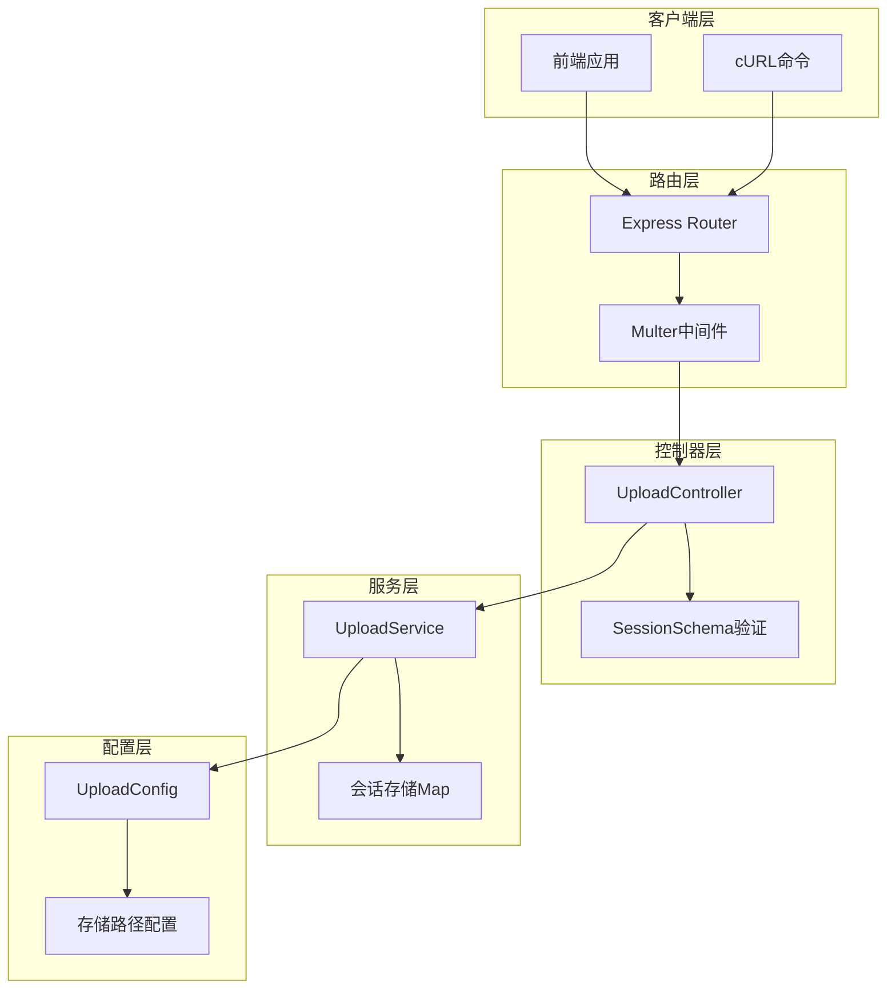
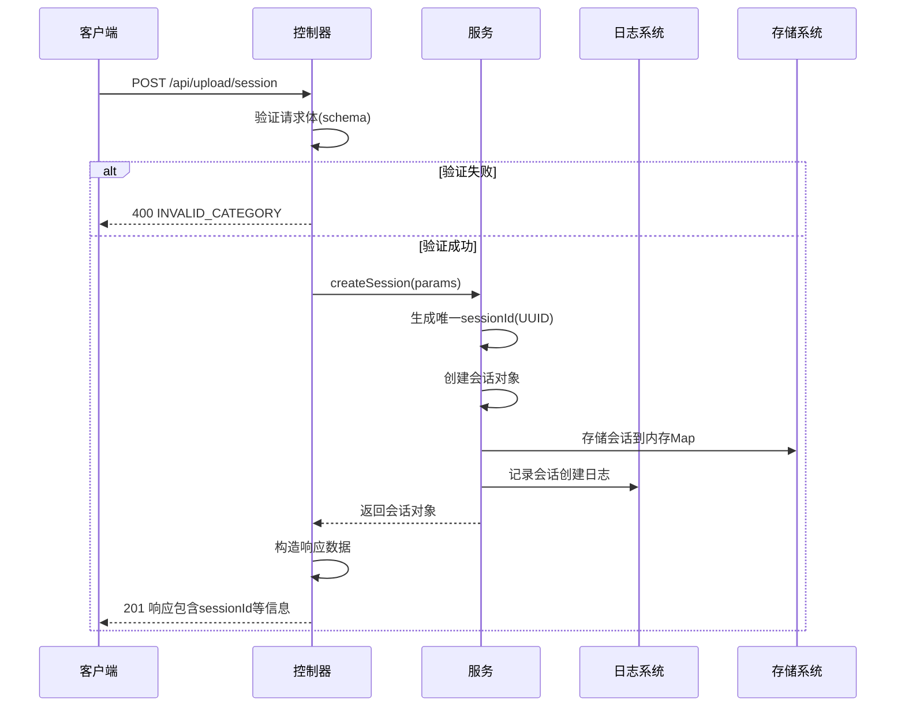

# 会话管理

<cite>
**本文档中引用的文件**
- [uploadController.js](file://backend/src/controllers/uploadController.js)
- [uploadService.js](file://backend/src/services/uploadService.js)
- [upload.js](file://backend/src/routes/upload.js)
- [upload.js](file://backend/src/config/upload.js)
- [upload.js](file://backend/src/middleware/upload.js)
- [API.md](file://backend/API.md)
</cite>

## 目录
1. [概述](#概述)
2. [API端点详情](#api端点详情)
3. [请求参数详解](#请求参数详解)
4. [响应格式说明](#响应格式说明)
5. [错误处理机制](#错误处理机制)
6. [后端实现架构](#后端实现架构)
7. [完整使用示例](#完整使用示例)
8. [最佳实践建议](#最佳实践建议)

## 概述

上传会话管理API提供了创建批量文件上传会话的核心功能。通过POST `/api/upload/session`端点，客户端可以初始化一个专门的上传会话，该会话包含特定的文件分类、预期文件数量等元数据，并返回唯一的会话标识符用于后续的文件上传操作。

### 核心特性

- **分类管理**：支持个人视频和个人景区视频两种分类
- **预期文件控制**：可预设预期上传的文件数量（1-3个）
- **会话隔离**：每个会话独立管理，确保上传过程的有序性
- **实时监控**：会话状态实时更新，支持进度跟踪

## API端点详情

### 创建上传会话

**端点**: `POST /api/upload/session`

**功能**: 创建新的批量上传会话，返回会话ID及相关配置信息

**认证**: 无需认证（开发环境）

**请求头**:
```http
Content-Type: application/json
```

**请求体结构**:
```json
{
  "category": "personal",
  "expectedFiles": 2
}
```

**响应状态码**:
- `201 Created`: 会话创建成功
- `400 Bad Request`: 请求参数无效
- `500 Internal Server Error`: 服务器内部错误

**节来源**
- [uploadController.js](file://backend/src/controllers/uploadController.js#L59-L98)
- [upload.js](file://backend/src/routes/upload.js#L48)

## 请求参数详解

### category 参数

**类型**: 字符串  
**必需**: 是  
**取值范围**: `"personal"` 或 `"scenic"`

**作用与验证**:
- 决定文件的存储分类
- 必须严格匹配枚举值
- 影响存储路径和后续处理逻辑

**验证规则**:
```javascript
Joi.string().valid('personal', 'scenic').required()
```

### expectedFiles 参数

**类型**: 整数  
**必需**: 否  
**默认值**: `1`  
**取值范围**: `1-3`

**作用与验证**:
- 预估本次会话需要上传的文件数量
- 用于前端界面显示和用户体验优化
- 最大值受系统配置限制

**验证规则**:
```javascript
Joi.number().integer().min(1).max(3).default(1)
```

**节来源**
- [uploadController.js](file://backend/src/controllers/uploadController.js#L20-L23)

## 响应格式说明

### 成功响应结构

```json
{
  "sessionId": "550e8400-e29b-41d4-a716-446655440000",
  "category": "personal",
  "uploadPath": "/backend/upload/personal/",
  "maxFiles": 3,
  "allowedTypes": ["mp4", "avi"],
  "maxFileSize": 314572800,
  "createdAt": "2025-11-14T13:54:11.000Z",
  "timestamp": "2025-11-14T13:54:11.000Z"
}
```

### 响应字段详解

| 字段名 | 类型 | 描述 | 示例值 |
|--------|------|------|--------|
| `sessionId` | String | 唯一的会话标识符，UUID格式 | `"550e8400-e29b-41d4-a716-446655440000"` |
| `category` | String | 文件分类，personal或scenic | `"personal"` |
| `uploadPath` | String | 文件存储路径 | `"/backend/upload/personal/"` |
| `maxFiles` | Integer | 会话允许的最大文件数量 | `3` |
| `allowedTypes` | Array | 允许的文件扩展名列表 | `["mp4", "avi"]` |
| `maxFileSize` | Integer | 单个文件最大允许大小（字节） | `314572800` (300MB) |
| `createdAt` | String | 会话创建时间（ISO 8601格式） | `"2025-11-14T13:54:11.000Z"` |
| `timestamp` | String | 响应生成时间（ISO 8601格式） | `"2025-11-14T13:54:11.000Z"` |

**节来源**
- [uploadController.js](file://backend/src/controllers/uploadController.js#L80-L88)

## 错误处理机制

### INVALID_CATEGORY 错误

**触发条件**:
- `category` 参数不在允许范围内
- `category` 参数为空或未提供
- `category` 参数类型不正确

**错误响应**:
```json
{
  "error": "INVALID_CATEGORY",
  "message": "无效的文件分类",
  "details": "'category' must be one of [personal, scenic]",
  "timestamp": "2025-11-14T13:54:11.000Z"
}
```

**HTTP状态码**: `400 Bad Request`

### SESSION_CREATION_FAILED 错误

**触发条件**:
- 数据库连接异常
- 内存分配失败
- 其他系统级错误

**错误响应**:
```json
{
  "error": "SESSION_CREATION_FAILED",
  "message": "创建上传会话失败",
  "timestamp": "2025-11-14T13:54:11.000Z"
}
```

**HTTP状态码**: `500 Internal Server Error`

**节来源**
- [uploadController.js](file://backend/src/controllers/uploadController.js#L63-L70)
- [uploadController.js](file://backend/src/controllers/uploadController.js#L92-L97)

## 后端实现架构

### 架构概览



**图表来源**
- [upload.js](file://backend/src/routes/upload.js#L1-62)
- [uploadController.js](file://backend/src/controllers/uploadController.js#L1-285)
- [uploadService.js](file://backend/src/services/uploadService.js#L1-416)

### 会话创建流程



**图表来源**
- [uploadController.js](file://backend/src/controllers/uploadController.js#L59-L98)
- [uploadService.js](file://backend/src/services/uploadService.js#L88-L114)

### 关键实现细节

#### 1. 会话ID生成机制

使用UUID v4算法生成唯一标识符：
```javascript
const sessionId = uuidv4(); // 例如："550e8400-e29b-41d4-a716-446655440000"
```

#### 2. 分类存储路径映射

基于分类自动确定存储路径：
```javascript
const uploadPath = config.categoryPaths[category];
// personal -> "/backend/upload/personal/"
// scenic -> "/backend/upload/scenic/"
```

#### 3. 会话状态管理

会话对象包含完整的状态信息：
```javascript
const session = {
  sessionId,           // UUID
  category,            // 分类
  expectedFiles,       // 预期文件数
  maxFiles: 3,         // 最大文件数
  uploadPath,          // 存储路径
  overallStatus: 'pending', // 状态
  totalProgress: 0,    // 总进度
  createdAt: new Date() // 创建时间
};
```

**节来源**
- [uploadService.js](file://backend/src/services/uploadService.js#L89-L114)
- [upload.js](file://backend/src/config/upload.js#L23-L26)

## 完整使用示例

### curl命令示例

#### 创建个人视频会话
```bash
curl -X POST http://localhost:8005/api/upload/session \
  -H "Content-Type: application/json" \
  -d '{
    "category": "personal",
    "expectedFiles": 2
  }'
```

#### 创建景区视频会话
```bash
curl -X POST http://localhost:8005/api/upload/session \
  -H "Content-Type: application/json" \
  -d '{
    "category": "scenic",
    "expectedFiles": 3
  }'
```

### JavaScript Fetch示例

#### 基础会话创建
```javascript
async function createUploadSession(category = 'personal', expectedFiles = 1) {
  try {
    const response = await fetch('/api/upload/session', {
      method: 'POST',
      headers: {
        'Content-Type': 'application/json'
      },
      body: JSON.stringify({ category, expectedFiles })
    });
    
    if (!response.ok) {
      throw new Error(`HTTP error! status: ${response.status}`);
    }
    
    const sessionData = await response.json();
    console.log('会话创建成功:', sessionData);
    return sessionData;
  } catch (error) {
    console.error('会话创建失败:', error);
    throw error;
  }
}
```

#### 完整上传流程示例
```javascript
async function completeUploadWorkflow(files, category = 'personal') {
  try {
    // 1. 验证文件（可选步骤）
    const validationResponse = await fetch('/api/upload/validate', {
      method: 'POST',
      headers: { 'Content-Type': 'application/json' },
      body: JSON.stringify({ files })
    });
    
    // 2. 创建上传会话
    const sessionResponse = await fetch('/api/upload/session', {
      method: 'POST',
      headers: { 'Content-Type': 'application/json' },
      body: JSON.stringify({ category, expectedFiles: files.length })
    });
    
    const { sessionId } = await sessionResponse.json();
    
    // 3. 准备批量上传数据
    const formData = new FormData();
    files.forEach(file => formData.append('files', file));
    formData.append('sessionId', sessionId);
    formData.append('category', category);
    
    // 4. 执行批量上传
    const uploadResponse = await fetch('/api/upload/batch', {
      method: 'POST',
      body: formData
    });
    
    const uploadResult = await uploadResponse.json();
    return uploadResult;
    
  } catch (error) {
    console.error('完整上传流程失败:', error);
    throw error;
  }
}
```

**节来源**
- [API.md](file://backend/API.md#L324-L337)
- [API.md](file://backend/API.md#L288-L318)

## 最佳实践建议

### 1. 参数验证策略

- 始终验证`category`参数的有效性
- 根据业务需求合理设置`expectedFiles`值
- 实施客户端和服务端双重验证

### 2. 错误处理最佳实践

```javascript
// 推荐的错误处理模式
try {
  const response = await fetch('/api/upload/session', {
    method: 'POST',
    headers: { 'Content-Type': 'application/json' },
    body: JSON.stringify(data)
  });
  
  if (!response.ok) {
    const errorData = await response.json();
    throw new Error(`${errorData.error}: ${errorData.message}`);
  }
  
  return await response.json();
  
} catch (error) {
  console.error('会话创建失败:', error.message);
  // 实施适当的重试机制或用户提示
}
```

### 3. 会话生命周期管理

- 会话默认有效期24小时
- 系统每小时清理过期会话
- 建议及时使用创建的会话，避免超时

### 4. 性能优化建议

- 批量上传前先进行文件验证
- 合理设置预期文件数量以优化用户体验
- 监控会话创建频率，避免资源浪费

### 5. 安全考虑

- 虽然当前版本无需认证，但建议在生产环境中实施JWT认证
- 验证所有输入参数，防止恶意攻击
- 监控异常的会话创建行为

**节来源**
- [upload.js](file://backend/src/config/upload.js#L36-L41)
- [uploadService.js](file://backend/src/services/uploadService.js#L393-L405)