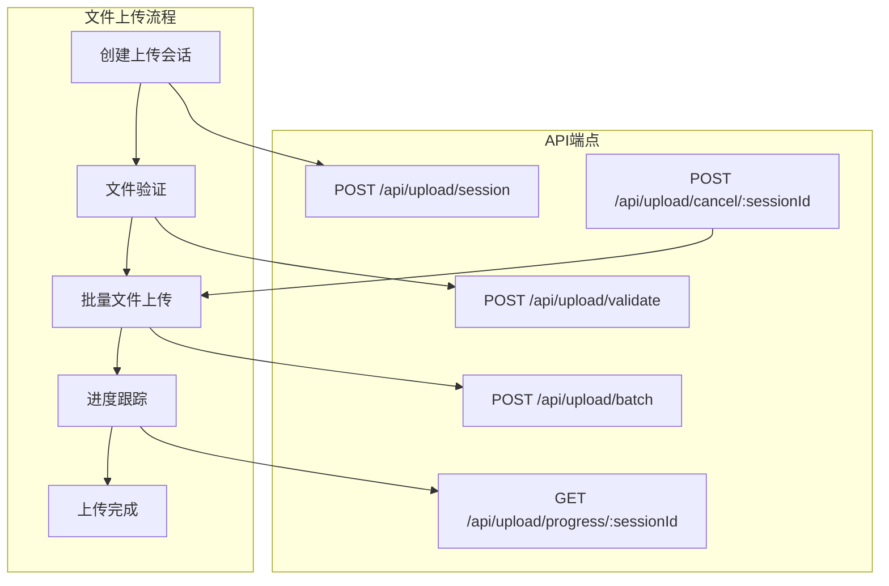
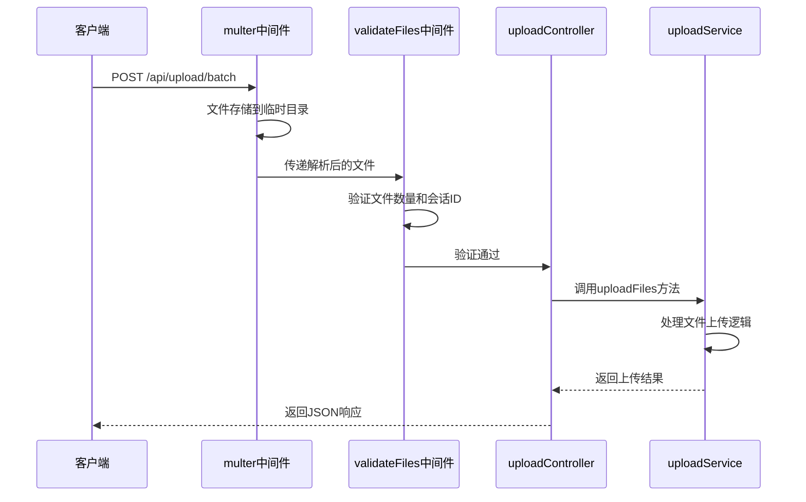
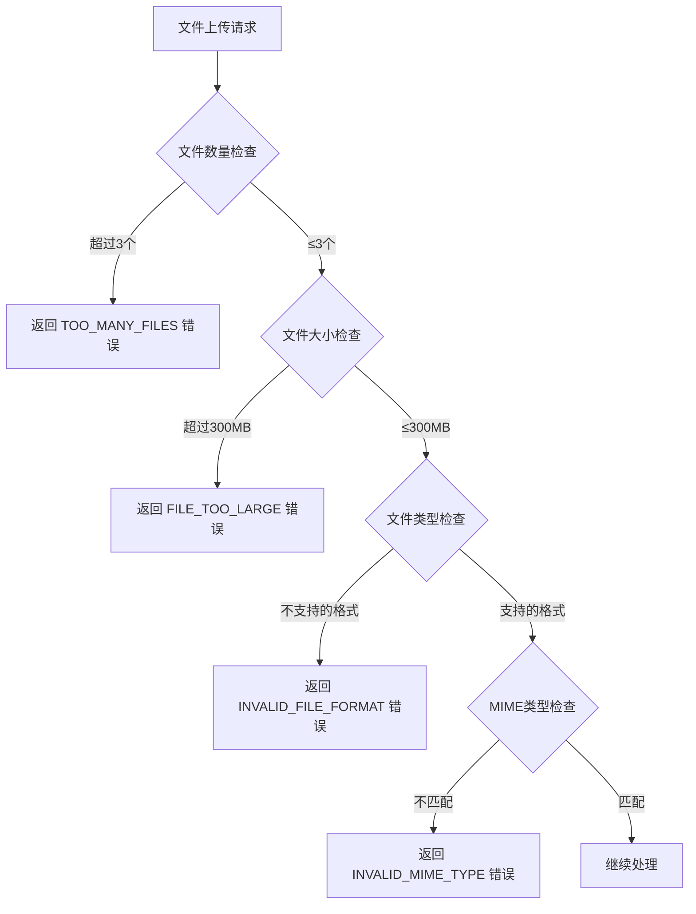
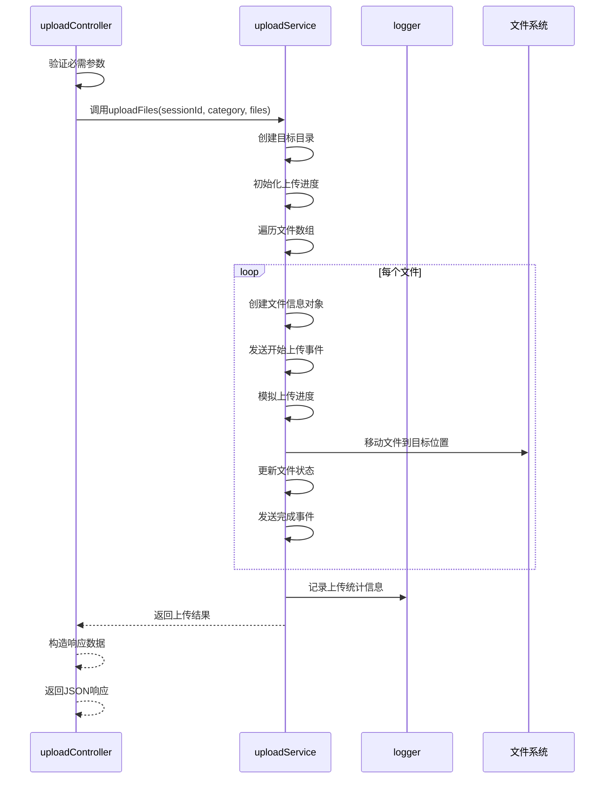
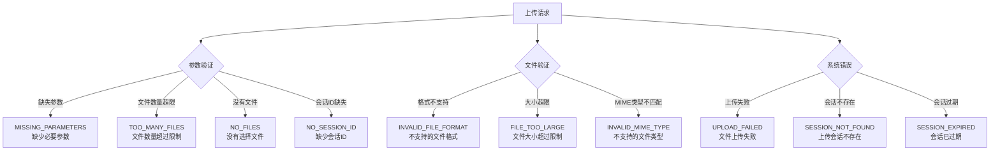
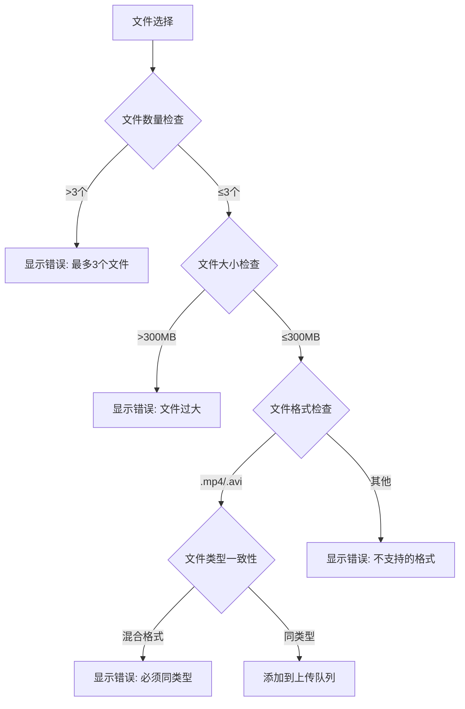
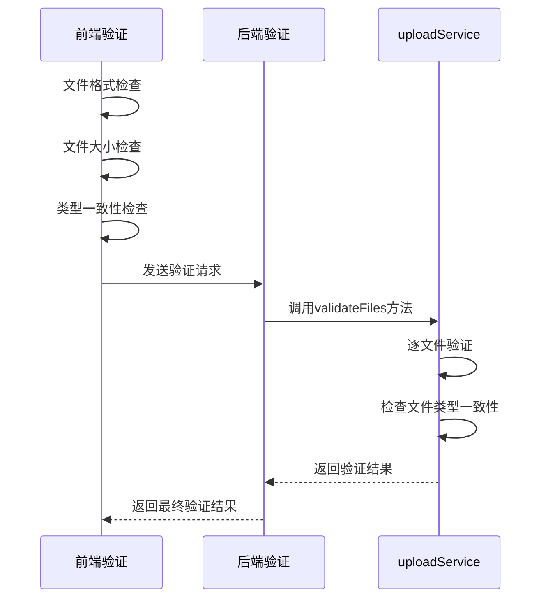
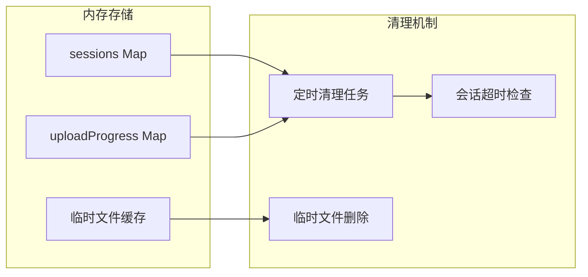

# 文件上传

<cite>
**本文档中引用的文件**
- [backend/src/routes/upload.js](file://backend/src/routes/upload.js)
- [backend/src/controllers/uploadController.js](file://backend/src/controllers/uploadController.js)
- [backend/src/services/uploadService.js](file://backend/src/services/uploadService.js)
- [backend/src/middleware/upload.js](file://backend/src/middleware/upload.js)
- [backend/src/config/upload.js](file://backend/src/config/upload.js)
- [backend/API_DOCS.md](file://backend/API_DOCS.md)
- [frontend/src/components/FileUploader.vue](file://frontend/src/components/FileUploader.vue)
- [specs/001-responsive-h5-upload/spec.md](file://specs/001-responsive-h5-upload/spec.md)
</cite>

## 目录
1. [简介](#简介)
2. [API端点概述](#api端点概述)
3. [POST /api/upload/batch 端点详解](#post-apiuploadbatch-端点详解)
4. [multer中间件配置](#multer中间件配置)
5. [uploadFiles方法实现](#uploadfiles方法实现)
6. [请求示例](#请求示例)
7. [响应格式](#响应格式)
8. [错误处理](#错误处理)
9. [文件验证机制](#文件验证机制)
10. [性能考虑](#性能考虑)

## 简介

批量文件上传API提供了完整的视频文件上传解决方案，支持最多3个同类型视频文件（mp4/avi）的批量上传。该系统采用Express.js框架构建，集成了multer中间件进行文件处理，并提供了实时进度跟踪和WebSocket通信功能。

### 核心特性

- ✅ 支持最多3个同类型视频文件上传
- ✅ 文件格式验证：mp4/avi (最大300MB)
- ✅ 文件分类存储：个人视频/景区视频
- ✅ 实时上传进度跟踪
- ✅ WebSocket实时通信
- ✅ 完整的错误处理机制
- ✅ 请求限流和安全防护

## API端点概述



**图表来源**
- [backend/src/routes/upload.js](file://backend/src/routes/upload.js#L47-L62)

**章节来源**
- [backend/src/routes/upload.js](file://backend/src/routes/upload.js#L1-L62)
- [backend/API_DOCS.md](file://backend/API_DOCS.md#L1-L50)

## POST /api/upload/batch 端点详解

### 端点信息

- **URL**: `/api/upload/batch`
- **方法**: `POST`
- **内容类型**: `multipart/form-data`
- **认证**: 需要会话ID和文件分类参数

### 请求参数

| 参数名 | 类型 | 必需 | 描述 | 示例值 |
|--------|------|------|------|--------|
| `files` | File[] | 是 | 要上传的文件数组，最多3个 | 多个视频文件 |
| `sessionId` | String | 是 | 上传会话ID | `"0a77bff2-52bc-4941-9b1f-b41ef8a37c53"` |
| `category` | String | 是 | 文件分类 | `"personal"` 或 `"scenic"` |

### 请求头

```http
Content-Type: multipart/form-data
```

### 文件字段处理机制

系统通过以下中间件链处理文件上传请求：



**图表来源**
- [backend/src/routes/upload.js](file://backend/src/routes/upload.js#L50-L54)
- [backend/src/middleware/upload.js](file://backend/src/middleware/upload.js#L107-L109)

**章节来源**
- [backend/src/routes/upload.js](file://backend/src/routes/upload.js#L50-L54)

## multer中间件配置

### 临时存储目录配置

multer中间件配置了专门的临时存储目录用于文件上传：

```mermaid
graph LR
subgraph "文件上传流程"
A[客户端上传] --> B[临时存储目录]
B --> C[文件验证]
C --> D[目标目录]
end
subgraph "配置详情"
E[tempDir: ../../upload/temp]
F[destination: tempDir]
G[filename: temp-{timestamp}-{random}]
end
B --> E
B --> F
B --> G
```

**图表来源**
- [backend/src/middleware/upload.js](file://backend/src/middleware/upload.js#L8-L21)

### 文件过滤器配置

系统实现了严格的文件过滤机制：

| 过滤条件 | 验证规则 | 错误处理 |
|----------|----------|----------|
| 文件扩展名 | 仅允许 `.mp4` 和 `.avi` | 返回 `INVALID_FILE_FORMAT` 错误 |
| MIME类型 | 仅允许 `video/mp4` 和 `video/x-msvideo` | 返回 `INVALID_MIME_TYPE` 错误 |
| 文件大小 | 最大300MB | 返回 `FILE_TOO_LARGE` 错误 |
| 文件数量 | 最多3个文件 | 返回 `TOO_MANY_FILES` 错误 |

### 大小和数量限制



**图表来源**
- [backend/src/middleware/upload.js](file://backend/src/middleware/upload.js#L25-L44)
- [backend/src/config/upload.js](file://backend/src/config/upload.js#L8-L17)

**章节来源**
- [backend/src/middleware/upload.js](file://backend/src/middleware/upload.js#L1-L110)
- [backend/src/config/upload.js](file://backend/src/config/upload.js#L1-L53)

## uploadFiles方法实现

### 方法签名和参数验证

uploadController中的uploadFiles方法负责处理批量文件上传的核心逻辑：



**图表来源**
- [backend/src/controllers/uploadController.js](file://backend/src/controllers/uploadController.js#L102-L147)
- [backend/src/services/uploadService.js](file://backend/src/services/uploadService.js#L118-L296)

### 上传流程详细步骤

1. **参数验证阶段**
   - 检查sessionId和category参数是否存在
   - 验证文件数组的有效性
   - 确保会话存在且有效

2. **目录准备阶段**
   - 根据分类创建目标上传目录
   - 确保目录权限正确
   - 初始化上传进度跟踪

3. **文件处理阶段**
   - 为每个文件创建进度跟踪对象
   - 发送初始进度事件
   - 模拟上传进度（10%, 25%, 50%, 75%, 90%, 100%）
   - 移动文件到最终存储位置
   - 更新文件元数据和状态

4. **结果汇总阶段**
   - 计算上传统计信息
   - 更新会话状态
   - 发送最终进度通知
   - 返回标准化响应

**章节来源**
- [backend/src/controllers/uploadController.js](file://backend/src/controllers/uploadController.js#L102-L147)
- [backend/src/services/uploadService.js](file://backend/src/services/uploadService.js#L118-L296)

## 请求示例

### curl命令示例

#### 基本文件上传

```bash
# 创建会话（实际应用中通常由前端完成）
curl -X POST "http://localhost:8005/api/upload/session" \
  -H "Content-Type: application/json" \
  -d '{
    "category": "personal",
    "expectedFiles": 2
  }'

# 使用会话ID进行批量上传
curl -X POST "http://localhost:8005/api/upload/batch" \
  -H "Content-Type: multipart/form-data" \
  -F "files=@video1.mp4" \
  -F "files=@video2.avi" \
  -F "sessionId=your-session-id" \
  -F "category=personal"
```

#### JavaScript Fetch API示例

```javascript
// 使用FormData构造上传请求
async function uploadFiles(files, sessionId, category) {
  const formData = new FormData();
  
  // 添加文件
  files.forEach(file => {
    formData.append('files', file);
  });
  
  // 添加会话ID和分类
  formData.append('sessionId', sessionId);
  formData.append('category', category);
  
  try {
    const response = await fetch('/api/upload/batch', {
      method: 'POST',
      body: formData
    });
    
    if (!response.ok) {
      throw new Error(`HTTP error! status: ${response.status}`);
    }
    
    const result = await response.json();
    return result;
  } catch (error) {
    console.error('上传失败:', error);
    throw error;
  }
}
```

#### Vue.js组件集成示例

基于前端FileUploader组件的实现：

```javascript
// 前端文件上传流程
const handleUpload = async () => {
  try {
    // 准备FormData
    const formData = new FormData();
    files.value.forEach(file => formData.append('files', file));
    formData.append('sessionId', sessionId.value);
    formData.append('category', category.value);
    
    // 发送上传请求
    const response = await fetch('/api/upload/batch', {
      method: 'POST',
      body: formData
    });
    
    const result = await response.json();
    
    if (response.ok) {
      // 更新UI状态
      uploadFiles.value = result.files;
      completedFiles.value = result.summary.completedFiles;
      
      // 检查上传结果
      if (result.summary.failedFiles === 0) {
        // 上传成功处理
        showSuccessMessage();
      }
    }
  } catch (error) {
    handleError(error);
  }
};
```

**章节来源**
- [backend/API_DOCS.md](file://backend/API_DOCS.md#L347-L382)
- [frontend/src/components/FileUploader.vue](file://frontend/src/components/FileUploader.vue#L206-L245)

## 响应格式

### 成功响应结构

批量文件上传成功后的标准响应格式：

```json
{
  "success": true,
  "sessionId": "0a77bff2-52bc-4941-9b1f-b41ef8a37c53",
  "files": [
    {
      "id": "550e8400-e29b-41d4-a716-446655440001",
      "originalName": "我的视频.mp4",
      "fileName": "0a77bff2_2025-11-14T14-04-33-889Z_我的视频.mp4",
      "filePath": "/backend/upload/personal/0a77bff2_2025-11-14T14-04-33-889Z_我的视频.mp4",
      "fileSize": 104857600,
      "fileType": "mp4",
      "status": "completed",
      "progress": 100,
      "uploadSpeed": 2097152,
      "uploadStartTime": "2025-11-14T14:04:33.889Z",
      "uploadEndTime": "2025-11-14T14:05:00.123Z",
      "isValidFormat": true,
      "isValidSize": true
    }
  ],
  "summary": {
    "totalFiles": 1,
    "completedFiles": 1,
    "failedFiles": 0,
    "totalSize": 104857600
  },
  "timestamp": "2025-11-14T14:05:00.123Z"
}
```

### 响应字段说明

| 字段名 | 类型 | 描述 |
|--------|------|------|
| `success` | Boolean | 操作是否成功的标志 |
| `sessionId` | String | 关联的上传会话ID |
| `files` | Array | 上传的文件信息数组 |
| `summary` | Object | 上传摘要信息 |
| `timestamp` | String | 响应生成的时间戳 |

### 文件对象详细字段

| 字段名 | 类型 | 描述 |
|--------|------|------|
| `id` | String | 文件唯一标识符 |
| `originalName` | String | 原始文件名 |
| `fileName` | String | 服务器生成的文件名 |
| `filePath` | String | 文件在服务器上的完整路径 |
| `fileSize` | Number | 文件大小（字节） |
| `fileType` | String | 文件扩展名（不带点） |
| `status` | String | 文件状态：pending/uploading/completed/failed/cancelled |
| `progress` | Number | 上传进度百分比（0-100） |
| `uploadSpeed` | Number | 上传速度（字节/秒） |
| `uploadStartTime` | String | 上传开始时间 |
| `uploadEndTime` | String | 上传结束时间 |
| `isValidFormat` | Boolean | 文件格式验证结果 |
| `isValidSize` | Boolean | 文件大小验证结果 |

### 上传摘要信息

| 字段名 | 类型 | 描述 |
|--------|------|------|
| `totalFiles` | Number | 总共上传的文件数量 |
| `completedFiles` | Number | 上传成功的文件数量 |
| `failedFiles` | Number | 上传失败的文件数量 |
| `totalSize` | Number | 所有文件的总大小（字节） |

**章节来源**
- [backend/src/controllers/uploadController.js](file://backend/src/controllers/uploadController.js#L125-L136)

## 错误处理

### 可能的错误码和处理方式

系统定义了完整的错误处理机制，涵盖各种异常情况：



**图表来源**
- [backend/src/routes/upload.js](file://backend/src/routes/upload.js#L14-L43)
- [backend/src/middleware/upload.js](file://backend/src/middleware/upload.js#L57-L104)

### 错误响应格式

所有错误响应都遵循统一的格式：

```json
{
  "error": "ERROR_CODE",
  "message": "错误描述信息",
  "timestamp": "2025-11-14T14:04:33.889Z"
}
```

### 错误码详细说明

| 错误代码 | HTTP状态码 | 描述 | 解决方案 |
|----------|------------|------|----------|
| `MISSING_PARAMETERS` | 400 | 缺少必要参数 | 确保提供sessionId和category参数 |
| `TOO_MANY_FILES` | 400 | 文件数量超过限制 | 最多只能上传3个文件 |
| `NO_FILES` | 400 | 没有选择文件 | 请选择要上传的文件 |
| `NO_SESSION_ID` | 400 | 缺少会话ID | 确保提供有效的sessionId |
| `INVALID_FILE_FORMAT` | 400 | 不支持的文件格式 | 只支持mp4/avi格式 |
| `FILE_TOO_LARGE` | 413 | 文件大小超限 | 单个文件最大300MB |
| `INVALID_MIME_TYPE` | 400 | 不支持的文件类型 | 确保文件MIME类型正确 |
| `UPLOAD_FAILED` | 500 | 文件上传失败 | 检查服务器日志获取详细信息 |
| `SESSION_NOT_FOUND` | 404 | 上传会话不存在 | 重新创建上传会话 |
| `SESSION_EXPIRED` | 410 | 会话已过期 | 创建新的上传会话 |

### 前端错误处理示例

```javascript
// 前端错误处理最佳实践
async function handleUploadWithErrors(files, sessionId, category) {
  try {
    const formData = new FormData();
    files.forEach(file => formData.append('files', file));
    formData.append('sessionId', sessionId);
    formData.append('category', category);
    
    const response = await fetch('/api/upload/batch', {
      method: 'POST',
      body: formData
    });
    
    const result = await response.json();
    
    if (!response.ok) {
      // 处理API错误
      throw new Error(`上传失败: ${result.message} (错误码: ${result.error})`);
    }
    
    return result;
    
  } catch (error) {
    // 处理网络错误
    if (error.name === 'TypeError') {
      showError('网络连接失败，请检查网络设置');
    } else {
      showError(error.message);
    }
    throw error;
  }
}
```

**章节来源**
- [backend/src/routes/upload.js](file://backend/src/routes/upload.js#L14-L43)
- [backend/src/middleware/upload.js](file://backend/src/middleware/upload.js#L57-L104)
- [backend/src/controllers/uploadController.js](file://backend/src/controllers/uploadController.js#L107-L146)

## 文件验证机制

### 前端验证

前端FileUploader组件实现了完整的文件验证逻辑：



**图表来源**
- [frontend/src/components/FileUploader.vue](file://frontend/src/components/FileUploader.vue#L92-L113)

### 后端验证

后端uploadService提供了更严格的验证机制：

| 验证项目 | 检查内容 | 错误处理 |
|----------|----------|----------|
| 文件大小 | `file.size ≤ config.maxFileSize` | 返回 `FILE_TOO_LARGE` |
| 文件扩展名 | `path.extname(file.name) ∈ allowedExtensions` | 返回 `INVALID_FILE_FORMAT` |
| MIME类型 | `file.type ∈ allowedMimeTypes` | 返回 `INVALID_MIME_TYPE` |
| 类型一致性 | 所有文件必须是相同类型 | 返回 `MIXED_FILE_TYPES` |
| 文件数量 | `files.length ≤ config.maxFilesPerSession` | 返回 `TOO_MANY_FILES` |

### 验证流程对比



**图表来源**
- [backend/src/services/uploadService.js](file://backend/src/services/uploadService.js#L34-L86)

**章节来源**
- [frontend/src/components/FileUploader.vue](file://frontend/src/components/FileUploader.vue#L92-L113)
- [backend/src/services/uploadService.js](file://backend/src/services/uploadService.js#L34-L86)

## 性能考虑

### 并发处理能力

系统设计支持并发文件上传，但有以下限制：
- 最多同时上传3个文件
- 每个文件上传过程是异步的
- 使用内存中的Map存储上传进度

### 内存管理



**图表来源**
- [backend/src/services/uploadService.js](file://backend/src/services/uploadService.js#L393-L416)

### 性能优化建议

1. **文件大小控制**: 限制单个文件最大300MB，避免内存溢出
2. **并发限制**: 限制同时上传的文件数量为3个
3. **定期清理**: 每小时清理过期的上传会话
4. **临时文件管理**: 1小时后自动删除临时文件

### 监控指标

系统提供了多种监控指标：
- 上传成功率
- 平均上传速度
- 上传失败原因统计
- 会话活跃度监控

**章节来源**
- [backend/src/services/uploadService.js](file://backend/src/services/uploadService.js#L393-L416)
- [backend/src/config/upload.js](file://backend/src/config/upload.js#L36-L41)