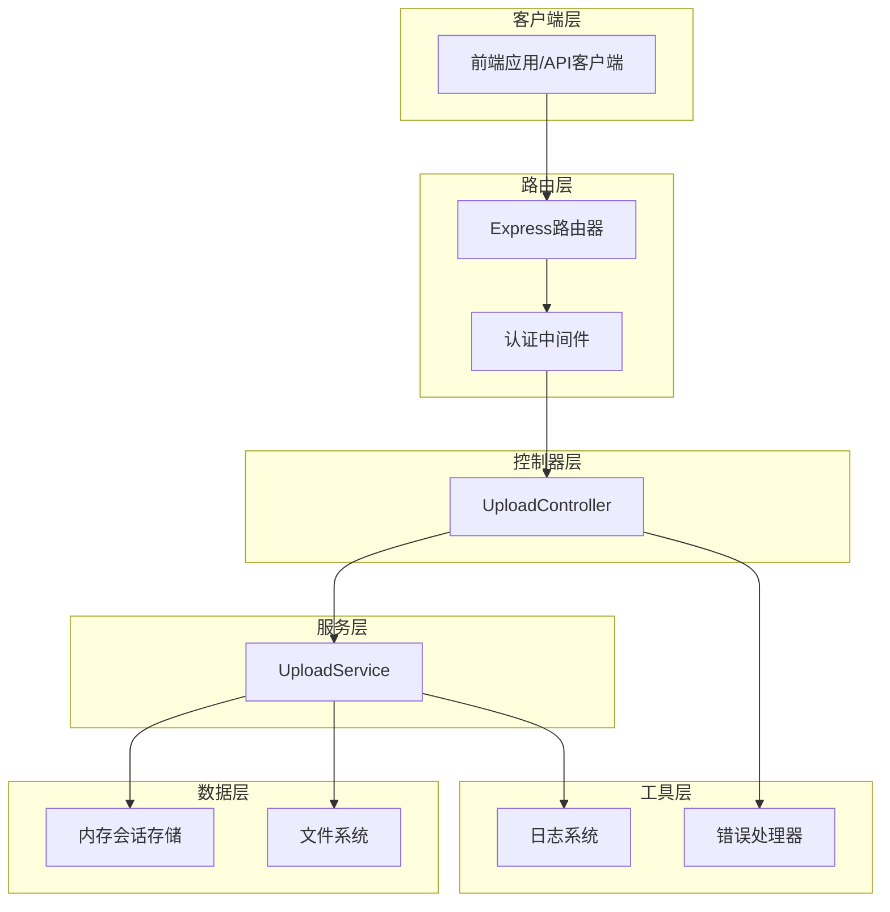
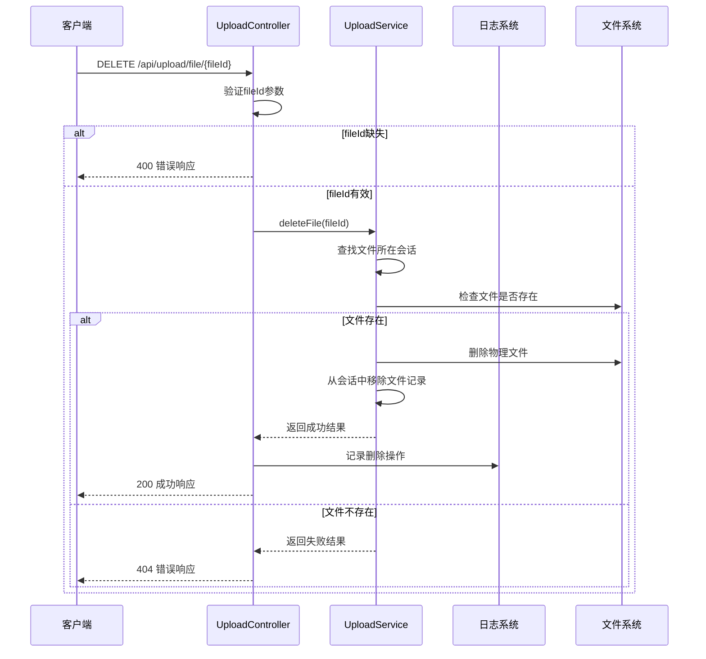
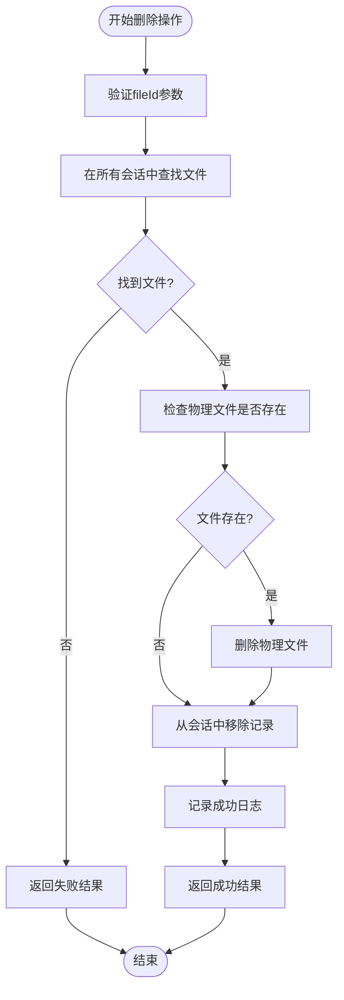
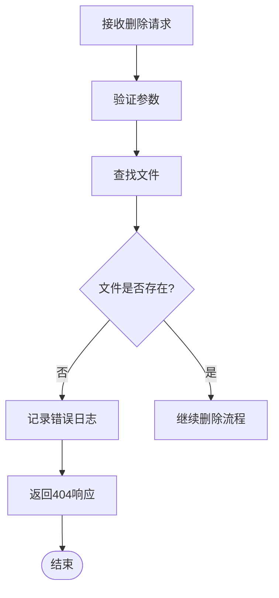
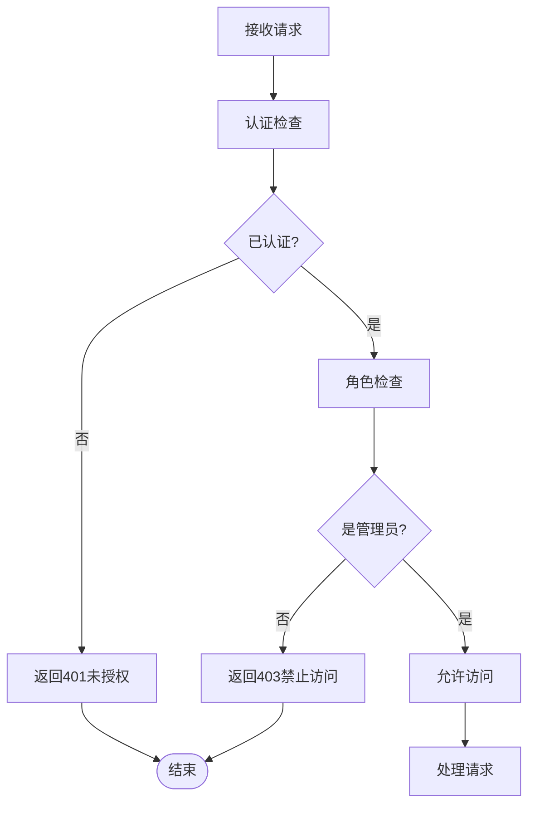
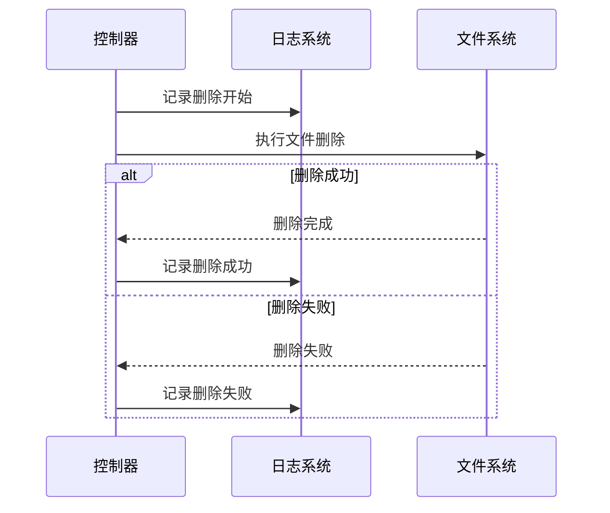

# 文件管理API文档

<cite>
**本文档中引用的文件**
- [uploadController.js](file://backend/src/controllers/uploadController.js)
- [uploadService.js](file://backend/src/services/uploadService.js)
- [upload.js](file://backend/src/routes/upload.js)
- [auth.js](file://backend/src/middleware/auth.js)
- [upload.js](file://backend/src/config/upload.js)
- [logger.js](file://backend/src/utils/logger.js)
- [API.md](file://backend/API.md)
</cite>

## 目录
1. [概述](#概述)
2. [API端点详情](#api端点详情)
3. [架构设计](#架构设计)
4. [核心组件分析](#核心组件分析)
5. [请求与响应格式](#请求与响应格式)
6. [错误处理机制](#错误处理机制)
7. [安全机制](#安全机制)
8. [日志记录系统](#日志记录系统)
9. [使用示例](#使用示例)
10. [故障排除指南](#故障排除指南)

## 概述

DELETE /api/upload/file/{fileId} 是一个专门的管理员功能端点，用于删除已上传的文件。该API提供了完整的文件删除功能，包括文件ID验证、物理文件删除、数据库记录清理以及操作日志记录等完整的工作流程。

### 主要特性
- **管理员专用**: 需要管理员权限才能访问
- **文件ID验证**: 严格的路径参数验证确保操作的安全性
- **双重删除**: 同时删除物理文件和数据库记录
- **完整日志**: 记录每次删除操作的详细信息
- **错误恢复**: 完善的错误处理和回滚机制

## API端点详情

### 端点信息

**HTTP方法**: DELETE  
**URL**: `/api/upload/file/{fileId}`  
**认证**: 需要管理员权限  
**内容类型**: 无特殊要求

### 路径参数

| 参数名 | 类型 | 必需 | 描述 |
|--------|------|------|------|
| fileId | string | 是 | 要删除的文件唯一标识符 |

### 请求头

| 头部名称 | 值 | 描述 |
|----------|-----|------|
| Authorization | Bearer token | 管理员认证令牌（开发环境可省略） |
| Content-Type | application/json | 请求内容类型 |

## 架构设计



**图表来源**
- [upload.js](file://backend/src/routes/upload.js#L60)
- [uploadController.js](file://backend/src/controllers/uploadController.js#L240-L285)
- [uploadService.js](file://backend/src/services/uploadService.js#L356-L391)

## 核心组件分析

### UploadController.deleteFile 方法

deleteFile 方法是整个删除流程的核心控制器方法，负责接收请求、验证参数、调用服务层并处理响应。



**图表来源**
- [uploadController.js](file://backend/src/controllers/uploadController.js#L241-L281)
- [uploadService.js](file://backend/src/services/uploadService.js#L357-L391)

### UploadService.deleteFile 方法

deleteFile 方法实现了具体的删除逻辑，包括文件查找、物理删除和记录清理。



**图表来源**
- [uploadService.js](file://backend/src/services/uploadService.js#L357-L391)

**章节来源**
- [uploadController.js](file://backend/src/controllers/uploadController.js#L240-L285)
- [uploadService.js](file://backend/src/services/uploadService.js#L356-L391)

## 请求与响应格式

### 请求格式

#### HTTP请求
```http
DELETE /api/upload/file/550e8400-e29b-41d4-a716-446655440001 HTTP/1.1
Host: localhost:8005
Authorization: Bearer your-admin-token
Content-Type: application/json
```

#### curl示例
```bash
# 使用管理员令牌删除文件
curl -X DELETE \
  http://localhost:8005/api/upload/file/550e8400-e29b-41d4-a716-446655440001 \
  -H 'Authorization: Bearer your-admin-token'

# 开发环境（无需认证）
curl -X DELETE \
  http://localhost:8005/api/upload/file/550e8400-e29b-41d4-a716-446655440001
```

### 成功响应格式

#### HTTP状态码
- **200 OK**: 文件删除成功

#### 响应体结构
```json
{
  "success": true,
  "message": "文件删除成功",
  "timestamp": "2025-11-14T13:54:11.000Z"
}
```

#### 响应字段说明

| 字段名 | 类型 | 描述 |
|--------|------|------|
| success | boolean | 操作是否成功 |
| message | string | 操作结果描述 |
| timestamp | string | ISO 8601时间戳 |

### 错误响应格式

#### HTTP状态码
- **400 Bad Request**: 缺少fileId参数
- **404 Not Found**: 文件不存在
- **500 Internal Server Error**: 删除过程中发生错误

#### 错误响应示例
```json
{
  "error": "MISSING_FILE_ID",
  "message": "缺少文件ID",
  "timestamp": "2025-11-14T13:54:11.000Z"
}
```

**章节来源**
- [uploadController.js](file://backend/src/controllers/uploadController.js#L241-L281)
- [API.md](file://backend/API.md#L236-L252)

## 错误处理机制

### FILE_NOT_FOUND 错误

当请求删除的文件不存在时，系统会返回 FILE_NOT_FOUND 错误。

#### 触发条件
- 指定的fileId在所有活跃会话中都找不到
- 文件已被删除但记录未及时更新
- 提供了无效或损坏的fileId

#### 处理流程


**图表来源**
- [uploadController.js](file://backend/src/controllers/uploadController.js#L255-L261)

### 其他错误类型

#### MISSING_FILE_ID
- **HTTP状态码**: 400
- **触发条件**: 请求中缺少fileId参数
- **解决方案**: 确保URL包含有效的fileId参数

#### DELETION_FAILED
- **HTTP状态码**: 500
- **触发条件**: 物理文件删除失败或数据库操作异常
- **解决方案**: 检查文件系统权限和磁盘空间

**章节来源**
- [uploadController.js](file://backend/src/controllers/uploadController.js#L245-L281)

## 安全机制

### 认证与授权

#### 认证中间件
系统实现了基于角色的访问控制（RBAC），只有管理员用户才能执行删除操作。



**图表来源**
- [auth.js](file://backend/src/middleware/auth.js#L18-L35)

#### 当前实现特点
- **开发环境**: 简化认证，直接设置模拟用户
- **生产环境**: 应实现JWT令牌验证
- **角色分离**: 区分普通用户和管理员权限

### 安全最佳实践

1. **参数验证**: 严格验证fileId格式和有效性
2. **权限检查**: 确保只有授权用户可以删除文件
3. **审计追踪**: 记录所有删除操作的详细信息
4. **错误隔离**: 避免向客户端暴露敏感信息

**章节来源**
- [auth.js](file://backend/src/middleware/auth.js#L1-L36)
- [upload.js](file://backend/src/routes/upload.js#L60)

## 日志记录系统

### 日志级别与用途

系统采用双层日志记录机制，区分用户操作日志和开发者调试日志。

#### 用户日志 (logger.user)
- **用途**: 记录影响用户体验的操作
- **内容**: 文件删除、上传完成等关键操作
- **格式**: 包含操作类型、相关ID和时间戳

#### 开发者日志 (logger.dev)
- **用途**: 技术调试和系统监控
- **内容**: 文件删除成功、性能指标等
- **格式**: 详细的系统级信息

### 删除操作日志记录



**图表来源**
- [uploadController.js](file://backend/src/controllers/uploadController.js#L263-L266)
- [uploadService.js](file://backend/src/services/uploadService.js#L373-L386)

### 日志内容示例

#### 成功删除日志
```json
{
  "level": "info",
  "message": "删除文件",
  "timestamp": "2025-11-14T13:54:11.000Z",
  "fileId": "550e8400-e29b-41d4-a716-446655440001",
  "deletedBy": "admin"
}
```

#### 开发者日志
```json
{
  "level": "debug",
  "message": "File deleted successfully",
  "timestamp": "2025-11-14T13:54:11.000Z",
  "fileId": "550e8400-e29b-41d4-a716-446655440001",
  "fileName": "example_video.mp4"
}
```

**章节来源**
- [logger.js](file://backend/src/utils/logger.js#L48-L65)
- [uploadController.js](file://backend/src/controllers/uploadController.js#L263-L266)

## 使用示例

### JavaScript Fetch 示例

```javascript
// 删除单个文件
async function deleteFile(fileId) {
  try {
    const response = await fetch(`/api/upload/file/${fileId}`, {
      method: 'DELETE',
      headers: {
        'Authorization': 'Bearer your-admin-token',
        'Content-Type': 'application/json'
      }
    });
    
    if (!response.ok) {
      throw new Error(`HTTP error! status: ${response.status}`);
    }
    
    const result = await response.json();
    console.log('文件删除成功:', result);
    return result;
  } catch (error) {
    console.error('删除文件失败:', error);
    throw error;
  }
}

// 使用示例
deleteFile('550e8400-e29b-41d4-a716-446655440001')
  .then(result => {
    if (result.success) {
      console.log('操作成功');
    }
  })
  .catch(error => {
    console.error('操作失败:', error.message);
  });
```

### cURL 命令示例

```bash
# 删除文件（需要管理员权限）
curl -X DELETE \
  http://localhost:8005/api/upload/file/550e8400-e29b-41d4-a716-446655440001 \
  -H 'Authorization: Bearer your-admin-token' \
  -H 'Content-Type: application/json'

# 开发环境测试（无需认证）
curl -X DELETE \
  http://localhost:8005/api/upload/file/550e8400-e29b-41d4-a716-446655440001 \
  -H 'Content-Type: application/json'
```

### 错误处理示例

```javascript
// 完整的错误处理示例
async function safeDeleteFile(fileId) {
  try {
    const response = await fetch(`/api/upload/file/${fileId}`, {
      method: 'DELETE',
      headers: {
        'Authorization': 'Bearer your-admin-token'
      }
    });
    
    const result = await response.json();
    
    if (!response.ok) {
      switch (result.error) {
        case 'MISSING_FILE_ID':
          console.error('请提供有效的文件ID');
          break;
        case 'FILE_NOT_FOUND':
          console.error('指定的文件不存在');
          break;
        case 'INSUFFICIENT_PERMISSIONS':
          console.error('权限不足，无法删除文件');
          break;
        default:
          console.error('删除文件失败:', result.message);
      }
      return { success: false, error: result.error };
    }
    
    return { success: true, result };
    
  } catch (error) {
    console.error('网络错误:', error);
    return { success: false, error: 'NETWORK_ERROR' };
  }
}
```

## 故障排除指南

### 常见问题及解决方案

#### 1. 文件删除失败 (DELETION_FAILED)

**症状**: 收到500错误响应，消息为"删除文件失败"

**可能原因**:
- 文件物理文件已损坏或被外部程序占用
- 文件系统权限不足
- 磁盘空间不足

**解决步骤**:
1. 检查文件系统权限
2. 验证磁盘空间是否充足
3. 确认文件没有被其他进程锁定
4. 查看服务器日志获取详细错误信息

#### 2. 文件不存在 (FILE_NOT_FOUND)

**症状**: 收到404错误响应，消息为"文件不存在"

**可能原因**:
- 提供了错误的fileId
- 文件已被删除但记录未同步
- 文件存储路径配置错误

**解决步骤**:
1. 验证fileId的有效性
2. 检查文件是否存在于预期位置
3. 确认存储路径配置正确
4. 清理过期的会话记录

#### 3. 权限不足 (INSUFFICIENT_PERMISSIONS)

**症状**: 收到403错误响应，消息为"权限不足"

**可能原因**:
- 当前用户不是管理员
- 认证令牌无效或过期
- 角色权限配置错误

**解决步骤**:
1. 确认用户具有管理员权限
2. 刷新或重新获取认证令牌
3. 检查认证中间件配置
4. 验证用户角色分配

### 性能优化建议

#### 1. 文件查找优化
- 使用索引加速fileId查找
- 实现缓存机制减少重复查询
- 定期清理过期会话数据

#### 2. 并发处理
- 限制同时进行的删除操作数量
- 实现队列机制避免系统过载
- 监控系统资源使用情况

#### 3. 存储优化
- 定期清理临时文件
- 实现文件去重机制
- 优化存储路径结构

### 监控指标

#### 关键性能指标 (KPI)
- 文件删除成功率
- 平均删除响应时间
- 错误率统计
- 系统资源使用率

#### 监控告警
- 删除失败率达到阈值
- 磁盘空间使用率过高
- 系统响应时间异常
- 异常错误频率增加

**章节来源**
- [uploadController.js](file://backend/src/controllers/uploadController.js#L274-L281)
- [uploadService.js](file://backend/src/services/uploadService.js#L380-L391)

## 结论

DELETE /api/upload/file/{fileId} 端点提供了一个完整、安全且可靠的文件删除解决方案。通过严格的参数验证、完善的错误处理、详细的日志记录和安全的权限控制，确保了文件删除操作的可靠性和安全性。

### 主要优势
- **安全性**: 多层验证和权限控制
- **可靠性**: 完善的错误处理和恢复机制
- **可追溯性**: 详细的日志记录和审计功能
- **易用性**: 简洁的API设计和清晰的错误信息

### 最佳实践建议
1. 始终验证fileId的有效性
2. 实施适当的错误处理策略
3. 定期审查和清理日志文件
4. 监控系统性能和资源使用情况
5. 在生产环境中启用完整的认证机制