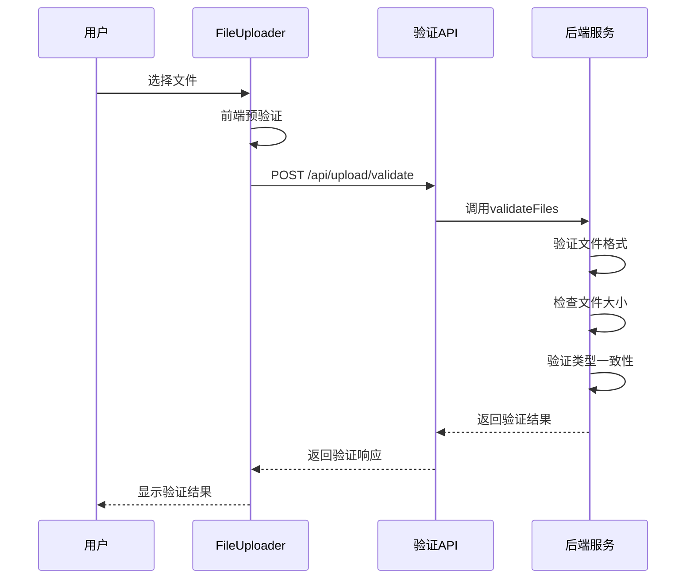
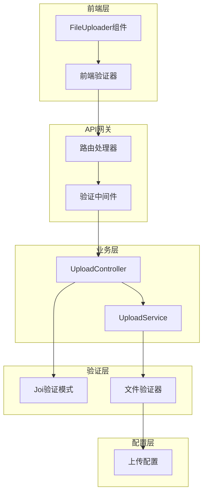
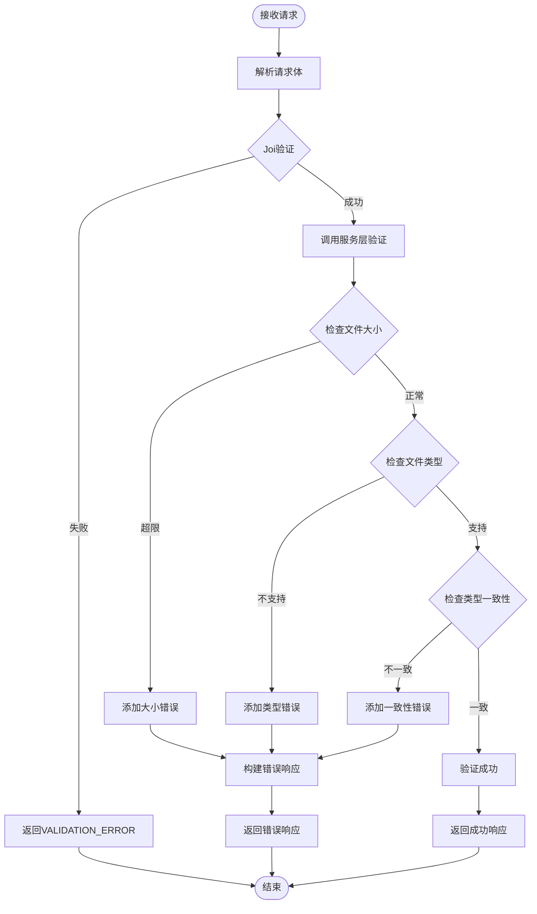

# 文件验证API文档

<cite>
**本文档引用的文件**
- [uploadController.js](file://backend/src/controllers/uploadController.js)
- [upload.js](file://backend/src/routes/upload.js)
- [upload.js](file://backend/src/middleware/upload.js)
- [uploadService.js](file://backend/src/services/uploadService.js)
- [upload.js](file://backend/src/config/upload.js)
- [fileValidator.js](file://backend/src/utils/fileValidator.js)
- [FileUploader.vue](file://frontend/src/components/FileUploader.vue)
- [API.md](file://backend/API.md)
</cite>

## 目录
1. [概述](#概述)
2. [API端点详情](#api端点详情)
3. [请求格式](#请求格式)
4. [响应格式](#响应格式)
5. [验证规则](#验证规则)
6. [错误处理](#错误处理)
7. [使用示例](#使用示例)
8. [前端集成](#前端集成)
9. [架构设计](#架构设计)
10. [故障排除](#故障排除)

## 概述

文件验证API提供了在实际上传前对文件进行预验证的功能，确保文件符合系统要求的格式、大小和数量限制。该API是视频文件上传流程的重要组成部分，支持最多3个同类型视频文件（MP4/AVI）的批量验证。

### 核心功能
- **格式验证**：检查文件是否为支持的视频格式（MP4、AVI）
- **大小限制**：验证文件大小不超过300MB
- **数量控制**：限制单次验证最多3个文件
- **类型一致性**：确保所有文件具有相同的格式
- **结构化反馈**：提供详细的验证结果和错误信息

## API端点详情

### 端点信息
- **URL**: `/api/upload/validate`
- **HTTP方法**: `POST`
- **内容类型**: `application/json`

### 请求头
```http
Content-Type: application/json
Accept: application/json
```

## 请求格式

### 请求体结构

```json
{
  "files": [
    {
      "name": "video.mp4",
      "size": 104857600,
      "type": "video/mp4"
    },
    {
      "name": "clip.avi",
      "size": 209715200,
      "type": "video/x-msvideo"
    }
  ]
}
```

### 字段说明

| 字段名 | 类型 | 必填 | 描述 |
|--------|------|------|------|
| `files` | Array | 是 | 要验证的文件数组 |
| `files[].name` | String | 是 | 文件原始名称 |
| `files[].size` | Number | 是 | 文件大小（字节） |
| `files[].type` | String | 是 | 文件MIME类型 |

### 文件数组约束
- **最小数量**: 1个文件
- **最大数量**: 3个文件
- **类型一致性**: 所有文件必须具有相同的扩展名

## 响应格式

### 成功响应

```json
{
  "valid": true,
  "files": [
    {
      "index": 0,
      "valid": true,
      "errors": []
    },
    {
      "index": 1,
      "valid": true,
      "errors": []
    }
  ],
  "timestamp": "2025-11-14T13:54:11.000Z"
}
```

### 响应字段说明

| 字段名 | 类型 | 描述 |
|--------|------|------|
| `valid` | Boolean | 整体验证结果 |
| `files` | Array | 各文件的验证结果数组 |
| `files[].index` | Number | 文件在数组中的索引位置 |
| `files[].valid` | Boolean | 单个文件的验证状态 |
| `files[].errors` | Array | 该文件的错误信息列表 |
| `timestamp` | String | ISO格式的时间戳 |

### 失败响应示例

```json
{
  "error": "VALIDATION_ERROR",
  "message": "文件验证失败",
  "details": [
    "文件大小超过限制 (300MB)",
    "不支持的文件格式 (.mov)"
  ],
  "timestamp": "2025-11-14T13:54:11.000Z"
}
```

## 验证规则

### 支持的文件格式

| 格式 | MIME类型 | 扩展名 |
|------|----------|--------|
| MP4 | `video/mp4` | `.mp4` |
| AVI | `video/avi` | `.avi` |
| AVI (备用) | `video/x-msvideo` | `.avi` |

### 大小限制
- **最大文件大小**: 300MB (314,572,800字节)
- **最小文件大小**: 1字节

### 数量限制
- **最小文件数**: 1个
- **最大文件数**: 3个

### 类型一致性规则
所有上传的文件必须具有相同的扩展名：
- 全部为`.mp4`文件
- 全部为`.avi`文件
- 不允许混合不同格式

## 错误处理

### 错误代码对照表

| 错误代码 | HTTP状态码 | 触发条件 | 处理建议 |
|----------|------------|----------|----------|
| `VALIDATION_ERROR` | 400 | 请求格式无效 | 检查请求体结构 |
| `INVALID_FILE_FORMAT` | 400 | 不支持的文件格式 | 使用支持的格式（MP4/AVI） |
| `FILE_TOO_LARGE` | 413 | 文件大小超过限制 | 压缩文件或分割视频 |
| `TOO_MANY_FILES` | 400 | 文件数量超过限制 | 减少文件数量至3个以内 |
| `VALIDATION_FAILED` | 500 | 内部验证错误 | 联系技术支持 |

### 错误响应格式

```json
{
  "error": "ERROR_CODE",
  "message": "错误描述",
  "details": ["详细错误信息"],
  "timestamp": "2025-11-14T13:54:11.000Z"
}
```

## 使用示例

### curl命令示例

#### 验证单个文件
```bash
curl -X POST http://localhost:8005/api/upload/validate \
  -H "Content-Type: application/json" \
  -d '{
    "files": [{
      "name": "sample.mp4",
      "size": 104857600,
      "type": "video/mp4"
    }]
  }'
```

#### 验证多个文件
```bash
curl -X POST http://localhost:8005/api/upload/validate \
  -H "Content-Type: application/json" \
  -d '{
    "files": [
      {
        "name": "video1.mp4",
        "size": 157286400,
        "type": "video/mp4"
      },
      {
        "name": "video2.mp4",
        "size": 125829120,
        "type": "video/mp4"
      }
    ]
  }'
```

### JavaScript示例

#### 基本验证
```javascript
async function validateFiles(files) {
  const validationData = {
    files: files.map(file => ({
      name: file.name,
      size: file.size,
      type: file.type
    }))
  };

  try {
    const response = await fetch('/api/upload/validate', {
      method: 'POST',
      headers: {
        'Content-Type': 'application/json'
      },
      body: JSON.stringify(validationData)
    });

    const result = await response.json();
    
    if (!result.valid) {
      console.error('验证失败:', result.files);
      return false;
    }
    
    console.log('验证成功');
    return true;
  } catch (error) {
    console.error('验证请求失败:', error);
    return false;
  }
}
```

#### Vue组件集成
```javascript
const handleUpload = async () => {
  try {
    const validationData = {
      files: files.value.map(file => ({
        name: file.name,
        size: file.size,
        type: file.type
      }))
    };

    const response = await fetch('/api/upload/validate', {
      method: 'POST',
      headers: {
        'Content-Type': 'application/json'
      },
      body: JSON.stringify(validationData)
    });

    const result = await response.json();

    if (!response.ok || !result.valid) {
      throw new Error(result.message || '文件验证失败');
    }

    // 验证通过，继续上传流程
    emit('files-selected', files.value);
  } catch (error) {
    errorMessage.value = error.message || '上传失败，请重试';
  }
};
```

## 前端集成

### FileUploader组件集成

前端FileUploader组件实现了完整的文件验证流程：



**图表来源**
- [FileUploader.vue](file://frontend/src/components/FileUploader.vue#L206-L245)
- [uploadController.js](file://backend/src/controllers/uploadController.js#L27-L55)

### 前端验证逻辑

前端实现了多层验证机制：

1. **浏览器原生验证**：通过`accept`属性限制文件类型
2. **文件大小检查**：在用户选择时验证文件大小
3. **类型一致性检查**：确保所有文件格式相同
4. **API验证**：最终通过后端API确认

**章节来源**
- [FileUploader.vue](file://frontend/src/components/FileUploader.vue#L176-L188)

## 架构设计

### 系统架构图



**图表来源**
- [uploadController.js](file://backend/src/controllers/uploadController.js#L1-L285)
- [uploadService.js](file://backend/src/services/uploadService.js#L1-L416)
- [upload.js](file://backend/src/routes/upload.js#L1-L62)

### 验证流程



**图表来源**
- [uploadController.js](file://backend/src/controllers/uploadController.js#L27-L55)
- [uploadService.js](file://backend/src/services/uploadService.js#L34-L85)

**章节来源**
- [uploadController.js](file://backend/src/controllers/uploadController.js#L1-L285)
- [uploadService.js](file://backend/src/services/uploadService.js#L1-L416)

## 故障排除

### 常见问题及解决方案

#### 1. 文件验证失败
**症状**: 收到`VALIDATION_ERROR`响应
**原因**: 
- 文件数组为空或格式不正确
- 文件对象缺少必需字段
- 文件数量超出限制

**解决方案**:
```javascript
// 确保请求格式正确
const validationData = {
  files: files.map(file => ({
    name: file.name,
    size: file.size,
    type: file.type
  }))
};
```

#### 2. 文件格式不被支持
**症状**: 收到`INVALID_FILE_FORMAT`错误
**原因**: 
- 文件扩展名不在支持列表中
- MIME类型不匹配

**解决方案**:
```javascript
// 检查文件格式
const supportedFormats = ['.mp4', '.avi'];
const ext = path.extname(file.name).toLowerCase();
if (!supportedFormats.includes(ext)) {
  throw new Error('不支持的文件格式');
}
```

#### 3. 文件大小超限
**症状**: 收到`FILE_TOO_LARGE`错误
**原因**: 文件大小超过300MB限制

**解决方案**:
- 压缩视频文件
- 分割大文件
- 使用更高压缩率的编码设置

#### 4. 类型不一致
**症状**: 收到"所有文件必须是相同类型"错误
**原因**: 不同格式的文件混合上传

**解决方案**:
```javascript
// 确保所有文件格式一致
const extensions = files.map(file => 
  file.name.toLowerCase().split('.').pop()
);
const uniqueExtensions = new Set(extensions);
if (uniqueExtensions.size > 1) {
  throw new Error('所有文件必须是相同格式');
}
```

### 调试技巧

#### 1. 启用详细日志
```javascript
// 在开发环境中启用详细日志
logger.level = 'debug';
```

#### 2. 验证请求数据
```javascript
console.log('验证数据:', {
  files: files.map(f => ({
    name: f.name,
    size: f.size,
    type: f.type
  }))
});
```

#### 3. 检查响应状态
```javascript
const response = await fetch(url, options);
if (!response.ok) {
  const error = await response.json();
  console.error('API错误:', error);
}
```

**章节来源**
- [uploadController.js](file://backend/src/controllers/uploadController.js#L31-L55)
- [uploadService.js](file://backend/src/services/uploadService.js#L34-L85)