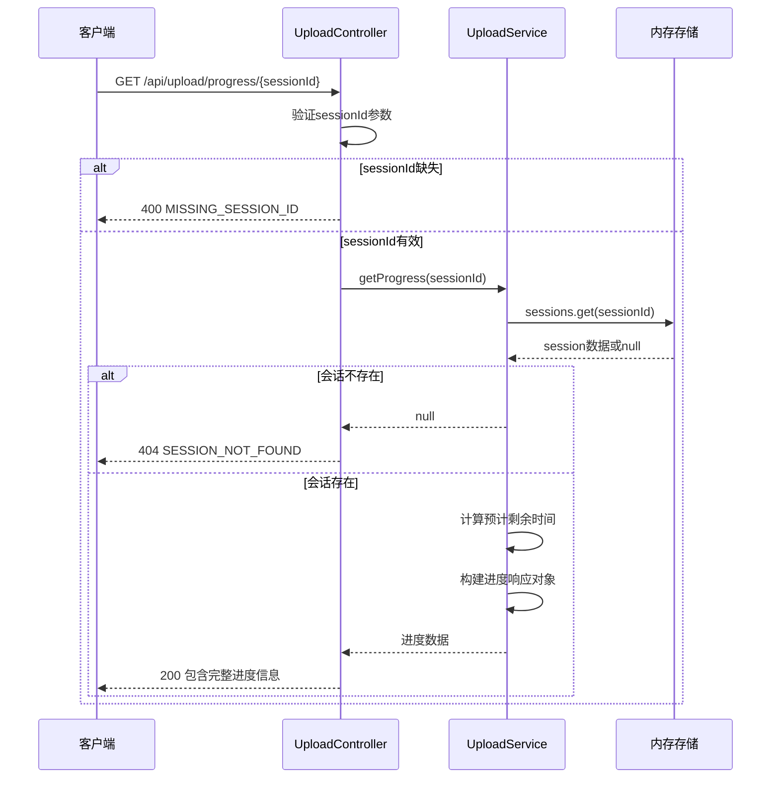
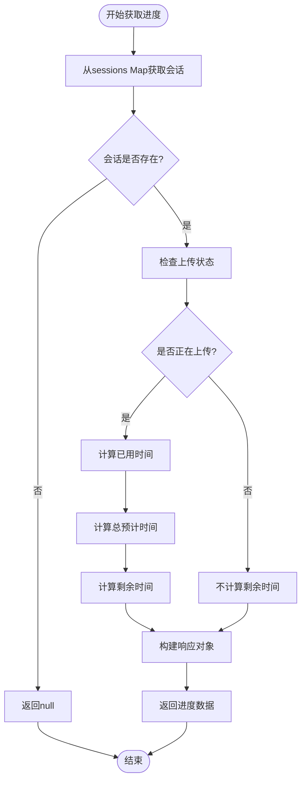

# 上传进度查询API文档

<cite>
**本文档中引用的文件**
- [uploadController.js](file://backend/src/controllers/uploadController.js)
- [uploadService.js](file://backend/src/services/uploadService.js)
- [upload.js](file://backend/src/routes/upload.js)
- [upload.js](file://backend/src/config/upload.js)
- [FileUploader.vue](file://frontend/src/components/FileUploader.vue)
- [ProgressBar.vue](file://frontend/src/components/ProgressBar.vue)
- [useAIAnalysis.js](file://frontend/src/composables/useAIAnalysis.js)
</cite>

## 目录
1. [简介](#简介)
2. [API端点概述](#api端点概述)
3. [请求参数](#请求参数)
4. [响应数据结构](#响应数据结构)
5. [详细字段说明](#详细字段说明)
6. [请求示例](#请求示例)
7. [错误处理](#错误处理)
8. [后端实现细节](#后端实现细节)
9. [前端集成指南](#前端集成指南)
10. [最佳实践](#最佳实践)

## 简介

GET `/api/upload/progress/{sessionId}` 是一个专门用于查询指定上传会话实时进度的API端点。该接口允许客户端实时监控文件上传状态，包括总体进度、单个文件状态、预计剩余时间和错误信息等详细信息。

## API端点概述

### 端点信息
- **URL**: `GET /api/upload/progress/{sessionId}`
- **功能**: 查询指定上传会话的实时进度
- **认证**: 需要有效的会话ID
- **响应格式**: JSON

### 请求方法
- **HTTP Method**: GET
- **Content-Type**: 无（GET请求无请求体）

## 请求参数

### 路径参数

| 参数名 | 类型 | 必需 | 描述 |
|--------|------|------|------|
| sessionId | string | 是 | 上传会话的唯一标识符（UUID格式） |

### 参数验证
- **格式要求**: 必须为有效的UUID字符串
- **长度限制**: 通常为36字符（包含连字符）
- **字符集**: 包含字母数字和连字符（-）

## 响应数据结构

### 成功响应（200 OK）

```json
{
  "sessionId": "550e8400-e29b-41d4-a716-446655440000",
  "overallStatus": "uploading",
  "totalProgress": 65,
  "completedFiles": 2,
  "failedFiles": 0,
  "estimatedTimeRemaining": 120,
  "files": [
    {
      "id": "f47ac10b-58cc-4372-a567-0e02b2c3d479",
      "originalName": "video.mp4",
      "fileSize": 104857600,
      "fileType": "mp4",
      "status": "uploading",
      "progress": 75,
      "uploadSpeed": 2048000,
      "uploadStartTime": "2024-01-15T10:30:00.000Z",
      "uploadEndTime": null
    }
  ],
  "lastUpdate": "2024-01-15T10:30:30.000Z",
  "timestamp": "2024-01-15T10:30:30.000Z"
}
```

## 详细字段说明

### 核心状态字段

| 字段名 | 类型 | 描述 | 可能值 |
|--------|------|------|--------|
| sessionId | string | 上传会话唯一标识符 | UUID格式字符串 |
| overallStatus | string | 整体上传状态 | "pending", "uploading", "completed", "partial", "cancelled" |
| totalProgress | number | 总体进度百分比 | 0-100之间的整数 |
| completedFiles | number | 已完成文件数量 | 非负整数 |
| failedFiles | number | 失败文件数量 | 非负整数 |

### 时间和估算字段

| 字段名 | 类型 | 描述 | 单位 |
|--------|------|------|------|
| estimatedTimeRemaining | number | 预估剩余时间 | 秒 |
| lastUpdate | string | 最后更新时间 | ISO 8601日期字符串 |
| uploadStartTime | string | 上传开始时间 | ISO 8601日期字符串 |
| uploadEndTime | string/null | 上传结束时间 | ISO 8601日期字符串 |

### 文件详情数组

每个文件对象包含以下字段：

| 字段名 | 类型 | 描述 |
|--------|------|------|
| id | string | 文件唯一标识符 |
| originalName | string | 原始文件名 |
| fileSize | number | 文件大小（字节） |
| fileType | string | 文件扩展名（不带点） |
| status | string | 文件状态 | "pending", "uploading", "completed", "failed", "cancelled" |
| progress | number | 文件上传进度百分比 | 0-100 |
| uploadSpeed | number | 当前上传速度（字节/秒） |
| errorMessage | string/null | 错误信息（仅在失败时存在） |
| errorCode | string/null | 错误代码（仅在失败时存在） |

## 请求示例

### curl命令示例

#### 查询活跃上传会话的进度
```bash
curl -X GET "http://localhost:8005/api/upload/progress/550e8400-e29b-41d4-a716-446655440000" \
  -H "Accept: application/json" \
  -H "Content-Type: application/json"
```

#### 带超时设置的查询
```bash
curl -X GET "http://localhost:8005/api/upload/progress/550e8400-e29b-41d4-a716-446655440000" \
  --connect-timeout 10 \
  --max-time 30 \
  -H "Accept: application/json"
```

### JavaScript Fetch示例

#### 基础轮询实现
```javascript
async function pollUploadProgress(sessionId, interval = 1000) {
  const progressContainer = document.getElementById('upload-progress');
  
  const poll = async () => {
    try {
      const response = await fetch(`/api/upload/progress/${sessionId}`);
      
      if (!response.ok) {
        throw new Error(`HTTP error! status: ${response.status}`);
      }
      
      const progressData = await response.json();
      
      // 更新UI
      updateProgressUI(progressData);
      
      // 检查是否完成
      if (progressData.overallStatus === 'completed' || 
          progressData.overallStatus === 'cancelled') {
        return progressData;
      }
      
      // 继续轮询
      setTimeout(poll, interval);
      
    } catch (error) {
      console.error('查询进度失败:', error);
      // 可以在这里添加重试逻辑
    }
  };
  
  poll();
}

function updateProgressUI(data) {
  // 更新进度条
  const progressBar = document.querySelector('.progress-bar');
  progressBar.style.width = `${data.totalProgress}%`;
  
  // 更新状态文本
  document.getElementById('progress-status').textContent = 
    `${data.completedFiles}/${data.files.length} 文件完成`;
}
```

#### WebSocket与HTTP轮询结合
```javascript
class UploadProgressMonitor {
  constructor(sessionId) {
    this.sessionId = sessionId;
    this.isWebSocketConnected = false;
    this.pollingInterval = null;
    this.onProgressUpdate = null;
  }
  
  startMonitoring(onUpdate) {
    this.onProgressUpdate = onUpdate;
    
    // 尝试建立WebSocket连接
    this.connectWebSocket();
    
    // 启动HTTP轮询作为备用
    this.startHttpPolling();
  }
  
  connectWebSocket() {
    const ws = new WebSocket(`ws://localhost:8005/ws/upload/${this.sessionId}`);
    
    ws.onopen = () => {
      this.isWebSocketConnected = true;
      console.log('WebSocket连接成功');
    };
    
    ws.onmessage = (event) => {
      const progressData = JSON.parse(event.data);
      this.handleProgressUpdate(progressData);
    };
    
    ws.onclose = () => {
      this.isWebSocketConnected = false;
      console.log('WebSocket连接断开');
    };
  }
  
  startHttpPolling() {
    this.pollingInterval = setInterval(async () => {
      if (this.isWebSocketConnected) return;
      
      try {
        const response = await fetch(`/api/upload/progress/${this.sessionId}`);
        if (response.ok) {
          const progressData = await response.json();
          this.handleProgressUpdate(progressData);
        }
      } catch (error) {
        console.error('HTTP轮询失败:', error);
      }
    }, 2000); // 每2秒轮询一次
  }
  
  handleProgressUpdate(data) {
    if (this.onProgressUpdate) {
      this.onProgressUpdate(data);
    }
  }
  
  stopMonitoring() {
    if (this.pollingInterval) {
      clearInterval(this.pollingInterval);
      this.pollingInterval = null;
    }
  }
}
```

## 错误处理

### 可能的错误码和处理方式

#### 400 Bad Request - 缺少会话ID
```json
{
  "error": "MISSING_SESSION_ID",
  "message": "缺少会话ID",
  "timestamp": "2024-01-15T10:30:00.000Z"
}
```

**触发条件**:
- 请求URL中缺少sessionId参数
- sessionId参数为空字符串

**处理方式**:
- 检查请求URL格式
- 确保在调用API前已正确创建上传会话

#### 404 Not Found - 会话不存在
```json
{
  "error": "SESSION_NOT_FOUND",
  "message": "上传会话不存在",
  "timestamp": "2024-01-15T10:30:00.000Z"
}
```

**触发条件**:
- 提供的sessionId在系统中不存在
- 会话已过期被清理
- 会话已被手动删除

**处理方式**:
- 检查会话ID的有效性
- 确认会话创建时间
- 考虑重新创建会话

#### 500 Internal Server Error - 查询失败
```json
{
  "error": "PROGRESS_QUERY_FAILED",
  "message": "查询进度失败",
  "timestamp": "2024-01-15T10:30:00.000Z"
}
```

**触发条件**:
- 数据库连接失败
- 内存访问异常
- 其他系统级错误

**处理方式**:
- 实现重试机制
- 记录详细错误日志
- 向用户提供友好的错误消息

### 错误处理最佳实践

```javascript
async function getUploadProgressWithRetry(sessionId, maxRetries = 3) {
  let retryCount = 0;
  
  while (retryCount < maxRetries) {
    try {
      const response = await fetch(`/api/upload/progress/${sessionId}`);
      
      if (response.status === 404) {
        throw new Error('SESSION_NOT_FOUND');
      }
      
      if (!response.ok) {
        throw new Error(`HTTP ${response.status}: ${response.statusText}`);
      }
      
      return await response.json();
      
    } catch (error) {
      retryCount++;
      
      if (retryCount >= maxRetries) {
        throw new Error(`查询进度失败，已重试${maxRetries}次: ${error.message}`);
      }
      
      // 指数退避延迟
      const delay = Math.min(1000 * Math.pow(2, retryCount), 10000);
      await new Promise(resolve => setTimeout(resolve, delay));
    }
  }
}
```

## 后端实现细节

### 控制器层实现

基于[`uploadController.js`](file://backend/src/controllers/uploadController.js#L149-L192)的getProgress方法实现：



**图表来源**
- [uploadController.js](file://backend/src/controllers/uploadController.js#L149-L192)
- [uploadService.js](file://backend/src/services/uploadService.js#L298-L323)

### 服务层实现

基于[`uploadService.js`](file://backend/src/services/uploadService.js#L298-L323)的getProgress方法：



**图表来源**
- [uploadService.js](file://backend/src/services/uploadService.js#L298-L323)

### 关键实现特性

#### 1. 会话状态管理
- 使用内存Map存储上传会话
- 支持多种状态：pending、uploading、completed、partial、cancelled
- 自动清理过期会话

#### 2. 进度计算算法
- **总体进度**: `(已完成文件数 / 总文件数) * 100`
- **剩余时间估算**: 基于当前进度和已用时间推算
- **文件级别进度**: 支持单个文件的详细进度跟踪

#### 3. 错误处理机制
- 优雅处理会话不存在情况
- 返回有意义的错误信息
- 记录详细的错误日志

**章节来源**
- [uploadController.js](file://backend/src/controllers/uploadController.js#L149-L192)
- [uploadService.js](file://backend/src/services/uploadService.js#L298-L323)

## 前端集成指南

### Vue.js组件集成

基于[`ProgressBar.vue`](file://frontend/src/components/ProgressBar.vue)的集成模式：

```javascript
// 在Vue组件中使用进度查询
export default {
  setup() {
    const { progress, onCompleted, onError, connected } = useWebSocket(props.sessionId);
    const files = ref([]);
    let pollInterval = null;
    
    // HTTP轮询作为备用方案
    const startHttpPolling = () => {
      if (pollInterval) return;
      
      pollInterval = setInterval(async () => {
        try {
          const response = await fetch(`/api/upload/progress/${props.sessionId}`);
          if (response.ok) {
            const data = await response.json();
            
            // 只有在WebSocket未连接时才使用HTTP数据
            if (!connected.value) {
              updateProgressFromHTTP(data);
            }
          }
        } catch (error) {
          console.error('HTTP轮询失败:', error);
        }
      }, 2000);
    };
    
    const updateProgressFromHTTP = (data) => {
      progress.value.totalProgress = data.totalProgress;
      progress.value.completedFiles = data.completedFiles;
      progress.value.failedFiles = data.failedFiles;
      progress.value.overallStatus = data.overallStatus;
      
      // 更新文件状态
      if (data.files && data.files.length > 0) {
        data.files.forEach((uploadedFile, index) => {
          const existingFileIndex = files.value.findIndex(
            f => f.originalName === uploadedFile.originalName
          );
          if (existingFileIndex >= 0) {
            files.value[existingFileIndex] = {
              ...files.value[existingFileIndex],
              progress: uploadedFile.progress || 100,
              status: uploadedFile.status || 'completed'
            };
          }
        });
      }
    };
    
    // 组件卸载时清理
    onUnmounted(() => {
      if (pollInterval) {
        clearInterval(pollInterval);
      }
    });
    
    return {
      progress,
      files,
      startHttpPolling
    };
  }
};
```

### React Hook集成

```javascript
import { useState, useEffect } from 'react';

export function useUploadProgress(sessionId) {
  const [progress, setProgress] = useState({
    totalProgress: 0,
    completedFiles: 0,
    failedFiles: 0,
    overallStatus: 'pending',
    files: []
  });
  const [isLoading, setIsLoading] = useState(true);
  const [error, setError] = useState(null);
  
  useEffect(() => {
    let isMounted = true;
    let timeoutId;
    
    const fetchProgress = async () => {
      try {
        const response = await fetch(`/api/upload/progress/${sessionId}`);
        
        if (!response.ok) {
          if (response.status === 404) {
            throw new Error('SESSION_NOT_FOUND');
          }
          throw new Error(`HTTP error! status: ${response.status}`);
        }
        
        const data = await response.json();
        
        if (isMounted) {
          setProgress(data);
          setError(null);
          
          // 如果上传已完成，停止轮询
          if (data.overallStatus === 'completed' || 
              data.overallStatus === 'cancelled') {
            clearTimeout(timeoutId);
            setIsLoading(false);
            return;
          }
          
          // 继续轮询
          timeoutId = setTimeout(fetchProgress, 1000);
        }
        
      } catch (err) {
        if (isMounted) {
          setError(err.message);
          setIsLoading(false);
        }
      }
    };
    
    // 开始轮询
    fetchProgress();
    
    return () => {
      isMounted = false;
      clearTimeout(timeoutId);
    };
  }, [sessionId]);
  
  return { progress, isLoading, error };
}
```

**章节来源**
- [ProgressBar.vue](file://frontend/src/components/ProgressBar.vue)
- [FileUploader.vue](file://frontend/src/components/FileUploader.vue)

## 最佳实践

### 1. 轮询策略优化

#### 指数退避算法
```javascript
class ProgressPoller {
  constructor(sessionId, options = {}) {
    this.sessionId = sessionId;
    this.interval = options.interval || 1000;
    this.maxInterval = options.maxInterval || 10000;
    this.backoffFactor = options.backoffFactor || 2;
    this.retryCount = 0;
    this.timeoutId = null;
  }
  
  start() {
    this.poll();
  }
  
  poll() {
    fetch(`/api/upload/progress/${this.sessionId}`)
      .then(response => {
        if (!response.ok) {
          throw new Error(`HTTP ${response.status}`);
        }
        return response.json();
      })
      .then(data => {
        this.handleProgressUpdate(data);
        
        if (this.shouldContinuePolling(data)) {
          this.retryCount++;
          const nextInterval = Math.min(
            this.interval * Math.pow(this.backoffFactor, this.retryCount),
            this.maxInterval
          );
          this.timeoutId = setTimeout(() => this.poll(), nextInterval);
        } else {
          this.stop();
        }
      })
      .catch(error => {
        console.error('轮询失败:', error);
        // 失败时增加间隔
        this.retryCount++;
        const nextInterval = Math.min(
          this.interval * Math.pow(this.backoffFactor, this.retryCount),
          this.maxInterval
        );
        this.timeoutId = setTimeout(() => this.poll(), nextInterval);
      });
  }
  
  stop() {
    if (this.timeoutId) {
      clearTimeout(this.timeoutId);
      this.timeoutId = null;
    }
    this.retryCount = 0;
  }
  
  shouldContinuePolling(data) {
    return data.overallStatus === 'uploading' || 
           data.overallStatus === 'pending';
  }
}
```

### 2. WebSocket集成

#### 实时进度更新
```javascript
class RealtimeProgressTracker {
  constructor(sessionId) {
    this.sessionId = sessionId;
    this.ws = null;
    this.isConnected = false;
    this.onProgressUpdate = null;
    this.onError = null;
  }
  
  connect(onUpdate, onError) {
    this.onProgressUpdate = onUpdate;
    this.onError = onError;
    
    this.ws = new WebSocket(`ws://localhost:8005/ws/upload/${this.sessionId}`);
    
    this.ws.onopen = () => {
      this.isConnected = true;
      console.log('WebSocket连接建立');
    };
    
    this.ws.onmessage = (event) => {
      const progressData = JSON.parse(event.data);
      this.handleProgressUpdate(progressData);
    };
    
    this.ws.onerror = (error) => {
      console.error('WebSocket错误:', error);
      if (this.onError) this.onError(error);
    };
    
    this.ws.onclose = () => {
      this.isConnected = false;
      console.log('WebSocket连接关闭');
    };
  }
  
  handleProgressUpdate(data) {
    if (this.onProgressUpdate) {
      this.onProgressUpdate(data);
    }
  }
  
  disconnect() {
    if (this.ws) {
      this.ws.close();
      this.ws = null;
    }
    this.isConnected = false;
  }
}
```

### 3. 错误恢复机制

#### 自动重试和降级策略
```javascript
class RobustProgressClient {
  constructor(options = {}) {
    this.httpTimeout = options.httpTimeout || 5000;
    this.maxRetries = options.maxRetries || 3;
    this.useWebSocketFallback = options.useWebSocketFallback !== false;
  }
  
  async getProgress(sessionId, retryCount = 0) {
    try {
      // 尝试WebSocket连接
      if (this.useWebSocketFallback && retryCount === 0) {
        const wsResult = await this.tryWebSocketProgress(sessionId);
        if (wsResult) return wsResult;
      }
      
      // HTTP轮询作为后备
      return await this.fetchProgressWithTimeout(sessionId);
      
    } catch (error) {
      if (retryCount < this.maxRetries) {
        const delay = Math.pow(2, retryCount) * 1000; // 指数退避
        await new Promise(resolve => setTimeout(resolve, delay));
        return this.getProgress(sessionId, retryCount + 1);
      }
      
      throw new Error(`获取进度失败，已重试${retryCount}次: ${error.message}`);
    }
  }
  
  async tryWebSocketProgress(sessionId) {
    return new Promise((resolve) => {
      const ws = new WebSocket(`ws://localhost:8005/ws/upload/${sessionId}`);
      let receivedData = null;
      
      ws.onopen = () => {
        ws.send(JSON.stringify({ action: 'subscribe' }));
      };
      
      ws.onmessage = (event) => {
        receivedData = JSON.parse(event.data);
        ws.close();
      };
      
      ws.onclose = () => {
        resolve(receivedData);
      };
      
      ws.onerror = () => {
        ws.close();
        resolve(null);
      };
    });
  }
  
  async fetchProgressWithTimeout(sessionId) {
    const controller = new AbortController();
    const timeoutId = setTimeout(() => controller.abort(), this.httpTimeout);
    
    try {
      const response = await fetch(`/api/upload/progress/${sessionId}`, {
        signal: controller.signal
      });
      
      clearTimeout(timeoutId);
      
      if (!response.ok) {
        throw new Error(`HTTP ${response.status}: ${response.statusText}`);
      }
      
      return await response.json();
      
    } catch (error) {
      clearTimeout(timeoutId);
      throw error;
    }
  }
}
```

### 4. 性能优化建议

#### 1. 进度数据缓存
```javascript
class ProgressCache {
  constructor(ttl = 5000) {
    this.cache = new Map();
    this.ttl = ttl;
  }
  
  set(sessionId, data) {
    this.cache.set(sessionId, {
      data,
      timestamp: Date.now()
    });
  }
  
  get(sessionId) {
    const cached = this.cache.get(sessionId);
    if (!cached) return null;
    
    if (Date.now() - cached.timestamp > this.ttl) {
      this.cache.delete(sessionId);
      return null;
    }
    
    return cached.data;
  }
  
  clear() {
    this.cache.clear();
  }
}
```

#### 2. 批量查询优化
```javascript
class BatchProgressFetcher {
  constructor(maxConcurrent = 3) {
    this.maxConcurrent = maxConcurrent;
    this.activeRequests = 0;
    this.requestQueue = [];
  }
  
  async getMultipleProgresses(sessionIds) {
    const results = {};
    
    // 分组并发处理
    const batches = this.chunkArray(sessionIds, this.maxConcurrent);
    
    for (const batch of batches) {
      const promises = batch.map(sessionId => 
        this.getSingleProgress(sessionId)
          .then(data => ({ sessionId, data }))
          .catch(error => ({ sessionId, error }))
      );
      
      const batchResults = await Promise.all(promises);
      
      batchResults.forEach(({ sessionId, data, error }) => {
        if (data) {
          results[sessionId] = data;
        } else if (error) {
          results[sessionId] = { error: error.message };
        }
      });
    }
    
    return results;
  }
  
  chunkArray(array, size) {
    return Array.from({ length: Math.ceil(array.length / size) }, (_, i) =>
      array.slice(i * size, i * size + size)
    );
  }
  
  async getSingleProgress(sessionId) {
    return fetch(`/api/upload/progress/${sessionId}`)
      .then(response => {
        if (!response.ok) {
          throw new Error(`HTTP ${response.status}`);
        }
        return response.json();
      });
  }
}
```

通过遵循这些最佳实践，可以构建稳定、高效的上传进度查询系统，为用户提供流畅的文件上传体验。