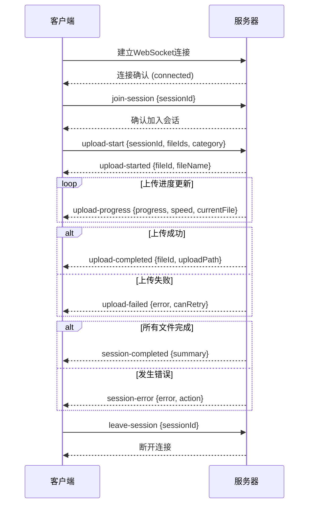

# WebSocket API 技术文档

<cite>
**本文档中引用的文件**
- [websocket.md](file://specs/001-responsive-h5-upload/contracts/websocket.md)
- [useWebSocket.js](file://frontend/src/composables/useWebSocket.js)
- [app.js](file://backend/src/app.js)
- [uploadController.js](file://backend/src/controllers/uploadController.js)
- [uploadService.js](file://backend/src/services/uploadService.js)
- [upload.js](file://backend/src/config/upload.js)
- [FileUploader.vue](file://frontend/src/components/FileUploader.vue)
</cite>

## 目录
1. [概述](#概述)
2. [连接配置](#连接配置)
3. [事件类型](#事件类型)
4. [连接生命周期](#连接生命周期)
5. [性能优化](#性能优化)
6. [错误处理](#错误处理)
7. [TypeScript接口定义](#typescript接口定义)
8. [前端实现示例](#前端实现示例)
9. [服务器端实现](#服务器端实现)
10. [最佳实践](#最佳实践)

## 概述

WebSocket API为文件上传提供实时进度更新和状态通知，确保用户能够获得即时的上传反馈。该系统采用Socket.IO协议，支持双向通信，提供完整的上传控制功能。

### 核心特性
- 实时进度更新（支持进度百分比、上传速度、剩余时间）
- 上传控制操作（开始、暂停、恢复、取消）
- 自动重连机制
- 会话超时管理
- 节流策略优化
- 内存管理机制

## 连接配置

### 连接地址

```javascript
// 开发环境
ws://localhost:8005/socket.io

// 生产环境
wss://api.example.com/socket.io
```

### 连接参数

| 参数名 | 类型 | 必需 | 描述 |
|--------|------|------|------|
| `sessionId` | string | 是 | 上传会话ID，UUID格式 |
| `clientType` | string | 是 | 客户端类型（web/mobile） |

### 连接示例

```javascript
import { io } from 'socket.io-client'

const socket = io('ws://localhost:8005', {
  query: {
    sessionId: '550e8400-e29b-41d4-a716-446655440000',
    clientType: 'web'
  },
  transports: ['websocket', 'polling'],
  forceNew: true,
  timeout: 5000,
  reconnection: true,
  reconnectionAttempts: 3,
  reconnectionDelay: 1000
})
```

**章节来源**
- [websocket.md](file://specs/001-responsive-h5-upload/contracts/websocket.md#L13-L30)
- [useWebSocket.js](file://frontend/src/composables/useWebSocket.js#L22-L37)

## 事件类型

### 客户端发送事件

#### 1. `upload-start`
开始上传会话

```typescript
interface UploadStartEvent {
  sessionId: string;
  fileIds: string[];
  category: 'personal' | 'scenic';
}

// 示例
socket.emit('upload-start', {
  sessionId: '550e8400-e29b-41d4-a716-446655440000',
  fileIds: ['file-1', 'file-2', 'file-3'],
  category: 'personal'
});
```

#### 2. `upload-progress`
手动更新文件进度

```typescript
interface UploadProgressEvent {
  sessionId: string;
  fileId: string;
  progress?: number;
  requestUpdate?: boolean;
}

// 示例
socket.emit('upload-progress', {
  sessionId: '550e8400-e29b-41d4-a716-446655440000',
  fileId: 'file-1',
  requestUpdate: true
});
```

#### 3. `upload-cancel`
取消文件上传

```typescript
interface UploadCancelEvent {
  sessionId: string;
  fileId?: string; // 可选，不指定则取消整个会话
  reason?: string;
}

// 示例
socket.emit('upload-cancel', {
  sessionId: '550e8400-e29b-41d4-a716-446655440000',
  fileId: 'file-1',
  reason: '用户主动取消'
});
```

#### 4. `upload-pause`
暂停文件上传

```typescript
interface UploadPauseEvent {
  sessionId: string;
  fileId?: string;
  reason?: string;
}

// 示例
socket.emit('upload-pause', {
  sessionId: '550e8400-e29b-41d4-a716-446655440000',
  fileId: 'file-1'
});
```

#### 5. `upload-resume`
恢复文件上传

```typescript
interface UploadResumeEvent {
  sessionId: string;
  fileId?: string;
}

// 示例
socket.emit('upload-resume', {
  sessionId: '550e8400-e29b-41d4-a716-446655440000',
  fileId: 'file-1'
});
```

### 服务器推送事件

#### 1. `upload-progress`
实时进度更新

```typescript
interface ProgressUpdateEvent {
  sessionId: string;
  overallStatus: 'pending' | 'uploading' | 'paused' | 'completed' | 'failed';
  totalProgress: number;
  completedFiles: number;
  failedFiles: number;
  currentFile?: {
    id: string;
    originalName: string;
    progress: number;
    status: 'uploading' | 'completed' | 'failed' | 'cancelled';
    uploadSpeed?: number;
    errorMessage?: string;
  };
  message: string;
  timestamp: string;
}

// 示例
socket.on('upload-progress', (data) => {
  console.log(`文件 ${data.currentFile?.originalName} 进度: ${data.currentFile?.progress}%`);
  console.log(`整体进度: ${data.totalProgress}%`);
  console.log(`状态: ${data.overallStatus}`);
});
```

#### 2. `upload-started`
文件开始上传

```typescript
interface UploadStartedEvent {
  sessionId: string;
  fileId: string;
  fileName: string;
  fileSize: number;
  startTime: string;
}

// 示例
socket.on('upload-started', (data) => {
  console.log(`文件 ${data.fileName} 开始上传`);
});
```

#### 3. `upload-completed`
文件上传完成

```typescript
interface UploadCompletedEvent {
  sessionId: string;
  fileId: string;
  fileName: string;
  fileSize: number;
  uploadPath: string;
  endTime: string;
  duration: number;
  finalSpeed: number;
}

// 示例
socket.on('upload-completed', (data) => {
  console.log(`文件 ${data.fileName} 上传完成`);
  console.log(`存储路径: ${data.uploadPath}`);
  console.log(`上传耗时: ${data.duration} 秒`);
});
```

#### 4. `upload-failed`
文件上传失败

```typescript
interface UploadFailedEvent {
  sessionId: string;
  fileId: string;
  fileName: string;
  error: {
    code: string;
    message: string;
    details?: string;
  };
  failedAt: string;
  canRetry: boolean;
  retryCount: number;
  maxRetries: number;
}

// 示例
socket.on('upload-failed', (data) => {
  console.log(`文件 ${data.fileName} 上传失败: ${data.error.message}`);
  if (data.canRetry) {
    console.log(`可以重试，当前重试次数: ${data.retryCount}/${data.maxRetries}`);
  }
});
```

#### 5. `upload-cancelled`
上传被取消

```typescript
interface UploadCancelledEvent {
  sessionId: string;
  fileId?: string;
  reason: string;
  cancelledAt: string;
  uploadedBytes: number;
}

// 示例
socket.on('upload-cancelled', (data) => {
  console.log(`上传被取消: ${data.reason}`);
  console.log(`已上传: ${data.uploadedBytes} bytes`);
});
```

#### 6. `session-completed`
整个上传会话完成

```typescript
interface SessionCompletedEvent {
  sessionId: string;
  summary: {
    totalFiles: number;
    completedFiles: number;
    failedFiles: number;
    cancelledFiles: number;
    totalSize: number;
    uploadedSize: number;
    averageSpeed: number;
    totalTime: number;
  };
  endTime: string;
  uploadPaths: string[];
}

// 示例
socket.on('session-completed', (data) => {
  console.log(`上传会话 ${data.sessionId} 完成`);
  console.log(`成功上传: ${data.summary.completedFiles}/${data.summary.totalFiles} 个文件`);
  console.log(`总大小: ${data.summary.uploadedSize} bytes`);
});
```

#### 7. `session-error`
会话级错误

```typescript
interface SessionErrorEvent {
  sessionId: string;
  error: {
    code: string;
    message: string;
    details?: string;
  };
  action: 'stop' | 'pause' | 'continue';
  affectedFiles: string[];
  timestamp: string;
}

// 示例
socket.on('session-error', (data) => {
  console.log(`会话错误: ${data.error.message}`);
  console.log(`建议操作: ${data.action}`);
  if (data.affectedFiles.length > 0) {
    console.log(`影响文件: ${data.affectedFiles.join(', ')}`);
  }
});
```

#### 8. `connection-status`
连接状态通知

```typescript
interface ConnectionStatusEvent {
  status: 'connected' | 'disconnected' | 'reconnecting' | 'error';
  message?: string;
  retryCount?: number;
  maxRetries?: number;
}

// 示例
socket.on('connection-status', (data) => {
  console.log(`连接状态: ${data.status}`);
  if (data.message) {
    console.log(`状态信息: ${data.message}`);
  }
});
```

**章节来源**
- [websocket.md](file://specs/001-responsive-h5-upload/contracts/websocket.md#L36-L289)
- [uploadService.js](file://backend/src/services/uploadService.js#L22-L31)

## 连接生命周期

### 连接流程图



**图表来源**
- [websocket.md](file://specs/001-responsive-h5-upload/contracts/websocket.md#L344-L371)
- [app.js](file://backend/src/app.js#L114-L129)

### 重连机制

```javascript
// 客户端重连配置
const socket = io('ws://localhost:8005', {
  reconnection: true,
  reconnectionAttempts: 3,
  reconnectionDelay: 1000,
  reconnectionDelayMax: 5000,
  timeout: 20000
});

// 监听重连事件
socket.on('reconnecting', (attemptNumber) => {
  console.log(`正在重连，第 ${attemptNumber} 次尝试...`);
});

socket.on('reconnect', (attemptNumber) => {
  console.log(`重连成功，尝试次数: ${attemptNumber}`);
});

socket.on('reconnect_failed', () => {
  console.log('重连失败，请检查网络连接');
});
```

### 会话超时策略

```typescript
// 会话超时配置（30分钟）
private readonly SESSION_TIMEOUT = 30 * 60 * 1000; // 30分钟

// 会话清理策略
cleanup() {
  const now = Date.now();
  for (const [sessionId, session] of this.sessions.entries()) {
    if (now - session.lastActivity > this.SESSION_TIMEOUT) {
      this.sessions.delete(sessionId);
      this.notifySessionTimeout(sessionId);
    }
  }
}
```

**章节来源**
- [websocket.md](file://specs/001-responsive-h5-upload/contracts/websocket.md#L373-L397)
- [uploadService.js](file://backend/src/services/uploadService.js#L393-L405)

## 性能优化

### 节流策略

服务器端实现了智能节流机制，避免过度频繁的进度更新：

```typescript
// 节流配置
const THROTTLE_INTERVAL = 500; // 500ms发送一次进度更新
const MIN_PROGRESS_CHANGE = 1; // 最小进度变化1%

class ProgressThrottler {
  private lastProgress: Map<string, number> = new Map();
  private lastUpdate: Map<string, number> = new Map();

  shouldUpdate(sessionId: string, fileId: string, progress: number): boolean {
    const now = Date.now();
    const lastUpdate = this.lastUpdate.get(`${sessionId}_${fileId}`) || 0;
    const lastProgress = this.lastProgress.get(`${sessionId}_${fileId}`) || 0;

    return (
      now - lastUpdate > THROTTLE_INTERVAL &&
      Math.abs(progress - lastProgress) >= MIN_PROGRESS_CHANGE
    );
  }
}
```

### 内存管理

```typescript
// 会话清理策略
class SessionManager {
  private sessions: Map<string, SessionData> = new Map();
  private readonly SESSION_TIMEOUT = 30 * 60 * 1000; // 30分钟

  cleanup() {
    const now = Date.now();
    for (const [sessionId, session] of this.sessions.entries()) {
      if (now - session.lastActivity > this.SESSION_TIMEOUT) {
        this.sessions.delete(sessionId);
        this.notifySessionTimeout(sessionId);
      }
    }
  }
}
```

### 连接池管理

```typescript
// 连接配置优化
const socket = io('ws://localhost:8005', {
  transports: ['websocket', 'polling'], // 优先使用WebSocket，降级到轮询
  forceNew: true, // 强制新建连接
  timeout: 5000, // 5秒连接超时
  reconnection: true,
  reconnectionAttempts: 3,
  reconnectionDelay: 1000
});
```

**章节来源**
- [websocket.md](file://specs/001-responsive-h5-upload/contracts/websocket.md#L401-L444)
- [useWebSocket.js](file://frontend/src/composables/useWebSocket.js#L22-L37)

## 错误处理

### 错误事件格式

```typescript
interface SocketError {
  event: string;
  error: {
    code: string;
    message: string;
    details?: any;
  };
  timestamp: string;
  requestId?: string;
}
```

### 常见错误代码

| 错误代码 | 描述 | 处理建议 |
|----------|------|----------|
| `SESSION_NOT_FOUND` | 会话不存在 | 重新创建会话 |
| `INVALID_SESSION` | 无效会话 | 检查会话ID格式 |
| `FILE_NOT_FOUND` | 文件不存在 | 检查文件ID |
| `UPLOAD_NOT_STARTED` | 上传未开始 | 检查上传状态 |
| `UPLOAD_ALREADY_COMPLETED` | 上传已完成 | 无需重复操作 |
| `INSUFFICIENT_PERMISSIONS` | 权限不足 | 检查用户权限 |
| `RATE_LIMIT_EXCEEDED` | 频率限制 | 降低请求频率 |
| `CONNECTION_TIMEOUT` | 连接超时 | 检查网络连接 |

### 错误处理示例

```javascript
// 错误监听
socket.on('error', (error) => {
  console.error('WebSocket错误:', error);
  
  // 根据错误类型进行处理
  switch (error.code) {
    case 'SESSION_NOT_FOUND':
      // 重新创建会话
      break;
    case 'RATE_LIMIT_EXCEEDED':
      // 降低请求频率
      break;
    default:
      // 通用错误处理
      break;
  }
});

// 连接错误处理
socket.on('connect_error', (error) => {
  console.error('WebSocket连接错误:', error);
  
  // 切换到HTTP轮询模式
  progress.value.message = 'WebSocket连接失败，使用HTTP轮询模式';
  progress.value.totalProgress = 10; // 设置初始进度
});
```

**章节来源**
- [websocket.md](file://specs/001-responsive-h5-upload/contracts/websocket.md#L311-L340)
- [useWebSocket.js](file://frontend/src/composables/useWebSocket.js#L81-L95)

## TypeScript接口定义

### 客户端事件接口

```typescript
// 上传开始事件
interface UploadStartEvent {
  sessionId: string;
  fileIds: string[];
  category: 'personal' | 'scenic';
}

// 进度更新事件
interface UploadProgressEvent {
  sessionId: string;
  fileId: string;
  progress?: number;
  requestUpdate?: boolean;
}

// 取消上传事件
interface UploadCancelEvent {
  sessionId: string;
  fileId?: string;
  reason?: string;
}

// 暂停上传事件
interface UploadPauseEvent {
  sessionId: string;
  fileId?: string;
  reason?: string;
}

// 恢复上传事件
interface UploadResumeEvent {
  sessionId: string;
  fileId?: string;
}
```

### 服务器推送事件接口

```typescript
// 进度更新事件
interface ProgressUpdateEvent {
  sessionId: string;
  overallStatus: 'pending' | 'uploading' | 'paused' | 'completed' | 'failed';
  totalProgress: number;
  completedFiles: number;
  failedFiles: number;
  currentFile?: {
    id: string;
    originalName: string;
    progress: number;
    status: 'uploading' | 'completed' | 'failed' | 'cancelled';
    uploadSpeed?: number;
    errorMessage?: string;
  };
  message: string;
  timestamp: string;
}

// 上传完成事件
interface UploadCompletedEvent {
  sessionId: string;
  fileId: string;
  fileName: string;
  fileSize: number;
  uploadPath: string;
  endTime: string;
  duration: number;
  finalSpeed: number;
}

// 上传失败事件
interface UploadFailedEvent {
  sessionId: string;
  fileId: string;
  fileName: string;
  error: {
    code: string;
    message: string;
    details?: string;
  };
  failedAt: string;
  canRetry: boolean;
  retryCount: number;
  maxRetries: number;
}
```

### 连接状态接口

```typescript
// 连接状态事件
interface ConnectionStatusEvent {
  status: 'connected' | 'disconnected' | 'reconnecting' | 'error';
  message?: string;
  retryCount?: number;
  maxRetries?: number;
}

// 会话完成事件
interface SessionCompletedEvent {
  sessionId: string;
  summary: {
    totalFiles: number;
    completedFiles: number;
    failedFiles: number;
    cancelledFiles: number;
    totalSize: number;
    uploadedSize: number;
    averageSpeed: number;
    totalTime: number;
  };
  endTime: string;
  uploadPaths: string[];
}
```

**章节来源**
- [websocket.md](file://specs/001-responsive-h5-upload/contracts/websocket.md#L36-L289)

## 前端实现示例

### useWebSocket组合式函数

```javascript
import { ref, onMounted, onUnmounted } from 'vue'
import { io } from 'socket.io-client'

export function useWebSocket(sessionId) {
  const socket = ref(null)
  const connected = ref(false)
  const progress = ref({
    overallStatus: 'pending',
    totalProgress: 0,
    completedFiles: 0,
    failedFiles: 0,
    currentFile: null,
    message: ''
  })

  // 进度事件回调
  const onProgress = ref(null)
  const onCompleted = ref(null)
  const onError = ref(null)

  // 连接到WebSocket
  const connect = () => {
    if (!sessionId) {
      console.warn('WebSocket: No sessionId provided')
      return
    }

    console.log('WebSocket: Connecting to session', sessionId)

    socket.value = io('http://localhost:8005', {
      transports: ['websocket', 'polling'],
      forceNew: true,
      timeout: 5000,
      reconnection: true,
      reconnectionAttempts: 3,
      reconnectionDelay: 1000
    })

    // 连接成功
    socket.value.on('connect', () => {
      connected.value = true
      console.log('WebSocket connected')
      
      // 加入会话房间
      socket.value.emit('join-session', sessionId)
    })

    // 连接断开
    socket.value.on('disconnect', () => {
      connected.value = false
      console.log('WebSocket disconnected')
    })

    // 接收进度更新
    socket.value.on('upload-progress', (data) => {
      console.log('WebSocket progress update received:', data)

      progress.value = {
        ...progress.value,
        ...data
      }

      // 更新当前文件进度
      if (data.currentFile) {
        progress.value.currentFile = data.currentFile
        console.log('Current file progress updated:', data.currentFile)
      }

      // 触发进度事件
      if (onProgress.value) {
        onProgress.value(data)
      }

      // 检查是否上传完成
      if (data.overallStatus === 'completed') {
        console.log('Upload completed via WebSocket')
        if (onCompleted.value) {
          onCompleted.value(data)
        }
        disconnect()
      }
    })

    // 错误处理
    socket.value.on('error', (error) => {
      console.error('WebSocket error:', error)
      connected.value = false
      if (onError.value) {
        onError.value(error)
      }
    })

    // 连接错误
    socket.value.on('connect_error', (error) => {
      console.error('WebSocket connection error:', error)
      connected.value = false
      
      // 如果连接失败，设置默认进度状态
      progress.value.message = 'WebSocket连接失败，使用HTTP轮询模式'
      progress.value.totalProgress = 10 // 设置初始进度
    })

    // 设置连接超时
    setTimeout(() => {
      if (!connected.value && progress.value.totalProgress === 0) {
        console.warn('WebSocket connection timeout, falling back to HTTP polling')
        progress.value.message = '连接超时，切换到HTTP轮询模式'
        progress.value.totalProgress = 10 // 设置初始进度
      }
    }, 3000)
  }

  // 断开连接
  const disconnect = () => {
    if (socket.value && sessionId) {
      socket.value.emit('leave-session', sessionId)
      socket.value.disconnect()
      socket.value = null
      connected.value = false
    }
  }

  // 组件挂载时自动连接
  onMounted(() => {
    if (sessionId) {
      connect()
    }
  })

  // 组件卸载时自动断开
  onUnmounted(() => {
    disconnect()
  })

  return {
    socket,
    connected,
    progress,
    onProgress,
    onCompleted,
    onError,
    connect,
    disconnect
  }
}
```

### 文件上传组件集成

```vue
<script>
import { ref, computed } from 'vue'
import { useWebSocket } from '@/composables/useWebSocket'

export default {
  name: 'FileUploader',
  props: {
    sessionId: {
      type: String,
      required: true
    }
  },
  setup(props) {
    const { progress, connected, onProgress, onCompleted, onError } = useWebSocket(props.sessionId)
    
    // 监听进度更新
    onProgress.value = (data) => {
      console.log('收到进度更新:', data)
    }
    
    // 监听上传完成
    onCompleted.value = (data) => {
      console.log('上传完成:', data)
    }
    
    // 监听错误
    onError.value = (error) => {
      console.error('上传错误:', error)
    }
    
    return {
      progress,
      connected
    }
  }
}
</script>
```

**章节来源**
- [useWebSocket.js](file://frontend/src/composables/useWebSocket.js#L1-L139)
- [FileUploader.vue](file://frontend/src/components/FileUploader.vue#L1-L200)

## 服务器端实现

### Socket.IO初始化

```javascript
const express = require('express');
const { Server } = require('socket.io');
const http = require('http');
const logger = require('./utils/logger');

const app = express();
const server = http.createServer(app);
const io = new Server(server, {
  cors: {
    origin: [
      'http://localhost:3005',
      'http://localhost:3006',
      'http://localhost:5173'
    ],
    methods: ['GET', 'POST']
  }
});

// WebSocket连接处理
io.on('connection', (socket) => {
  logger.dev('Client connected to WebSocket', { socketId: socket.id });

  // 加入会话房间
  socket.on('join-session', (sessionId) => {
    socket.join(`session:${sessionId}`);
    logger.dev('Client joined session', { socketId: socket.id, sessionId });
  });

  // 离开会话房间
  socket.on('leave-session', (sessionId) => {
    socket.leave(`session:${sessionId}`);
    logger.dev('Client left session', { socketId: socket.id, sessionId });
  });

  // 连接断开
  socket.on('disconnect', () => {
    logger.dev('Client disconnected from WebSocket', { socketId: socket.id });
  });
});

// 将io实例传递给uploadService
const uploadService = require('./services/uploadService');
uploadService.setIO(io);

module.exports = app;
```

### 上传服务中的事件发射

```javascript
class UploadService {
  constructor() {
    this.io = null; // Will be set by app.js
  }

  // 设置Socket.IO实例
  setIO(io) {
    this.io = io;
  }

  // 向客户端发送进度更新
  emitProgress(sessionId, data) {
    if (this.io) {
      this.io.to(`session:${sessionId}`).emit('upload-progress', {
        sessionId,
        timestamp: new Date().toISOString(),
        ...data
      });
    }
  }

  // 上传文件
  async uploadFiles(sessionId, category, files) {
    const session = sessions.get(sessionId);
    if (!session) {
      throw new Error('会话不存在');
    }

    // 发送初始进度
    this.emitProgress(sessionId, {
      overallStatus: 'uploading',
      totalProgress: 5, // 设置初始进度为5%
      completedFiles: 0,
      failedFiles: 0,
      message: '开始上传文件...'
    });

    // 处理文件上传...
    
    // 发送文件完成进度
    this.emitProgress(sessionId, {
      overallStatus: 'uploading',
      totalProgress: session.totalProgress,
      completedFiles: result.completedFiles,
      failedFiles: result.failedFiles,
      currentFile: {
        id: fileInfo.id,
        originalName: file.originalname,
        progress: 100,
        status: 'completed'
      },
      message: `${file.originalname} 上传完成`
    });

    // 发送会话完成进度
    this.emitProgress(sessionId, {
      overallStatus: session.overallStatus,
      totalProgress: 100,
      completedFiles: result.completedFiles,
      failedFiles: result.failedFiles,
      message: session.overallStatus === 'completed' 
        ? '所有文件上传完成' 
        : '部分文件上传失败'
    });
  }
}
```

### 进度节流实现

```javascript
class ProgressThrottler {
  constructor() {
    this.lastProgress = new Map();
    this.lastUpdate = new Map();
  }

  shouldUpdate(sessionId, fileId, progress) {
    const now = Date.now();
    const key = `${sessionId}_${fileId}`;
    
    const lastUpdate = this.lastUpdate.get(key) || 0;
    const lastProgress = this.lastProgress.get(key) || 0;

    const shouldUpdate = (
      now - lastUpdate > 500 && // 500ms间隔
      Math.abs(progress - lastProgress) >= 1 // 至少1%的变化
    );

    if (shouldUpdate) {
      this.lastUpdate.set(key, now);
      this.lastProgress.set(key, progress);
    }

    return shouldUpdate;
  }
}
```

**章节来源**
- [app.js](file://backend/src/app.js#L97-L146)
- [uploadService.js](file://backend/src/services/uploadService.js#L17-L31)
- [uploadService.js](file://backend/src/services/uploadService.js#L176-L289)

## 最佳实践

### 1. 连接管理

```javascript
// 使用组合式函数管理WebSocket连接
export function useUploadWebSocket(sessionId) {
  const socket = ref(null);
  const isConnected = ref(false);
  const connectionStatus = ref('disconnected');
  
  // 连接状态管理
  const manageConnection = () => {
    // 监听连接状态变化
    socket.value.on('connect', () => {
      isConnected.value = true;
      connectionStatus.value = 'connected';
    });
    
    socket.value.on('disconnect', () => {
      isConnected.value = false;
      connectionStatus.value = 'disconnected';
    });
    
    socket.value.on('reconnecting', (attempt) => {
      connectionStatus.value = 'reconnecting';
    });
  };
}
```

### 2. 错误恢复

```javascript
// 实现智能重试机制
class UploadErrorHandler {
  constructor(maxRetries = 3) {
    this.maxRetries = maxRetries;
    this.retryCounts = new Map();
  }
  
  shouldRetry(error, sessionId) {
    const retryCount = this.retryCounts.get(sessionId) || 0;
    
    // 根据错误类型决定是否重试
    const retryableErrors = ['NETWORK_ERROR', 'TIMEOUT', 'RATE_LIMIT'];
    
    return retryableErrors.includes(error.code) && retryCount < this.maxRetries;
  }
  
  incrementRetryCount(sessionId) {
    const current = this.retryCounts.get(sessionId) || 0;
    this.retryCounts.set(sessionId, current + 1);
  }
}
```

### 3. 性能监控

```javascript
// 实现性能监控
class PerformanceMonitor {
  constructor() {
    this.metrics = {
      connectionLatency: [],
      uploadSpeeds: [],
      errorRates: []
    };
  }
  
  recordMetric(type, value) {
    if (this.metrics[type]) {
      this.metrics[type].push(value);
      
      // 保持最近100个数据点
      if (this.metrics[type].length > 100) {
        this.metrics[type].shift();
      }
    }
  }
  
  getAverageSpeed() {
    const speeds = this.metrics.uploadSpeeds;
    return speeds.length > 0 
      ? speeds.reduce((sum, speed) => sum + speed, 0) / speeds.length 
      : 0;
  }
}
```

### 4. 用户体验优化

```javascript
// 实现平滑的进度动画
class ProgressAnimator {
  constructor() {
    this.animationFrame = null;
    this.targetProgress = 0;
    this.currentProgress = 0;
  }
  
  animateTo(target, duration = 300) {
    this.targetProgress = target;
    
    const start = this.currentProgress;
    const change = target - start;
    const startTime = performance.now();
    
    const animate = (currentTime) => {
      const elapsed = currentTime - startTime;
      const progress = Math.min(elapsed / duration, 1);
      
      this.currentProgress = start + change * progress;
      
      if (progress < 1) {
        this.animationFrame = requestAnimationFrame(animate);
      }
    };
    
    animate(performance.now());
  }
}
```

### 5. 安全考虑

```javascript
// 实现消息验证
class MessageValidator {
  static validateUploadStart(data) {
    return (
      typeof data.sessionId === 'string' &&
      Array.isArray(data.fileIds) &&
      ['personal', 'scenic'].includes(data.category)
    );
  }
  
  static validateProgressUpdate(data) {
    return (
      typeof data.sessionId === 'string' &&
      typeof data.fileId === 'string' &&
      (typeof data.progress === 'number' || data.requestUpdate === true)
    );
  }
}
```

这些最佳实践可以帮助您构建更稳定、更高效的WebSocket上传系统，提供更好的用户体验和系统可靠性。