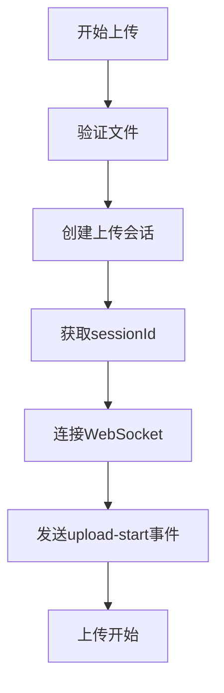
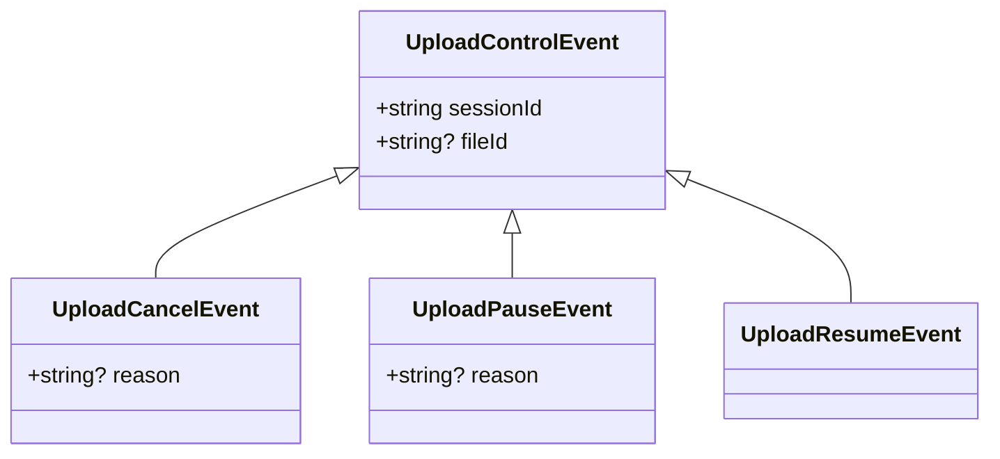
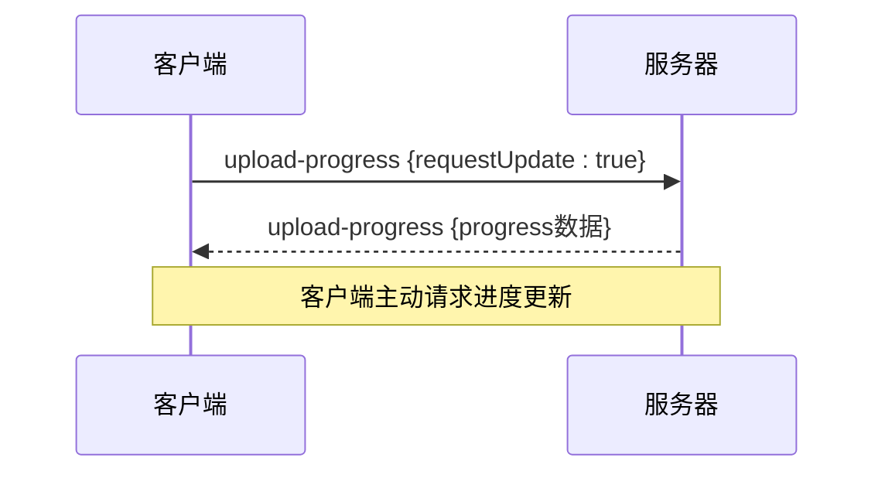
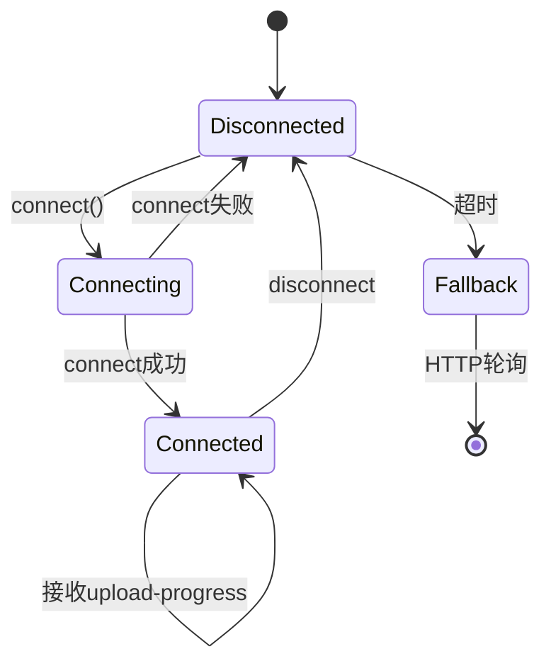

# 客户端事件

<cite>
**本文档引用的文件**
- [useWebSocket.js](file://frontend/src/composables/useWebSocket.js)
- [websocket.md](file://specs/001-responsive-h5-upload/contracts/websocket.md)
- [ProgressBar.vue](file://frontend/src/components/ProgressBar.vue)
- [FileUploader.vue](file://frontend/src/components/FileUploader.vue)
</cite>

## 目录
1. [事件类型概述](#事件类型概述)
2. [`upload-start`事件详解](#upload-start事件详解)
3. [控制事件设计](#控制事件设计)
4. [`upload-progress`事件使用](#upload-progress事件使用)
5. [事件重发机制](#事件重发机制)
6. [TypeScript接口定义](#typescript接口定义)
7. [错误处理模式](#错误处理模式)

## 事件类型概述

客户端通过WebSocket与服务器进行实时通信，支持多种事件类型来控制文件上传过程。主要事件包括`upload-start`、`upload-cancel`、`upload-pause`、`upload-resume`和`upload-progress`。这些事件允许客户端启动上传会话、取消或暂停上传操作，以及请求进度更新。

**Section sources**
- [websocket.md](file://specs/001-responsive-h5-upload/contracts/websocket.md#L36-L73)

## `upload-start`事件详解

`upload-start`事件用于启动一个新的上传会话，其JSON结构包含三个关键字段：

- **sessionId**: 上传会话的唯一标识符，类型为字符串
- **fileIds**: 文件ID数组，包含本次上传的所有文件ID
- **category**: 文件分类，取值范围为'personal'或'scenic'

该事件在用户选择文件并点击上传按钮后触发。前端通过`useWebSocket.js`中的连接逻辑自动处理会话建立，无需手动构造和发送此事件。会话ID通常在创建上传会话时由服务器生成并返回。



**Diagram sources**
- [websocket.md](file://specs/001-responsive-h5-upload/contracts/websocket.md#L36-L52)
- [useWebSocket.js](file://frontend/src/composables/useWebSocket.js#L22-L37)

**Section sources**
- [websocket.md](file://specs/001-responsive-h5-upload/contracts/websocket.md#L36-L52)
- [useWebSocket.js](file://frontend/src/composables/useWebSocket.js#L22-L37)

## 控制事件设计

控制事件包括`upload-cancel`、`upload-pause`和`upload-resume`，用于管理上传过程。

### `upload-cancel`事件
用于取消上传操作，参数设计如下：
- **sessionId**: 必需，会话ID
- **fileId**: 可选，指定要取消的文件ID；若不指定，则取消整个会话
- **reason**: 可选，取消原因

### `upload-pause`事件
用于暂停上传，参数设计与`upload-cancel`类似：
- **sessionId**: 必需，会话ID
- **fileId**: 可选，指定要暂停的文件ID；若不指定，则暂停所有文件上传
- **reason**: 可选，暂停原因

### `upload-resume`事件
用于恢复已暂停的上传：
- **sessionId**: 必需，会话ID
- **fileId**: 可选，指定要恢复的文件ID；若不指定，则恢复所有暂停的文件上传

fileId的可选性设计使得这些控制事件既支持单个文件的精细控制，也支持批量操作，提高了API的灵活性。



**Diagram sources**
- [websocket.md](file://specs/001-responsive-h5-upload/contracts/websocket.md#L74-L122)

**Section sources**
- [websocket.md](file://specs/001-responsive-h5-upload/contracts/websocket.md#L74-L122)
- [ProgressBar.vue](file://frontend/src/components/ProgressBar.vue#L279-L291)

## `upload-progress`事件使用

`upload-progress`事件在客户端主动请求进度更新时使用，通过设置`requestUpdate=true`参数来触发。服务器收到此请求后会立即推送最新的进度信息。

该事件的使用场景包括：
- 客户端重新连接后请求最新进度
- 用户手动刷新进度显示
- 周期性轮询以确保进度同步

当WebSocket连接失败时，系统会自动降级到HTTP轮询模式，通过`/api/upload/progress/{sessionId}`端点获取进度信息。



**Diagram sources**
- [websocket.md](file://specs/001-responsive-h5-upload/contracts/websocket.md#L54-L73)
- [useWebSocket.js](file://frontend/src/composables/useWebSocket.js#L48-L69)

**Section sources**
- [websocket.md](file://specs/001-responsive-h5-upload/contracts/websocket.md#L54-L73)
- [useWebSocket.js](file://frontend/src/composables/useWebSocket.js#L48-L69)

## 事件重发机制

`useWebSocket.js`中的事件发射逻辑包含了连接状态变化后的事件重发机制。当WebSocket连接断开并重新连接时，系统会自动重新加入会话房间，并继续接收进度更新。

重发机制的关键特性包括：
- 自动重连配置：`reconnection=true`，最多尝试3次
- 重连延迟：初始1000ms，逐步增加
- 连接超时：5000ms
- 备用方案：3秒后若仍未连接成功，切换到HTTP轮询模式

当连接失败时，系统会设置默认的进度状态，显示"WebSocket连接失败，使用HTTP轮询模式"，确保用户体验的连续性。



**Diagram sources**
- [useWebSocket.js](file://frontend/src/composables/useWebSocket.js#L30-L36)
- [useWebSocket.js](file://frontend/src/composables/useWebSocket.js#L97-L104)

**Section sources**
- [useWebSocket.js](file://frontend/src/composables/useWebSocket.js#L30-L36)
- [useWebSocket.js](file://frontend/src/composables/useWebSocket.js#L97-L104)

## TypeScript接口定义

以下是各事件的TypeScript接口定义：

```typescript
interface UploadStartEvent {
  sessionId: string;
  fileIds: string[];
  category: 'personal' | 'scenic';
}

interface UploadCancelEvent {
  sessionId: string;
  fileId?: string;
  reason?: string;
}

interface UploadPauseEvent {
  sessionId: string;
  fileId?: string;
  reason?: string;
}

interface UploadResumeEvent {
  sessionId: string;
  fileId?: string;
}

interface UploadProgressEvent {
  sessionId: string;
  fileId: string;
  progress?: number;
  requestUpdate?: boolean;
}
```

**Section sources**
- [websocket.md](file://specs/001-responsive-h5-upload/contracts/websocket.md#L40-L149)

## 错误处理模式

系统实现了多层次的错误处理机制：

1. **连接错误处理**：监听`connect_error`事件，在连接失败时提供降级方案
2. **通用错误处理**：监听`error`事件，捕获并处理各种错误
3. **超时处理**：设置3秒超时，超时后切换到HTTP轮询模式
4. **降级策略**：WebSocket失败后自动切换到HTTP轮询，确保功能可用性

错误处理代码示例如下：
```javascript
socket.value.on('connect_error', (error) => {
  progress.value.message = 'WebSocket连接失败，使用HTTP轮询模式';
  progress.value.totalProgress = 10;
});

setTimeout(() => {
  if (!connected.value && progress.value.totalProgress === 0) {
    progress.value.message = '连接超时，切换到HTTP轮询模式';
    progress.value.totalProgress = 10;
  }
}, 3000);
```

**Section sources**
- [useWebSocket.js](file://frontend/src/composables/useWebSocket.js#L88-L104)
- [ProgressBar.vue](file://frontend/src/components/ProgressBar.vue#L122-L152)