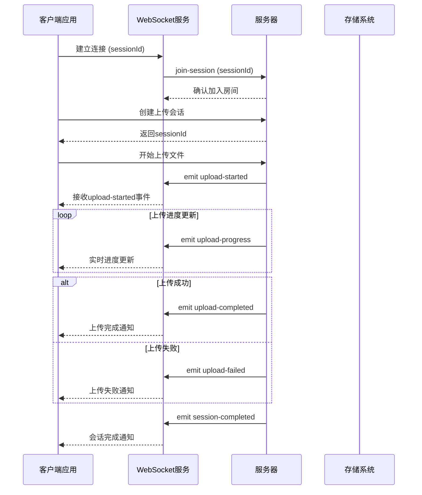
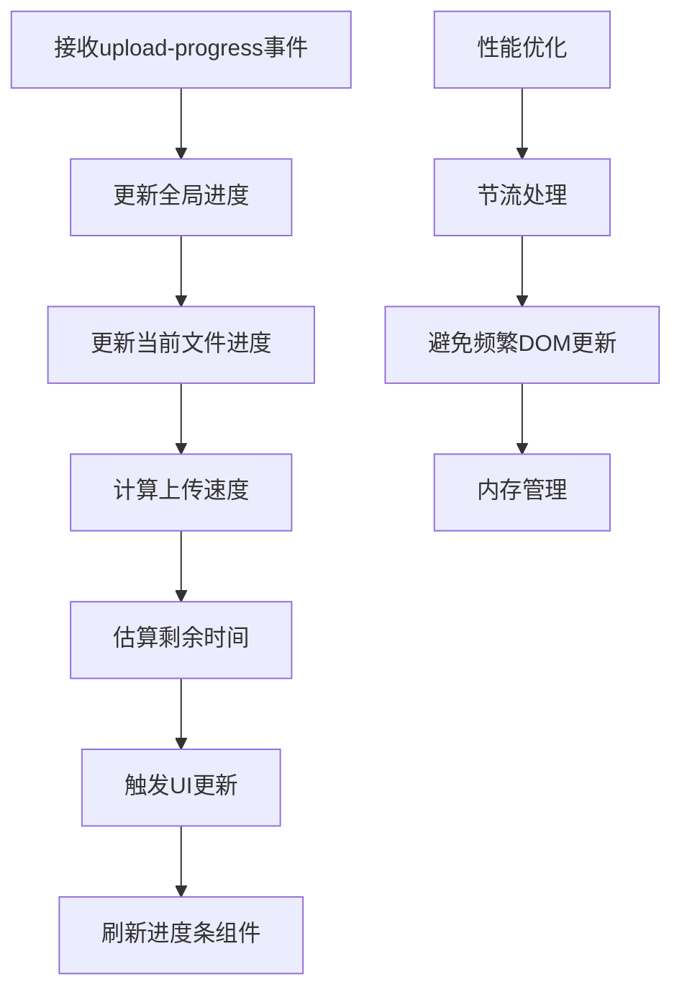
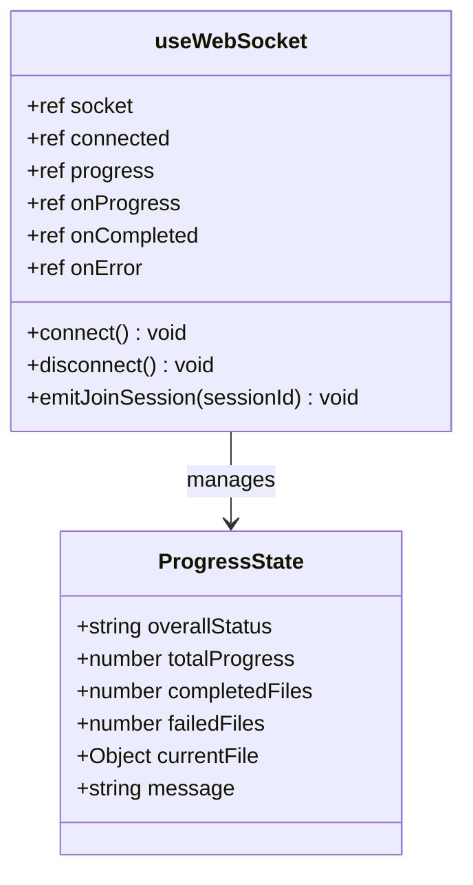
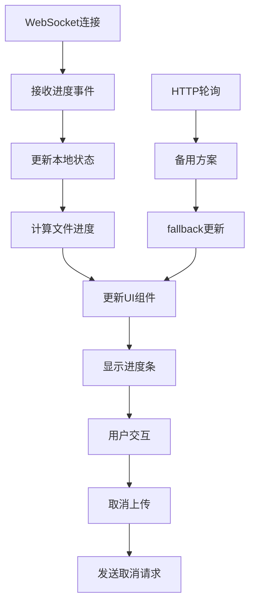
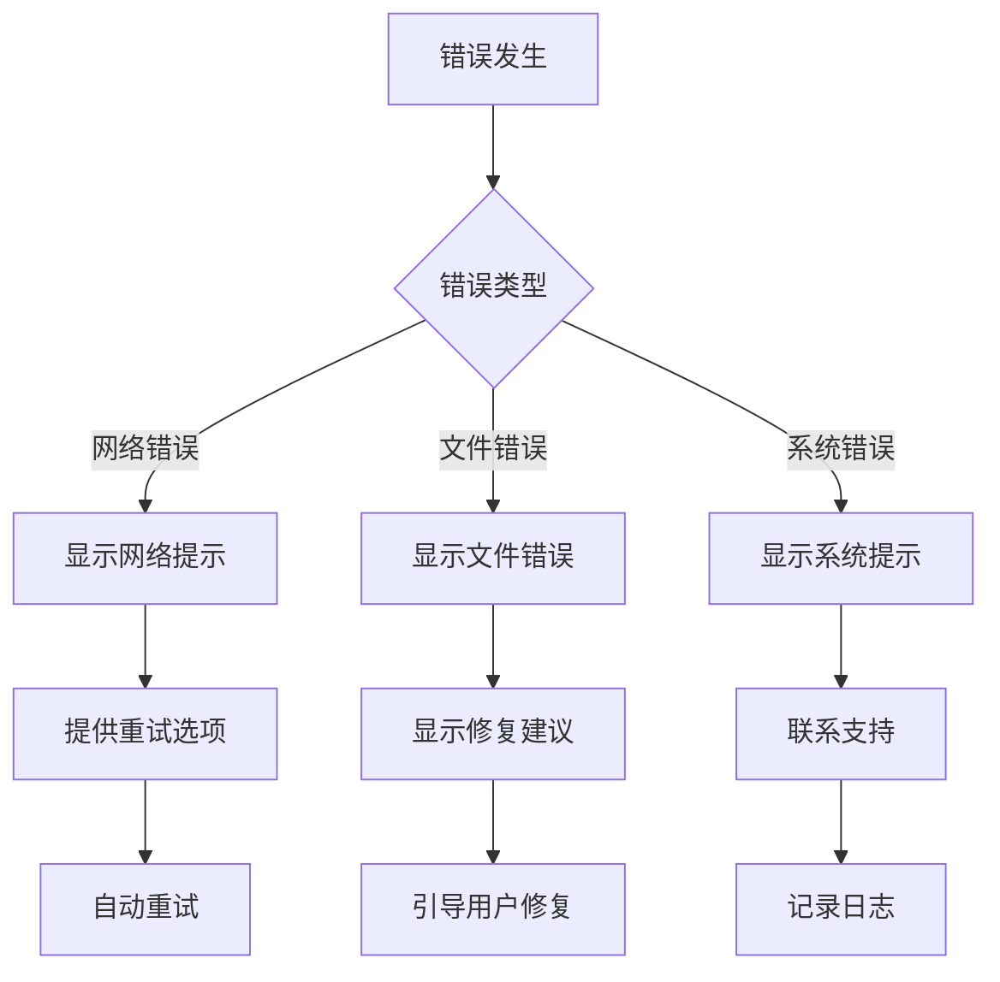

# 服务器推送事件

<cite>
**本文档中引用的文件**
- [useWebSocket.js](file://frontend/src/composables/useWebSocket.js)
- [uploadService.js](file://backend/src/services/uploadService.js)
- [uploadController.js](file://backend/src/controllers/uploadController.js)
- [app.js](file://backend/src/app.js)
- [websocket.md](file://specs/001-responsive-h5-upload/contracts/websocket.md)
- [ProgressBar.vue](file://frontend/src/components/ProgressBar.vue)
- [FileUploader.vue](file://frontend/src/components/FileUploader.vue)
- [upload.js](file://backend/src/config/upload.js)
</cite>

## 目录
1. [概述](#概述)
2. [WebSocket连接架构](#websocket连接架构)
3. [核心事件类型](#核心事件类型)
4. [upload-progress事件详解](#upload-progress事件详解)
5. [upload-started和upload-completed事件](#upload-started和upload-completed事件)
6. [upload-failed和upload-cancelled事件](#upload-failed和upload-cancelled事件)
7. [session-completed事件](#session-completed事件)
8. [前端监听器实现](#前端监听器实现)
9. [错误处理与用户提示](#错误处理与用户提示)
10. [性能优化策略](#性能优化策略)
11. [总结](#总结)

## 概述

服务器推送事件系统为文件上传过程提供了实时的状态更新和进度反馈。该系统基于WebSocket技术，确保用户能够获得即时的上传体验，同时通过HTTP轮询作为备用方案保证系统的可靠性。

### 主要特性

- **实时性**：通过WebSocket实现实时进度更新
- **可靠性**：HTTP轮询作为WebSocket故障的备用方案
- **完整性**：覆盖上传生命周期的所有关键节点
- **可扩展性**：支持多种文件类型和批量上传场景

## WebSocket连接架构



**图表来源**
- [useWebSocket.js](file://frontend/src/composables/useWebSocket.js#L21-L139)
- [app.js](file://backend/src/app.js#L114-L130)

**章节来源**
- [useWebSocket.js](file://frontend/src/composables/useWebSocket.js#L1-L139)
- [app.js](file://backend/src/app.js#L114-L130)

## 核心事件类型

系统定义了以下核心WebSocket事件：

| 事件名称 | 方向 | 触发时机 | 数据结构 |
|---------|------|----------|----------|
| `upload-progress` | 服务器 → 客户端 | 实时进度更新 | 包含详细进度指标 |
| `upload-started` | 服务器 → 客户端 | 文件开始上传 | 文件元数据信息 |
| `upload-completed` | 服务器 → 客户端 | 文件上传完成 | 完整文件信息 |
| `upload-failed` | 服务器 → 客户端 | 文件上传失败 | 错误信息和重试策略 |
| `upload-cancelled` | 服务器 → 客户端 | 上传被取消 | 取消原因和已传输字节数 |
| `session-completed` | 服务器 → 客户端 | 整个会话完成 | 汇总统计信息 |

## upload-progress事件详解

### 数据结构定义

`upload-progress`事件是最复杂的实时进度更新事件，包含以下关键性能指标：

```typescript
interface ProgressUpdateEvent {
  sessionId: string;
  fileId: string;
  progress: number;           // 当前进度百分比 (0-100)
  speed: number;             // 当前上传速度 (bytes/second)
  uploadedBytes: number;     // 已上传字节数
  totalBytes: number;        // 文件总大小
  estimatedTimeRemaining: number; // 预估剩余时间 (seconds)
  timestamp: string;         // 时间戳
}
```

### 计算逻辑

#### 进度计算
进度基于文件传输的字节数计算：
- `progress = (uploadedBytes / totalBytes) * 100`
- 确保进度值在0-100范围内

#### 上传速度计算
实时速度通过时间窗口计算：
- 使用移动平均算法平滑速度变化
- 考虑网络波动和文件大小差异

#### 预估剩余时间
采用线性估算模型：
```javascript
// 计算公式
const elapsed = Date.now() - sessionStartTime.getTime();
const totalEstimated = elapsed / (totalProgress / 100);
const estimatedTimeRemaining = Math.round((totalEstimated - elapsed) / 1000);
```

### 前端UI更新机制



**图表来源**
- [useWebSocket.js](file://frontend/src/composables/useWebSocket.js#L52-L78)
- [ProgressBar.vue](file://frontend/src/components/ProgressBar.vue#L198-L208)

**章节来源**
- [uploadService.js](file://backend/src/services/uploadService.js#L298-L323)
- [useWebSocket.js](file://frontend/src/composables/useWebSocket.js#L52-L78)

## upload-started和upload-completed事件

### upload-started事件

当文件开始上传时，服务器发送`upload-started`事件：

```typescript
interface UploadStartedEvent {
  sessionId: string;
  fileId: string;
  fileName: string;
  fileSize: number;
  startTime: string;
}
```

#### 数据来源与处理流程

1. **文件元数据收集**：从上传请求中提取原始文件名和大小
2. **唯一标识生成**：为每个文件生成UUID作为fileId
3. **时间戳记录**：记录文件上传开始的确切时间
4. **路径信息**：确定文件存储的目标目录

### upload-completed事件

文件成功上传完成后，发送`upload-completed`事件：

```typescript
interface UploadCompletedEvent {
  sessionId: string;
  fileId: string;
  fileName: string;
  fileSize: number;
  uploadPath: string;
  endTime: string;
  duration: number;
  finalSpeed: number;
}
```

#### 处理流程

1. **文件验证**：确认文件完整性
2. **路径生成**：根据会话类别确定存储路径
3. **元数据保存**：记录文件的完整信息
4. **性能统计**：计算最终上传速度和总耗时

**章节来源**
- [uploadService.js](file://backend/src/services/uploadService.js#L140-L258)
- [websocket.md](file://specs/001-responsive-h5-upload/contracts/websocket.md#L149-L188)

## upload-failed和upload-cancelled事件

### upload-failed事件

当文件上传失败时，服务器发送详细的错误信息：

```typescript
interface UploadFailedEvent {
  sessionId: string;
  fileId: string;
  fileName: string;
  error: {
    code: string;
    message: string;
    details?: string;
  };
  failedAt: string;
  canRetry: boolean;
  retryCount: number;
  maxRetries: number;
}
```

#### 错误码体系

| 错误代码 | 描述 | 用户提示策略 |
|---------|------|-------------|
| `UPLOAD_FAILED` | 上传过程中失败 | 显示具体错误信息，提供重试选项 |
| `FILE_SIZE_EXCEEDED` | 文件大小超出限制 | 提示用户文件过大，建议压缩 |
| `UNSUPPORTED_FORMAT` | 不支持的文件格式 | 显示支持的格式列表 |
| `NETWORK_ERROR` | 网络连接问题 | 建议检查网络连接 |
| `SERVER_ERROR` | 服务器内部错误 | 显示通用错误信息，建议稍后重试 |

### upload-cancelled事件

当上传被取消时，发送取消通知：

```typescript
interface UploadCancelledEvent {
  sessionId: string;
  fileId?: string;
  reason: string;
  cancelledAt: string;
  uploadedBytes: number;
}
```

#### 取消场景

1. **用户主动取消**：用户点击取消按钮
2. **系统自动取消**：达到重试上限或超时
3. **会话终止**：整个上传会话被终止

**章节来源**
- [uploadService.js](file://backend/src/services/uploadService.js#L254-L299)
- [websocket.md](file://specs/001-responsive-h5-upload/contracts/websocket.md#L189-L235)

## session-completed事件

### 汇总统计功能

`session-completed`事件提供整个上传会话的汇总统计：

```typescript
interface SessionCompletedEvent {
  sessionId: string;
  summary: {
    totalFiles: number;
    completedFiles: number;
    failedFiles: number;
    cancelledFiles: number;
    totalSize: number;
    uploadedSize: number;
    averageSpeed: number;
    totalTime: number;
  };
  endTime: string;
  uploadPaths: string[];
}
```

### 业务意义

1. **质量评估**：统计成功率和失败率
2. **性能分析**：计算平均上传速度和总耗时
3. **容量规划**：了解文件大小分布
4. **用户体验**：提供上传结果的概览

### 实际数据示例

```json
{
  "sessionId": "550e8400-e29b-41d4-a716-446655440000",
  "summary": {
    "totalFiles": 3,
    "completedFiles": 2,
    "failedFiles": 1,
    "cancelledFiles": 0,
    "totalSize": 629145600,
    "uploadedSize": 471859200,
    "averageSpeed": 1048576,
    "totalTime": 452
  },
  "endTime": "2024-01-15T10:30:00.000Z",
  "uploadPaths": [
    "/backend/upload/personal/550e8400-e29b-41d4-a716-446655440000_2024-01-15T10-28-30_000Z_video1.mp4",
    "/backend/upload/personal/550e8400-e29b-41d4-a716-446655440000_2024-01-15T10-29-15_000Z_video2.mp4"
  ]
}
```

**章节来源**
- [uploadService.js](file://backend/src/services/uploadService.js#L282-L299)
- [websocket.md](file://specs/001-responsive-h5-upload/contracts/websocket.md#L237-L263)

## 前端监听器实现

### useWebSocket组合式函数

前端通过`useWebSocket`组合式函数管理WebSocket连接和事件监听：



**图表来源**
- [useWebSocket.js](file://frontend/src/composables/useWebSocket.js#L4-L139)

### on('upload-progress')监听器

前端监听器负责实时更新UI状态：

```javascript
socket.value.on('upload-progress', (data) => {
  // 更新全局进度状态
  progress.value = {
    ...progress.value,
    ...data
  }
  
  // 更新当前文件进度
  if (data.currentFile) {
    progress.value.currentFile = data.currentFile
  }
  
  // 触发进度事件
  if (onProgress.value) {
    onProgress.value(data)
  }
  
  // 检查是否完成
  if (data.overallStatus === 'completed') {
    if (onCompleted.value) {
      onCompleted.value(data)
    }
    disconnect()
  }
})
```

### ProgressBar组件集成

进度条组件通过WebSocket数据驱动UI更新：



**图表来源**
- [ProgressBar.vue](file://frontend/src/components/ProgressBar.vue#L113-L173)

**章节来源**
- [useWebSocket.js](file://frontend/src/composables/useWebSocket.js#L52-L78)
- [ProgressBar.vue](file://frontend/src/components/ProgressBar.vue#L174-L208)

## 错误处理与用户提示

### 多层错误处理机制

1. **WebSocket连接错误**
   - 连接超时处理
   - 重连机制
   - 降级到HTTP轮询

2. **上传过程错误**
   - 文件级别错误处理
   - 会话级别错误处理
   - 自动重试机制

3. **用户界面提示**
   - 实时错误显示
   - 友好的错误消息
   - 恢复操作指导

### 用户提示策略



**章节来源**
- [useWebSocket.js](file://frontend/src/composables/useWebSocket.js#L81-L95)
- [ProgressBar.vue](file://frontend/src/components/ProgressBar.vue#L194-L196)

## 性能优化策略

### 节流与防抖

1. **进度更新节流**
   - 默认500ms间隔
   - 最小进度变化1%
   - 避免过度更新

2. **内存管理**
   - 及时清理过期会话
   - 限制并发连接数
   - 优化数据结构

3. **网络优化**
   - 连接池管理
   - 压缩传输数据
   - 断线重连策略

### 监控指标

| 指标类型 | 监控内容 | 阈值设置 |
|---------|----------|----------|
| 连接指标 | 连接延迟、重连频率 | < 200ms, < 5次/小时 |
| 上传指标 | 平均速度、成功率 | > 1MB/s, > 95% |
| 系统指标 | 内存使用、CPU占用 | < 80%, < 70% |

**章节来源**
- [websocket.md](file://specs/001-responsive-h5-upload/contracts/websocket.md#L400-L444)
- [uploadService.js](file://backend/src/services/uploadService.js#L393-L416)

## 总结

服务器推送事件系统为文件上传提供了完整的实时反馈机制。通过精心设计的事件类型、精确的性能指标计算和可靠的错误处理机制，系统确保了优秀的用户体验。

### 关键优势

1. **实时性**：WebSocket提供毫秒级响应
2. **可靠性**：多层备份机制保证稳定性
3. **可维护性**：清晰的事件结构便于扩展
4. **用户体验**：直观的进度反馈和错误提示

### 技术亮点

- **智能进度估算**：基于历史数据的准确时间预测
- **自适应重试**：智能的失败恢复策略
- **优雅降级**：HTTP轮询确保服务可用性
- **性能监控**：全方位的系统健康监控

该系统为现代Web应用的文件上传功能提供了坚实的技术基础，支持大规模并发上传场景，同时保持良好的用户体验。