# 前端架构设计文档

<cite>
**本文档引用的文件**
- [App.vue](file://frontend/src/App.vue)
- [main.js](file://frontend/src/main.js)
- [useAIAnalysis.js](file://frontend/src/composables/useAIAnalysis.js)
- [useWebSocket.js](file://frontend/src/composables/useWebSocket.js)
- [FileUploader.vue](file://frontend/src/components/FileUploader.vue)
- [CategoryDialog.vue](file://frontend/src/components/CategoryDialog.vue)
- [ProgressBar.vue](file://frontend/src/components/ProgressBar.vue)
- [AIAnalysisProgress.vue](file://frontend/src/components/AIAnalysisProgress.vue)
- [AnalysisResultDisplay.vue](file://frontend/src/components/AnalysisResultDisplay.vue)
- [ContentAnalysisView.vue](file://frontend/src/components/ContentAnalysisView.vue)
- [FusionAnalysisView.vue](file://frontend/src/components/FusionAnalysisView.vue)
- [MusicPromptView.vue](file://frontend/src/components/MusicPromptView.vue)
- [analysisStorage.js](file://frontend/src/utils/analysisStorage.js)
</cite>

## 目录
1. [项目概述](#项目概述)
2. [Vue 3 架构设计](#vue-3-架构设计)
3. [组件化架构分析](#组件化架构分析)
4. [组合式API应用](#组合式api应用)
5. [状态管理策略](#状态管理策略)
6. [实时通信机制](#实时通信机制)
7. [数据流控制](#数据流控制)
8. [后端API交互](#后端api交互)
9. [响应式设计实现](#响应式设计实现)
10. [性能优化策略](#性能优化策略)

## 项目概述

本项目是一个基于Vue 3构建的视频上传与AI分析平台，采用现代化的前端架构设计，实现了完整的视频文件处理流程，包括文件上传、分类选择、AI分析、结果展示等功能模块。

### 核心特性
- **Vue 3 Composition API**：充分利用组合式API的优势，提升代码复用性和可维护性
- **组件化架构**：清晰的组件层次结构，职责分离明确
- **实时进度更新**：基于WebSocket的实时通信机制
- **AI分析功能**：集成多种AI分析能力，包括内容分析、融合分析和音乐提示词生成
- **本地存储**：智能的本地数据缓存和持久化机制

## Vue 3 架构设计

### 应用入口与初始化

项目采用标准的Vue 3应用结构，通过Composition API实现现代化开发模式。

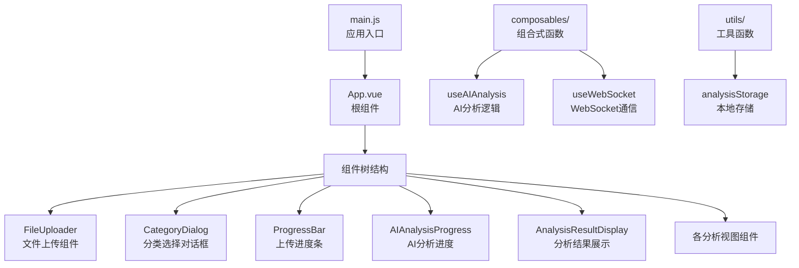

**图表来源**
- [main.js](file://frontend/src/main.js#L1-L7)
- [App.vue](file://frontend/src/App.vue#L1-L50)

### 组件层次结构

应用采用分层的组件架构，从根组件到具体功能组件形成清晰的层级关系：

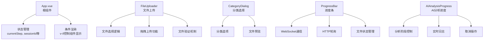

**节来源**
- [App.vue](file://frontend/src/App.vue#L11-L171)
- [FileUploader.vue](file://frontend/src/components/FileUploader.vue#L1-L50)

## 组件化架构分析

### 根组件App.vue的设计理念

App.vue作为整个应用的根组件，采用了基于状态机的架构设计，通过`currentStep`状态控制不同阶段的组件渲染。

#### 状态驱动的组件渲染

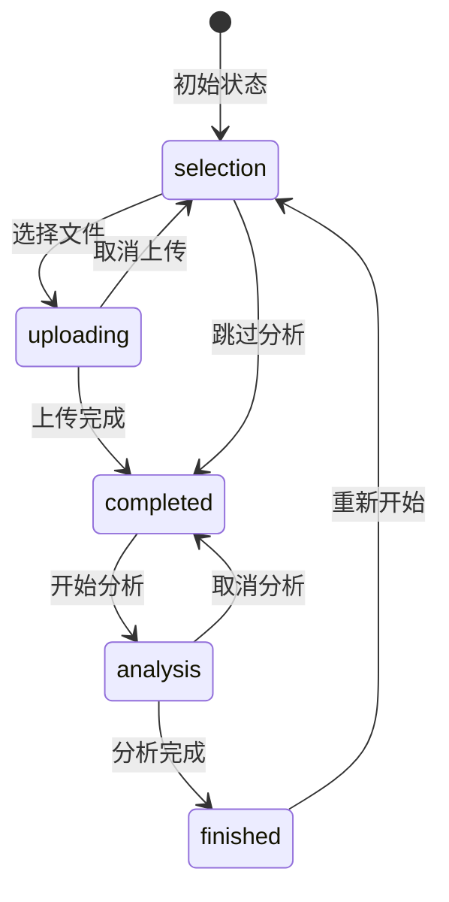

**图表来源**
- [App.vue](file://frontend/src/App.vue#L209-L210)

#### 组件间通信模式

应用采用Props传递和Events发射的标准Vue通信模式：

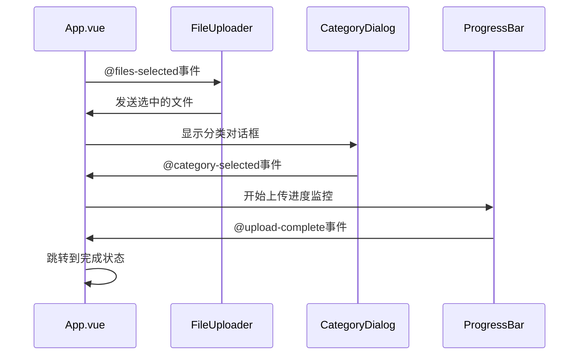

**图表来源**
- [App.vue](file://frontend/src/App.vue#L235-L342)
- [FileUploader.vue](file://frontend/src/components/FileUploader.vue#L78-L82)

### 文件上传组件(FileUploader)

FileUploader组件实现了完整的文件上传功能，包括拖拽上传、文件验证、多文件选择等特性。

#### 核心功能实现

| 功能模块 | 实现方式 | 技术特点 |
|---------|---------|---------|
| 文件选择 | 原生input元素 + click事件模拟 | 支持多选，格式限制 |
| 拖拽上传 | dragover/dragleave/drop事件 | 原生HTML5拖拽API |
| 文件验证 | 类型检查 + 大小限制 | 支持MP4/AVI格式，300MB上限 |
| 文件管理 | 数组状态管理 | 支持动态添加/删除文件 |
| 错误处理 | 详细错误信息提示 | 用户友好的错误反馈 |

**节来源**
- [FileUploader.vue](file://frontend/src/components/FileUploader.vue#L115-L245)

### 分类选择对话框(CategoryDialog)

CategoryDialog组件提供了直观的文件分类选择界面，支持两种主要分类：个人视频和景区视频。

#### 对话框设计特点

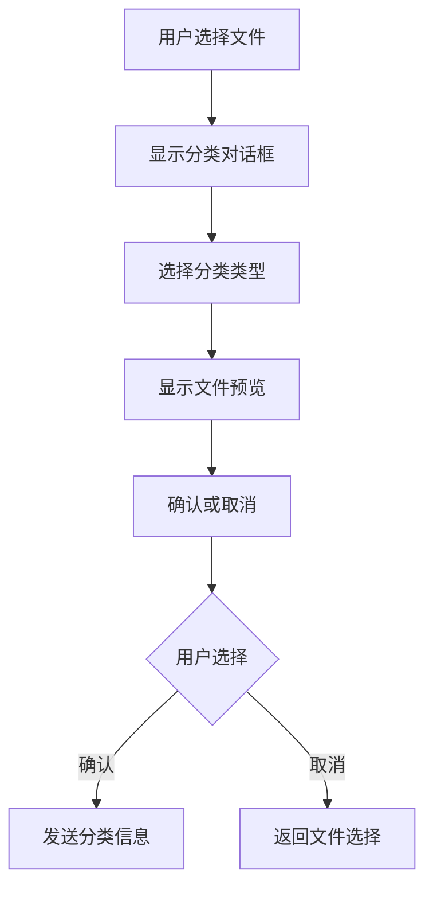

**图表来源**
- [CategoryDialog.vue](file://frontend/src/components/CategoryDialog.vue#L78-L93)

**节来源**
- [CategoryDialog.vue](file://frontend/src/components/CategoryDialog.vue#L1-L112)

## 组合式API应用

### useAIAnalysis组合式函数

useAIAnalysis是项目的核心组合式函数，封装了所有AI分析相关的业务逻辑。

#### 功能模块划分

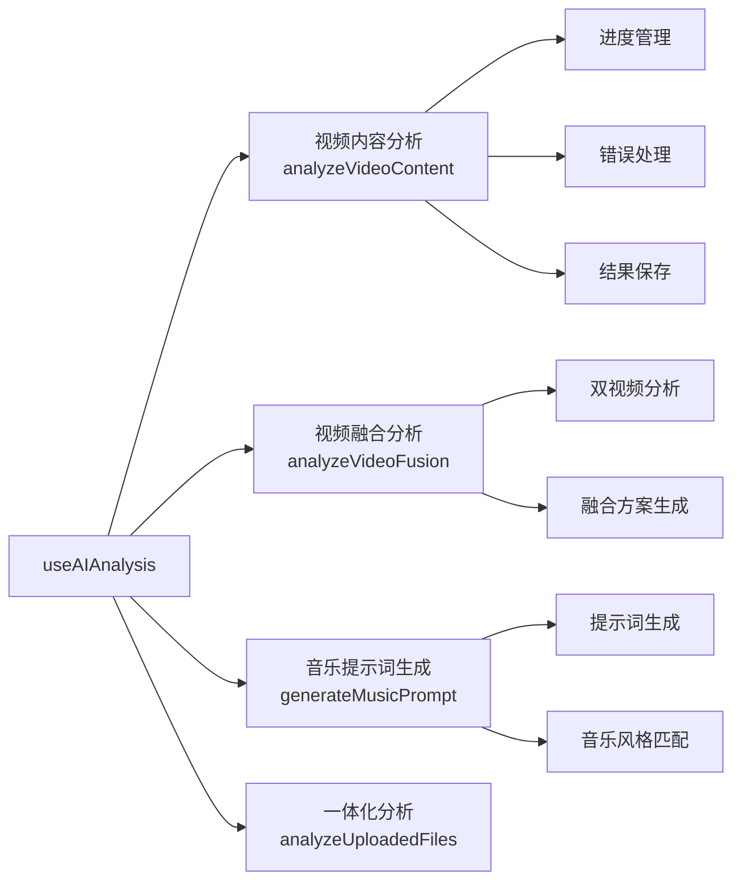

**图表来源**
- [useAIAnalysis.js](file://frontend/src/composables/useAIAnalysis.js#L14-L448)

#### 状态管理机制

useAIAnalysis通过多个ref响应式变量管理复杂的分析状态：

| 状态变量 | 类型 | 用途 | 生命周期 |
|---------|------|------|----------|
| `isAnalyzing` | ref<boolean> | 标识当前是否在分析中 | 分析开始到结束 |
| `analysisProgress` | ref<number> | 分析进度百分比 | 0-100递增 |
| `analysisResult` | ref<Object> | 分析结果数据 | 分析完成后赋值 |
| `error` | ref<string> | 错误信息 | 出错时赋值 |

**节来源**
- [useAIAnalysis.js](file://frontend/src/composables/useAIAnalysis.js#L16-L19)

### useWebSocket组合式函数

useWebSocket提供了实时通信能力，支持WebSocket连接管理和事件监听。

#### 通信流程设计

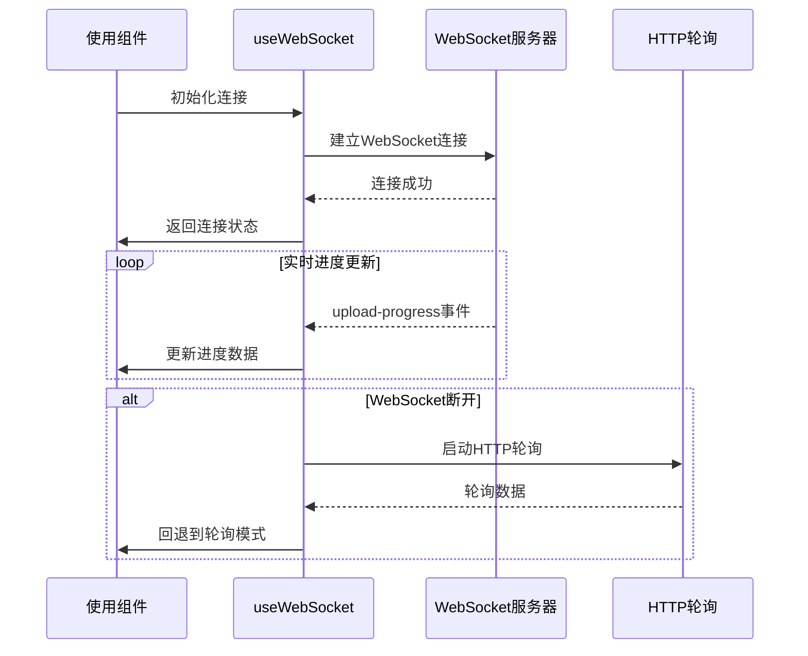

**图表来源**
- [useWebSocket.js](file://frontend/src/composables/useWebSocket.js#L22-L139)

**节来源**
- [useWebSocket.js](file://frontend/src/composables/useWebSocket.js#L1-L139)

## 状态管理策略

### Props与Emits的数据流控制

项目严格遵循Vue的单向数据流原则，通过Props向下传递数据，通过Emits向上冒泡事件。

#### 数据流向设计

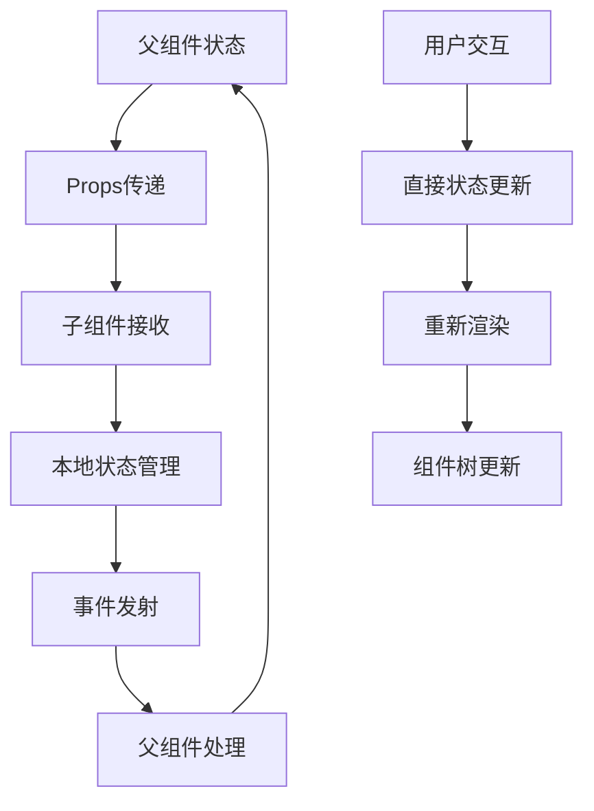

**图表来源**
- [App.vue](file://frontend/src/App.vue#L235-L342)

### 响应式状态管理

应用使用Vue 3的响应式系统管理复杂的状态：

#### 状态分类与管理策略

| 状态类型 | 管理方式 | 示例 | 更新时机 |
|---------|---------|------|----------|
| 应用级状态 | ref + computed | currentStep, sessionId | 用户操作触发 |
| 组件状态 | ref | files, loading, error | 组件内部逻辑 |
| 分析状态 | 组合式函数 | useAIAnalysis | API调用过程 |
| WebSocket状态 | 组合式函数 | useWebSocket | 网络事件触发 |

**节来源**
- [App.vue](file://frontend/src/App.vue#L208-L479)

## 实时通信机制

### WebSocket与HTTP轮询结合

项目采用WebSocket为主、HTTP轮询为辅的混合通信策略，确保在各种网络环境下的可靠性。

#### 通信策略对比

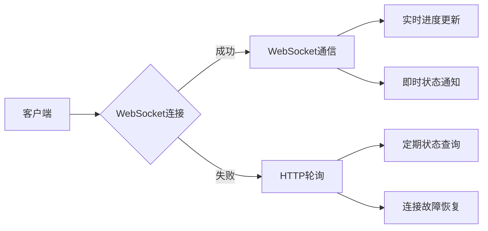

**图表来源**
- [useWebSocket.js](file://frontend/src/composables/useWebSocket.js#L117-L139)

#### 连接管理机制

WebSocket连接具有自动重连和故障转移能力：

| 连接状态 | 处理策略 | 超时时间 | 重试次数 |
|---------|---------|---------|---------|
| 正常连接 | 实时通信 | 无 | 无 |
| 连接失败 | HTTP轮询 | 3秒 | 3次 |
| 连接超时 | 回退模式 | 5秒 | 无限 |
| 断线重连 | 自动重连 | 1秒 | 3次 |

**节来源**
- [useWebSocket.js](file://frontend/src/composables/useWebSocket.js#L22-L139)

## 数据流控制

### 组件树结构与数据传递

应用的组件树结构体现了清晰的职责分离和数据流向：

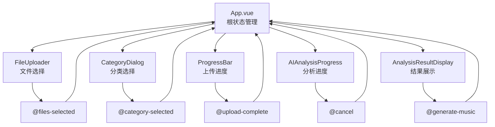

**图表来源**
- [App.vue](file://frontend/src/App.vue#L11-L171)

### 错误处理与状态恢复

应用实现了完善的错误处理机制：

#### 错误处理流程

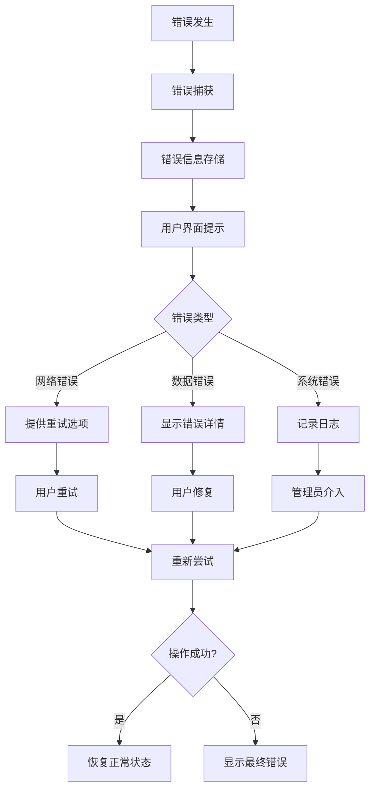

**节来源**
- [App.vue](file://frontend/src/App.vue#L335-L342)

## 后端API交互

### API调用模式

应用通过标准化的fetch API与后端进行交互，支持多种HTTP方法和认证机制。

#### API交互流程

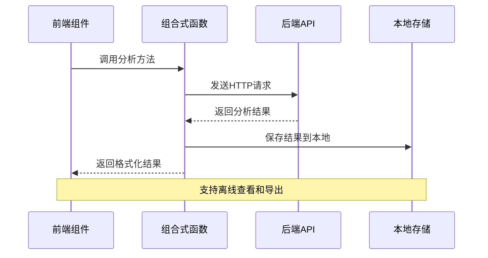

**图表来源**
- [useAIAnalysis.js](file://frontend/src/composables/useAIAnalysis.js#L30-L448)

### 数据持久化策略

项目实现了智能的本地数据持久化机制：

#### 存储策略设计

| 存储类型 | 存储位置 | 数据内容 | 清理策略 |
|---------|---------|---------|---------|
| 分析结果 | localStorage | JSON格式的分析数据 | 7天过期，最多100条 |
| 分析历史 | localStorage | 会话和分析记录 | 按需清理 |
| 用户偏好 | localStorage | 用户设置和配置 | 永久保存 |
| 缓存数据 | localStorage | 中间结果和临时数据 | 定期清理 |

**节来源**
- [analysisStorage.js](file://frontend/src/utils/analysisStorage.js#L1-L534)

## 响应式设计实现

### 移动端适配策略

应用采用渐进式响应式设计，确保在各种设备上的良好体验。

#### 响应式断点设计

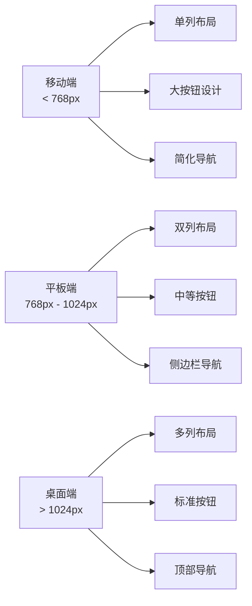

**图表来源**
- [App.vue](file://frontend/src/App.vue#L620-L640)

### 动画与过渡效果

应用使用CSS动画和Vue过渡系统提升用户体验：

#### 动画效果分类

| 动画类型 | 触发时机 | 效果描述 | 性能考虑 |
|---------|---------|---------|---------|
| 页面切换 | 状态变更 | 淡入淡出效果 | GPU加速 |
| 组件进入 | 条件渲染 | 上滑进入 | 预加载优化 |
| 加载动画 | 异步操作 | 旋转加载器 | 循环播放 |
| 错误提示 | 错误发生 | 滑入提示 | 自动消失 |

**节来源**
- [App.vue](file://frontend/src/App.vue#L672-L682)

## 性能优化策略

### 组件懒加载与代码分割

应用采用Vue的异步组件和动态导入实现性能优化：

#### 性能优化措施

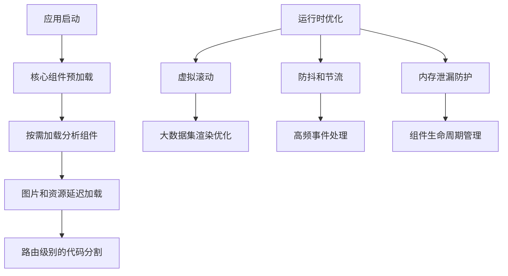

### 内存管理与垃圾回收

项目实现了完善的内存管理机制：

#### 内存优化策略

| 优化领域 | 实现方式 | 效果 | 注意事项 |
|---------|---------|------|---------|
| 组件卸载 | onUnmounted钩子 | 清理事件监听器 | 必须执行清理 |
| WebSocket连接 | 自动断开 | 避免连接泄漏 | 网络异常处理 |
| 定时器清理 | clearTimeout | 防止内存泄漏 | 组件销毁时清理 |
| 大数据处理 | 分页和虚拟滚动 | 减少DOM节点 | 用户体验平衡 |

**节来源**
- [useWebSocket.js](file://frontend/src/composables/useWebSocket.js#L117-L139)

## 总结

本项目的前端架构展现了现代Vue 3应用的最佳实践，通过组合式API、组件化设计和响应式编程模式，构建了一个功能完整、性能优异的视频分析平台。架构设计充分考虑了可维护性、可扩展性和用户体验，为后续的功能扩展和性能优化奠定了坚实的基础。

### 架构优势

1. **模块化设计**：清晰的组件边界和职责分离
2. **响应式架构**：基于Vue 3 Composition API的现代化开发
3. **实时通信**：WebSocket与HTTP轮询的混合策略
4. **状态管理**：合理的状态分布和数据流向
5. **性能优化**：多层次的性能优化策略
6. **用户体验**：完善的错误处理和响应式设计

这种架构设计不仅满足了当前的功能需求，也为未来的功能扩展和技术升级提供了良好的基础。