# 前端组件体系

<cite>
**本文档引用的文件**
- [App.vue](file://frontend/src/App.vue)
- [FileUploader.vue](file://frontend/src/components/FileUploader.vue)
- [CategoryDialog.vue](file://frontend/src/components/CategoryDialog.vue)
- [ProgressBar.vue](file://frontend/src/components/ProgressBar.vue)
- [AIAnalysisProgress.vue](file://frontend/src/components/AIAnalysisProgress.vue)
- [ContentAnalysisView.vue](file://frontend/src/components/ContentAnalysisView.vue) - *formatDuration函数改进，正确区分null/undefined和零时长*
- [FusionAnalysisView.vue](file://frontend/src/components/FusionAnalysisView.vue)
- [MusicPromptView.vue](file://frontend/src/components/MusicPromptView.vue)
- [ErrorMessage.vue](file://frontend/src/components/ErrorMessage.vue)
- [useAIAnalysis.js](file://frontend/src/composables/useAIAnalysis.js)
- [useWebSocket.js](file://frontend/src/composables/useWebSocket.js)
- [analysisStorage.js](file://frontend/src/utils/analysisStorage.js)
</cite>

## 更新摘要
**变更内容**
- 更新了ContentAnalysisView.vue组件中formatDuration函数的文档说明，详细描述了对null/undefined和零时长的正确区分处理
- 添加了formatDuration函数的调试日志机制说明
- 修正了时长显示逻辑，确保0秒视频正确显示为"0秒"而非"未知"
- 更新了相关代码示例和边界情况处理说明

## 目录
1. [项目概述](#项目概述)
2. [组件架构设计](#组件架构设计)
3. [核心组件详解](#核心组件详解)
4. [状态管理系统](#状态管理系统)
5. [通信机制](#通信机制)
6. [用户体验优化](#用户体验优化)
7. [错误处理机制](#错误处理机制)
8. [响应式设计](#响应式设计)
9. [总结](#总结)

## 项目概述

该前端项目是一个基于Vue 3的视频上传与AI分析系统，采用组件化架构设计，提供了完整的视频文件处理流程，包括文件上传、分类选择、进度监控、AI分析和结果展示等功能模块。

### 核心特性
- **状态驱动的组件架构**：通过`currentStep`状态控制不同阶段的组件渲染
- **实时进度更新**：基于WebSocket的实时上传进度监控
- **多类型AI分析**：支持内容分析、融合分析和音乐提示词生成
- **响应式设计**：适配不同屏幕尺寸的用户界面
- **完善的错误处理**：多层次的错误捕获和用户反馈机制

## 组件架构设计

### 整体架构图

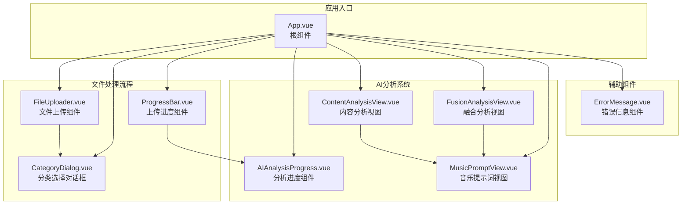

**架构图来源**
- [App.vue](file://frontend/src/App.vue#L183-L206)
- [FileUploader.vue](file://frontend/src/components/FileUploader.vue#L1-L304)
- [CategoryDialog.vue](file://frontend/src/components/CategoryDialog.vue#L1-L112)

### 组件层次结构

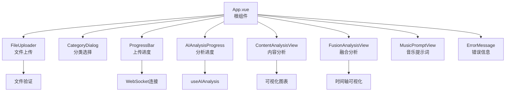

**章节来源**
- [App.vue](file://frontend/src/App.vue#L183-L206)

## 核心组件详解

### App.vue - 根组件

App.vue作为整个应用的根组件，通过`currentStep`状态变量控制不同阶段的组件渲染，实现了清晰的状态驱动架构。

#### 状态管理架构

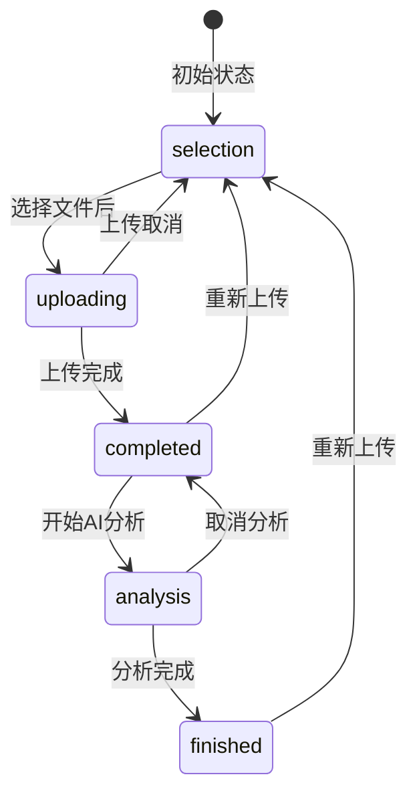

**状态图来源**
- [App.vue](file://frontend/src/App.vue#L209-L210)

#### 组件渲染逻辑

App.vue根据`currentStep`状态动态渲染不同的子组件：

- **文件选择阶段** (`currentStep === 'selection'`)：渲染FileUploader组件
- **上传阶段** (`currentStep === 'uploading'`)：渲染ProgressBar组件
- **完成阶段** (`currentStep === 'completed'`)：提供AI分析选项
- **分析阶段** (`currentStep === 'analysis'`)：渲染具体的分析结果组件
- **完成阶段** (`currentStep === 'finished'`)：显示最终完成页面

#### AI分析集成

App.vue集成了useAIAnalysis composable，提供完整的AI分析功能：

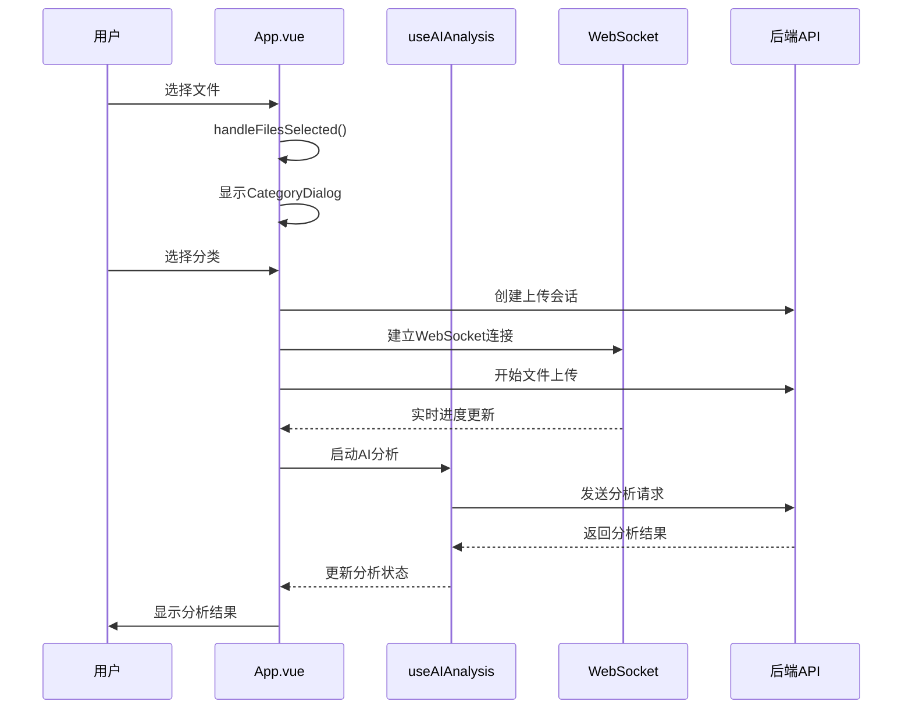

**序列图来源**
- [App.vue](file://frontend/src/App.vue#L235-L479)
- [useAIAnalysis.js](file://frontend/src/composables/useAIAnalysis.js#L1-L448)

**章节来源**
- [App.vue](file://frontend/src/App.vue#L1-L682)

### FileUploader.vue - 文件上传组件

FileUploader组件负责文件的选择、验证和初步处理，提供了完整的文件上传体验。

#### 文件处理流程

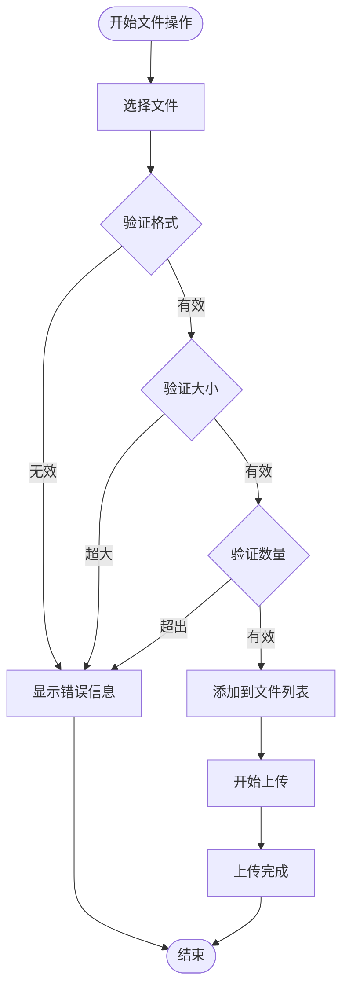

**流程图来源**
- [FileUploader.vue](file://frontend/src/components/FileUploader.vue#L141-L246)

#### 文件验证机制

FileUploader实现了严格的文件验证规则：

| 验证项 | 规则 | 错误处理 |
|--------|------|----------|
| 文件格式 | 支持MP4、AVI格式 | 显示具体文件名错误 |
| 文件大小 | 单个文件≤300MB | 显示文件过大提示 |
| 文件数量 | 最多3个文件 | 显示总数限制提示 |
| 类型一致性 | 所有文件必须同格式 | 显示格式不一致错误 |

#### 交互功能

- **拖拽上传**：支持拖拽文件到指定区域
- **文件预览**：显示已选择文件的详细信息
- **文件移除**：可单独移除不需要的文件
- **批量操作**：支持多文件同时选择

**章节来源**
- [FileUploader.vue](file://frontend/src/components/FileUploader.vue#L1-L304)

### CategoryDialog.vue - 分类选择对话框

CategoryDialog组件提供文件分类选择功能，确保上传的文件被正确归类存储。

#### 分类选项设计

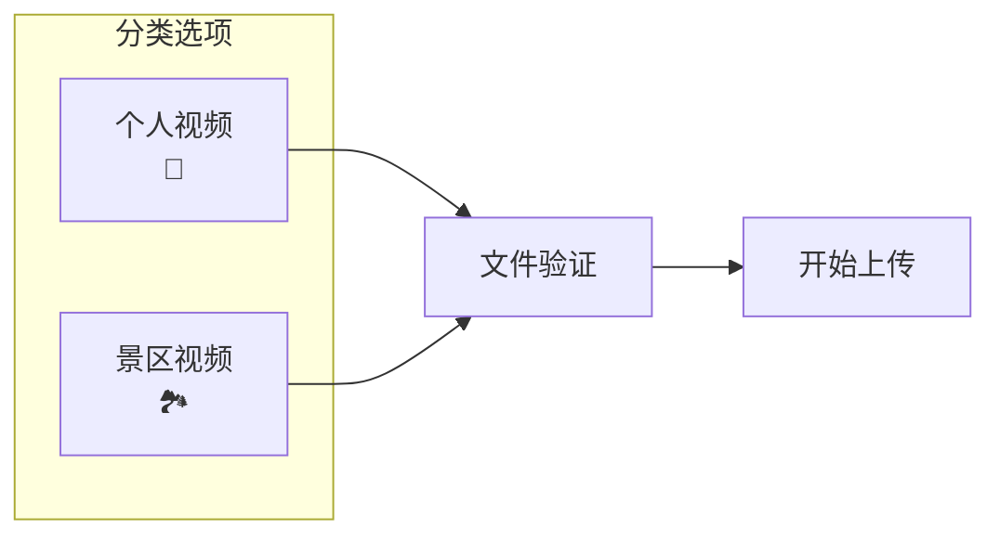

**分类图来源**
- [CategoryDialog.vue](file://frontend/src/components/CategoryDialog.vue#L13-L33)

#### 对话框交互

CategoryDialog采用模态对话框设计，提供以下功能：
- **分类选择**：两种预定义分类选项
- **文件预览**：显示待上传文件列表
- **确认/取消**：明确的操作按钮
- **响应式布局**：适配不同屏幕尺寸

**章节来源**
- [CategoryDialog.vue](file://frontend/src/components/CategoryDialog.vue#L1-L112)

### ProgressBar.vue - 上传进度组件

ProgressBar组件基于WebSocket实现实时上传进度监控，提供直观的进度展示和操作控制。

#### WebSocket实时更新机制

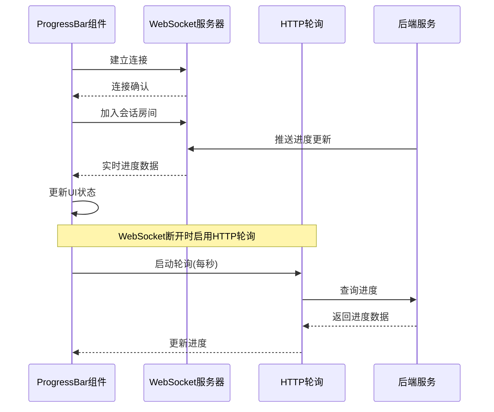

**序列图来源**
- [ProgressBar.vue](file://frontend/src/components/ProgressBar.vue#L113-L172)
- [useWebSocket.js](file://frontend/src/composables/useWebSocket.js#L21-L105)

#### 进度显示功能

ProgressBar组件提供多层次的进度信息：
- **总体进度**：显示所有文件的累计上传进度
- **单文件进度**：显示当前正在上传文件的详细进度
- **速度信息**：实时显示上传速度
- **状态信息**：显示当前上传状态和消息

#### 错误处理机制

- **上传失败**：显示具体错误信息
- **网络中断**：自动切换到HTTP轮询模式
- **取消操作**：提供取消上传的功能

**章节来源**
- [ProgressBar.vue](file://frontend/src/components/ProgressBar.vue#L1-L341)

### AIAnalysisProgress.vue - AI分析进度组件

AIAnalysisProgress组件专门用于展示AI分析过程的详细进度，提供丰富的可视化信息和交互功能。

#### 分析阶段可视化

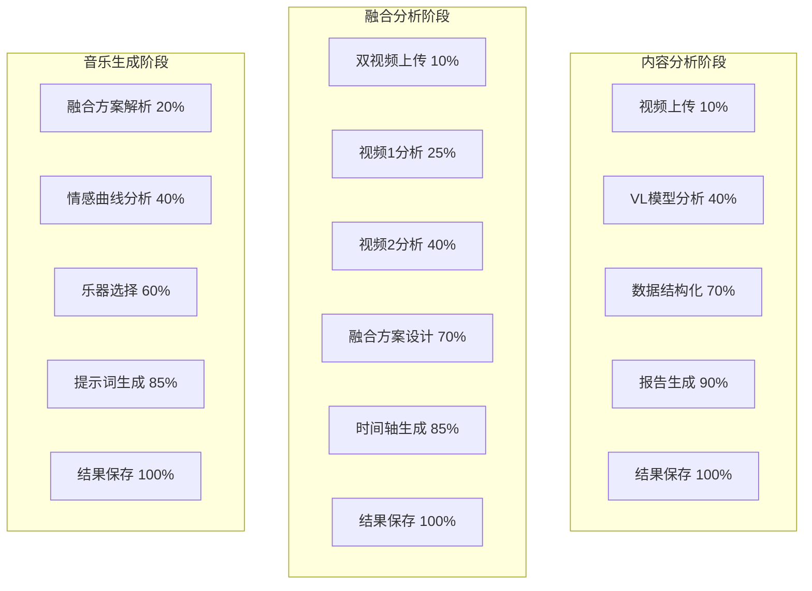

**阶段图来源**
- [AIAnalysisProgress.vue](file://frontend/src/components/AIAnalysisProgress.vue#L166-L195)

#### 实时日志系统

AIAnalysisProgress组件内置了实时日志系统，提供：
- **阶段性日志**：每个分析阶段的进展记录
- **时间统计**：已用时间和预计剩余时间
- **状态切换**：分析状态的实时更新
- **错误追踪**：分析过程中的异常情况

#### 交互功能

- **进度条动画**：流畅的进度更新动画
- **时间估算**：动态计算剩余时间
- **取消功能**：允许用户取消正在进行的分析
- **详细信息**：可展开查看详细的处理信息

**章节来源**
- [AIAnalysisProgress.vue](file://frontend/src/components/AIAnalysisProgress.vue#L1-L748)

### ContentAnalysisView.vue - 内容分析视图

ContentAnalysisView组件专门展示视频内容分析的结果，提供丰富的可视化图表和详细的技术报告。

#### 数据可视化架构

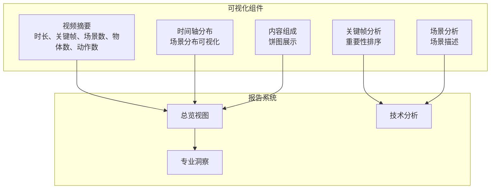

**可视化图来源**
- [ContentAnalysisView.vue](file://frontend/src/components/ContentAnalysisView.vue#L1-L903)

#### 技术指标展示

ContentAnalysisView展示了全面的视频技术指标：
- **视频基本信息**：时长、关键帧数量、场景数量
- **内容组成分析**：关键帧、场景、物体、动作的比例分布
- **时间轴分布**：视频内容在时间维度上的分布情况
- **质量评估**：视频的技术质量和完整性评分

#### formatDuration函数改进

ContentAnalysisView组件中的`formatDuration`函数经过改进，能够正确区分null/undefined和零时长：

```javascript
const formatDuration = (seconds) => {
  // 精确检查null和undefined，0秒是有效值
  if (seconds === null || seconds === undefined) return '未知'
  if (typeof seconds !== 'number' || seconds < 0) return '数据异常'

  // 特殊处理0秒情况
  if (seconds === 0) return '0秒'

  const minutes = Math.floor(seconds / 60)
  const remainingSeconds = Math.floor(seconds % 60)

  // 优化显示格式
  if (minutes === 0) {
    return `${remainingSeconds}秒`
  }
  return `${minutes}分${remainingSeconds}秒`
}
```

**函数改进说明**
- **精确区分**：明确区分null/undefined（表示数据缺失）和0秒（表示实际时长为0）
- **边界处理**：正确处理0秒视频，显示为"0秒"而非"未知"
- **类型验证**：严格检查输入参数的类型和有效性
- **调试日志**：添加详细的调试日志，便于问题排查

**调试日志机制**

组件在`setup`函数中添加了详细的调试日志：

```javascript
const summary = computed(() => {
  const summaryData = props.analysis.summary || {}

  // 添加数据验证和调试日志
  console.log('🔍 ContentAnalysis接收到的summary:', summaryData)

  // 验证关键字段
  if (summaryData.duration === undefined || summaryData.duration === null) {
    console.warn('⚠️ duration字段缺失或为null', { summary: summaryData })
  }

  if (typeof summaryData.duration !== 'number' || summaryData.duration < 0) {
    console.warn('⚠️ duration字段类型或值异常', {
      duration: summaryData.duration,
      type: typeof summaryData.duration
    })
  }
})
```

**边界情况测试**

改进后的函数通过了以下边界情况测试：
- `formatDuration(0)` → "0秒"（0秒视频）
- `formatDuration(null)` → "未知"（数据缺失）
- `formatDuration(undefined)` → "未知"（数据缺失）
- `formatDuration(-5)` → "数据异常"（无效值）
- `formatDuration(12.91)` → "12秒"（正常时长）
- `formatDuration(125.5)` → "2分5秒"（超过1分钟）

**章节来源**
- [ContentAnalysisView.vue](file://frontend/src/components/ContentAnalysisView.vue#L281-L317) - *formatDuration函数改进*
- [ContentAnalysisView.vue](file://frontend/src/components/ContentAnalysisView.vue#L235-L248) - *调试日志机制*

### FusionAnalysisView.vue - 融合分析视图

FusionAnalysisView组件专门处理两个视频的融合分析，提供详细的时间轴设计和制作方案。

#### 融合分析流程

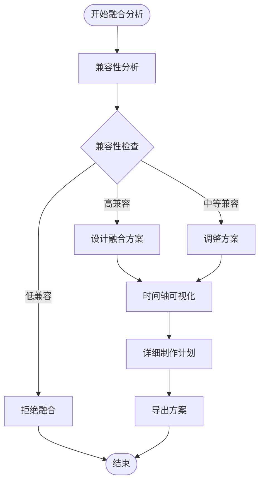

**流程图来源**
- [FusionAnalysisView.vue](file://frontend/src/components/FusionAnalysisView.vue#L1-L1174)

#### 时间轴可视化

FusionAnalysisView提供了创新的时间轴可视化功能：
- **三轨对比**：视频A、融合后、视频B的并行展示
- **智能分段**：基于内容的自动分段策略
- **转场效果**：预览各种转场效果的应用
- **时长控制**：确保融合后的视频符合目标时长要求

#### 制作方案生成

组件自动生成详细的制作方案：
- **分段策略**：每个片段的来源和用途说明
- **转场设计**：具体的转场效果和时长安排
- **技术参数**：分辨率、帧率、编码格式的统一配置
- **时间规划**：每个制作阶段的时间估算

**章节来源**
- [FusionAnalysisView.vue](file://frontend/src/components/FusionAnalysisView.vue#L1-L1174)

### MusicPromptView.vue - 音乐提示词视图

MusicPromptView组件专门生成和展示背景音乐的提示词，为视频创作提供音乐灵感。

#### 提示词生成流程

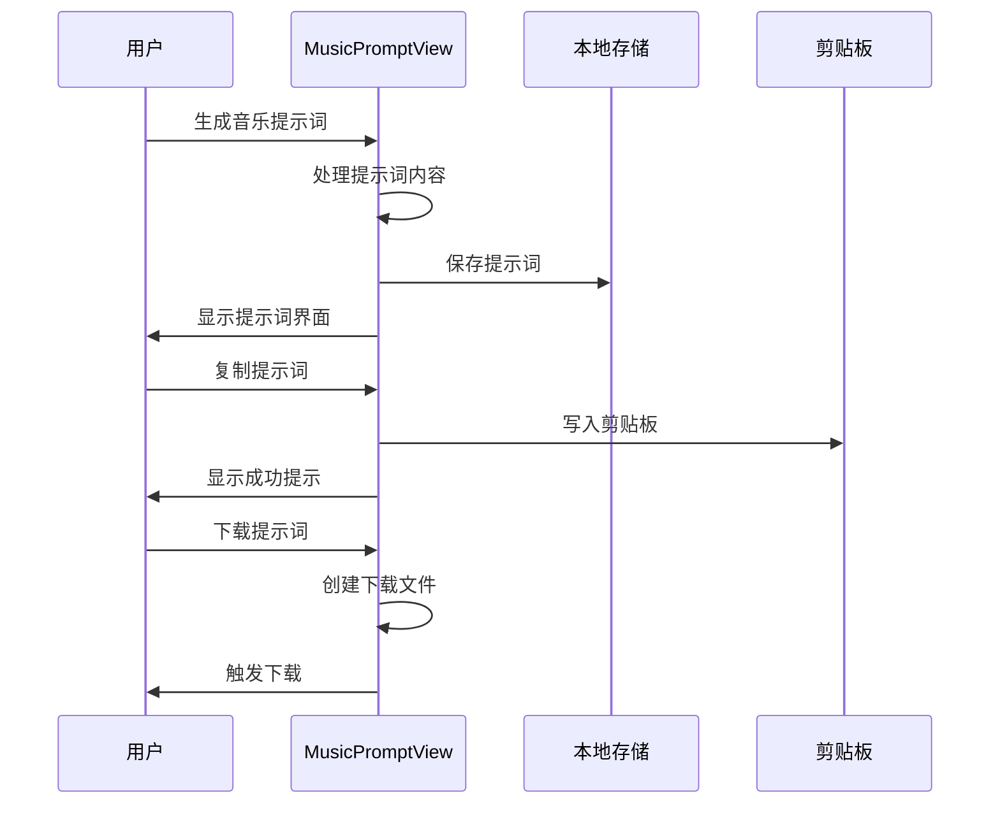

**序列图来源**
- [MusicPromptView.vue](file://frontend/src/components/MusicPromptView.vue#L1-L249)

#### 提示词功能

MusicPromptView提供了完整的提示词管理功能：
- **提示词展示**：清晰显示生成的音乐提示词
- **复制功能**：一键复制到剪贴板
- **下载功能**：保存为文本文件
- **使用指导**：提供AI音乐生成工具的使用说明

#### 用户体验优化

- **即时反馈**：复制成功后显示确认提示
- **多种导出**：支持直接复制和文件下载
- **响应式设计**：适配不同设备的屏幕尺寸

**章节来源**
- [MusicPromptView.vue](file://frontend/src/components/MusicPromptView.vue#L1-L249)

### ErrorMessage.vue - 错误信息组件

ErrorMessage组件提供统一的错误信息展示和处理机制，确保用户能够及时了解和处理各种错误情况。

#### 错误类型映射

| 错误代码 | 错误类型 | 用户友好名称 |
|----------|----------|--------------|
| INVALID_FILE_FORMAT | 文件格式错误 | 文件格式错误 |
| FILE_TOO_LARGE | 文件过大 | 文件过大 |
| TOO_MANY_FILES | 文件数量过多 | 文件数量过多 |
| UPLOAD_ERROR | 上传错误 | 上传错误 |
| VALIDATION_ERROR | 验证失败 | 验证失败 |
| SESSION_CREATION_FAILED | 会话创建失败 | 会话创建失败 |
| NETWORK_ERROR | 网络错误 | 网络错误 |

**错误映射表来源**
- [ErrorMessage.vue](file://frontend/src/components/ErrorMessage.vue#L35-L44)

#### 错误处理机制

ErrorMessage组件实现了简洁而有效的错误处理：
- **错误分类**：根据错误代码提供相应的标题
- **解决方案提示**：提供具体的解决建议
- **用户友好**：避免技术术语，使用通俗易懂的语言
- **快速关闭**：提供便捷的关闭方式

**章节来源**
- [ErrorMessage.vue](file://frontend/src/components/ErrorMessage.vue#L1-L52)

## 状态管理系统

### useAIAnalysis Composable

useAIAnalysis是整个AI分析功能的核心composable，提供了统一的状态管理和API调用接口。

#### 状态管理架构

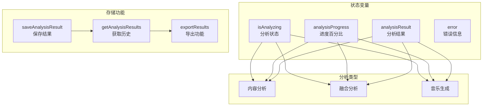

**架构图来源**
- [useAIAnalysis.js](file://frontend/src/composables/useAIAnalysis.js#L15-L448)

#### 分析流程管理

useAIAnalysis提供了三种主要的分析类型：

1. **内容分析**：针对单个视频文件的内容深度分析
2. **融合分析**：比较两个视频文件的融合可能性和方案
3. **音乐生成**：基于融合方案生成背景音乐提示词

#### 存储和历史功能

- **本地存储**：使用localStorage持久化分析结果
- **历史记录**：维护完整的分析历史和统计数据
- **导出功能**：支持JSON、CSV、TXT等多种格式导出
- **缓存管理**：自动清理过期数据和优化存储空间

**章节来源**
- [useAIAnalysis.js](file://frontend/src/composables/useAIAnalysis.js#L1-L448)

### useWebSocket Composable

useWebSocket提供了WebSocket连接管理和实时通信功能，是ProgressBar组件实时进度更新的核心。

#### 连接管理机制

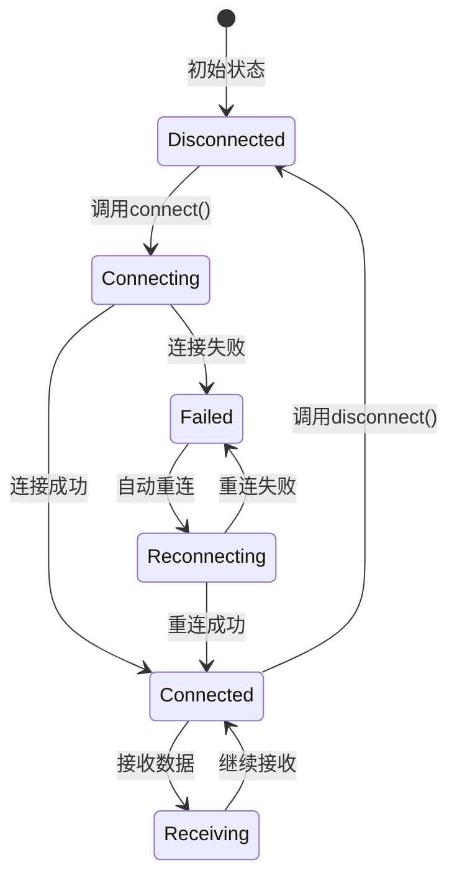

**状态图来源**
- [useWebSocket.js](file://frontend/src/composables/useWebSocket.js#L21-L105)

#### 回退机制

useWebSocket实现了智能的回退机制：
- **WebSocket优先**：优先使用WebSocket进行实时通信
- **HTTP轮询**：WebSocket断开时自动切换到HTTP轮询
- **连接超时**：3秒内未连接成功则启用轮询模式
- **错误恢复**：网络恢复时自动重新建立WebSocket连接

**章节来源**
- [useWebSocket.js](file://frontend/src/composables/useWebSocket.js#L1-L139)

## 通信机制

### Props传递模式

各组件间采用标准的Props传递模式进行数据流动：

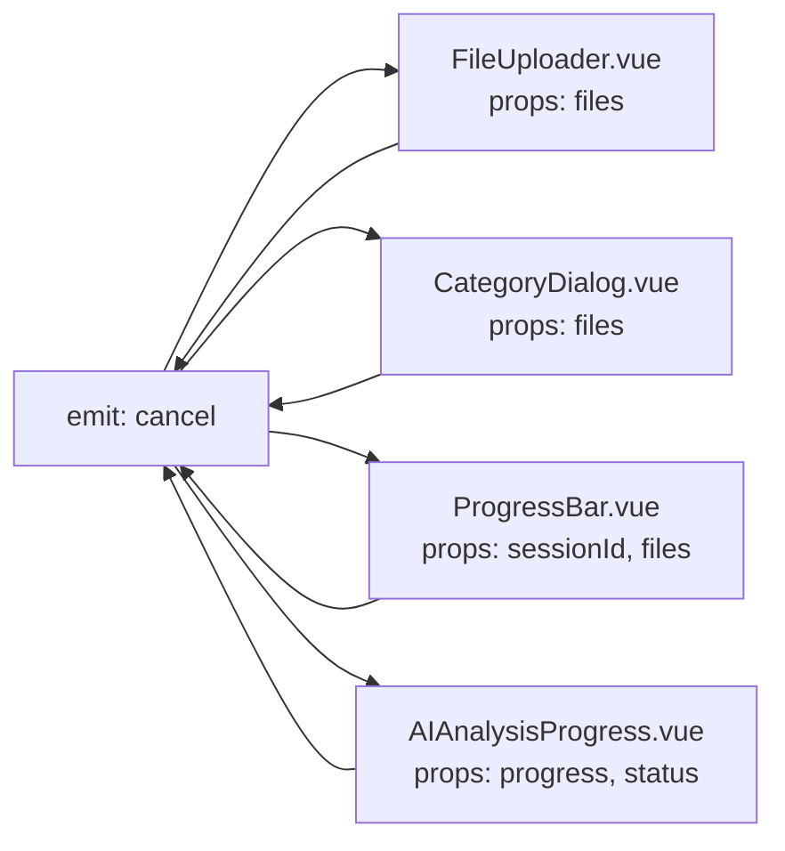

**通信图来源**
- [App.vue](file://frontend/src/App.vue#L11-L17)
- [FileUploader.vue](file://frontend/src/components/FileUploader.vue#L81-L82)

### Event Emit通信

组件间通过Event emit进行双向通信：

- **文件选择**：FileUploader → App → CategoryDialog
- **上传进度**：ProgressBar → App → UI更新
- **分析控制**：AIAnalysisProgress → App → 分析状态更新
- **错误处理**：各组件 → App → ErrorMessage显示

### WebSocket实时通信

ProgressBar组件使用WebSocket实现实时进度更新：

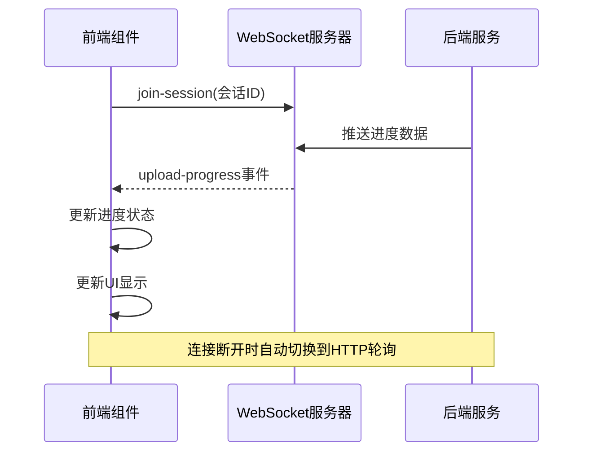

**序列图来源**
- [ProgressBar.vue](file://frontend/src/components/ProgressBar.vue#L113-L172)

## 用户体验优化

### Fade-In动画效果

项目广泛使用了Fade-In动画提升用户体验：

```css
.fade-in {
  animation: fadeIn 0.3s ease-in;
}

@keyframes fadeIn {
  from {
    opacity: 0;
    transform: translateY(10px);
  }
  to {
    opacity: 1;
    transform: translateY(0);
  }
}
```

**动画效果来源**
- [App.vue](file://frontend/src/App.vue#L668-L681)

### 响应式设计

所有组件都实现了响应式设计：

#### 断点设计

| 断点 | 屏幕宽度 | 适配策略 |
|------|----------|----------|
| 移动端 | ≤768px | 单列布局，按钮全宽 |
| 平板端 | 768px-1024px | 弹性布局，适当调整间距 |
| 桌面端 | >1024px | 多列布局，充分利用空间 |

#### 组件响应式适配

- **文件上传区域**：移动端显示为全屏按钮
- **分析结果展示**：移动端折叠标签页
- **进度条组件**：移动端简化显示内容
- **对话框组件**：移动端全屏显示

### 交互反馈机制

项目实现了多层次的交互反馈：

1. **视觉反馈**：按钮状态变化、进度条动画
2. **文字反馈**：实时状态更新、错误信息提示
3. **声音反馈**：关键操作完成时的音效（可选）
4. **加载状态**：长时间操作时的加载指示器

## 错误处理机制

### 多层错误处理架构

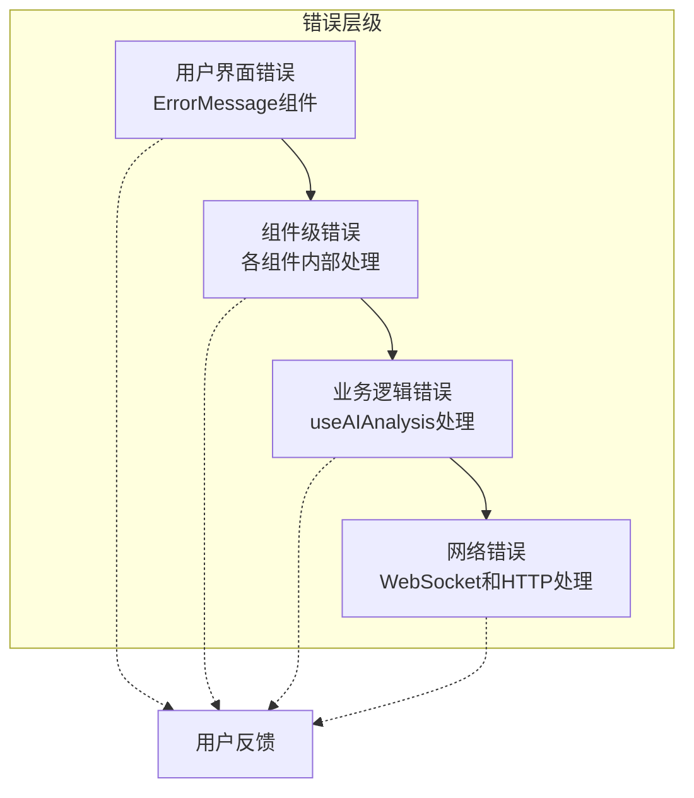

**错误处理架构图来源**
- [ErrorMessage.vue](file://frontend/src/components/ErrorMessage.vue#L1-L52)
- [useAIAnalysis.js](file://frontend/src/composables/useAIAnalysis.js#L34-L95)

### 错误类型分类

项目按严重程度和处理方式对错误进行了分类：

#### 可恢复错误
- **文件格式错误**：提示用户更换文件格式
- **文件大小超限**：建议压缩或分割文件
- **网络超时**：自动重试或切换到轮询模式

#### 不可恢复错误
- **API调用失败**：显示具体错误信息和解决方案
- **认证失败**：引导用户重新登录
- **系统错误**：提供技术支持联系方式

### 错误恢复策略

- **自动重试**：网络错误时自动重试几次
- **降级处理**：WebSocket失败时使用HTTP轮询
- **状态重置**：错误发生时重置相关状态
- **用户引导**：提供明确的解决步骤

**章节来源**
- [useWebSocket.js](file://frontend/src/composables/useWebSocket.js#L89-L104)
- [useAIAnalysis.js](file://frontend/src/composables/useAIAnalysis.js#L34-L95)

## 响应式设计

### 设计原则

项目遵循移动优先的设计原则：

1. **弹性布局**：使用CSS Grid和Flexbox实现弹性布局
2. **断点设计**：基于典型设备尺寸设置断点
3. **字体缩放**：使用相对单位确保字体可读性
4. **触摸友好**：按钮和交互元素满足触摸操作需求

### 组件适配策略

#### 文件上传组件
- **移动端**：全屏显示上传区域，简化文件列表
- **桌面端**：显示完整的文件列表和详细信息

#### 分析结果组件
- **移动端**：折叠标签页，隐藏次要信息
- **桌面端**：展开所有面板，显示详细数据

#### 进度组件
- **移动端**：简化进度显示，突出关键信息
- **桌面端**：显示详细的时间统计和文件列表

### 性能优化

响应式设计不仅关注视觉效果，还注重性能：

- **懒加载**：大型图表组件采用懒加载
- **虚拟滚动**：长列表使用虚拟滚动技术
- **图片优化**：不同尺寸提供相应分辨率的图片
- **CSS优化**：使用CSS变量和媒体查询减少重复代码

## 总结

该前端组件体系展现了现代Web应用的最佳实践：

### 架构优势

1. **清晰的状态驱动**：通过`currentStep`状态控制组件渲染，逻辑清晰易维护
2. **模块化的组件设计**：每个组件职责单一，便于测试和复用
3. **强大的通信机制**：Props传递和Event emit相结合，实现灵活的数据流
4. **实时性保障**：WebSocket+HTTP轮询的双重保障机制

### 技术亮点

1. **AI分析集成**：深度集成AI分析功能，提供智能化的视频处理体验
2. **可视化展示**：丰富的图表和可视化组件，提升数据分析效果
3. **用户体验优化**：Fade-In动画、响应式设计、多层错误处理
4. **存储管理**：智能的本地存储和缓存管理机制

### 扩展性考虑

- **插件化架构**：新分析类型可通过扩展composable轻松添加
- **主题系统**：支持自定义主题和样式覆盖
- **国际化支持**：预留国际化接口，支持多语言版本
- **性能监控**：内置性能监控和错误追踪机制

这套组件体系不仅满足了当前的功能需求，还为未来的功能扩展和技术升级奠定了坚实的基础。