# 状态管理

<cite>
**本文档引用的文件**
- [App.vue](file://frontend/src/App.vue)
- [useAIAnalysis.js](file://frontend/src/composables/useAIAnalysis.js)
- [useWebSocket.js](file://frontend/src/composables/useWebSocket.js)
- [analysisStorage.js](file://frontend/src/utils/analysisStorage.js)
- [analysisDataStructures.js](file://frontend/src/utils/analysisDataStructures.js)
- [FileUploader.vue](file://frontend/src/components/FileUploader.vue)
- [ProgressBar.vue](file://frontend/src/components/ProgressBar.vue)
- [CategoryDialog.vue](file://frontend/src/components/CategoryDialog.vue)
- [main.js](file://frontend/src/main.js)
</cite>

## 目录
1. [概述](#概述)
2. [核心状态架构](#核心状态架构)
3. [集中式状态管理](#集中式状态管理)
4. [状态生命周期](#状态生命周期)
5. [组件间状态传递机制](#组件间状态传递机制)
6. [用户工作流状态管理](#用户工作流状态管理)
7. [异常处理与恢复](#异常处理与恢复)
8. [性能优化策略](#性能优化策略)
9. [最佳实践](#最佳实践)
10. [总结](#总结)

## 概述

本项目采用Vue 3的响应式系统实现了一套完整的集中式状态管理策略，通过`ref`和`setup()`语法构建了一个层次化的状态管理体系。该系统围绕用户的核心工作流程——文件上传、分类选择、AI分析和结果展示——设计了清晰的状态流转机制。

### 设计原则

- **单一数据源**：所有应用状态集中在根组件中管理
- **响应式更新**：利用Vue 3的响应式系统实现状态变更的自动传播
- **组合式函数**：通过composables提供可复用的状态逻辑
- **异步状态管理**：妥善处理API调用和WebSocket通信中的异步状态

## 核心状态架构

### 基础状态变量

App.vue中定义的核心状态变量构成了应用的基础状态架构：

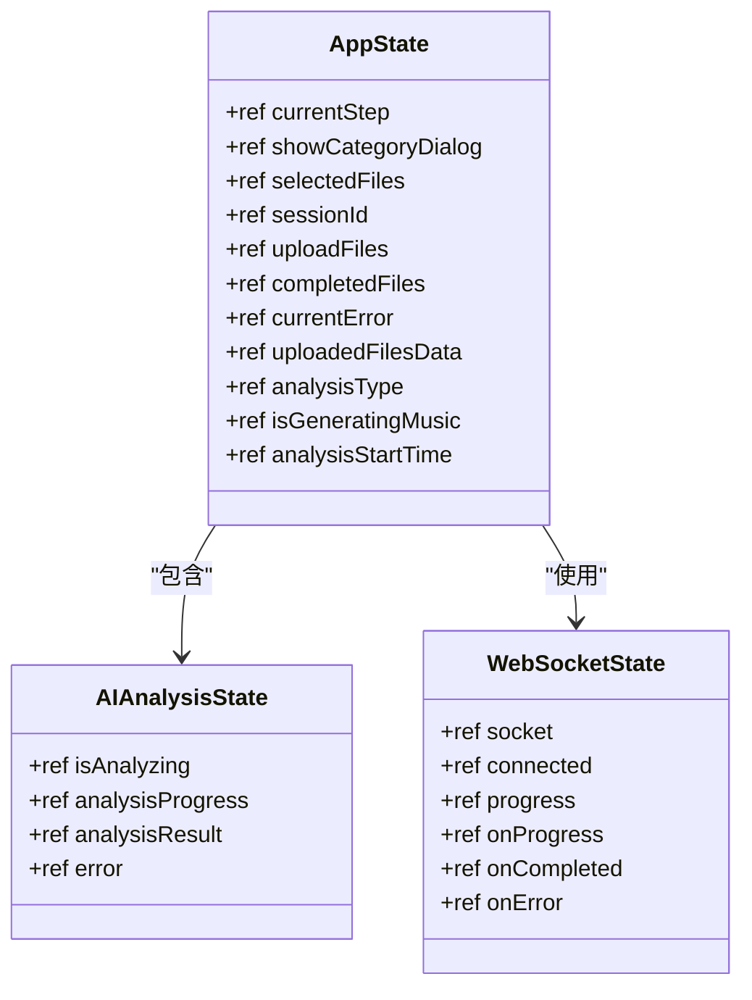

**图表来源**
- [App.vue](file://frontend/src/App.vue#L208-L233)
- [useAIAnalysis.js](file://frontend/src/composables/useAIAnalysis.js#L15-L20)
- [useWebSocket.js](file://frontend/src/composables/useWebSocket.js#L1-L15)

### 状态类型分类

| 状态类型 | 描述 | 响应式特性 | 生命周期 |
|---------|------|-----------|----------|
| 流程控制状态 | currentStep, showCategoryDialog | 永久响应式 | 应用级 |
| 文件状态 | selectedFiles, uploadFiles, uploadedFilesData | 动态响应式 | 上传周期 |
| 分析状态 | isAnalyzing, analysisProgress, analysisResult | 实时响应式 | 分析周期 |
| 错误状态 | currentError, analysisError | 条件响应式 | 异常处理 |
| 会话状态 | sessionId, analysisType | 临时响应式 | 会话周期 |

**章节来源**
- [App.vue](file://frontend/src/App.vue#L208-L233)

## 集中式状态管理

### 根组件状态管理

应用采用根组件集中管理所有状态的设计模式，通过`setup()`函数返回响应式状态和方法：

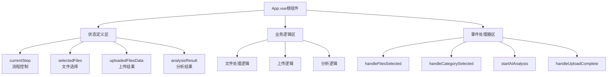

**图表来源**
- [App.vue](file://frontend/src/App.vue#L207-L479)

### Composable状态封装

AI分析功能通过独立的composable实现状态封装：

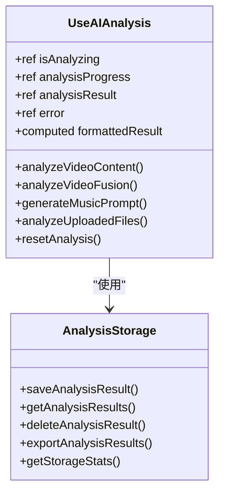

**图表来源**
- [useAIAnalysis.js](file://frontend/src/composables/useAIAnalysis.js#L14-L448)
- [analysisStorage.js](file://frontend/src/utils/analysisStorage.js#L36-L534)

**章节来源**
- [App.vue](file://frontend/src/App.vue#L223-L233)
- [useAIAnalysis.js](file://frontend/src/composables/useAIAnalysis.js#L14-L448)

## 状态生命周期

### 完整状态流转图

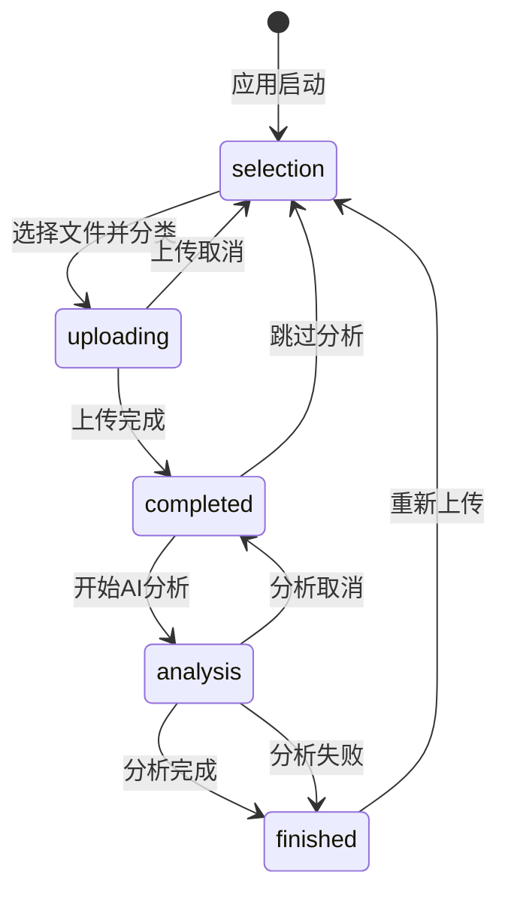

### 关键状态转换节点

| 状态节点 | 触发条件 | 状态变更 | 副作用 |
|---------|----------|----------|--------|
| selection → uploading | handleCategorySelected成功 | currentStep='uploading' showCategoryDialog=false | 创建上传会话 |
| uploading → completed | WebSocket/HTTP轮询完成 | currentStep='completed' 保存上传数据 | 更新uploadedFilesData |
| completed → analysis | startAIAnalysis调用 | currentStep='analysis' 设置分析类型 | 启动AI分析流程 |
| analysis → finished | handleAnalysisComplete | currentStep='finished' | 清理分析状态 |

**章节来源**
- [App.vue](file://frontend/src/App.vue#L235-L479)

## 组件间状态传递机制

### Props传递机制

子组件通过props接收来自父组件的状态：

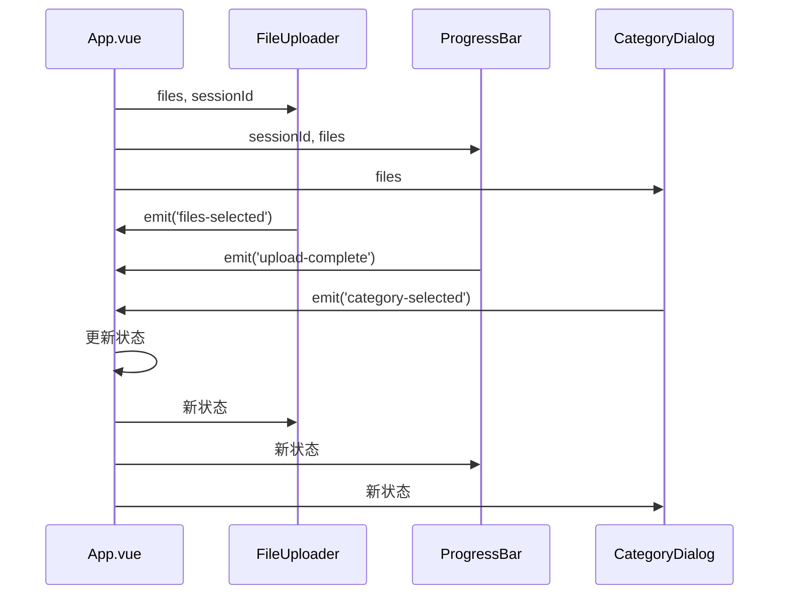

**图表来源**
- [App.vue](file://frontend/src/App.vue#L11-L17)
- [FileUploader.vue](file://frontend/src/components/FileUploader.vue#L82)
- [ProgressBar.vue](file://frontend/src/components/ProgressBar.vue#L111)
- [CategoryDialog.vue](file://frontend/src/components/CategoryDialog.vue#L77)

### Emit事件机制

组件通过emit事件向父组件传递状态变更：

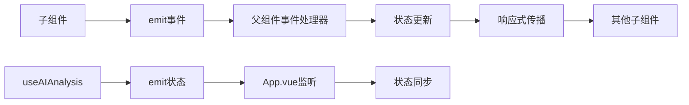

**图表来源**
- [FileUploader.vue](file://frontend/src/components/FileUploader.vue#L82)
- [ProgressBar.vue](file://frontend/src/components/ProgressBar.vue#L111)
- [CategoryDialog.vue](file://frontend/src/components/CategoryDialog.vue#L77)

### Composable返回值机制

组合式函数通过返回响应式对象实现状态共享：

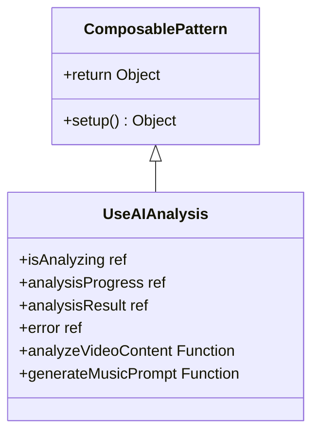

**图表来源**
- [useAIAnalysis.js](file://frontend/src/composables/useAIAnalysis.js#L14-L448)

**章节来源**
- [App.vue](file://frontend/src/App.vue#L18-L107)
- [FileUploader.vue](file://frontend/src/components/FileUploader.vue#L82)
- [ProgressBar.vue](file://frontend/src/components/ProgressBar.vue#L111)
- [CategoryDialog.vue](file://frontend/src/components/CategoryDialog.vue#L77)

## 用户工作流状态管理

### 文件上传工作流

文件上传是应用的核心工作流，涉及多个状态节点的协调：

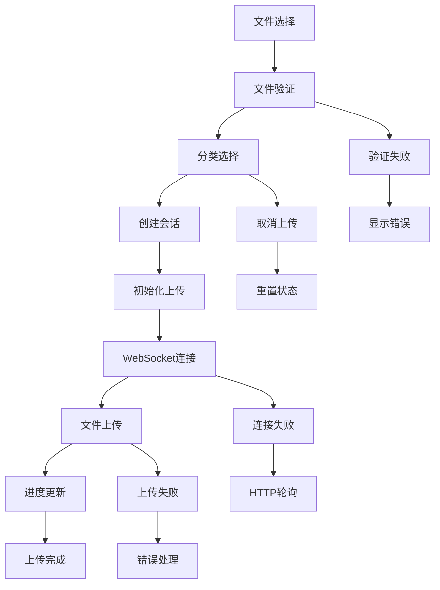

**图表来源**
- [App.vue](file://frontend/src/App.vue#L235-L342)
- [ProgressBar.vue](file://frontend/src/components/ProgressBar.vue#L96-L341)

### AI分析工作流

AI分析工作流展示了复杂状态管理的典型模式：

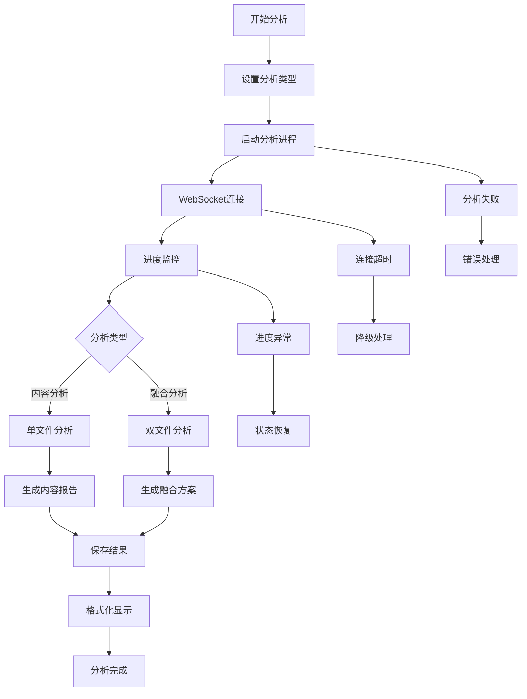

**图表来源**
- [App.vue](file://frontend/src/App.vue#L370-L420)
- [useAIAnalysis.js](file://frontend/src/composables/useAIAnalysis.js#L30-L448)

### 状态异常处理

针对不同类型的异常，系统实现了多层次的处理机制：

| 异常类型 | 检测位置 | 处理策略 | 恢复机制 |
|---------|----------|----------|----------|
| 上传中断 | WebSocket连接 | 切换HTTP轮询 | 重连机制 |
| 分析失败 | API调用 | 显示错误信息 | 重试机制 |
| 网络超时 | 请求超时 | 降级处理 | 缓存读取 |
| 数据验证 | 前端验证 | 实时反馈 | 输入修正 |

**章节来源**
- [App.vue](file://frontend/src/App.vue#L335-L342)
- [useAIAnalysis.js](file://frontend/src/composables/useAIAnalysis.js#L34-L98)
- [ProgressBar.vue](file://frontend/src/components/ProgressBar.vue#L96-L341)

## 异常处理与恢复

### 错误状态管理

应用实现了完善的错误状态管理机制：

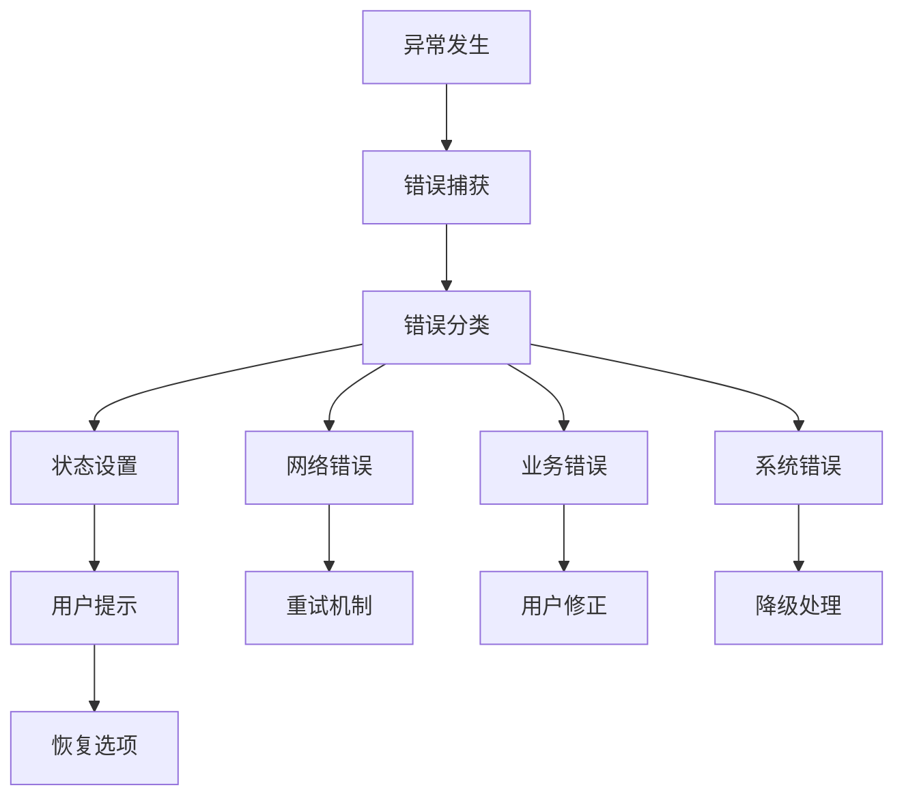

**图表来源**
- [App.vue](file://frontend/src/App.vue#L335-L342)
- [useAIAnalysis.js](file://frontend/src/composables/useAIAnalysis.js#L94-L98)

### 状态恢复策略

系统提供了多种状态恢复策略：

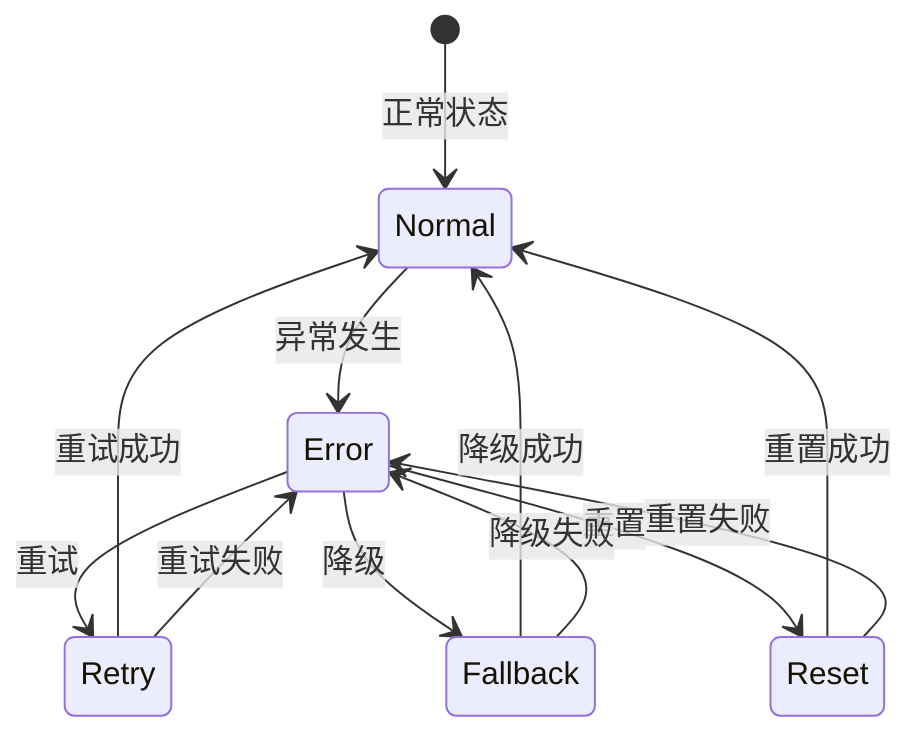

**章节来源**
- [App.vue](file://frontend/src/App.vue#L365-L368)
- [useAIAnalysis.js](file://frontend/src/composables/useAIAnalysis.js#L326-L331)

## 性能优化策略

### 响应式开销优化

为了避免不必要的响应式开销，系统采用了以下优化策略：

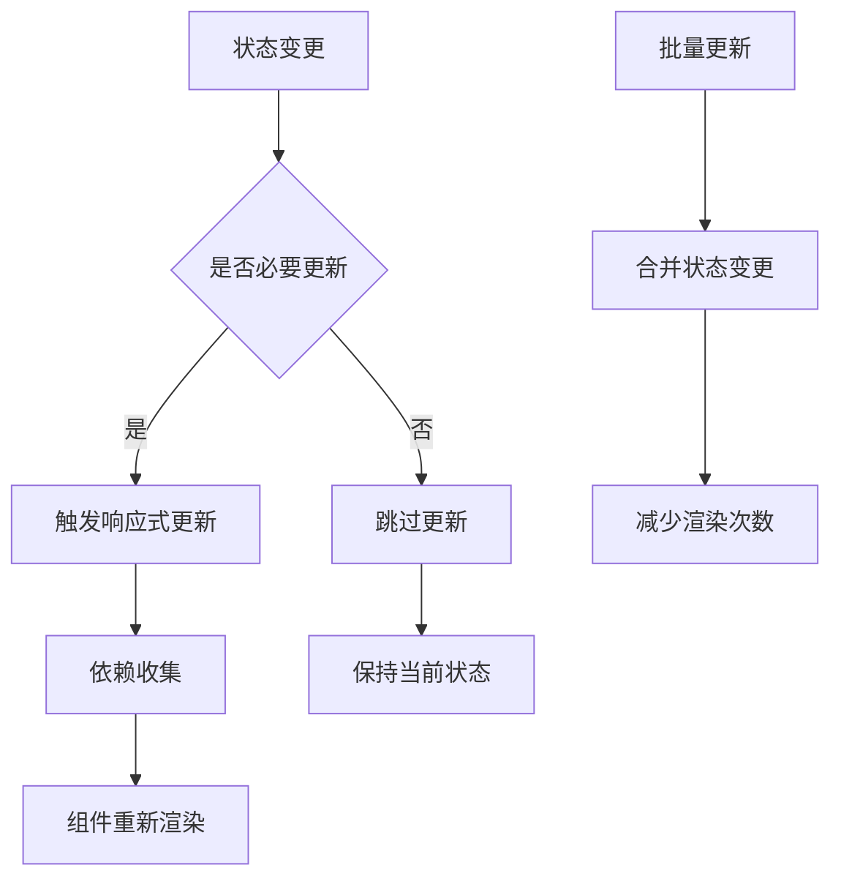

### 内存管理优化

系统实现了智能的内存管理机制：

| 优化策略 | 实现方式 | 效果 |
|---------|----------|------|
| 状态清理 | 组件卸载时清理 | 防止内存泄漏 |
| 缓存限制 | 最大记录数控制 | 控制内存使用 |
| 延迟加载 | 按需加载分析结果 | 减少初始内存占用 |
| 数据压缩 | 本地存储压缩 | 优化存储效率 |

**章节来源**
- [analysisStorage.js](file://frontend/src/utils/analysisStorage.js#L443-L476)
- [useWebSocket.js](file://frontend/src/composables/useWebSocket.js#L117-L127)

## 最佳实践

### 状态命名规范

系统遵循统一的状态命名规范：

- **布尔状态**：isAnalyzing, showCategoryDialog, isGeneratingMusic
- **集合状态**：selectedFiles, uploadFiles, uploadedFilesData
- **数值状态**：analysisProgress, completedFiles, analysisStartTime
- **对象状态**：analysisResult, currentError, progress

### 状态更新模式

推荐的状态更新模式：

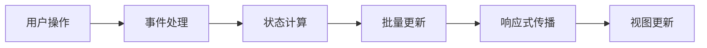

### 错误处理最佳实践

1. **分层错误处理**：在不同层级实现相应的错误处理
2. **用户友好提示**：提供清晰的错误信息和解决建议
3. **状态隔离**：确保错误不会影响正常状态
4. **恢复机制**：提供多种恢复途径

**章节来源**
- [App.vue](file://frontend/src/App.vue#L208-L233)
- [useAIAnalysis.js](file://frontend/src/composables/useAIAnalysis.js#L14-L448)

## 总结

本项目的状态管理系统展现了Vue 3响应式系统的强大能力，通过集中式状态管理、组合式函数封装和组件间状态传递机制，构建了一个完整、高效且易于维护的状态管理架构。

### 核心优势

1. **清晰的职责分离**：根组件负责全局状态，composables负责业务逻辑
2. **强大的响应式支持**：自动化的状态传播和视图更新
3. **灵活的扩展性**：模块化的状态管理便于功能扩展
4. **完善的异常处理**：多层次的错误处理和恢复机制

### 技术特色

- **实时状态同步**：通过WebSocket实现实时进度更新
- **异步状态管理**：妥善处理API调用和文件上传的异步状态
- **性能优化**：智能的响应式管理和内存优化策略
- **用户体验**：流畅的状态转换和及时的用户反馈

这套状态管理策略不仅满足了当前的功能需求，也为未来的功能扩展奠定了坚实的基础，是Vue 3响应式系统在实际项目中应用的优秀范例。