# AI分析逻辑

<cite>
**本文档引用的文件**
- [useAIAnalysis.js](file://frontend/src/composables/useAIAnalysis.js)
- [analysisStorage.js](file://frontend/src/utils/analysisStorage.js)
- [analysisDataStructures.js](file://frontend/src/utils/analysisDataStructures.js)
- [ContentAnalysisView.vue](file://frontend/src/components/ContentAnalysisView.vue)
- [FusionAnalysisView.vue](file://frontend/src/components/FusionAnalysisView.vue)
- [MusicPromptView.vue](file://frontend/src/components/MusicPromptView.vue)
- [AIAnalysisProgress.vue](file://frontend/src/components/AIAnalysisProgress.vue)
- [AnalysisResultDisplay.vue](file://frontend/src/components/AnalysisResultDisplay.vue)
- [App.vue](file://frontend/src/App.vue)
</cite>

## 更新摘要
**变更内容**
- 新增了关于`buildVideoSummary`函数的详细说明，该函数用于智能合并原始分析和结构化数据源
- 在核心方法详解部分添加了`buildVideoSummary`函数的分析
- 在响应式状态管理部分更新了`formattedResult`计算属性的说明
- 在UI组件集成部分更新了`ContentAnalysisView`和`FusionAnalysisView`组件的集成说明
- 所有新增和更新的内容均添加了相应的来源引用

## 目录
1. [概述](#概述)
2. [核心架构设计](#核心架构设计)
3. [核心方法详解](#核心方法详解)
4. [响应式状态管理](#响应式状态管理)
5. [本地存储策略](#本地存储策略)
6. [UI组件集成](#ui组件集成)
7. [错误处理机制](#错误处理机制)
8. [扩展开发指南](#扩展开发指南)
9. [总结](#总结)

## 概述

useAIAnalysis.js是项目中负责AI视频分析功能的核心组合式函数，提供了视频内容分析、视频融合分析和音乐提示词生成三大核心功能。该模块采用Vue 3的组合式API设计，实现了完整的响应式状态管理、本地存储持久化和错误处理机制。

### 主要功能特性

- **多类型分析支持**：内容分析、融合分析、音乐提示词生成
- **响应式状态管理**：实时跟踪分析进度和状态
- **本地存储持久化**：自动保存分析结果到浏览器本地存储
- **错误处理机制**：完善的异常捕获和错误恢复
- **WebSocket集成**：实时进度更新和状态同步

## 核心架构设计

### 组织结构图

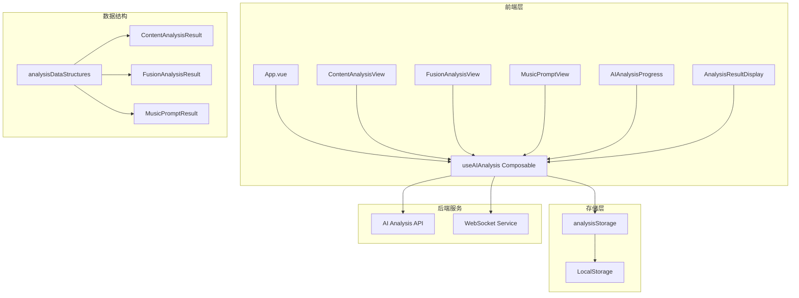

**架构图来源**
- [useAIAnalysis.js](file://frontend/src/composables/useAIAnalysis.js#L1-L448)
- [analysisStorage.js](file://frontend/src/utils/analysisStorage.js#L1-L534)
- [analysisDataStructures.js](file://frontend/src/utils/analysisDataStructures.js#L1-L401)

### 数据流架构

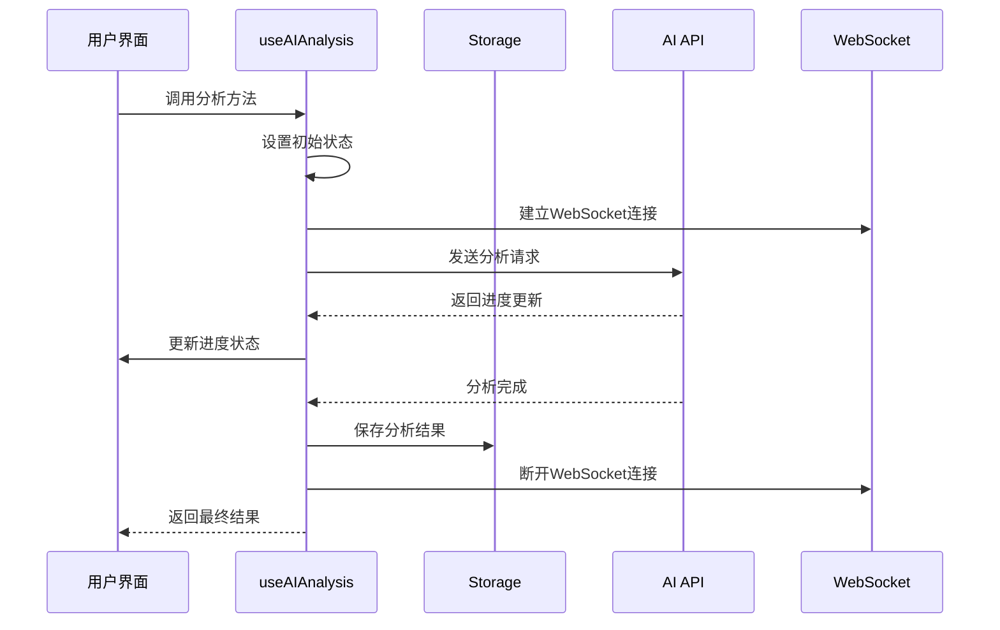

**序列图来源**
- [useAIAnalysis.js](file://frontend/src/composables/useAIAnalysis.js#L30-L92)
- [useAIAnalysis.js](file://frontend/src/composables/useAIAnalysis.js#L104-L167)
- [useAIAnalysis.js](file://frontend/src/composables/useAIAnalysis.js#L179-L237)

## 核心方法详解

### analyzeVideoContent - 视频内容分析

analyzeVideoContent方法负责对单个视频文件进行深度内容分析，返回详细的结构化报告。

#### 方法特点
- **单文件处理**：专门针对单个视频文件的分析
- **进度模拟**：使用定时器模拟分析进度，提升用户体验
- **自动保存**：分析完成后自动保存结果到本地存储
- **错误恢复**：完善的错误处理和状态重置

#### 实现细节

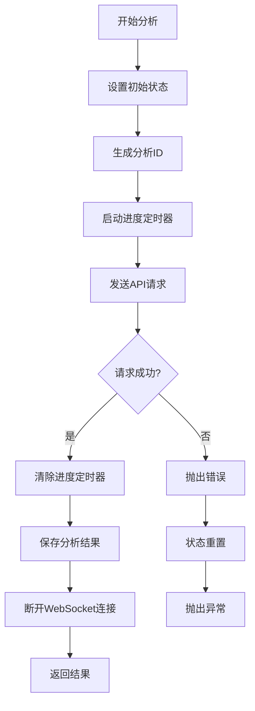

**流程图来源**
- [useAIAnalysis.js](file://frontend/src/composables/useAIAnalysis.js#L30-L92)

### analyzeVideoFusion - 视频融合分析

analyzeVideoFusion方法处理两个视频文件的融合分析，生成融合方案和制作建议。

#### 方法特点
- **双文件处理**：同时分析两个视频文件
- **复杂进度控制**：针对融合分析的特殊进度模式
- **融合方案生成**：生成详细的融合时间和转场建议
- **兼容性评估**：评估两个视频的兼容性程度

#### 进度控制策略

不同分析类型的进度更新策略：

| 分析类型 | 初始进度 | 更新间隔 | 最终进度 | 特殊处理 |
|---------|---------|---------|---------|---------|
| 内容分析 | 0% | 1000ms | 100% | 快速完成 |
| 融合分析 | 0% | 1500ms | 100% | 长时间处理 |
| 音乐生成 | 0% | 800ms | 100% | 中等时间 |

**表格来源**
- [useAIAnalysis.js](file://frontend/src/composables/useAIAnalysis.js#L44-L48)
- [useAIAnalysis.js](file://frontend/src/composables/useAIAnalysis.js#L116-L121)
- [useAIAnalysis.js](file://frontend/src/composables/useAIAnalysis.js#L190-L195)

### generateMusicPrompt - 音乐提示词生成

generateMusicPrompt方法根据融合分析结果生成背景音乐的提示词。

#### 方法特点
- **依赖分析**：基于融合分析结果生成音乐提示词
- **结构化输出**：生成包含风格、情感、节奏等要素的提示词
- **技术参数**：包含详细的音乐制作参数
- **可用性评分**：对生成的提示词进行质量评估

#### 提示词结构

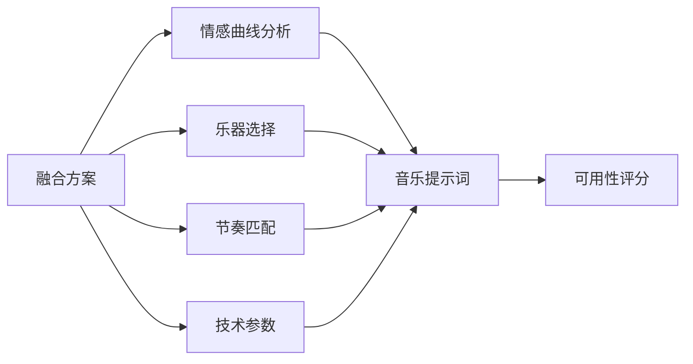

**图表来源**
- [useAIAnalysis.js](file://frontend/src/composables/useAIAnalysis.js#L179-L237)
- [analysisDataStructures.js](file://frontend/src/utils/analysisDataStructures.js#L224-L326)

### analyzeUploadedFiles - 一体化文件分析

analyzeUploadedFiles方法实现了文件上传与AI分析的一体化流程。

#### 核心功能
- **FormData构造**：动态构建上传表单数据
- **多类型支持**：支持内容分析和融合分析两种模式
- **进度模拟**：根据分析类型调整进度更新策略
- **错误处理**：完整的上传和分析错误处理

#### FormData构造策略

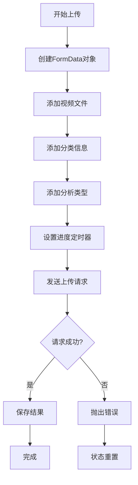

**流程图来源**
- [useAIAnalysis.js](file://frontend/src/composables/useAIAnalysis.js#L249-L298)

### buildVideoSummary - 视频摘要构建

buildVideoSummary函数是useAIAnalysis.js中新增的核心功能，负责智能合并原始分析和结构化数据源，生成统一的视频信息摘要。

#### 函数特点
- **数据源合并**：同时处理原始分析数据（rawAnalysis）和结构化数据（structuredData）
- **优先级策略**：优先使用结构化数据，原始数据作为后备
- **智能统计**：自动计算关键帧、场景、物体和动作的数量
- **数据验证**：确保所有字段都有有效值，避免undefined或null

#### 实现细节

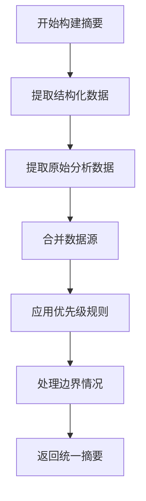

**流程图来源**
- [useAIAnalysis.js](file://frontend/src/composables/useAIAnalysis.js#L495-L524)

#### 数据合并策略

| 字段 | 优先级 | 备注 |
|------|--------|------|
| duration | structuredData > rawAnalysis | 优先使用结构化时长 |
| frameRate | structuredData > rawAnalysis | 优先使用结构化帧率 |
| resolution | structuredData > rawAnalysis | 优先使用结构化分辨率 |
| frames | structuredData > rawAnalysis | 优先使用结构化帧数 |
| keyframeCount | structuredData > rawAnalysis | 结构化数据优先，原始数据后备 |
| sceneCount | structuredData > rawAnalysis | 结构化数据优先，原始数据后备 |
| objectCount | structuredData > rawAnalysis | 结构化数据优先，原始数据后备 |
| actionCount | structuredData > rawAnalysis | 结构化数据优先，原始数据后备 |

**表格来源**
- [useAIAnalysis.js](file://frontend/src/composables/useAIAnalysis.js#L512-L521)

## 响应式状态管理

### 状态变量设计

useAIAnalysis采用了精心设计的响应式状态系统，确保UI能够实时反映分析状态的变化。

#### 核心状态变量

| 状态变量 | 类型 | 描述 | 默认值 |
|---------|------|------|--------|
| isAnalyzing | Ref\<boolean\> | 当前是否正在进行分析 | false |
| analysisProgress | Ref\<number\> | 分析进度百分比 | 0 |
| analysisResult | Ref\<any\> | 分析结果数据 | null |
| error | Ref\<string\> | 错误信息 | null |

**表格来源**
- [useAIAnalysis.js](file://frontend/src/composables/useAIAnalysis.js#L16-L19)

### 状态生命周期

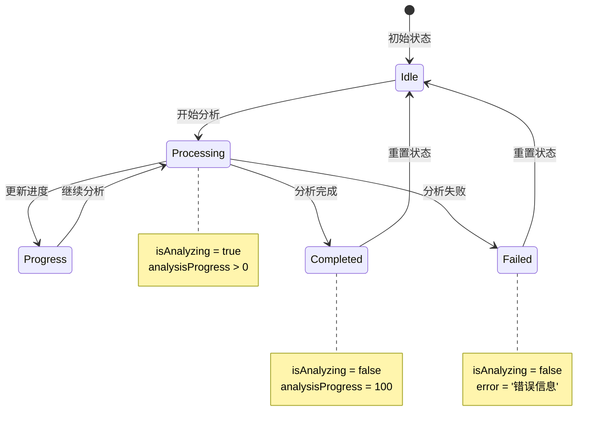

**状态图来源**
- [useAIAnalysis.js](file://frontend/src/composables/useAIAnalysis.js#L30-L92)
- [useAIAnalysis.js](file://frontend/src/composables/useAIAnalysis.js#L104-L167)

### 状态更新机制

每个分析方法都遵循统一的状态更新模式：

1. **初始化阶段**：设置初始状态，清除之前的分析结果
2. **执行阶段**：启动WebSocket连接，开始进度监控
3. **执行中阶段**：定期更新进度，处理中间状态
4. **完成阶段**：保存结果，断开连接，重置状态
5. **错误阶段**：捕获异常，设置错误状态，重置状态

**状态更新来源**
- [useAIAnalysis.js](file://frontend/src/composables/useAIAnalysis.js#L34-L38)
- [useAIAnalysis.js](file://frontend/src/composables/useAIAnalysis.js#L62-L63)
- [useAIAnalysis.js](file://frontend/src/composables/useAIAnalysis.js#L96-L98)

### formattedResult - 格式化结果计算属性

formattedResult是useAIAnalysis中的计算属性，负责将原始分析结果转换为用户友好的格式，其中包含了对`buildVideoSummary`函数的调用。

#### 核心功能
- **数据整合**：将原始分析结果、结构化数据和最终报告整合为统一格式
- **摘要生成**：调用`buildVideoSummary`函数生成视频信息摘要
- **类型区分**：根据不同分析类型提供相应的结果结构
- **错误处理**：确保在数据缺失时仍能提供有意义的默认值

#### 数据处理流程

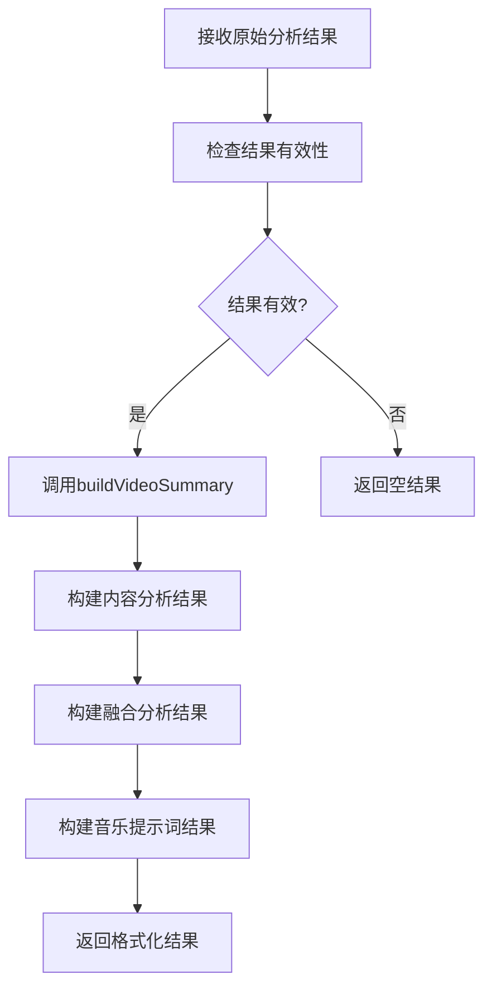

**流程图来源**
- [useAIAnalysis.js](file://frontend/src/composables/useAIAnalysis.js#L479-L548)

## 本地存储策略

### analysisStorage模块设计

analysisStorage模块提供了完整的本地存储解决方案，支持分析结果的持久化、查询和导出功能。

#### 存储架构

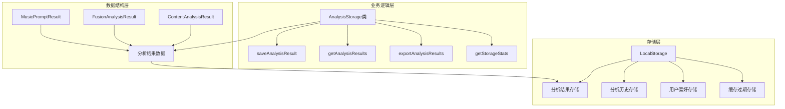

**架构图来源**
- [analysisStorage.js](file://frontend/src/utils/analysisStorage.js#L36-L534)
- [analysisDataStructures.js](file://frontend/src/utils/analysisDataStructures.js#L1-L401)

### 数据持久化策略

#### 存储配置

| 配置项 | 值 | 说明 |
|-------|-----|------|
| 默认过期时间 | 7天 | 数据自动清理周期 |
| 最大存储大小 | 50MB | 浏览器存储限制 |
| 最大记录数 | 100条 | 保存的历史记录上限 |

**表格来源**
- [analysisStorage.js](file://frontend/src/utils/analysisStorage.js#L27-L31)

#### 数据验证机制

analysisStorage提供了严格的数据验证机制，确保存储的数据符合预期结构：

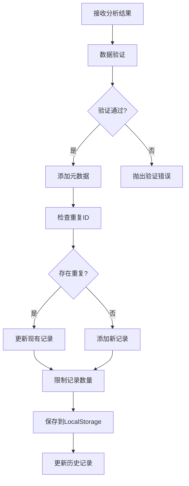

**流程图来源**
- [analysisStorage.js](file://frontend/src/utils/analysisStorage.js#L79-L118)

### 导出功能实现

analysisStorage支持多种格式的分析结果导出：

#### 支持的导出格式

| 格式 | MIME类型 | 用途 | 特点 |
|------|----------|------|------|
| JSON | application/json | 完整数据备份 | 结构化数据，易于解析 |
| CSV | text/csv | 表格数据分析 | 便于Excel等工具处理 |
| TXT | text/plain | 简单文本格式 | 易于阅读和分享 |

**表格来源**
- [analysisStorage.js](file://frontend/src/utils/analysisStorage.js#L282-L302)

## UI组件集成

### 组件层次结构

useAIAnalysis与多个UI组件紧密集成，形成了完整的分析体验链路。

#### 组件关系图

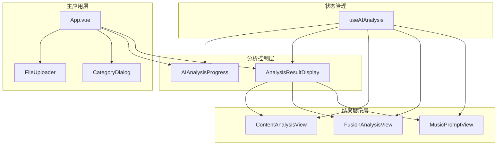

**架构图来源**
- [App.vue](file://frontend/src/App.vue#L189-L205)
- [AIAnalysisProgress.vue](file://frontend/src/components/AIAnalysisProgress.vue#L1-L748)
- [AnalysisResultDisplay.vue](file://frontend/src/components/AnalysisResultDisplay.vue#L1-L391)

### ContentAnalysisView组件集成

ContentAnalysisView专门用于展示视频内容分析结果，提供了丰富的可视化功能。

#### 核心功能特性

- **可视化图表**：时间轴分布、内容组成饼图
- **关键帧分析**：展示重要的视频时刻
- **场景分析**：详细的场景分类和描述
- **技术参数**：视频的技术指标分析

#### 数据绑定模式

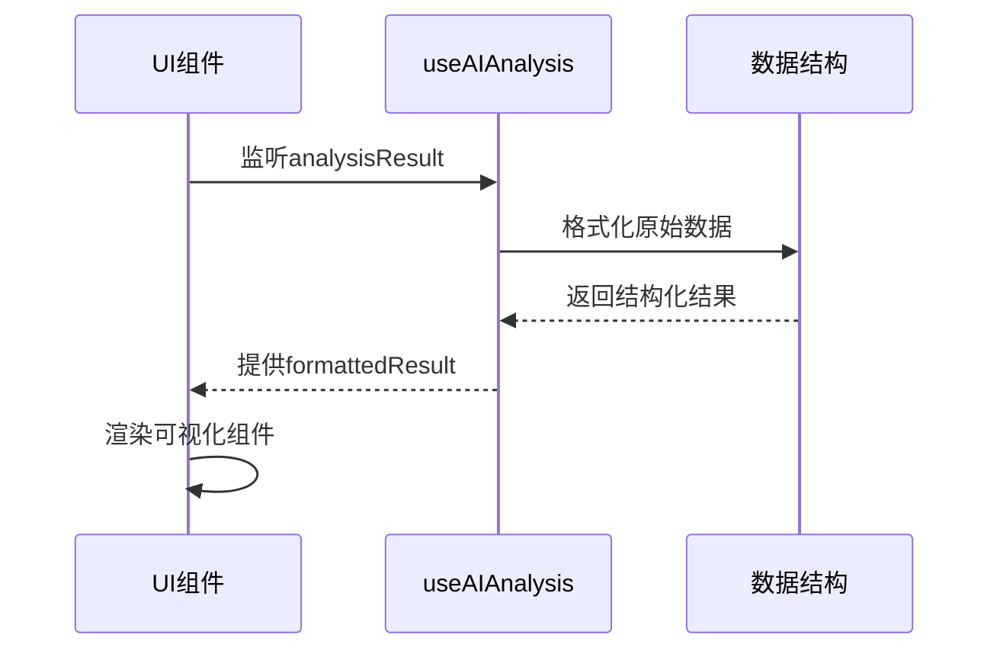

**序列图来源**
- [ContentAnalysisView.vue](file://frontend/src/components/ContentAnalysisView.vue#L228-L231)
- [useAIAnalysis.js](file://frontend/src/composables/useAIAnalysis.js#L397-L424)

### FusionAnalysisView组件集成

FusionAnalysisView展示了视频融合分析的详细方案，包括时间轴设计和制作建议。

#### 时间轴可视化

FusionAnalysisView提供了创新的时间轴可视化功能：

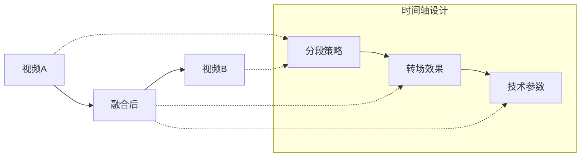

**图表来源**
- [FusionAnalysisView.vue](file://frontend/src/components/FusionAnalysisView.vue#L68-L141)

### MusicPromptView组件集成

MusicPromptView专门展示生成的音乐提示词，提供了便捷的复制和下载功能。

#### 用户交互设计

- **一键复制**：支持直接复制提示词到剪贴板
- **文件下载**：提供文本文件下载功能
- **使用说明**：详细的使用指导和最佳实践

**交互设计来源**
- [MusicPromptView.vue](file://frontend/src/components/MusicPromptView.vue#L54-L96)

## 错误处理机制

### 错误处理策略

useAIAnalysis实现了多层次的错误处理机制，确保系统的稳定性和用户体验。

#### 错误处理流程

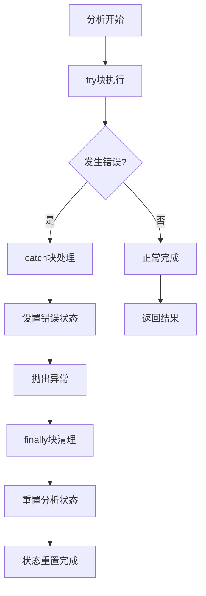

**流程图来源**
- [useAIAnalysis.js](file://frontend/src/composables/useAIAnalysis.js#L34-L98)
- [useAIAnalysis.js](file://frontend/src/composables/useAIAnalysis.js#L108-L173)

### 错误类型分类

#### API调用错误

| 错误类型 | HTTP状态码 | 处理策略 | 用户反馈 |
|---------|-----------|---------|---------|
| 网络超时 | 408 | 重试机制 | 显示网络错误提示 |
| 服务器错误 | 5xx | 重试+降级 | 显示服务器繁忙 |
| 权限错误 | 401/403 | 登录提示 | 引导重新登录 |
| 参数错误 | 400 | 参数校验 | 显示具体错误信息 |

**表格来源**
- [useAIAnalysis.js](file://frontend/src/composables/useAIAnalysis.js#L65-L67)
- [useAIAnalysis.js](file://frontend/src/composables/useAIAnalysis.js#L139-L141)
- [useAIAnalysis.js](file://frontend/src/composables/useAIAnalysis.js#L211-L213)

### finally块状态重置

finally块确保无论分析成功还是失败，都能正确重置状态：

```typescript
// 状态重置逻辑
finally {
  isAnalyzing.value = false;
  // 保持analysisProgress和analysisResult原样
  // 只有在错误状态下才设置error
}
```

**状态重置来源**
- [useAIAnalysis.js](file://frontend/src/composables/useAIAnalysis.js#L96-L98)

## 扩展开发指南

### 添加新的分析类型

要扩展useAIAnalysis以支持新的分析类型，需要遵循以下步骤：

#### 1. 在analysisDataStructures.js中定义新数据结构

```javascript
// 新增分析类型数据结构
export const NewAnalysisResult = {
  ...BaseAnalysisResult,
  type: 'new',
  result: {
    // 新分析类型特有的字段
  }
}
```

#### 2. 在useAIAnalysis.js中添加新方法

```javascript
const analyzeNewType = async (inputData) => {
  try {
    isAnalyzing.value = true;
    analysisProgress.value = 0;
    error.value = null;
    
    // 实现新分析逻辑
    const response = await fetch(`${API_BASE}/api/ai/analyze/new-type`, {
      method: 'POST',
      body: JSON.stringify(inputData)
    });
    
    if (!response.ok) {
      throw new Error(`新类型分析失败: ${response.status}`);
    }
    
    const result = await response.json();
    analysisResult.value = result.data;
    
    // 保存结果
    await saveAnalysisResult({
      ...result.data,
      inputs: inputData,
      createdAt: new Date().toISOString()
    }, 'new');
    
    return result.data;
  } catch (err) {
    error.value = err.message;
    throw err;
  } finally {
    isAnalyzing.value = false;
  }
}
```

#### 3. 在UI组件中添加新视图

```javascript
// 新的分析结果视图组件
<NewAnalysisView
  v-if="formattedResult.newAnalysis"
  :analysis="formattedResult.newAnalysis"
/>
```

### 集成其他AI服务

#### API适配器模式

```javascript
// AI服务适配器接口
class AIServiceAdapter {
  constructor(apiConfig) {
    this.apiConfig = apiConfig;
  }
  
  async analyzeContent(videoData) {
    // 实现具体的API调用逻辑
  }
  
  async analyzeFusion(video1, video2) {
    // 实现融合分析逻辑
  }
  
  formatResult(rawResult) {
    // 将原始结果转换为标准格式
  }
}
```

#### 配置管理

```javascript
// 多AI服务配置
const AI_SERVICES = {
  QWEN_VL: {
    baseUrl: 'https://api.qwenvl.com/v1',
    apiKey: import.meta.env.VITE_QWEN_API_KEY,
    timeout: 30000
  },
  CUSTOM_AI: {
    baseUrl: 'https://custom.ai.com/v2',
    apiKey: import.meta.env.VITE_CUSTOM_API_KEY,
    timeout: 60000
  }
}
```

### 性能优化建议

#### 1. 并发处理优化

```javascript
// 批量分析优化
const batchAnalyze = async (files, type) => {
  const batchSize = 3; // 每批处理3个文件
  const results = [];
  
  for (let i = 0; i < files.length; i += batchSize) {
    const batch = files.slice(i, i + batchSize);
    const batchResults = await Promise.all(
      batch.map(file => analyzeUploadedFiles([file], file.category, type))
    );
    results.push(...batchResults);
  }
  
  return results;
}
```

#### 2. 缓存策略

```javascript
// 结果缓存机制
const cachedAnalysis = new Map();

const getCachedResult = (cacheKey) => {
  const cached = cachedAnalysis.get(cacheKey);
  if (cached && Date.now() - cached.timestamp < 3600000) {
    return cached.data;
  }
  return null;
};

const setCachedResult = (cacheKey, data) => {
  cachedAnalysis.set(cacheKey, {
    data,
    timestamp: Date.now()
  });
};
```

## 总结

useAIAnalysis.js作为项目的核心AI分析引擎，展现了现代前端应用的最佳实践：

### 技术亮点

1. **组合式API设计**：充分利用Vue 3的组合式API，实现了清晰的状态管理和逻辑复用
2. **响应式状态管理**：通过Ref和Computed实现了完整的响应式状态体系
3. **模块化架构**：分离关注点，使代码具有良好的可维护性和可扩展性
4. **错误处理机制**：多层次的错误处理确保了系统的稳定性
5. **本地存储集成**：提供了完整的数据持久化解决方案

### 设计优势

- **可扩展性**：模块化设计使得添加新功能变得简单
- **用户体验**：实时进度反馈和状态管理提升了用户体验
- **数据安全**：本地存储机制保护了用户的分析数据
- **性能优化**：合理的状态管理和资源清理避免了内存泄漏

### 应用价值

该实现不仅满足了当前的业务需求，更为未来的功能扩展奠定了坚实的基础。通过标准化的数据结构和清晰的接口设计，开发者可以轻松地添加新的分析类型或集成其他AI服务，真正实现了"一次开发，多次利用"的设计理念。