# 实时通信

<cite>
**本文档引用的文件**
- [useWebSocket.js](file://frontend/src/composables/useWebSocket.js)
- [FileUploader.vue](file://frontend/src/components/FileUploader.vue)
- [ProgressBar.vue](file://frontend/src/components/ProgressBar.vue)
- [AIAnalysisProgress.vue](file://frontend/src/components/AIAnalysisProgress.vue)
- [app.js](file://backend/src/app.js)
- [uploadService.js](file://backend/src/services/uploadService.js)
- [uploadController.js](file://backend/src/controllers/uploadController.js)
- [websocket.md](file://specs/001-responsive-h5-upload/contracts/websocket.md)
</cite>

## 目录
1. [简介](#简介)
2. [项目架构概览](#项目架构概览)
3. [WebSocket连接机制](#websocket连接机制)
4. [会话管理与生命周期](#会话管理与生命周期)
5. [进度监听与状态同步](#进度监听与状态同步)
6. [降级策略与错误处理](#降级策略与错误处理)
7. [前端组件集成](#前端组件集成)
8. [性能优化与最佳实践](#性能优化与最佳实践)
9. [故障排除指南](#故障排除指南)
10. [总结](#总结)

## 简介

本文档全面解析了基于Socket.IO的实时通信系统，该系统实现了前端与后端之间的高效实时数据交换。系统采用WebSocket作为主要通信协议，同时具备HTTP轮询作为降级方案，确保在网络条件不佳时仍能提供可靠的进度反馈。

核心特性包括：
- 实时文件上传进度监控
- 自动重连机制
- 会话生命周期管理
- 多种传输协议支持
- 完善的错误处理和降级策略

## 项目架构概览

系统采用前后端分离架构，前端使用Vue 3组合式API，后端基于Express.js和Socket.IO构建。

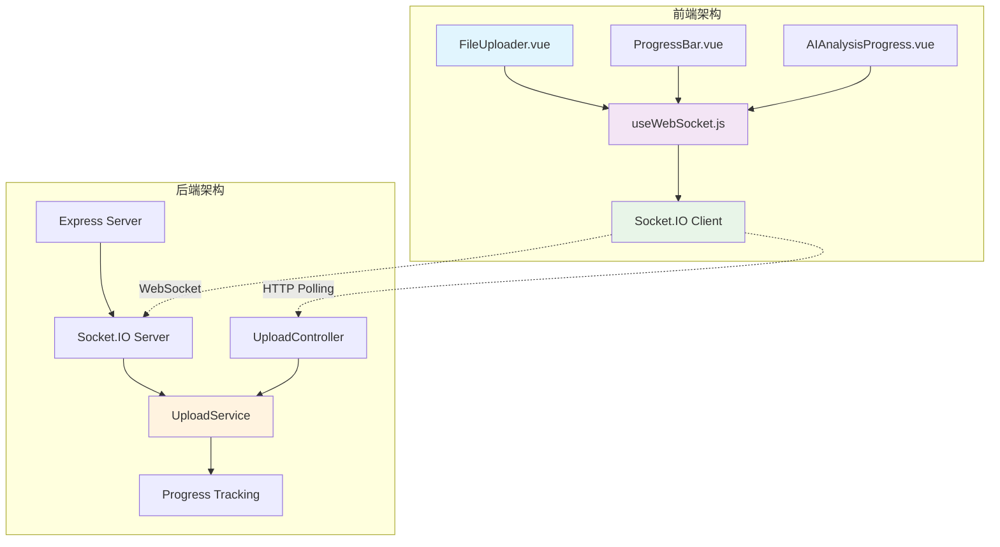

**图表来源**
- [useWebSocket.js](file://frontend/src/composables/useWebSocket.js#L1-L139)
- [app.js](file://backend/src/app.js#L113-L130)
- [uploadService.js](file://backend/src/services/uploadService.js#L1-L50)

**章节来源**
- [useWebSocket.js](file://frontend/src/composables/useWebSocket.js#L1-L139)
- [app.js](file://backend/src/app.js#L1-L166)

## WebSocket连接机制

### connect方法详解

`connect`方法是WebSocket连接的核心入口，负责建立与服务器的持久连接并配置各种连接参数。

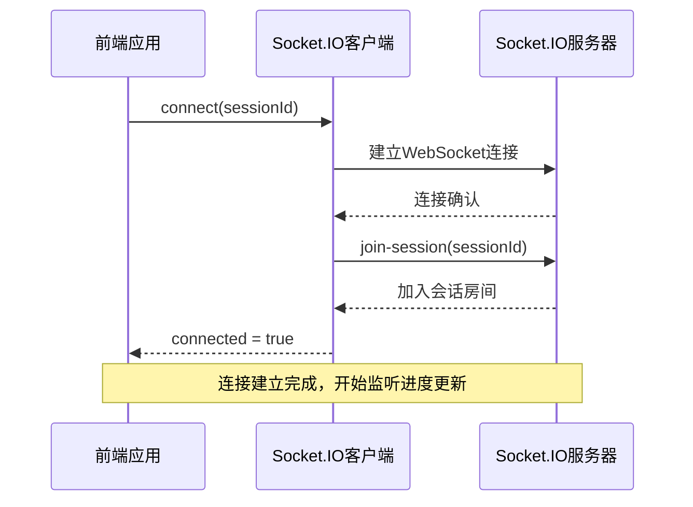

**图表来源**
- [useWebSocket.js](file://frontend/src/composables/useWebSocket.js#L22-L69)

### 连接配置参数

系统采用以下关键配置参数确保连接的可靠性和性能：

| 参数 | 值 | 说明 |
|------|-----|------|
| `transports` | `['websocket', 'polling']` | 支持WebSocket和HTTP轮询两种传输方式 |
| `forceNew` | `true` | 强制创建新的连接实例 |
| `timeout` | `5000ms` | 连接超时时间为5秒 |
| `reconnection` | `true` | 启用自动重连功能 |
| `reconnectionAttempts` | `3` | 最大重连尝试次数为3次 |
| `reconnectionDelay` | `1000ms` | 重连间隔为1秒 |

### 传输协议降级机制

系统支持多种传输协议，优先使用WebSocket，当WebSocket不可用时自动降级到HTTP轮询：

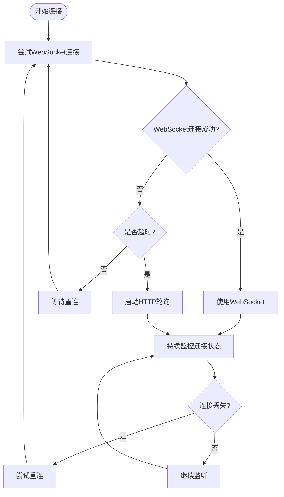

**图表来源**
- [useWebSocket.js](file://frontend/src/composables/useWebSocket.js#L22-L104)

**章节来源**
- [useWebSocket.js](file://frontend/src/composables/useWebSocket.js#L22-L104)

## 会话管理与生命周期

### join-session事件处理

`join-session`事件是会话管理的核心机制，负责将客户端加入特定的会话房间，确保只有相关客户端能接收该会话的进度更新。

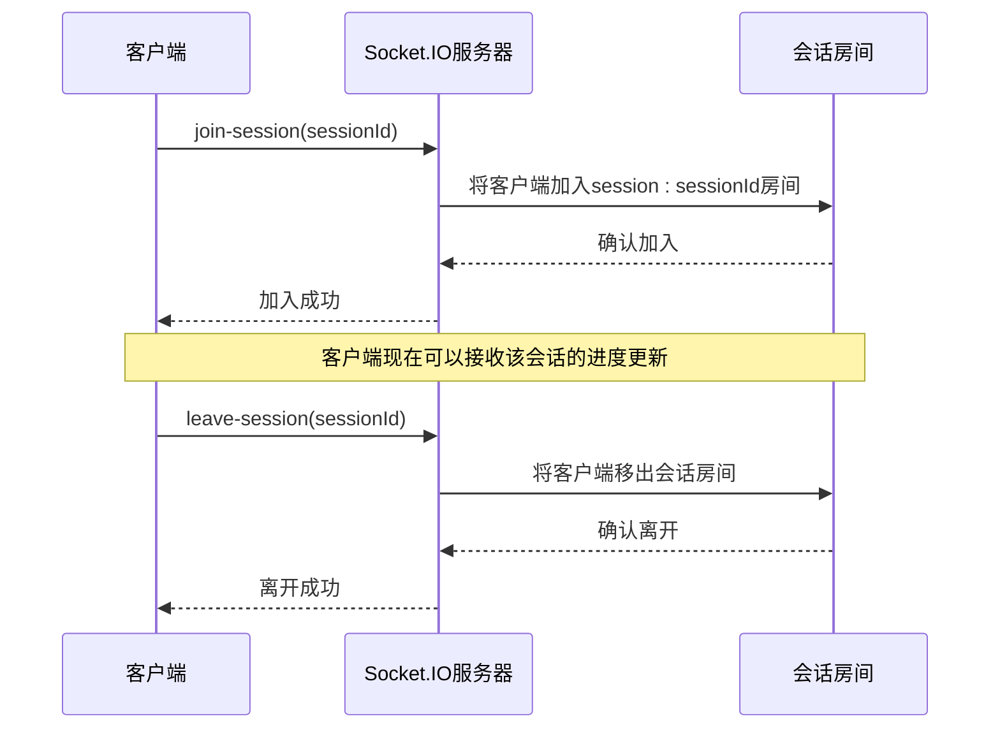

**图表来源**
- [app.js](file://backend/src/app.js#L117-L124)
- [useWebSocket.js](file://frontend/src/composables/useWebSocket.js#L39-L45)

### 会话状态管理

后端使用内存映射表维护所有活跃会话的状态：

| 状态字段 | 类型 | 描述 |
|----------|------|------|
| `sessionId` | String | 唯一会话标识符 |
| `category` | String | 文件分类（personal/scenic） |
| `overallStatus` | String | 整体状态（pending/uploading/completed/partial/cancelled） |
| `totalProgress` | Number | 总体进度百分比（0-100） |
| `completedFiles` | Number | 已完成文件数量 |
| `failedFiles` | Number | 失败文件数量 |
| `files` | Array | 文件信息数组 |
| `sessionStartTime` | Date | 会话开始时间 |
| `sessionEndTime` | Date | 会话结束时间 |

### 生命周期事件处理

系统实现了完整的会话生命周期管理：

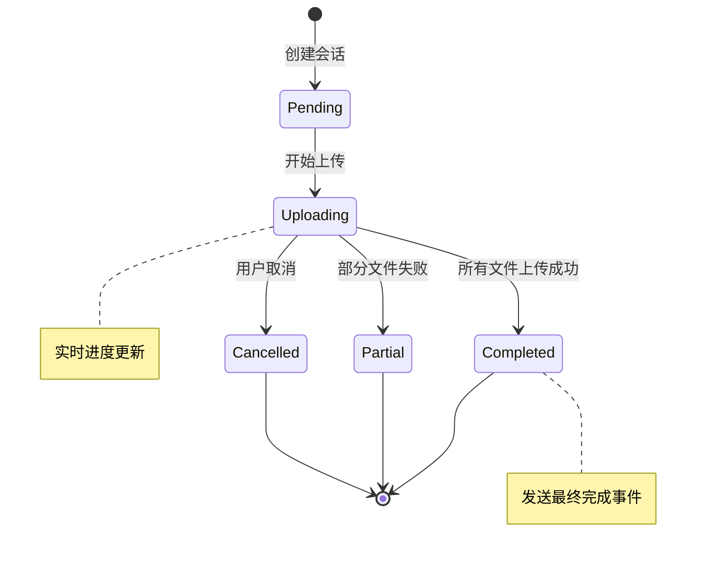

**图表来源**
- [uploadService.js](file://backend/src/services/uploadService.js#L89-L115)
- [uploadService.js](file://backend/src/services/uploadService.js#L282-L293)

**章节来源**
- [app.js](file://backend/src/app.js#L114-L130)
- [uploadService.js](file://backend/src/services/uploadService.js#L89-L115)

## 进度监听与状态同步

### upload-progress事件监听机制

`upload-progress`事件是实时通信的核心，负责向客户端推送文件上传进度信息。该事件包含丰富的进度数据，支持精确的状态跟踪。

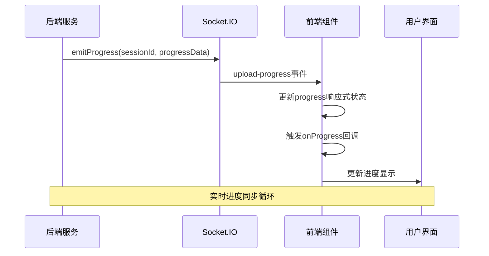

**图表来源**
- [uploadService.js](file://backend/src/services/uploadService.js#L23-L31)
- [useWebSocket.js](file://frontend/src/composables/useWebSocket.js#L52-L79)

### 进度数据结构

`upload-progress`事件传递的进度数据包含以下关键字段：

| 字段名 | 类型 | 描述 |
|--------|------|------|
| `sessionId` | String | 会话标识符 |
| `overallStatus` | String | 整体状态（pending/uploading/completed） |
| `totalProgress` | Number | 总体进度百分比（0-100） |
| `completedFiles` | Number | 已完成文件数量 |
| `failedFiles` | Number | 失败文件数量 |
| `currentFile` | Object | 当前处理文件的详细信息 |
| `message` | String | 状态消息 |

### 响应式状态同步

前端通过Vue的响应式系统实现进度数据的自动更新：

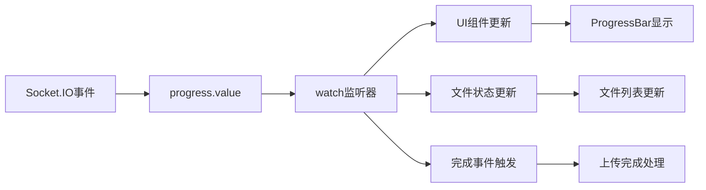

**图表来源**
- [useWebSocket.js](file://frontend/src/composables/useWebSocket.js#L52-L79)
- [ProgressBar.vue](file://frontend/src/components/ProgressBar.vue#L199-L228)

### onProgress回调机制

系统提供了灵活的回调机制，允许上层组件自定义进度处理逻辑：

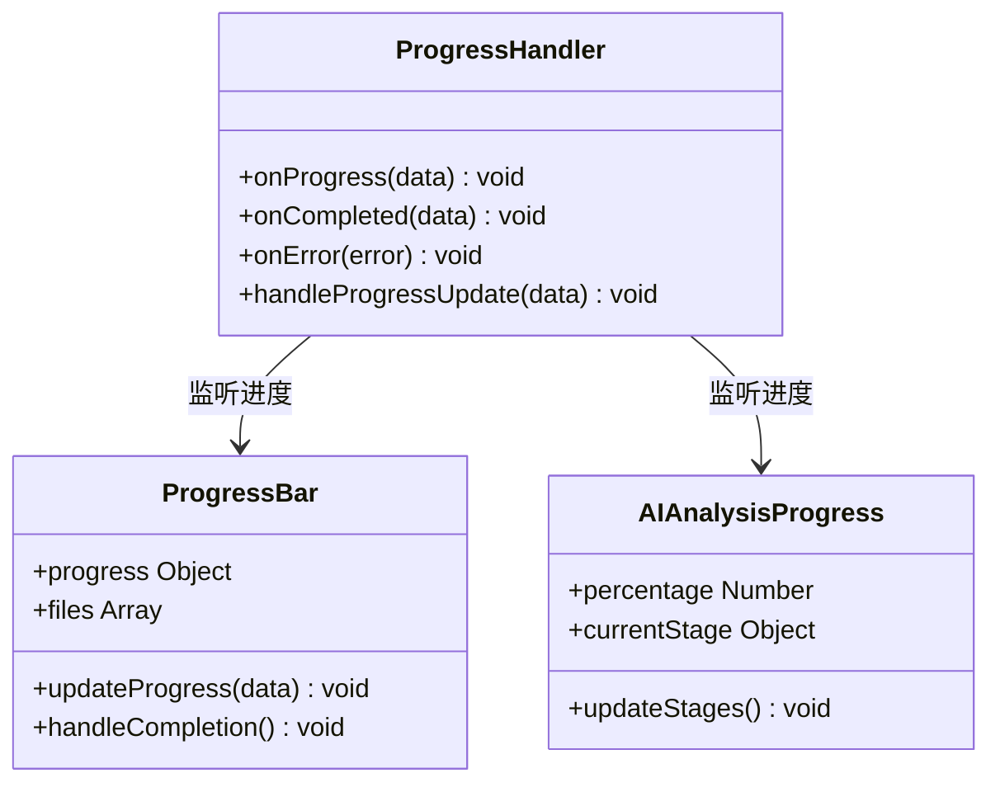

**图表来源**
- [useWebSocket.js](file://frontend/src/composables/useWebSocket.js#L17-L19)
- [ProgressBar.vue](file://frontend/src/components/ProgressBar.vue#L178-L198)

**章节来源**
- [useWebSocket.js](file://frontend/src/composables/useWebSocket.js#L52-L79)
- [uploadService.js](file://backend/src/services/uploadService.js#L23-L31)

## 降级策略与错误处理

### 连接失败处理

当WebSocket连接失败时，系统采用多层次的降级策略确保用户体验：

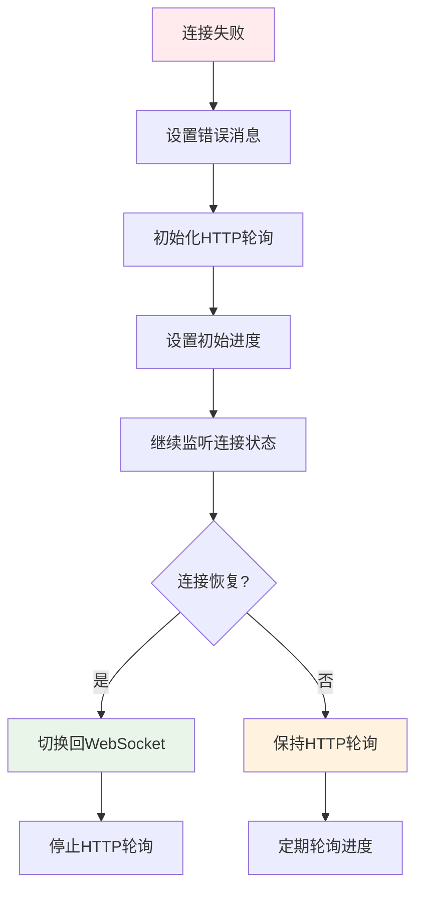

**图表来源**
- [useWebSocket.js](file://frontend/src/composables/useWebSocket.js#L89-L95)
- [ProgressBar.vue](file://frontend/src/components/ProgressBar.vue#L118-L152)

### 超时处理机制

系统实现了双重超时保护：

1. **连接超时**：3秒内未建立连接时启动HTTP轮询
2. **进度超时**：长时间无进度更新时显示警告

### HTTP轮询降级方案

当WebSocket不可用时，系统自动切换到HTTP轮询模式：

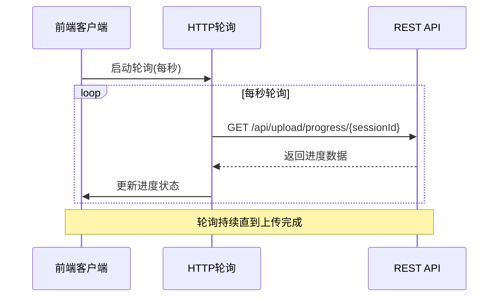

**图表来源**
- [ProgressBar.vue](file://frontend/src/components/ProgressBar.vue#L118-L152)

### 错误恢复策略

系统采用渐进式错误恢复机制：

| 错误类型 | 恢复策略 | 重试次数 | 重试间隔 |
|----------|----------|----------|----------|
| 连接超时 | 启动HTTP轮询 | 无限制 | 1秒 |
| 连接断开 | 自动重连 | 3次 | 1秒 |
| 进度更新失败 | 本地缓存 | 无限制 | 1秒 |
| 服务器错误 | 降级处理 | 无限制 | 1秒 |

**章节来源**
- [useWebSocket.js](file://frontend/src/composables/useWebSocket.js#L89-L104)
- [ProgressBar.vue](file://frontend/src/components/ProgressBar.vue#L118-L152)

## 前端组件集成

### FileUploader.vue集成

FileUploader组件通过useWebSocket组合式函数实现与后端的实时通信：

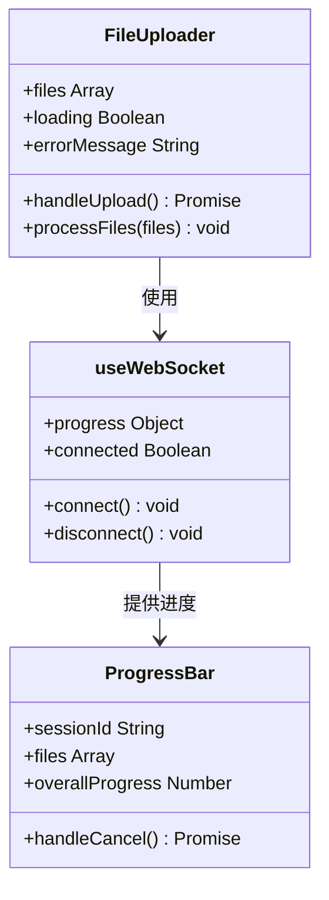

**图表来源**
- [FileUploader.vue](file://frontend/src/components/FileUploader.vue#L78-L304)
- [useWebSocket.js](file://frontend/src/composables/useWebSocket.js#L4-L139)

### ProgressBar.vue状态管理

ProgressBar组件负责显示上传进度和文件状态：

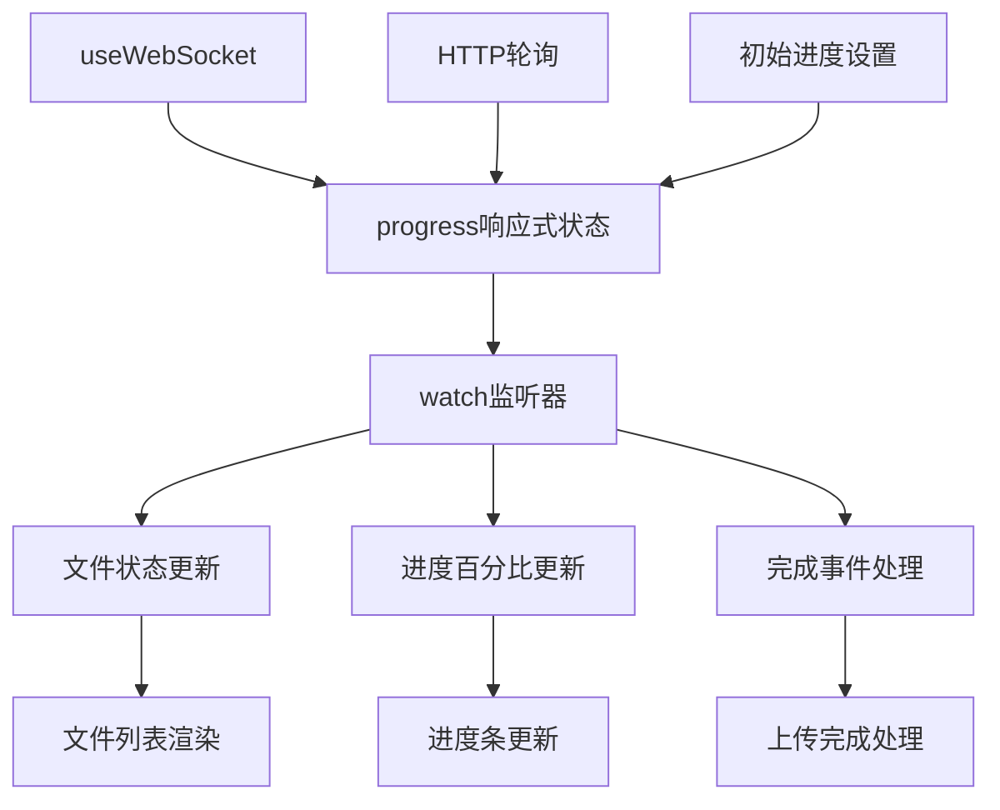

**图表来源**
- [ProgressBar.vue](file://frontend/src/components/ProgressBar.vue#L178-L228)

### AIAnalysisProgress.vue集成

AIAnalysisProgress组件展示了如何消费progress状态实现复杂的进度可视化：

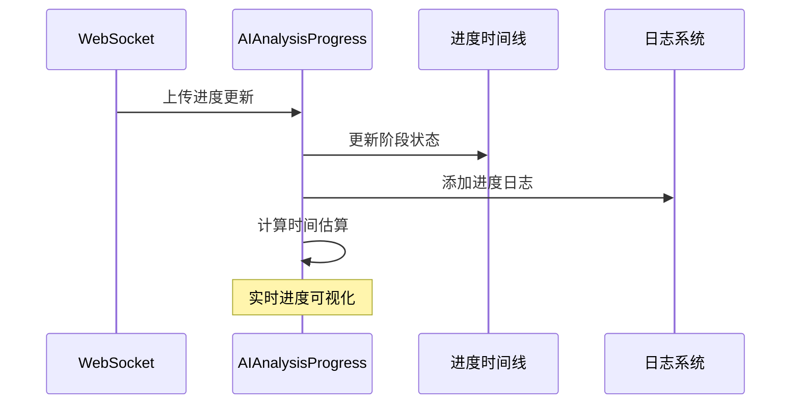

**图表来源**
- [AIAnalysisProgress.vue](file://frontend/src/components/AIAnalysisProgress.vue#L346-L362)

### 组件间通信模式

系统采用事件驱动的组件通信模式：

| 通信方向 | 数据流向 | 实现方式 |
|----------|----------|----------|
| 上游 | 后端 → 前端 | Socket.IO事件 |
| 下游 | 前端 → 后端 | HTTP请求 |
| 广播 | 服务器 → 客户端 | 房间消息 |
| 点对点 | 客户端 → 服务器 | 会话事件 |

**章节来源**
- [FileUploader.vue](file://frontend/src/components/FileUploader.vue#L78-L304)
- [ProgressBar.vue](file://frontend/src/components/ProgressBar.vue#L114-L198)
- [AIAnalysisProgress.vue](file://frontend/src/components/AIAnalysisProgress.vue#L346-L362)

## 性能优化与最佳实践

### 连接池管理

系统采用连接池模式优化资源使用：

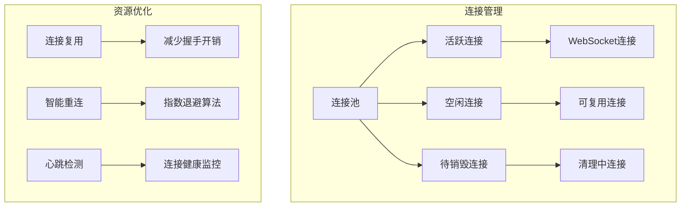

### 内存管理策略

系统实现了完善的内存管理机制：

| 策略 | 实现方式 | 效果 |
|------|----------|------|
| 会话清理 | 定期扫描过期会话 | 防止内存泄漏 |
| 进度缓存 | 限制历史进度记录 | 控制内存使用 |
| 事件监听器 | 自动清理监听器 | 避免内存泄漏 |
| 连接复用 | 复用连接实例 | 减少资源消耗 |

### 性能监控指标

系统监控以下关键性能指标：

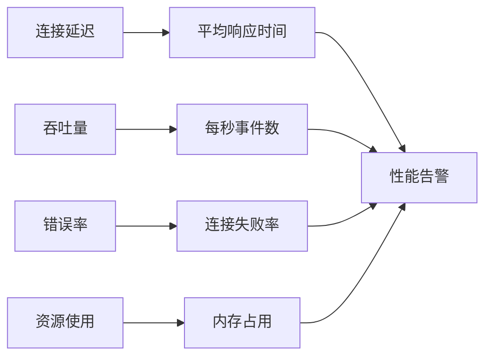

### 最佳实践建议

1. **连接管理**
   - 始终在组件卸载时调用disconnect()
   - 合理设置重连参数
   - 监控连接状态变化

2. **错误处理**
   - 实现优雅降级
   - 提供用户友好的错误提示
   - 记录详细的错误日志

3. **性能优化**
   - 使用响应式状态管理
   - 避免不必要的DOM更新
   - 实现适当的节流和防抖

4. **安全性**
   - 验证会话ID合法性
   - 限制连接频率
   - 实施适当的认证机制

**章节来源**
- [useWebSocket.js](file://frontend/src/composables/useWebSocket.js#L107-L117)
- [uploadService.js](file://backend/src/services/uploadService.js#L393-L416)

## 故障排除指南

### 常见问题诊断

#### 连接问题

| 问题症状 | 可能原因 | 解决方案 |
|----------|----------|----------|
| 无法建立连接 | 网络防火墙阻止 | 检查网络配置，允许WebSocket端口 |
| 连接频繁断开 | 网络不稳定 | 启用自动重连机制 |
| 进度更新延迟 | 服务器负载过高 | 优化服务器性能，增加监控 |
| 会话ID无效 | 会话已过期 | 重新创建会话 |

#### 性能问题

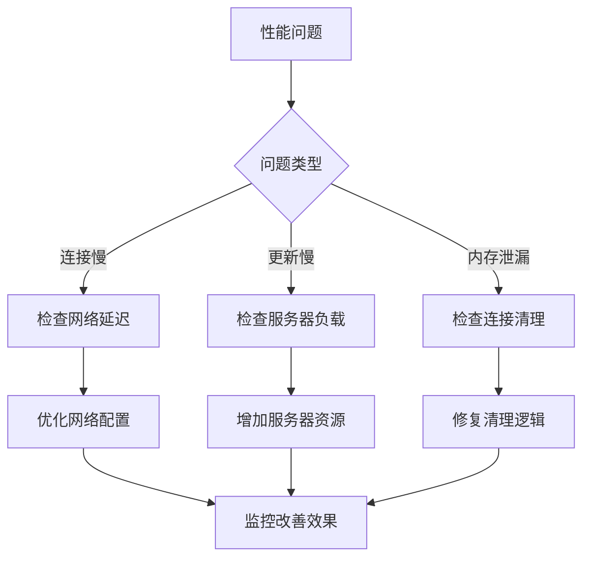

### 调试工具和技巧

1. **浏览器开发者工具**
   - Network面板监控WebSocket连接
   - Console面板查看错误信息
   - Application面板检查存储状态

2. **后端日志分析**
   - 启用详细日志记录
   - 监控连接统计信息
   - 分析错误模式

3. **性能监控**
   - 监控连接成功率
   - 跟踪响应时间分布
   - 分析资源使用情况

### 故障恢复程序

当系统出现故障时，按照以下步骤进行恢复：

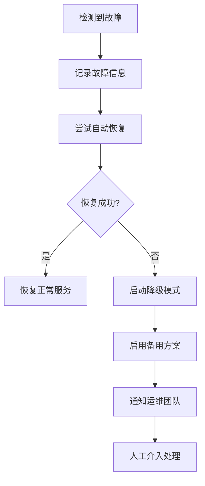

**章节来源**
- [useWebSocket.js](file://frontend/src/composables/useWebSocket.js#L89-L104)
- [uploadService.js](file://backend/src/services/uploadService.js#L393-L416)

## 总结

本文档详细解析了基于Socket.IO的实时通信系统，涵盖了从连接建立到错误处理的完整生命周期。系统通过以下关键特性确保了高可靠性和优秀的用户体验：

### 核心优势

1. **实时性**：基于WebSocket的低延迟通信
2. **可靠性**：多重降级策略确保服务连续性
3. **可扩展性**：模块化设计支持功能扩展
4. **易维护性**：清晰的架构和完善的错误处理

### 技术亮点

- **智能重连机制**：自动处理网络波动和服务器重启
- **会话生命周期管理**：完整的会话状态跟踪
- **响应式状态同步**：Vue响应式系统确保UI实时更新
- **优雅降级**：HTTP轮询作为WebSocket的完美补充

### 应用场景

该实时通信系统特别适用于：
- 大文件上传进度监控
- 实时数据分析展示
- 多用户协作应用
- 实时通知系统

通过合理的架构设计和完善的错误处理机制，该系统为构建高质量的实时Web应用提供了坚实的基础。开发者可以根据具体需求，在现有框架基础上进行功能扩展和性能优化。