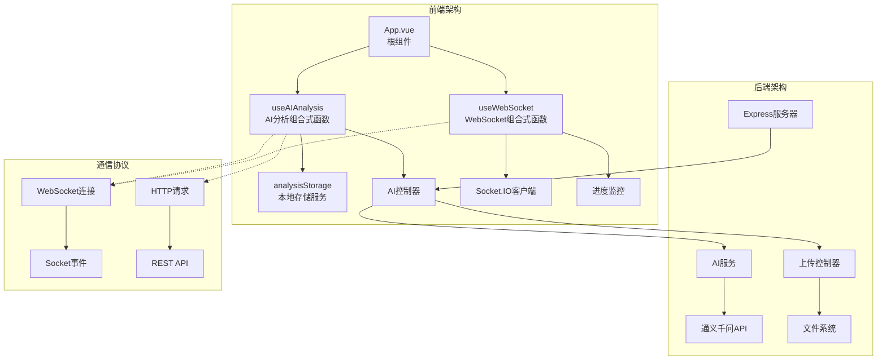
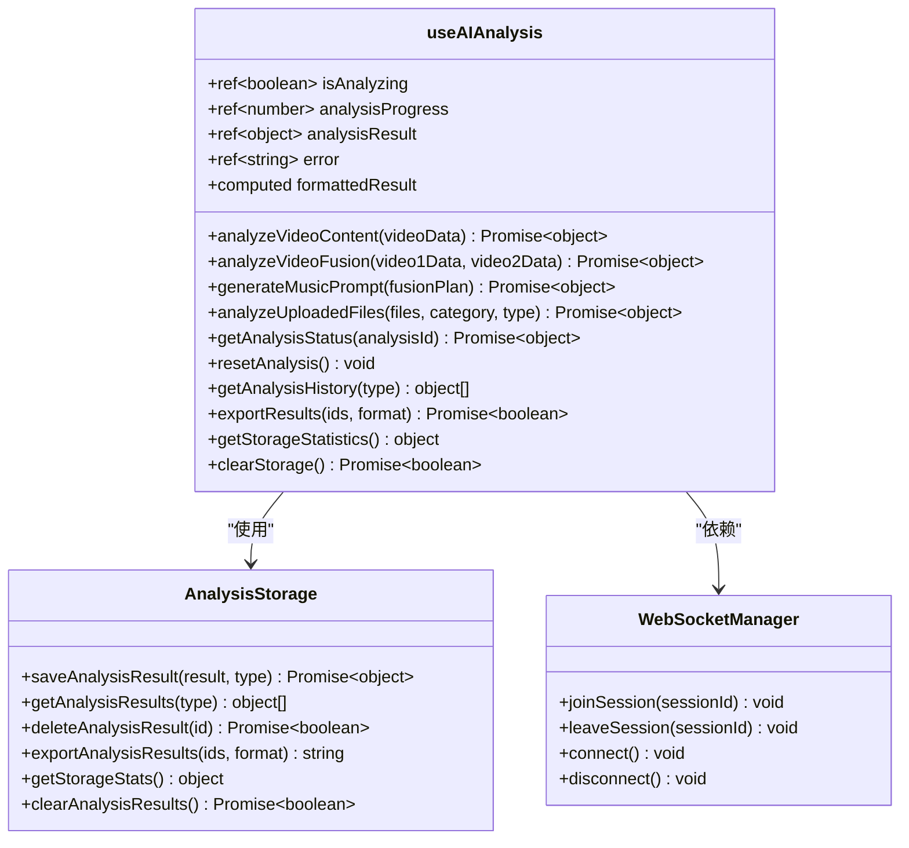
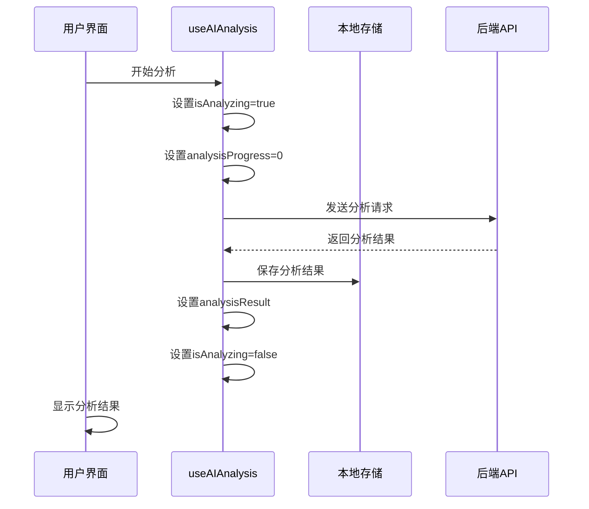
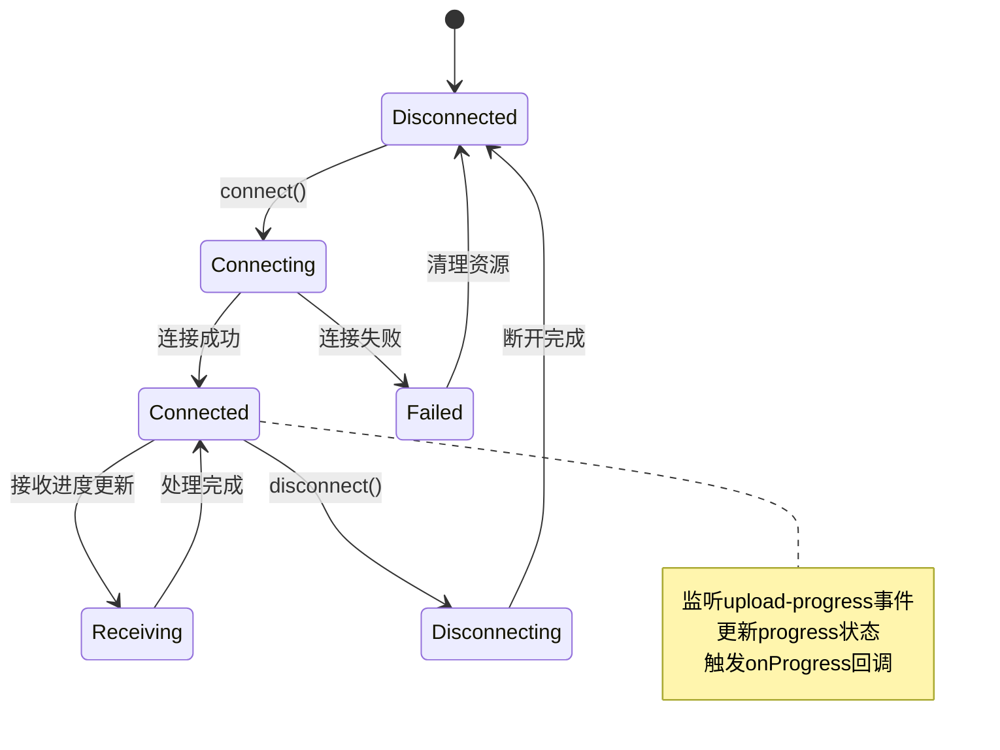
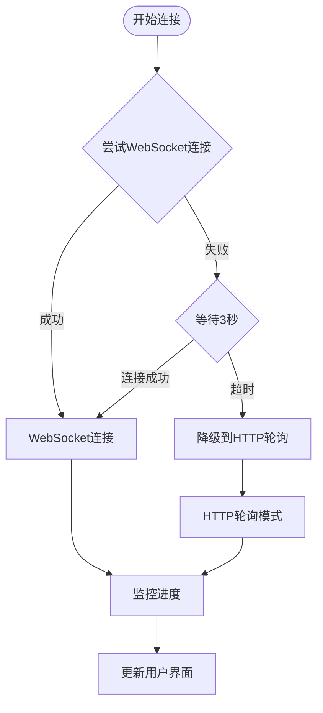
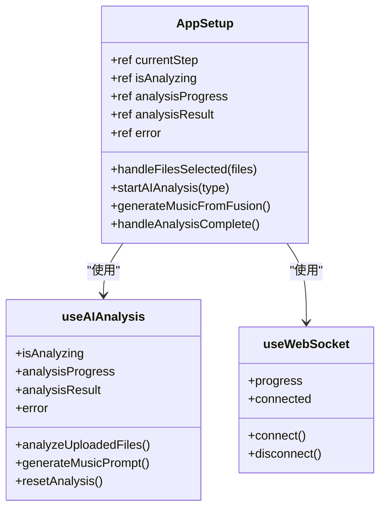
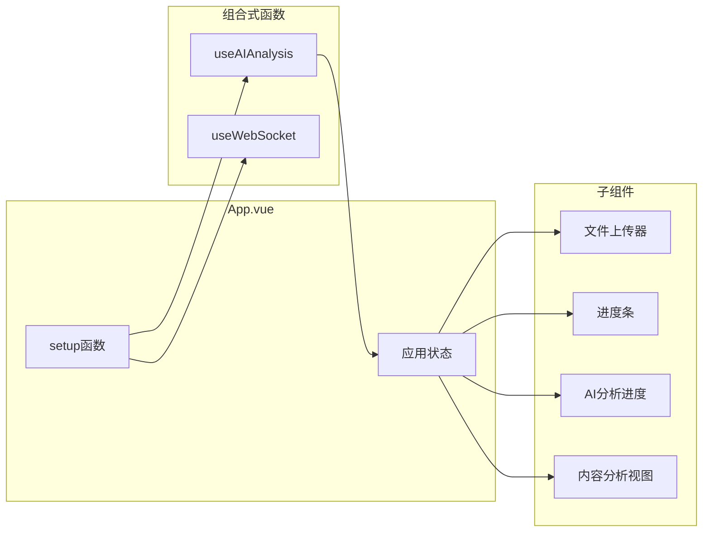
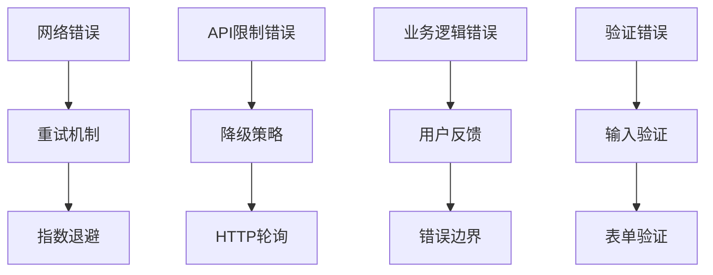

# Vue 3组合式函数详解：useAIAnalysis与useWebSocket的实际应用

<cite>
**本文档引用的文件**
- [useAIAnalysis.js](file://frontend/src/composables/useAIAnalysis.js)
- [useWebSocket.js](file://frontend/src/composables/useWebSocket.js)
- [App.vue](file://frontend/src/App.vue)
- [AIAnalysisProgress.vue](file://frontend/src/components/AIAnalysisProgress.vue)
- [ProgressBar.vue](file://frontend/src/components/ProgressBar.vue)
- [aiController.js](file://backend/src/controllers/aiController.js)
- [aiService.js](file://backend/src/services/aiService.js)
- [analysisStorage.js](file://frontend/src/utils/analysisStorage.js)
- [ai.js](file://backend/src/routes/ai.js)
- [upload.js](file://backend/src/routes/upload.js)
</cite>

## 目录
1. [项目概述](#项目概述)
2. [组合式函数架构](#组合式函数架构)
3. [useAIAnalysis.js深度解析](#useaianalysisjs深度解析)
4. [useWebSocket.js深度解析](#usewebsocketjs深度解析)
5. [组件集成与状态管理](#组件集成与状态管理)
6. [错误处理与异步流程控制](#错误处理与异步流程控制)
7. [性能优化与最佳实践](#性能优化与最佳实践)
8. [扩展开发指南](#扩展开发指南)
9. [总结](#总结)

## 项目概述

本项目是一个基于Vue 3的视频分析平台，展示了现代前端开发中组合式API的强大功能。项目通过两个核心组合式函数`useAIAnalysis`和`useWebSocket`，实现了复杂的AI视频分析流程，包括视频上传、内容分析、融合分析和音乐提示词生成等功能。

### 核心特性

- **响应式状态管理**：使用Vue 3的响应式系统管理复杂的分析状态
- **实时进度监控**：通过WebSocket实现实时上传和分析进度更新
- **AI分析能力**：集成阿里云通义千问API进行视频内容理解和分析
- **本地存储**：提供分析结果的持久化存储和管理
- **错误恢复**：完善的错误处理和重试机制

## 组合式函数架构



**图表来源**
- [App.vue](file://frontend/src/App.vue#L183-L520)
- [useAIAnalysis.js](file://frontend/src/composables/useAIAnalysis.js#L1-L448)
- [useWebSocket.js](file://frontend/src/composables/useWebSocket.js#L1-L139)

## useAIAnalysis.js深度解析

### 核心功能模块

`useAIAnalysis`是项目的核心组合式函数，负责封装所有的AI分析逻辑，包括视频内容分析、融合分析和音乐提示词生成。

#### 状态管理架构



**图表来源**
- [useAIAnalysis.js](file://frontend/src/composables/useAIAnalysis.js#L14-L448)
- [analysisStorage.js](file://frontend/src/utils/analysisStorage.js#L36-L534)

#### analyzeUploadedFiles方法详解

这是项目中最复杂的分析方法，展示了组合式函数如何处理异步流程和状态管理：

**关键实现要点**：
1. **状态初始化**：在分析开始前重置所有相关状态
2. **会话管理**：为每次分析创建唯一的会话ID
3. **进度模拟**：根据分析类型设置不同的进度更新间隔
4. **错误处理**：完整的try-catch-finally结构确保状态一致性
5. **结果保存**：自动将分析结果保存到本地存储

**节源**
- [useAIAnalysis.js](file://frontend/src/composables/useAIAnalysis.js#L249-L298)

#### generateMusicPrompt方法详解

音乐提示词生成功能展示了如何将复杂的AI分析结果转化为具体的音乐创作指导：

**核心流程**：
1. **输入验证**：确保融合方案数据完整
2. **会话创建**：建立专门的音乐生成会话
3. **进度跟踪**：设置适合音乐生成的进度更新频率
4. **API调用**：向后端发送融合方案生成音乐提示词
5. **结果处理**：将生成的提示词与原始数据关联

**节源**
- [useAIAnalysis.js](file://frontend/src/composables/useAIAnalysis.js#L179-L238)

#### 分析状态响应式管理



**图表来源**
- [useAIAnalysis.js](file://frontend/src/composables/useAIAnalysis.js#L30-L98)
- [useAIAnalysis.js](file://frontend/src/composables/useAIAnalysis.js#L101-L173)

**节源**
- [useAIAnalysis.js](file://frontend/src/composables/useAIAnalysis.js#L394-L447)

## useWebSocket.js深度解析

### WebSocket连接管理

`useWebSocket`提供了完整的WebSocket连接管理功能，支持实时进度更新和错误恢复。

#### 连接生命周期管理



**图表来源**
- [useWebSocket.js](file://frontend/src/composables/useWebSocket.js#L22-L105)

#### 进度事件处理机制

WebSocket连接不仅用于实时进度更新，还提供了完整的事件驱动架构：

**核心事件处理**：
1. **upload-progress**：接收上传进度更新
2. **connect**：连接建立成功
3. **disconnect**：连接断开
4. **error**：连接错误
5. **connect_error**：连接失败

**节源**
- [useWebSocket.js](file://frontend/src/composables/useWebSocket.js#L52-L87)

#### HTTP轮询作为备用方案

当WebSocket连接失败时，系统自动降级到HTTP轮询模式：



**图表来源**
- [useWebSocket.js](file://frontend/src/composables/useWebSocket.js#L97-L104)
- [ProgressBar.vue](file://frontend/src/components/ProgressBar.vue#L117-L164)

**节源**
- [useWebSocket.js](file://frontend/src/composables/useWebSocket.js#L117-L139)

## 组件集成与状态管理

### App.vue中的组合式函数调用

在根组件App.vue中，组合式函数通过setup()函数被正确集成：

#### 状态绑定与方法暴露



**图表来源**
- [App.vue](file://frontend/src/App.vue#L207-L519)

#### 状态同步机制

组件间的状态同步通过Vue的响应式系统实现：

**关键同步点**：
1. **分析状态同步**：App.vue中的`isAnalyzing`与useAIAnalysis的状态同步
2. **进度更新同步**：`analysisProgress`在多个组件间共享
3. **错误状态同步**：全局错误状态的传播
4. **结果状态同步**：分析结果在不同视图间的传递

**节源**
- [App.vue](file://frontend/src/App.vue#L223-L233)

### 组件状态集成模式



**图表来源**
- [App.vue](file://frontend/src/App.vue#L183-L206)

**节源**
- [App.vue](file://frontend/src/App.vue#L370-L420)

## 错误处理与异步流程控制

### 多层错误处理架构

项目实现了完整的错误处理体系，涵盖网络错误、API错误和业务逻辑错误：

#### 错误处理层次



**图表来源**
- [useAIAnalysis.js](file://frontend/src/composables/useAIAnalysis.js#L93-L95)
- [aiService.js](file://backend/src/services/aiService.js#L614-L669)

#### 异步流程控制

**analyzeUploadedFiles方法的异步流程**：

1. **状态初始化阶段**：设置初始状态，准备分析环境
2. **会话建立阶段**：创建分析会话，建立WebSocket连接
3. **文件上传阶段**：处理文件上传，监控上传进度
4. **API调用阶段**：发送分析请求，等待后端处理
5. **结果处理阶段**：解析分析结果，更新本地存储
6. **清理阶段**：断开会话连接，重置状态

**节源**
- [useAIAnalysis.js](file://frontend/src/composables/useAIAnalysis.js#L249-L298)

#### 重试机制实现

AI服务采用了基于Qwen官方推荐的指数退避重试策略：

**重试配置**：
- 最大重试次数：3次
- 退避策略：wait_time = 2^attempt 秒
- 测试环境：立即重试（延迟1秒）
- 生产环境：指数增长延迟

**节源**
- [aiService.js](file://backend/src/services/aiService.js#L614-L669)

## 性能优化与最佳实践

### 响应式性能优化

#### 计算属性缓存

项目大量使用了Vue的计算属性来优化性能：

**优化策略**：
1. **formattedResult计算属性**：延迟计算格式化结果
2. **进度计算属性**：避免重复计算进度值
3. **状态过滤**：只在需要时计算复杂状态

**节源**
- [useAIAnalysis.js](file://frontend/src/composables/useAIAnalysis.js#L397-L424)

#### 组件懒加载

对于大型分析组件，采用懒加载策略减少初始包大小：

**懒加载组件**：
- ContentAnalysisView：内容分析结果展示
- FusionAnalysisView：融合分析结果展示  
- MusicPromptView：音乐提示词展示

#### 内存管理

**垃圾回收优化**：
1. **定时器清理**：及时清理不再需要的定时器
2. **事件监听器清理**：组件卸载时移除事件监听
3. **WebSocket连接管理**：自动断开不需要的连接

**节源**
- [useWebSocket.js](file://frontend/src/composables/useWebSocket.js#L117-L127)
- [ProgressBar.vue](file://frontend/src/components/ProgressBar.vue#L260-L263)

### 网络性能优化

#### 请求合并与批处理

**文件上传优化**：
1. **批量上传**：支持同时上传多个文件
2. **断点续传**：支持大文件的断点续传
3. **并发控制**：合理控制并发请求数量

**AI分析优化**：
1. **预处理**：在前端进行必要的数据预处理
2. **结果缓存**：缓存相似的分析结果
3. **流式处理**：支持流式AI响应处理

**节源**
- [ProgressBar.vue](file://frontend/src/components/ProgressBar.vue#L117-L164)

## 扩展开发指南

### 新增组合式函数的最佳实践

基于现有代码结构，以下是扩展新组合式函数的指导原则：

#### 1. 状态管理规范

```javascript
// 示例：新的useFileProcessor组合式函数
export function useFileProcessor() {
  // 状态定义
  const isProcessing = ref(false)
  const progress = ref(0)
  const result = ref(null)
  const error = ref(null)
  
  // 方法定义
  const processFile = async (file) => {
    // 实现文件处理逻辑
  }
  
  const cancelProcessing = () => {
    // 实现取消逻辑
  }
  
  // 返回公共接口
  return {
    isProcessing,
    progress,
    result,
    error,
    processFile,
    cancelProcessing
  }
}
```

#### 2. 错误处理模式

**统一错误处理**：
```javascript
const processData = async (data) => {
  try {
    isProcessing.value = true
    error.value = null
    
    // 处理数据
    const result = await processDataAsync(data)
    result.value = result
    
  } catch (err) {
    error.value = err.message
    throw err
  } finally {
    isProcessing.value = false
  }
}
```

#### 3. 状态同步模式

**与现有状态的集成**：
```javascript
// 在App.vue中集成新的组合式函数
const {
  isProcessing: isFileProcessing,
  progress: fileProgress,
  result: fileResult,
  error: fileError,
  processFile
} = useFileProcessor()

// 状态同步
watch(isFileProcessing, (newValue) => {
  // 同步到应用状态
})
```

#### 4. WebSocket集成模式

**实时状态更新**：
```javascript
// 在组合式函数中集成WebSocket
const { progress: wsProgress, onProgress } = useWebSocket(sessionId)

onProgress.value = (data) => {
  // 更新本地状态
  progress.value = data.currentProgress
}
```

### 新增分析类型指南

基于现有的分析架构，新增分析类型的步骤：

#### 1. 后端API扩展

**路由定义**：
```javascript
// 在ai.js中添加新路由
router.post('/analyze/custom', requireAuth, async (req, res) => {
  await aiController.customAnalysis(req, res)
})
```

**控制器实现**：
```javascript
async customAnalysis(req, res) {
  try {
    const { inputData } = req.body
    const result = await this.aiService.customAnalysis(inputData)
    
    res.json({
      success: true,
      data: result
    })
  } catch (error) {
    res.status(500).json({
      success: false,
      error: error.message
    })
  }
}
```

#### 2. 前端组合式函数扩展

**useAIAnalysis扩展**：
```javascript
const analyzeCustomData = async (inputData) => {
  try {
    isAnalyzing.value = true
    error.value = null
    
    const response = await fetch(`${API_BASE}/api/ai/analyze/custom`, {
      method: 'POST',
      headers: {
        'Content-Type': 'application/json'
      },
      body: JSON.stringify({ inputData })
    })
    
    if (!response.ok) {
      throw new Error(`自定义分析失败: ${response.status}`)
    }
    
    const result = await response.json()
    analysisResult.value = result.data
    
    return result.data
  } catch (err) {
    error.value = err.message
    throw err
  } finally {
    isAnalyzing.value = false
  }
}
```

#### 3. 组件扩展

**新分析类型组件**：
```vue
<template>
  <div class="custom-analysis-view">
    <!-- 自定义分析结果显示 -->
  </div>
</template>

<script>
export default {
  name: 'CustomAnalysisView',
  props: {
    analysis: Object
  }
}
</script>
```

### 性能监控与调试

#### 1. 性能指标收集

**分析时间监控**：
```javascript
const startTime = Date.now()
const result = await analyzeUploadedFiles(files, category, type)
const processingTime = Date.now() - startTime
console.log(`分析耗时: ${processingTime}ms`)
```

**内存使用监控**：
```javascript
const memoryUsage = () => {
  if (performance.memory) {
    console.log('内存使用:', {
      used: Math.round(performance.memory.usedJSHeapSize / 1024 / 1024),
      total: Math.round(performance.memory.totalJSHeapSize / 1024 / 1024),
      limit: Math.round(performance.memory.jsHeapSizeLimit / 1024 / 1024)
    })
  }
}
```

#### 2. 调试工具集成

**开发环境调试**：
```javascript
// 在开发环境下启用详细日志
if (import.meta.env.DEV) {
  console.log('AI分析状态:', {
    isAnalyzing: isAnalyzing.value,
    progress: analysisProgress.value,
    result: analysisResult.value,
    error: error.value
  })
}
```

## 总结

本项目通过Vue 3的组合式API，展示了现代前端开发中复杂业务逻辑的优雅实现。`useAIAnalysis`和`useWebSocket`两个核心组合式函数，不仅实现了强大的AI视频分析功能，还展现了组合式API在以下方面的优势：

### 核心优势

1. **逻辑复用**：通过组合式函数实现跨组件的状态管理和业务逻辑复用
2. **关注点分离**：将AI分析、WebSocket连接、状态管理等职责清晰分离
3. **响应式编程**：充分利用Vue 3的响应式系统，实现自动化的状态同步
4. **错误恢复**：完善的错误处理和重试机制确保系统的稳定性
5. **性能优化**：通过计算属性、懒加载等技术优化应用性能

### 技术亮点

- **实时进度监控**：WebSocket+HTTP轮询的双重保障机制
- **AI能力集成**：无缝集成通义千问API进行视频分析
- **本地存储**：智能的本地存储和缓存策略
- **用户体验**：流畅的动画和直观的进度反馈

### 扩展价值

该项目为Vue 3组合式API的应用提供了完整的参考实现，开发者可以基于此框架快速扩展新的AI分析功能，构建更加智能化的Web应用。通过学习和应用这些模式，开发者能够更好地掌握现代前端开发的最佳实践，提升应用的质量和用户体验。