# 中间件机制

<cite>
**本文档中引用的文件**
- [auth.js](file://backend/src/middleware/auth.js)
- [upload.js](file://backend/src/middleware/upload.js)
- [upload.js](file://backend/src/config/upload.js)
- [app.js](file://backend/src/app.js)
- [upload.js](file://backend/src/routes/upload.js)
- [ai.js](file://backend/src/routes/ai.js)
- [uploadController.js](file://backend/src/controllers/uploadController.js)
- [aiController.js](file://backend/src/controllers/aiController.js)
- [logger.js](file://backend/src/utils/logger.js)
</cite>

## 目录
1. [简介](#简介)
2. [项目架构概览](#项目架构概览)
3. [认证中间件（auth.js）](#认证中间件authjs)
4. [文件上传中间件（upload.js）](#文件上传中间件uploadjs)
5. [中间件堆栈与执行顺序](#中间件堆栈与执行顺序)
6. [错误处理机制](#错误处理机制)
7. [实际应用场景](#实际应用场景)
8. [性能考虑](#性能考虑)
9. [故障排除指南](#故障排除指南)
10. [总结](#总结)

## 简介

本文档系统性地分析了Trae项目中的中间件体系结构，重点涵盖了两个核心中间件：认证中间件（auth.js）和文件上传处理中间件（upload.js）。这些中间件在Express应用的请求生命周期中扮演着关键角色，负责处理身份验证、文件上传、错误处理等重要功能。

中间件机制是现代Web应用架构的核心组成部分，它通过链式调用的方式，在请求到达最终处理器之前对请求进行预处理和后处理。本文档将深入探讨这两个中间件的设计理念、实现细节以及它们在整个应用架构中的作用。

## 项目架构概览

Trae项目的中间件体系采用模块化设计，每个中间件专注于特定的功能领域。整个架构遵循Express框架的最佳实践，确保了代码的可维护性和扩展性。

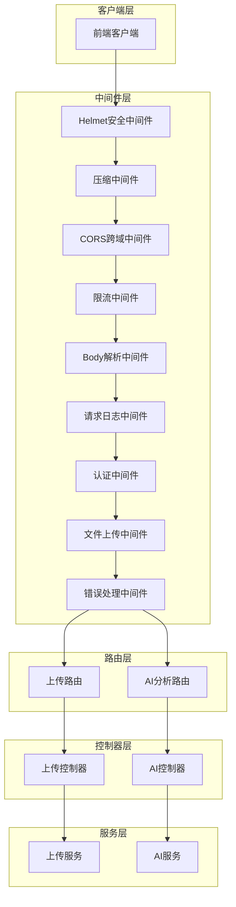

**图表来源**
- [app.js](file://backend/src/app.js#L38-L102)
- [auth.js](file://backend/src/middleware/auth.js#L1-L36)
- [upload.js](file://backend/src/middleware/upload.js#L1-L110)

**章节来源**
- [app.js](file://backend/src/app.js#L1-L166)

## 认证中间件（auth.js）

### 设计理念

认证中间件采用了渐进式开发策略，当前版本主要提供开发环境下的模拟认证功能，为未来的生产环境部署预留了扩展空间。这种设计既保证了开发效率，又为系统的演进提供了清晰的路径。

### 核心功能

#### requireAuth中间件
`requireAuth`中间件实现了基础的身份验证功能：

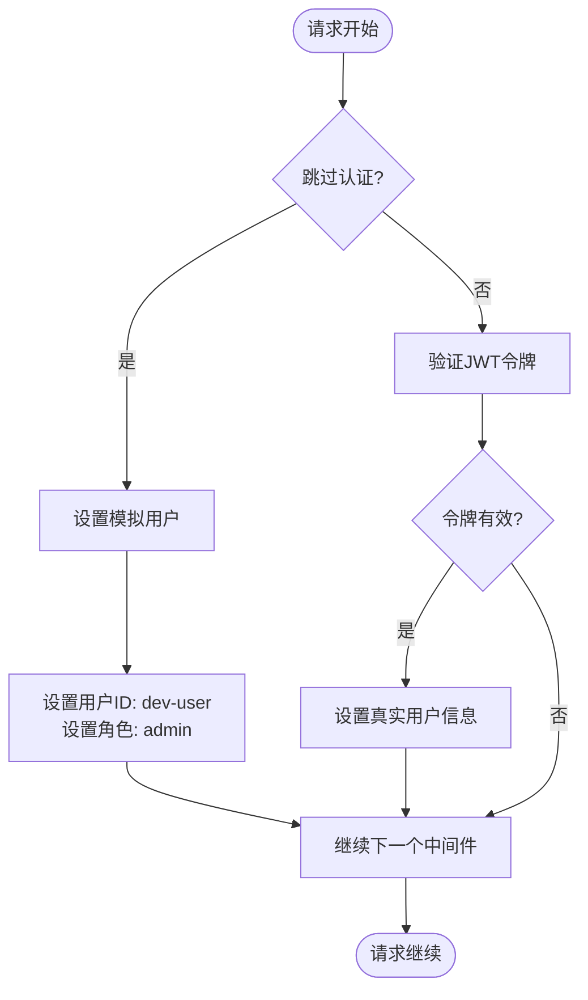

**图表来源**
- [auth.js](file://backend/src/middleware/auth.js#L4-L15)

#### requireAdmin中间件
管理员权限检查中间件确保只有具有管理员角色的用户才能访问受保护的资源：

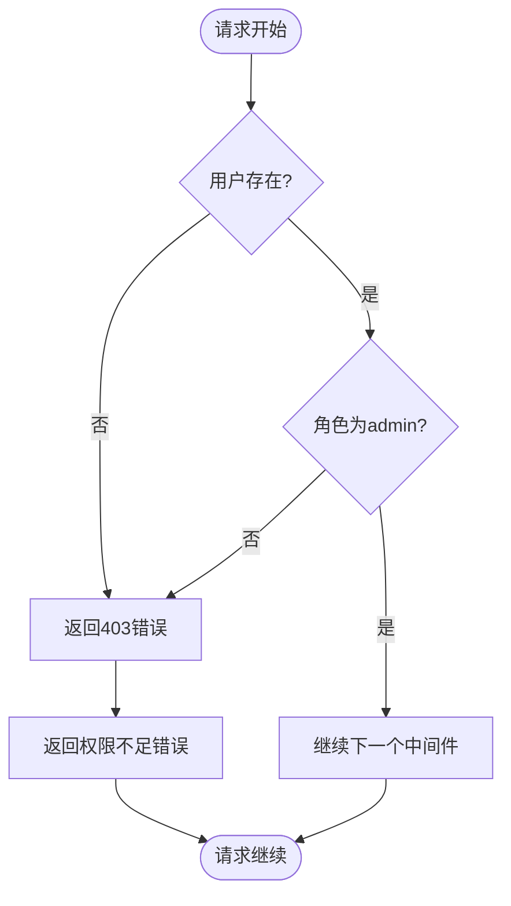

**图表来源**
- [auth.js](file://backend/src/middleware/auth.js#L18-L31)

### 实现细节

认证中间件通过修改请求对象（req）来传递用户信息：

| 中间件方法 | 功能描述 | 请求对象修改 | 响应状态码 |
|-----------|----------|-------------|-----------|
| `requireAuth` | 设置模拟用户信息 | `req.user = {id: 'dev-user', role: 'admin'}` | 无（总是通过） |
| `requireAdmin` | 权限检查 | 无直接修改 | 403（权限不足） |

**章节来源**
- [auth.js](file://backend/src/middleware/auth.js#L1-L36)

## 文件上传中间件（upload.js）

### Multer集成架构

文件上传中间件基于Multer库构建，提供了完整的文件处理解决方案，包括存储管理、文件验证和错误处理。

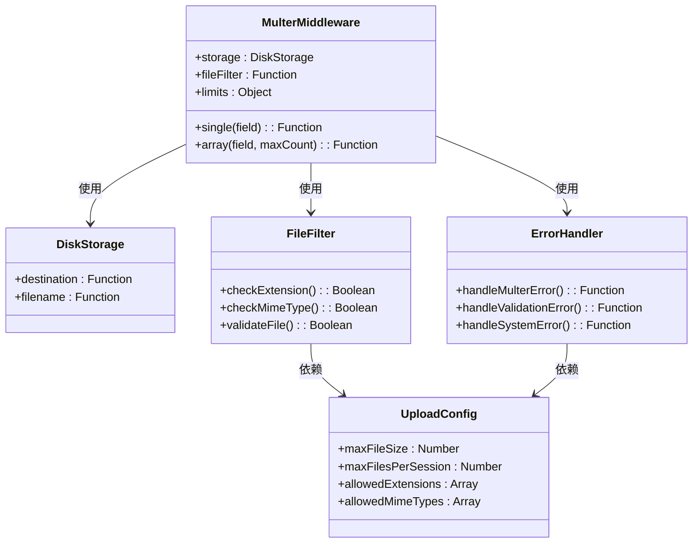

**图表来源**
- [upload.js](file://backend/src/middleware/upload.js#L12-L54)
- [upload.js](file://backend/src/middleware/upload.js#L25-L44)
- [upload.js](file://backend/src/middleware/upload.js#L57-L104)

### 存储引擎配置

文件上传中间件使用磁盘存储引擎，配置了专门的临时目录用于文件暂存：

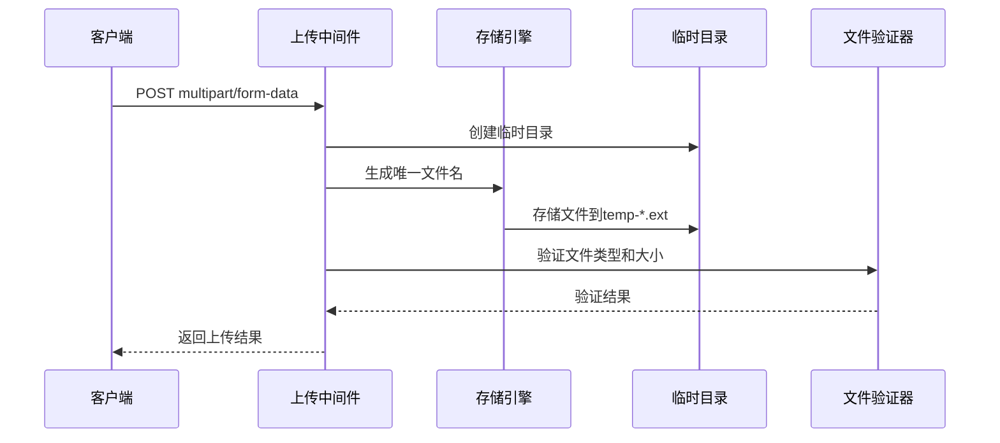

**图表来源**
- [upload.js](file://backend/src/middleware/upload.js#L8-L21)
- [upload.js](file://backend/src/middleware/upload.js#L25-L44)

### 文件过滤机制

文件过滤器实现了双重验证机制：

| 验证类型 | 检查内容 | 错误处理 | 配置来源 |
|---------|----------|----------|----------|
| 扩展名验证 | `.mp4`, `.avi` | 返回INVALID_FILE_FORMAT错误 | `config.allowedExtensions` |
| MIME类型验证 | `video/mp4`, `video/avi` | 返回INVALID_MIME_TYPE错误 | `config.allowedMimeTypes` |
| 大小限制 | `config.maxFileSize` | 返回FILE_TOO_LARGE错误 | `config.maxFileSize` |
| 数量限制 | `config.maxFilesPerSession` | 返回TOO_MANY_FILES错误 | `config.maxFilesPerSession` |

### 错误处理策略

上传中间件实现了分层错误处理机制：

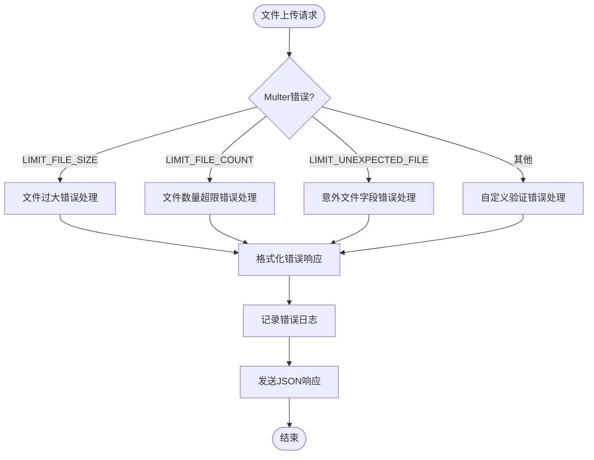

**图表来源**
- [upload.js](file://backend/src/middleware/upload.js#L57-L104)

**章节来源**
- [upload.js](file://backend/src/middleware/upload.js#L1-L110)
- [upload.js](file://backend/src/config/upload.js#L1-L53)

## 中间件堆栈与执行顺序

### 应用级中间件堆栈

Express应用按照严格的顺序加载中间件，确保每个中间件都能正确处理请求：

**图表来源**
- [app.js](file://backend/src/app.js#L38-L102)

### 路由级别中间件

不同路由可以根据需要应用特定的中间件组合：

| 路由路径 | 认证要求 | 上传中间件 | 特殊中间件 | 用途描述 |
|---------|----------|-----------|-----------|----------|
| `/api/upload/*` | 可选 | 是 | 文件验证 | 文件上传相关操作 |
| `/api/ai/*` | 必需 | 可选 | AI分析专用 | AI功能相关操作 |
| `/api/ai/analyze/upload` | 必需 | 是 | 文件数组处理 | 一体化上传分析 |

**章节来源**
- [app.js](file://backend/src/app.js#L85-L90)
- [upload.js](file://backend/src/routes/upload.js#L45-L61)
- [ai.js](file://backend/src/routes/ai.js#L31-L69)

## 错误处理机制

### 多层次错误处理

系统实现了多层次的错误处理机制，确保各种异常情况都能得到妥善处理：

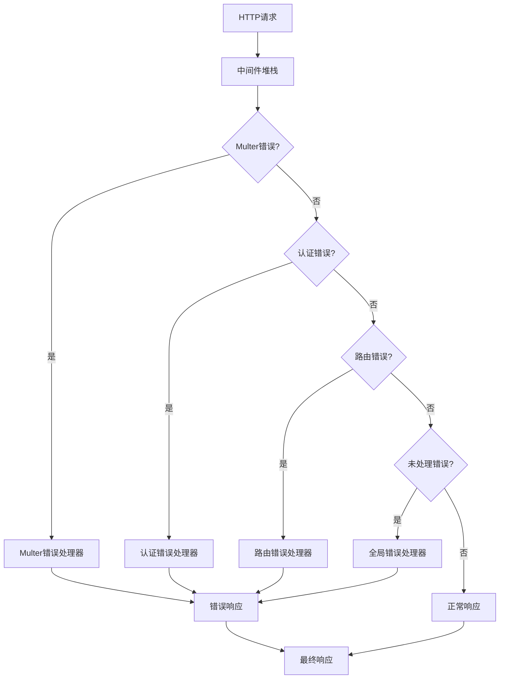

**图表来源**
- [app.js](file://backend/src/app.js#L92-L102)
- [upload.js](file://backend/src/middleware/upload.js#L57-L104)

### 错误响应格式

所有错误响应都遵循统一的格式规范：

| 字段名 | 类型 | 描述 | 示例值 |
|--------|------|------|--------|
| `error` | String | 错误代码 | `"FILE_TOO_LARGE"` |
| `message` | String | 错误描述 | `"文件大小超过限制 (300MB)"` |
| `timestamp` | String | ISO时间戳 | `"2024-01-15T10:30:00.000Z"` |
| `details` | String | 详细信息（可选） | `"实际大小: 350MB"` |

### 日志记录策略

错误处理中间件集成了完整的日志记录功能：

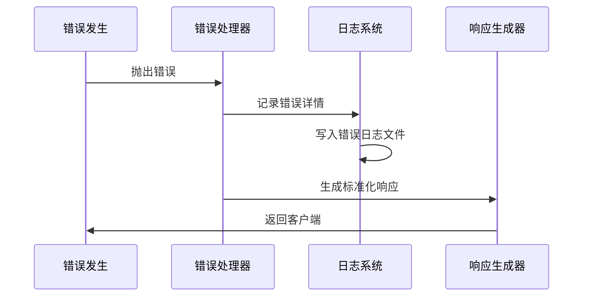

**图表来源**
- [app.js](file://backend/src/app.js#L93-L101)
- [logger.js](file://backend/src/utils/logger.js#L1-L66)

**章节来源**
- [app.js](file://backend/src/app.js#L92-L102)
- [upload.js](file://backend/src/middleware/upload.js#L57-L104)
- [logger.js](file://backend/src/utils/logger.js#L1-L66)

## 实际应用场景

### 文件上传工作流程

文件上传功能展示了中间件系统的完整工作流程：

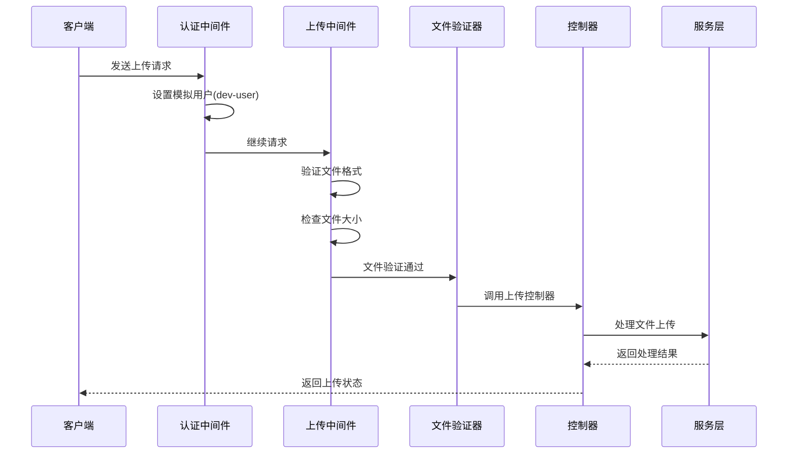

**图表来源**
- [upload.js](file://backend/src/routes/upload.js#L45-L54)
- [uploadController.js](file://backend/src/controllers/uploadController.js#L102-L147)

### AI分析认证流程

AI分析功能演示了严格的身份验证要求：

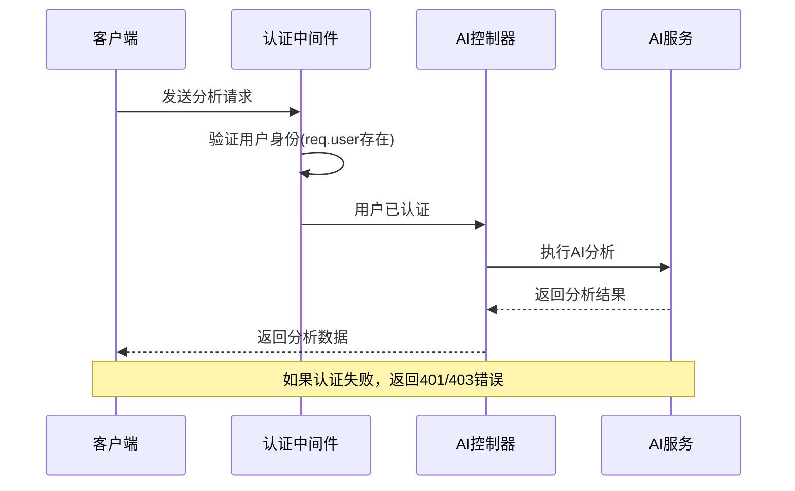

**图表来源**
- [ai.js](file://backend/src/routes/ai.js#L31-L41)
- [aiController.js](file://backend/src/controllers/aiController.js#L13-L51)

### 权限管理示例

管理员文件删除功能展示了权限检查的实际应用：

| 场景 | 用户角色 | 结果 | 原因 |
|------|----------|------|------|
| 管理员删除 | admin | 成功 | 角色匹配 |
| 普通用户删除 | user | 403错误 | 权限不足 |
| 未认证访问 | null | 403错误 | 缺少用户信息 |

**章节来源**
- [upload.js](file://backend/src/routes/upload.js#L60)
- [uploadController.js](file://backend/src/controllers/uploadController.js#L241-L282)
- [auth.js](file://backend/src/middleware/auth.js#L18-L31)

## 性能考虑

### 中间件性能优化

中间件系统在设计时充分考虑了性能因素：

| 优化策略 | 实现方式 | 性能收益 | 适用场景 |
|---------|----------|----------|----------|
| 异步处理 | Promise链式调用 | 减少阻塞 | 文件上传、AI分析 |
| 内存管理 | 流式处理大文件 | 降低内存占用 | 大文件上传 |
| 缓存机制 | 文件类型缓存 | 减少重复验证 | 高并发场景 |
| 连接池 | 数据库连接复用 | 提高响应速度 | 数据密集型操作 |

### 资源限制配置

系统通过配置文件集中管理资源限制：

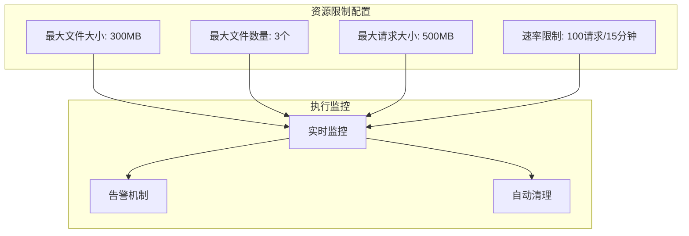

**图表来源**
- [upload.js](file://backend/src/config/upload.js#L7-L49)

## 故障排除指南

### 常见问题诊断

| 问题类型 | 症状描述 | 可能原因 | 解决方案 |
|---------|----------|----------|----------|
| 认证失败 | 403错误 | 用户信息缺失 | 检查认证中间件配置 |
| 文件上传失败 | 400错误 | 文件格式不支持 | 验证文件类型配置 |
| 内存溢出 | 500错误 | 文件过大 | 调整文件大小限制 |
| 权限拒绝 | 403错误 | 角色权限不足 | 检查用户角色配置 |

### 调试技巧

1. **启用详细日志**：设置`LOG_LEVEL=debug`获取更多调试信息
2. **检查中间件顺序**：确认中间件按预期顺序执行
3. **验证配置参数**：确保所有环境变量正确设置
4. **监控资源使用**：关注内存和磁盘空间使用情况

### 错误恢复策略

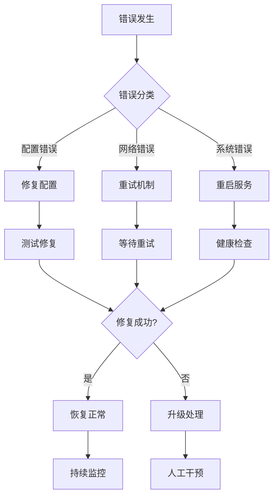

**章节来源**
- [logger.js](file://backend/src/utils/logger.js#L1-L66)
- [upload.js](file://backend/src/middleware/upload.js#L57-L104)

## 总结

Trae项目的中间件体系展现了现代Web应用架构的最佳实践。通过精心设计的认证中间件和文件上传中间件，系统实现了：

### 核心优势

1. **模块化设计**：每个中间件职责单一，便于维护和扩展
2. **渐进式开发**：认证中间件预留了生产环境的扩展空间
3. **完善的错误处理**：多层次的错误处理确保系统的稳定性
4. **灵活的配置管理**：通过配置文件集中管理资源限制
5. **强大的日志系统**：完整的日志记录支持问题诊断和性能监控

### 架构特点

- **请求生命周期管理**：清晰定义了中间件在请求处理过程中的位置和作用
- **安全防护机制**：通过Helmet、CORS等中间件提供全面的安全保护
- **性能优化策略**：合理的中间件顺序和资源配置确保系统高效运行
- **可扩展性设计**：模块化的架构为未来功能扩展提供了良好的基础

这套中间件机制不仅满足了当前的功能需求，更为系统的长期发展奠定了坚实的基础。通过持续的优化和改进，它能够适应不断变化的业务需求和技术挑战。