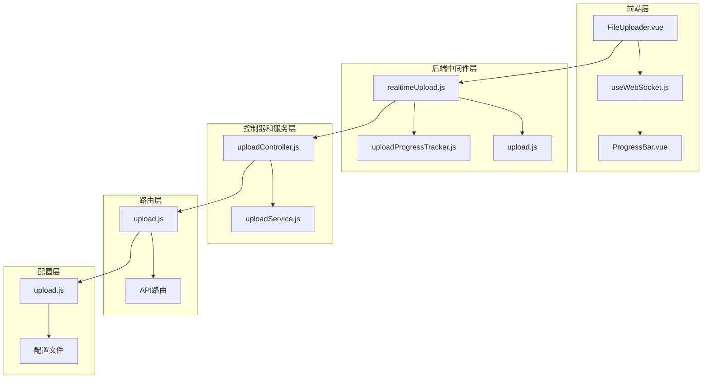
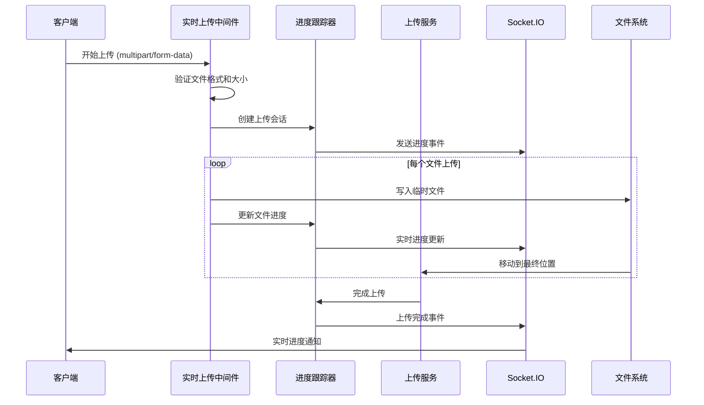
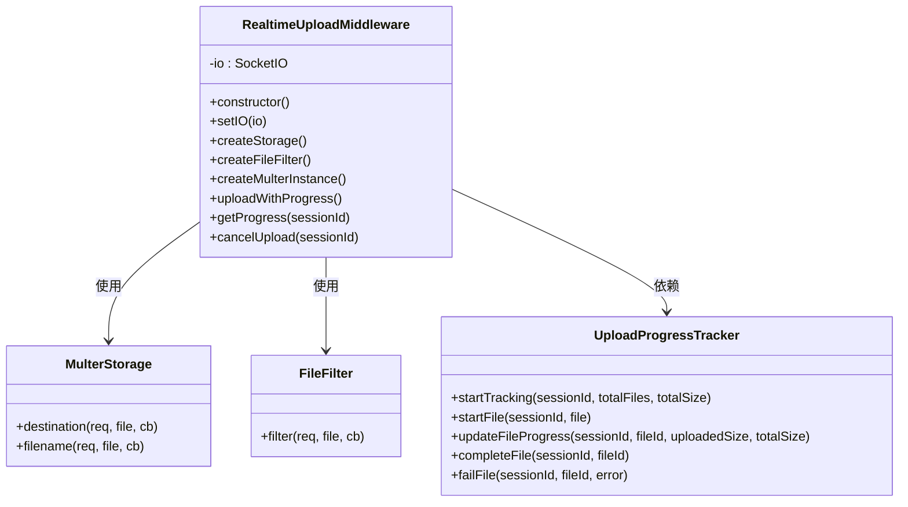
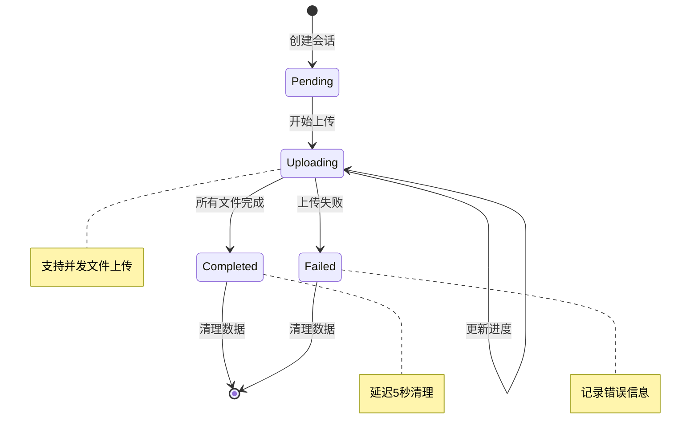
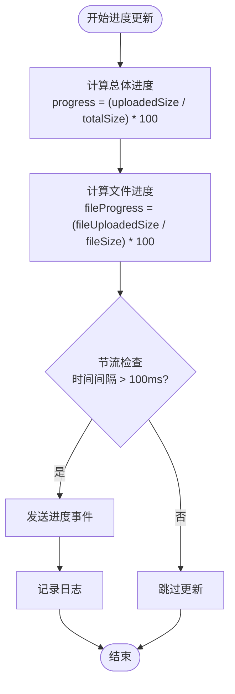
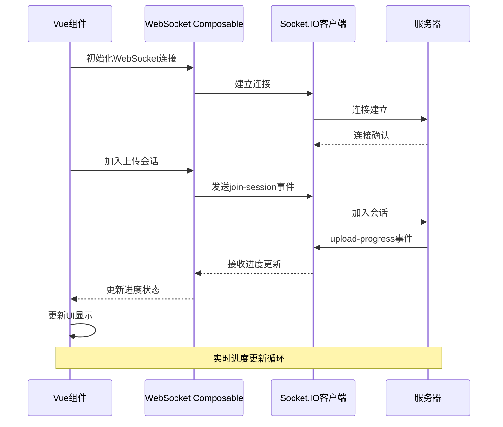
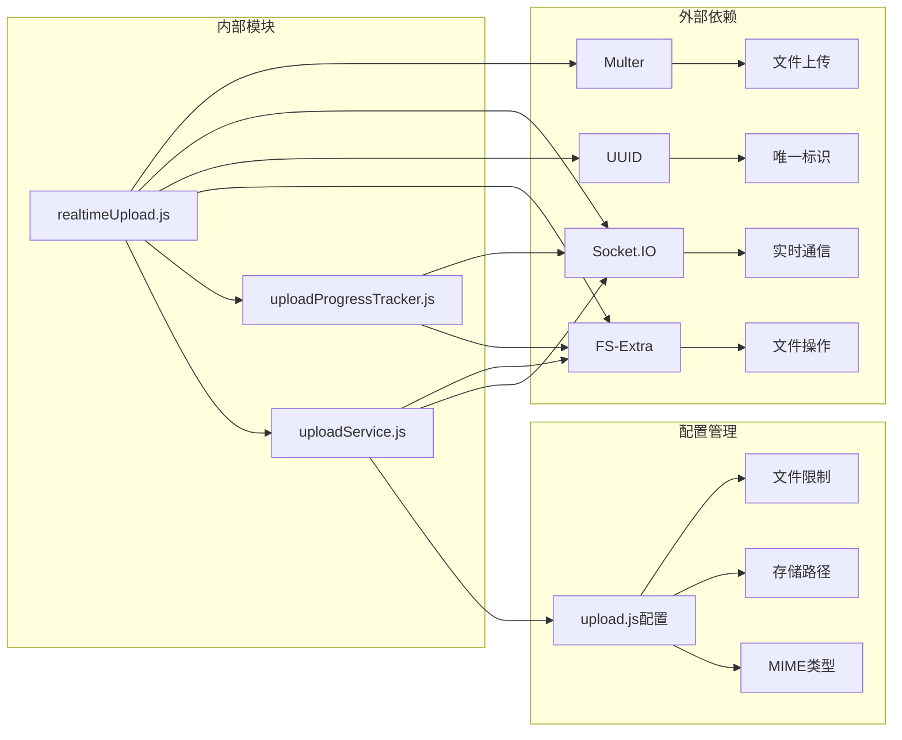

# 实时上传中间件

<cite>
**本文档引用的文件**
- [realtimeUpload.js](file://backend/src/middleware/realtimeUpload.js)
- [uploadProgressTracker.js](file://backend/src/middleware/uploadProgressTracker.js)
- [upload.js](file://backend/src/middleware/upload.js)
- [uploadController.js](file://backend/src/controllers/uploadController.js)
- [uploadService.js](file://backend/src/services/uploadService.js)
- [upload.js](file://backend/src/routes/upload.js)
- [upload.js](file://backend/src/config/upload.js)
- [useWebSocket.js](file://frontend/src/composables/useWebSocket.js)
- [FileUploader.vue](file://frontend/src/components/FileUploader.vue)
- [API.md](file://backend/API.md)
- [websocket.md](file://specs/001-responsive-h5-upload/contracts/websocket.md)
</cite>

## 目录
1. [简介](#简介)
2. [项目结构](#项目结构)
3. [核心组件](#核心组件)
4. [架构概览](#架构概览)
5. [详细组件分析](#详细组件分析)
6. [依赖关系分析](#依赖关系分析)
7. [性能考虑](#性能考虑)
8. [故障排除指南](#故障排除指南)
9. [结论](#结论)

## 简介

实时上传中间件是一个基于Node.js和Express构建的企业级文件上传系统，专门设计用于处理视频文件的批量上传。该系统提供了实时进度跟踪、WebSocket通信、文件验证和错误处理等功能，确保用户能够获得流畅的上传体验。

系统支持最多3个同类型视频文件（MP4/AVI）的批量上传，具备实时进度反馈、文件分类存储、会话管理和错误恢复机制。前端采用Vue.js框架，后端使用Express和Socket.IO实现实时通信。

## 项目结构

**图表来源**
- [realtimeUpload.js](file://backend/src/middleware/realtimeUpload.js#L1-L285)
- [uploadController.js](file://backend/src/controllers/uploadController.js#L1-L286)
- [upload.js](file://backend/src/routes/upload.js#L1-L95)

**章节来源**
- [realtimeUpload.js](file://backend/src/middleware/realtimeUpload.js#L1-L285)
- [uploadProgressTracker.js](file://backend/src/middleware/uploadProgressTracker.js#L1-L304)

## 核心组件

### 实时上传中间件 (RealtimeUploadMiddleware)

实时上传中间件是系统的核心组件，负责处理文件上传的全过程，包括进度跟踪、WebSocket通信和错误处理。

主要功能：
- **文件上传处理**：使用Multer处理文件上传，支持批量文件上传
- **进度跟踪**：实时跟踪上传进度，支持多个文件的并发上传
- **WebSocket集成**：与Socket.IO集成，提供实时进度更新
- **文件验证**：验证文件格式、大小和数量限制
- **会话管理**：管理上传会话，支持取消和恢复操作

### 上传进度跟踪器 (UploadProgressTracker)

上传进度跟踪器是一个事件驱动的组件，负责管理所有活跃上传会话的进度状态。

主要功能：
- **会话跟踪**：跟踪每个上传会话的状态和进度
- **文件级进度**：记录每个文件的上传进度和状态
- **事件发布**：通过事件系统发布进度更新
- **内存管理**：定期清理过期的上传会话数据

### 文件验证中间件

文件验证中间件负责在上传前验证文件的格式、大小和数量限制。

主要功能：
- **格式验证**：检查文件扩展名和MIME类型
- **大小限制**：验证文件大小不超过300MB
- **数量限制**：限制每个会话最多上传3个文件
- **类型一致性**：确保所有文件具有相同的格式

**章节来源**
- [realtimeUpload.js](file://backend/src/middleware/realtimeUpload.js#L13-L285)
- [uploadProgressTracker.js](file://backend/src/middleware/uploadProgressTracker.js#L4-L304)
- [upload.js](file://backend/src/middleware/upload.js#L1-L114)

## 架构概览

**图表来源**
- [realtimeUpload.js](file://backend/src/middleware/realtimeUpload.js#L93-L252)
- [uploadProgressTracker.js](file://backend/src/middleware/uploadProgressTracker.js#L10-L304)
- [uploadService.js](file://backend/src/services/uploadService.js#L118-L302)

## 详细组件分析

### 实时上传中间件详细分析

实时上传中间件采用了工厂模式和单例模式，提供了完整的文件上传解决方案。

**图表来源**
- [realtimeUpload.js](file://backend/src/middleware/realtimeUpload.js#L13-L90)
- [uploadProgressTracker.js](file://backend/src/middleware/uploadProgressTracker.js#L4-L304)

#### 关键特性

1. **自定义存储引擎**：使用UUID为每个文件生成唯一标识符，确保并发上传的安全性
2. **进度节流机制**：限制进度更新频率，避免过度的WebSocket通信
3. **错误恢复**：在网络中断或上传失败时提供恢复机制
4. **会话隔离**：每个上传会话都有独立的进度跟踪

### 上传进度跟踪器详细分析

**图表来源**
- [uploadProgressTracker.js](file://backend/src/middleware/uploadProgressTracker.js#L11-L164)

#### 进度计算算法

进度跟踪器实现了精确的进度计算算法：

**图表来源**
- [uploadProgressTracker.js](file://backend/src/middleware/uploadProgressTracker.js#L59-L96)

### 前端WebSocket集成分析

前端使用Vue.js和Socket.IO实现实时进度更新：

**图表来源**
- [useWebSocket.js](file://frontend/src/composables/useWebSocket.js#L24-L118)

**章节来源**
- [realtimeUpload.js](file://backend/src/middleware/realtimeUpload.js#L13-L285)
- [uploadProgressTracker.js](file://backend/src/middleware/uploadProgressTracker.js#L4-L304)
- [useWebSocket.js](file://frontend/src/composables/useWebSocket.js#L1-L214)

## 依赖关系分析

**图表来源**
- [realtimeUpload.js](file://backend/src/middleware/realtimeUpload.js#L1-L8)
- [uploadProgressTracker.js](file://backend/src/middleware/uploadProgressTracker.js#L1-L2)
- [uploadService.js](file://backend/src/services/uploadService.js#L1-L7)

### 关键依赖说明

1. **Multer**：提供文件上传中间件功能，支持流式处理和进度跟踪
2. **Socket.IO**：实现实时双向通信，支持WebSocket和轮询降级
3. **UUID**：生成唯一文件标识符，确保并发上传的安全性
4. **FS-Extra**：提供增强的文件系统操作功能

**章节来源**
- [realtimeUpload.js](file://backend/src/middleware/realtimeUpload.js#L1-L8)
- [uploadProgressTracker.js](file://backend/src/middleware/uploadProgressTracker.js#L1-L2)

## 性能考虑

### 并发处理优化

系统通过以下机制优化并发上传性能：

1. **文件级并发**：支持多个文件同时上传，每个文件独立跟踪进度
2. **进度节流**：限制WebSocket消息频率，避免网络拥塞
3. **内存管理**：定期清理过期的上传会话数据
4. **流式处理**：使用流式文件处理，减少内存占用

### 存储优化

1. **临时文件管理**：使用临时目录存储上传文件，避免直接写入目标目录
2. **文件命名策略**：使用时间戳和UUID组合确保文件名唯一性
3. **目录结构**：按分类组织文件，便于管理和维护

### 网络优化

1. **连接池管理**：Socket.IO自动管理连接池
2. **重连机制**：智能重连策略，提高连接稳定性
3. **传输协议**：优先使用WebSocket，降级到轮询

## 故障排除指南

### 常见问题及解决方案

#### 1. 上传进度不更新

**症状**：前端显示上传进度停滞不动
**原因**：WebSocket连接中断或进度事件未正确触发
**解决方案**：
- 检查网络连接状态
- 验证Socket.IO服务器配置
- 查看服务器日志中的错误信息

#### 2. 文件上传失败

**症状**：文件上传到中途失败
**原因**：文件大小超出限制、格式不支持或服务器错误
**解决方案**：
- 验证文件格式和大小
- 检查服务器磁盘空间
- 查看详细的错误日志

#### 3. 连接超时

**症状**：WebSocket连接建立失败
**原因**：防火墙阻止、端口占用或服务器负载过高
**解决方案**：
- 检查防火墙设置
- 验证端口可用性
- 监控服务器资源使用情况

### 调试工具和技巧

1. **日志分析**：使用结构化日志记录关键事件
2. **性能监控**：监控CPU、内存和网络使用情况
3. **网络诊断**：使用网络抓包工具分析通信问题
4. **压力测试**：模拟高并发场景测试系统稳定性

**章节来源**
- [uploadProgressTracker.js](file://backend/src/middleware/uploadProgressTracker.js#L260-L279)
- [realtimeUpload.js](file://backend/src/middleware/realtimeUpload.js#L224-L242)

## 结论

实时上传中间件是一个功能完善、性能优异的企业级文件上传解决方案。它成功地解决了传统文件上传系统中存在的诸多问题，包括：

1. **实时反馈**：通过WebSocket提供即时的上传进度反馈
2. **并发处理**：支持多个文件的并发上传和独立进度跟踪
3. **错误恢复**：完善的错误处理和恢复机制
4. **可扩展性**：模块化设计便于功能扩展和维护
5. **用户体验**：直观的界面和流畅的操作流程

该系统特别适合需要处理大量视频文件的企业应用场景，能够显著提升用户的上传体验和系统的整体效率。通过合理的架构设计和性能优化，系统能够在高并发环境下保持稳定的运行状态。

未来的改进方向包括：
- 增强安全性机制
- 优化大文件上传性能
- 扩展更多文件格式支持
- 集成云存储服务
- 提供更丰富的统计和分析功能