# 后端架构文档

<cite>
**本文档引用的文件**
- [app.js](file://backend/src/app.js)
- [ai.js](file://backend/src/routes/ai.js)
- [upload.js](file://backend/src/routes/upload.js)
- [auth.js](file://backend/src/middleware/auth.js)
- [upload.js](file://backend/src/middleware/upload.js)
- [aiController.js](file://backend/src/controllers/aiController.js)
- [uploadController.js](file://backend/src/controllers/uploadController.js)
- [aiService.js](file://backend/src/services/aiService.js)
- [uploadService.js](file://backend/src/services/uploadService.js)
- [upload.js](file://backend/src/config/upload.js)
- [logger.js](file://backend/src/utils/logger.js)
- [package.json](file://backend/package.json)
</cite>

## 目录
1. [项目概述](#项目概述)
2. [系统架构总览](#系统架构总览)
3. [应用入口与初始化](#应用入口与初始化)
4. [路由层架构](#路由层架构)
5. [中间件层设计](#中间件层设计)
6. [控制器层实现](#控制器层实现)
7. [服务层架构](#服务层架构)
8. [配置管理](#配置管理)
9. [日志系统](#日志系统)
10. [WebSocket实时通信](#websocket实时通信)
11. [请求处理流程](#请求处理流程)
12. [性能与安全考虑](#性能与安全考虑)
13. [总结](#总结)

## 项目概述

本项目是一个基于Express.js的视频上传与AI分析后端系统，采用经典的MVC架构模式。系统提供了完整的视频文件上传、存储、管理和AI智能分析功能，支持多种视频格式的深度分析和融合处理。

### 核心特性
- **多阶段AI分析**：结合阿里云通义千问模型进行视频内容理解和报告生成
- **实时文件上传**：支持大文件分块上传和进度监控
- **WebSocket实时通信**：提供实时上传进度反馈
- **多用户会话管理**：支持并发上传和状态跟踪
- **安全的身份验证**：基于中间件的访问控制机制

## 系统架构总览

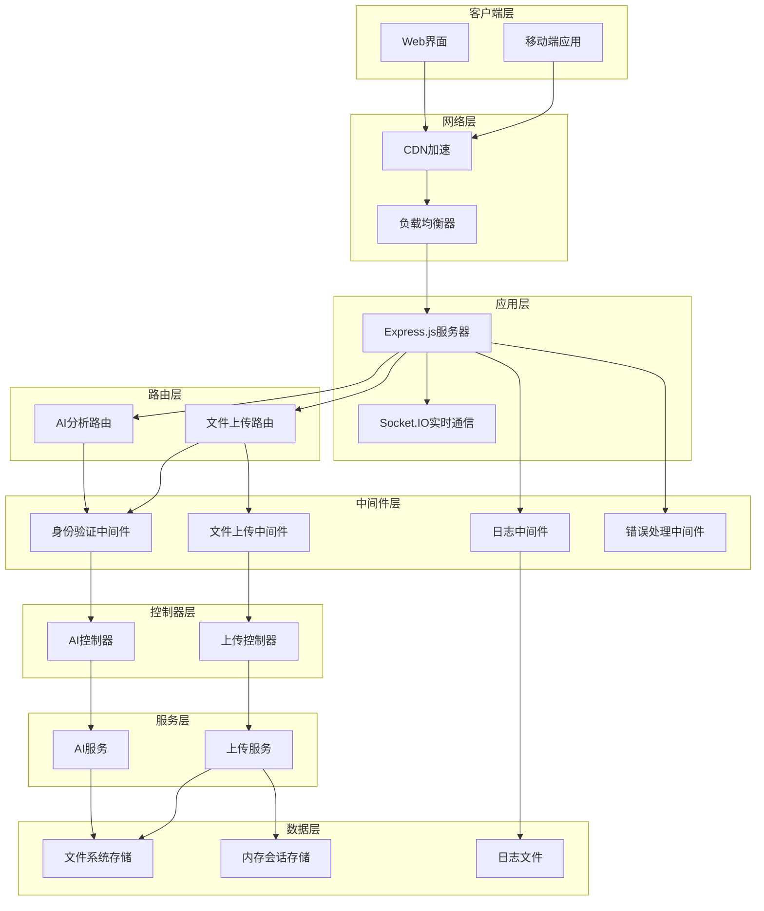

**架构图来源**
- [app.js](file://backend/src/app.js#L19-L166)
- [ai.js](file://backend/src/routes/ai.js#L1-L71)
- [upload.js](file://backend/src/routes/upload.js#L1-L62)

## 应用入口与初始化

### 应用启动流程

应用入口文件`app.js`负责整个系统的初始化和配置，采用模块化的设计模式。

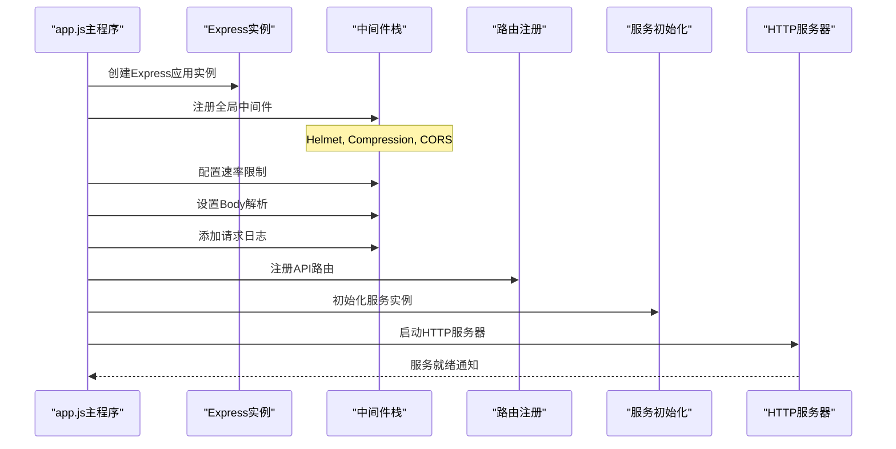

**序列图来源**
- [app.js](file://backend/src/app.js#L37-L166)

### 中间件加载顺序

系统中间件按照以下顺序加载和执行：

1. **安全中间件** (`helmet`, `compression`)
2. **跨域中间件** (`cors`)
3. **速率限制** (`rateLimit`)
4. **请求解析** (`express.json`, `express.urlencoded`)
5. **日志记录** (`logger`)
6. **路由处理** (`routes`)
7. **错误处理** (`errorHandler`)
8. **404处理** (`notFoundHandler`)

**节来源**
- [app.js](file://backend/src/app.js#L37-L111)

## 路由层架构

### 路由组织结构

系统采用模块化的路由设计，将不同的功能模块分离到独立的路由文件中。

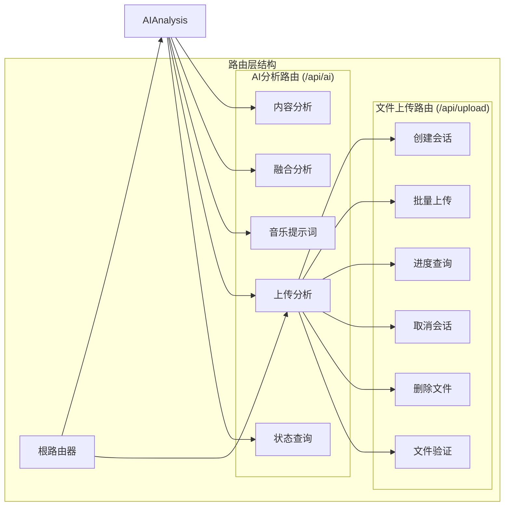

**架构图来源**
- [ai.js](file://backend/src/routes/ai.js#L1-L71)
- [upload.js](file://backend/src/routes/upload.js#L1-L62)

### AI分析路由详解

AI分析路由提供了完整的视频智能分析功能：

| 路由路径 | HTTP方法 | 功能描述 | 认证要求 |
|---------|----------|----------|----------|
| `/api/ai/analyze/content` | POST | 视频内容深度分析 | 是 |
| `/api/ai/analyze/fusion` | POST | 视频融合分析 | 是 |
| `/api/ai/generate/music-prompt` | POST | 背景音乐提示词生成 | 是 |
| `/api/ai/analyze/upload` | POST | 一体化上传分析 | 是 |
| `/api/ai/analysis/:analysisId/status` | GET | 分析状态查询 | 是 |

**节来源**
- [ai.js](file://backend/src/routes/ai.js#L31-L69)

### 文件上传路由详解

文件上传路由支持完整的文件生命周期管理：

| 路由路径 | HTTP方法 | 功能描述 | 认证要求 |
|---------|----------|----------|----------|
| `/api/upload/session` | POST | 创建上传会话 | 是 |
| `/api/upload/batch` | POST | 批量文件上传 | 是 |
| `/api/upload/progress/:sessionId` | GET | 查询上传进度 | 是 |
| `/api/upload/cancel/:sessionId` | POST | 取消上传会话 | 是 |
| `/api/upload/file/:fileId` | DELETE | 删除文件 | 是 |
| `/api/upload/validate` | POST | 文件格式验证 | 否 |

**节来源**
- [upload.js](file://backend/src/routes/upload.js#L46-L61)

## 中间件层设计

### 身份验证中间件

身份验证中间件提供基础的访问控制功能，目前处于开发阶段，未来将集成JWT令牌验证。

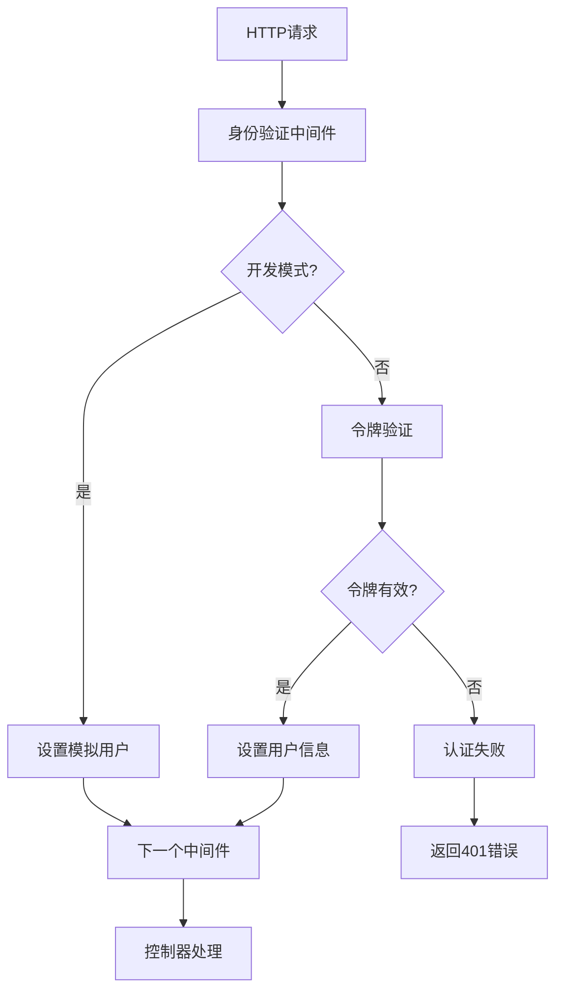

**流程图来源**
- [auth.js](file://backend/src/middleware/auth.js#L4-L15)

### 文件上传中间件

文件上传中间件基于Multer实现，提供强大的文件处理和验证功能。

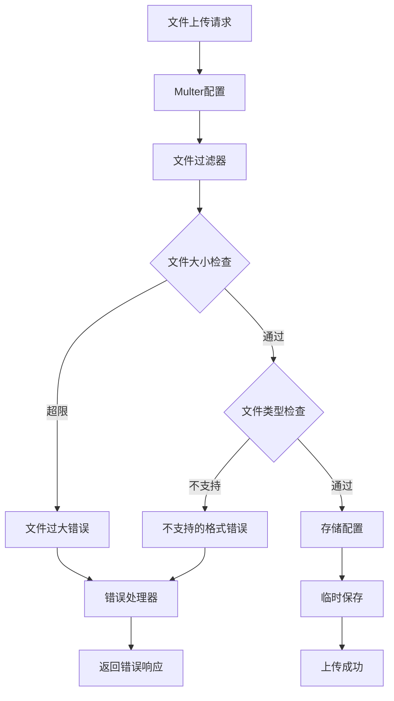

**流程图来源**
- [upload.js](file://backend/src/middleware/upload.js#L25-L44)

### 错误处理中间件

系统实现了完善的错误处理机制，包括Multer错误处理和通用错误处理。

**节来源**
- [auth.js](file://backend/src/middleware/auth.js#L1-36)
- [upload.js](file://backend/src/middleware/upload.js#L56-L109)

## 控制器层实现

### AI控制器架构

AI控制器负责处理所有的AI相关请求，作为Express路由和AI服务之间的桥梁。

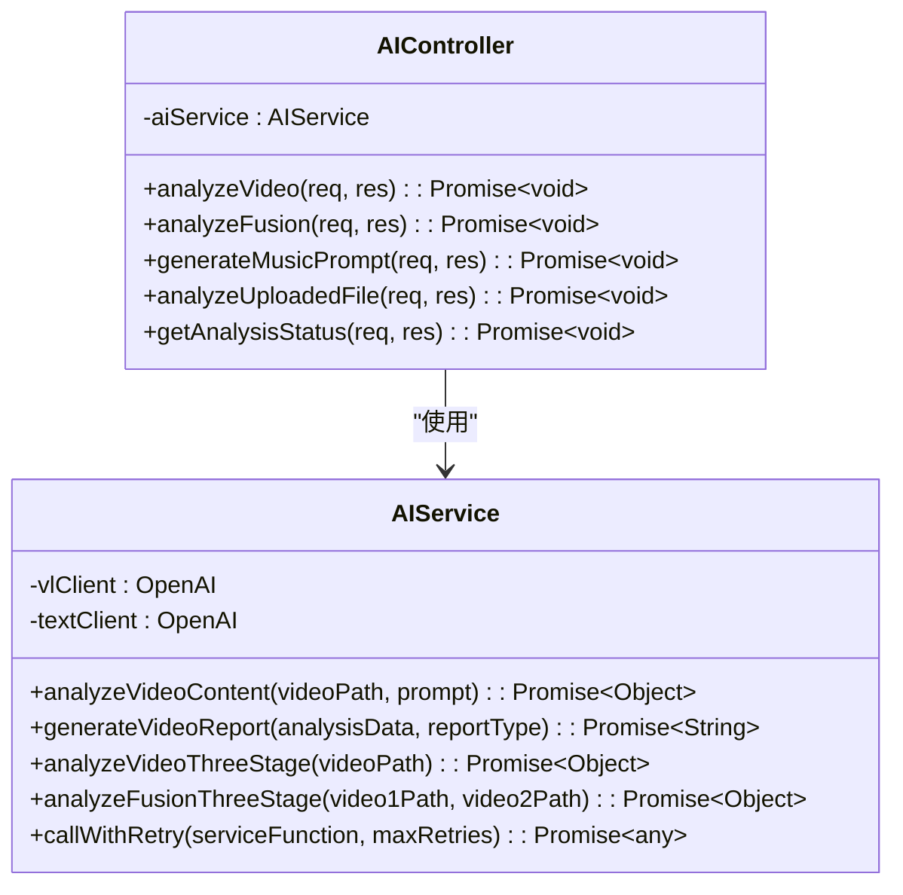

**类图来源**
- [aiController.js](file://backend/src/controllers/aiController.js#L5-L237)
- [aiService.js](file://backend/src/services/aiService.js#L8-L672)

### 上传控制器架构

上传控制器管理文件的完整生命周期，包括会话创建、文件上传、进度监控等功能。

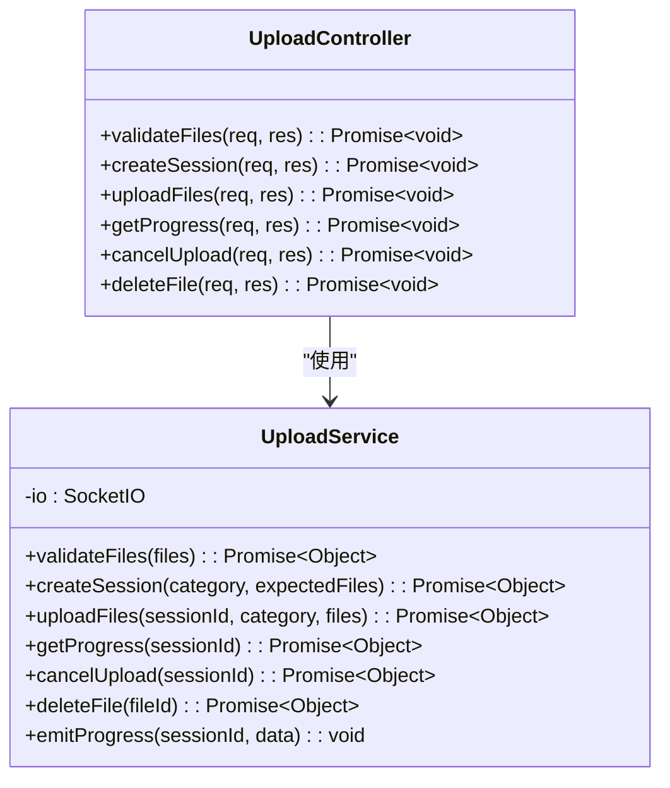

**类图来源**
- [uploadController.js](file://backend/src/controllers/uploadController.js#L25-L285)
- [uploadService.js](file://backend/src/services/uploadService.js#L12-L416)

### 请求处理模式

控制器采用统一的错误处理模式，确保所有异常都能被正确捕获和响应。

**节来源**
- [aiController.js](file://backend/src/controllers/aiController.js#L13-L237)
- [uploadController.js](file://backend/src/controllers/uploadController.js#L27-L285)

## 服务层架构

### AI服务设计

AI服务层封装了与阿里云AI模型的交互细节，采用双模型协同架构：

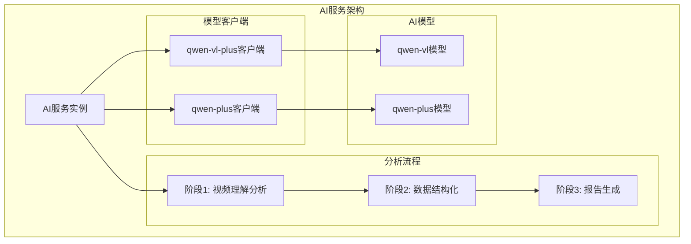

**架构图来源**
- [aiService.js](file://backend/src/services/aiService.js#L8-L19)

### 三阶段分析流程

AI服务实现了创新的三阶段处理流程，确保高质量的分析结果：

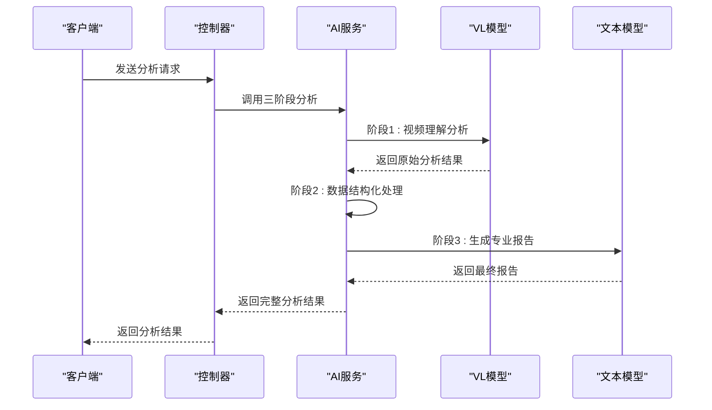

**序列图来源**
- [aiService.js](file://backend/src/services/aiService.js#L420-L474)

### 重试机制设计

AI服务实现了基于指数退避的智能重试机制，提高服务的可靠性：

| 重试次数 | 延迟时间 | 说明 |
|---------|----------|------|
| 1 | 1秒 | 第一次重试 |
| 2 | 2秒 | 第二次重试 |
| 3 | 4秒 | 第三次重试 |
| 最大 | 8秒 | 达到最大重试次数 |

**节来源**
- [aiService.js](file://backend/src/services/aiService.js#L614-L672)

### 上传服务设计

上传服务提供了完整的文件管理功能，支持实时进度监控和并发处理。

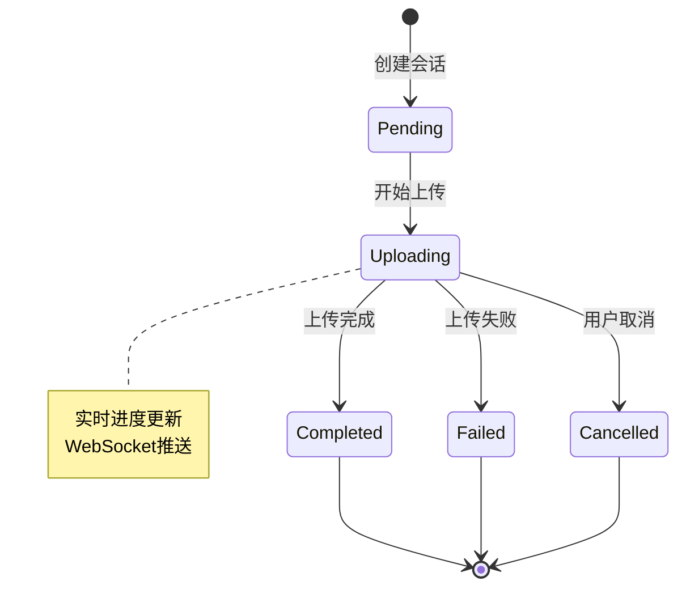

**状态图来源**
- [uploadService.js](file://backend/src/services/uploadService.js#L118-L295)

**节来源**
- [aiService.js](file://backend/src/services/aiService.js#L1-672)
- [uploadService.js](file://backend/src/services/uploadService.js#L1-416)

## 配置管理

### 配置文件结构

系统采用集中式的配置管理，所有配置项都集中在`upload.js`配置文件中。

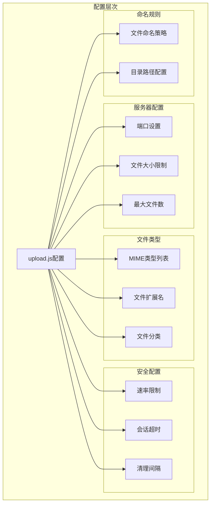

**架构图来源**
- [upload.js](file://backend/src/config/upload.js#L3-L53)

### 环境变量支持

系统支持通过环境变量覆盖默认配置，便于不同环境的部署：

| 配置项 | 默认值 | 环境变量 | 说明 |
|-------|--------|----------|------|
| 端口 | 8005 | PORT | HTTP服务器端口 |
| 最大文件大小 | 300MB | MAX_FILE_SIZE | 单个文件最大尺寸 |
| 最大文件数 | 3 | MAX_FILES_PER_SESSION | 单次会话最大文件数 |
| 会话超时 | 24小时 | - | 上传会话有效期 |
| 清理间隔 | 1小时 | - | 会话清理周期 |

**节来源**
- [upload.js](file://backend/src/config/upload.js#L1-53)

## 日志系统

### 日志架构设计

系统采用Winston日志库实现结构化日志记录，支持多级别和多传输。

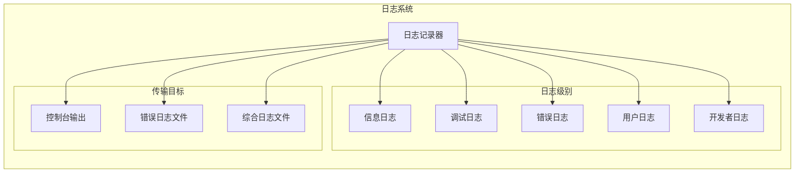

**架构图来源**
- [logger.js](file://backend/src/utils/logger.js#L18-L66)

### 日志级别说明

| 日志级别 | 方法名 | 使用场景 | 输出目标 |
|---------|--------|----------|----------|
| info | logger.info() | 一般信息记录 | 控制台+文件 |
| debug | logger.debug() | 开发调试信息 | 控制台+文件 |
| error | logger.error() | 错误信息记录 | 错误文件 |
| user | logger.user() | 用户友好消息 | 综合文件 |
| dev | logger.dev() | 开发者技术信息 | 综合文件 |

**节来源**
- [logger.js](file://backend/src/utils/logger.js#L1-66)

## WebSocket实时通信

### 实时通信架构

系统集成了Socket.IO实现实时通信功能，主要用于文件上传进度的实时反馈。

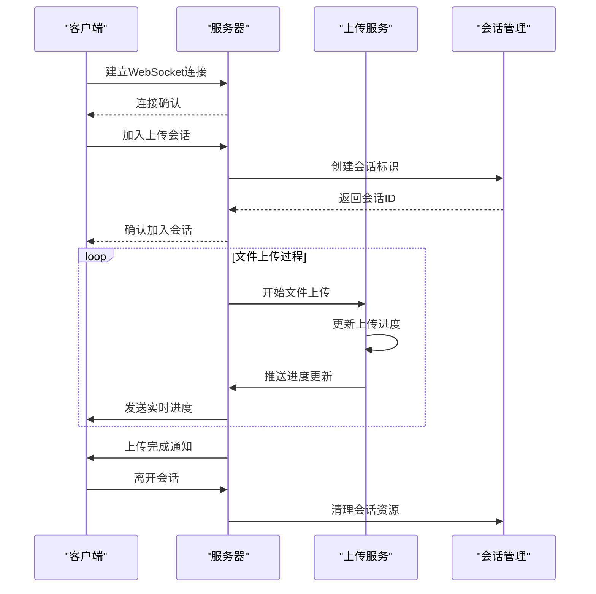

**序列图来源**
- [app.js](file://backend/src/app.js#L113-L130)

### 会话管理机制

WebSocket会话采用房间系统进行隔离管理：

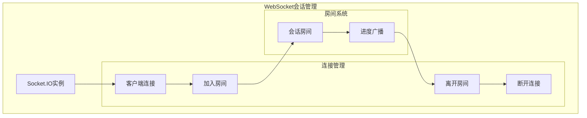

**架构图来源**
- [app.js](file://backend/src/app.js#L113-L130)

**节来源**
- [app.js](file://backend/src/app.js#L113-L130)

## 请求处理流程

### 完整请求处理链路

从HTTP请求接收到AI分析结果返回的完整流程展示了MVC架构的实际运作。

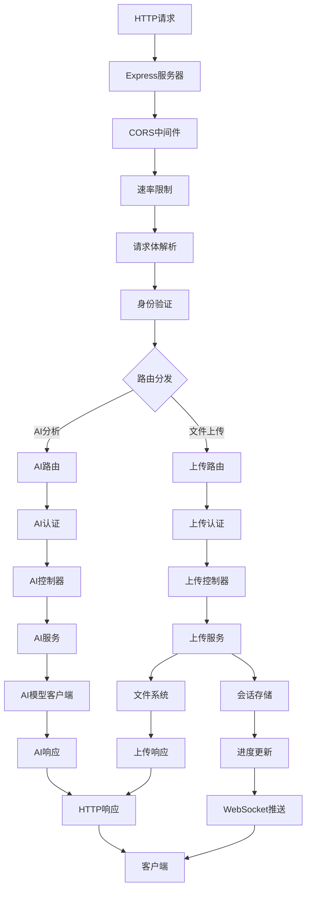

**流程图来源**
- [app.js](file://backend/src/app.js#L84-L111)
- [ai.js](file://backend/src/routes/ai.js#L31-L69)
- [upload.js](file://backend/src/routes/upload.js#L46-L61)

### 错误处理流程

系统实现了多层次的错误处理机制，确保用户体验和系统稳定性。

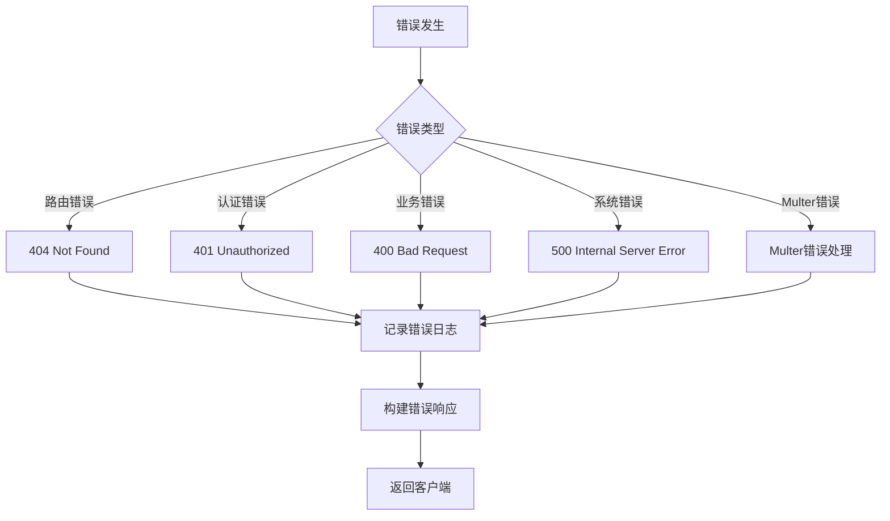

**流程图来源**
- [app.js](file://backend/src/app.js#L92-L111)

## 性能与安全考虑

### 性能优化策略

1. **中间件优化**
   - 使用`compression`中间件压缩响应
   - 启用`helmet`提供安全头部
   - 实施速率限制防止滥用

2. **文件处理优化**
   - 支持大文件分块上传
   - 实现文件上传进度实时反馈
   - 采用内存缓存减少磁盘I/O

3. **AI服务优化**
   - 实现智能重试机制
   - 采用双模型协同处理
   - 支持流式响应处理

### 安全防护措施

1. **输入验证**
   - 文件类型和大小验证
   - MIME类型检查
   - 文件内容扫描

2. **访问控制**
   - 基于中间件的身份验证
   - 文件操作权限控制
   - 会话超时管理

3. **网络安全**
   - CORS配置限制
   - HTTPS强制使用
   - 请求频率限制

**节来源**
- [app.js](file://backend/src/app.js#L37-L58)
- [upload.js](file://backend/src/middleware/upload.js#L25-L44)

## 总结

本项目展示了基于Express.js的完整MVC架构实现，具有以下特点：

### 架构优势
- **模块化设计**：清晰的分层架构便于维护和扩展
- **服务解耦**：控制器与服务层完全分离，提高代码复用性
- **中间件机制**：灵活的中间件系统支持各种横切关注点
- **实时通信**：WebSocket集成提供优秀的用户体验

### 技术亮点
- **AI集成**：深度集成阿里云AI模型，实现智能化视频分析
- **文件管理**：完整的文件生命周期管理，支持并发和进度监控
- **错误处理**：完善的错误处理和重试机制，确保系统稳定性
- **日志系统**：结构化日志记录，便于问题诊断和性能监控

### 扩展性考虑
- **配置管理**：集中式配置支持多环境部署
- **服务抽象**：良好的服务接口设计便于替换底层实现
- **监控集成**：内置日志和健康检查机制
- **测试支持**：完整的单元测试和集成测试覆盖

该架构为视频分析和文件管理应用提供了坚实的技术基础，具备良好的可维护性和扩展性，能够满足企业级应用的需求。