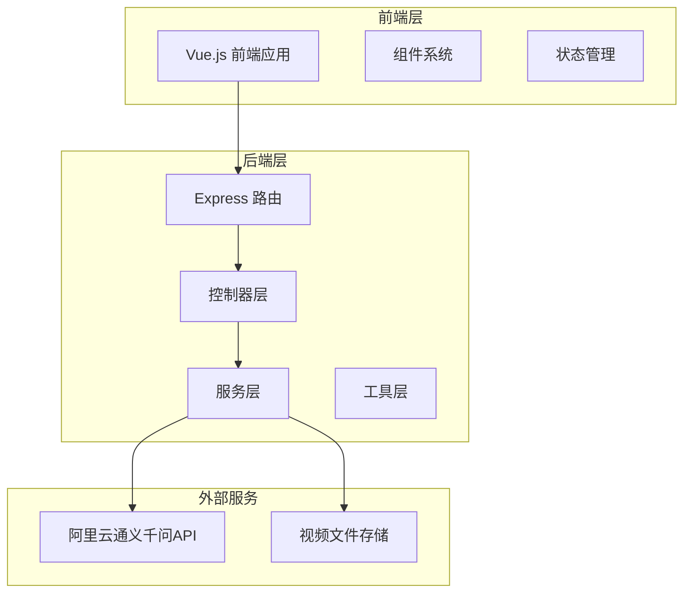
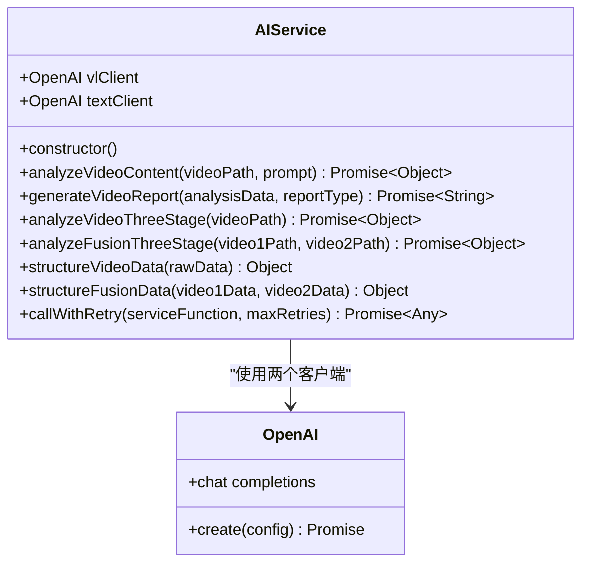
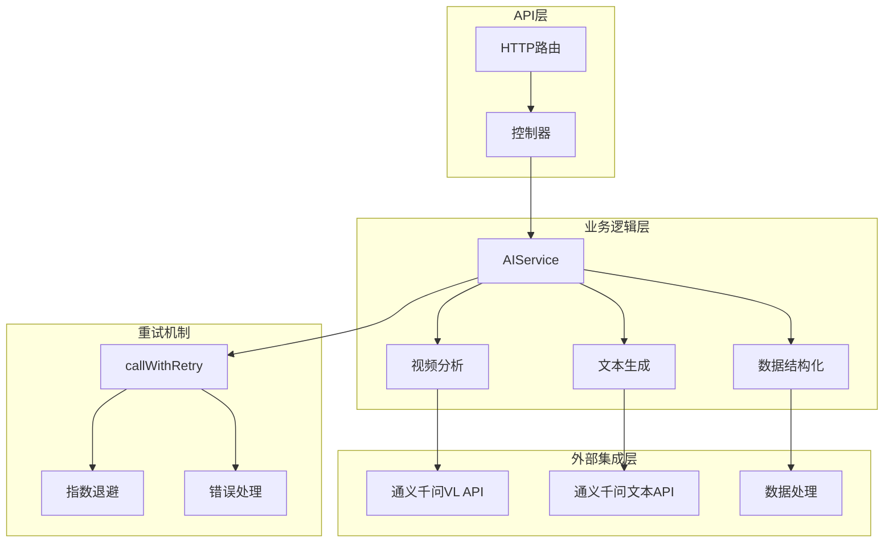
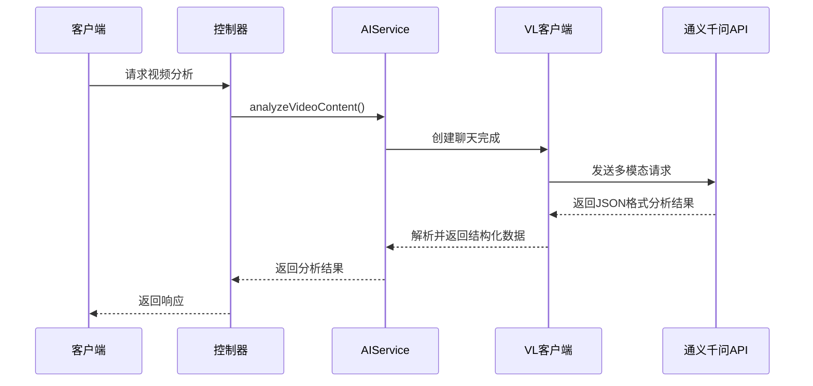
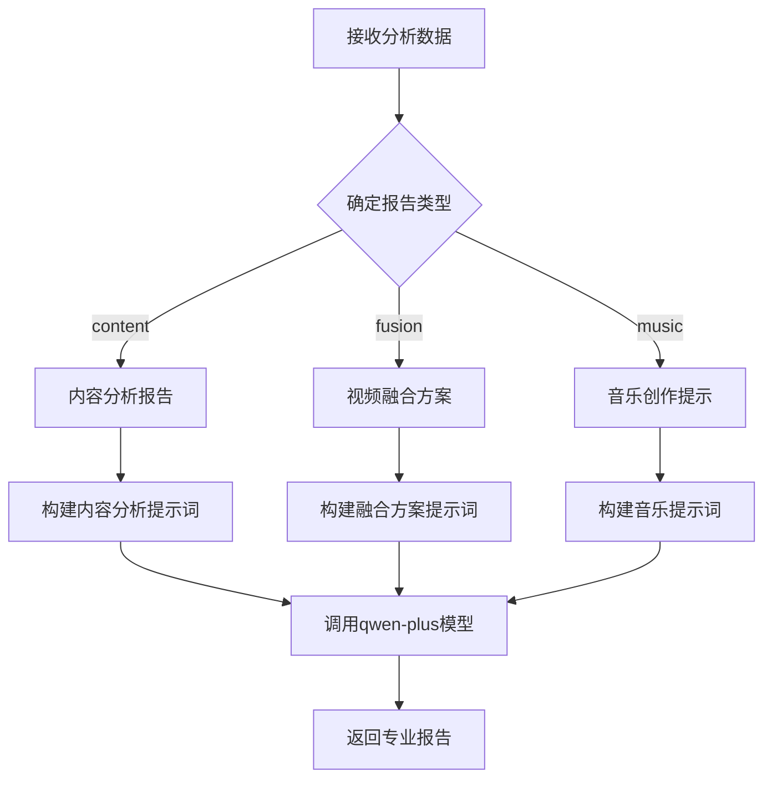
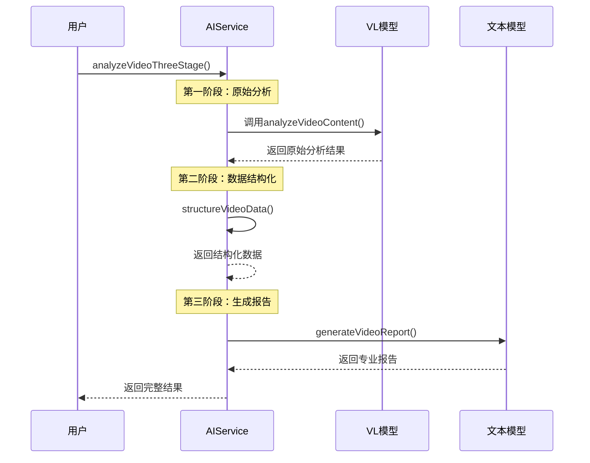
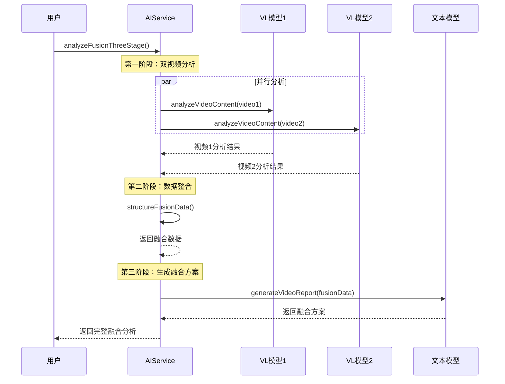
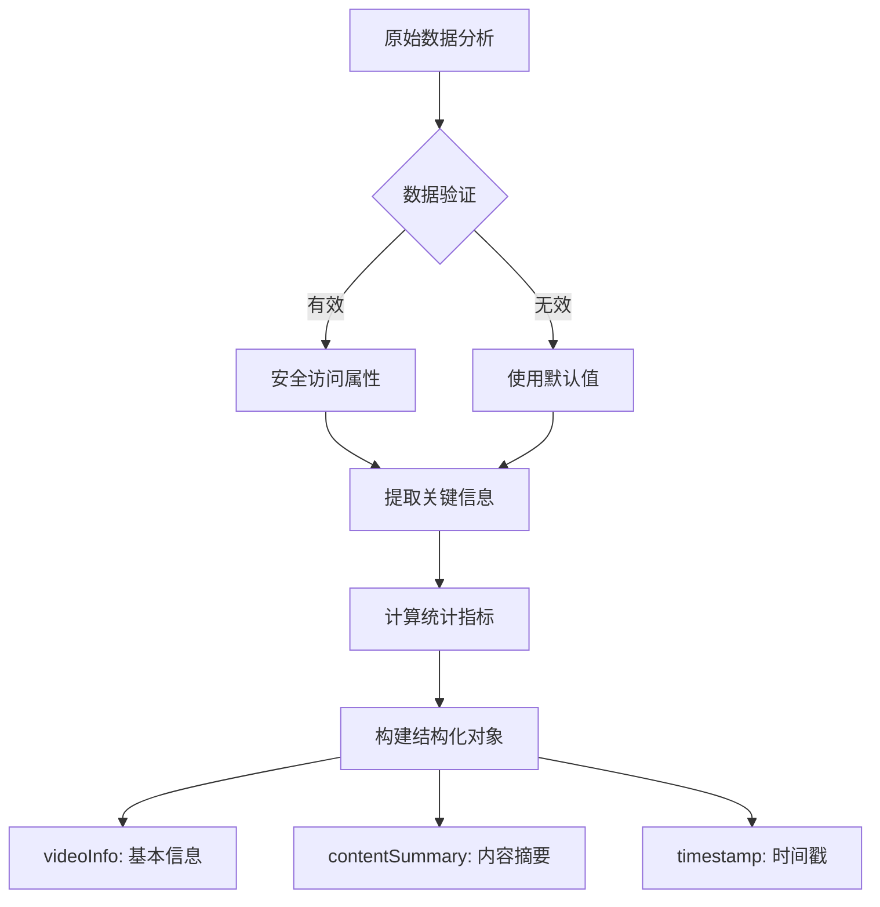
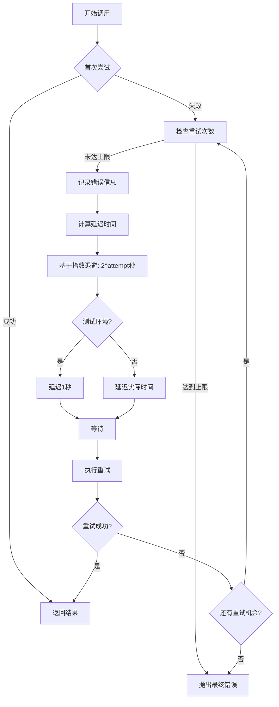
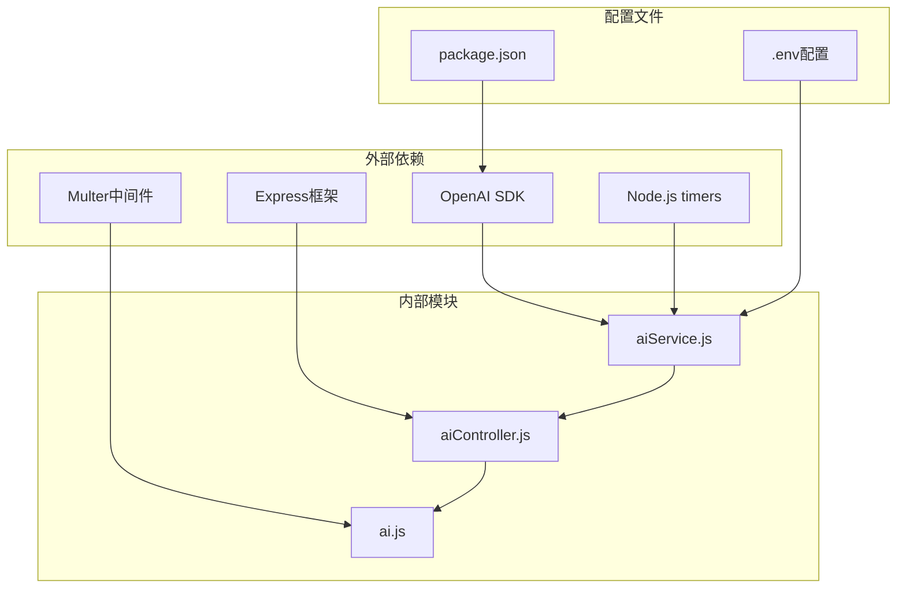

# AI服务

<cite>
**本文档引用的文件**
- [aiService.js](file://backend/src/services/aiService.js)
- [aiController.js](file://backend/src/controllers/aiController.js)
- [ai.js](file://backend/src/routes/ai.js)
- [aiService.test.js](file://backend/tests/services/aiService.test.js)
- [qwen3-VL-视频理解API.md](file://qwen3-VL-视频理解API.md)
- [qwen3-prompt.md](file://qwen3-prompt.md)
</cite>

## 目录
1. [简介](#简介)
2. [项目结构](#项目结构)
3. [核心组件](#核心组件)
4. [架构概览](#架构概览)
5. [详细组件分析](#详细组件分析)
6. [依赖关系分析](#依赖关系分析)
7. [性能考虑](#性能考虑)
8. [故障排除指南](#故障排除指南)
9. [结论](#结论)

## 简介

AI服务是一个基于阿里云通义千问模型的双模型协同架构系统，专门用于视频内容分析和生成专业报告。该系统通过`vlClient`和`textClient`两个OpenAI客户端分别调用qwen-vl-plus和qwen-plus模型，实现了强大的多模态视频理解和文本生成能力。

系统的核心特色包括：
- **双模型协同架构**：qwen-vl-plus负责视频理解，qwen-plus负责文本生成
- **三阶段处理流程**：原始分析 → 数据结构化 → 专业报告生成
- **智能重试机制**：基于指数退避策略的故障恢复
- **多种分析类型**：内容分析、视频融合分析、音乐提示生成

## 项目结构

AI服务的项目结构遵循典型的Express.js应用程序架构，主要分为以下几个层次：

**图表来源**
- [ai.js](file://backend/src/routes/ai.js#L1-L71)
- [aiController.js](file://backend/src/controllers/aiController.js#L1-L237)

**节来源**
- [ai.js](file://backend/src/routes/ai.js#L1-L71)
- [aiController.js](file://backend/src/controllers/aiController.js#L1-L237)

## 核心组件

### AIService 类

AIService 是系统的核心类，负责协调两个OpenAI客户端和处理三阶段分析流程：

**图表来源**
- [aiService.js](file://backend/src/services/aiService.js#L8-L672)

### 双模型架构

系统采用双模型协同架构，每个模型承担不同的职责：

| 模型 | 模型名称 | 主要功能 | 适用场景 |
|------|----------|----------|----------|
| VL模型 | qwen-vl-plus | 视频内容理解、多模态分析 | 视频分析、内容提取 |
| 文本模型 | qwen-plus | 文本生成、报告创作 | 专业报告、创意方案 |

**节来源**
- [aiService.js](file://backend/src/services/aiService.js#L8-L19)

## 架构概览

AI服务的整体架构采用分层设计，实现了清晰的职责分离：

**图表来源**
- [ai.js](file://backend/src/routes/ai.js#L27-L70)
- [aiController.js](file://backend/src/controllers/aiController.js#L5-L237)
- [aiService.js](file://backend/src/services/aiService.js#L8-L672)

## 详细组件分析

### analyzeVideoContent 方法

analyzeVideoContent 方法是系统的核心入口，负责调用qwen-vl-plus模型进行视频内容分析：

**图表来源**
- [aiService.js](file://backend/src/services/aiService.js#L24-L120)
- [aiController.js](file://backend/src/controllers/aiController.js#L13-L43)

#### 多模态请求构造

系统通过构造包含视频URL和结构化Prompt的多模态请求来调用VL模型：

| 请求元素 | 类型 | 描述 | 示例 |
|----------|------|------|------|
| 视频URL | video_url | 视频文件的URL地址 | `{url: "/path/to/video.mp4"}` |
| 系统角色 | text | 系统角色定义 | `"你是一名专业的视频分析师"` |
| 用户提示 | text | 分析任务指令 | 默认的详细分析提示词 |

**节来源**
- [aiService.js](file://backend/src/services/aiService.js#L92-L118)

### generateVideoReport 方法

generateVideoReport 方法根据不同的报告类型生成专业文本内容：

**图表来源**
- [aiService.js](file://backend/src/services/aiService.js#L130-L410)

#### 报告类型详解

| 报告类型 | 目标受众 | 主要内容 | 输出格式 |
|----------|----------|----------|----------|
| content | 视频制作专业人士 | 视频内容深度分析、技术参数解读 | 结构化分析报告 |
| fusion | 视频编辑专家 | 视频融合方案、制作建议 | 专业制作方案 |
| music | 音乐制作人 | 背景音乐创作提示、情感曲线 | AI音乐生成提示 |

**节来源**
- [aiService.js](file://backend/src/services/aiService.js#L134-L369)

### 三阶段处理流程

系统实现了两种三阶段处理流程，分别对应不同的分析需求：

#### 视频内容分析三阶段

**图表来源**
- [aiService.js](file://backend/src/services/aiService.js#L420-L439)

#### 视频融合分析三阶段

**图表来源**
- [aiService.js](file://backend/src/services/aiService.js#L449-L470)

**节来源**
- [aiService.js](file://backend/src/services/aiService.js#L420-L470)

### 数据结构化处理

系统提供了robust的数据结构化处理机制，确保不同类型的数据都能被正确处理：

**图表来源**
- [aiService.js](file://backend/src/services/aiService.js#L480-L531)

#### 安全数据访问

系统实现了多层安全防护机制：

| 安全措施 | 实现方式 | 目的 |
|----------|----------|------|
| 输入验证 | 类型检查、空值检测 | 防止无效数据处理 |
| 属性访问 | safeGet函数 | 避免属性访问错误 |
| 数组处理 | safeLength函数 | 安全获取数组长度 |
| 错误恢复 | 默认值提供 | 确保系统稳定性 |

**节来源**
- [aiService.js](file://backend/src/services/aiService.js#L480-L531)

### callWithRetry 重试机制

callWithRetry 方法实现了基于Qwen官方推荐的指数退避策略的重试机制：

**图表来源**
- [aiService.js](file://backend/src/services/aiService.js#L617-L669)

#### 重试策略详解

| 参数 | 值 | 说明 |
|------|-----|------|
| 最大重试次数 | 3次 | 基于Qwen官方建议 |
| 指数退避系数 | 2^attempt | Qwen官方推荐策略 |
| 测试环境延迟 | 1秒 | 加速测试执行 |
| 生产环境延迟 | 2^attempt秒 | 标准退避策略 |

**节来源**
- [aiService.js](file://backend/src/services/aiService.js#L617-L669)

## 依赖关系分析

AI服务的依赖关系体现了清晰的分层架构：

**图表来源**
- [aiService.js](file://backend/src/services/aiService.js#L1-L2)
- [ai.js](file://backend/src/routes/ai.js#L1-L3)

### 外部API集成

系统通过OpenAI兼容接口与阿里云通义千问API集成：

| API端点 | 功能 | 配置参数 |
|---------|------|----------|
| `/compatible-mode/v1/chat/completions` | 视频内容分析 | qwen-vl-plus模型 |
| `/compatible-mode/v1/chat/completions` | 文本生成 | qwen-plus模型 |
| 基础URL | 区域配置 | 北京/新加坡 |

**节来源**
- [aiService.js](file://backend/src/services/aiService.js#L10-L18)
- [qwen3-VL-视频理解API.md](file://qwen3-VL-视频理解API.md#L32-L38)

## 性能考虑

### 并发处理

系统支持并发视频分析，提高处理效率：

- **视频融合分析**：使用`Promise.all()`并行处理两个视频
- **文件上传限制**：最多支持2个视频文件同时上传
- **内存管理**：及时释放临时文件资源

### 缓存策略

虽然当前实现未包含缓存，但系统设计支持后续添加缓存机制：

- **分析结果缓存**：可缓存常见视频的分析结果
- **模型响应缓存**：缓存API响应减少网络开销
- **配置缓存**：缓存模型配置和提示词模板

### 错误处理

系统实现了多层次的错误处理机制：

- **网络错误重试**：自动重试网络相关错误
- **数据验证**：输入数据的完整性检查
- **异常捕获**：全局异常处理和日志记录

## 故障排除指南

### 常见问题及解决方案

| 问题类型 | 症状 | 可能原因 | 解决方案 |
|----------|------|----------|----------|
| API调用失败 | 视频分析超时 | 网络连接问题 | 检查网络连接，启用重试机制 |
| 认证错误 | 401未授权 | API密钥配置错误 | 验证DASHSCOPE_API_KEY配置 |
| 文件不存在 | 视频文件找不到 | 文件路径错误 | 检查文件路径和权限 |
| JSON解析失败 | 分析结果格式错误 | API返回非JSON数据 | 验证API响应格式 |

### 调试技巧

1. **启用详细日志**：在开发环境中启用详细错误信息
2. **检查API响应**：验证通义千问API的响应格式
3. **测试网络连接**：确保能够访问阿里云API端点
4. **验证文件格式**：确认视频文件格式符合要求

**节来源**
- [aiService.js](file://backend/src/services/aiService.js#L121-L124)
- [aiService.test.js](file://backend/tests/services/aiService.test.js#L175-L221)

## 结论

AI服务通过创新的双模型协同架构和三阶段处理流程，成功实现了强大的视频内容分析和专业报告生成能力。系统的主要优势包括：

### 技术优势

- **双模型协同**：充分利用VL模型和文本模型的专业能力
- **智能重试**：基于Qwen官方推荐的指数退避策略
- **robust数据处理**：多层安全防护确保数据完整性
- **灵活扩展**：清晰的架构设计支持功能扩展

### 应用价值

- **专业视频分析**：为视频制作专业人士提供深度分析
- **创意视频融合**：支持视频内容的创新组合
- **智能音乐创作**：为视频配乐提供专业指导
- **自动化报告生成**：大幅提高内容分析效率

### 发展方向

未来可以考虑的功能增强：
- **模型版本管理**：支持多个模型版本的并行处理
- **实时分析**：支持流式视频内容分析
- **个性化定制**：根据用户偏好调整分析重点
- **多语言支持**：扩展支持更多语言的分析报告

AI服务代表了现代AI技术在多媒体内容分析领域的创新应用，为视频内容产业提供了强有力的技术支撑。