# 上传服务设计与实现文档

<cite>
**本文档引用的文件**
- [uploadService.js](file://backend/src/services/uploadService.js)
- [upload.js](file://backend/src/config/upload.js)
- [uploadController.js](file://backend/src/controllers/uploadController.js)
- [upload.js](file://backend/src/middleware/upload.js)
- [upload.js](file://backend/src/routes/upload.js)
- [FileUploader.vue](file://frontend/src/components/FileUploader.vue)
- [useWebSocket.js](file://frontend/src/composables/useWebSocket.js)
- [fileValidator.js](file://backend/src/utils/fileValidator.js)
- [logger.js](file://backend/src/utils/logger.js)
</cite>

## 目录
1. [概述](#概述)
2. [系统架构](#系统架构)
3. [核心组件分析](#核心组件分析)
4. [会话管理机制](#会话管理机制)
5. [文件验证流程](#文件验证流程)
6. [文件上传处理](#文件上传处理)
7. [实时进度推送](#实时进度推送)
8. [配置管理系统](#配置管理系统)
9. [错误处理与日志记录](#错误处理与日志记录)
10. [性能优化策略](#性能优化策略)
11. [生产环境考虑](#生产环境考虑)
12. [总结](#总结)

## 概述

上传服务是一个基于Node.js和Express的完整文件上传解决方案，采用模块化设计，支持多种视频格式（MP4、AVI），具备实时进度反馈、会话管理和错误恢复能力。该服务通过WebSocket实现实时通信，确保用户能够及时了解上传状态。

### 主要特性

- **多文件上传支持**：单次会话最多支持3个文件
- **实时进度监控**：通过Socket.IO实现实时进度推送
- **严格文件验证**：多重验证机制确保文件质量
- **会话状态管理**：完整的上传生命周期管理
- **错误恢复机制**：支持上传中断后的恢复
- **安全防护**：防止恶意文件上传

## 系统架构

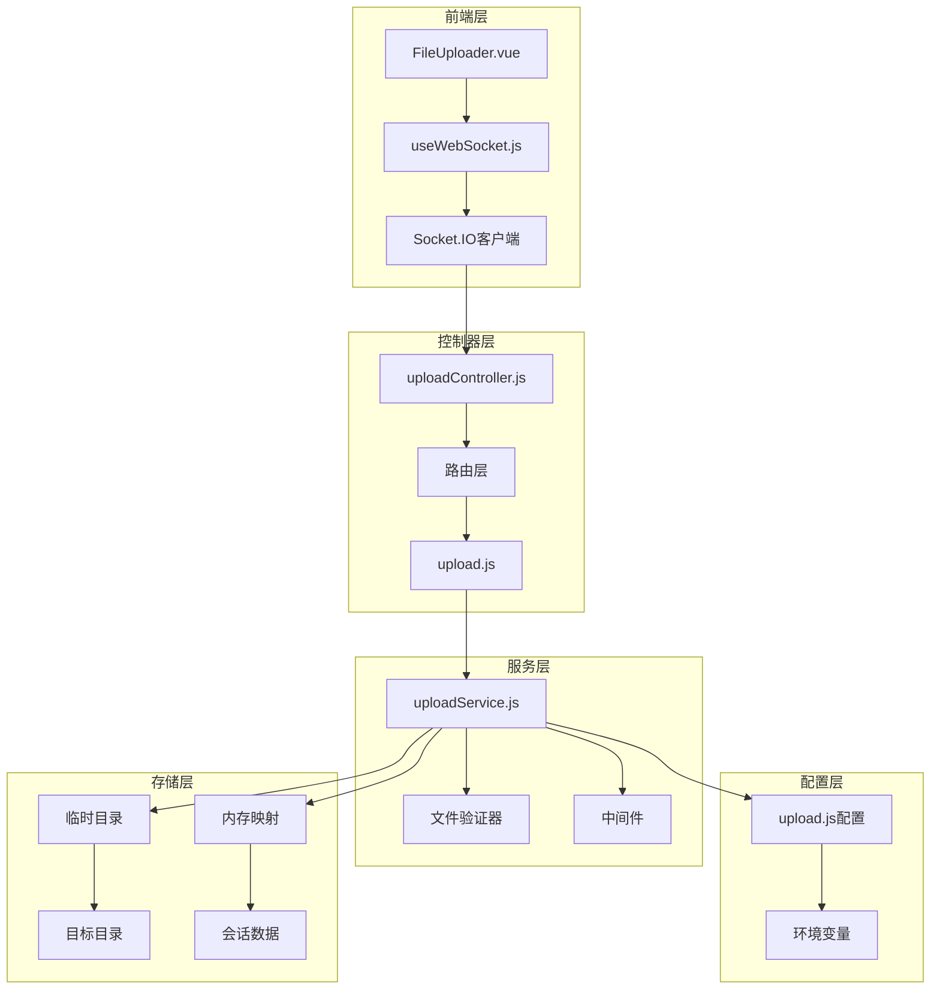

**图表来源**
- [uploadService.js](file://backend/src/services/uploadService.js#L1-L416)
- [uploadController.js](file://backend/src/controllers/uploadController.js#L1-L285)
- [upload.js](file://backend/src/routes/upload.js#L1-L62)

## 核心组件分析

### UploadService类设计

UploadService是整个上传系统的核心，采用单例模式设计，提供完整的文件上传生命周期管理。

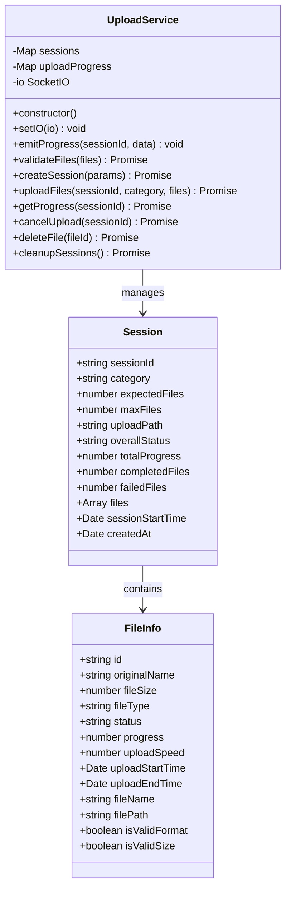

**图表来源**
- [uploadService.js](file://backend/src/services/uploadService.js#L12-L416)

**章节来源**
- [uploadService.js](file://backend/src/services/uploadService.js#L12-L416)

### 内存状态管理机制

服务使用两个Map对象进行内存状态管理：

1. **sessions Map**：存储活跃的上传会话，键为sessionId，值为会话对象
2. **uploadProgress Map**：存储文件级别的上传进度，键为fileId，值为进度信息

这种设计的优势：
- **快速访问**：O(1)时间复杂度的查找操作
- **内存效率**：按需分配内存空间
- **状态隔离**：每个会话的状态相互独立

局限性：
- **重启丢失**：服务器重启会导致状态丢失
- **内存占用**：大量并发上传可能消耗过多内存
- **扩展性限制**：不适合大规模分布式部署

## 会话管理机制

### createSession方法详解

`createSession`方法负责创建新的上传会话，生成唯一标识符并初始化会话状态。

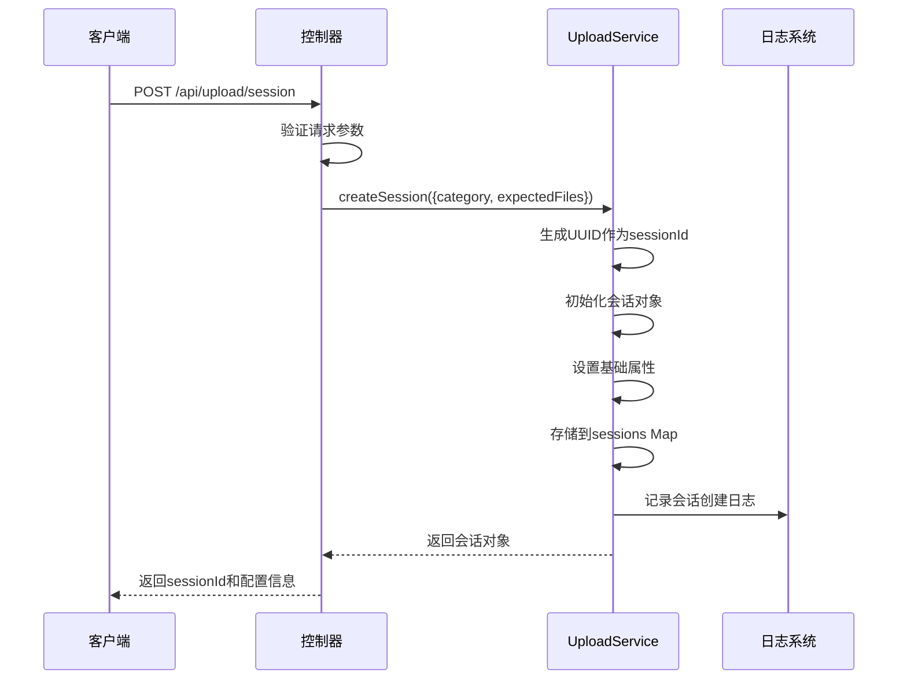

**图表来源**
- [uploadService.js](file://backend/src/services/uploadService.js#L89-L114)
- [uploadController.js](file://backend/src/controllers/uploadController.js#L59-L98)

会话初始化的关键步骤：

1. **唯一标识生成**：使用UUID v4算法生成不可预测的会话ID
2. **基础属性设置**：包括分类、预期文件数、最大文件数等
3. **路径配置**：根据分类确定文件存储路径
4. **状态初始化**：设置初始状态为"pending"
5. **时间戳记录**：记录会话创建时间和开始时间

**章节来源**
- [uploadService.js](file://backend/src/services/uploadService.js#L89-L114)

### 会话状态流转

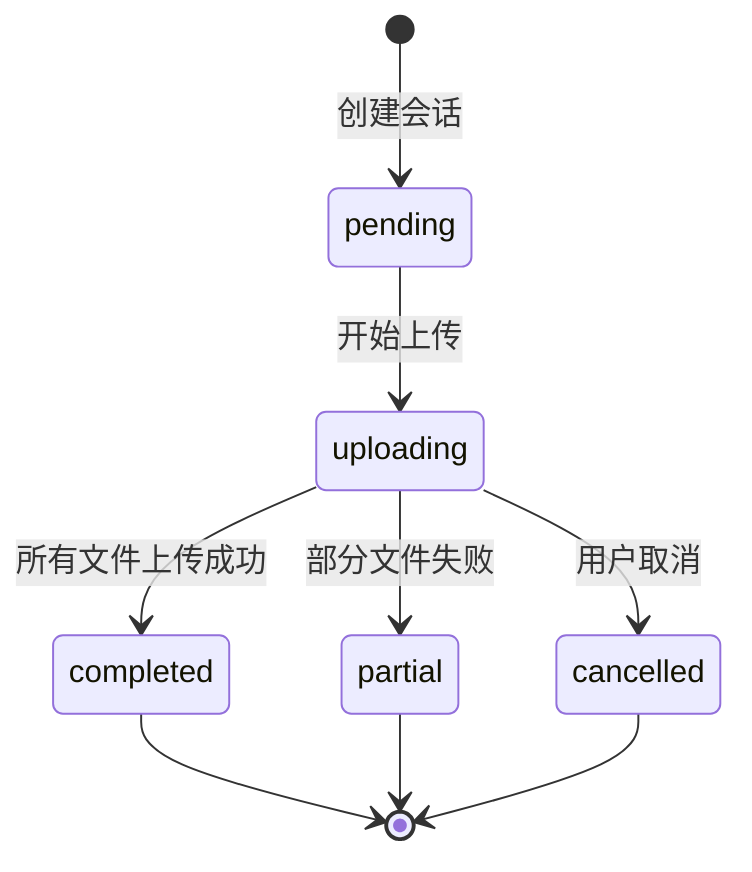

**图表来源**
- [uploadService.js](file://backend/src/services/uploadService.js#L118-L295)

## 文件验证流程

### 多层次验证机制

文件验证采用多层次检查机制，确保上传文件的质量和安全性。

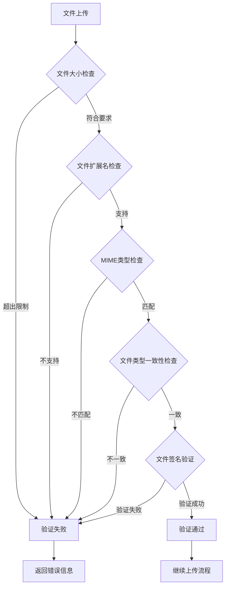

**图表来源**
- [uploadService.js](file://backend/src/services/uploadService.js#L34-L85)
- [fileValidator.js](file://backend/src/utils/fileValidator.js#L37-L64)

### 验证规则详解

| 验证项目 | 规则描述 | 配置参数 | 错误处理 |
|---------|---------|---------|---------|
| 文件大小 | 单文件不超过300MB | `maxFileSize: 300*1024*1024` | 超出限制时标记为无效 |
| 文件扩展名 | 支持.mp4和.avi格式 | `allowedExtensions: ['.mp4', '.avi']` | 不支持的格式拒绝上传 |
| MIME类型 | 匹配视频文件类型 | `allowedMimeTypes: ['video/mp4', 'video/avi']` | 类型不匹配时记录错误 |
| 文件类型一致性 | 所有文件必须相同类型 | 自动检测 | 不一致时统一标记为无效 |
| 文件签名验证 | 检查文件头部魔数 | MP4: ftyp, AVI: RIFF+AVI | 格式验证失败时拒绝 |

**章节来源**
- [uploadService.js](file://backend/src/services/uploadService.js#L34-L85)
- [upload.js](file://backend/src/config/upload.js#L7-L17)

## 文件上传处理

### 分步上传进度模拟

上传过程采用分步模拟的方式，每步200毫秒，模拟真实的上传体验。

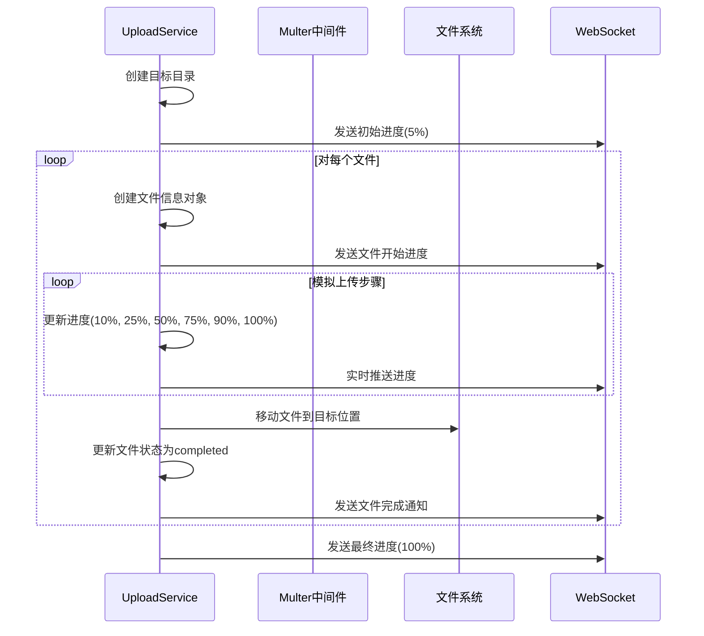

**图表来源**
- [uploadService.js](file://backend/src/services/uploadService.js#L118-L295)

### 文件移动与存储

文件上传的核心流程包括以下步骤：

1. **临时文件处理**：使用Multer中间件将文件暂存到临时目录
2. **目标路径创建**：确保目标目录存在
3. **文件重命名**：根据配置生成唯一文件名
4. **物理移动**：将文件从临时目录移动到目标目录
5. **状态更新**：更新文件和会话状态

**章节来源**
- [uploadService.js](file://backend/src/services/uploadService.js#L118-L295)
- [upload.js](file://backend/src/middleware/upload.js#L1-L110)

### 错误处理机制

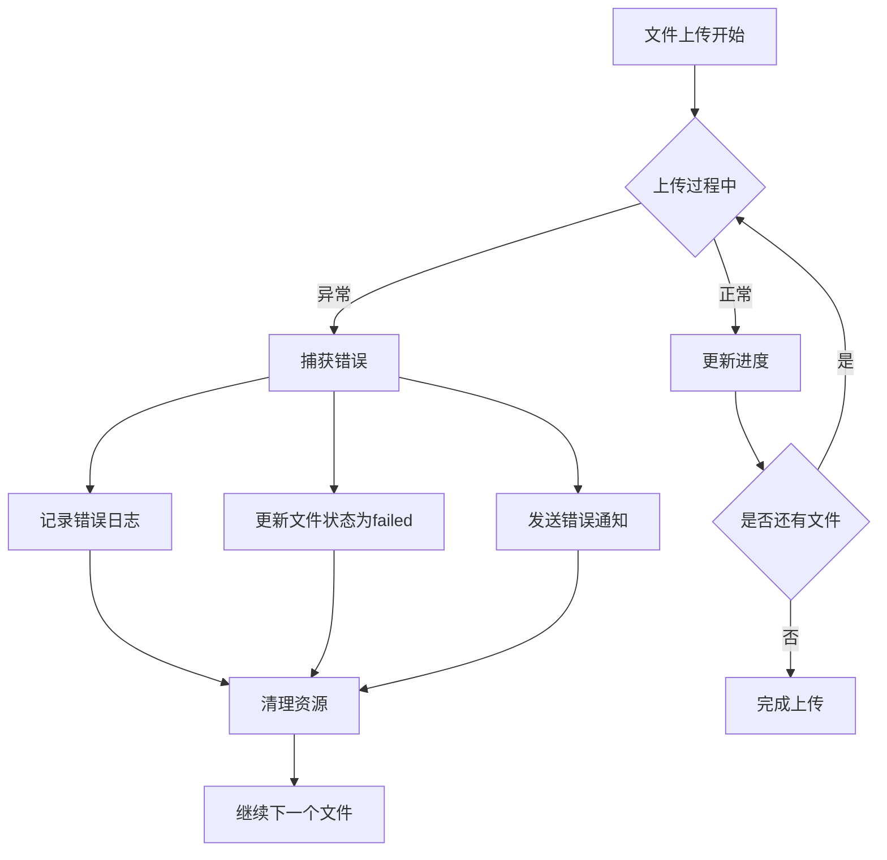

**图表来源**
- [uploadService.js](file://backend/src/services/uploadService.js#L251-L278)

## 实时进度推送

### Socket.IO集成

服务通过`setIO`方法注入Socket.IO实例，实现前后端实时通信。

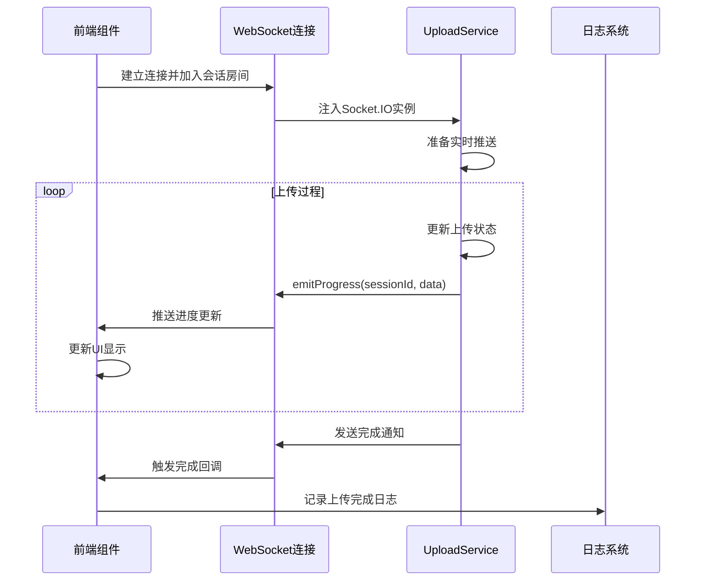

**图表来源**
- [uploadService.js](file://backend/src/services/uploadService.js#L17-L31)
- [useWebSocket.js](file://frontend/src/composables/useWebSocket.js#L21-L87)

### 进度数据结构

每次进度推送包含以下信息：

| 字段名称 | 数据类型 | 描述 | 示例值 |
|---------|---------|------|--------|
| sessionId | string | 会话唯一标识 | "uuid-v4-string" |
| overallStatus | string | 整体上传状态 | "uploading", "completed", "failed" |
| totalProgress | number | 总体进度百分比 | 75 |
| completedFiles | number | 已完成文件数 | 2 |
| failedFiles | number | 失败文件数 | 0 |
| currentFile | object | 当前处理文件信息 | 包含进度、速度等 |
| message | string | 状态消息 | "正在上传文件..." |
| timestamp | string | 时间戳 | ISO格式时间字符串 |

**章节来源**
- [uploadService.js](file://backend/src/services/uploadService.js#L23-L31)
- [useWebSocket.js](file://frontend/src/composables/useWebSocket.js#L52-L76)

### getProgress方法实现

`getProgress`方法用于查询当前上传进度，计算预估剩余时间。

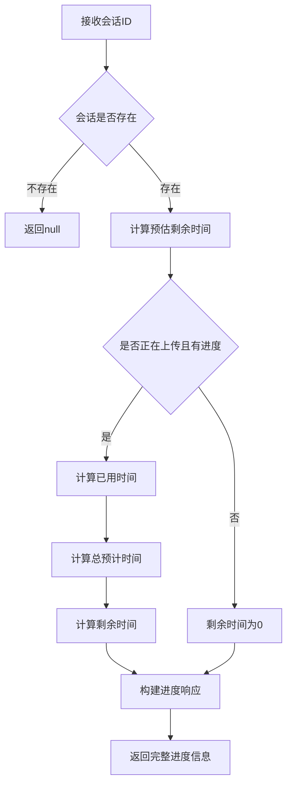

**图表来源**
- [uploadService.js](file://backend/src/services/uploadService.js#L298-L322)

**章节来源**
- [uploadService.js](file://backend/src/services/uploadService.js#L298-L322)

## 配置管理系统

### 配置项详解

上传服务的配置通过集中式配置文件管理，支持环境变量覆盖。

| 配置类别 | 配置项 | 默认值 | 环境变量 | 说明 |
|---------|-------|-------|---------|------|
| 服务器配置 | port | 8005 | PORT | 服务监听端口 |
| 文件限制 | maxFileSize | 300MB | MAX_FILE_SIZE | 单文件最大大小 |
| 文件限制 | maxFilesPerSession | 3 | MAX_FILES_PER_SESSION | 单次会话最大文件数 |
| 允许格式 | allowedMimeTypes | video/mp4, video/avi | - | 支持的MIME类型 |
| 允许格式 | allowedExtensions | .mp4, .avi | - | 支持的文件扩展名 |
| 目录配置 | uploadBaseDir | ../../upload | UPLOAD_BASE_DIR | 上传文件根目录 |
| 目录配置 | categoryPaths | personal/scenic | - | 分类对应的存储路径 |
| 文件命名 | generateFileName | sessionId_timestamp_name | - | 文件名生成规则 |
| 会话管理 | sessionTimeout | 24小时 | - | 会话超时时间 |
| 清理配置 | cleanupInterval | 1小时 | - | 会话清理间隔 |
| 安全配置 | maxRequestSize | 500MB | - | 最大请求大小 |
| 安全配置 | rateLimitWindowMs | 15分钟 | RATE_LIMIT_WINDOW | 限流窗口时间 |
| 安全配置 | rateLimitMax | 100 | RATE_LIMIT_MAX | 限流最大请求数 |

**章节来源**
- [upload.js](file://backend/src/config/upload.js#L1-L53)

### 动态配置加载

配置系统支持运行时配置修改，通过环境变量实现灵活部署：

```javascript
// 环境变量优先级高于默认配置
const config = {
  maxFileSize: parseInt(process.env.MAX_FILE_SIZE) || 300 * 1024 * 1024,
  allowedExtensions: ['.mp4', '.avi'],
  categoryPaths: {
    personal: '/backend/upload/personal/',
    scenic: '/backend/upload/scenic/'
  }
};
```

## 错误处理与日志记录

### 多层级错误处理

系统采用多层级错误处理机制，确保各种异常情况都能得到妥善处理。

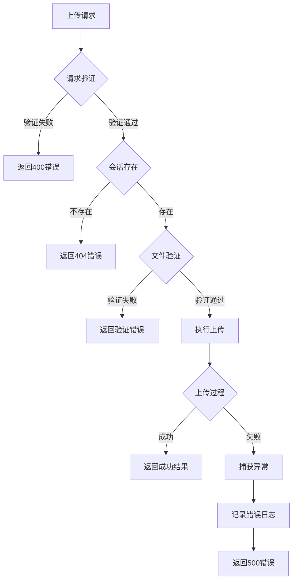

**图表来源**
- [uploadController.js](file://backend/src/controllers/uploadController.js#L27-L146)

### 日志系统设计

日志系统采用Winston库，提供结构化日志记录和分级管理。

| 日志级别 | 使用场景 | 输出目标 | 示例 |
|---------|---------|---------|------|
| error | 系统错误、异常 | error.log | 文件上传失败 |
| warn | 警告信息 | combined.log | 连接超时 |
| info | 一般信息 | combined.log | 会话创建成功 |
| user | 用户操作日志 | combined.log | 文件删除成功 |
| dev | 开发调试信息 | combined.log | 文件验证详情 |

**章节来源**
- [logger.js](file://backend/src/utils/logger.js#L1-L66)

### 异常恢复机制

系统提供多种异常恢复机制：

1. **会话超时清理**：自动清理长时间未活动的会话
2. **文件删除恢复**：支持删除失败的文件重新上传
3. **网络中断恢复**：WebSocket断线后自动重连
4. **上传中断恢复**：支持暂停后继续上传

## 性能优化策略

### 内存管理优化

1. **定时清理机制**：每小时清理过期会话，防止内存泄漏
2. **会话超时控制**：24小时无活动自动清理
3. **临时文件管理**：上传完成后立即清理临时文件

### 并发处理优化

1. **文件串行处理**：避免同时处理多个文件导致的资源竞争
2. **进度计算优化**：使用简单数学公式计算预估时间
3. **内存状态管理**：使用Map对象提供高效的查找性能

### 网络传输优化

1. **WebSocket长连接**：减少HTTP请求开销
2. **增量进度推送**：只推送变化的进度信息
3. **连接池管理**：合理管理Socket.IO连接

**章节来源**
- [uploadService.js](file://backend/src/services/uploadService.js#L393-L416)

## 生产环境考虑

### 可扩展性问题

当前设计在生产环境中面临以下挑战：

1. **内存状态存储**：会话数据存储在内存中，重启后丢失
2. **水平扩展限制**：单实例部署，无法支持多节点扩展
3. **持久化缺失**：文件元数据和上传状态需要持久化

### 解决方案建议

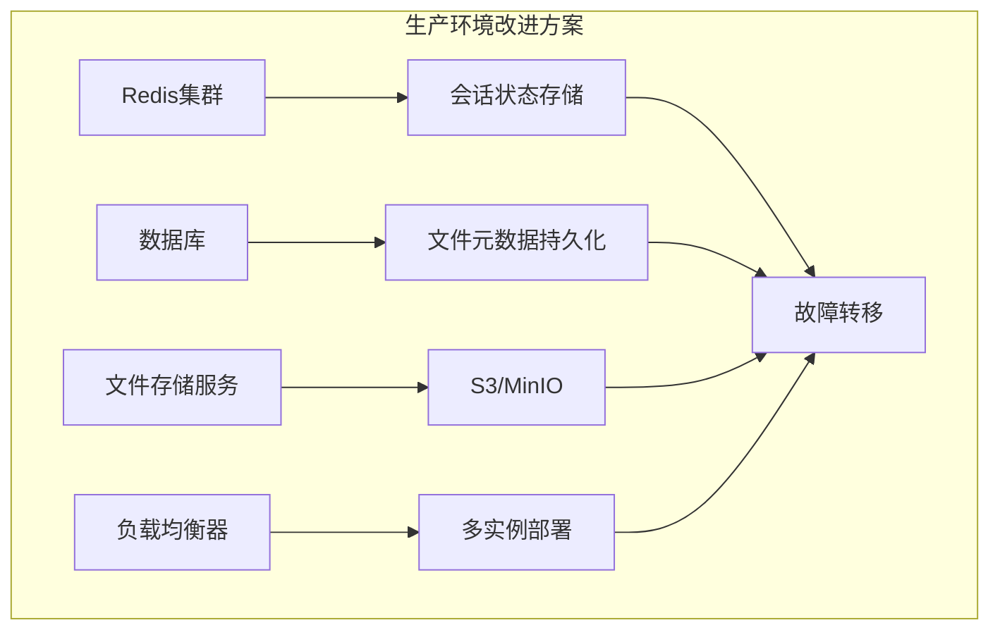

### 安全加固措施

1. **文件签名验证**：双重验证确保文件真实性
2. **路径遍历防护**：严格限制文件存储路径
3. **速率限制**：防止DDoS攻击
4. **文件大小限制**：防止存储溢出攻击

### 监控与告警

建议添加以下监控指标：

| 监控指标 | 监控目的 | 告警阈值 |
|---------|---------|---------|
| 上传成功率 | 服务质量监控 | < 95% |
| 平均上传时间 | 性能监控 | > 30秒 |
| 内存使用率 | 资源监控 | > 80% |
| 错误率 | 系统稳定性 | > 5% |
| 并发上传数 | 扩展性监控 | > 100 |

## 总结

上传服务展现了现代Web应用中文件上传系统的最佳实践，具有以下特点：

### 技术亮点

1. **模块化设计**：清晰的职责分离，便于维护和扩展
2. **实时通信**：基于Socket.IO的实时进度推送
3. **严格验证**：多层次文件验证确保系统安全
4. **状态管理**：完善的会话生命周期管理
5. **错误处理**：全面的异常处理和恢复机制

### 架构优势

- **可扩展性**：良好的模块化设计支持功能扩展
- **可维护性**：清晰的代码结构和完善的注释
- **可测试性**：独立的服务单元便于单元测试
- **可观测性**：完整的日志记录和监控支持

### 改进建议

1. **持久化存储**：引入Redis或数据库存储会话状态
2. **分布式支持**：支持多实例部署和负载均衡
3. **CDN集成**：支持云存储服务提升性能
4. **压缩支持**：考虑支持压缩文件上传
5. **断点续传**：实现大文件的断点续传功能

该上传服务为视频内容分析平台提供了稳定可靠的文件上传基础设施，支撑着整个系统的数据采集和处理流程。