# 服务层设计

<cite>
**本文档引用的文件**
- [aiService.js](file://backend/src/services/aiService.js)
- [uploadService.js](file://backend/src/services/uploadService.js)
- [aiController.js](file://backend/src/controllers/aiController.js)
- [uploadController.js](file://backend/src/controllers/uploadController.js)
- [upload.js](file://backend/src/config/upload.js)
- [fileValidator.js](file://backend/src/utils/fileValidator.js)
- [logger.js](file://backend/src/utils/logger.js)
- [aiService.test.js](file://backend/tests/services/aiService.test.js)
</cite>

## 目录
1. [引言](#引言)
2. [项目架构概览](#项目架构概览)
3. [核心服务模块](#核心服务模块)
4. [AI服务模块详解](#ai服务模块详解)
5. [上传服务模块详解](#上传服务模块详解)
6. [服务间依赖关系](#服务间依赖关系)
7. [异常传播机制](#异常传播机制)
8. [异步任务调度与Promise处理](#异步任务调度与promise处理)
9. [性能考虑](#性能考虑)
10. [故障排除指南](#故障排除指南)
11. [总结](#总结)

## 引言

本文档深入阐述了新视频项目（NewVedio）服务层的设计与实现，重点聚焦于两个核心服务模块：`aiService.js`和`uploadService.js`。该服务层采用了现代化的微服务架构设计，通过双模型协同架构实现视频内容分析和文件上传管理功能，为前端应用提供了强大的后端支撑能力。

服务层设计遵循单一职责原则，每个服务模块专注于特定的功能领域，同时通过精心设计的接口实现模块间的松耦合通信。这种架构不仅提高了系统的可维护性和可扩展性，还为复杂的视频分析任务提供了可靠的处理能力。

## 项目架构概览

系统采用分层架构设计，服务层位于中间层，负责协调控制器层和数据访问层之间的交互。整个架构体现了清晰的职责分离和良好的可扩展性。

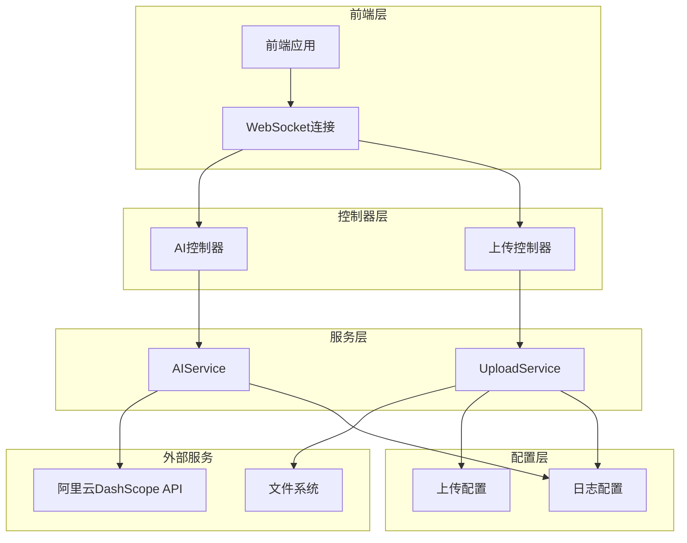

**图表来源**
- [aiController.js](file://backend/src/controllers/aiController.js#L1-L20)
- [uploadController.js](file://backend/src/controllers/uploadController.js#L1-L20)
- [aiService.js](file://backend/src/services/aiService.js#L1-L30)
- [uploadService.js](file://backend/src/services/uploadService.js#L1-L30)

**章节来源**
- [aiController.js](file://backend/src/controllers/aiController.js#L1-L50)
- [uploadController.js](file://backend/src/controllers/uploadController.js#L1-L50)
- [aiService.js](file://backend/src/services/aiService.js#L1-L50)
- [uploadService.js](file://backend/src/services/uploadService.js#L1-L50)

## 核心服务模块

### 服务模块架构设计

服务层由两个核心模块组成，每个模块都实现了独立的功能域，通过依赖注入的方式在控制器中初始化和使用。

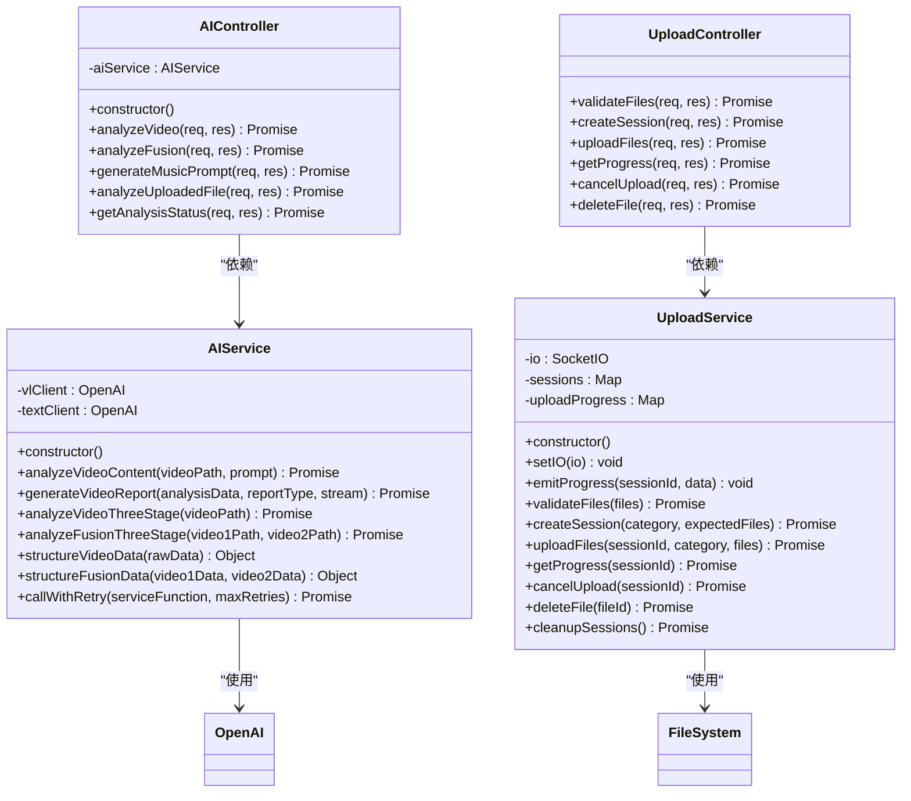

**图表来源**
- [aiService.js](file://backend/src/services/aiService.js#L8-L20)
- [uploadService.js](file://backend/src/services/uploadService.js#L12-L25)
- [aiController.js](file://backend/src/controllers/aiController.js#L5-L10)
- [uploadController.js](file://backend/src/controllers/uploadController.js#L25-L30)

### 模块职责划分

**AI服务模块**专注于视频内容分析和智能生成：
- 视频理解分析（qwen3-VL模型）
- 文本生成和报告创作（qwen-plus模型）
- 三阶段处理流程
- 重试机制和异常处理

**上传服务模块**负责文件管理和会话控制：
- 文件验证和类型检查
- 上传会话管理
- 实时进度跟踪
- 文件生命周期管理

**章节来源**
- [aiService.js](file://backend/src/services/aiService.js#L1-L50)
- [uploadService.js](file://backend/src/services/uploadService.js#L1-L50)

## AI服务模块详解

### 双模型协同架构

AI服务模块采用了创新的双模型协同架构，结合了qwen3-VL（视频理解）和qwen-plus（文本生成）两个模型的优势，实现了从视频内容提取到专业报告生成的完整流程。

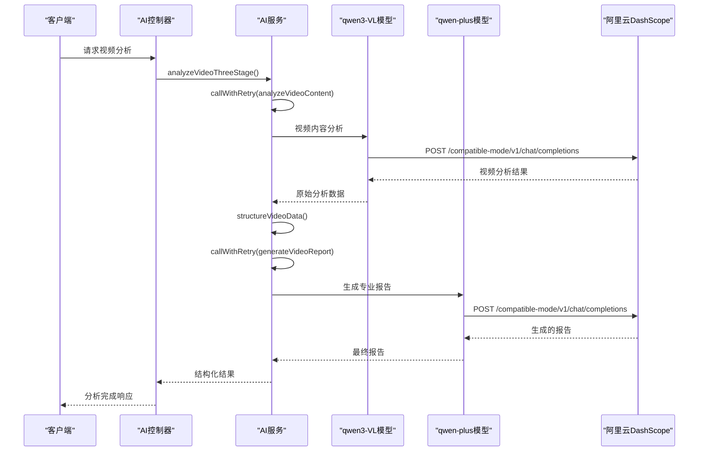

**图表来源**
- [aiService.js](file://backend/src/services/aiService.js#L420-L440)
- [aiService.js](file://backend/src/services/aiService.js#L446-L475)
- [aiController.js](file://backend/src/controllers/aiController.js#L13-L50)

### 多模态数据处理

AI服务在处理视频分析时，采用了先进的多模态数据提交方式，支持视频帧和文本提示词的联合分析。

#### 请求头构造与认证

服务通过OpenAI SDK封装了对阿里云DashScope API的调用，自动处理认证和请求格式化：

```javascript
// AI服务初始化示例（代码片段路径）
const openai = require('openai');
const client = new openai.OpenAI({
  apiKey: process.env.DASHSCOPE_API_KEY,
  baseURL: 'https://dashscope.aliyuncs.com/compatible-mode/v1',
});
```

#### 视频分析流程

视频分析采用三阶段处理流程，确保分析质量和可靠性：

1. **阶段1：视频理解分析**
   - 使用qwen3-VL模型分析视频内容
   - 提取关键帧、场景、物体和动作信息
   - 生成结构化数据

2. **阶段2：数据结构化**
   - 清洗和验证原始分析数据
   - 转换为标准化的数据结构
   - 添加时间戳和元数据

3. **阶段3：报告生成**
   - 使用qwen-plus模型生成专业报告
   - 支持多种报告类型（内容分析、视频融合、音乐提示）
   - 提供流式和非流式响应选项

**章节来源**
- [aiService.js](file://backend/src/services/aiService.js#L24-L125)
- [aiService.js](file://backend/src/services/aiService.js#L418-L444)
- [aiService.js](file://backend/src/services/aiService.js#L446-L475)

### 流式响应处理

AI服务支持流式响应处理，特别是在生成大型报告时提供更好的用户体验：

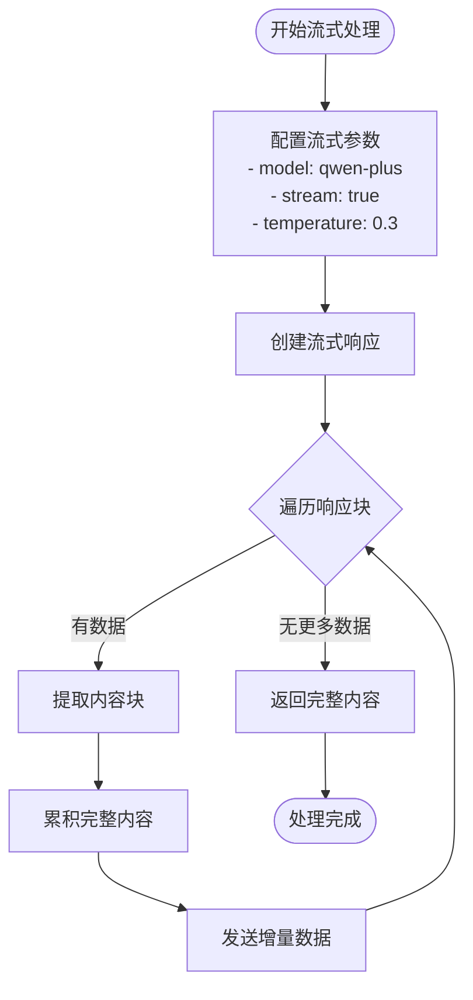

**图表来源**
- [aiService.js](file://backend/src/services/aiService.js#L393-L406)

### 重试机制设计

AI服务实现了基于指数退避策略的智能重试机制，确保服务调用的可靠性：

#### 重试策略算法

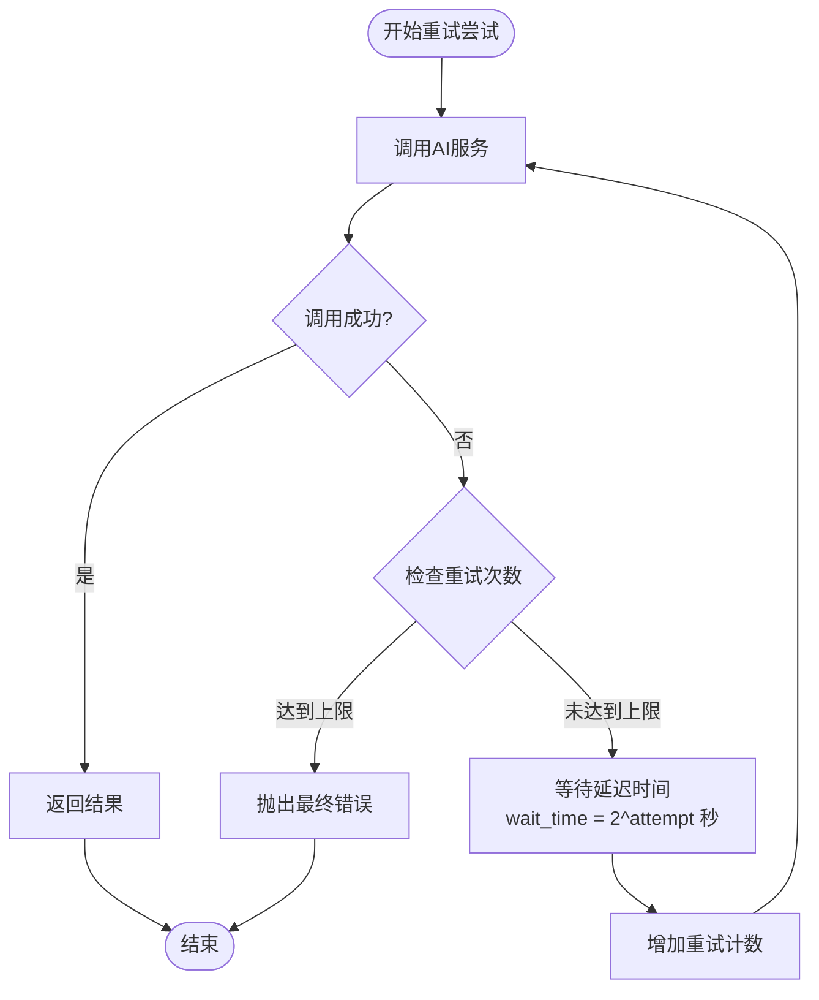

**图表来源**
- [aiService.js](file://backend/src/services/aiService.js#L617-L669)

#### 错误处理与增强

重试机制不仅提供基本的重试功能，还增强了错误信息以便于调试：

- **错误信息增强**：保留原始错误的所有属性
- **重试统计**：记录重试次数和尝试详情
- **状态码映射**：将AI服务错误映射为标准HTTP状态码

**章节来源**
- [aiService.js](file://backend/src/services/aiService.js#L617-L672)

## 上传服务模块详解

### 文件存储管理体系

上传服务模块构建了一个完整的文件存储管理体系，支持多种文件类型的上传、验证和管理。

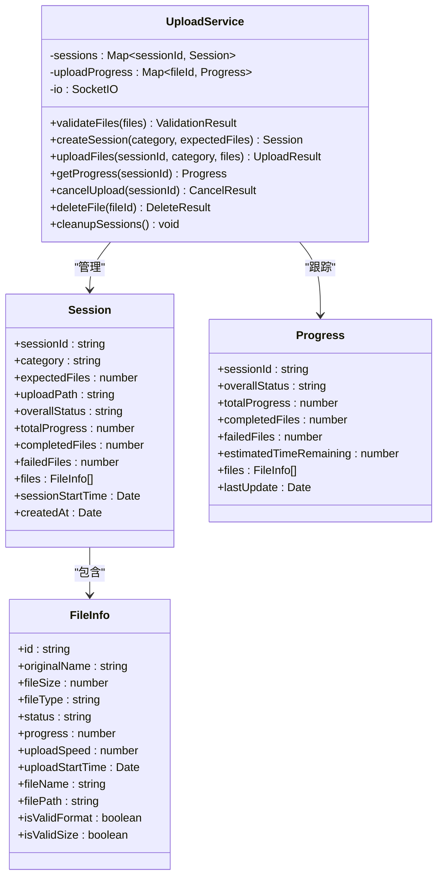

**图表来源**
- [uploadService.js](file://backend/src/services/uploadService.js#L12-L25)
- [uploadService.js](file://backend/src/services/uploadService.js#L89-L115)
- [uploadService.js](file://backend/src/services/uploadService.js#L148-L170)

### 临时路径生成与分类归档

上传服务实现了智能的文件命名和分类归档机制：

#### 文件命名策略

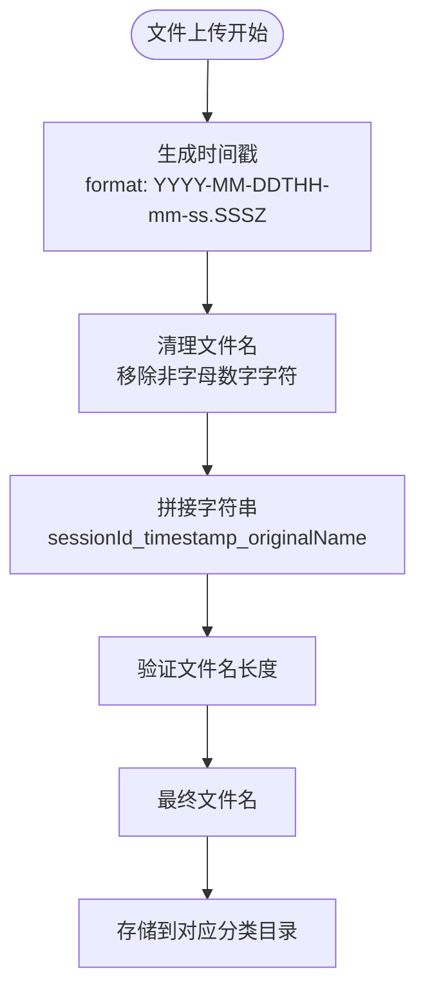

**图表来源**
- [upload.js](file://backend/src/config/upload.js#L29-L33)

#### 分类归档机制

系统支持两种主要的文件分类：
- **personal**：个人视频文件
- **scenic**：风景视频文件

每种分类都有对应的存储路径和配置参数，确保文件的有序管理和快速检索。

**章节来源**
- [uploadService.js](file://backend/src/services/uploadService.js#L118-L296)
- [upload.js](file://backend/src/config/upload.js#L23-L26)

### 元数据维护与追踪

上传服务维护了详细的文件元数据，支持实时进度追踪和状态管理：

#### 进度追踪机制

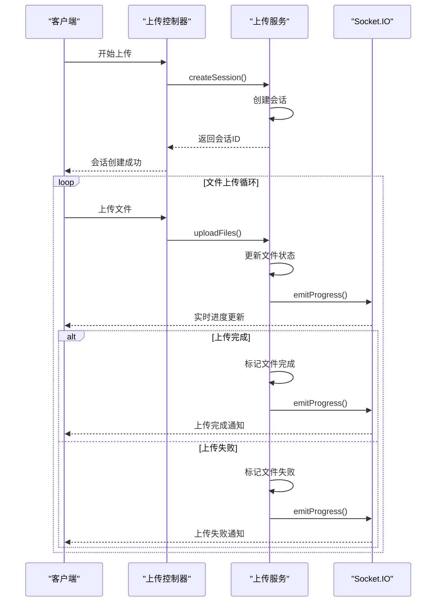

**图表来源**
- [uploadService.js](file://backend/src/services/uploadService.js#L22-L31)
- [uploadService.js](file://backend/src/services/uploadService.js#L135-L295)

#### 会话生命周期管理

上传服务实现了完整的会话生命周期管理，包括创建、监控、清理等功能：

- **会话创建**：生成唯一标识符和初始状态
- **状态监控**：实时跟踪上传进度和状态
- **超时清理**：自动清理长时间未完成的会话
- **资源回收**：定期清理过期的临时文件

**章节来源**
- [uploadService.js](file://backend/src/services/uploadService.js#L89-L115)
- [uploadService.js](file://backend/src/services/uploadService.js#L298-L323)
- [uploadService.js](file://backend/src/services/uploadService.js#L326-L354)

## 服务间依赖关系

### 上传完成触发AI分析

系统设计了一个巧妙的服务间依赖关系，当文件上传完成后自动触发AI分析流程：

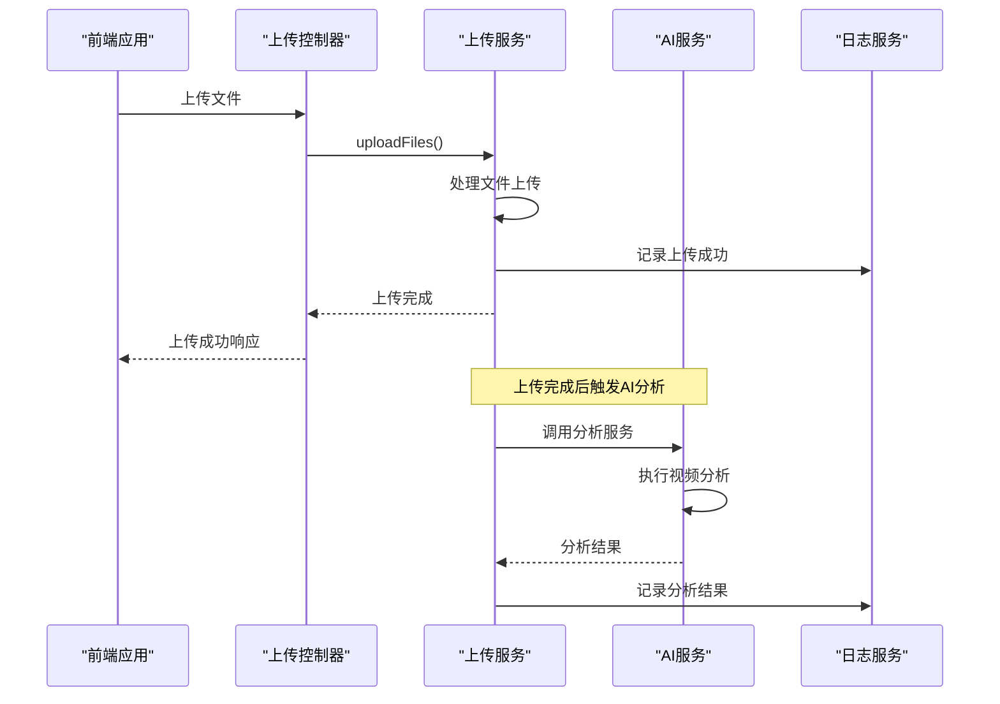

**图表来源**
- [uploadController.js](file://backend/src/controllers/uploadController.js#L102-L147)
- [uploadService.js](file://backend/src/services/uploadService.js#L118-L296)

### 实时通信机制

系统通过Socket.IO实现实时通信，确保用户能够及时获取上传和分析的状态更新：

#### WebSocket连接管理

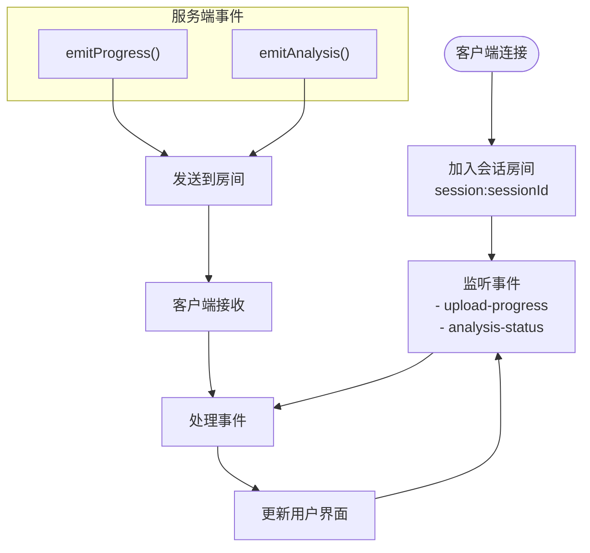

**图表来源**
- [uploadService.js](file://backend/src/services/uploadService.js#L22-L31)

**章节来源**
- [uploadController.js](file://backend/src/controllers/uploadController.js#L102-L147)
- [uploadService.js](file://backend/src/services/uploadService.js#L18-L21)

## 异常传播机制

### 分层异常处理

系统实现了分层的异常处理机制，确保错误能够在适当的层级得到处理：

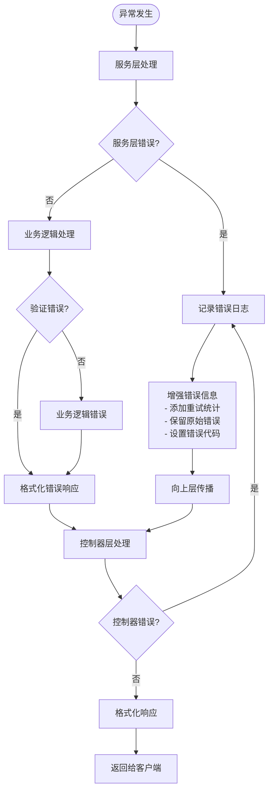

**图表来源**
- [aiService.js](file://backend/src/services/aiService.js#L121-L124)
- [uploadService.js](file://backend/src/services/uploadService.js#L251-L260)

### 错误恢复策略

系统针对不同类型的服务错误实现了相应的恢复策略：

#### AI服务错误恢复

- **网络超时**：自动重试，指数退避
- **API认证失败**：检查配置，记录详细错误
- **模型不可用**：降级处理，返回缓存结果
- **输入数据无效**：数据验证和清洗

#### 上传服务错误恢复

- **文件写入失败**：检查磁盘空间，清理临时文件
- **并发冲突**：乐观锁机制，重试处理
- **网络中断**：断点续传，状态恢复
- **权限问题**：权限检查，权限修正

**章节来源**
- [aiService.js](file://backend/src/services/aiService.js#L121-L124)
- [uploadService.js](file://backend/src/services/uploadService.js#L251-L260)

## 异步任务调度与Promise处理

### Promise链式调用模式

系统大量使用Promise链式调用来处理异步操作，确保代码的可读性和可维护性：

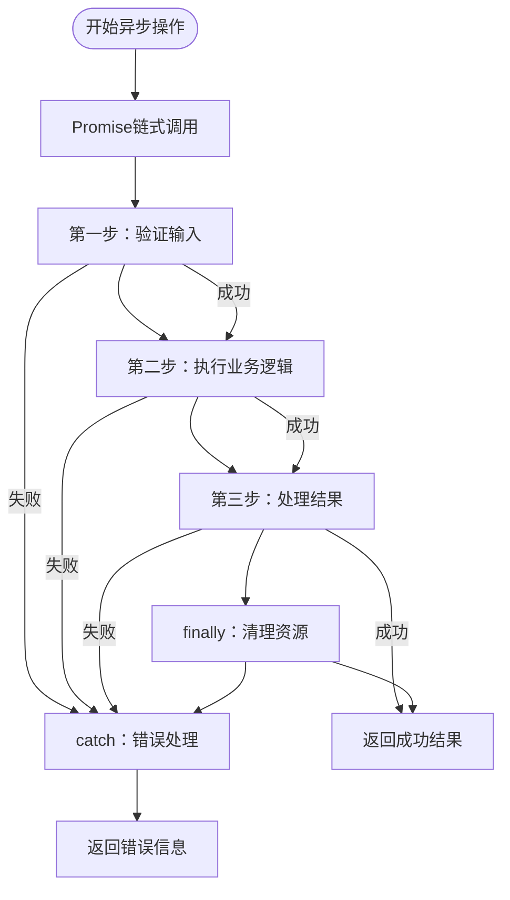

**图表来源**
- [aiService.js](file://backend/src/services/aiService.js#L420-L444)
- [aiService.js](file://backend/src/services/aiService.js#L446-L475)

### 并发控制与资源管理

系统实现了智能的并发控制机制，确保资源的有效利用：

#### 并发处理策略

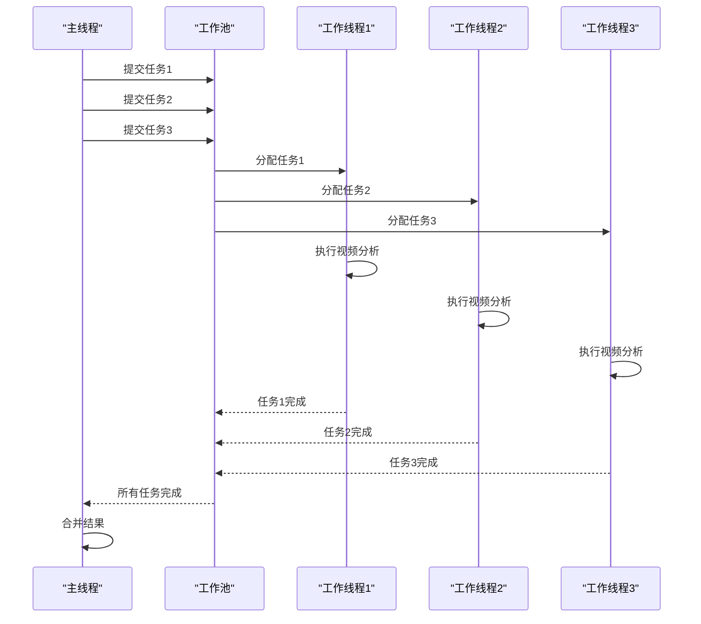

**图表来源**
- [aiService.js](file://backend/src/services/aiService.js#L452-L461)

### 超时与取消机制

系统实现了完善的超时和取消机制，防止长时间运行的任务影响系统性能：

#### 超时处理流程

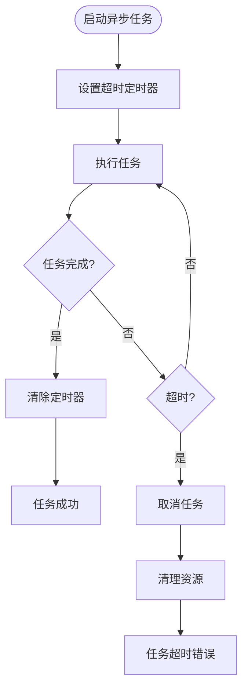

**图表来源**
- [aiService.js](file://backend/src/services/aiService.js#L617-L669)

**章节来源**
- [aiService.js](file://backend/src/services/aiService.js#L420-L475)
- [uploadService.js](file://backend/src/services/uploadService.js#L144-L296)

## 性能考虑

### 缓存策略

系统实现了多层次的缓存策略来提高性能：

- **内存缓存**：会话状态和进度信息
- **文件缓存**：分析结果和中间数据
- **数据库缓存**：长期存储的分析记录

### 资源优化

- **连接池管理**：复用HTTP连接
- **内存管理**：及时释放大对象
- **垃圾回收**：主动触发垃圾回收

### 监控指标

系统收集关键性能指标：
- API响应时间
- 错误率统计
- 资源使用情况
- 用户体验指标

## 故障排除指南

### 常见问题诊断

#### AI服务问题

1. **API调用失败**
   - 检查DASHSCOPE_API_KEY配置
   - 验证网络连接
   - 查看重试日志

2. **视频分析超时**
   - 增加超时配置
   - 优化视频文件大小
   - 检查模型负载

#### 上传服务问题

1. **文件上传失败**
   - 检查文件大小限制
   - 验证文件格式支持
   - 查看磁盘空间

2. **进度更新丢失**
   - 检查WebSocket连接
   - 验证会话ID有效性
   - 查看Socket.IO配置

### 日志分析

系统提供了详细的日志记录，便于问题诊断：

```javascript
// 日志级别说明（代码片段路径）
logger.user('用户操作日志')
logger.dev('开发调试日志')
logger.error('错误日志')
```

**章节来源**
- [logger.js](file://backend/src/utils/logger.js#L48-L66)
- [aiService.js](file://backend/src/services/aiService.js#L121-L124)
- [uploadService.js](file://backend/src/services/uploadService.js#L251-L260)

## 总结

新视频项目的服务层设计体现了现代软件架构的最佳实践，通过精心设计的模块化结构和完善的异常处理机制，为复杂的视频分析任务提供了可靠的技术支撑。

### 设计亮点

1. **模块化架构**：清晰的职责分离和良好的可扩展性
2. **双模型协同**：充分利用AI模型的优势，提供高质量的分析结果
3. **实时通信**：通过WebSocket实现实时状态更新
4. **智能重试**：基于指数退避的重试机制确保服务可靠性
5. **完善的异常处理**：分层的错误处理和恢复策略

### 技术创新

- **三阶段处理流程**：确保分析质量和结果的准确性
- **流式响应处理**：提升用户体验和系统效率
- **智能文件管理**：自动化的文件分类和存储策略
- **并发控制机制**：高效的资源利用和任务调度

该服务层设计不仅满足了当前的功能需求，还为未来的功能扩展和性能优化奠定了坚实的基础，是现代Web应用服务层设计的优秀范例。