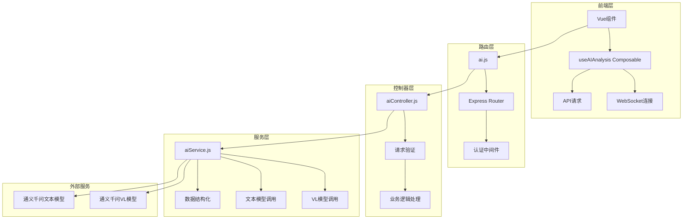
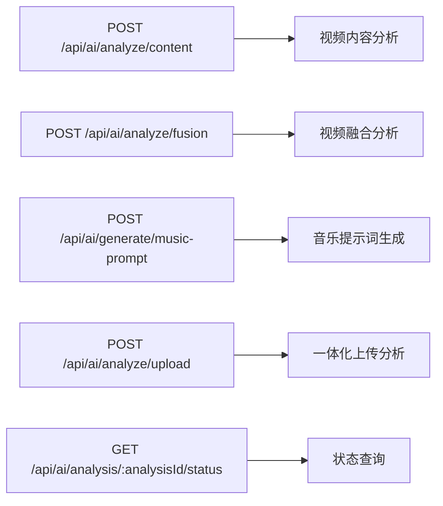
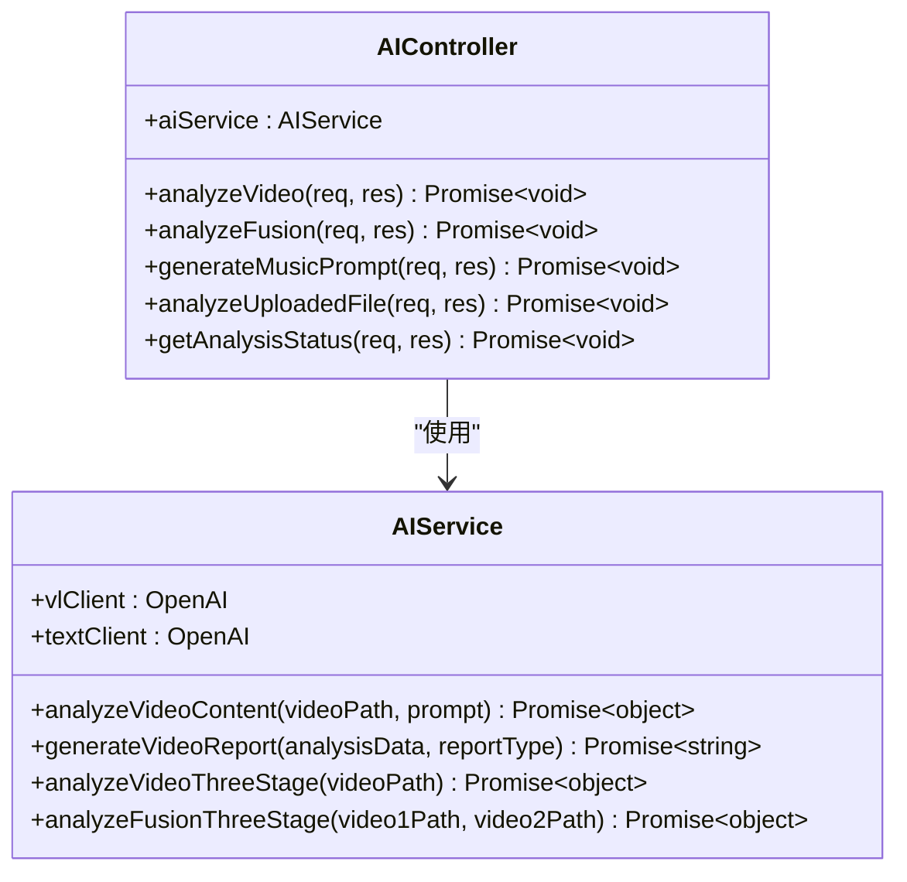
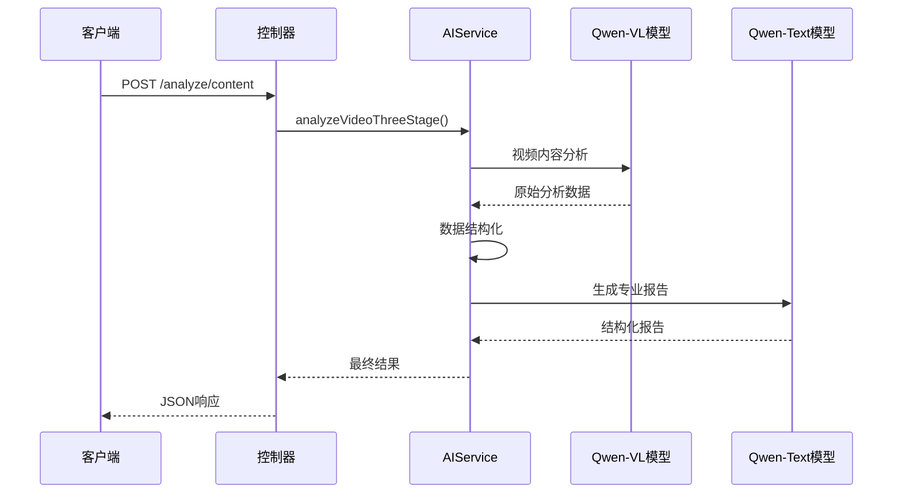
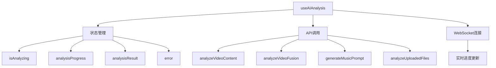
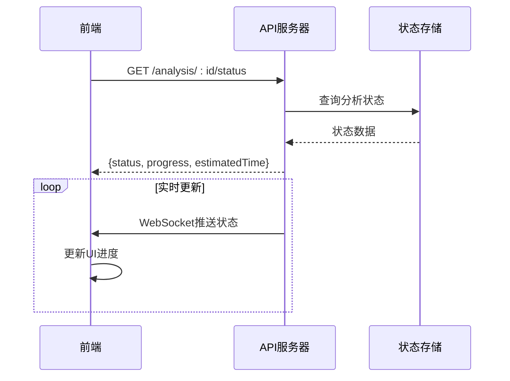
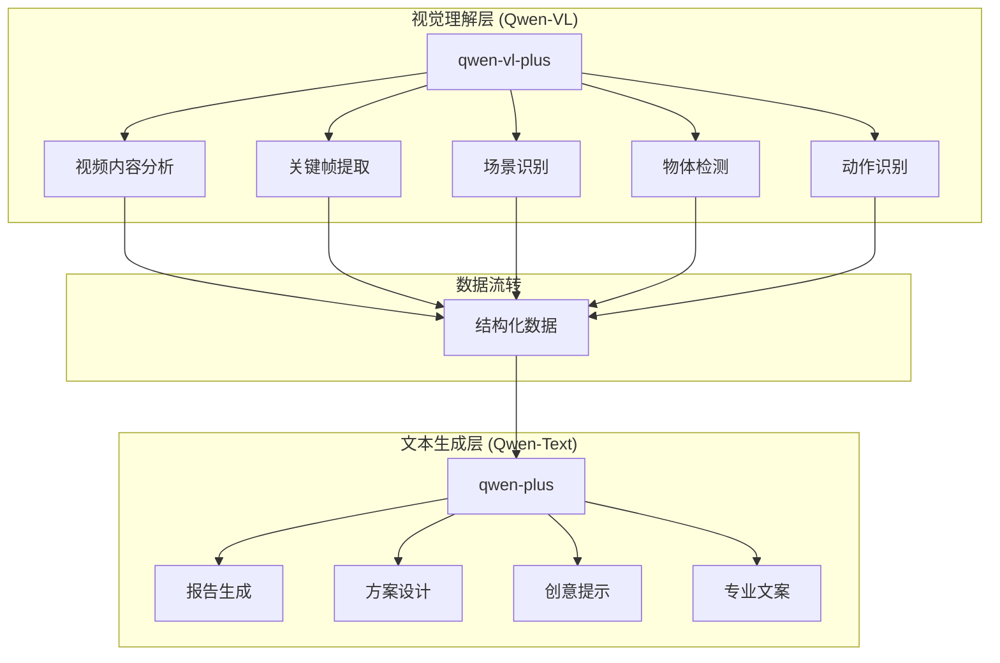
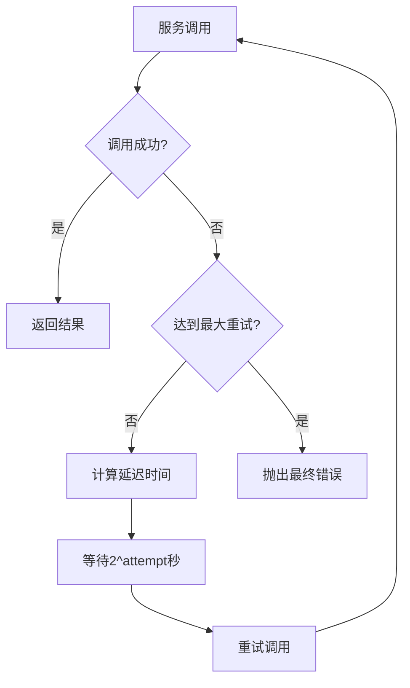

# AI分析路由与处理

<cite>
**本文档引用的文件**
- [ai.js](file://backend/src/routes/ai.js)
- [aiController.js](file://backend/src/controllers/aiController.js)
- [aiService.js](file://backend/src/services/aiService.js)
- [auth.js](file://backend/src/middleware/auth.js)
- [useAIAnalysis.js](file://frontend/src/composables/useAIAnalysis.js)
- [aiService.test.js](file://backend/tests/services/aiService.test.js)
- [API.md](file://backend/API.md)
- [API_DOCS.md](file://backend/API_DOCS.md)
- [qwen3-VL-视频理解API.md](file://qwen3-VL-视频理解API.md)
</cite>

## 目录
1. [简介](#简介)
2. [项目架构概览](#项目架构概览)
3. [AI分析路由定义](#ai分析路由定义)
4. [控制器层处理逻辑](#控制器层处理逻辑)
5. [服务层核心功能](#服务层核心功能)
6. [认证中间件集成](#认证中间件集成)
7. [前端集成与状态管理](#前端集成与状态管理)
8. [异步任务处理与状态查询](#异步任务处理与状态查询)
9. [通义千问模型协同工作流程](#通义千问模型协同工作流程)
10. [错误处理与重试机制](#错误处理与重试机制)
11. [典型请求响应示例](#典型请求响应示例)
12. [总结](#总结)

## 简介

该AI分析功能模块提供了完整的视频内容分析、视频融合方案设计和背景音乐提示词生成能力。系统采用双模型协同架构，结合通义千问VL模型（qwen3-vl-plus）进行视频理解分析，以及通义千问文本模型（qwen-plus）进行报告创作和创意生成。

### 核心特性

- **视频内容分析**：基于通义千问VL模型的深度视频理解
- **视频融合分析**：智能视频融合方案设计与时间轴规划
- **音乐提示词生成**：专业级背景音乐创作提示词生成
- **一体化上传分析**：支持直接上传文件进行综合分析
- **实时状态查询**：WebSocket驱动的实时进度跟踪
- **双模型协同**：VL模型+文本模型的智能协作架构

## 项目架构概览



**架构图来源**
- [ai.js](file://backend/src/routes/ai.js#L1-L71)
- [aiController.js](file://backend/src/controllers/aiController.js#L1-L237)
- [aiService.js](file://backend/src/services/aiService.js#L1-L672)

## AI分析路由定义

### 路由文件结构

AI分析功能的路由定义位于`backend/src/routes/ai.js`文件中，包含以下核心端点：



**图表来源**
- [ai.js](file://backend/src/routes/ai.js#L27-L70)

### 端点详细说明

#### 1. 视频内容分析 (`/analyze/content`)
- **HTTP方法**: POST
- **功能**: 分析单个视频文件的内容特征
- **认证**: 需要认证
- **请求体**: `{ videoPath: string, category?: string }`

#### 2. 视频融合分析 (`/analyze/fusion`)
- **HTTP方法**: POST
- **功能**: 分析两个视频文件的融合可能性和设计方案
- **认证**: 需要认证
- **请求体**: `{ video1Path: string, video2Path: string, category?: string }`

#### 3. 背景音乐提示词生成 (`/generate/music-prompt`)
- **HTTP方法**: POST
- **功能**: 基于融合方案生成专业音乐创作提示词
- **认证**: 需要认证
- **请求体**: `{ fusionPlan: object }`

#### 4. 一体化上传分析 (`/analyze/upload`)
- **HTTP方法**: POST
- **功能**: 直接上传文件进行内容或融合分析
- **认证**: 需要认证
- **请求类型**: multipart/form-data
- **支持文件**: 最多2个视频文件

#### 5. 分析状态查询 (`/analysis/:analysisId/status`)
- **HTTP方法**: GET
- **功能**: 查询特定分析任务的执行状态
- **认证**: 需要认证

**节来源**
- [ai.js](file://backend/src/routes/ai.js#L27-L70)

## 控制器层处理逻辑

### AIController类架构

AI控制器负责处理来自前端的请求，执行业务逻辑验证，并调用相应服务层方法。



**图表来源**
- [aiController.js](file://backend/src/controllers/aiController.js#L5-L237)
- [aiService.js](file://backend/src/services/aiService.js#L8-L672)

### 核心处理方法

#### 视频内容分析方法
- **输入验证**: 检查视频路径存在性和格式有效性
- **文件验证**: 使用`fs.existsSync()`确认文件存在
- **三阶段处理**: 调用`aiService.analyzeVideoThreeStage()`
- **响应格式**: 包含分析ID、原始数据、结构化结果和最终报告

#### 视频融合分析方法  
- **双文件验证**: 验证两个视频文件的存在性
- **并发分析**: 并行执行两个视频的独立分析
- **融合方案**: 生成专业的融合设计方案
- **音乐提示**: 自动生成配套的音乐创作提示词

#### 音乐提示词生成方法
- **输入验证**: 检查融合方案数据的完整性
- **提示词定制**: 基于融合方案生成专业音乐提示词
- **风格适配**: 确保音乐风格与视频内容匹配

**节来源**
- [aiController.js](file://backend/src/controllers/aiController.js#L13-L237)

## 服务层核心功能

### AIService类设计

服务层实现了双模型协同架构，支持视频理解、内容分析和创意生成。



**图表来源**
- [aiService.js](file://backend/src/services/aiService.js#L417-L474)

### 双模型协同工作流程

#### 1. 视频理解阶段 (Qwen-VL模型)
- **模型**: qwen-vl-plus
- **功能**: 视频内容深度理解和特征提取
- **输出**: 时长、关键帧、场景、物体、动作、视觉分析、质量评估、情感基调

#### 2. 数据结构化阶段
- **功能**: 将原始分析结果转换为结构化数据
- **处理**: 安全访问嵌套属性，处理异常数据
- **输出**: 视频信息摘要、内容要素、时间戳

#### 3. 报告生成阶段 (Qwen-Text模型)
- **模型**: qwen-plus
- **功能**: 生成专业级分析报告和创意方案
- **支持类型**: 内容分析报告、融合方案、音乐提示词

### 核心服务方法

#### analyzeVideoContent()
- **用途**: 视频内容深度分析
- **输入**: 视频路径、可选提示词
- **输出**: 结构化的视频分析数据
- **格式**: JSON严格格式规范

#### generateVideoReport()
- **用途**: 专业报告和创意方案生成
- **支持类型**: content、fusion、music
- **输出**: 结构化文本报告
- **优化**: 基于Qwen官方建议的参数配置

#### analyzeVideoThreeStage()
- **用途**: 完整的三阶段视频分析流程
- **阶段1**: VL模型视频理解
- **阶段2**: 数据转换和结构化
- **阶段3**: 文本模型报告生成

**节来源**
- [aiService.js](file://backend/src/services/aiService.js#L24-L474)

## 认证中间件集成

### requireAuth中间件

认证中间件确保所有AI功能调用都需要授权，目前采用开发模式的模拟认证。

```mermaid
flowchart TD
A[请求到达] --> B{requireAuth检查}
B --> |开发模式| C[设置模拟用户]
B --> |生产模式| D[JWT验证]
C --> E[next()继续]
D --> |有效| E
D --> |无效| F[返回401错误]
E --> G[控制器处理]
F --> H[认证失败响应]
```

**图表来源**
- [auth.js](file://backend/src/middleware/auth.js#L4-L15)

### 认证集成方式

- **路由保护**: 所有AI分析端点都集成了`requireAuth`中间件
- **开发模式**: 设置模拟用户`dev-user`，角色为`admin`
- **生产模式**: 预留JWT令牌验证机制
- **权限控制**: `requireAdmin`中间件预留管理员权限检查

### 认证失败响应

```json
{
  "error": "AUTHENTICATION_REQUIRED",
  "message": "需要认证才能访问此资源",
  "timestamp": "2025-01-19T12:00:00Z"
}
```

**节来源**
- [auth.js](file://backend/src/middleware/auth.js#L4-L36)

## 前端集成与状态管理

### useAIAnalysis Composable

前端通过`useAIAnalysis.js`组合式函数提供完整的AI分析功能。



**图表来源**
- [useAIAnalysis.js](file://frontend/src/composables/useAIAnalysis.js#L14-L448)

### 核心功能方法

#### 视频内容分析
- **方法**: `analyzeVideoContent(videoData)`
- **参数**: 视频数据对象（路径、分类等）
- **进度**: 10% → 40% → 70% → 90% → 100%
- **结果**: 保存到本地存储

#### 视频融合分析  
- **方法**: `analyzeVideoFusion(video1Data, video2Data)`
- **参数**: 两个视频数据对象
- **进度**: 更慢的更新频率（5%每1.5秒）
- **结果**: 包含融合方案和音乐提示词

#### 音乐提示词生成
- **方法**: `generateMusicPrompt(fusionPlan)`
- **参数**: 融合方案对象
- **进度**: 15%每800ms
- **输出**: 专业音乐创作提示词

#### 一体化分析
- **方法**: `analyzeUploadedFiles(files, category, analysisType)`
- **支持类型**: content、fusion
- **文件处理**: FormData格式上传
- **进度**: 动态调整（3%或8%每次）

### 状态管理

- **isAnalyzing**: 当前是否正在分析
- **analysisProgress**: 分析进度百分比（0-100）
- **analysisResult**: 最终分析结果
- **error**: 错误信息

**节来源**
- [useAIAnalysis.js](file://frontend/src/composables/useAIAnalysis.js#L14-L448)

## 异步任务处理与状态查询

### 分析状态查询机制

系统提供实时的状态查询功能，支持WebSocket驱动的进度跟踪。



**图表来源**
- [aiController.js](file://backend/src/controllers/aiController.js#L211-L237)

### 状态查询端点

- **端点**: `GET /api/ai/analysis/:analysisId/status`
- **功能**: 查询特定分析任务的执行状态
- **响应**: 包含状态、进度百分比、预计剩余时间
- **当前实现**: 返回模拟状态（已完成、进度100%）

### 进度管理策略

#### 前端进度模拟
- **视频内容分析**: 10秒间隔递增10%
- **视频融合分析**: 1.5秒间隔递增5%
- **音乐提示词生成**: 800ms间隔递增15%

#### WebSocket集成
- **会话管理**: `joinSession()`和`leaveSession()`方法
- **实时更新**: WebSocket事件驱动的状态推送
- **错误处理**: 连接失败时的降级处理

**节来源**
- [useAIAnalysis.js](file://frontend/src/composables/useAIAnalysis.js#L30-L448)

## 通义千问模型协同工作流程

### 双模型架构设计

系统采用双模型协同架构，充分发挥各模型的优势：



**图表来源**
- [aiService.js](file://backend/src/services/aiService.js#L8-L19)

### 模型调用配置

#### Qwen-VL模型配置
- **模型**: qwen-vl-plus
- **输入**: 视频URL + 文本提示词
- **输出**: JSON格式的结构化分析结果
- **参数优化**: 
  - `max_tokens`: 3000
  - `temperature`: 0.3
  - `response_format`: json_object

#### Qwen-Text模型配置  
- **模型**: qwen-plus
- **输入**: 结构化分析数据 + 专业提示词
- **输出**: 结构化文本报告
- **参数优化**:
  - `max_tokens`: 4000
  - `temperature`: 0.3
  - `top_p`: 0.8
  - `frequency_penalty`: 0.1
  - `presence_penalty`: 0.1

### 数据处理流程

#### 视频内容分析流程
1. **VL模型分析**: 提取视频的详细视觉信息
2. **数据结构化**: 转换为统一的结构化格式
3. **文本生成**: 基于结构化数据生成专业报告

#### 视频融合分析流程
1. **双视频分析**: 并行分析两个视频的内容特征
2. **融合方案**: 设计专业的融合时间和技术方案
3. **音乐生成**: 基于融合方案生成音乐提示词

**节来源**
- [aiService.js](file://backend/src/services/aiService.js#L24-L474)

## 错误处理与重试机制

### callWithRetry重试机制

系统实现了基于指数退避策略的智能重试机制。



**图表来源**
- [aiService.js](file://backend/src/services/aiService.js#L617-L670)

### 重试策略配置

- **最大重试次数**: 3次
- **退避算法**: wait_time = 2^attempt 秒
- **首次重试**: 1秒后
- **第二次重试**: 2秒后  
- **第三次重试**: 4秒后
- **测试环境**: 所有重试立即执行（1秒）

### 错误处理层次

#### 1. 输入验证错误
- **视频路径验证**: 文件存在性检查
- **参数完整性**: 必需参数缺失
- **格式验证**: 数据类型和格式检查

#### 2. API调用错误
- **网络错误**: 超时、连接失败
- **认证错误**: API密钥无效
- **限流错误**: 请求频率过高
- **服务错误**: 服务器内部错误

#### 3. 数据处理错误
- **JSON解析**: 结果格式不正确
- **数据转换**: 类型转换失败
- **结构验证**: 数据结构不完整

### 错误响应格式

```json
{
  "success": false,
  "error": "ERROR_CODE",
  "message": "错误描述信息",
  "retryCount": 3,
  "timestamp": "2025-01-19T12:00:00Z"
}
```

**节来源**
- [aiService.js](file://backend/src/services/aiService.js#L617-L670)

## 典型请求响应示例

### 1. 视频内容分析请求

#### 请求
```http
POST /api/ai/analyze/content
Content-Type: application/json
Authorization: Bearer token

{
  "videoPath": "/uploads/videos/sample.mp4",
  "category": "personal"
}
```

#### 响应
```json
{
  "success": true,
  "data": {
    "analysisId": "analysis_1737283200000_abc123",
    "videoPath": "/uploads/videos/sample.mp4",
    "rawAnalysis": {
      "duration": 120,
      "keyframes": [
        {
          "timestamp": 0,
          "description": "开场：蓝天白云，风景优美",
          "importance": "high",
          "visual_elements": ["天空", "白云", "远山"]
        }
      ],
      "scenes": [
        {
          "type": "风景",
          "startTime": 0,
          "endTime": 60,
          "description": "户外自然景观，阳光明媚",
          "atmosphere": "宁静舒适"
        }
      ]
    },
    "structuredData": {
      "videoInfo": {
        "duration": 120,
        "keyframeCount": 1,
        "sceneCount": 1,
        "objectCount": 0,
        "actionCount": 0
      }
    },
    "finalReport": "专业视频内容分析报告...",
    "createdAt": "2025-01-19T12:00:00Z"
  }
}
```

### 2. 视频融合分析请求

#### 请求
```http
POST /api/ai/analyze/fusion
Content-Type: application/json
Authorization: Bearer token

{
  "video1Path": "/uploads/videos/personal1.mp4",
  "video2Path": "/uploads/videos/personal2.mp4",
  "category": "personal"
}
```

#### 响应
```json
{
  "success": true,
  "data": {
    "fusionId": "fusion_1737283200000_def456",
    "video1Path": "/uploads/videos/personal1.mp4",
    "video2Path": "/uploads/videos/personal2.mp4",
    "video1Analysis": {...},
    "video2Analysis": {...},
    "fusionData": {
      "video1": {...},
      "video2": {...},
      "totalDuration": 240,
      "analysis": {
        "contentCompatibility": {
          "commonElements": ["风景", "人物"],
          "compatibility": "high",
          "recommendation": "适合自然过渡融合"
        }
      }
    },
    "fusionPlan": "专业视频融合方案...",
    "createdAt": "2025-01-19T12:00:00Z"
  }
}
```

### 3. 音乐提示词生成请求

#### 请求
```http
POST /api/ai/generate/music-prompt
Content-Type: application/json
Authorization: Bearer token

{
  "fusionPlan": {
    "overallPlan": {
      "targetDuration": 45,
      "narrative": "从日出到日落的故事",
      "emotionalCurve": "平静→激昂→平静"
    },
    "segmentation": [...],
    "transitions": [...]
  }
}
```

#### 响应
```json
{
  "success": true,
  "data": {
    "musicPromptId": "music_1737283200000_ghi789",
    "prompt": "生成一段45秒的温馨背景音乐，风格为轻音乐融合爵士。音乐以钢琴为主奏，配以轻柔的弦乐和合成器铺垫。节奏为100-120 BPM，整体采用C大调。情绪从平静的开场开始，中段逐步推进至激昂的高潮，最后以平静的收尾。适合用作个人生活记录视频的背景音乐，营造温馨愉悦的感觉。",
    "generatedAt": "2025-01-19T12:00:00Z"
  }
}
```

### 4. 参数错误响应

#### 请求
```http
POST /api/ai/analyze/content
Content-Type: application/json
Authorization: Bearer token

{
  "videoPath": ""
}
```

#### 响应
```json
{
  "success": false,
  "error": "VALIDATION_ERROR",
  "message": "缺少视频文件路径"
}
```

### 5. 认证失败响应

#### 请求
```http
POST /api/ai/analyze/content
Content-Type: application/json
```

#### 响应
```json
{
  "error": "AUTHENTICATION_REQUIRED",
  "message": "需要认证才能访问此资源",
  "timestamp": "2025-01-19T12:00:00Z"
}
```

### 6. 分析状态查询

#### 请求
```http
GET /api/ai/analysis/analysis_1737283200000_abc123/status
Authorization: Bearer token
```

#### 响应
```json
{
  "success": true,
  "data": {
    "analysisId": "analysis_1737283200000_abc123",
    "status": "completed",
    "progress": 100,
    "estimatedTime": 0
  }
}
```

**节来源**
- [aiController.js](file://backend/src/controllers/aiController.js#L13-L237)
- [aiService.js](file://backend/src/services/aiService.js#L24-L474)

## 总结

该AI分析功能模块展现了现代Web应用中AI能力的完整集成方案。通过精心设计的分层架构，系统实现了：

### 技术亮点

1. **双模型协同**: 通义千问VL模型与文本模型的智能协作
2. **异步处理**: 完整的异步任务处理和状态跟踪机制
3. **错误恢复**: 智能重试机制和完善的错误处理
4. **实时交互**: WebSocket驱动的实时进度更新
5. **安全认证**: 完善的认证中间件集成

### 架构优势

- **模块化设计**: 清晰的路由、控制器、服务三层架构
- **可扩展性**: 易于添加新的分析类型和模型
- **可靠性**: 完善的错误处理和重试机制
- **用户体验**: 实时进度反馈和友好的错误提示

### 应用价值

该系统为企业和个人用户提供了一站式的视频内容分析解决方案，支持：
- 视频内容深度理解和特征提取
- 智能视频融合方案设计
- 专业级背景音乐创作提示
- 一体化的上传和分析流程

通过这套完整的AI分析功能，用户可以高效地处理复杂的视频内容分析任务，获得专业级的分析结果和创意建议。