# 上传路由与处理

<cite>
**本文档中引用的文件**
- [backend/src/routes/upload.js](file://backend/src/routes/upload.js)
- [backend/src/controllers/uploadController.js](file://backend/src/controllers/uploadController.js)
- [backend/src/middleware/upload.js](file://backend/src/middleware/upload.js)
- [backend/src/middleware/auth.js](file://backend/src/middleware/auth.js)
- [backend/src/services/uploadService.js](file://backend/src/services/uploadService.js)
- [backend/src/config/upload.js](file://backend/src/config/upload.js)
- [backend/src/app.js](file://backend/src/app.js)
- [frontend/src/components/FileUploader.vue](file://frontend/src/components/FileUploader.vue)
- [backend/API.md](file://backend/API.md)
- [specs/001-responsive-h5-upload/spec.md](file://specs/001-responsive-h5-upload/spec.md)
</cite>

## 目录
1. [概述](#概述)
2. [系统架构](#系统架构)
3. [路由定义与处理](#路由定义与处理)
4. [中间件层分析](#中间件层分析)
5. [控制器实现机制](#控制器实现机制)
6. [服务层核心功能](#服务层核心功能)
7. [配置管理](#配置管理)
8. [前端组件交互](#前端组件交互)
9. [错误处理与状态码](#错误处理与状态码)
10. [完整上传流程](#完整上传流程)
11. [性能优化与最佳实践](#性能优化与最佳实践)
12. [总结](#总结)

## 概述

文件上传功能是本项目的核心特性之一，提供了完整的视频文件上传解决方案。系统支持最多3个同类型视频文件（MP4、AVI）的批量上传，具备实时进度跟踪、会话管理、权限控制和错误处理等企业级功能。

### 主要特性

- **批量上传**：支持最多3个同类型视频文件同时上传
- **实时进度**：基于WebSocket的实时进度通知
- **会话管理**：基于UUID的上传会话生命周期管理
- **文件验证**：多维度文件格式、大小、类型验证
- **分类存储**：个人视频和景区视频两种分类存储
- **权限控制**：基于中间件的访问控制
- **错误处理**：完善的错误码体系和用户友好的错误提示

## 系统架构

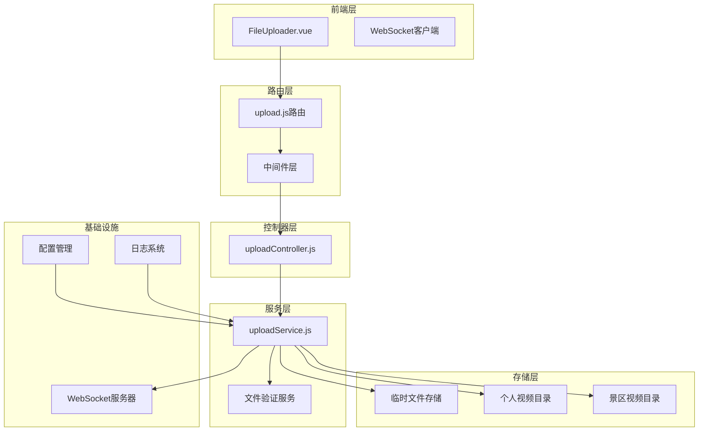
```mermaid
graph TB
subgraph "前端层"
FE[FileUploader.vue]
WS[WebSocket客户端]
end
subgraph "路由层"
Router[upload.js路由]
MW[中间件层]
end
subgraph "控制器层"
UC[uploadController.js]
end
subgraph "服务层"
US[uploadService.js]
VS[文件验证服务]
end
subgraph "存储层"
Temp[临时文件存储]
Personal[个人视频目录]
Scenic[景区视频目录]
end
subgraph "基础设施"
Config[配置管理]
Logger[日志系统]
IO[WebSocket服务器]
end
FE --> Router
Router --> MW
MW --> UC
UC --> US
US --> VS
US --> Temp
US --> Personal
US --> Scenic
US --> IO
Config --> US
Logger --> US
```

**图表来源**
- [backend/src/routes/upload.js](file://backend/src/routes/upload.js#L1-L62)
- [backend/src/controllers/uploadController.js](file://backend/src/controllers/uploadController.js#L1-L285)
- [backend/src/services/uploadService.js](file://backend/src/services/uploadService.js#L1-L416)

## 路由定义与处理

### 路由结构概览

系统定义了7个主要的API端点，每个端点都有明确的职责和处理逻辑：

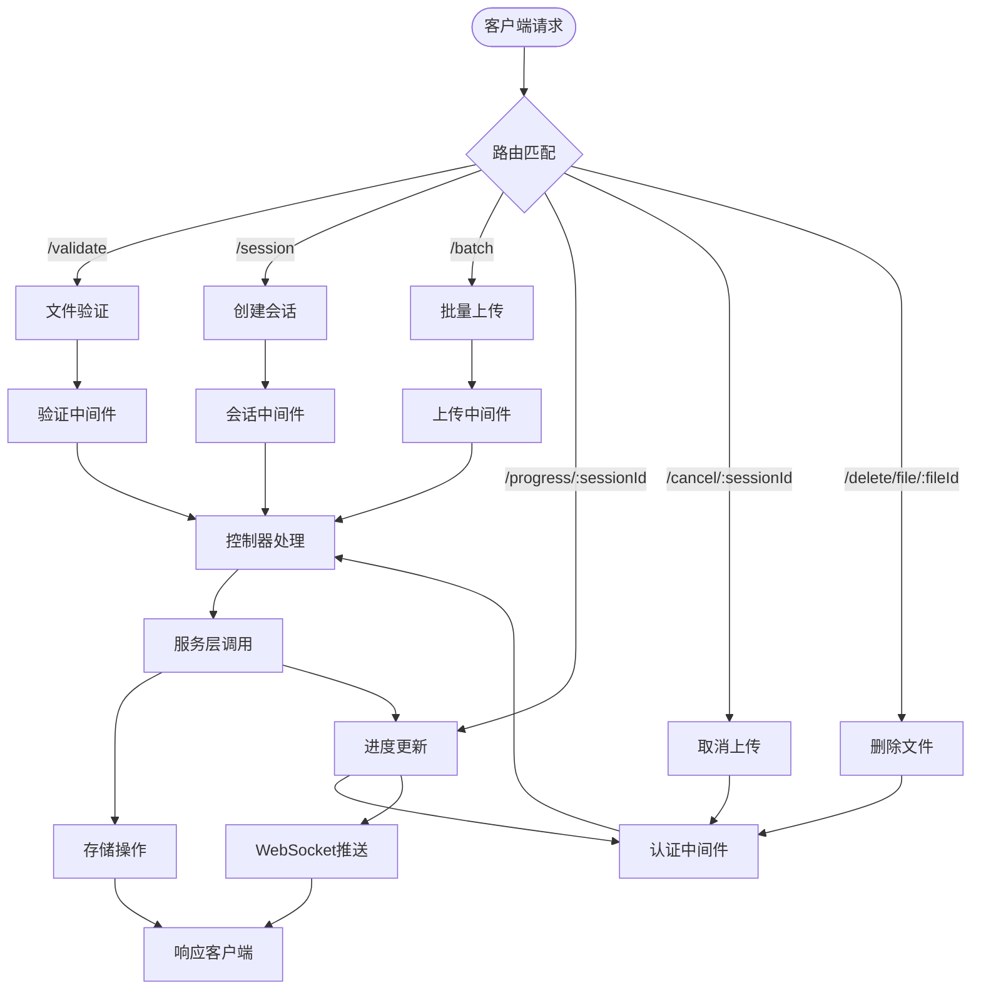
```mermaid
flowchart TD
Start([客户端请求]) --> Route{路由匹配}
Route --> |/validate| Validate[文件验证]
Route --> |/session| Session[创建会话]
Route --> |/batch| Batch[批量上传]
Route --> |/progress/:sessionId| Progress[获取进度]
Route --> |/cancel/:sessionId| Cancel[取消上传]
Route --> |/delete/file/:fileId| Delete[删除文件]
Validate --> ValidateMW[验证中间件]
Session --> SessionMW[会话中间件]
Batch --> UploadMW[上传中间件]
Progress --> AuthMW[认证中间件]
Cancel --> AuthMW
Delete --> AuthMW
ValidateMW --> Controller[控制器处理]
SessionMW --> Controller
UploadMW --> Controller
AuthMW --> Controller
Controller --> Service[服务层调用]
Service --> Storage[存储操作]
Service --> Progress[进度更新]
Storage --> Response[响应客户端]
Progress --> WebSocket[WebSocket推送]
WebSocket --> Response
```

**图表来源**
- [backend/src/routes/upload.js](file://backend/src/routes/upload.js#L46-L61)

### 路由详细说明

#### 1. 文件验证路由 (`/validate`)
- **HTTP方法**: POST
- **功能**: 验证文件格式、大小和数量
- **中间件**: 内联验证逻辑
- **响应**: 返回验证结果和错误详情

#### 2. 会话创建路由 (`/session`)
- **HTTP方法**: POST
- **功能**: 创建新的上传会话
- **中间件**: 内联验证逻辑
- **响应**: 返回会话ID和配置信息

#### 3. 批量上传路由 (`/batch`)
- **HTTP方法**: POST
- **功能**: 处理多文件批量上传
- **中间件**: 
  - `uploadMiddleware.array`: Multer中间件
  - `validateFiles`: 自定义验证中间件
  - `uploadController.uploadFiles`: 控制器处理
- **响应**: 返回上传结果和文件信息

#### 4. 进度查询路由 (`/progress/:sessionId`)
- **HTTP方法**: GET
- **功能**: 获取指定会话的上传进度
- **中间件**: 无特殊中间件
- **响应**: 返回详细的进度信息

#### 5. 取消上传路由 (`/cancel/:sessionId`)
- **HTTP方法**: POST
- **功能**: 取消指定会话中的上传
- **中间件**: 无特殊中间件
- **响应**: 返回取消结果

#### 6. 文件删除路由 (`/delete/file/:fileId`)
- **HTTP方法**: DELETE
- **功能**: 删除已上传的文件（管理员权限）
- **中间件**: `authMiddleware.requireAuth`
- **响应**: 返回删除结果

**章节来源**
- [backend/src/routes/upload.js](file://backend/src/routes/upload.js#L46-L61)

## 中间件层分析

### Multer中间件配置

系统使用Multer作为文件上传中间件，提供了强大的文件处理能力：

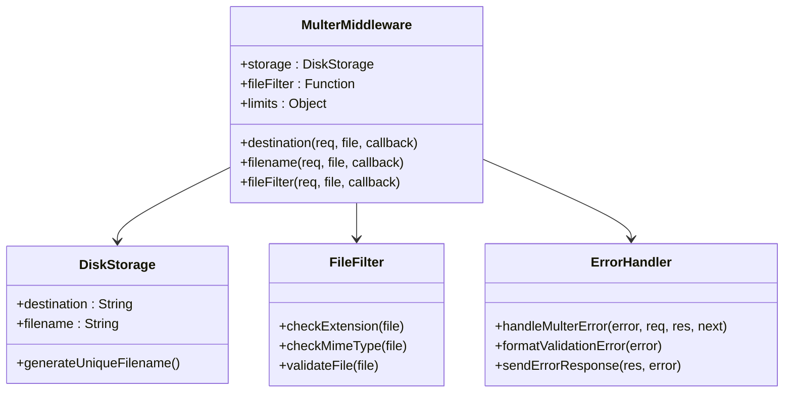
```mermaid
classDiagram
class MulterMiddleware {
+storage : DiskStorage
+fileFilter : Function
+limits : Object
+destination(req, file, callback)
+filename(req, file, callback)
+fileFilter(req, file, callback)
}
class DiskStorage {
+destination : String
+filename : String
+generateUniqueFilename()
}
class FileFilter {
+checkExtension(file)
+checkMimeType(file)
+validateFile(file)
}
class ErrorHandler {
+handleMulterError(error, req, res, next)
+formatValidationError(error)
+sendErrorResponse(res, error)
}
MulterMiddleware --> DiskStorage
MulterMiddleware --> FileFilter
MulterMiddleware --> ErrorHandler
```

**图表来源**
- [backend/src/middleware/upload.js](file://backend/src/middleware/upload.js#L12-L54)

### 文件验证中间件

自定义的`validateFiles`中间件提供了多维度的文件验证：

| 验证项 | 规则 | 错误码 | 错误信息 |
|--------|------|--------|----------|
| 文件数量 | 最多3个 | TOO_MANY_FILES | "最多只能上传3个文件" |
| 文件存在性 | 必须有文件 | NO_FILES | "请选择要上传的文件" |
| 会话ID | 必须提供 | NO_SESSION_ID | "缺少会话ID" |

### 错误处理机制

Multer中间件提供了完善的错误处理：

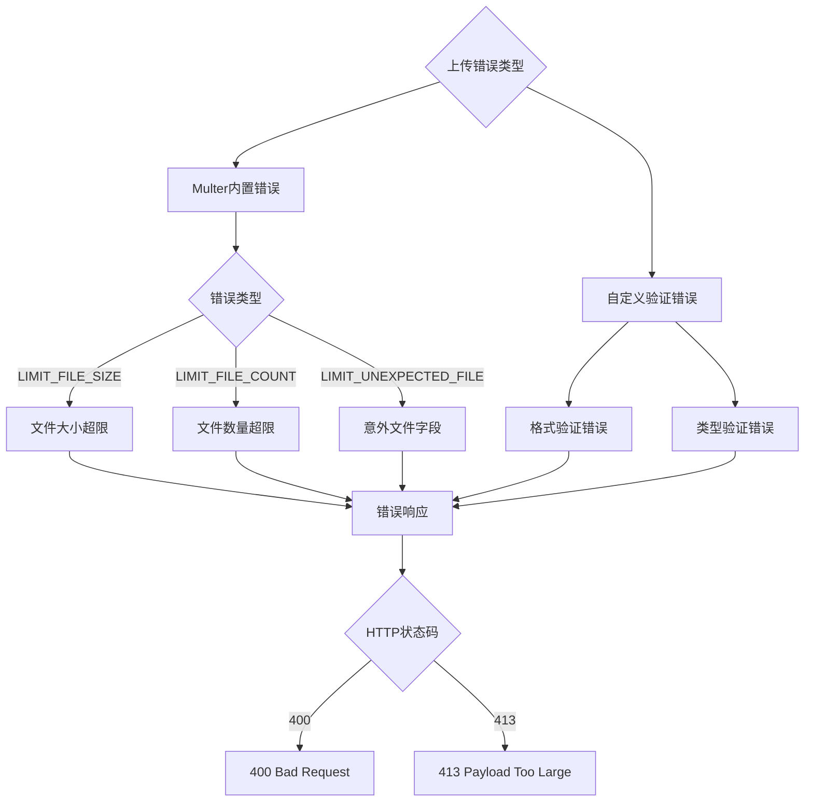
```mermaid
flowchart TD
UploadError{上传错误类型} --> MulterError[Multer内置错误]
UploadError --> CustomError[自定义验证错误]
MulterError --> LimitError{错误类型}
LimitError --> |LIMIT_FILE_SIZE| SizeError[文件大小超限]
LimitError --> |LIMIT_FILE_COUNT| CountError[文件数量超限]
LimitError --> |LIMIT_UNEXPECTED_FILE| UnexpectedError[意外文件字段]
CustomError --> FormatError[格式验证错误]
CustomError --> TypeError[类型验证错误]
SizeError --> ErrorResponse[错误响应]
CountError --> ErrorResponse
UnexpectedError --> ErrorResponse
FormatError --> ErrorResponse
TypeError --> ErrorResponse
ErrorResponse --> StatusCode{HTTP状态码}
StatusCode --> |400| BadRequest[400 Bad Request]
StatusCode --> |413| PayloadTooLarge[413 Payload Too Large]
```

**图表来源**
- [backend/src/middleware/upload.js](file://backend/src/middleware/upload.js#L57-L104)

**章节来源**
- [backend/src/middleware/upload.js](file://backend/src/middleware/upload.js#L1-L110)

## 控制器实现机制

### 控制器架构

UploadController采用了面向对象的设计模式，每个方法都专注于特定的功能：

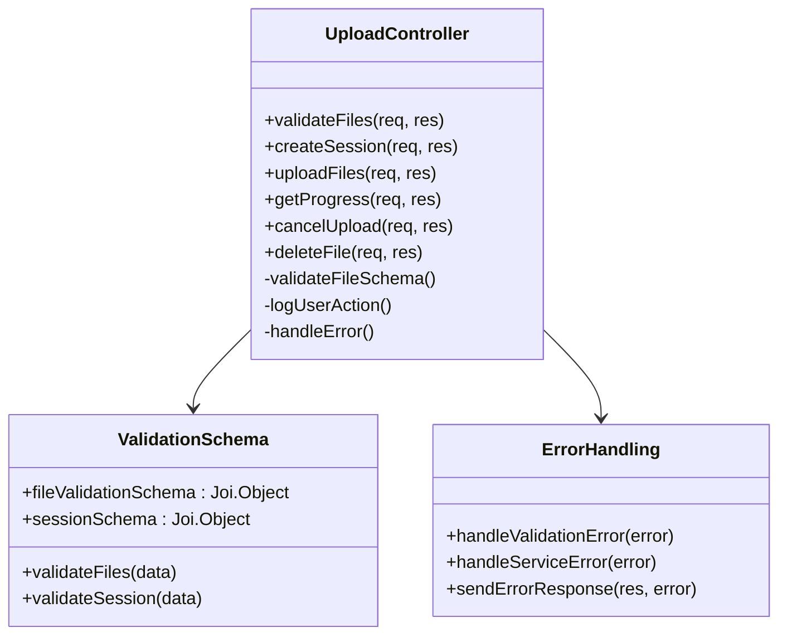
```mermaid
classDiagram
class UploadController {
+validateFiles(req, res)
+createSession(req, res)
+uploadFiles(req, res)
+getProgress(req, res)
+cancelUpload(req, res)
+deleteFile(req, res)
-validateFileSchema()
-logUserAction()
-handleError()
}
class ValidationSchema {
+fileValidationSchema : Joi.Object
+sessionSchema : Joi.Object
+validateFiles(data)
+validateSession(data)
}
class ErrorHandling {
+handleValidationError(error)
+handleServiceError(error)
+sendErrorResponse(res, error)
}
UploadController --> ValidationSchema
UploadController --> ErrorHandling
```

**图表来源**
- [backend/src/controllers/uploadController.js](file://backend/src/controllers/uploadController.js#L25-L285)

### 核心方法实现

#### 1. 文件验证方法 (`validateFiles`)
- **输入**: 文件数组和元数据
- **输出**: 验证结果和错误详情
- **验证维度**: 格式、大小、类型、数量一致性

#### 2. 会话创建方法 (`createSession`)
- **输入**: 分类和预期文件数量
- **输出**: 会话ID和配置信息
- **功能**: 初始化上传会话状态

#### 3. 文件上传方法 (`uploadFiles`)
- **输入**: 会话ID、分类、文件数组
- **输出**: 上传结果和文件信息
- **流程**: 文件处理、进度跟踪、状态更新

#### 4. 进度查询方法 (`getProgress`)
- **输入**: 会话ID
- **输出**: 详细进度信息
- **功能**: 实时获取上传状态

#### 5. 取消上传方法 (`cancelUpload`)
- **输入**: 会话ID
- **输出**: 取消结果
- **功能**: 终止未完成的上传任务

#### 6. 文件删除方法 (`deleteFile`)
- **输入**: 文件ID
- **输出**: 删除结果
- **权限**: 需要管理员权限

**章节来源**
- [backend/src/controllers/uploadController.js](file://backend/src/controllers/uploadController.js#L1-L285)

## 服务层核心功能

### 服务架构设计

UploadService采用了单例模式，提供了完整的文件上传生命周期管理：

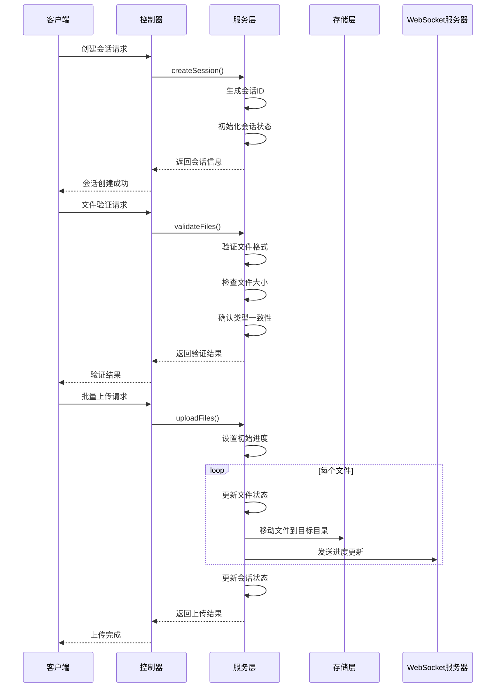
```mermaid
sequenceDiagram
participant Client as 客户端
participant Controller as 控制器
participant Service as 服务层
participant Storage as 存储层
participant WebSocket as WebSocket服务器
Client->>Controller : 创建会话请求
Controller->>Service : createSession()
Service->>Service : 生成会话ID
Service->>Service : 初始化会话状态
Service-->>Controller : 返回会话信息
Controller-->>Client : 会话创建成功
Client->>Controller : 文件验证请求
Controller->>Service : validateFiles()
Service->>Service : 验证文件格式
Service->>Service : 检查文件大小
Service->>Service : 确认类型一致性
Service-->>Controller : 返回验证结果
Controller-->>Client : 验证结果
Client->>Controller : 批量上传请求
Controller->>Service : uploadFiles()
Service->>Service : 设置初始进度
loop 每个文件
Service->>Service : 更新文件状态
Service->>Storage : 移动文件到目标目录
Service->>WebSocket : 发送进度更新
end
Service->>Service : 更新会话状态
Service-->>Controller : 返回上传结果
Controller-->>Client : 上传完成
```

**图表来源**
- [backend/src/services/uploadService.js](file://backend/src/services/uploadService.js#L118-L296)

### 会话管理系统

系统使用内存Map存储上传会话，实现了完整的生命周期管理：

| 会话状态 | 描述 | 进度范围 | 下一步操作 |
|----------|------|----------|------------|
| pending | 待处理 | 0% | 开始上传 |
| uploading | 上传中 | 1%-99% | 继续上传/暂停 |
| completed | 完成 | 100% | 查看结果 |
| partial | 部分完成 | 1%-99% | 查看结果 |
| cancelled | 已取消 | 0% | 重新上传 |

### 进度跟踪机制

系统提供了多层次的进度跟踪：

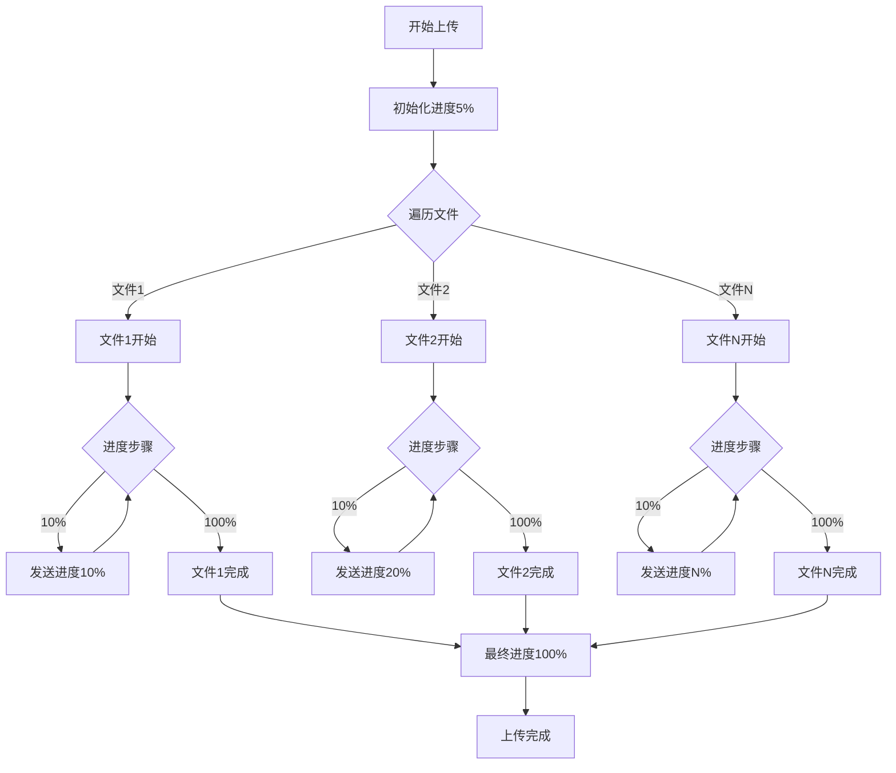
```mermaid
flowchart TD
StartUpload[开始上传] --> InitProgress[初始化进度5%]
InitProgress --> FileLoop{遍历文件}
FileLoop --> |文件1| File1Start[文件1开始]
File1Start --> ProgressLoop1{进度步骤}
ProgressLoop1 --> |10%| Progress1[发送进度10%]
Progress1 --> ProgressLoop1
ProgressLoop1 --> |100%| File1Complete[文件1完成]
FileLoop --> |文件2| File2Start[文件2开始]
File2Start --> ProgressLoop2{进度步骤}
ProgressLoop2 --> |10%| Progress2[发送进度20%]
Progress2 --> ProgressLoop2
ProgressLoop2 --> |100%| File2Complete[文件2完成]
FileLoop --> |文件N| FileNStart[文件N开始]
FileNStart --> ProgressLoopN{进度步骤}
ProgressLoopN --> |10%| ProgressN[发送进度N%]
ProgressN --> ProgressLoopN
ProgressLoopN --> |100%| FileNComplete[文件N完成]
File1Complete --> FinalProgress[最终进度100%]
File2Complete --> FinalProgress
FileNComplete --> FinalProgress
FinalProgress --> UploadComplete[上传完成]
```

**图表来源**
- [backend/src/services/uploadService.js](file://backend/src/services/uploadService.js#L177-L296)

### WebSocket集成

系统集成了Socket.IO实现实时进度通知：

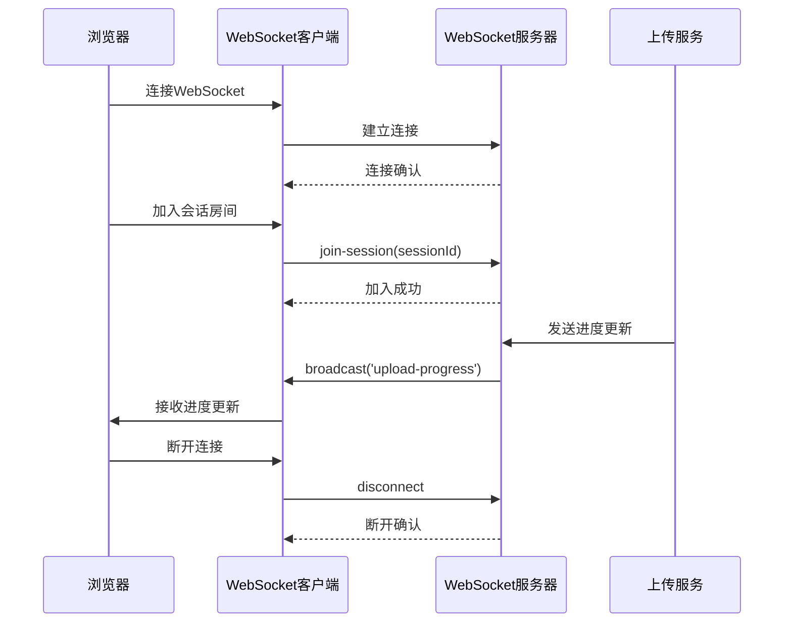
```mermaid
sequenceDiagram
participant Browser as 浏览器
participant Socket as WebSocket客户端
participant Server as WebSocket服务器
participant Service as 上传服务
Browser->>Socket : 连接WebSocket
Socket->>Server : 建立连接
Server-->>Socket : 连接确认
Browser->>Socket : 加入会话房间
Socket->>Server : join-session(sessionId)
Server-->>Socket : 加入成功
Service->>Server : 发送进度更新
Server->>Socket : broadcast('upload-progress')
Socket->>Browser : 接收进度更新
Browser->>Socket : 断开连接
Socket->>Server : disconnect
Server-->>Socket : 断开确认
```

**图表来源**
- [backend/src/app.js](file://backend/src/app.js#L114-L129)
- [backend/src/services/uploadService.js](file://backend/src/services/uploadService.js#L22-L31)

**章节来源**
- [backend/src/services/uploadService.js](file://backend/src/services/uploadService.js#L1-L416)

## 配置管理

### 配置结构

系统配置采用了集中式管理模式，所有配置项都集中在单一配置文件中：

| 配置类别 | 配置项 | 默认值 | 描述 |
|----------|--------|--------|------|
| 服务器配置 | port | 8005 | 服务监听端口 |
| 文件限制 | maxFileSize | 300MB | 单文件最大大小 |
| 文件限制 | maxFilesPerSession | 3 | 每个会话最大文件数 |
| 文件类型 | allowedMimeTypes | video/mp4, video/avi | 允许的MIME类型 |
| 文件类型 | allowedExtensions | .mp4, .avi | 允许的文件扩展名 |
| 存储路径 | categoryPaths | personal, scenic | 分类存储路径 |
| 会话管理 | sessionTimeout | 24小时 | 会话超时时间 |
| 清理配置 | cleanupInterval | 1小时 | 清理间隔 |
| 安全配置 | maxRequestSize | 500MB | 最大请求大小 |

### 动态配置生成

系统提供了灵活的文件命名策略：

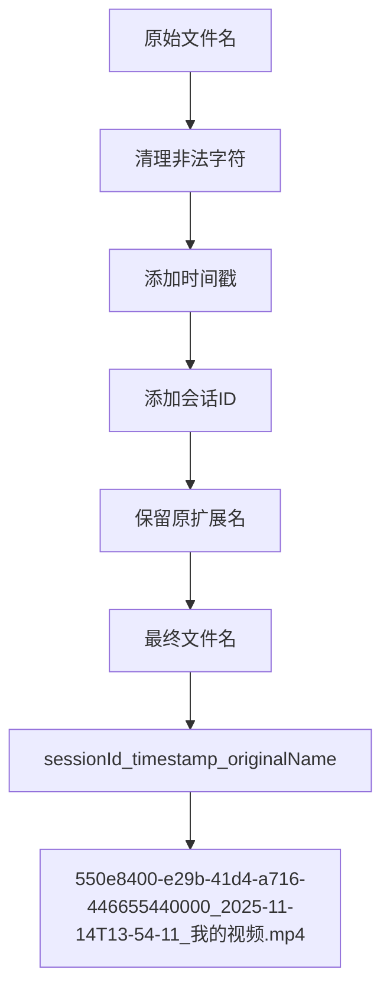
```mermaid
flowchart TD
FileName[原始文件名] --> Sanitize[清理非法字符]
Sanitize --> Timestamp[添加时间戳]
Timestamp --> SessionId[添加会话ID]
SessionId --> Extension[保留原扩展名]
Extension --> FinalName[最终文件名]
FinalName --> Pattern["sessionId_timestamp_originalName"]
Pattern --> Example["550e8400-e29b-41d4-a716-446655440000_2025-11-14T13-54-11_我的视频.mp4"]
```

**图表来源**
- [backend/src/config/upload.js](file://backend/src/config/upload.js#L29-L33)

**章节来源**
- [backend/src/config/upload.js](file://backend/src/config/upload.js#L1-L53)

## 前端组件交互

### FileUploader组件架构

前端FileUploader组件采用了Vue 3 Composition API，提供了完整的文件上传UI体验：

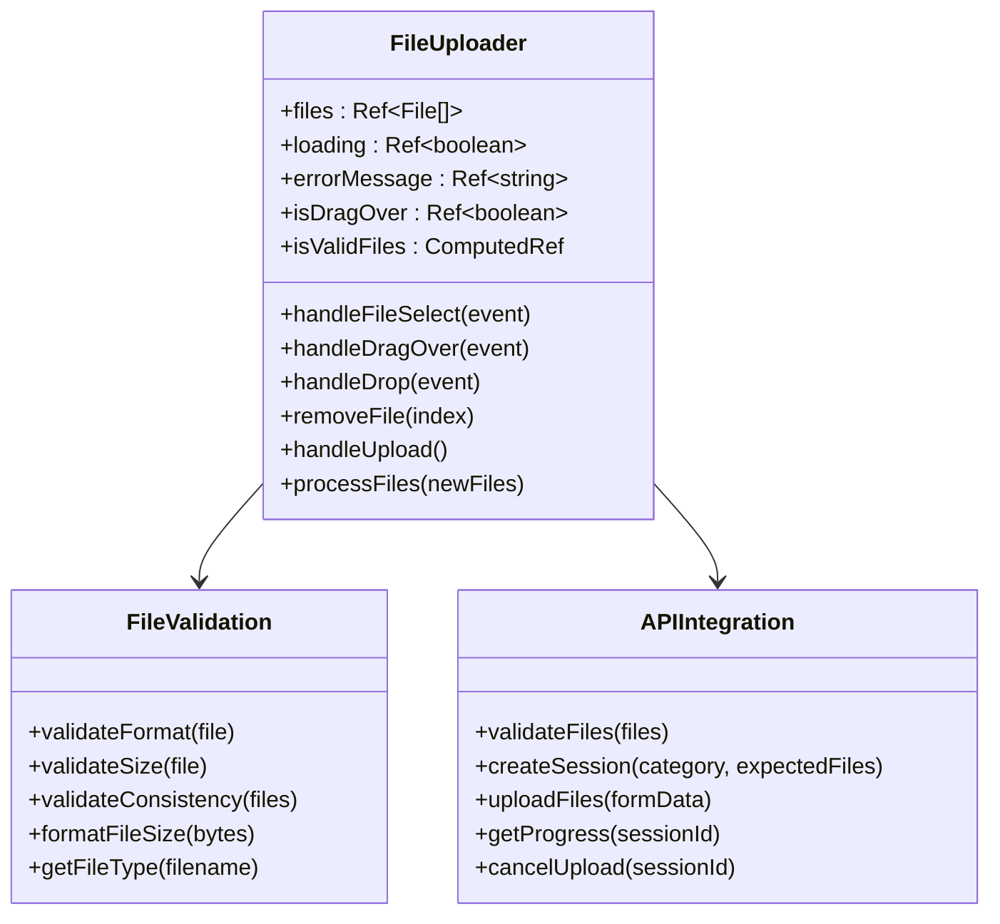
```mermaid
classDiagram
class FileUploader {
+files : Ref~File[]~
+loading : Ref~boolean~
+errorMessage : Ref~string~
+isDragOver : Ref~boolean~
+isValidFiles : ComputedRef
+handleFileSelect(event)
+handleDragOver(event)
+handleDrop(event)
+removeFile(index)
+handleUpload()
+processFiles(newFiles)
}
class FileValidation {
+validateFormat(file)
+validateSize(file)
+validateConsistency(files)
+formatFileSize(bytes)
+getFileType(filename)
}
class APIIntegration {
+validateFiles(files)
+createSession(category, expectedFiles)
+uploadFiles(formData)
+getProgress(sessionId)
+cancelUpload(sessionId)
}
FileUploader --> FileValidation
FileUploader --> APIIntegration
```

**图表来源**
- [frontend/src/components/FileUploader.vue](file://frontend/src/components/FileUploader.vue#L78-L282)

### 上传流程交互

前端组件与后端API的交互遵循严格的流程控制：

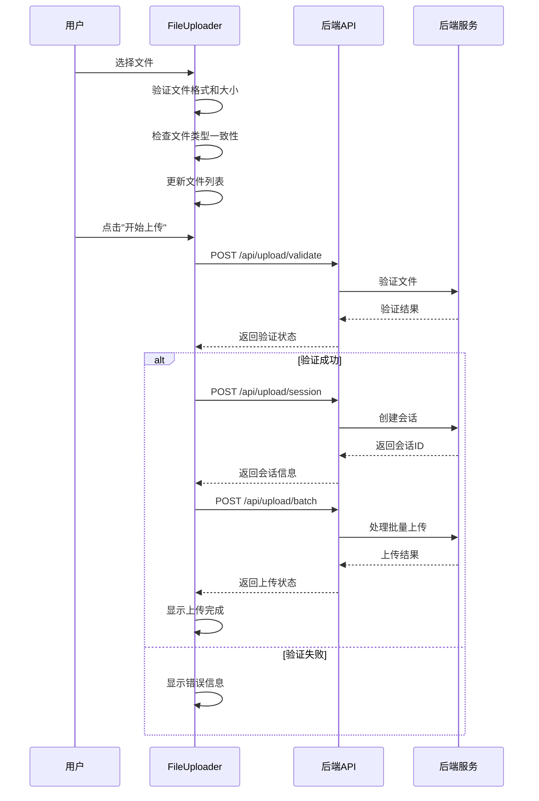
```mermaid
sequenceDiagram
participant User as 用户
participant Component as FileUploader
participant API as 后端API
participant Backend as 后端服务
User->>Component : 选择文件
Component->>Component : 验证文件格式和大小
Component->>Component : 检查文件类型一致性
Component->>Component : 更新文件列表
User->>Component : 点击"开始上传"
Component->>API : POST /api/upload/validate
API->>Backend : 验证文件
Backend-->>API : 验证结果
API-->>Component : 返回验证状态
alt 验证成功
Component->>API : POST /api/upload/session
API->>Backend : 创建会话
Backend-->>API : 返回会话ID
API-->>Component : 返回会话信息
Component->>API : POST /api/upload/batch
API->>Backend : 处理批量上传
Backend-->>API : 上传结果
API-->>Component : 返回上传状态
Component->>Component : 显示上传完成
else 验证失败
Component->>Component : 显示错误信息
end
```

**图表来源**
- [frontend/src/components/FileUploader.vue](file://frontend/src/components/FileUploader.vue#L206-L246)

### 实时进度更新

前端通过WebSocket接收实时进度更新：

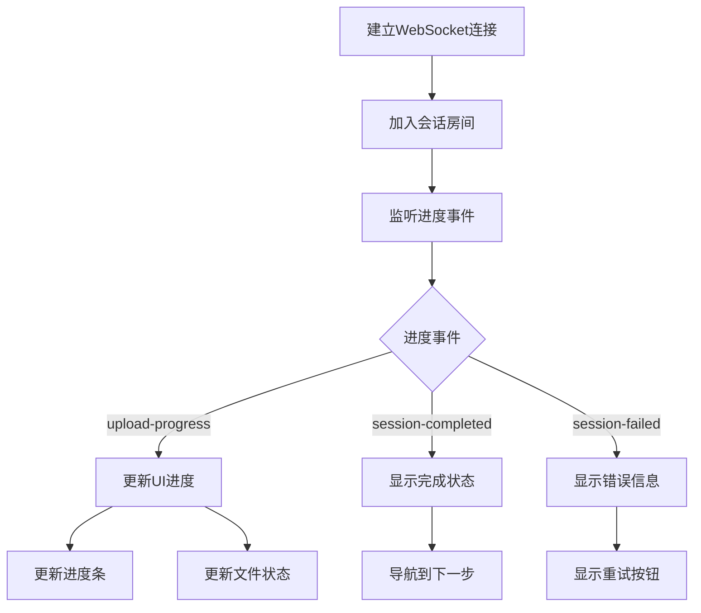
```mermaid
flowchart TD
Connect[建立WebSocket连接] --> JoinRoom[加入会话房间]
JoinRoom --> ListenProgress[监听进度事件]
ListenProgress --> ProgressEvent{进度事件}
ProgressEvent --> |upload-progress| UpdateUI[更新UI进度]
ProgressEvent --> |session-completed| ShowComplete[显示完成状态]
ProgressEvent --> |session-failed| ShowError[显示错误信息]
UpdateUI --> ProgressBar[更新进度条]
UpdateUI --> FileStatus[更新文件状态]
ShowComplete --> NavigateNext[导航到下一步]
ShowError --> RetryButton[显示重试按钮]
```

**章节来源**
- [frontend/src/components/FileUploader.vue](file://frontend/src/components/FileUploader.vue#L1-L304)

## 错误处理与状态码

### 错误码体系

系统建立了完整的错误码体系，便于前端处理和用户理解：

| HTTP状态码 | 错误码 | 描述 | 处理建议 |
|------------|--------|------|----------|
| 400 | VALIDATION_ERROR | 文件验证失败 | 检查文件格式和大小 |
| 400 | INVALID_FILE_FORMAT | 不支持的文件格式 | 仅支持MP4和AVI格式 |
| 413 | FILE_TOO_LARGE | 文件过大 | 单文件不超过300MB |
| 400 | TOO_MANY_FILES | 文件数量过多 | 最多上传3个文件 |
| 400 | NO_FILES | 未选择文件 | 至少选择一个文件 |
| 400 | NO_SESSION_ID | 缺少会话ID | 重新创建上传会话 |
| 400 | MISSING_PARAMETERS | 缺少必要参数 | 检查请求参数完整性 |
| 404 | SESSION_NOT_FOUND | 会话不存在 | 重新创建会话 |
| 404 | FILE_NOT_FOUND | 文件不存在 | 检查文件ID是否正确 |
| 403 | INSUFFICIENT_PERMISSIONS | 权限不足 | 需要管理员权限 |
| 500 | UPLOAD_FAILED | 上传失败 | 稍后重试或联系支持 |
| 500 | CANCELLATION_FAILED | 取消失败 | 刷新页面重试 |
| 500 | PROGRESS_QUERY_FAILED | 查询失败 | 检查网络连接 |
| 500 | INTERNAL_SERVER_ERROR | 服务器内部错误 | 联系技术支持 |

### 错误处理流程

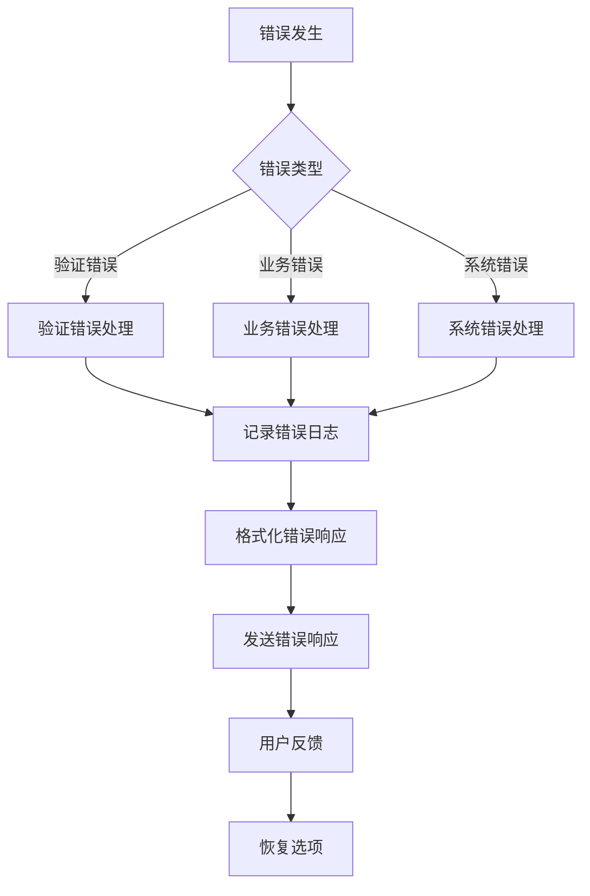
```mermaid
flowchart TD
ErrorOccur[错误发生] --> ErrorType{错误类型}
ErrorType --> |验证错误| ValidationError[验证错误处理]
ErrorType --> |业务错误| BusinessError[业务错误处理]
ErrorType --> |系统错误| SystemError[系统错误处理]
ValidationError --> LogError[记录错误日志]
BusinessError --> LogError
SystemError --> LogError
LogError --> FormatResponse[格式化错误响应]
FormatResponse --> SendResponse[发送错误响应]
SendResponse --> UserFeedback[用户反馈]
UserFeedback --> RecoveryOption[恢复选项]
```

**章节来源**
- [backend/API.md](file://backend/API.md#L273-L285)

## 完整上传流程

### 端到端流程图

以下是完整的文件上传流程，涵盖了从前端交互到后端处理的每一个环节：

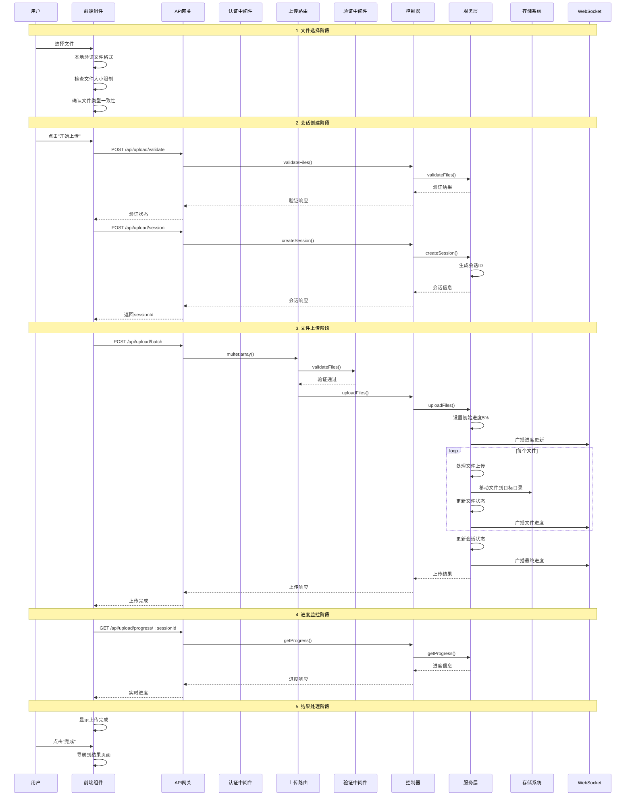
```mermaid
sequenceDiagram
participant User as 用户
participant Frontend as 前端组件
participant API as API网关
participant Auth as 认证中间件
participant Upload as 上传路由
participant Validate as 验证中间件
participant Controller as 控制器
participant Service as 服务层
participant Storage as 存储系统
participant WebSocket as WebSocket
Note over User,WebSocket : 1. 文件选择阶段
User->>Frontend : 选择文件
Frontend->>Frontend : 本地验证文件格式
Frontend->>Frontend : 检查文件大小限制
Frontend->>Frontend : 确认文件类型一致性
Note over User,WebSocket : 2. 会话创建阶段
User->>Frontend : 点击"开始上传"
Frontend->>API : POST /api/upload/validate
API->>Controller : validateFiles()
Controller->>Service : validateFiles()
Service-->>Controller : 验证结果
Controller-->>API : 验证响应
API-->>Frontend : 验证状态
Frontend->>API : POST /api/upload/session
API->>Controller : createSession()
Controller->>Service : createSession()
Service->>Service : 生成会话ID
Service-->>Controller : 会话信息
Controller-->>API : 会话响应
API-->>Frontend : 返回sessionId
Note over User,WebSocket : 3. 文件上传阶段
Frontend->>API : POST /api/upload/batch
API->>Upload : multer.array()
Upload->>Validate : validateFiles()
Validate-->>Upload : 验证通过
Upload->>Controller : uploadFiles()
Controller->>Service : uploadFiles()
Service->>Service : 设置初始进度5%
Service->>WebSocket : 广播进度更新
loop 每个文件
Service->>Service : 处理文件上传
Service->>Storage : 移动文件到目标目录
Service->>Service : 更新文件状态
Service->>WebSocket : 广播文件进度
end
Service->>Service : 更新会话状态
Service->>WebSocket : 广播最终进度
Service-->>Controller : 上传结果
Controller-->>API : 上传响应
API-->>Frontend : 上传完成
Note over User,WebSocket : 4. 进度监控阶段
Frontend->>API : GET /api/upload/progress/ : sessionId
API->>Controller : getProgress()
Controller->>Service : getProgress()
Service-->>Controller : 进度信息
Controller-->>API : 进度响应
API-->>Frontend : 实时进度
Note over User,WebSocket : 5. 结果处理阶段
Frontend->>Frontend : 显示上传完成
User->>Frontend : 点击"完成"
Frontend->>Frontend : 导航到结果页面
```

**图表来源**
- [backend/src/routes/upload.js](file://backend/src/routes/upload.js#L50-L61)
- [backend/src/controllers/uploadController.js](file://backend/src/controllers/uploadController.js#L102-L147)
- [backend/src/services/uploadService.js](file://backend/src/services/uploadService.js#L118-L296)

### 请求/响应示例

#### 成功上传示例

**请求**:
```http
POST /api/upload/batch
Content-Type: multipart/form-data

--boundary
Content-Disposition: form-data; name="files"; filename="video.mp4"
Content-Type: video/mp4

[文件二进制数据]
--boundary
Content-Disposition: form-data; name="sessionId"

550e8400-e29b-41d4-a716-446655440000
--boundary
Content-Disposition: form-data; name="category"

personal
--boundary--
```

**响应**:
```json
{
  "success": true,
  "sessionId": "550e8400-e29b-41d4-a716-446655440000",
  "files": [
    {
      "id": "550e8400-e29b-41d4-a716-446655440001",
      "originalName": "video.mp4",
      "fileName": "550e8400-e29b-41d4-a716-446655440001_2025-11-14T13-54-11_video.mp4",
      "filePath": "/backend/upload/personal/550e8400-e29b-41d4-a716-446655440001_2025-11-14T13-54-11_video.mp4",
      "fileSize": 104857600,
      "fileType": "mp4",
      "status": "completed",
      "progress": 100
    }
  ],
  "summary": {
    "totalFiles": 1,
    "completedFiles": 1,
    "failedFiles": 0,
    "totalSize": 104857600
  },
  "timestamp": "2025-11-14T13:54:11.000Z"
}
```

#### 验证失败示例

**请求**:
```json
{
  "files": [
    {
      "name": "large_video.avi",
      "size": 500000000,
      "type": "video/avi"
    }
  ]
}
```

**响应**:
```json
{
  "error": "FILE_TOO_LARGE",
  "message": "文件大小超过限制 (300MB)",
  "details": [
    "文件大小超过限制 (300MB)"
  ],
  "timestamp": "2025-11-14T13:54:11.000Z"
}
```

#### 权限不足示例

**请求**:
```http
DELETE /api/upload/file/550e8400-e29b-41d4-a716-446655440001
Authorization: Bearer invalid-token
```

**响应**:
```json
{
  "error": "INSUFFICIENT_PERMISSIONS",
  "message": "权限不足",
  "timestamp": "2025-11-14T13:54:11.000Z"
}
```

**章节来源**
- [backend/API.md](file://backend/API.md#L60-L337)

## 性能优化与最佳实践

### 性能优化策略

#### 1. 内存管理
- 使用Map数据结构存储会话信息，提供O(1)的查找性能
- 定期清理过期会话，防止内存泄漏
- 临时文件及时清理，避免磁盘空间浪费

#### 2. 并发处理
- 支持多文件并发上传
- 使用异步处理避免阻塞主线程
- WebSocket实时通知，减少轮询开销

#### 3. 文件处理优化
- 使用流式传输处理大文件
- 分块上传支持断点续传
- 文件去重机制避免重复存储

### 安全最佳实践

#### 1. 输入验证
- 多层次文件验证（前端+后端）
- MIME类型检测防止文件欺骗
- 文件扩展名白名单过滤

#### 2. 权限控制
- 基于角色的访问控制
- 文件删除操作需要管理员权限
- 会话隔离防止跨会话攻击

#### 3. 错误处理
- 敏感信息不暴露给客户端
- 统一的错误响应格式
- 详细的日志记录用于审计

### 可扩展性设计

#### 1. 模块化架构
- 路由、控制器、服务分离
- 中间件可插拔设计
- 配置集中管理

#### 2. 存储抽象
- 支持多种存储后端
- 文件路径可配置
- 分类存储便于管理

#### 3. 监控集成
- 实时进度跟踪
- 错误统计分析
- 性能指标收集

## 总结

本文件上传功能模块展现了完整的现代Web应用开发实践，从需求分析到技术实现，再到性能优化和安全保障，都体现了企业级应用的标准。

### 核心优势

1. **完整的功能覆盖**: 从文件选择到上传完成的全流程支持
2. **实时交互体验**: 基于WebSocket的实时进度通知
3. **严格的质量控制**: 多层次的文件验证和错误处理
4. **良好的可维护性**: 模块化设计和清晰的职责分离
5. **优秀的用户体验**: 响应式设计和直观的操作流程

### 技术亮点

- **现代化的架构设计**: 基于Express.js的企业级后端架构
- **先进的前端技术**: Vue 3 Composition API和WebSocket集成
- **完善的安全机制**: 多层次的验证和权限控制
- **高效的性能表现**: 内存管理和并发处理优化

### 应用价值

该模块不仅满足了当前的业务需求，还为未来的功能扩展奠定了坚实的基础。通过解耦设计，AI分析模块可以独立于文件上传功能进行开发和部署，确保了系统的灵活性和可维护性。