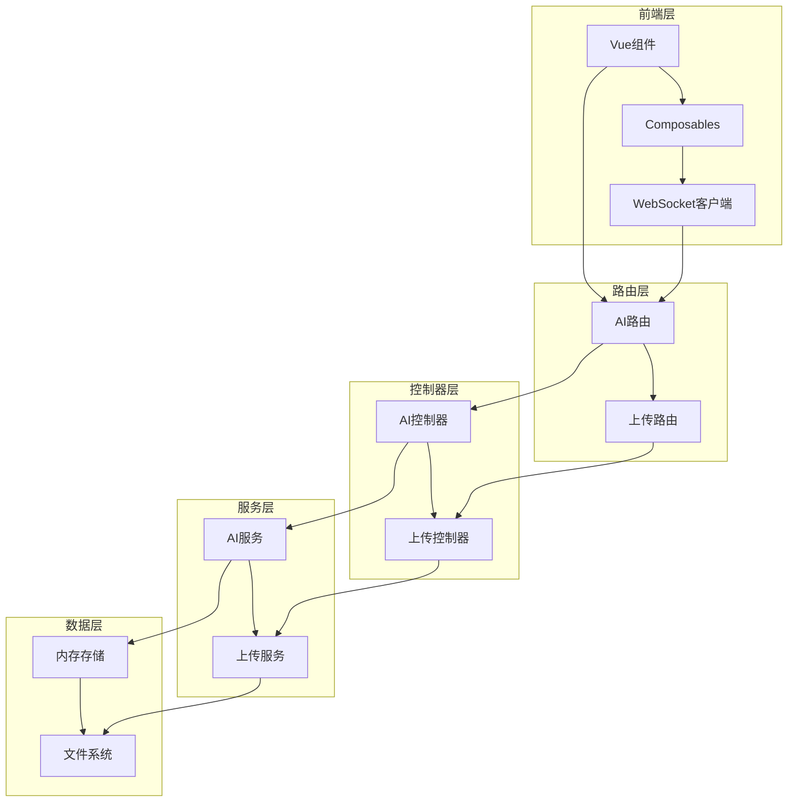
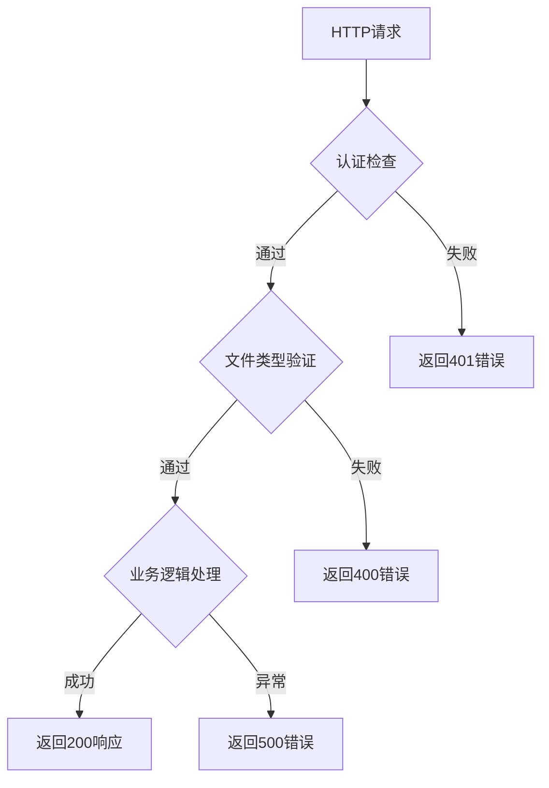
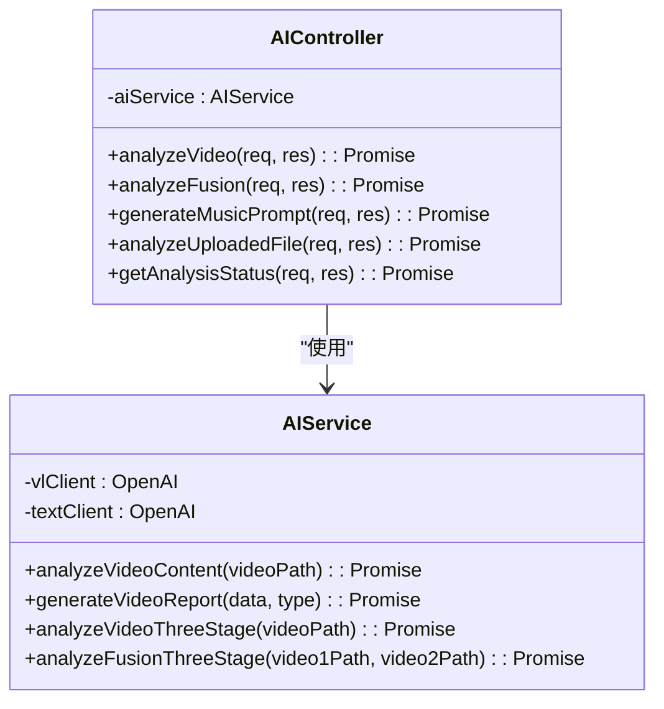
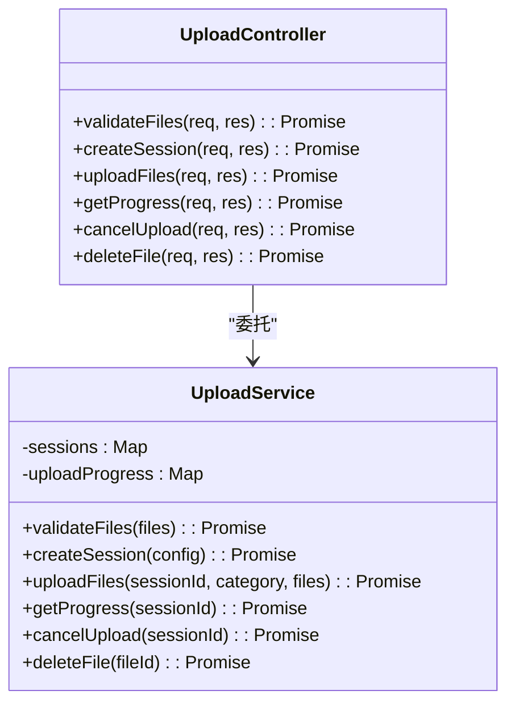
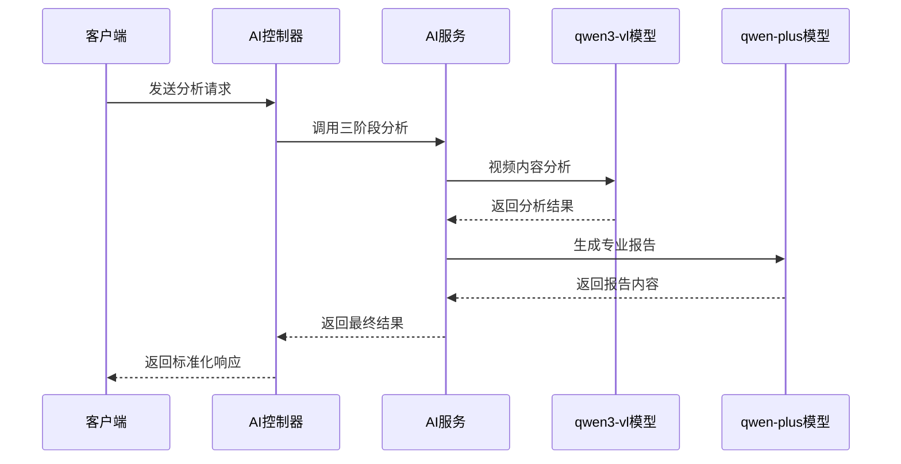
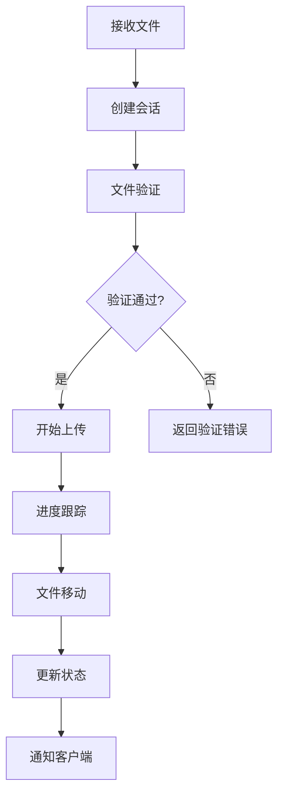
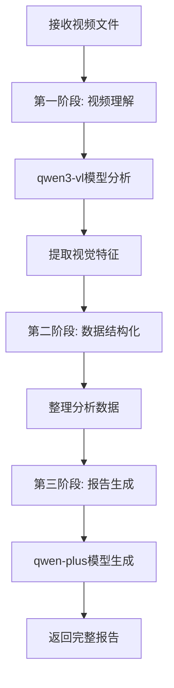
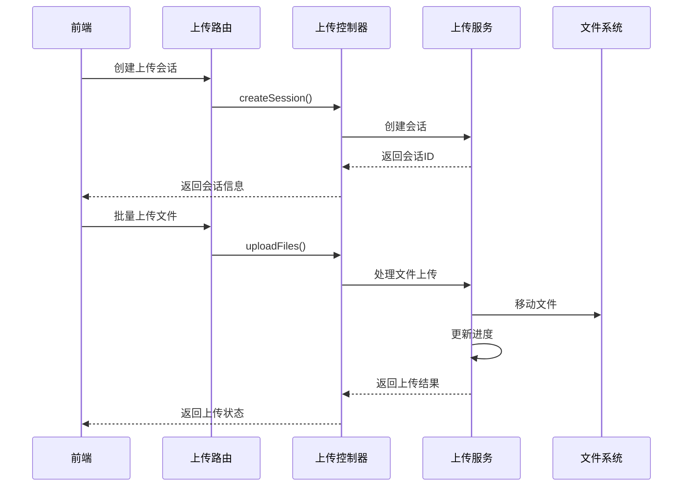
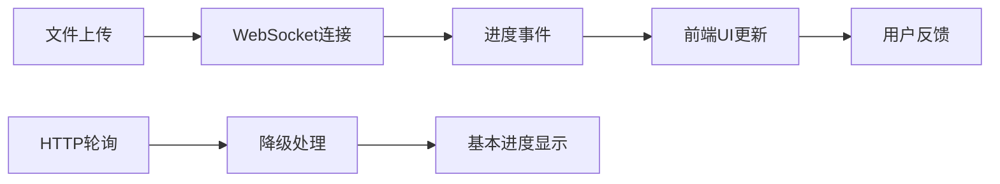
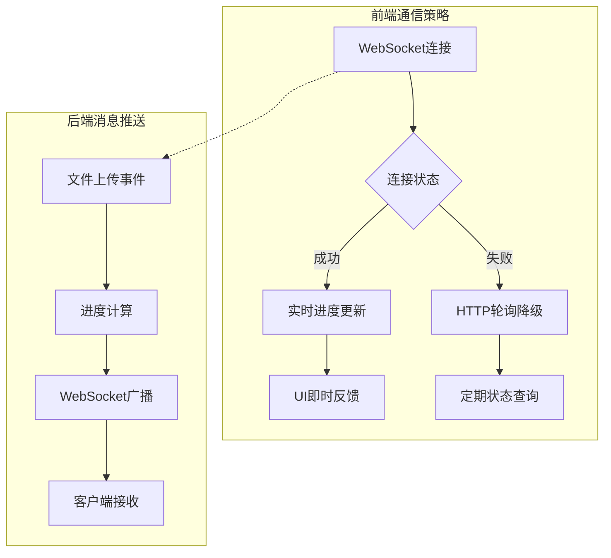

# 路由与控制器

<cite>
**本文档引用的文件**
- [ai.js](file://backend/src/routes/ai.js)
- [upload.js](file://backend/src/routes/upload.js)
- [aiController.js](file://backend/src/controllers/aiController.js)
- [uploadController.js](file://backend/src/controllers/uploadController.js)
- [aiService.js](file://backend/src/services/aiService.js)
- [uploadService.js](file://backend/src/services/uploadService.js)
- [upload.js](file://backend/src/config/upload.js)
- [auth.js](file://backend/src/middleware/auth.js)
- [useAIAnalysis.js](file://frontend/src/composables/useAIAnalysis.js)
- [useWebSocket.js](file://frontend/src/composables/useWebSocket.js)
</cite>

## 目录
1. [简介](#简介)
2. [项目架构概览](#项目架构概览)
3. [路由系统设计](#路由系统设计)
4. [控制器层分析](#控制器层分析)
5. [服务层架构](#服务层架构)
6. [请求处理流程](#请求处理流程)
7. [错误处理机制](#错误处理机制)
8. [前后端交互模式](#前后端交互模式)
9. [性能优化策略](#性能优化策略)
10. [总结](#总结)

## 简介

本文档详细阐述了基于Express.js的路由与控制器系统，重点分析了AI视频分析和文件上传两大核心功能模块。系统采用分层架构设计，通过清晰的职责分离实现了高内聚、低耦合的代码组织结构。

## 项目架构概览

系统采用经典的三层架构模式，包含路由层、控制器层和服务层，每层承担特定职责：



**图表来源**
- [ai.js](file://backend/src/routes/ai.js#L1-L71)
- [upload.js](file://backend/src/routes/upload.js#L1-L62)
- [aiController.js](file://backend/src/controllers/aiController.js#L1-L237)
- [uploadController.js](file://backend/src/controllers/uploadController.js#L1-L285)

## 路由系统设计

### AI分析路由

AI分析路由提供了完整的视频分析功能集合，支持多种分析类型和工作流程：

| HTTP方法 | 路径 | 描述 | 请求体 |
|---------|------|------|--------|
| POST | `/api/ai/analyze/content` | 视频内容分析 | `{videoPath, category}` |
| POST | `/api/ai/analyze/fusion` | 视频融合分析 | `{video1Path, video2Path, category}` |
| POST | `/api/ai/generate/music-prompt` | 背景音乐提示词生成 | `{fusionPlan}` |
| POST | `/api/ai/analyze/upload` | 一体化上传分析 | `multipart/form-data` |
| GET | `/api/ai/analysis/:analysisId/status` | 分析状态查询 | 无 |

**节来源**
- [ai.js](file://backend/src/routes/ai.js#L27-L71)

### 文件上传路由

文件上传路由专注于文件管理和会话控制，提供完整的上传生命周期管理：

| HTTP方法 | 路径 | 描述 | 请求体 |
|---------|------|------|--------|
| POST | `/api/upload/validate` | 文件验证 | `{files}` |
| POST | `/api/upload/session` | 创建上传会话 | `{category, expectedFiles}` |
| POST | `/api/upload/batch` | 批量文件上传 | `multipart/form-data` |
| GET | `/api/upload/progress/:sessionId` | 获取上传进度 | 无 |
| POST | `/api/upload/cancel/:sessionId` | 取消上传 | 无 |
| DELETE | `/api/upload/file/:fileId` | 删除文件 | 无 |

**节来源**
- [upload.js](file://backend/src/routes/upload.js#L46-L62)

### 路由中间件配置

系统集成了多层中间件确保安全性、文件验证和认证：



**图表来源**
- [auth.js](file://backend/src/middleware/auth.js#L4-L36)
- [ai.js](file://backend/src/routes/ai.js#L31-L41)

## 控制器层分析

### AI控制器功能架构

AI控制器负责视频分析业务逻辑的协调和处理，提供统一的API入口：



**图表来源**
- [aiController.js](file://backend/src/controllers/aiController.js#L5-L237)
- [aiService.js](file://backend/src/services/aiService.js#L8-L672)

### 上传控制器功能架构

上传控制器管理文件上传的完整生命周期，包括会话创建、文件处理和进度跟踪：



**图表来源**
- [uploadController.js](file://backend/src/controllers/uploadController.js#L25-L285)
- [uploadService.js](file://backend/src/services/uploadService.js#L12-L416)

### 请求参数解析与验证

控制器层实现了严格的请求参数验证机制：

#### AI控制器参数验证
- **视频路径验证**：检查文件存在性和有效性
- **融合分析验证**：确保两个视频文件都存在
- **融合方案验证**：验证融合计划数据的完整性

#### 上传控制器参数验证
- **文件数量验证**：限制最多3个文件
- **文件类型验证**：支持MP4、AVI格式
- **会话ID验证**：确保有效的上传会话

**节来源**
- [aiController.js](file://backend/src/controllers/aiController.js#L13-L237)
- [uploadController.js](file://backend/src/controllers/uploadController.js#L27-L285)

## 服务层架构

### AI服务层设计

AI服务层采用双模型协同架构，结合视觉理解和文本生成能力：



**图表来源**
- [aiService.js](file://backend/src/services/aiService.js#L418-L474)

### 上传服务层设计

上传服务层提供文件管理和会话控制的核心功能：



**图表来源**
- [uploadService.js](file://backend/src/services/uploadService.js#L118-L296)

### 错误处理与重试机制

服务层实现了完善的错误处理和重试机制：

#### AI服务重试策略
- **指数退避算法**：`wait_time = 2 ^ attempt`
- **最大重试次数**：3次
- **错误分类处理**：网络错误、API限制、数据验证错误

#### 上传服务错误处理
- **文件系统错误**：磁盘空间、权限问题
- **网络传输错误**：连接超时、数据损坏
- **并发控制**：防止资源竞争

**节来源**
- [aiService.js](file://backend/src/services/aiService.js#L614-L672)
- [uploadService.js](file://backend/src/services/uploadService.js#L118-L296)

## 请求处理流程

### 视频内容分析流程

视频内容分析采用三阶段处理模式，确保高质量的分析结果：



**图表来源**
- [aiService.js](file://backend/src/services/aiService.js#L418-L439)

### 文件上传处理流程

文件上传采用会话管理模式，支持进度跟踪和中断恢复：



**图表来源**
- [upload.js](file://backend/src/routes/upload.js#L50-L54)
- [uploadController.js](file://backend/src/controllers/uploadController.js#L102-L147)

### 异步处理与WebSocket集成

系统通过WebSocket实现实时进度更新：



**图表来源**
- [useWebSocket.js](file://frontend/src/composables/useWebSocket.js#L22-L139)

**节来源**
- [aiService.js](file://backend/src/services/aiService.js#L418-L474)
- [uploadService.js](file://backend/src/services/uploadService.js#L118-L296)

## 错误处理机制

### 统一错误响应格式

系统采用标准化的错误响应格式，便于前端处理：

```javascript
{
  "success": false,
  "error": "错误类型",
  "message": "详细错误信息",
  "timestamp": "ISO时间戳"
}
```

### 错误分类与处理策略

| 错误类型 | HTTP状态码 | 处理策略 | 示例场景 |
|---------|-----------|---------|----------|
| 验证错误 | 400 | 参数校验失败 | 文件格式不支持 |
| 权限错误 | 403 | 认证检查失败 | 用户权限不足 |
| 资源不存在 | 404 | 文件或会话不存在 | 视频文件被删除 |
| 系统错误 | 500 | 内部服务异常 | AI模型调用失败 |
| 上传错误 | 500 | 文件传输失败 | 网络中断导致上传失败 |

### 错误恢复机制

- **自动重试**：AI服务的指数退避重试
- **降级处理**：WebSocket连接失败时的HTTP轮询
- **状态回滚**：上传失败时的文件清理
- **日志记录**：完整的错误追踪和调试信息

**节来源**
- [aiController.js](file://backend/src/controllers/aiController.js#L14-L51)
- [uploadController.js](file://backend/src/controllers/uploadController.js#L29-L56)

## 前后端交互模式

### REST API设计原则

系统遵循RESTful设计原则，提供清晰的资源操作接口：

#### 资源命名规范
- **复数名词**：使用复数形式表示资源集合
- **层级关系**：通过路径体现资源间的层次关系
- **动词避免**：通过HTTP方法表达操作语义

#### 状态码使用规范
- **200 OK**：成功获取资源
- **201 Created**：成功创建资源
- **400 Bad Request**：客户端请求参数错误
- **401 Unauthorized**：未认证访问
- **403 Forbidden**：权限不足
- **404 Not Found**：资源不存在
- **500 Internal Server Error**：服务器内部错误

### 实时通信机制

系统采用WebSocket与HTTP相结合的方式实现实时通信：



**图表来源**
- [useWebSocket.js](file://frontend/src/composables/useWebSocket.js#L22-L139)
- [uploadService.js](file://backend/src/services/uploadService.js#L23-L31)

### 前端状态管理

前端通过Composables模式管理复杂的异步状态：

#### useAIAnalysis Composable
- **状态管理**：分析状态、进度、结果、错误
- **生命周期**：自动清理、错误恢复
- **存储集成**：本地存储分析历史
- **导出功能**：支持多种格式导出

#### useWebSocket Composable  
- **连接管理**：自动重连、连接状态监控
- **事件处理**：进度更新、错误处理
- **会话绑定**：基于会话ID的消息路由

**节来源**
- [useAIAnalysis.js](file://frontend/src/composables/useAIAnalysis.js#L14-L448)
- [useWebSocket.js](file://frontend/src/composables/useWebSocket.js#L1-L139)

## 性能优化策略

### 并发处理优化

- **Promise.all**：同时处理多个视频分析任务
- **流式处理**：支持大文件的分块上传
- **连接池**：复用HTTP连接减少开销
- **缓存机制**：缓存分析结果避免重复计算

### 内存管理优化

- **流式上传**：避免大文件占用过多内存
- **及时清理**：定期清理过期的上传会话
- **垃圾回收**：主动释放不再使用的资源

### 网络传输优化

- **压缩传输**：启用Gzip压缩减少带宽消耗
- **分块传输**：支持HTTP/1.1分块编码
- **CDN集成**：静态资源的CDN加速

### AI服务优化

- **模型并行**：视觉分析和文本生成并行处理
- **批处理**：支持批量文件分析
- **智能调度**：根据负载动态调整处理优先级

**节来源**
- [aiService.js](file://backend/src/services/aiService.js#L452-L474)
- [uploadService.js](file://backend/src/services/uploadService.js#L118-L296)

## 总结

本文档详细分析了基于Express.js的路由与控制器系统，展示了现代Web应用中分层架构的最佳实践。系统通过清晰的职责分离、完善的错误处理和高效的异步处理机制，实现了高可用性和良好的用户体验。

### 核心优势

1. **模块化设计**：路由、控制器、服务各司其职，便于维护和扩展
2. **异步处理**：支持长时间运行的任务和实时进度更新
3. **错误恢复**：完善的重试机制和降级策略
4. **前后端协作**：RESTful API与WebSocket的有机结合
5. **性能优化**：多层次的性能优化策略

### 设计亮点

- **三阶段处理模式**：AI分析的科学化处理流程
- **会话管理模式**：文件上传的完整生命周期管理
- **实时通信机制**：WebSocket与HTTP的混合通信策略
- **标准化响应格式**：统一的错误和成功响应格式

这套路由与控制器系统为构建大型Web应用提供了坚实的基础，展现了现代JavaScript后端开发的最佳实践。