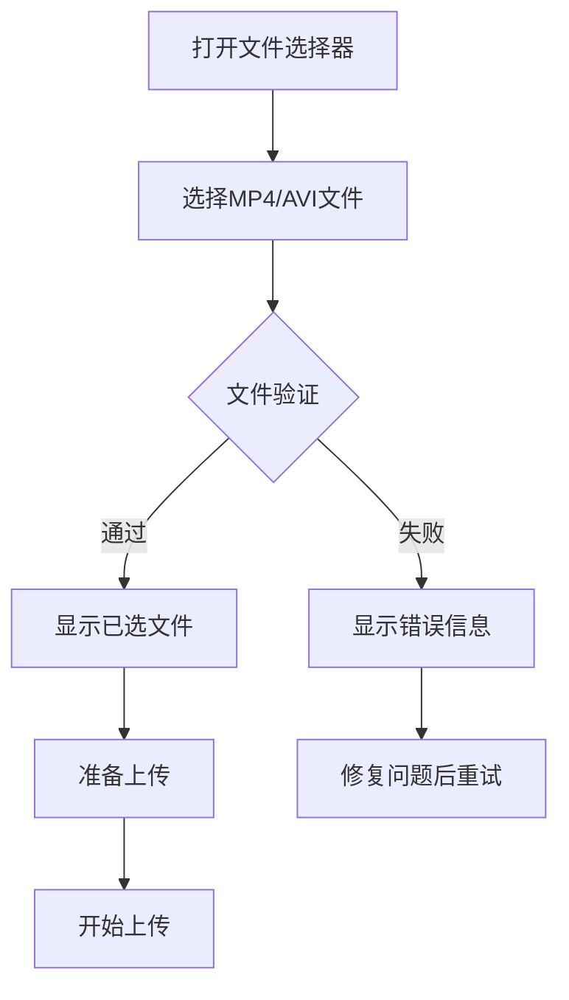
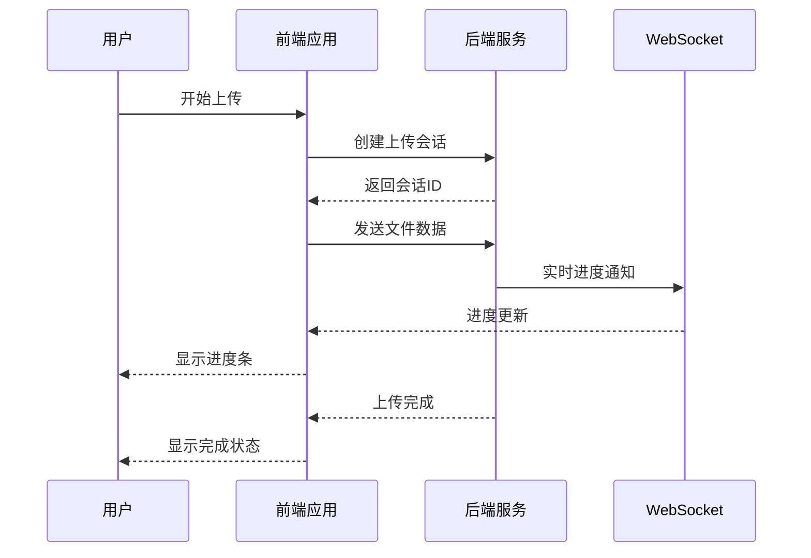

# 快速入门指南

<cite>
**本文档引用的文件**
- [package.json](file://package.json)
- [frontend/package.json](file://frontend/package.json)
- [backend/package.json](file://backend/package.json)
- [frontend/vite.config.js](file://frontend/vite.config.js)
- [backend/src/app.js](file://backend/src/app.js)
- [backend/src/config/upload.js](file://backend/src/config/upload.js)
- [backend/src/controllers/uploadController.js](file://backend/src/controllers/uploadController.js)
- [backend/src/controllers/aiController.js](file://backend/src/controllers/aiController.js)
- [frontend/src/main.js](file://frontend/src/main.js)
- [frontend/src/App.vue](file://frontend/src/App.vue)
- [frontend/src/components/FileUploader.vue](file://frontend/src/components/FileUploader.vue)
- [backend/src/services/aiService.js](file://backend/src/services/aiService.js)
- [specs/001-responsive-h5-upload/quickstart.md](file://specs/001-responsive-h5-upload/quickstart.md)
</cite>

## 目录
1. [项目简介](#项目简介)
2. [系统要求](#系统要求)
3. [环境准备](#环境准备)
4. [项目克隆与安装](#项目克隆与安装)
5. [环境变量配置](#环境变量配置)
6. [服务启动](#服务启动)
7. [基本操作流程](#基本操作流程)
8. [常见问题排查](#常见问题排查)
9. [总结](#总结)

## 项目简介

newvedio-project是一个基于Vue.js 3和Node.js的响应式H5视频文件上传应用，支持最多3个同类型视频文件（MP4/AVI）的批量上传，具备文件分类、实时进度、AI智能分析等功能。该应用专为移动端设计，提供流畅的用户体验。

### 核心特性

- ✅ **移动端优先**：响应式设计，完美适配各种移动设备
- ✅ **批量上传**：支持最多3个同类型视频文件
- ✅ **文件分类**：个人视频和景区视频分类存储
- ✅ **实时进度**：WebSocket实时进度更新
- ✅ **智能验证**：文件格式、大小、数量自动验证
- ✅ **AI分析**：集成阿里云通义千问API进行视频内容分析

## 系统要求

在开始之前，请确保您的系统满足以下要求：

- **Node.js**: 18.0+ 版本
- **npm**: 8.0+ 或 yarn 1.22+
- **现代浏览器**: 支持 (iOS 10.3+, Android Chrome 64+)

## 环境准备

### 1. 安装Node.js

访问 [Node.js官网](https://nodejs.org/) 下载并安装适合您操作系统的版本。

验证安装：
```bash
node --version
npm --version
```

### 2. 验证环境

确保以下命令都能正常执行：
```bash
node --version  # 应显示18.0+版本号
npm --version   # 应显示8.0+版本号
```

## 项目克隆与安装

### 步骤1：克隆项目

```bash
# 克隆项目到本地
git clone https://github.com/your-repository/newvedio-project.git
cd newvedio-project
```

### 步骤2：安装后端依赖

```bash
# 进入后端目录
cd backend

# 安装依赖
npm install

# 验证安装
npm list --depth=0
```

### 步骤3：安装前端依赖

```bash
# 返回项目根目录
cd ..

# 进入前端目录
cd frontend

# 安装依赖
npm install

# 验证安装
npm list --depth=0
```

**章节来源**
- [frontend/package.json](file://frontend/package.json#L1-L38)
- [backend/package.json](file://backend/package.json#L1-L41)

## 环境变量配置

### 1. 后端环境配置

创建 `backend/.env` 文件：

```env
# 服务器配置
PORT=8005
NODE_ENV=development

# 文件上传配置
MAX_FILE_SIZE=314572800        # 300MB
MAX_FILES_PER_SESSION=3
UPLOAD_BASE_DIR=./upload

# 安全配置
CORS_ORIGIN=http://localhost:3005
RATE_LIMIT_WINDOW=900000       # 15分钟
RATE_LIMIT_MAX=100

# 日志配置
LOG_LEVEL=info
LOG_DIR=./logs

# AI API配置
DASHSCOPE_API_KEY=your-dashscope-api-key
```

### 2. 前端环境配置

创建 `frontend/.env` 文件：

```env
# API配置
VITE_API_BASE_URL=http://localhost:8005
VITE_WS_BASE_URL=ws://localhost:8005

# 功能配置
VITE_MAX_FILE_SIZE=314572800
VITE_MAX_FILES=3
VITE_SUPPORTED_FORMATS=mp4,avi

# 开发配置
VITE_ENABLE_MOCK=false
VITE_DEBUG_MODE=true
```

### 3. 获取API密钥

**重要提示**：您需要从阿里云获取DASHSCOPE_API_KEY才能使用AI分析功能。

1. 注册阿里云账号
2. 访问通义千问API控制台
3. 创建API密钥
4. 将API密钥填入上述环境变量

**章节来源**
- [backend/src/config/upload.js](file://backend/src/config/upload.js#L1-L53)
- [frontend/vite.config.js](file://frontend/vite.config.js#L1-L33)

## 服务启动

### 开发模式启动

打开两个终端窗口，分别启动前端和后端服务：

#### 终端1：启动后端服务

```bash
# 进入后端目录
cd backend

# 启动后端开发服务器
npm run dev
```

后端服务将在 `http://localhost:8005` 启动。

#### 终端2：启动前端服务

```bash
# 进入前端目录
cd frontend

# 启动前端开发服务器
npm run dev
```

前端服务将在 `http://localhost:3005` 启动。

### 生产模式启动

#### 后端生产启动

```bash
# 进入后端目录
cd backend

# 构建生产版本（如果需要）
npm run build

# 启动生产服务器
npm start
```

#### 前端生产启动

```bash
# 进入前端目录
cd frontend

# 构建生产版本
npm run build

# 启动预览服务器
npm run preview
```

**章节来源**
- [backend/src/app.js](file://backend/src/app.js#L1-L166)
- [frontend/vite.config.js](file://frontend/vite.config.js#L1-L33)

## 基本操作流程

### 第一步：访问H5页面

1. 打开浏览器访问：`http://localhost:3005`
2. 页面将显示视频上传界面
3. 界面会自动适配移动设备尺寸

### 第二步：上传视频文件

#### 1. 选择文件



**图表来源**
- [frontend/src/components/FileUploader.vue](file://frontend/src/components/FileUploader.vue#L1-L200)

#### 2. 文件规格要求

- **格式支持**：MP4、AVI
- **文件大小**：单个文件最大300MB
- **文件数量**：最多3个文件
- **格式一致性**：所有文件必须是相同格式

### 第三步：选择分类

1. 选择"个人视频"或"景区视频"分类
2. 系统将根据分类组织文件存储位置

### 第四步：查看上传进度



**图表来源**
- [backend/src/controllers/uploadController.js](file://backend/src/controllers/uploadController.js#L1-L285)

### 第五步：触发AI分析

上传完成后，您可以选择以下AI分析功能：

#### 内容分析
- 分析单个视频的内容要素
- 提取关键帧和场景信息
- 生成专业的视频内容报告

#### 融合分析（需要2个视频）
- 分析两个视频的融合可能性
- 提供创意融合建议
- 生成背景音乐提示词

### 第六步：获取分析结果

1. 分析完成后，系统会显示详细的结果报告
2. 您可以查看视频的技术参数、内容分析和专业建议
3. 对于融合分析，还可以获得背景音乐制作建议

**章节来源**
- [frontend/src/App.vue](file://frontend/src/App.vue#L1-L682)
- [backend/src/controllers/aiController.js](file://backend/src/controllers/aiController.js#L1-L237)

## 常见问题排查

### 1. 端口冲突问题

**问题现象**：服务启动时提示端口被占用

**解决方案**：
```bash
# 检查端口占用情况
netstat -ano | findstr :3005  # Windows
lsof -i :3005                 # macOS/Linux

# 杀死占用进程（Windows）
taskkill /PID <进程ID> /F

# 杀死占用进程（macOS/Linux）
kill -9 <进程ID>
```

或者修改配置文件中的端口号。

### 2. 依赖安装失败

**问题现象**：npm install 失败

**解决方案**：
```bash
# 清理npm缓存
npm cache clean --force

# 删除node_modules和package-lock.json
rm -rf node_modules package-lock.json

# 重新安装依赖
npm install
```

### 3. API密钥配置错误

**问题现象**：AI分析功能无法使用

**解决方案**：
1. 确认DASHSCOPE_API_KEY正确填写
2. 检查API密钥权限设置
3. 验证网络连接是否正常

### 4. 文件上传失败

**问题现象**：文件上传中断或失败

**排查步骤**：
1. 检查文件格式和大小是否符合要求
2. 确认服务器磁盘空间充足
3. 查看浏览器控制台错误信息
4. 检查网络连接稳定性

### 5. WebSocket连接问题

**问题现象**：上传进度不更新

**解决方案**：
1. 检查防火墙设置
2. 确认WebSocket端口开放
3. 尝试清除浏览器缓存

**章节来源**
- [backend/src/app.js](file://backend/src/app.js#L1-L166)
- [specs/001-responsive-h5-upload/quickstart.md](file://specs/001-responsive-h5-upload/quickstart.md#L344-L462)

## 总结

通过本指南，您应该能够：

1. **成功部署项目**：完成环境准备、项目克隆和依赖安装
2. **配置环境变量**：正确设置API密钥和其他必要的配置
3. **启动服务**：同时运行前端和后端服务
4. **使用核心功能**：完成视频上传和AI分析流程
5. **解决常见问题**：处理端口冲突、依赖安装等问题

### 下一步建议

- 探索更多AI分析功能
- 自定义前端界面样式
- 部署到生产环境
- 扩展其他视频处理功能

### 技术支持

如果遇到问题，请参考：
- 项目文档和API说明
- 浏览器开发者工具调试
- 社区论坛和技术支持

祝您使用愉快！