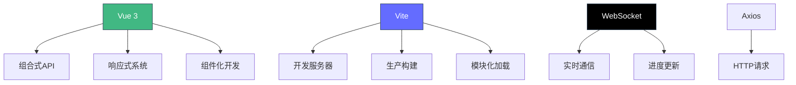
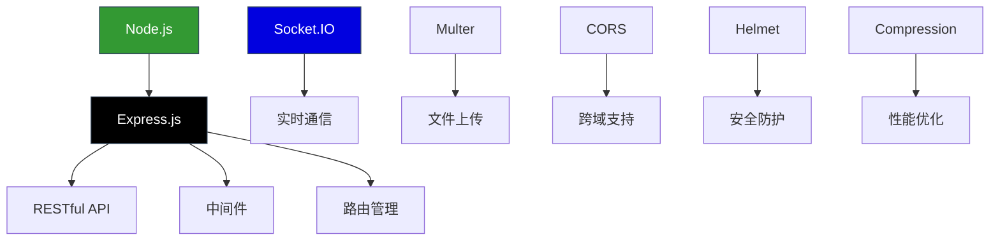
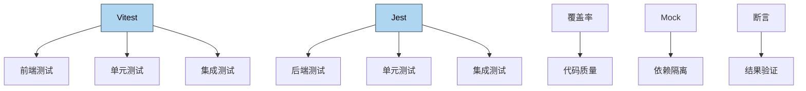
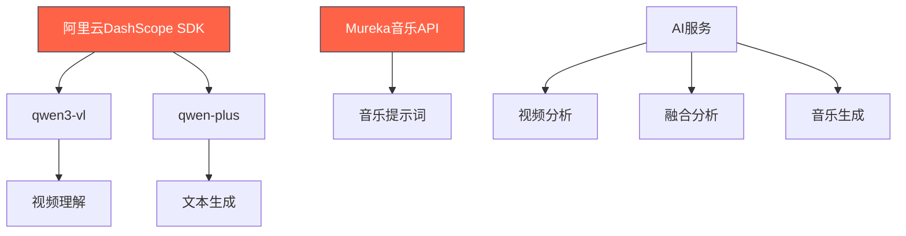
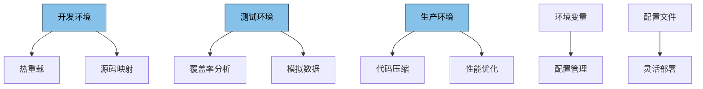
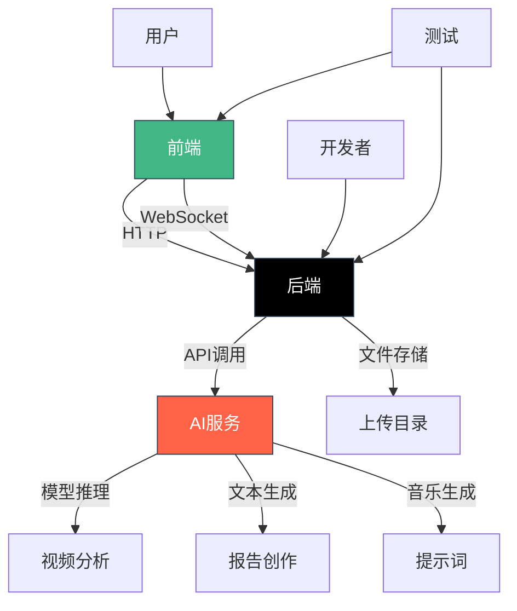

# 技术栈

<cite>
**本文档引用的文件**   
- [frontend/package.json](file://frontend/package.json)
- [backend/package.json](file://backend/package.json)
- [frontend/vite.config.js](file://frontend/vite.config.js)
- [backend/jest.config.js](file://backend/jest.config.js)
- [backend/src/app.js](file://backend/src/app.js)
- [frontend/src/main.js](file://frontend/src/main.js)
- [frontend/src/composables/useAIAnalysis.js](file://frontend/src/composables/useAIAnalysis.js)
- [backend/src/controllers/aiController.js](file://backend/src/controllers/aiController.js)
- [backend/src/services/aiService.js](file://backend/src/services/aiService.js)
- [frontend/vitest.config.js](file://frontend/vitest.config.js)
- [backend/tests/setup.js](file://backend/tests/setup.js)
- [frontend/src/composables/useWebSocket.js](file://frontend/src/composables/useWebSocket.js)
</cite>

## 目录
1. [技术栈全景](#技术栈全景)
2. [前端技术栈](#前端技术栈)
3. [后端技术栈](#后端技术栈)
4. [测试框架](#测试框架)
5. [AI集成技术](#ai集成技术)
6. [环境配置](#环境配置)
7. [架构概览](#架构概览)

## 技术栈全景

本项目采用现代化的全栈技术架构，从前端到后端再到测试框架，构建了一个完整的视频分析应用。前端使用Vue 3和Vite构建用户界面，通过WebSocket实现实时通信；后端采用Node.js和Express.js提供RESTful API服务，结合Socket.IO实现双向通信；测试方面使用Vitest和Jest进行全面的测试覆盖。项目特别集成了阿里云DashScope SDK和Mureka音乐API，实现了AI驱动的视频内容分析和音乐提示词生成功能。

## 前端技术栈

前端技术栈以Vue 3为核心，采用Vite作为构建工具，通过WebSocket与后端进行实时通信。Vue 3的组合式API提供了更好的逻辑复用性和代码组织方式，而Vite则通过其创新的开发服务器和构建优化，显著提升了开发体验和生产环境的性能。

**图表来源**
- [frontend/package.json](file://frontend/package.json)
- [frontend/src/main.js](file://frontend/src/main.js)
- [frontend/src/composables/useWebSocket.js](file://frontend/src/composables/useWebSocket.js)

**本节来源**
- [frontend/package.json](file://frontend/package.json#L1-L38)
- [frontend/src/main.js](file://frontend/src/main.js#L1-L7)
- [frontend/src/composables/useWebSocket.js](file://frontend/src/composables/useWebSocket.js#L1-L139)

## 后端技术栈

后端技术栈基于Node.js和Express.js构建，提供了稳定高效的API服务。Express.js作为轻量级的Web应用框架，使得RESTful API的构建变得简单而直观。通过集成Socket.IO，实现了服务器与客户端之间的实时双向通信，为视频上传进度和AI分析状态的实时更新提供了支持。

**图表来源**
- [backend/package.json](file://backend/package.json)
- [backend/src/app.js](file://backend/src/app.js)

**本节来源**
- [backend/package.json](file://backend/package.json#L1-L41)
- [backend/src/app.js](file://backend/src/app.js#L1-L166)

## 测试框架

项目采用Vitest和Jest作为测试框架，为前端和后端代码提供了全面的测试覆盖。Vitest作为Vite生态的测试工具，与Vite无缝集成，提供了快速的测试执行和实时的测试反馈。Jest则为后端代码提供了强大的测试能力，包括模拟、覆盖率分析等功能。

**图表来源**
- [frontend/vitest.config.js](file://frontend/vitest.config.js)
- [backend/jest.config.js](file://backend/jest.config.js)

**本节来源**
- [frontend/vitest.config.js](file://frontend/vitest.config.js#L1-L122)
- [backend/jest.config.js](file://backend/jest.config.js#L1-L82)
- [backend/tests/setup.js](file://backend/tests/setup.js#L1-L201)

## AI集成技术

项目通过集成阿里云DashScope SDK和Mureka音乐API，实现了强大的AI功能。DashScope SDK提供了qwen3-vl和qwen-plus两个模型，分别用于视频内容理解和文本生成。Mureka音乐API则用于生成背景音乐提示词，为视频创作提供创意支持。

**图表来源**
- [backend/src/services/aiService.js](file://backend/src/services/aiService.js)
- [backend/src/controllers/aiController.js](file://backend/src/controllers/aiController.js)

**本节来源**
- [backend/src/services/aiService.js](file://backend/src/services/aiService.js#L1-L672)
- [backend/src/controllers/aiController.js](file://backend/src/controllers/aiController.js#L1-L237)

## 环境配置

项目针对开发、测试和生产环境提供了不同的配置方案。Vite配置文件中定义了开发服务器的端口和代理设置，以及生产构建的优化选项。通过环境变量的合理使用，确保了不同环境下的配置灵活性和安全性。

**图表来源**
- [frontend/vite.config.js](file://frontend/vite.config.js)
- [backend/src/app.js](file://backend/src/app.js)

**本节来源**
- [frontend/vite.config.js](file://frontend/vite.config.js#L1-L33)
- [backend/src/app.js](file://backend/src/app.js#L1-L166)

## 架构概览

项目整体架构从前端到后端再到AI服务，形成了一个完整的闭环。前端通过Vue 3和Vite构建用户界面，通过WebSocket与后端通信；后端通过Express.js提供API服务，通过Socket.IO实现双向通信；AI服务通过DashScope SDK和Mureka音乐API提供智能分析功能。各组件之间通过清晰的接口和协议进行交互，确保了系统的可维护性和可扩展性。

**图表来源**
- [frontend/package.json](file://frontend/package.json)
- [backend/package.json](file://backend/package.json)
- [backend/src/app.js](file://backend/src/app.js)
- [frontend/src/main.js](file://frontend/src/main.js)

**本节来源**
- [frontend/package.json](file://frontend/package.json#L1-L38)
- [backend/package.json](file://backend/package.json#L1-L41)
- [backend/src/app.js](file://backend/src/app.js#L1-L166)
- [frontend/src/main.js](file://frontend/src/main.js#L1-L7)