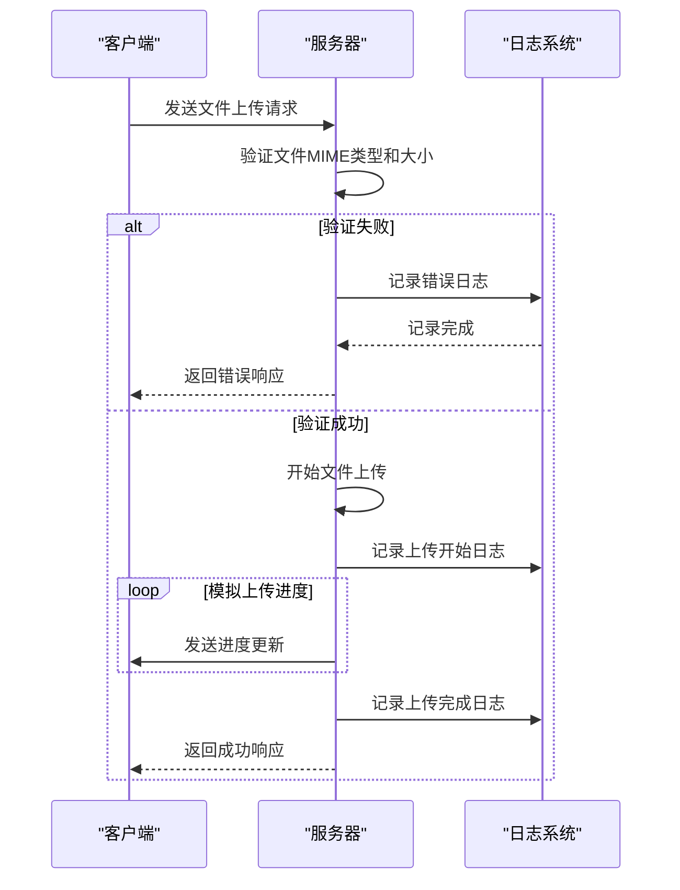
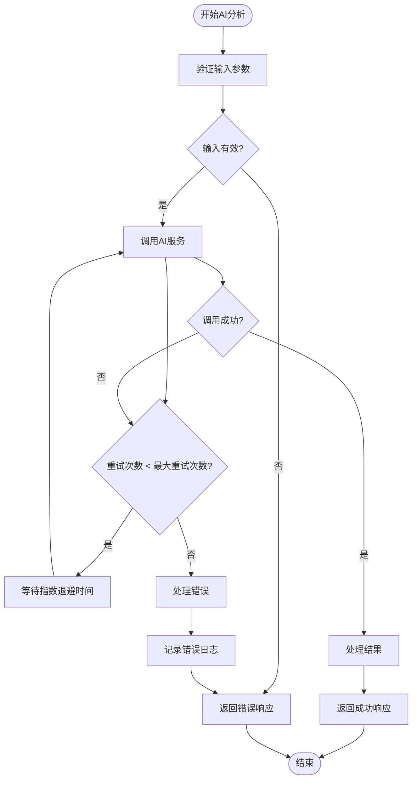
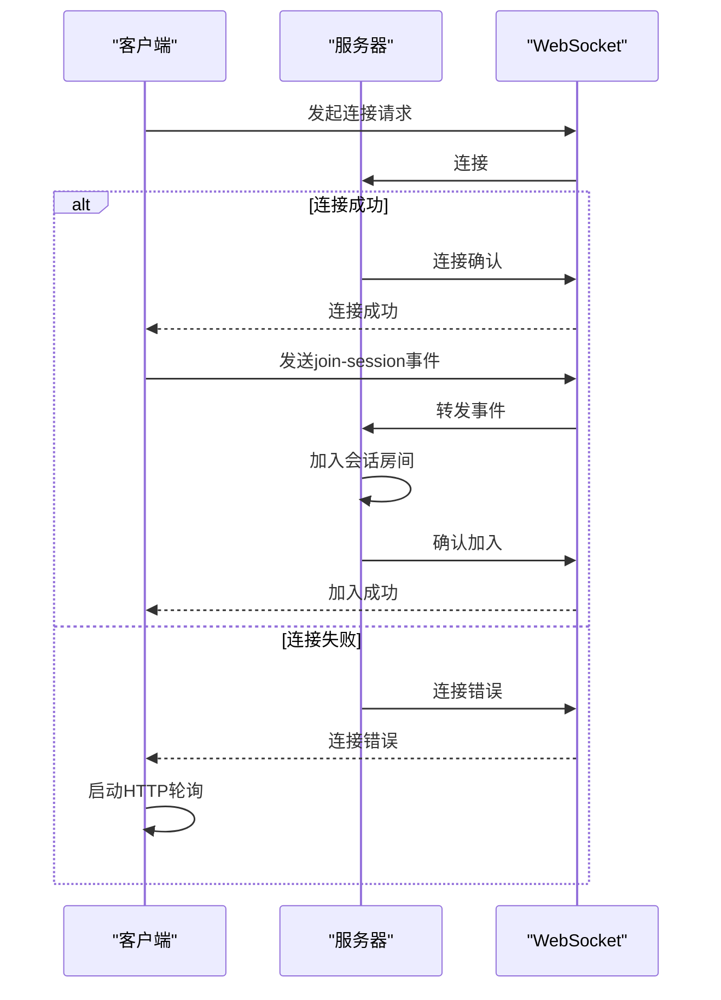
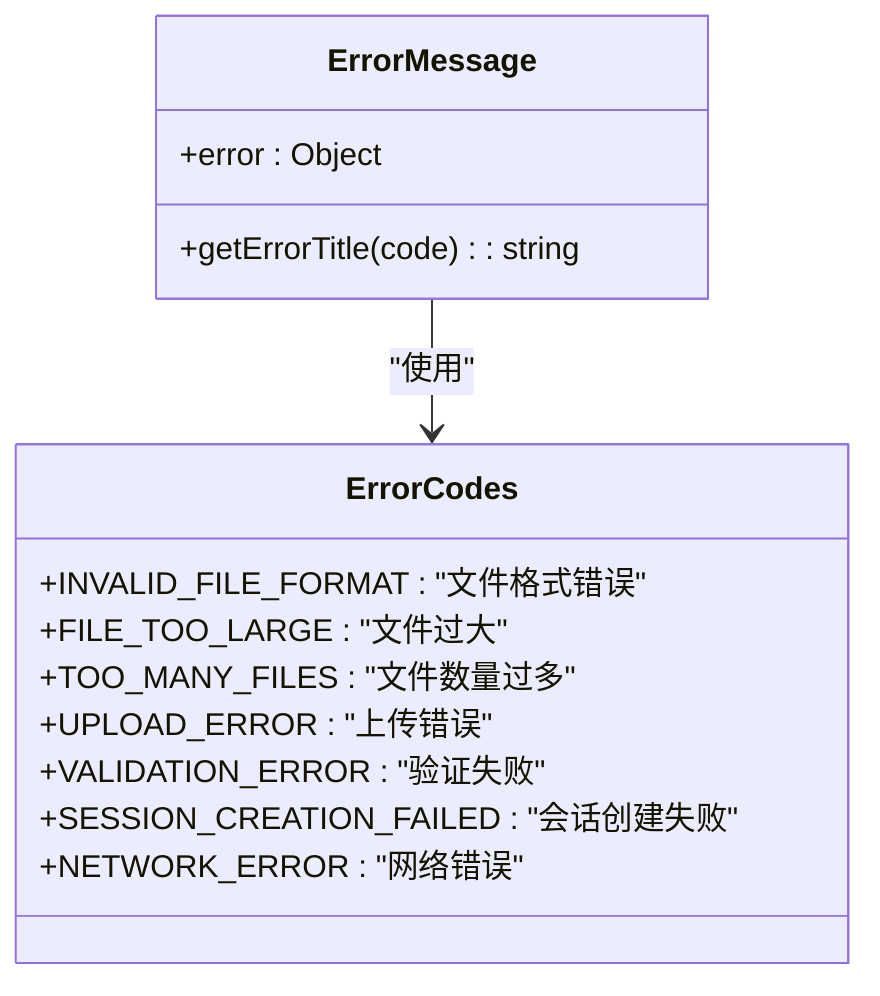
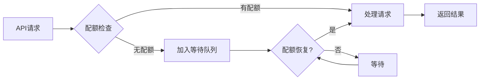

# 故障排除

<cite>
**本文档引用的文件**  
- [logger.js](file://backend/src/utils/logger.js)
- [ErrorMessage.vue](file://frontend/src/components/ErrorMessage.vue)
- [uploadController.js](file://backend/src/controllers/uploadController.js)
- [uploadService.js](file://backend/src/services/uploadService.js)
- [aiService.js](file://backend/src/services/aiService.js)
- [aiController.js](file://backend/src/controllers/aiController.js)
- [upload.js](file://backend/src/middleware/upload.js)
- [useWebSocket.js](file://frontend/src/composables/useWebSocket.js)
- [app.js](file://backend/src/app.js)
- [upload.js](file://backend/src/config/upload.js)
</cite>

## 目录
1. [简介](#简介)
2. [日志记录机制](#日志记录机制)
3. [典型故障场景与排查步骤](#典型故障场景与排查步骤)
4. [错误码与根本原因追溯](#错误码与根本原因追溯)
5. [网络与API问题解决方案](#网络与api问题解决方案)
6. [系统性问题排查方法论](#系统性问题排查方法论)

## 简介
本文档旨在为开发者提供一个全面的故障排除指南，帮助诊断和解决在使用视频上传与AI分析系统时遇到的常见问题。文档基于系统的日志记录机制，详细说明了如何通过日志级别（debug、error）定位问题，并列举了文件上传失败、AI分析超时、WebSocket连接中断等典型故障场景。同时，文档解释了ErrorMessage.vue组件如何向用户展示友好错误信息，以及开发者如何从错误码追溯到根本原因。最后，文档提供了网络问题、API密钥无效、模型调用配额耗尽等场景的解决方案，并建议了系统性的问题排查方法论。

## 日志记录机制

系统采用Winston日志库实现多级别的日志记录，支持开发和生产环境的不同需求。日志分为用户日志和开发者日志，分别用于记录用户操作和系统调试信息。

```mermaid
classDiagram
class Logger {
+level : string
+format : object
+transports : array
+user(message, meta) : void
+dev(message, meta) : void
}
class FileTransport {
+filename : string
+level : string
+maxsize : number
+maxFiles : number
}
class ConsoleTransport {
+format : object
}
Logger --> FileTransport : "writes to"
Logger --> ConsoleTransport : "writes to"
Logger --> "error.log" : "writes errors"
Logger --> "combined.log" : "writes all logs"
```

**图表来源**  
- [logger.js](file://backend/src/utils/logger.js#L1-L66)

**本节来源**  
- [logger.js](file://backend/src/utils/logger.js#L1-L66)

## 典型故障场景与排查步骤

### 文件上传失败

#### MIME类型不符
当上传的文件MIME类型不在允许列表中时，系统会拒绝上传。

**排查步骤：**
1. 检查`backend/src/config/upload.js`中的`allowedMimeTypes`配置
2. 确认上传文件的实际MIME类型
3. 查看日志中的`INVALID_MIME_TYPE`错误信息

#### 文件大小超限
当上传的文件大小超过配置限制时，系统会拒绝上传。

**排查步骤：**
1. 检查`backend/src/config/upload.js`中的`maxFileSize`配置
2. 确认上传文件的实际大小
3. 查看日志中的`FILE_TOO_LARGE`错误信息

#### 文件上传超时
当文件上传过程中连接中断或超时时，系统会记录相关错误。

**排查步骤：**
1. 检查网络连接稳定性
2. 查看`useWebSocket.js`中的连接配置
3. 检查服务器端的超时设置



**图表来源**  
- [uploadController.js](file://backend/src/controllers/uploadController.js#L101-L147)
- [uploadService.js](file://backend/src/services/uploadService.js#L118-L296)
- [logger.js](file://backend/src/utils/logger.js#L48-L64)

**本节来源**  
- [uploadController.js](file://backend/src/controllers/uploadController.js#L101-L147)
- [uploadService.js](file://backend/src/services/uploadService.js#L118-L296)
- [upload.js](file://backend/src/middleware/upload.js#L25-L44)

### AI分析超时

当AI模型处理视频分析请求超时或失败时，系统会进行重试并记录错误。

**排查步骤：**
1. 检查`DASHSCOPE_API_KEY`环境变量是否正确配置
2. 查看`aiService.js`中的重试机制配置
3. 检查网络连接到AI服务的稳定性
4. 查看日志中的`AI_SERVICE_ERROR`错误信息



**图表来源**  
- [aiService.js](file://backend/src/services/aiService.js#L617-L667)
- [aiController.js](file://backend/src/controllers/aiController.js#L13-L52)

**本节来源**  
- [aiService.js](file://backend/src/services/aiService.js#L617-L667)
- [aiController.js](file://backend/src/controllers/aiController.js#L13-L52)

### WebSocket连接中断

当WebSocket连接意外中断时，系统会尝试重新连接或降级到HTTP轮询模式。

**排查步骤：**
1. 检查`useWebSocket.js`中的连接配置
2. 确认服务器WebSocket端口是否开放
3. 检查防火墙或代理设置
4. 查看日志中的WebSocket连接错误



**图表来源**  
- [useWebSocket.js](file://frontend/src/composables/useWebSocket.js#L22-L115)
- [app.js](file://backend/src/app.js#L114-L130)

**本节来源**  
- [useWebSocket.js](file://frontend/src/composables/useWebSocket.js#L22-L115)
- [app.js](file://backend/src/app.js#L114-L130)

## 错误码与根本原因追溯

### ErrorMessage.vue组件分析

ErrorMessage.vue组件负责向用户展示友好错误信息，将技术性错误转换为用户可理解的提示。



**图表来源**  
- [ErrorMessage.vue](file://frontend/src/components/ErrorMessage.vue#L24-L51)

**本节来源**  
- [ErrorMessage.vue](file://frontend/src/components/ErrorMessage.vue#L24-L51)

### 错误码映射表

| 错误码 | 用户友好标题 | 可能原因 | 解决方案 |
|--------|-------------|---------|---------|
| INVALID_FILE_FORMAT | 文件格式错误 | 文件扩展名不在允许列表中 | 使用.mp4或.avi格式的文件 |
| FILE_TOO_LARGE | 文件过大 | 文件大小超过300MB限制 | 压缩文件或分割大文件 |
| TOO_MANY_FILES | 文件数量过多 | 上传文件超过3个限制 | 减少上传文件数量 |
| UPLOAD_ERROR | 上传错误 | 上传过程中发生未知错误 | 检查网络连接后重试 |
| VALIDATION_ERROR | 验证失败 | 请求数据验证失败 | 检查请求参数格式 |
| SESSION_CREATION_FAILED | 会话创建失败 | 创建上传会话失败 | 检查服务器状态后重试 |
| NETWORK_ERROR | 网络错误 | 网络连接问题 | 检查网络连接 |

**本节来源**  
- [ErrorMessage.vue](file://frontend/src/components/ErrorMessage.vue#L34-L44)
- [uploadController.js](file://backend/src/controllers/uploadController.js#L32-L37)
- [upload.js](file://backend/src/middleware/upload.js#L58-L81)

## 网络与API问题解决方案

### 网络问题
网络不稳定可能导致上传中断或API调用失败。

**解决方案：**
1. 实现断点续传功能
2. 增加请求超时时间
3. 实现自动重试机制
4. 提供HTTP轮询作为WebSocket的备用方案

### API密钥无效
当DASHSCOPE_API_KEY配置错误或过期时，AI服务调用会失败。

**解决方案：**
1. 检查环境变量`DASHSCOPE_API_KEY`是否正确设置
2. 验证API密钥的有效期
3. 在`aiService.js`中添加密钥验证逻辑
4. 提供密钥管理界面

### 模型调用配额耗尽
当AI模型调用次数达到配额限制时，后续请求会被拒绝。

**解决方案：**
1. 监控API调用配额使用情况
2. 实现配额预警机制
3. 提供配额管理界面
4. 实现请求队列和优先级管理



**图表来源**  
- [aiService.js](file://backend/src/services/aiService.js#L10-L18)
- [app.js](file://backend/src/app.js#L143)

**本节来源**  
- [aiService.js](file://backend/src/services/aiService.js#L10-L18)
- [app.js](file://backend/src/app.js#L143)

## 系统性问题排查方法论

### 五步排查法
1. **重现问题**：确认问题是否可稳定重现
2. **检查日志**：查看相关组件的日志输出
3. **验证配置**：检查相关配置文件和环境变量
4. **测试依赖**：验证外部服务和依赖的可用性
5. **逐步排除**：通过二分法缩小问题范围

### 日志级别使用指南
- **error级别**：记录系统错误和异常，用于快速定位严重问题
- **debug级别**：记录详细的调试信息，用于深入分析问题
- **info级别**：记录系统运行状态，用于监控系统健康状况
- **user级别**：记录用户操作，用于审计和用户行为分析

### 根本原因分析流程
1. 收集所有相关日志和错误信息
2. 分析错误发生的时间线和上下文
3. 确定问题影响的组件和范围
4. 验证可能的假设
5. 实施解决方案并验证效果

**本节来源**  
- [logger.js](file://backend/src/utils/logger.js#L18-L64)
- [app.js](file://backend/src/app.js#L93-L102)
- [aiService.js](file://backend/src/services/aiService.js#L617-L667)