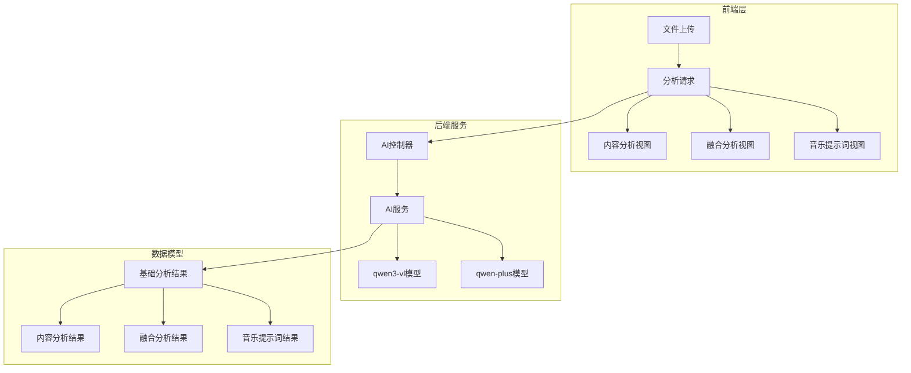
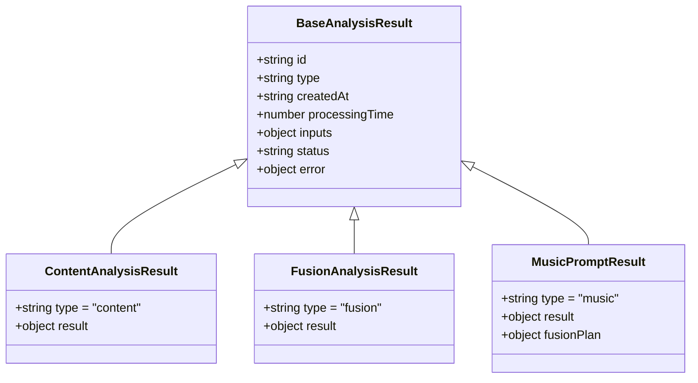
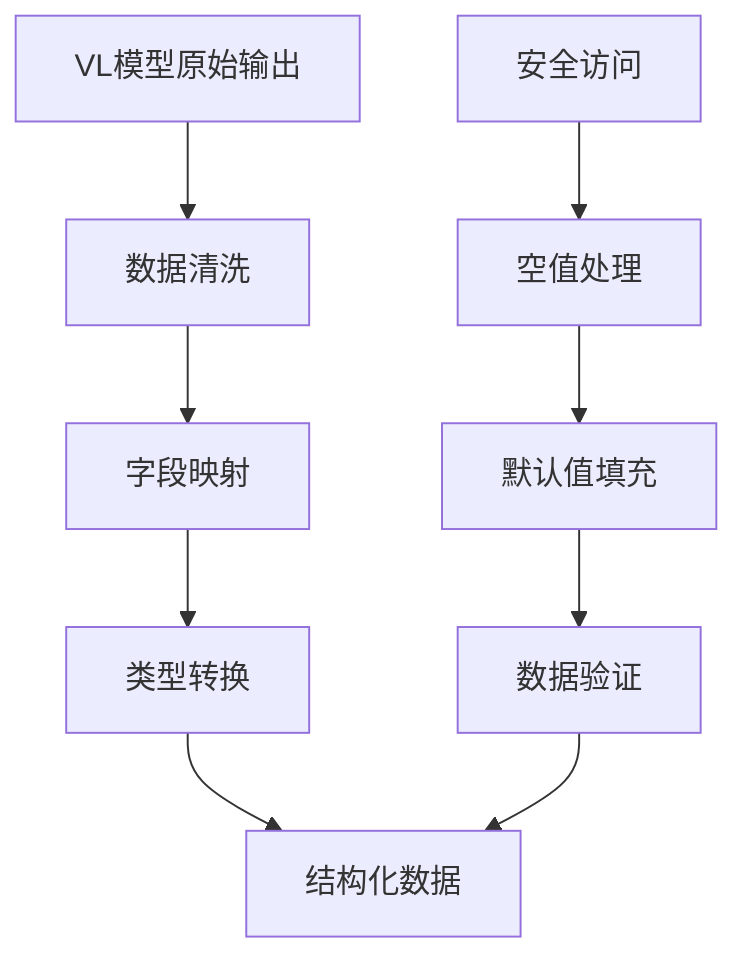
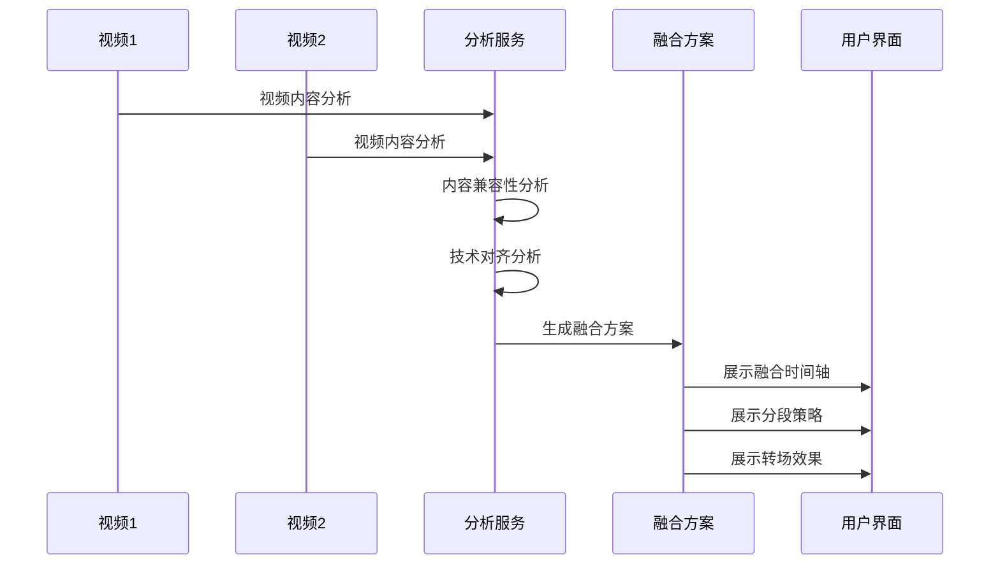
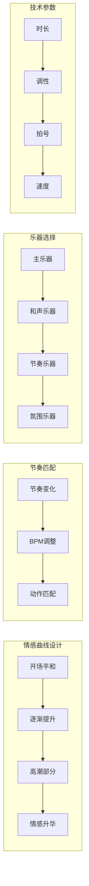
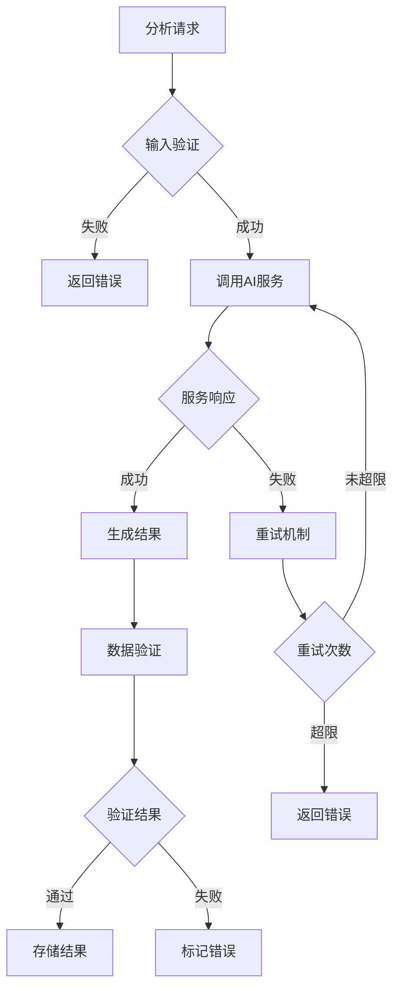
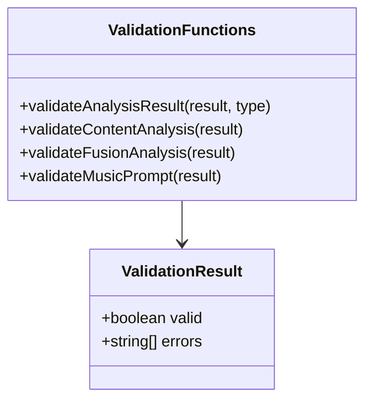
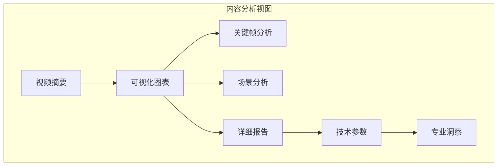
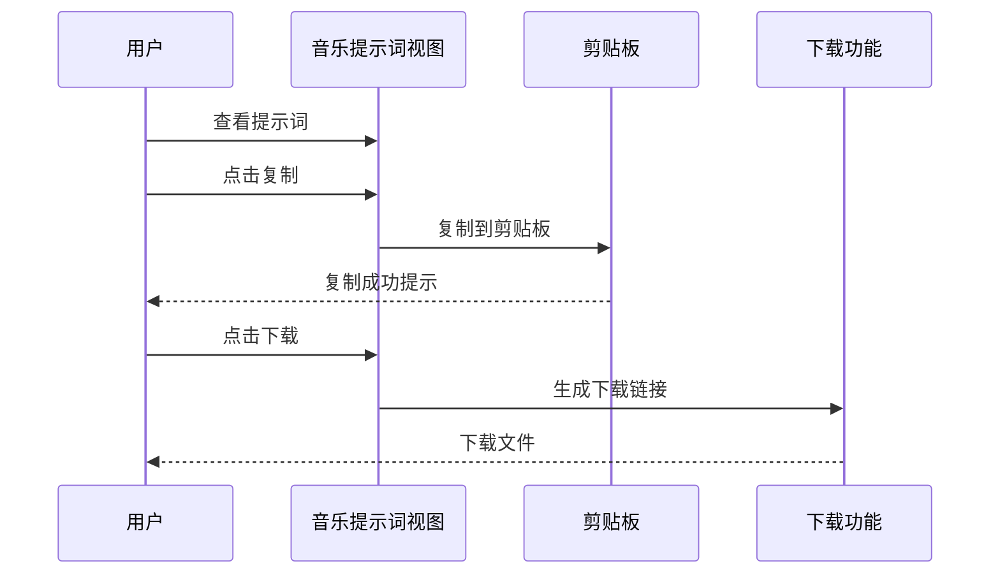

# 分析报告模型

<cite>
**本文档引用的文件**
- [analysisDataStructures.js](file://frontend/src/utils/analysisDataStructures.js)
- [aiController.js](file://backend/src/controllers/aiController.js)
- [aiService.js](file://backend/src/services/aiService.js)
- [ContentAnalysisView.vue](file://frontend/src/components/ContentAnalysisView.vue)
- [FusionAnalysisView.vue](file://frontend/src/components/FusionAnalysisView.vue)
- [MusicPromptView.vue](file://frontend/src/components/MusicPromptView.vue)
- [analysisDataStructures.test.js](file://frontend/src/tests/unit/analysisDataStructures.test.js)
- [data-model.md](file://specs/001-responsive-h5-upload/data-model.md)
</cite>

## 目录
1. [简介](#简介)
2. [项目结构概览](#项目结构概览)
3. [核心数据结构](#核心数据结构)
4. [视频内容分析模型](#视频内容分析模型)
5. [视频融合分析模型](#视频融合分析模型)
6. [背景音乐提示词模型](#背景音乐提示词模型)
7. [元数据与错误处理](#元数据与错误处理)
8. [数据验证机制](#数据验证机制)
9. [前端展示组件](#前端展示组件)
10. [总结](#总结)

## 简介

本文档详细描述了Trae项目中AI分析报告的数据模型结构，涵盖了三种核心AI分析结果：视频内容分析、视频融合方案和背景音乐提示词。这些数据模型基于双模型协同架构设计，通过qwen3-vl模型进行视频理解分析，使用qwen-plus模型生成专业报告和提示词。

## 项目结构概览

项目采用前后端分离架构，前端使用Vue.js框架，后端使用Node.js + Express.js。数据分析流程分为三个阶段：视频理解、数据结构化和报告生成。

**图表来源**
- [aiController.js](file://backend/src/controllers/aiController.js#L1-L237)
- [aiService.js](file://backend/src/services/aiService.js#L1-L672)

## 核心数据结构

### 基础分析结果结构

所有分析结果都继承自基础分析结果结构，提供统一的元数据和状态管理：

**图表来源**
- [analysisDataStructures.js](file://frontend/src/utils/analysisDataStructures.js#L6-L30)

**章节来源**
- [analysisDataStructures.js](file://frontend/src/utils/analysisDataStructures.js#L6-L401)

## 视频内容分析模型

### VL模型原始输出

视频内容分析的第一阶段由qwen3-vl模型完成，产生原始的视觉理解数据：

| 字段 | 类型 | 描述 | 示例值 |
|------|------|------|--------|
| duration | number | 视频时长（秒） | 150 |
| keyframes | Array | 关键帧信息数组 | [{timestamp: "00:10", description: "日落景色", importance: "high"}] |
| scenes | Array | 场景分类信息 | [{type: "风景", startTime: "00:00", endTime: "00:30", atmosphere: "宁静"}] |
| objects | Array | 检测到的物体 | [{name: "人物", confidence: 0.95, first_seen: "00:05"}] |
| actions | Array | 识别的动作序列 | [{action: "跑步", startTime: "00:10", endTime: "00:20"}] |
| visual_analysis | Object | 视觉分析结果 | {color_palette: ["#FF6B35", "#4ADE80"], lighting: "自然光"} |
| quality_assessment | Object | 质量评估 | {sharpness: "高", stability: "中等", overall_quality: "优秀"} |
| emotional_tone | string | 情感基调 | "宁静" |
| content_summary | string | 内容概要 | "一段展现自然美景的视频..." |

### 结构化数据转换

原始输出经过结构化处理，形成更易用的数据格式：

**图表来源**
- [aiService.js](file://backend/src/services/aiService.js#L480-L532)

### 结构化数据结构

| 字段 | 类型 | 描述 | 设计逻辑 |
|------|------|------|----------|
| videoInfo | Object | 视频基本信息 | 包含时长、格式、分辨率等技术参数 |
| contentAnalysis | Object | 内容分析结果 | 关键帧、场景、物体、动作的详细分析 |
| technicalAnalysis | Object | 技术分析结果 | 情感基调、色彩分布、质量评分等 |

**章节来源**
- [analysisDataStructures.js](file://frontend/src/utils/analysisDataStructures.js#L35-L120)

## 视频融合分析模型

### 融合方案设计

视频融合分析针对两个视频文件，生成专业的融合制作方案：

**图表来源**
- [aiService.js](file://backend/src/services/aiService.js#L449-L475)

### 分段策略字段

| 字段 | 类型 | 描述 | 设计考虑 |
|------|------|------|----------|
| id | string | 分段唯一标识 | 便于追踪和管理 |
| source | string | 来源视频 | 'video1' \| 'video2' |
| startTime | string | 原视频开始时间 | 精确到秒 |
| endTime | string | 原视频结束时间 | 精确到秒 |
| targetStart | string | 目标视频开始时间 | 融合后的时间点 |
| targetEnd | string | 目标视频结束时间 | 融合后的时间点 |
| description | string | 分段描述 | 说明选择原因 |
| reason | string | 选择理由 | 技术和创意考量 |

### 转场效果设计

| 字段 | 类型 | 描述 | 应用场景 |
|------|------|------|----------|
| fromSegment | string | 起始分段 | 指定转场的起点 |
| toSegment | string | 目标分段 | 指定转场的终点 |
| type | string | 转场类型 | 'fade' \| 'wipe' \| 'dissolve' \| 'slide' |
| duration | number | 转场时长（秒） | 通常1-3秒 |
| parameters | Object | 转场参数 | 具体的转场设置 |
| reason | string | 选择理由 | 与内容和节奏匹配 |

### 音频处理机制

| 字段 | 类型 | 描述 | 技术要点 |
|------|------|------|----------|
| backgroundMusic | Object | 背景音乐设置 | 音量和淡入淡出控制 |
| soundEffects | Array | 音效建议 | 增强视觉效果 |
| volumeBalance | Object | 音量平衡 | 视频间的音量协调 |

**章节来源**
- [analysisDataStructures.js](file://frontend/src/utils/analysisDataStructures.js#L101-L219)

## 背景音乐提示词模型

### 音乐生成要素

音乐提示词模型基于融合分析结果，生成专业的AI音乐创作提示：

**图表来源**
- [aiService.js](file://backend/src/services/aiService.js#L273-L370)

### 情感曲线结构

| 字段 | 类型 | 描述 | 设计原则 |
|------|------|------|----------|
| start | number | 开始时间（秒） | 精确到秒级 |
| end | number | 结束时间（秒） | 确保连续性 |
| emotion | string | 情绪状态 | 如peaceful, uplifting等 |
| intensity | number | 强度 (0-1) | 控制情感表达 |
| description | string | 详细描述 | 说明情感变化原因 |

### 乐器配置详解

| 类别 | 示例乐器 | 作用 | 音乐风格 |
|------|----------|------|----------|
| 主乐器 | Piano, Violin | 主旋律演奏 | 旋律主导 |
| 和声乐器 | Cello, Guitar | 和声支撑 | 和声丰富 |
| 节奏乐器 | Drums, Bass | 节奏基础 | 节奏稳定 |
| 氛围乐器 | Strings, Synth Pad | 空间感营造 | 氛围渲染 |
| 效果器 | Reverb, Delay | 音效处理 | 空间效果 |

### 技术参数配置

| 参数 | 类型 | 描述 | 推荐值 |
|------|------|------|--------|
| duration | number | 精确时长（秒） | 45秒 |
| key | string | 调性 | C major |
| timeSignature | string | 拍号 | 4/4 |
| tempo | number | 速度（BPM） | 120 |
| dynamics | string | 动态 | moderate |
| structure | string | 结构 | intro-verse-chorus-outro |

**章节来源**
- [analysisDataStructures.js](file://frontend/src/utils/analysisDataStructures.js#L222-L327)

## 元数据与错误处理

### 基础元数据

所有分析结果包含统一的元数据结构：

| 字段 | 类型 | 描述 | 用途 |
|------|------|------|------|
| id | string | 唯一标识符 | 格式: analysis_type_timestamp_random |
| createdAt | string | 创建时间 | ISO 8601格式 |
| processingTime | number | 处理耗时 | 毫秒 |
| status | string | 处理状态 | 'processing' \| 'completed' \| 'failed' |
| error | object/null | 错误信息 | 失败时包含详细错误 |

### 错误处理机制

**图表来源**
- [aiService.js](file://backend/src/services/aiService.js#L614-L671)

### 重试机制

系统实现了基于指数退避的重试机制：

| 尝试次数 | 延迟时间 | 策略 |
|----------|----------|------|
| 1 | 1秒 | 第一次重试 |
| 2 | 2秒 | 指数增长 |
| 3 | 4秒 | 最大重试次数 |

**章节来源**
- [aiService.js](file://backend/src/services/aiService.js#L614-L671)

## 数据验证机制

### 验证函数设计

系统提供了专门的数据验证函数，确保数据完整性：

**图表来源**
- [analysisDataStructures.js](file://frontend/src/utils/analysisDataStructures.js#L350-L401)

### 验证规则

| 分析类型 | 必需字段 | 验证规则 | 错误消息 |
|----------|----------|----------|----------|
| 内容分析 | vlAnalysis, finalReport, structuredData | 字段存在性检查 | "缺少XXX分析结果" |
| 融合分析 | video1Analysis, video2Analysis, fusionPlan | 字段存在性检查 | "缺少视频X分析结果" |
| 音乐提示词 | prompt, basicInfo | 字段存在性检查 | "缺少提示词" |

**章节来源**
- [analysisDataStructures.test.js](file://frontend/src/tests/unit/analysisDataStructures.test.js#L82-L480)

## 前端展示组件

### 内容分析视图

内容分析视图提供多种展示方式：

**图表来源**
- [ContentAnalysisView.vue](file://frontend/src/components/ContentAnalysisView.vue#L1-L800)

### 融合分析视图

融合分析视图专注于视频合并方案：

| 组件 | 功能 | 展示形式 |
|------|------|----------|
| 视频概览 | 显示两个视频的基本信息 | 统计卡片 |
| 兼容性分析 | 评估视频融合的可行性 | 状态指示器 |
| 时间轴可视化 | 展示融合后的时间安排 | 图形化时间轴 |
| 融合方案详情 | 详细的技术方案 | 分段显示 |

### 音乐提示词视图

音乐提示词视图提供简洁的文本展示：

**图表来源**
- [MusicPromptView.vue](file://frontend/src/components/MusicPromptView.vue#L1-L249)

**章节来源**
- [ContentAnalysisView.vue](file://frontend/src/components/ContentAnalysisView.vue#L1-L800)
- [FusionAnalysisView.vue](file://frontend/src/components/FusionAnalysisView.vue#L1-L800)
- [MusicPromptView.vue](file://frontend/src/components/MusicPromptView.vue#L1-L249)

## 总结

Trae项目的分析报告数据模型体现了现代AI应用的最佳实践，通过以下特点实现了高质量的视频分析和处理：

### 核心优势

1. **模块化设计**：三种分析类型各有独立的数据结构，便于维护和扩展
2. **双模型协同**：qwen3-vl负责视频理解，qwen-plus负责文本生成，充分发挥各自优势
3. **结构化输出**：从原始AI输出到最终用户可见的结构化数据，确保数据可用性
4. **完善的验证**：多层次的数据验证机制，保证数据质量和系统稳定性
5. **用户体验**：直观的前端展示组件，支持多种交互方式

### 技术特色

- **指数退避重试**：智能的错误恢复机制
- **安全数据处理**：防止空值和异常数据影响系统
- **灵活的验证**：支持多种数据格式和边界条件
- **响应式设计**：适应不同设备和屏幕尺寸

### 应用价值

该数据模型不仅适用于当前的视频分析需求，还为未来的功能扩展奠定了坚实基础。通过标准化的数据接口和灵活的结构设计，系统能够轻松适配新的分析类型和业务需求。