# 背景音乐提示词模型

<cite>
**本文档引用的文件**
- [analysisDataStructures.js](file://frontend/src/utils/analysisDataStructures.js)
- [aiController.js](file://backend/src/controllers/aiController.js)
- [aiService.js](file://backend/src/services/aiService.js)
- [MusicPromptView.vue](file://frontend/src/components/MusicPromptView.vue)
- [useAIAnalysis.js](file://frontend/src/composables/useAIAnalysis.js)
- [qwen3-VL-视频理解API.md](file://qwen3-VL-视频理解API.md)
</cite>

## 目录
1. [简介](#简介)
2. [项目结构概述](#项目结构概述)
3. [核心数据结构](#核心数据结构)
4. [架构设计](#架构设计)
5. [详细组件分析](#详细组件分析)
6. [数据流分析](#数据流分析)
7. [性能考虑](#性能考虑)
8. [故障排除指南](#故障排除指南)
9. [结论](#结论)

## 简介

背景音乐提示词模型是一个基于人工智能的视频内容分析系统，专门设计用于生成高质量的背景音乐创作提示词。该系统通过分析视频内容，结合视频融合方案，为AI音乐生成工具提供精确、可执行的音乐创作指令。

该模型的核心创新在于将视频分析结果与音乐创作需求无缝对接，通过结构化的提示词格式，确保生成的音乐能够完美契合视频内容的情感表达和叙事逻辑。

## 项目结构概述

系统采用前后端分离架构，前端使用Vue.js框架，后端基于Node.js和Express框架。核心组件分布在以下目录结构中：

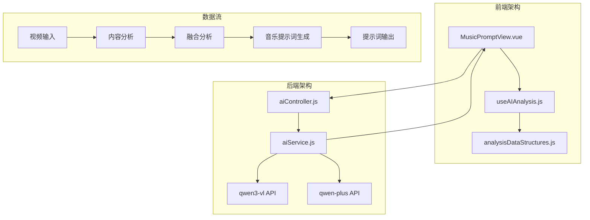

**图表来源**
- [MusicPromptView.vue](file://frontend/src/components/MusicPromptView.vue#L1-L50)
- [aiController.js](file://backend/src/controllers/aiController.js#L1-L50)
- [aiService.js](file://backend/src/services/aiService.js#L1-L50)

**章节来源**
- [MusicPromptView.vue](file://frontend/src/components/MusicPromptView.vue#L1-L249)
- [aiController.js](file://backend/src/controllers/aiController.js#L1-L237)

## 核心数据结构

### MusicPromptResult结构详解

MusicPromptResult是整个系统的核心数据结构，继承自BaseAnalysisResult，专门用于存储背景音乐提示词的生成结果。

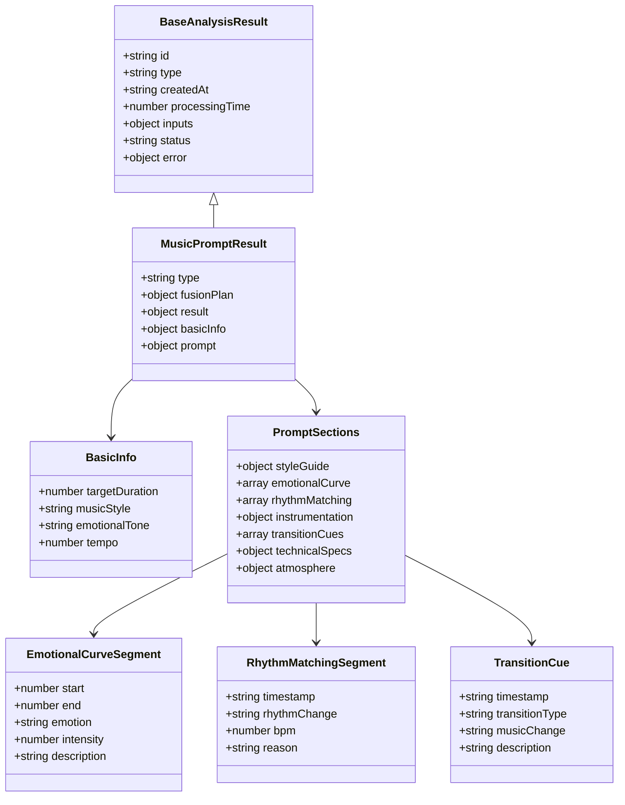

**图表来源**
- [analysisDataStructures.js](file://frontend/src/utils/analysisDataStructures.js#L221-L327)

### 基础信息字段分析

基础信息部分包含了音乐创作的核心参数：

| 字段名 | 类型 | 描述 | 默认值 | 确定依据 |
|--------|------|------|--------|----------|
| targetDuration | number | 目标音乐时长（秒） | 45 | 基于视频融合方案的目标时长 |
| musicStyle | string | 音乐风格 | '' | 根据视频内容的情感基调和视觉元素确定 |
| emotionalTone | string | 情感基调 | '' | 基于视频分析得出的情感评估结果 |
| tempo | number | BPM（每分钟节拍数） | 0 | 结合视频节奏和情感强度计算 |

### prompt.sections结构详解

prompt.sections是提示词的核心组成部分，包含六个关键模块：

#### styleGuide - 音乐风格定位

styleGuide模块负责定义音乐的整体风格框架：

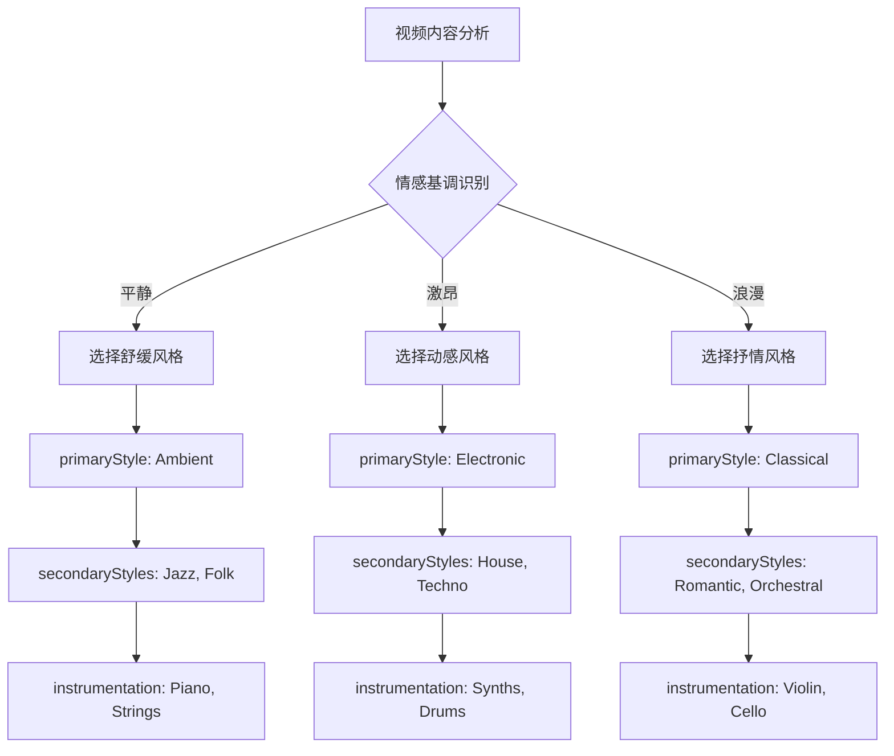

**图表来源**
- [aiService.js](file://backend/src/services/aiService.js#L273-L369)

#### emotionalCurve - 情感曲线设计

情感曲线是音乐提示词中最关键的部分，它将视频叙事逻辑转化为音乐结构：

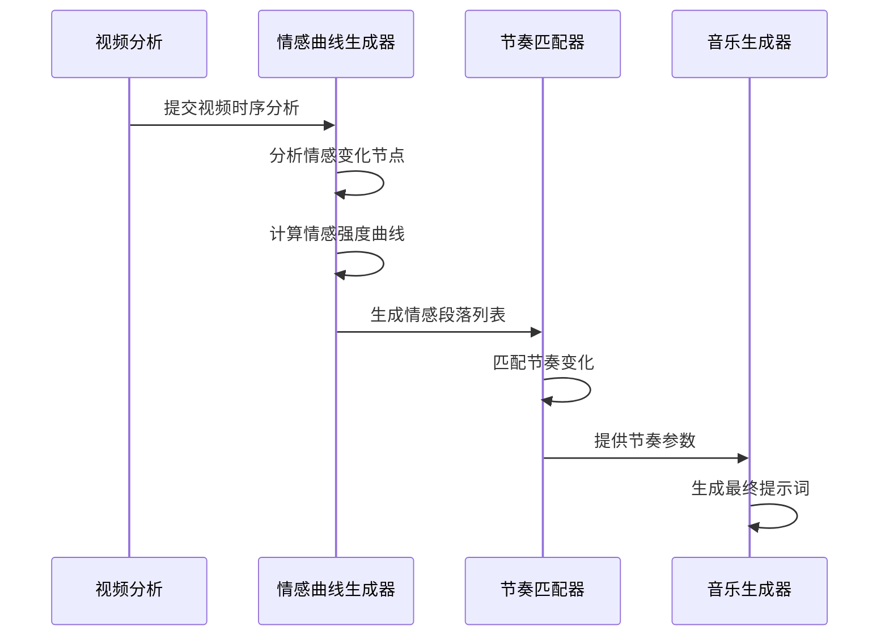

**图表来源**
- [aiService.js](file://backend/src/services/aiService.js#L288-L369)

#### rhythmMatching - 节奏匹配

节奏匹配模块确保音乐节奏与视频画面动作完美同步：

| 时间戳 | 节奏变化 | BPM值 | 变化理由 |
|--------|----------|-------|----------|
| 00:15 | 加速 | 120 | 与画面动作匹配 |
| 00:30 | 维持 | 120 | 保持情感稳定 |
| 00:45 | 减速 | 100 | 为高潮做准备 |

#### instrumentation - 乐器选择

乐器配置采用层次化设计，确保音色丰富度和层次感：

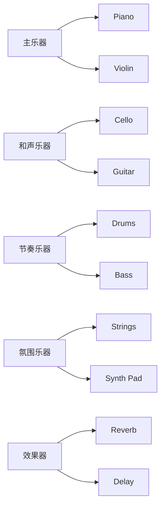

**图表来源**
- [analysisDataStructures.js](file://frontend/src/utils/analysisDataStructures.js#L281-L296)

#### transitionCues - 转场指示

转场指示确保音乐与视频转场效果的完美同步：

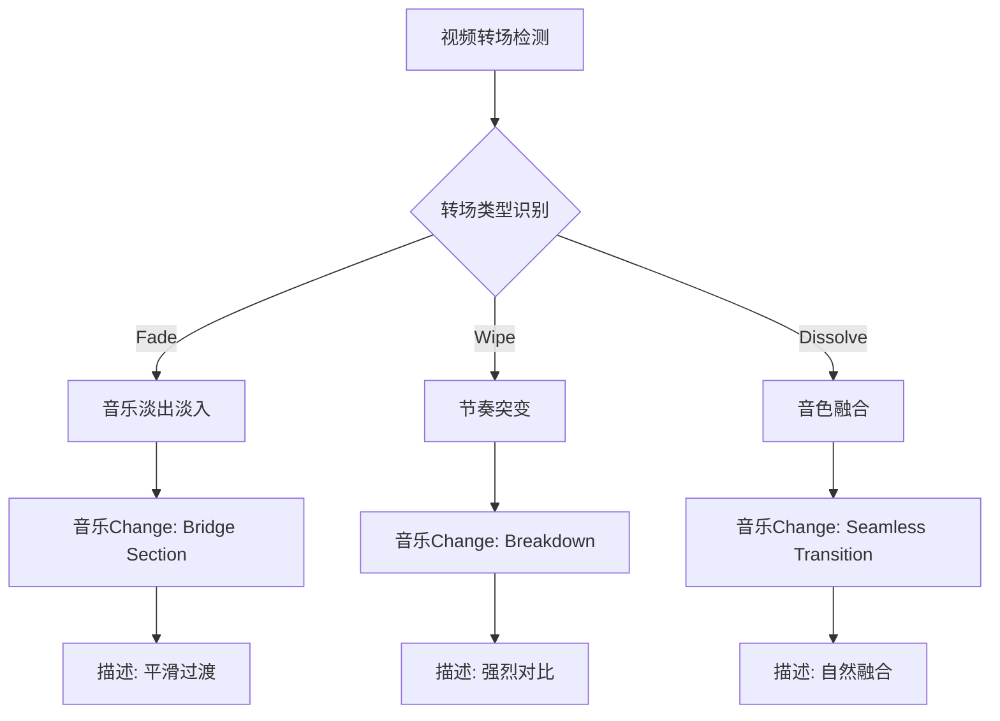

**图表来源**
- [analysisDataStructures.js](file://frontend/src/utils/analysisDataStructures.js#L290-L296)

#### technicalSpecs - 技术参数

技术参数确保音乐符合专业制作标准：

| 参数类别 | 具体参数 | 推荐值 | 生成规则 |
|----------|----------|--------|----------|
| 时长控制 | duration | 45秒 | 基于视频融合方案 |
| 调性选择 | key | C major | 根据情感基调 |
| 拍号 | timeSignature | 4/4 | 标准流行音乐拍号 |
| 速度范围 | tempo | 80-120 BPM | 结合视频节奏 |
| 动态范围 | dynamics | moderate | 平衡情感表达 |
| 结构设计 | structure | intro-verse-chorus-outro | 流行音乐结构 |

**章节来源**
- [analysisDataStructures.js](file://frontend/src/utils/analysisDataStructures.js#L221-L327)

## 架构设计

### 双模型协同架构

系统采用双模型协同架构，充分发挥各模型的优势：

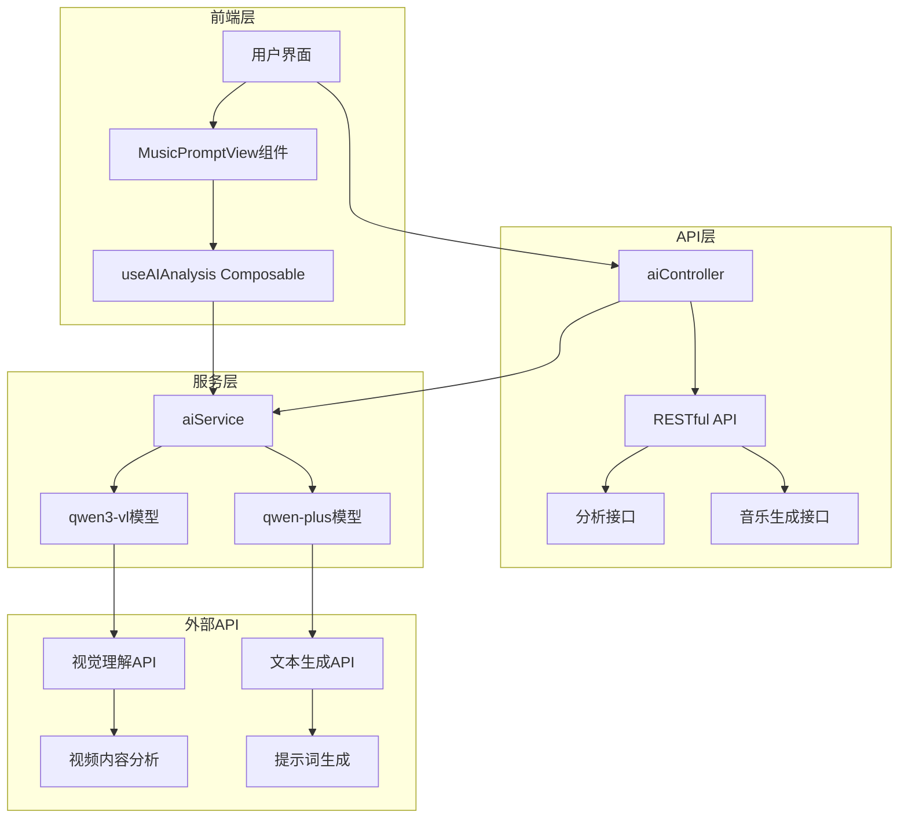

**图表来源**
- [aiController.js](file://backend/src/controllers/aiController.js#L1-L237)
- [aiService.js](file://backend/src/services/aiService.js#L1-L672)

### 数据流架构

系统的数据流遵循严格的处理流程：

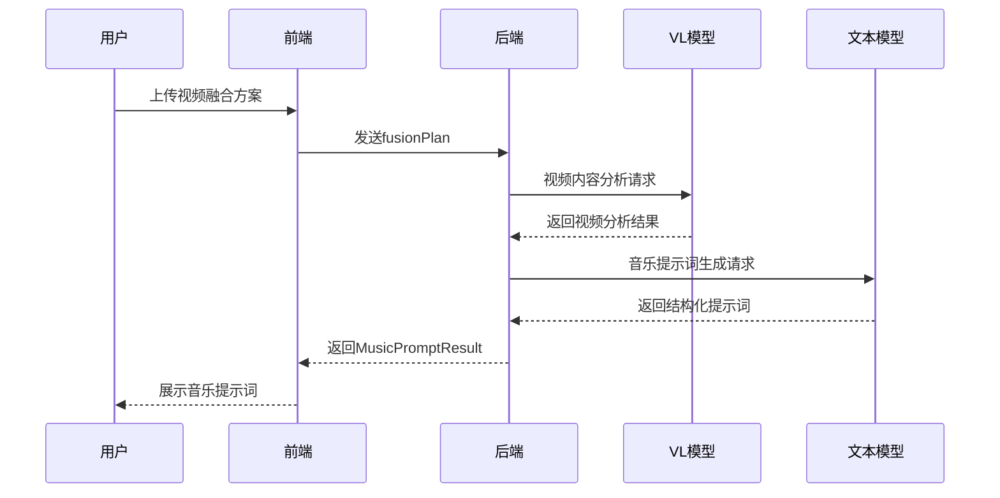

**图表来源**
- [aiController.js](file://backend/src/controllers/aiController.js#L105-L135)
- [aiService.js](file://backend/src/services/aiService.js#L130-L415)

**章节来源**
- [aiController.js](file://backend/src/controllers/aiController.js#L105-L135)
- [aiService.js](file://backend/src/services/aiService.js#L130-L415)

## 详细组件分析

### 前端组件分析

#### MusicPromptView组件

MusicPromptView是用户交互的核心组件，提供了直观的音乐提示词展示界面：

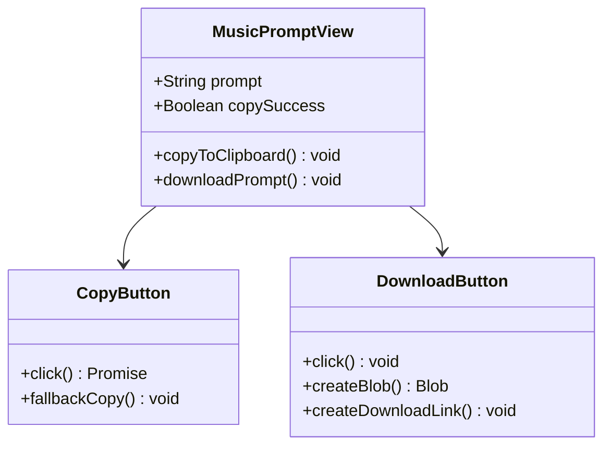

**图表来源**
- [MusicPromptView.vue](file://frontend/src/components/MusicPromptView.vue#L39-L102)

#### useAIAnalysis Composable

useAIAnalysis提供了完整的AI分析功能封装：

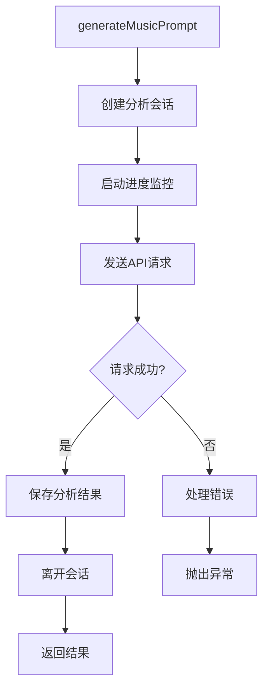

**图表来源**
- [useAIAnalysis.js](file://frontend/src/composables/useAIAnalysis.js#L178-L238)

### 后端服务分析

#### aiController - 控制器层

控制器层负责HTTP请求处理和响应格式化：

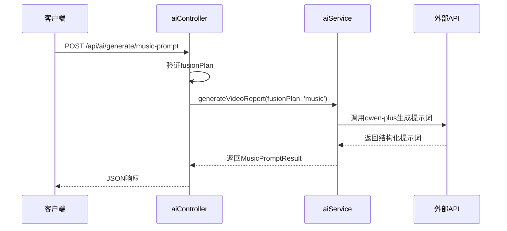

**图表来源**
- [aiController.js](file://backend/src/controllers/aiController.js#L105-L135)

#### aiService - 服务层

服务层实现了复杂的AI模型调用逻辑：

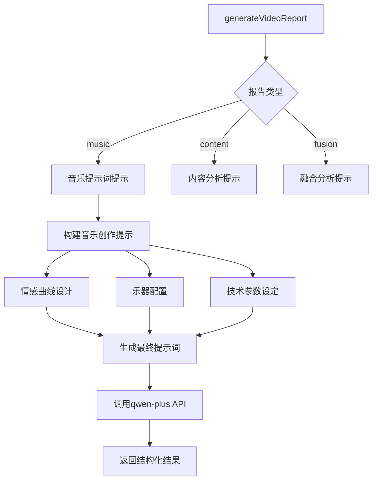

**图表来源**
- [aiService.js](file://backend/src/services/aiService.js#L130-L415)

**章节来源**
- [MusicPromptView.vue](file://frontend/src/components/MusicPromptView.vue#L1-L249)
- [useAIAnalysis.js](file://frontend/src/composables/useAIAnalysis.js#L178-L238)
- [aiController.js](file://backend/src/controllers/aiController.js#L105-L135)
- [aiService.js](file://backend/src/services/aiService.js#L130-L415)

## 数据流分析

### 输入处理流程

系统接收视频融合方案作为输入，通过以下流程生成音乐提示词：

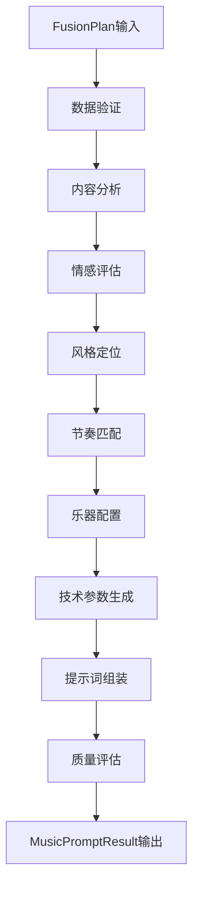

### 输出结构化流程

生成的音乐提示词遵循严格的结构化格式：

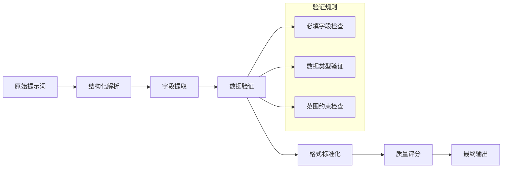

**章节来源**
- [aiService.js](file://backend/src/services/aiService.js#L273-L369)

## 性能考虑

### 并发处理优化

系统采用多种策略优化性能：

1. **进度监控机制**：实时反馈分析进度
2. **重试机制**：智能处理API调用失败
3. **缓存策略**：减少重复计算开销
4. **流式处理**：支持大数据量的高效处理

### 内存管理

前端组件实现了合理的内存管理策略：

- 组件卸载时自动清理定时器
- 使用ref和reactive确保响应式更新
- 实现防抖和节流机制防止过度渲染

### API调用优化

后端服务采用了多项优化措施：

- 指数退避重试策略
- 请求超时控制
- 并发限制管理
- 错误恢复机制

## 故障排除指南

### 常见问题及解决方案

#### 音乐提示词生成失败

**症状**：API返回错误或无响应

**可能原因**：
1. 网络连接问题
2. API密钥配置错误
3. 输入数据格式不正确
4. 外部模型服务不可用

**解决方案**：
1. 检查网络连接状态
2. 验证DASHSCOPE_API_KEY配置
3. 确认fusionPlan数据格式
4. 查看服务健康状态

#### 提示词质量不佳

**症状**：生成的音乐提示词不够具体或缺乏创意

**可能原因**：
1. 视频内容分析不足
2. 情感曲线设计不合理
3. 乐器选择不当
4. 技术参数设置错误

**解决方案**：
1. 优化视频分析参数
2. 调整情感曲线权重
3. 增加乐器多样性
4. 根据视频风格调整技术参数

### 调试技巧

1. **启用详细日志**：在开发环境中开启详细错误信息
2. **使用测试数据**：提供标准化的测试用例
3. **监控API响应**：跟踪外部服务的响应时间
4. **性能分析**：使用浏览器开发者工具分析性能瓶颈

**章节来源**
- [aiService.js](file://backend/src/services/aiService.js#L614-L672)

## 结论

背景音乐提示词模型代表了AI视频分析与音乐创作结合的前沿技术。通过精心设计的数据结构、严谨的处理流程和完善的错误处理机制，该系统能够为用户提供高质量的音乐创作提示词。

### 主要优势

1. **结构化输出**：严格的数据格式确保了提示词的可执行性
2. **智能分析**：基于视频内容的深度分析保证了音乐与视频的完美契合
3. **灵活扩展**：模块化设计支持未来功能的扩展和定制
4. **用户体验**：直观的界面和流畅的交互提升了使用体验

### 技术创新

- **双模型协同**：视觉理解和文本生成的有机结合
- **情感曲线设计**：创新性的将视频叙事逻辑转化为音乐结构
- **实时反馈**：进度监控和状态更新提供良好的用户体验
- **质量保证**：多层次的验证机制确保输出质量

该模型为视频制作、内容创作和多媒体应用提供了强大的技术支持，是人工智能在创意产业应用的优秀范例。