# 视频内容分析模型

<cite>
**本文档引用的文件**
- [analysisDataStructures.js](file://frontend/src/utils/analysisDataStructures.js)
- [aiService.js](file://backend/src/services/aiService.js)
- [useAIAnalysis.js](file://frontend/src/composables/useAIAnalysis.js)
- [analysisStorage.js](file://frontend/src/utils/analysisStorage.js)
- [data-model.md](file://specs/001-responsive-h5-upload/data-model.md)
- [qwen3-VL-视频理解API.md](file://qwen3-VL-视频理解API.md)
</cite>

## 目录
1. [简介](#简介)
2. [项目架构概览](#项目架构概览)
3. [核心数据结构](#核心数据结构)
4. [视频分析流程](#视频分析流程)
5. [数据模型详解](#数据模型详解)
6. [技术分析组件](#技术分析组件)
7. [存储与持久化](#存储与持久化)
8. [错误处理机制](#错误处理机制)
9. [性能优化策略](#性能优化策略)
10. [总结](#总结)

## 简介

视频内容分析模型是一个基于阿里云通义千问VL模型的先进视频分析系统，采用双模型协同架构：qwen3-vl负责视频理解分析，qwen-plus负责文本生成和报告创作。该系统能够深入分析视频内容，提取关键信息，并生成专业的分析报告。

### 核心特性

- **多维度分析**：涵盖关键帧、场景、物体、动作等多个分析维度
- **结构化输出**：提供标准化的数据结构和清晰的分析结果
- **实时处理**：支持流式响应和实时进度更新
- **持久化存储**：完整的分析结果存储和历史记录管理
- **错误恢复**：完善的重试机制和错误处理策略

## 项目架构概览

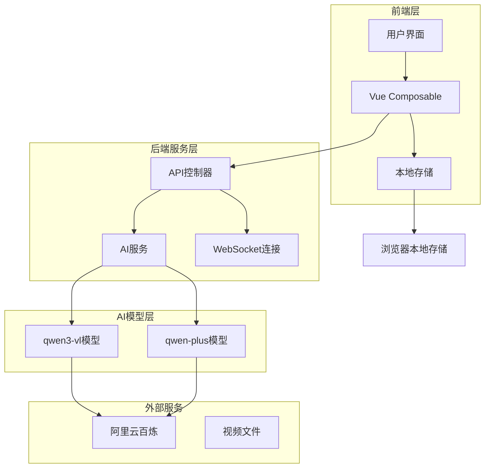

**架构图源文件**
- [useAIAnalysis.js](file://frontend/src/composables/useAIAnalysis.js#L1-L50)
- [aiService.js](file://backend/src/services/aiService.js#L1-L30)

## 核心数据结构

### 基础分析结果结构

所有类型的分析结果都继承自基础结构，提供统一的元数据管理：

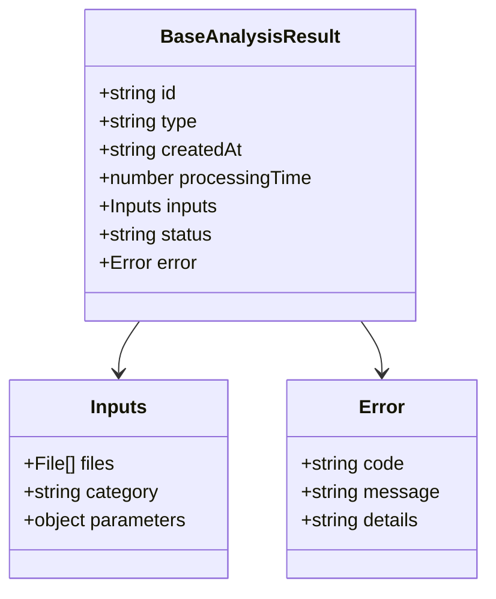

**类图源文件**
- [analysisDataStructures.js](file://frontend/src/utils/analysisDataStructures.js#L6-L30)

### 视频内容分析结果

ContentAnalysisResult是系统的核心数据结构，包含完整的视频分析信息：

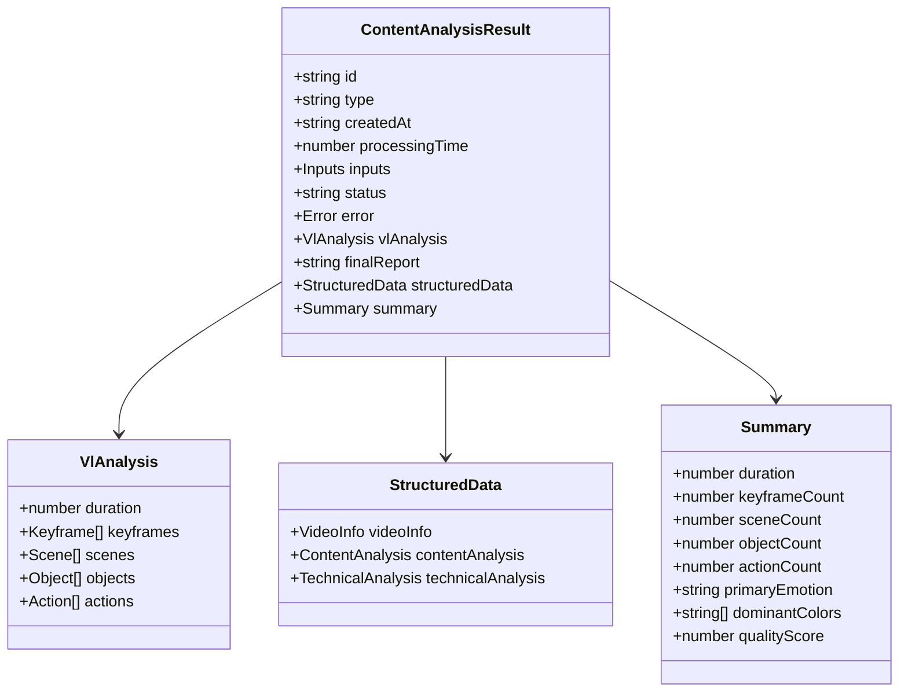

**类图源文件**
- [analysisDataStructures.js](file://frontend/src/utils/analysisDataStructures.js#L35-L98)

**节源文件**
- [analysisDataStructures.js](file://frontend/src/utils/analysisDataStructures.js#L35-L98)

## 视频分析流程

### 三阶段处理流程

系统采用三阶段处理架构，确保分析质量和效率：

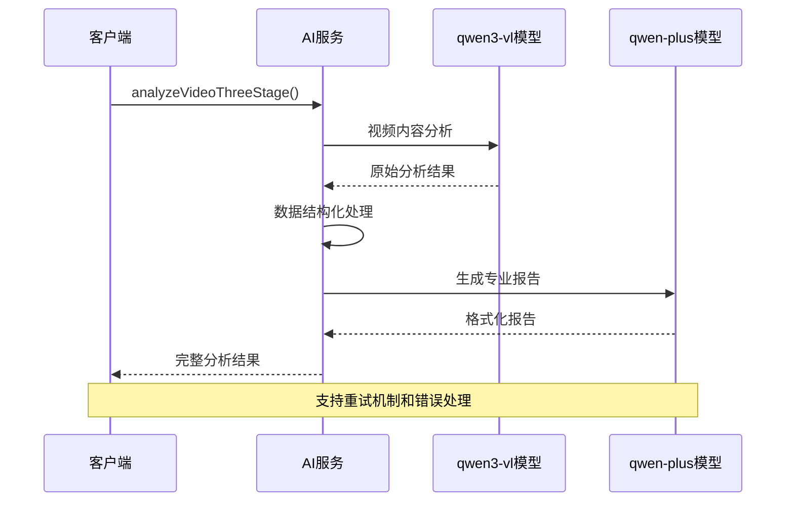

**序列图源文件**
- [aiService.js](file://backend/src/services/aiService.js#L420-L444)

### VL模型分析阶段

VL模型负责视频的底层理解和特征提取：

| 分析维度 | 字段名称 | 数据类型 | 描述 |
|---------|---------|---------|------|
| 视频基本信息 | duration | number | 视频时长（秒） |
| 视频基本信息 | resolution | string | 分辨率信息 |
| 视频基本信息 | frameRate | number | 帧率 |
| 关键帧分析 | keyframes | Array | 关键帧数组 |
| 场景分析 | scenes | Array | 场景信息数组 |
| 物体检测 | objects | Array | 物体检测结果 |
| 动作识别 | actions | Array | 动作序列信息 |

**节源文件**
- [aiService.js](file://backend/src/services/aiService.js#L24-L120)

## 数据模型详解

### vlAnalysis原始输出结构

vlAnalysis是VL模型的直接输出，包含视频的原始分析结果：

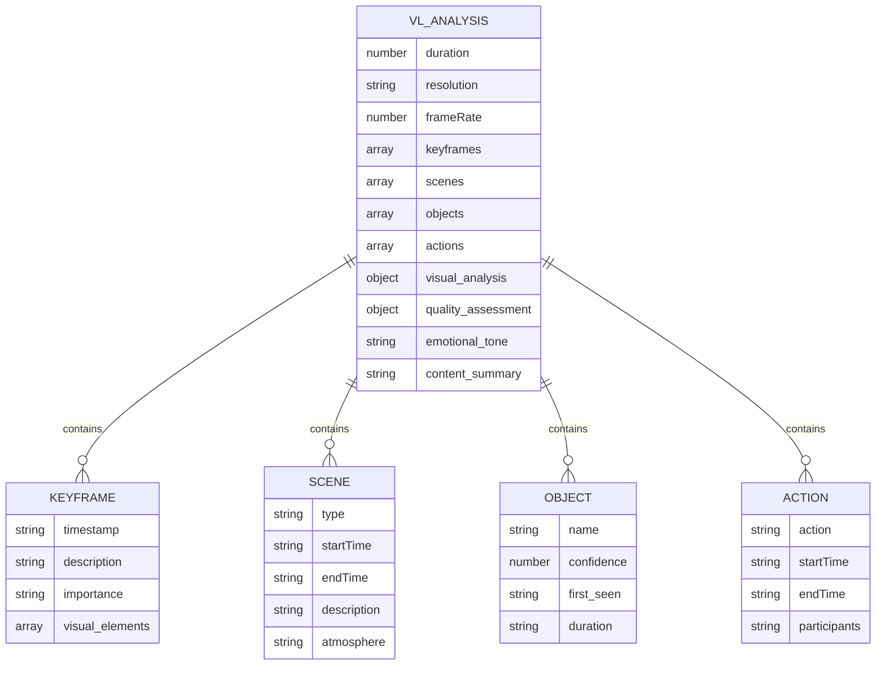

**实体关系图源文件**
- [aiService.js](file://backend/src/services/aiService.js#L24-L90)

### structuredData结构化数据

structuredData是对vlAnalysis的进一步处理和结构化：

| 数据类别 | 字段结构 | 用途 |
|---------|---------|------|
| videoInfo | duration, format, size, resolution, frameRate | 视频基本信息展示 |
| contentAnalysis | keyframes, scenes, objects, actions | 内容分析结果 |
| technicalAnalysis | emotionalTone, colorPalette, qualityAssessment, overallScore | 技术质量评估 |

**节源文件**
- [analysisDataStructures.js](file://frontend/src/utils/analysisDataStructures.js#L55-L86)

### 视频基本信息表达

videoInfo字段提供了视频的技术参数和基本信息：

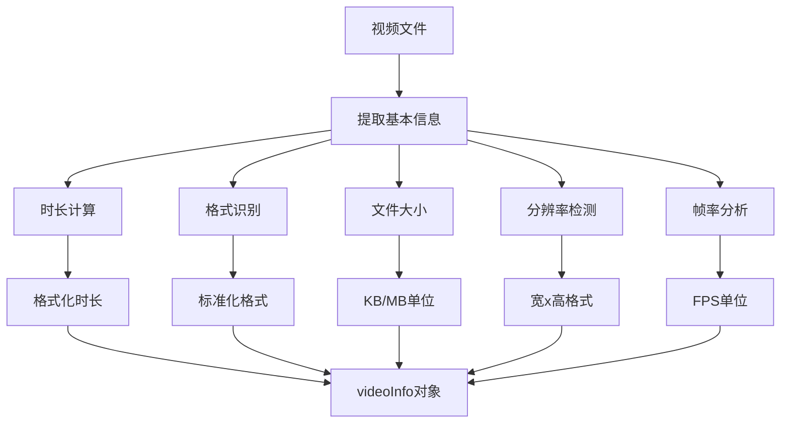

**流程图源文件**
- [aiService.js](file://backend/src/services/aiService.js#L480-L531)

**节源文件**
- [analysisDataStructures.js](file://frontend/src/utils/analysisDataStructures.js#L57-L63)

## 技术分析组件

### 情感基调分析

emotionalTone字段捕捉视频的整体情感氛围：

| 情感类型 | 描述 | 示例场景 |
|---------|------|---------|
| 平静 | 宁静、放松的氛围 | 自然风景、冥想场景 |
| 愉悦 | 积极、快乐的情绪 | 欢乐聚会、户外活动 |
| 激昂 | 紧张、激动的情绪 | 运动比赛、战斗场面 |
| 悲伤 | 低落、哀伤的情绪 | 离别场景、悲剧情节 |

### 色彩分布分析

colorPalette提供视频的色彩构成统计：

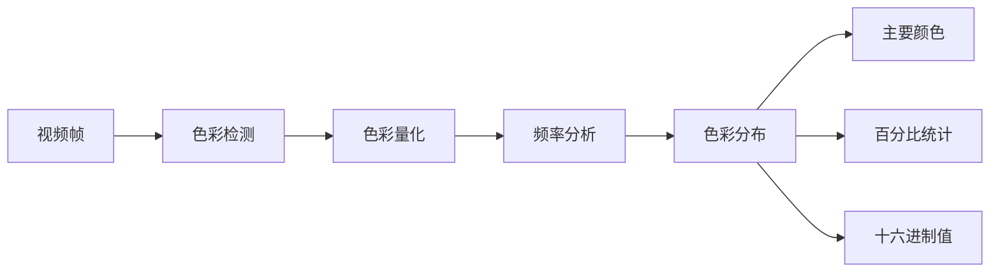

**流程图源文件**
- [aiService.js](file://backend/src/services/aiService.js#L480-L531)

### 质量评估体系

qualityAssessment包含三个维度的质量评分：

| 评估维度 | 权重 | 评分范围 | 计算依据 |
|---------|------|---------|---------|
| 清晰度 | 35% | 0-100 | 图像锐利度、细节表现 |
| 稳定性 | 30% | 0-100 | 画面抖动、镜头稳定性 |
| 构图 | 25% | 0-100 | 画面布局、视觉平衡 |
| 整体评分 | 10% | 0-100 | 综合质量评估 |

**节源文件**
- [analysisDataStructures.js](file://frontend/src/utils/analysisDataStructures.js#L74-L83)

## 存储与持久化

### 本地存储架构

系统采用分层存储策略，确保数据的可靠性和性能：

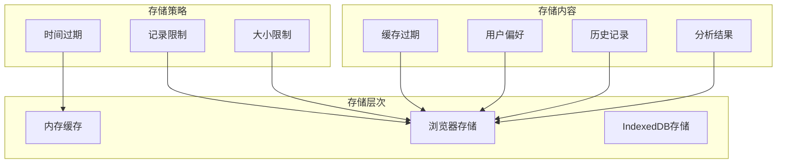

**架构图源文件**
- [analysisStorage.js](file://frontend/src/utils/analysisStorage.js#L25-L31)

### 数据验证机制

系统实现了严格的数据验证机制：

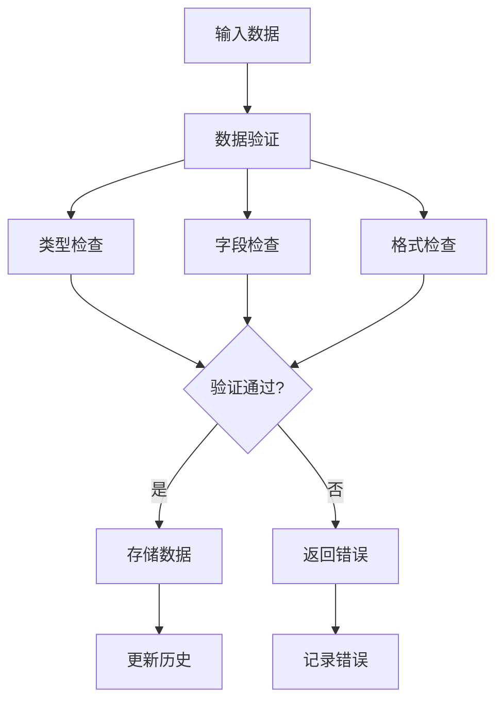

**流程图源文件**
- [analysisStorage.js](file://frontend/src/utils/analysisStorage.js#L78-L95)

**节源文件**
- [analysisStorage.js](file://frontend/src/utils/analysisStorage.js#L78-L118)

## 错误处理机制

### 重试策略

系统实现了基于指数退避的重试机制：

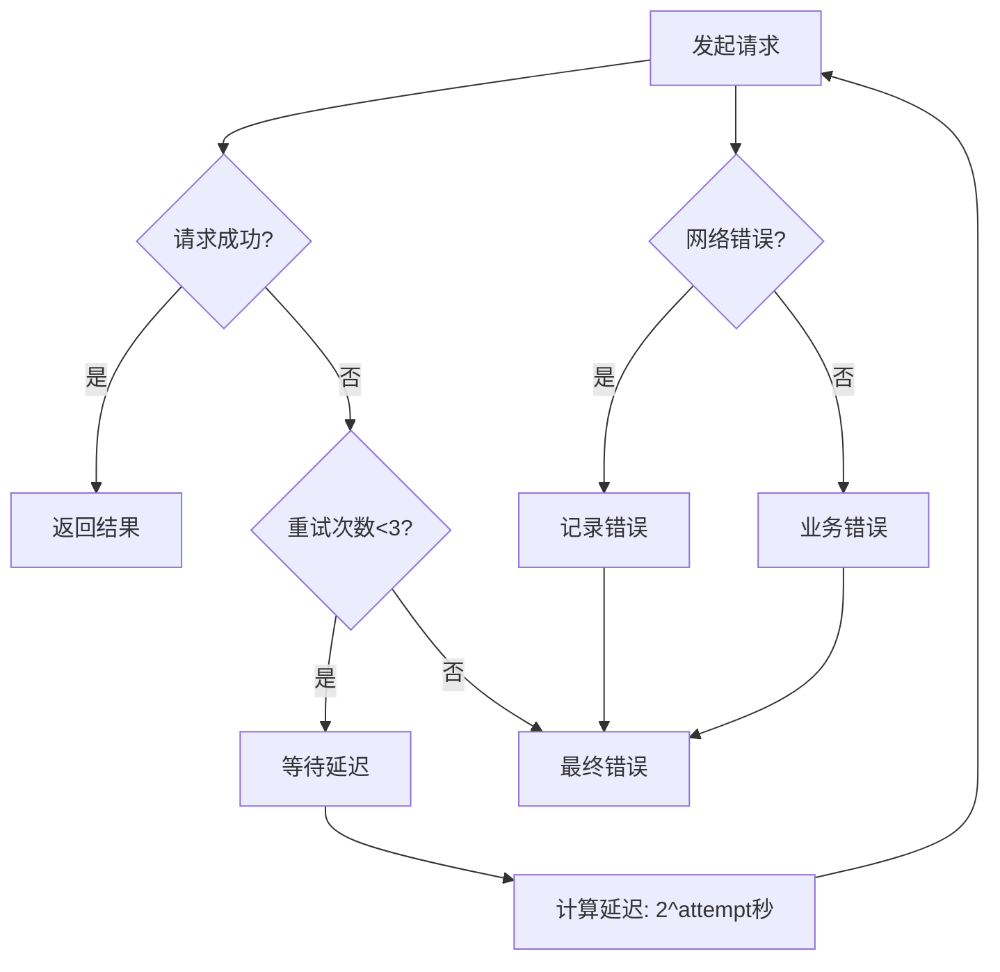

**流程图源文件**
- [aiService.js](file://backend/src/services/aiService.js#L614-L671)

### 错误类型分类

| 错误类型 | 错误代码 | 处理策略 |
|---------|---------|---------|
| 网络超时 | NETWORK_TIMEOUT | 自动重试3次 |
| API限制 | RATE_LIMIT_EXCEEDED | 指数退避重试 |
| 数据验证 | VALIDATION_ERROR | 返回具体错误信息 |
| 服务器错误 | SERVER_ERROR | 降级处理 |

**节源文件**
- [aiService.js](file://backend/src/services/aiService.js#L614-L671)

## 性能优化策略

### 缓存策略

系统采用多层缓存机制提升性能：

| 缓存层级 | 过期时间 | 存储容量 | 适用场景 |
|---------|---------|---------|---------|
| 内存缓存 | 1小时 | 1000个会话 | 实时数据访问 |
| 本地存储 | 7天 | 50MB | 持久化数据 |
| 记录限制 | 100条 | - | 防止无限增长 |

### 流式处理

支持流式响应处理大量数据：

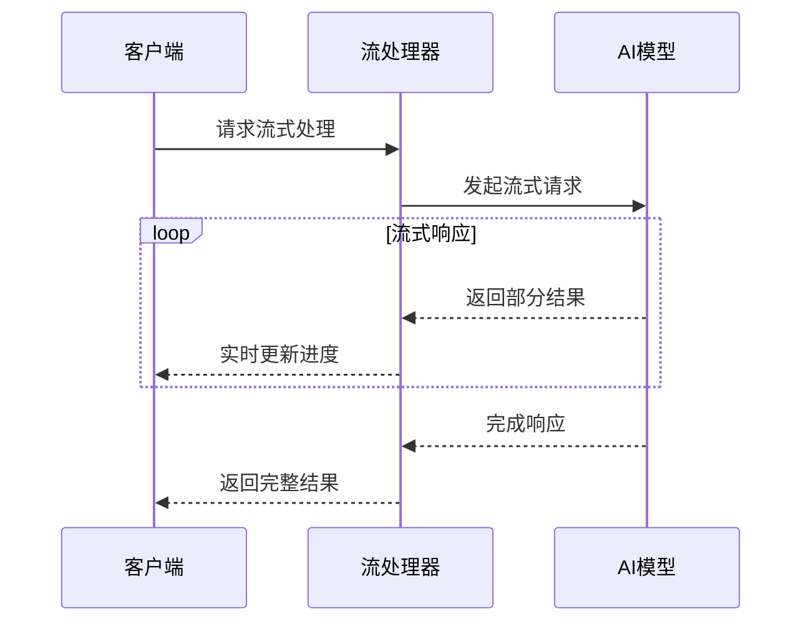

**序列图源文件**
- [aiService.js](file://backend/src/services/aiService.js#L393-L405)

**节源文件**
- [aiService.js](file://backend/src/services/aiService.js#L393-L410)

## 总结

视频内容分析模型通过先进的AI技术和严谨的数据结构设计，实现了全面而深入的视频内容分析能力。系统的核心优势包括：

1. **完整的分析体系**：涵盖视频的各个维度，提供全面的分析视角
2. **标准化的数据结构**：确保数据的一致性和可操作性
3. **可靠的错误处理**：完善的重试机制和错误恢复策略
4. **高效的存储管理**：多层缓存和智能清理机制
5. **优秀的用户体验**：实时进度反馈和流畅的交互体验

该模型为视频内容分析、视频制作优化、内容推荐等应用场景提供了强有力的技术支撑，是现代多媒体内容处理领域的重要创新。