# 视频融合方案数据模型

<cite>
**本文档中引用的文件**
- [analysisDataStructures.js](file://frontend/src/utils/analysisDataStructures.js)
- [FusionAnalysisView.vue](file://frontend/src/components/FusionAnalysisView.vue)
- [useAIAnalysis.js](file://frontend/src/composables/useAIAnalysis.js)
- [analysisStorage.js](file://frontend/src/utils/analysisStorage.js)
- [testDataGenerator.js](file://frontend/src/tests/utils/testDataGenerator.js)
- [analysisDataStructures.test.js](file://frontend/src/tests/unit/analysisDataStructures.test.js)
- [resultDisplay.test.js](file://frontend/src/tests/integration/resultDisplay.test.js)
</cite>

## 目录
1. [简介](#简介)
2. [核心数据结构](#核心数据结构)
3. [视频分析输入结构](#视频分析输入结构)
4. [融合计划详细分析](#融合计划详细分析)
5. [时间轴可视化结构](#时间轴可视化结构)
6. [音频处理机制](#音频处理机制)
7. [兼容性分析体系](#兼容性分析体系)
8. [前端展示架构](#前端展示架构)
9. [数据验证与质量控制](#数据验证与质量控制)
10. [最佳实践指南](#最佳实践指南)

## 简介

视频融合方案数据模型是基于AI分析结果的综合数据结构，专门设计用于处理两个视频文件的智能融合分析。该模型不仅包含视频内容分析的基础信息，还提供了完整的融合策略规划、技术参数配置和可视化展示功能。

### 设计理念

- **模块化设计**: 将融合分析分解为独立的功能模块
- **可扩展性**: 支持多种转场效果、音频处理和视觉效果
- **标准化**: 统一的数据格式便于后续处理和集成
- **可视化**: 提供直观的时间轴和进度展示

## 核心数据结构

### FusionAnalysisResult 主结构

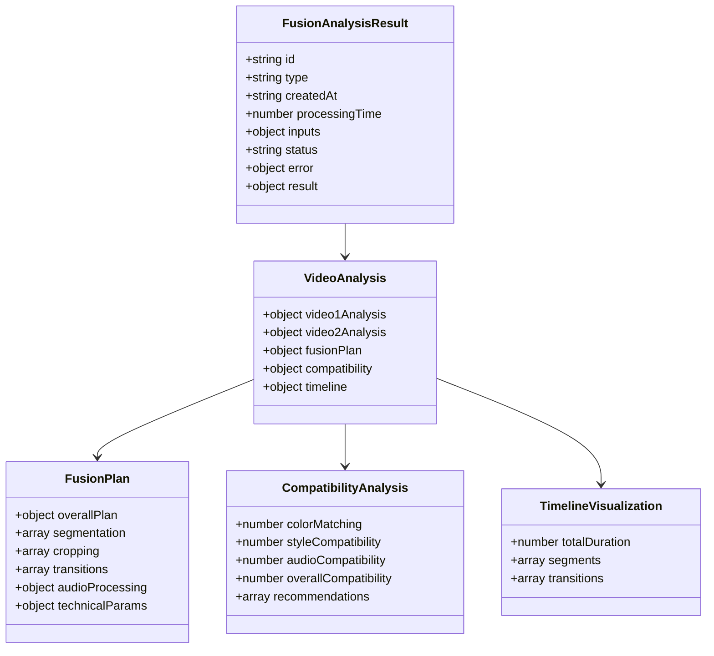

**图表来源**
- [analysisDataStructures.js](file://frontend/src/utils/analysisDataStructures.js#L103-L219)

**章节来源**
- [analysisDataStructures.js](file://frontend/src/utils/analysisDataStructures.js#L103-L219)

## 视频分析输入结构

### video1Analysis 和 video2Analysis 的引用机制

视频融合分析的核心在于对两个输入视频的深度分析。每个视频分析都基于ContentAnalysisResult结构，提供全面的内容理解。

#### 视频分析输入特点

| 特性 | 描述 | 数据来源 |
|------|------|----------|
| **时长分析** | 精确测量视频时长和关键帧分布 | VL模型原始输出 |
| **场景识别** | 自动识别视频中的主要场景类型 | 场景分割算法 |
| **物体检测** | 检测视频中的主要物体和人物 | 目标检测模型 |
| **动作识别** | 识别视频中的关键动作序列 | 行为识别算法 |
| **情感分析** | 分析视频的整体情感基调 | 情感识别模型 |
| **技术评估** | 清晰度、稳定性、构图评分 | 技术质量评估 |

#### 内容分析结果结构

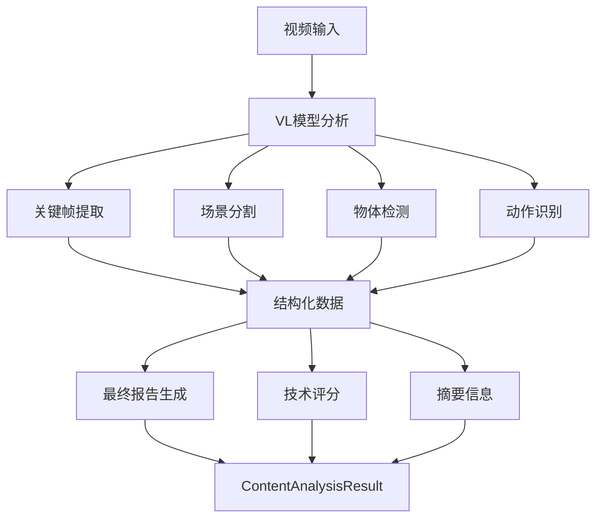

**图表来源**
- [analysisDataStructures.js](file://frontend/src/utils/analysisDataStructures.js#L35-L98)

**章节来源**
- [analysisDataStructures.js](file://frontend/src/utils/analysisDataStructures.js#L110-L112)

## 融合计划详细分析

### 分段策略（Segmentation）设计逻辑

分段策略是视频融合的核心，它决定了如何将两个视频有机地结合在一起。

#### 时间映射关系

分段策略中的时间映射采用双层时间轴设计：

| 参数 | 类型 | 描述 | 示例值 |
|------|------|------|--------|
| **source** | string | 来源视频标识 | 'video1' \| 'video2' |
| **startTime** | string | 原视频开始时间 | '00:00' |
| **endTime** | string | 原视频结束时间 | '00:20' |
| **targetStart** | string | 目标视频开始时间 | '00:00' |
| **targetEnd** | string | 目标视频结束时间 | '00:20' |

#### 分段决策因素

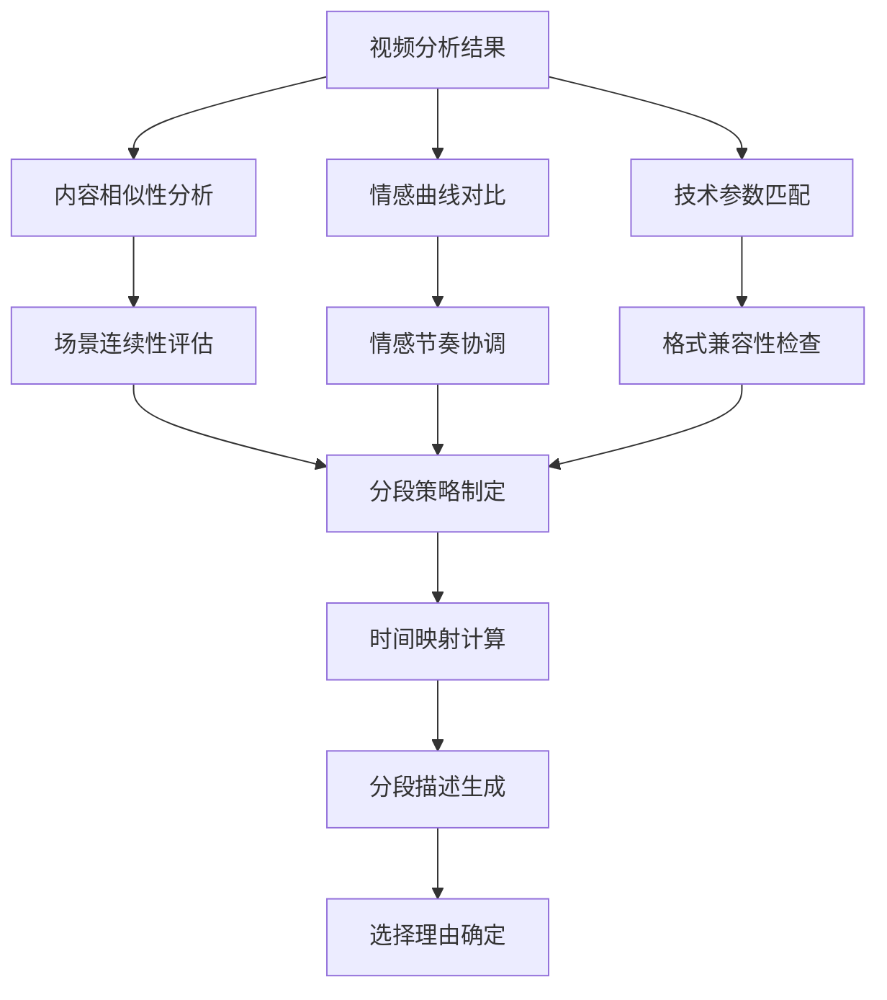

**图表来源**
- [analysisDataStructures.js](file://frontend/src/utils/analysisDataStructures.js#L124-L136)

### 裁剪建议（Cropping）系统

#### 相对坐标系统

裁剪建议采用标准化的相对坐标系统，确保跨平台的一致性：

| 坐标属性 | 范围 | 单位 | 描述 |
|----------|------|------|------|
| **x** | 0.0 - 1.0 | 相对值 | 左上角X坐标 |
| **y** | 0.0 - 1.0 | 相对值 | 左上角Y坐标 |
| **width** | 0.0 - 1.0 | 相对值 | 裁剪区域宽度 |
| **height** | 0.0 - 1.0 | 相对值 | 裁剪区域高度 |

#### 构图类型应用

支持多种经典构图规则：

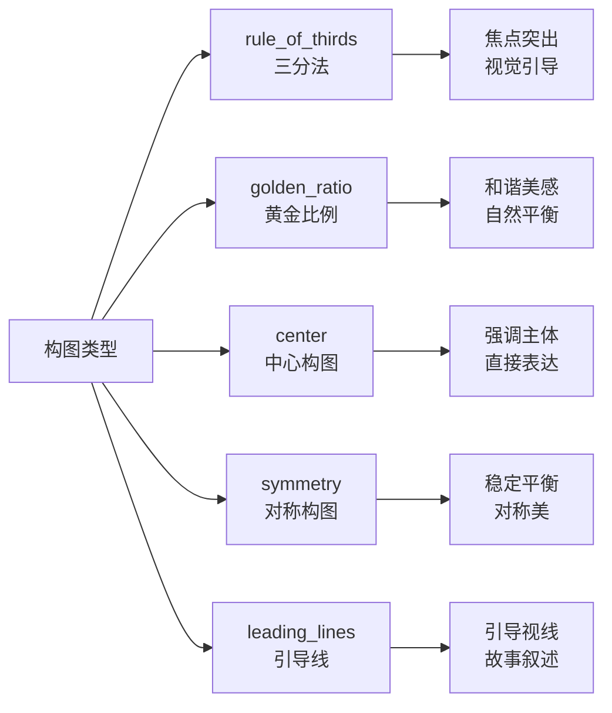

**图表来源**
- [analysisDataStructures.js](file://frontend/src/utils/analysisDataStructures.js#L140-L146)

**章节来源**
- [analysisDataStructures.js](file://frontend/src/utils/analysisDataStructures.js#L138-L148)

### 转场效果（Transitions）配置

#### 转场类型选择

| 转场类型 | 适用场景 | 持续时间 | 参数配置 |
|----------|----------|----------|----------|
| **fade** | 平稳过渡，情感转换 | 1.0-3.0秒 | opacity: [1, 0, 1] |
| **wipe** | 动感切换，视觉冲击 | 0.5-1.5秒 | direction: 'left'\|'right'\|'up'\|'down' |
| **dissolve** | 自然融合，柔和过渡 | 1.5-2.5秒 | blendMode: 'normal' |
| **slide** | 流畅移动，方向感强 | 1.0-2.0秒 | direction: 'horizontal'\|'vertical' |

#### 转场参数优化

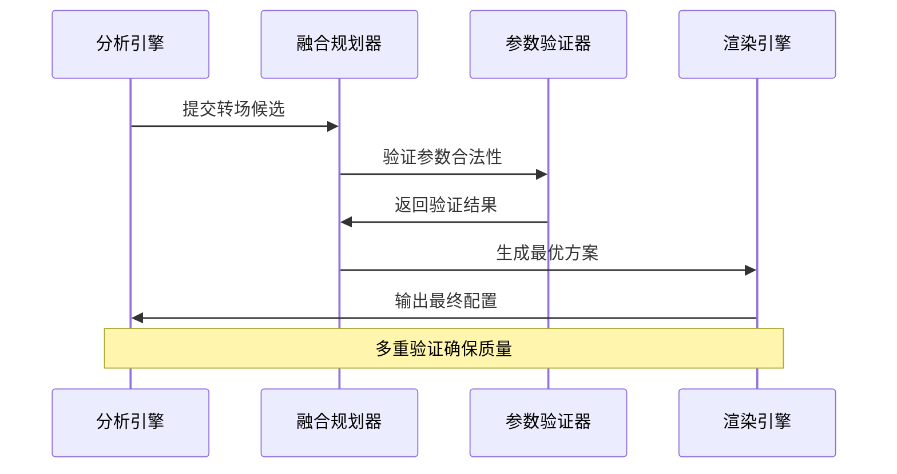

**图表来源**
- [analysisDataStructures.js](file://frontend/src/utils/analysisDataStructures.js#L150-L159)

**章节来源**
- [analysisDataStructures.js](file://frontend/src/utils/analysisDataStructures.js#L149-L161)

## 时间轴可视化结构

### timeline 时间轴设计

时间轴可视化是融合方案的重要展示组件，提供直观的进度和结构展示。

#### 时间轴组件架构

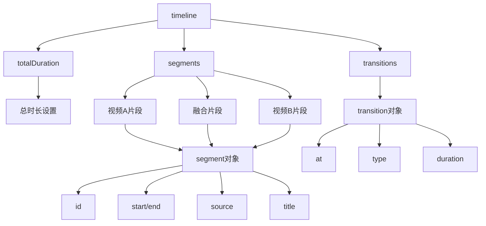

**图表来源**
- [analysisDataStructures.js](file://frontend/src/utils/analysisDataStructures.js#L198-L217)

#### 前端进度展示应用

前端时间轴组件通过Vue响应式系统实现实时更新：

| 属性 | 类型 | 用途 | 示例值 |
|------|------|------|--------|
| **percentage** | number | 相对位置百分比 | 25.0 |
| **width** | number | 片段宽度百分比 | 30.0 |
| **backgroundColor** | string | 片段颜色标识 | '#3b82f6' |
| **title** | string | 片段标题显示 | '开场场景' |

**章节来源**
- [analysisDataStructures.js](file://frontend/src/utils/analysisDataStructures.js#L198-L217)
- [FusionAnalysisView.vue](file://frontend/src/components/FusionAnalysisView.vue#L70-L141)

## 音频处理机制

### 背景音乐音量控制

音频处理模块提供精细化的音量管理和动态控制功能。

#### 音量控制参数

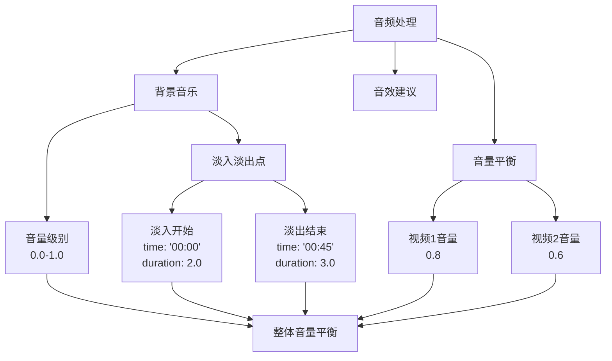

**图表来源**
- [analysisDataStructures.js](file://frontend/src/utils/analysisDataStructures.js#L163-L176)

#### 音效建议系统

音效建议基于视频内容和情感曲线自动生成：

| 音效类型 | 应用时机 | 生成依据 | 示例效果 |
|----------|----------|----------|----------|
| **环境音** | 场景转换 | 场景描述 | 风声、水声、鸟鸣 |
| **动作音** | 关键动作 | 动作识别 | 步伐声、开门声 |
| **情绪音** | 情感高潮 | 情感分析 | 心跳声、呼吸声 |
| **过渡音** | 转场时刻 | 转场类型 | 滤镜声、震动声 |

**章节来源**
- [analysisDataStructures.js](file://frontend/src/utils/analysisDataStructures.js#L163-L176)

## 兼容性分析体系

### 评分体系设计

兼容性分析采用多维度评分体系，提供客观的质量评估。

#### 兼容性指标

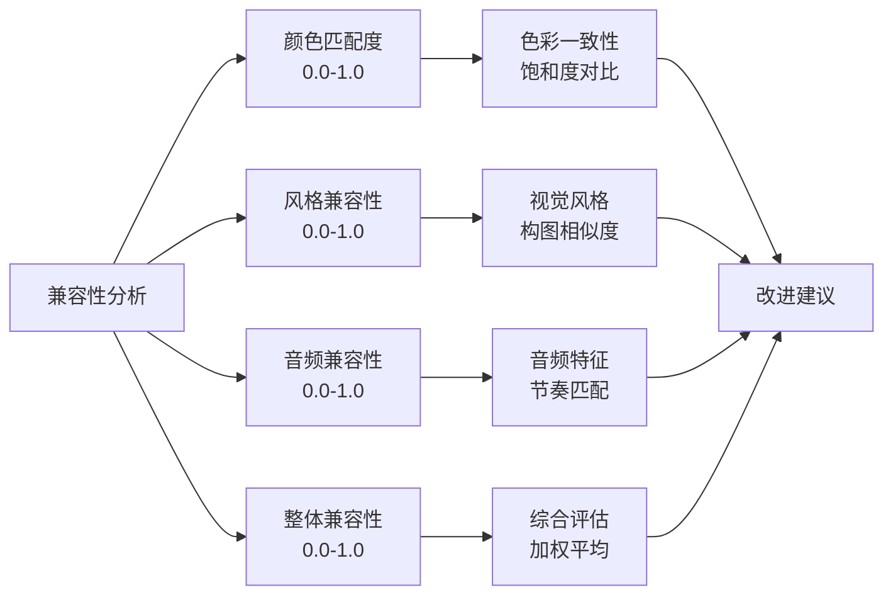

**图表来源**
- [analysisDataStructures.js](file://frontend/src/utils/analysisDataStructures.js#L189-L195)

#### 改进建议生成逻辑

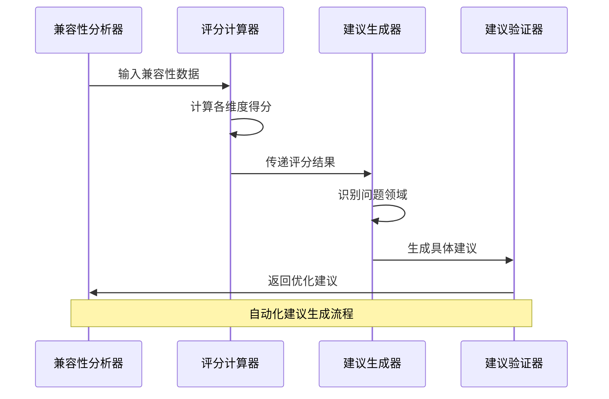

**图表来源**
- [analysisDataStructures.js](file://frontend/src/utils/analysisDataStructures.js#L194)

**章节来源**
- [analysisDataStructures.js](file://frontend/src/utils/analysisDataStructures.js#L189-L195)

## 前端展示架构

### Vue组件化设计

前端采用Vue 3 Composition API实现组件化展示架构。

#### 组件层次结构

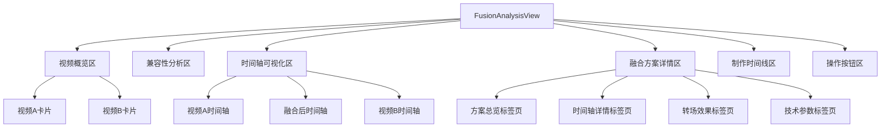

**图表来源**
- [FusionAnalysisView.vue](file://frontend/src/components/FusionAnalysisView.vue#L1-L800)

#### 数据绑定与响应式

前端通过computed属性实现数据的响应式绑定：

| 计算属性 | 类型 | 用途 | 数据来源 |
|----------|------|------|----------|
| **video1Summary** | computed | 视频A摘要信息 | props.fusion.video1Summary |
| **video2Summary** | computed | 视频B摘要信息 | props.fusion.video2Summary |
| **compatibility** | computed | 兼容性分析结果 | props.fusion.compatibility |
| **fusion** | computed | 完整融合数据 | props.fusion |

**章节来源**
- [FusionAnalysisView.vue](file://frontend/src/components/FusionAnalysisView.vue#L278-L285)

## 数据验证与质量控制

### 验证机制设计

系统内置多层次的数据验证机制，确保数据质量和完整性。

#### 验证流程

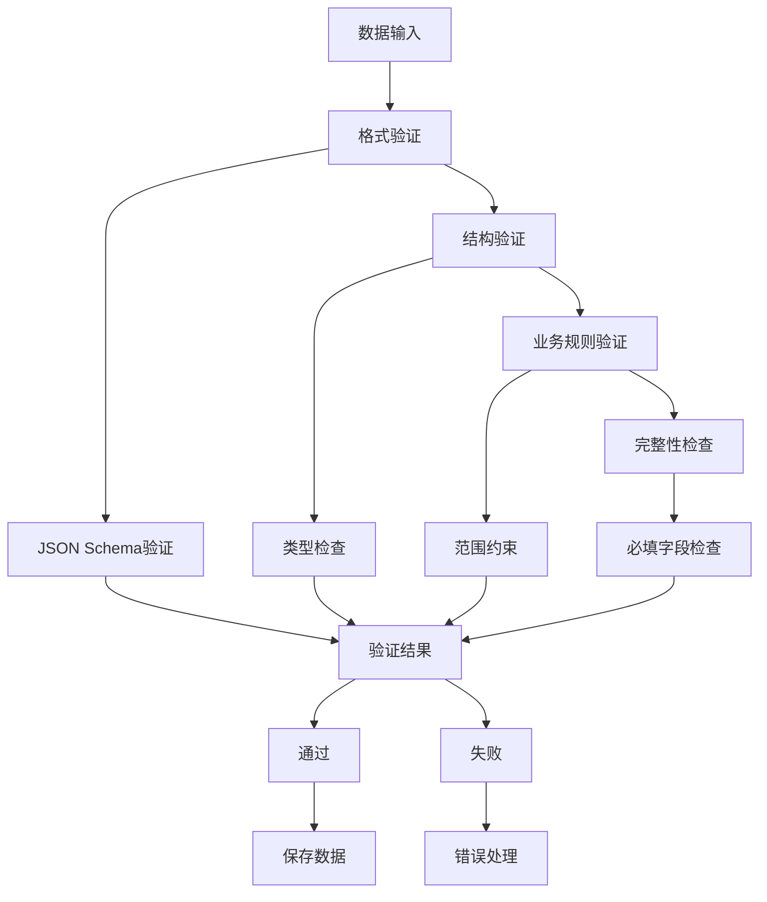

**图表来源**
- [analysisDataStructures.js](file://frontend/src/utils/analysisDataStructures.js#L352-L401)

#### 质量控制标准

| 验证项目 | 检查内容 | 验证方法 | 错误处理 |
|----------|----------|----------|----------|
| **视频分析完整性** | video1Analysis和video2Analysis存在性 | 存在性检查 | 返回错误信息 |
| **融合计划有效性** | fusionPlan结构正确性 | 结构验证 | 降级处理 |
| **时间轴一致性** | 时间戳顺序和连续性 | 逻辑验证 | 自动修复 |
| **技术参数合理性** | 分辨率、帧率等参数范围 | 范围检查 | 参数修正 |

**章节来源**
- [analysisDataStructures.js](file://frontend/src/utils/analysisDataStructures.js#L378-L389)

## 最佳实践指南

### 融合策略建议

基于数据分析结果，提供以下最佳实践指导：

#### 分段策略最佳实践

1. **情感曲线匹配**: 确保两个视频的情感曲线相互补充
2. **视觉风格协调**: 选择视觉风格相近的片段进行融合
3. **技术参数统一**: 保证分辨率、帧率等技术参数一致
4. **时长平衡**: 控制总时长在合理范围内（建议30-60秒）

#### 裁剪优化建议

1. **构图原则应用**: 优先使用三分法、黄金比例等经典构图
2. **焦点突出**: 确保重要主体位于裁剪区域的黄金分割点
3. **视觉引导**: 利用引导线增强画面的视觉流动感
4. **内容完整性**: 保留关键信息和视觉元素

#### 转场效果选择

1. **场景转换**: 使用淡入淡出或溶解效果
2. **节奏变化**: 使用快速切换或滑动效果
3. **情感高潮**: 使用渐进式转场增强戏剧效果
4. **风格统一**: 保持转场风格与整体视频一致

### 性能优化建议

#### 数据处理优化

1. **缓存策略**: 对重复分析结果进行缓存
2. **异步处理**: 使用Web Workers处理大量数据
3. **增量更新**: 只更新变化的部分
4. **内存管理**: 及时释放不需要的资源

#### 前端渲染优化

1. **虚拟滚动**: 对长列表使用虚拟滚动技术
2. **懒加载**: 按需加载非关键内容
3. **组件复用**: 合理设计可复用的组件
4. **状态管理**: 使用Pinia进行全局状态管理

### 扩展性设计

#### 模块化扩展

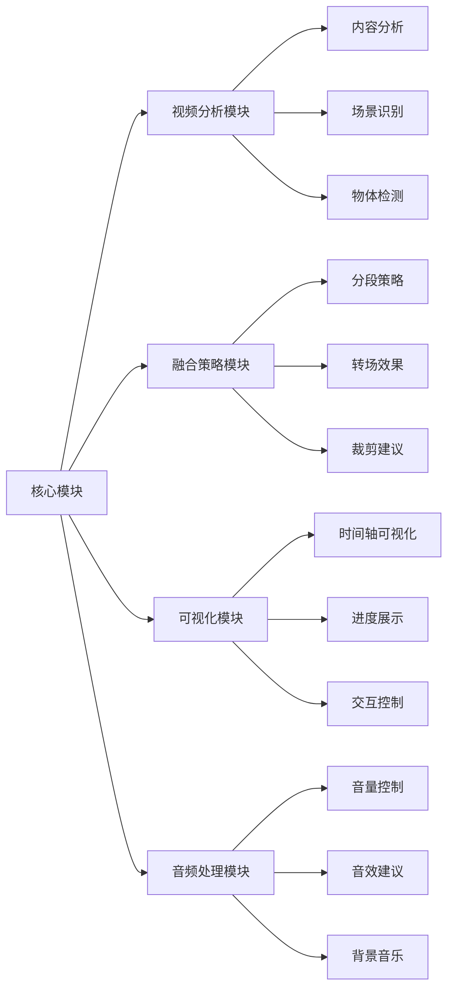

#### 插件化架构

1. **插件接口**: 定义标准化的插件接口
2. **动态加载**: 支持运行时加载新插件
3. **版本管理**: 实现插件版本兼容性检查
4. **权限控制**: 管理插件的访问权限

通过这套完整的视频融合方案数据模型，开发者可以构建出功能强大、用户体验优秀的视频融合分析工具，为用户提供智能化的视频编辑解决方案。