# 数据模型

<cite>
**本文档引用的文件**
- [fileValidator.js](file://backend/src/utils/fileValidator.js)
- [analysisDataStructures.js](file://frontend/src/utils/analysisDataStructures.js)
- [uploadController.js](file://backend/src/controllers/uploadController.js)
- [uploadService.js](file://backend/src/services/uploadService.js)
- [aiController.js](file://backend/src/controllers/aiController.js)
- [aiService.js](file://backend/src/services/aiService.js)
- [upload.js](file://backend/src/config/upload.js)
- [FileUploader.vue](file://frontend/src/components/FileUploader.vue)
- [useAIAnalysis.js](file://frontend/src/composables/useAIAnalysis.js)
</cite>

## 目录
1. [简介](#简介)
2. [核心实体概述](#核心实体概述)
3. [FileUpload实体详细分析](#fileupload实体详细分析)
4. [BatchUploadSession实体](#batchuploadsession实体)
5. [AnalysisReport实体结构](#analysisreport实体结构)
6. [数据验证规则](#数据验证规则)
7. [状态机设计](#状态机设计)
8. [前后端数据结构一致性](#前后端数据结构一致性)
9. [数据流分析](#数据流分析)
10. [总结](#总结)

## 简介

本文档详细描述了NewVedio项目中的核心数据模型，包括文件上传、批量处理、AI分析等关键业务实体及其相互关系。系统采用前后端分离架构，通过RESTful API进行数据交互，确保数据的一致性和完整性。

## 核心实体概述

系统中的核心实体主要包括：

- **FileUpload**: 单个文件上传的完整生命周期管理
- **BatchUploadSession**: 批量上传会话的元数据管理
- **AnalysisReport**: AI分析结果的结构化存储
- **FileValidator**: 文件验证规则和约束

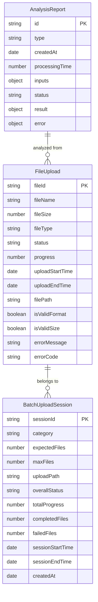

**图表来源**
- [uploadService.js](file://backend/src/services/uploadService.js#L89-L115)
- [analysisDataStructures.js](file://frontend/src/utils/analysisDataStructures.js#L6-L401)

## FileUpload实体详细分析

### 字段定义

FileUpload实体代表单个文件在上传过程中的完整状态信息：

| 字段名 | 类型 | 描述 | 约束条件 |
|--------|------|------|----------|
| fileId | String | 文件唯一标识符 | UUID格式，全局唯一 |
| fileName | String | 原始文件名 | 包含扩展名，最大长度限制 |
| fileSize | Number | 文件大小（字节） | 1-300MB，验证通过 |
| fileType | String | 文件类型 | 'mp4' 或 'avi' |
| status | String | 上传状态 | 'pending' \| 'uploading' \| 'completed' \| 'failed' \| 'cancelled' |
| progress | Number | 上传进度百分比 | 0-100 |
| uploadStartTime | Date | 上传开始时间 | ISO 8601格式 |
| uploadEndTime | Date | 上传结束时间 | 可为空，仅completed状态有值 |
| filePath | String | 文件物理路径 | 相对于服务器根目录 |
| isValidFormat | Boolean | 格式验证结果 | true/false |
| isValidSize | Boolean | 大小验证结果 | true/false |
| errorMessage | String | 错误信息 | 失败时提供详细错误描述 |
| errorCode | String | 错误代码 | 标准化错误标识 |

### 状态机设计

FileUpload实体遵循严格的状态机模式：

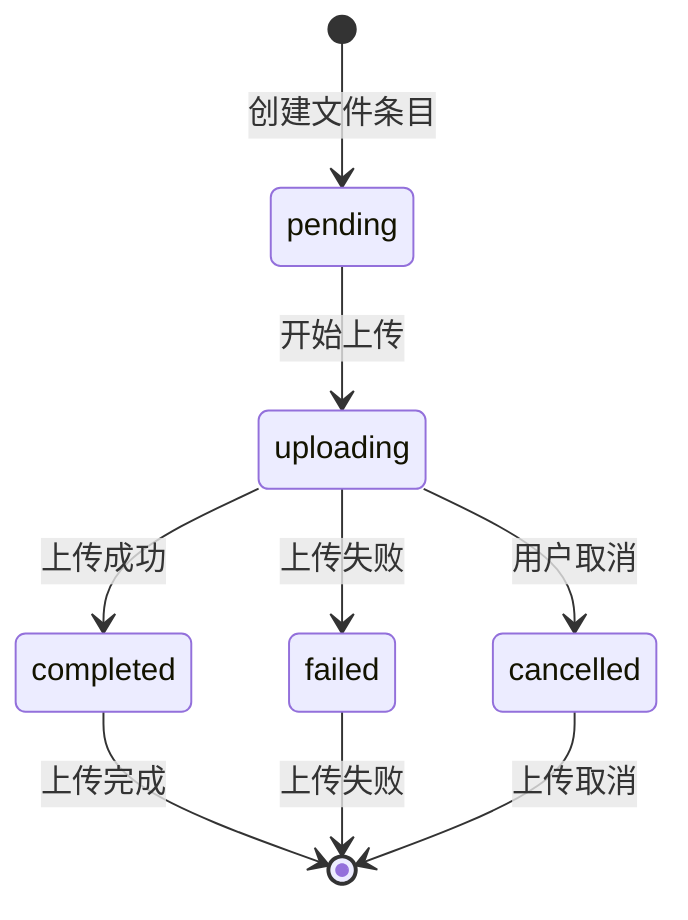

**图表来源**
- [uploadService.js](file://backend/src/services/uploadService.js#L148-L260)

### 上传进度跟踪

系统实现了精细化的上传进度跟踪机制：

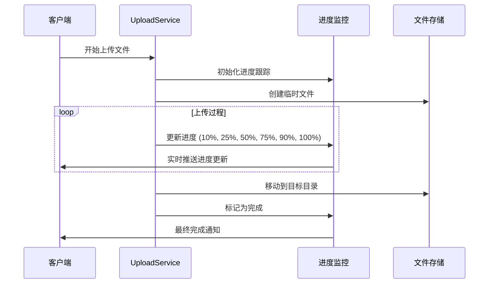

**图表来源**
- [uploadService.js](file://backend/src/services/uploadService.js#L178-L249)

**章节来源**
- [uploadService.js](file://backend/src/services/uploadService.js#L148-L260)
- [uploadController.js](file://backend/src/controllers/uploadController.js#L102-L147)

## BatchUploadSession实体

### 元数据管理

BatchUploadSession实体管理批量上传的完整生命周期：

| 字段名 | 类型 | 描述 | 默认值 |
|--------|------|------|--------|
| sessionId | String | 会话唯一标识符 | UUID生成 |
| category | String | 文件分类 | 'personal' \| 'scenic' |
| expectedFiles | Number | 预期文件数量 | 1-3 |
| maxFiles | Number | 最大文件限制 | 3 |
| uploadPath | String | 上传目标路径 | 动态生成 |
| overallStatus | String | 会话总体状态 | 'pending' \| 'uploading' \| 'completed' \| 'partial' \| 'cancelled' |
| totalProgress | Number | 总体进度百分比 | 0-100 |
| completedFiles | Number | 已完成文件数 | 0 |
| failedFiles | Number | 失败文件数 | 0 |
| sessionStartTime | Date | 会话开始时间 | 当前时间 |
| sessionEndTime | Date | 会话结束时间 | 可为空 |
| createdAt | Date | 创建时间 | 当前时间 |

### 会话生命周期

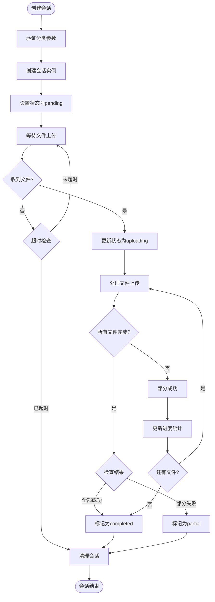

**图表来源**
- [uploadService.js](file://backend/src/services/uploadService.js#L89-L115)
- [uploadService.js](file://backend/src/services/uploadService.js#L282-L295)

**章节来源**
- [uploadService.js](file://backend/src/services/uploadService.js#L89-L115)
- [uploadController.js](file://backend/src/controllers/uploadController.js#L59-L98)

## AnalysisReport实体结构

### 基础结构定义

AnalysisReport实体采用模块化设计，支持多种类型的AI分析结果：

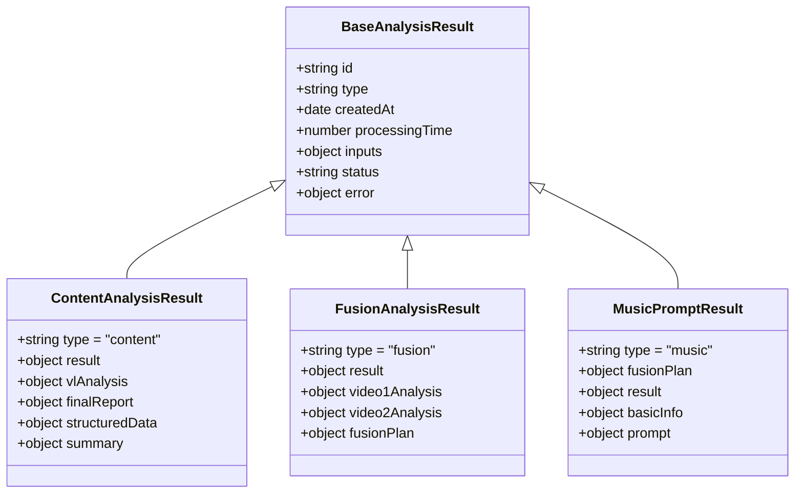

**图表来源**
- [analysisDataStructures.js](file://frontend/src/utils/analysisDataStructures.js#L6-L401)

### 视频内容分析结构

ContentAnalysisResult包含详细的视频内容分析信息：

| 模块 | 字段 | 类型 | 描述 |
|------|------|------|------|
| 基础信息 | duration | Number | 视频时长（秒） |
| 基础信息 | keyframes | Array | 关键帧列表 |
| 基础信息 | scenes | Array | 场景信息列表 |
| 基础信息 | objects | Array | 物体检测结果 |
| 基础信息 | actions | Array | 动作识别结果 |
| 结构化数据 | videoInfo | Object | 视频基本信息 |
| 结构化数据 | contentAnalysis | Object | 内容分析结果 |
| 结构化数据 | technicalAnalysis | Object | 技术分析结果 |
| 摘要信息 | duration | Number | 时长（秒） |
| 摘要信息 | keyframeCount | Number | 关键帧数量 |
| 摘要信息 | sceneCount | Number | 场景数量 |
| 摘要信息 | objectCount | Number | 物体数量 |
| 摘要信息 | actionCount | Number | 动作数量 |

### 融合分析结构

FusionAnalysisResult专门处理双视频融合分析：

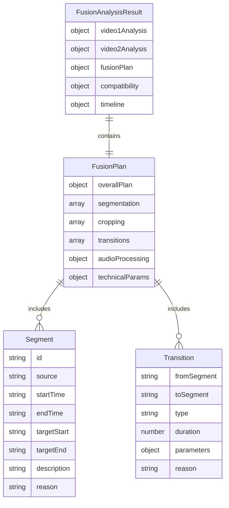

**图表来源**
- [analysisDataStructures.js](file://frontend/src/utils/analysisDataStructures.js#L101-L218)

### 音乐提示词结构

MusicPromptResult生成专业的背景音乐创作提示：

| 部分 | 字段 | 类型 | 描述 |
|------|------|------|------|
| 基础信息 | targetDuration | Number | 目标时长（秒） |
| 基础信息 | musicStyle | String | 音乐风格 |
| 基础信息 | emotionalTone | String | 情感基调 |
| 基础信息 | tempo | Number | BPM（每分钟节拍数） |
| 提示词结构 | styleGuide | Object | 风格指南 |
| 提示词结构 | emotionalCurve | Array | 情感曲线 |
| 提示词结构 | rhythmMatching | Array | 节奏匹配 |
| 提示词结构 | instrumentation | Object | 乐器配置 |
| 提示词结构 | transitionCues | Array | 转场指示 |
| 提示词结构 | technicalSpecs | Object | 技术规格 |
| 提示词结构 | atmosphere | Object | 氛围描述 |

**章节来源**
- [analysisDataStructures.js](file://frontend/src/utils/analysisDataStructures.js#L6-L401)
- [aiService.js](file://backend/src/services/aiService.js#L418-L474)

## 数据验证规则

### 后端验证规则

fileValidator.js提供了完整的文件验证机制：

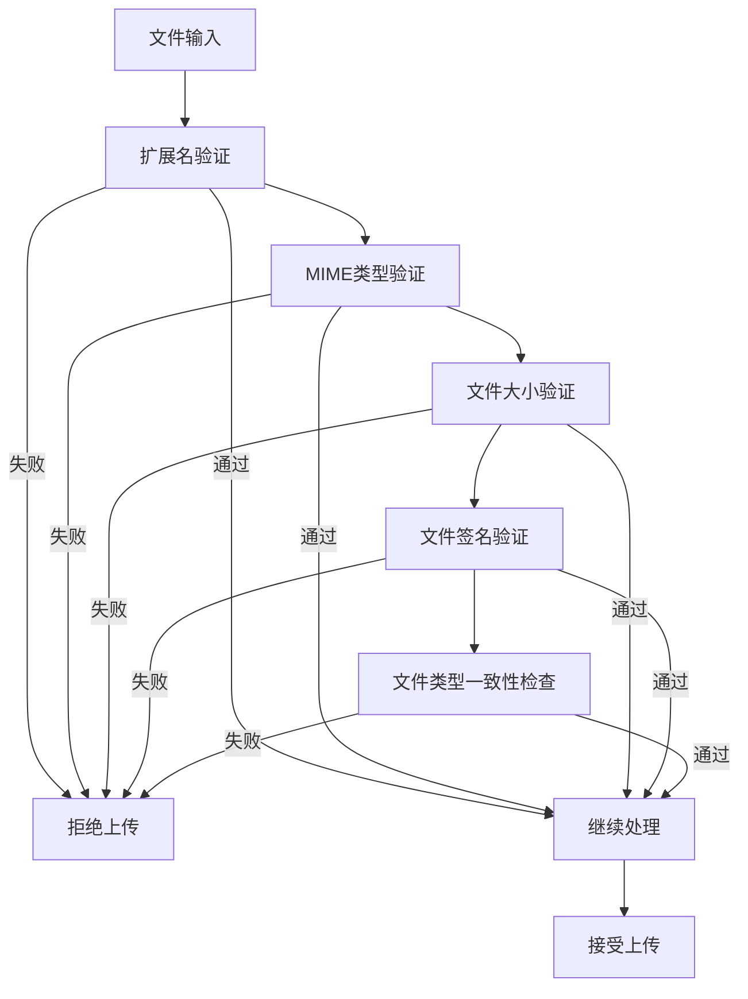

**图表来源**
- [fileValidator.js](file://backend/src/utils/fileValidator.js#L67-L100)

### 前端验证规则

前端FileUploader组件实现了客户端验证：

| 验证项 | 规则 | 错误提示 |
|--------|------|----------|
| 文件数量 | 1-3个文件 | "最多只能上传3个文件" |
| 文件大小 | ≤300MB | "文件过大: {filename}" |
| 文件格式 | .mp4, .avi | "不支持的文件格式: {filename}" |
| 类型一致性 | 所有文件格式相同 | "所有文件必须是相同格式" |

### 配置参数

系统配置了严格的验证参数：

| 参数 | 值 | 描述 |
|------|-----|------|
| maxFileSize | 300MB | 单文件最大大小 |
| maxFilesPerSession | 3 | 单次会话最大文件数 |
| allowedExtensions | ['.mp4', '.avi'] | 允许的文件扩展名 |
| allowedMimeTypes | ['video/mp4', 'video/avi'] | 允许的MIME类型 |
| sessionTimeout | 24小时 | 会话超时时间 |

**章节来源**
- [fileValidator.js](file://backend/src/utils/fileValidator.js#L1-L151)
- [FileUploader.vue](file://frontend/src/components/FileUploader.vue#L92-L113)
- [upload.js](file://backend/src/config/upload.js#L1-L53)

## 状态机设计

### 文件上传状态机

系统实现了完整的文件上传状态机，确保状态转换的正确性和一致性：

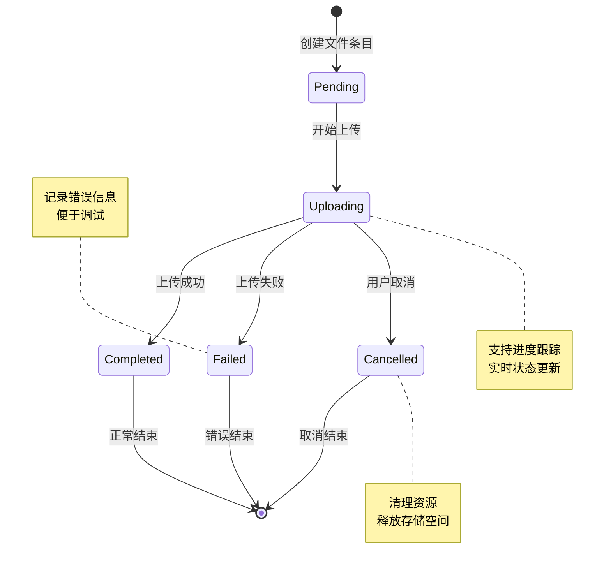

**图表来源**
- [uploadService.js](file://backend/src/services/uploadService.js#L148-L260)

### AI分析状态机

AI分析过程采用三阶段处理模式：

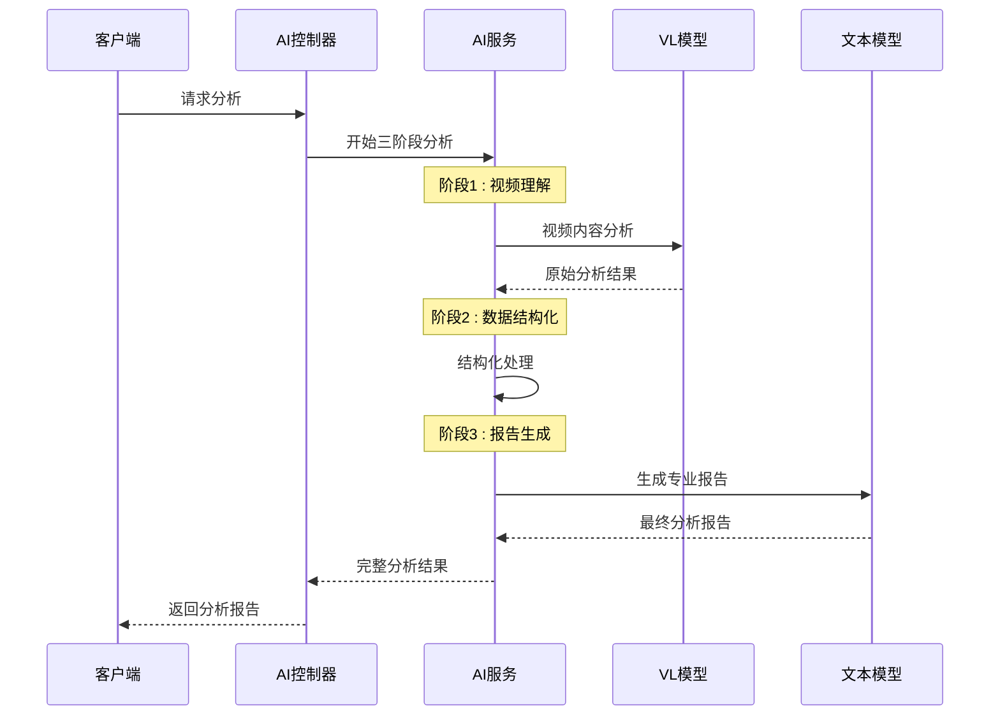

**图表来源**
- [aiService.js](file://backend/src/services/aiService.js#L418-L474)

**章节来源**
- [uploadService.js](file://backend/src/services/uploadService.js#L148-L260)
- [aiService.js](file://backend/src/services/aiService.js#L418-L474)

## 前后端数据结构一致性

### 统一的数据结构规范

系统通过analysisDataStructures.js确保前后端数据结构的一致性：

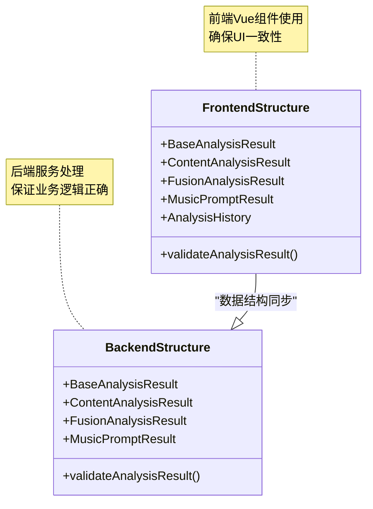

**图表来源**
- [analysisDataStructures.js](file://frontend/src/utils/analysisDataStructures.js#L6-L401)

### 数据验证一致性

前后端都实现了数据验证逻辑：

| 验证类型 | 前端实现 | 后端实现 | 一致性保证 |
|----------|----------|----------|------------|
| 文件格式 | 扩展名检查 | MIME类型验证 | 双重验证 |
| 文件大小 | 客户端限制 | 服务器验证 | 防止绕过 |
| 数据结构 | TypeScript接口 | Joi验证模式 | 类型安全 |
| 业务规则 | 条件检查 | 服务层验证 | 业务完整性 |

**章节来源**
- [analysisDataStructures.js](file://frontend/src/utils/analysisDataStructures.js#L350-L401)
- [uploadController.js](file://backend/src/controllers/uploadController.js#L10-L24)

## 数据流分析

### 完整的数据处理流程

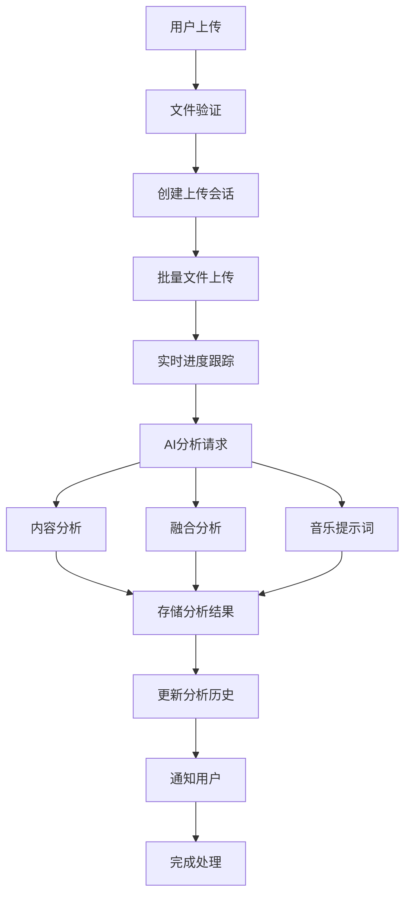

**图表来源**
- [uploadController.js](file://backend/src/controllers/uploadController.js#L102-L147)
- [aiController.js](file://backend/src/controllers/aiController.js#L138-L205)

### WebSocket实时通信

系统使用WebSocket实现实时状态更新：

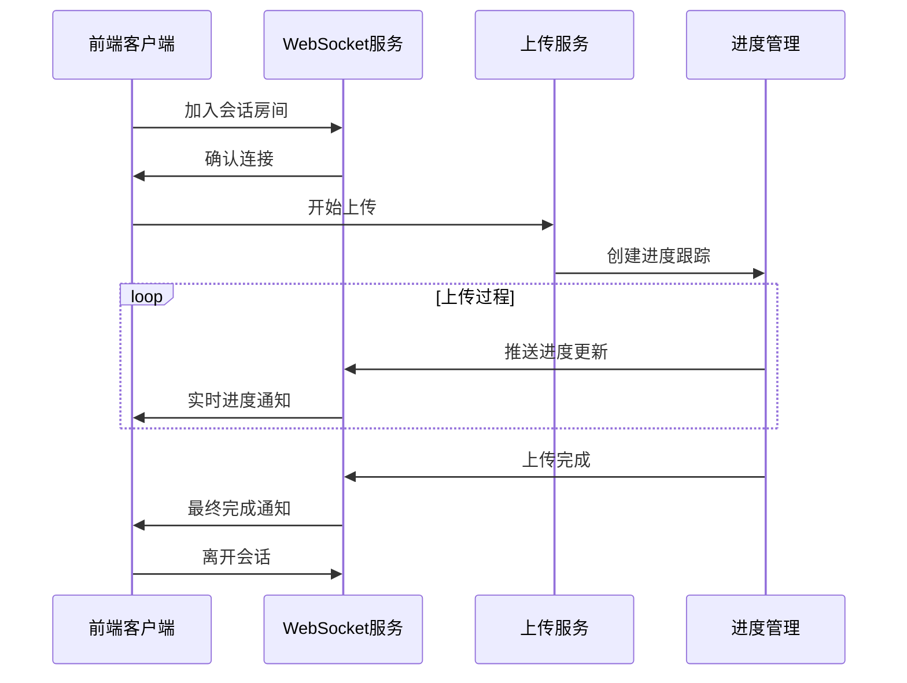

**图表来源**
- [uploadService.js](file://backend/src/services/uploadService.js#L22-L31)
- [useAIAnalysis.js](file://frontend/src/composables/useAIAnalysis.js#L21-L23)

**章节来源**
- [uploadController.js](file://backend/src/controllers/uploadController.js#L102-L147)
- [aiController.js](file://backend/src/controllers/aiController.js#L138-L205)
- [uploadService.js](file://backend/src/services/uploadService.js#L22-L31)

## 总结

NewVedio项目的数据模型设计体现了现代Web应用的最佳实践：

### 核心优势

1. **模块化设计**: 每个实体职责明确，便于维护和扩展
2. **状态机模式**: 确保数据状态的正确性和一致性
3. **前后端一致性**: 通过统一的数据结构规范保证接口稳定性
4. **验证机制**: 双重验证确保数据质量和安全性
5. **实时反馈**: WebSocket实现实时状态更新，提升用户体验

### 技术特色

- **三阶段AI处理**: 视频理解 → 数据结构化 → 报告生成，确保分析质量
- **批量处理**: 支持多文件并发上传和处理
- **错误恢复**: 完善的错误处理和重试机制
- **性能优化**: 进度跟踪和资源管理优化

### 扩展性考虑

系统设计充分考虑了未来的扩展需求：
- 新的分析类型可以通过继承BaseAnalysisResult轻松添加
- 文件格式和大小限制可以通过配置文件灵活调整
- 状态机模式支持新的状态和转换逻辑
- 微服务架构为水平扩展奠定基础

这套数据模型为NewVedio项目提供了坚实的技术基础，支持复杂的视频处理和AI分析需求，同时保持了良好的可维护性和扩展性。