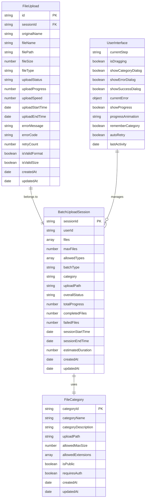
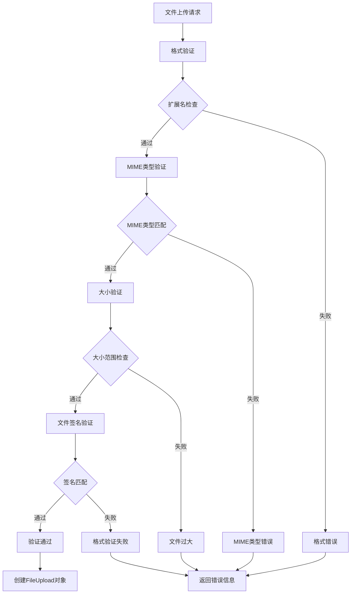
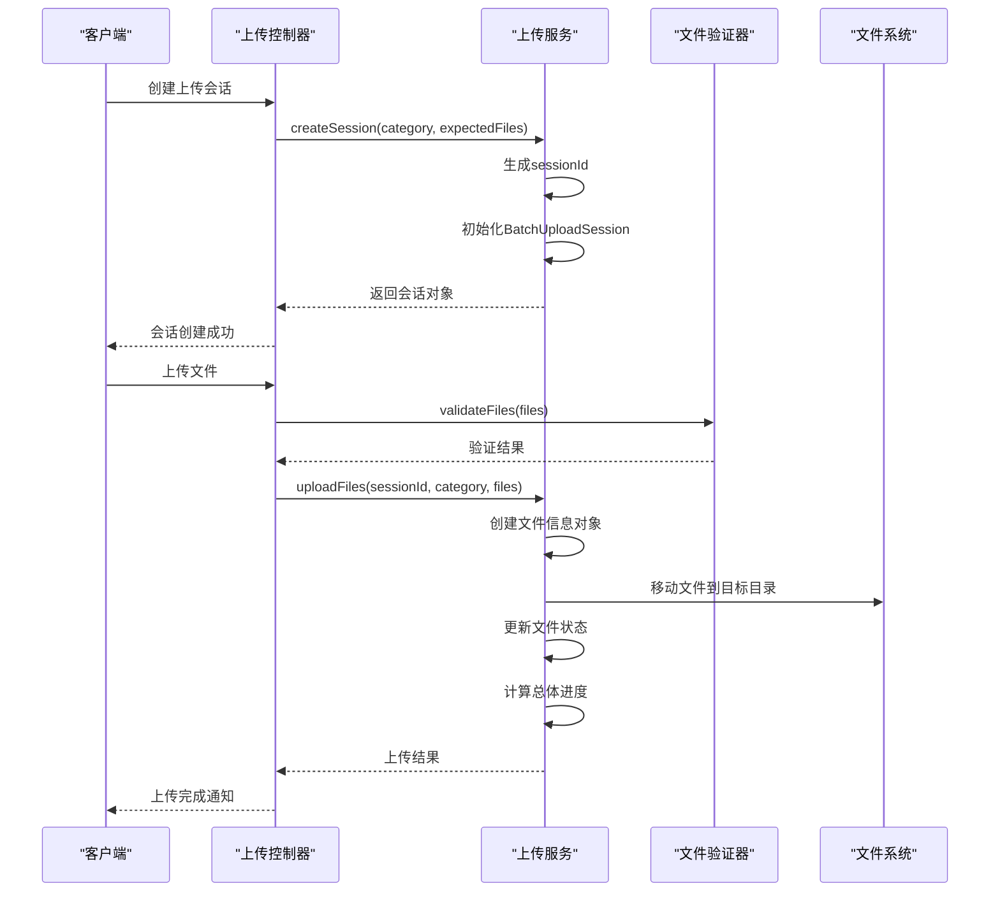
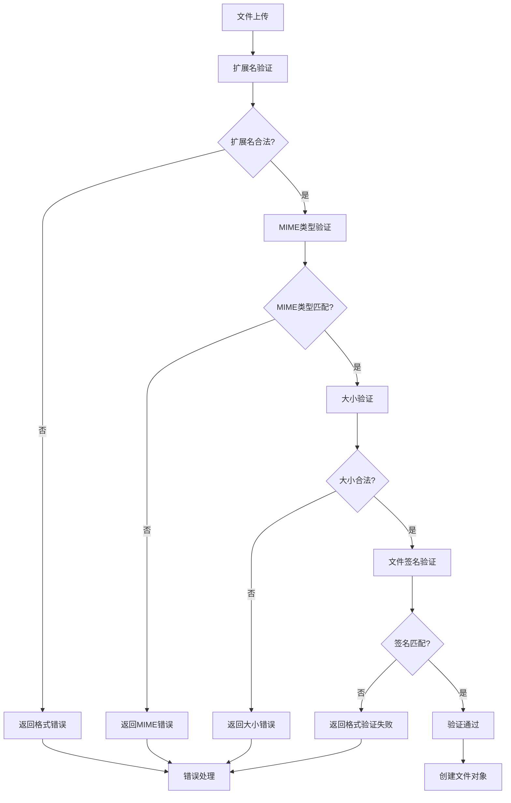
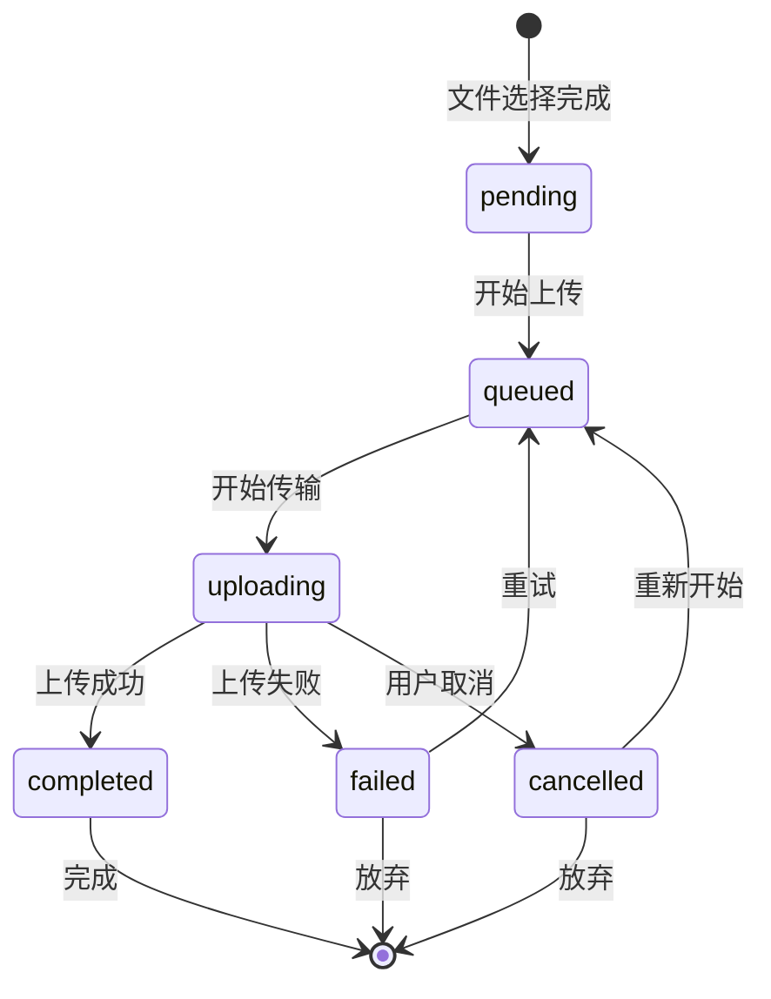
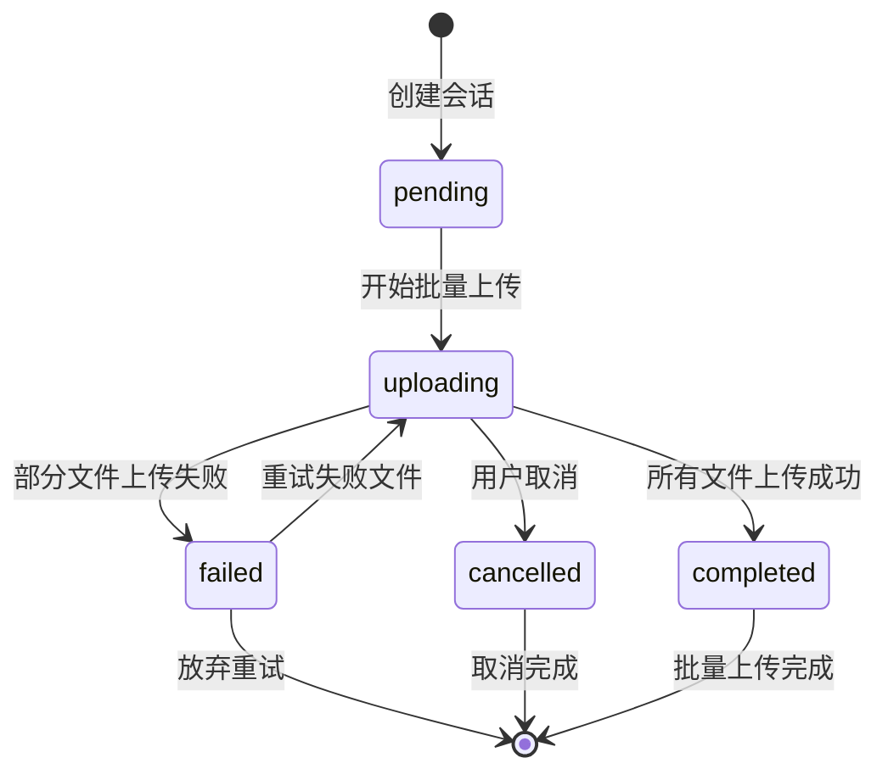
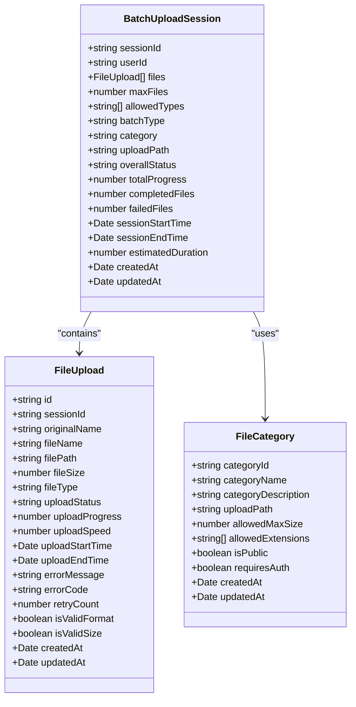
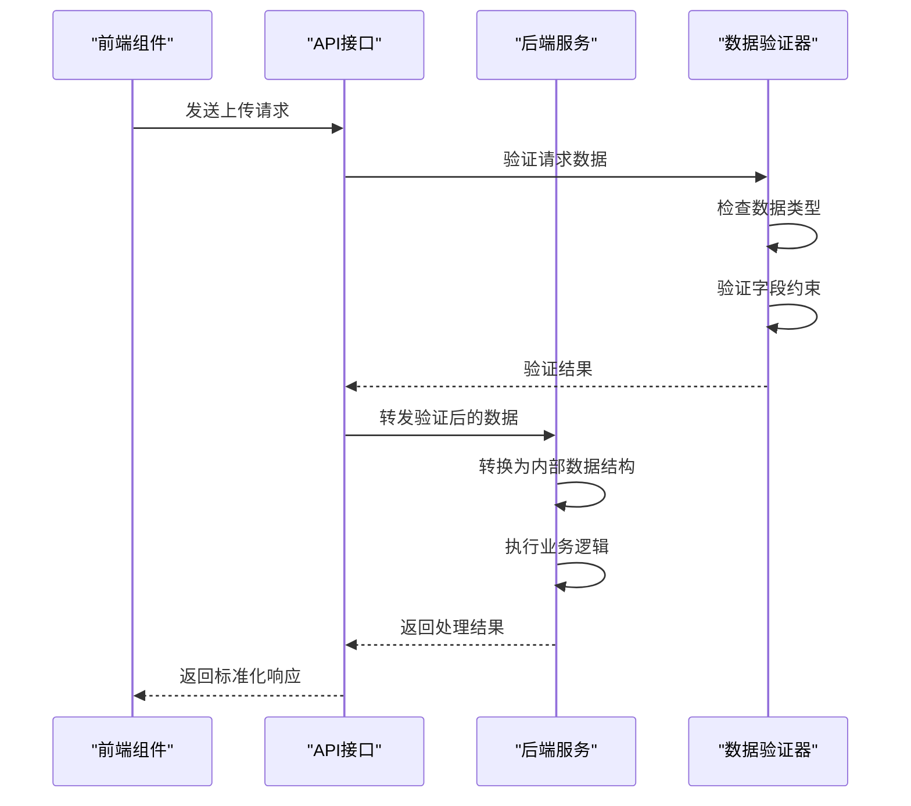
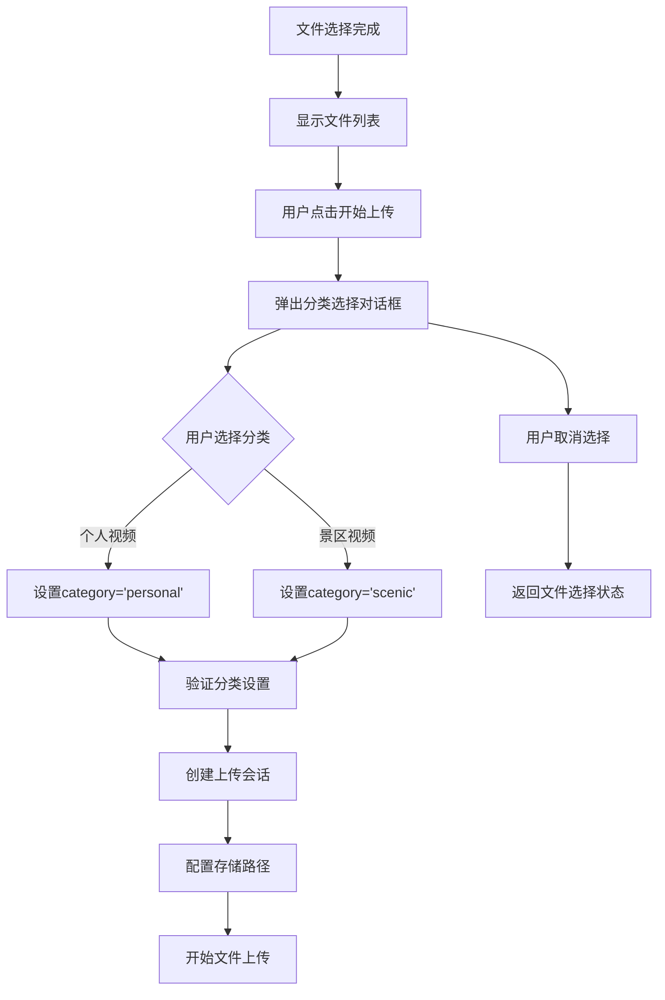

# 文件上传模型

<cite>
**本文档引用的文件**
- [data-model.md](file://specs/001-responsive-h5-upload/data-model.md)
- [analysisDataStructures.js](file://frontend/src/utils/analysisDataStructures.js)
- [fileValidator.js](file://backend/src/utils/fileValidator.js)
- [uploadController.js](file://backend/src/controllers/uploadController.js)
- [uploadService.js](file://backend/src/services/uploadService.js)
- [upload.js](file://backend/src/config/upload.js)
- [FileUploader.vue](file://frontend/src/components/FileUploader.vue)
- [spec.md](file://specs/001-responsive-h5-upload/spec.md)
</cite>

## 目录
1. [简介](#简介)
2. [核心数据模型](#核心数据模型)
3. [FileUpload实体详解](#fileupload实体详解)
4. [BatchUploadSession实体详解](#batchuploadsession实体详解)
5. [文件验证机制](#文件验证机制)
6. [上传状态机](#上传状态机)
7. [前后端数据结构一致性](#前后端数据结构一致性)
8. [实际应用示例](#实际应用示例)
9. [分类选择机制](#分类选择机制)
10. [总结](#总结)

## 简介

本文档详细描述了响应式H5文件上传系统的完整数据模型架构。该系统采用前后端分离的设计模式，支持MP4和AVI格式的视频文件上传，具备批量上传、进度跟踪、状态管理等功能特性。系统通过严格的数据验证机制确保文件质量和安全性，同时提供了完善的错误处理和用户体验优化。

## 核心数据模型

系统的核心数据模型由四个主要实体组成，形成了完整的文件上传生命周期管理体系：



**图表来源**
- [data-model.md](file://specs/001-responsive-h5-upload/data-model.md#L14-L83)
- [analysisDataStructures.js](file://frontend/src/utils/analysisDataStructures.js#L6-L142)

**章节来源**
- [data-model.md](file://specs/001-responsive-h5-upload/data-model.md#L7-L143)

## FileUpload实体详解

FileUpload实体是系统中最基本的数据单元，代表单个文件的上传状态和元数据信息。

### 字段定义与约束

| 字段名 | 数据类型 | 约束条件 | 描述 |
|--------|----------|----------|------|
| id | string | UUID | 唯一标识符，用于追踪单个文件的生命周期 |
| sessionId | string | 外键约束 | 关联的批量上传会话ID，建立文件与会话的关联关系 |
| originalName | string | 长度限制 | 用户原始文件名，保持用户选择的文件名称不变 |
| fileName | string | 命名规则 | 存储文件名，采用UUID重命名机制确保唯一性 |
| filePath | string | 路径验证 | 完整文件路径，指向实际存储位置 |
| fileSize | number | 大小限制 | 文件大小（字节），受300MB上限约束 |
| fileType | string | 枚举值 | 文件类型，支持'mp4'和'avici'两种格式 |
| uploadStatus | string | 状态枚举 | 上传状态，包括'pending'、'uploading'、'completed'、'failed'、'cancelled'、'queued' |
| uploadProgress | number | 范围约束 | 上传进度百分比（0-100），实时反映上传完成度 |
| uploadSpeed | number | 正数值 | 上传速度（字节/秒），用于计算剩余时间 |
| uploadStartTime | date | 时间戳 | 上传开始时间，用于性能分析和用户体验优化 |
| uploadEndTime | date | 可选字段 | 上传结束时间，标记文件处理完成 |
| errorMessage | string | 可选字段 | 错误信息，当上传失败时提供详细的错误描述 |
| errorCode | string | 可选字段 | 错误代码，便于系统级错误处理和日志记录 |
| retryCount | number | 非负整数 | 重试次数，记录文件上传失败后的重试尝试 |
| isValidFormat | boolean | 验证结果 | 格式验证结果，标记文件格式是否符合要求 |
| isValidSize | boolean | 验证结果 | 大小验证结果，标记文件大小是否在允许范围内 |
| createdAt | date | 自动填充 | 创建时间，记录文件对象的创建时刻 |
| updatedAt | date | 自动更新 | 更新时间，每次状态变更时自动更新 |

### 数据类型与验证规则

系统对FileUpload实体的字段实施严格的验证机制：



**图表来源**
- [fileValidator.js](file://backend/src/utils/fileValidator.js#L67-L100)
- [uploadService.js](file://backend/src/services/uploadService.js#L34-L85)

**章节来源**
- [data-model.md](file://specs/001-responsive-h5-upload/data-model.md#L14-L44)
- [uploadService.js](file://backend/src/services/uploadService.js#L34-L85)

## BatchUploadSession实体详解

BatchUploadSession实体管理一次上传操作中的所有文件，提供批量上传的协调和状态管理功能。

### 核心字段与聚合信息

| 字段名 | 数据类型 | 约束条件 | 描述 |
|--------|----------|----------|------|
| sessionId | string | UUID | 会话唯一标识符，用于跟踪整个批量上传过程 |
| userId | string | 可选字段 | 用户ID（预留字段），为后续扩展功能准备 |
| files | array | 数组约束 | 文件列表（最多3个），包含所有参与上传的FileUpload对象 |
| maxFiles | number | 固定值 | 最大文件数（3），限制批量上传的数量 |
| allowedTypes | array | 类型约束 | 允许的文件类型，目前支持['mp4', 'avi'] |
| batchType | string | 类型枚举 | 批次类型（'mp4' \| 'avi' \| 'mixed'），确保同类型文件 |
| category | string | 分类枚举 | 文件分类（'personal' \| 'scenic'），决定存储路径 |
| uploadPath | string | 路径映射 | 上传路径，根据分类映射到不同的存储目录 |
| overallStatus | string | 状态枚举 | 整体状态（'pending' \| 'uploading' \| 'completed' \| 'failed' \| 'cancelled'），反映会话整体状态 |
| totalProgress | number | 范围约束 | 总体进度（0-100），基于文件完成比例计算 |
| completedFiles | number | 计数器 | 已完成文件数，统计成功上传的文件数量 |
| failedFiles | number | 计数器 | 失败文件数，统计上传失败的文件数量 |
| sessionStartTime | date | 时间戳 | 会话开始时间，用于性能监控和用户体验分析 |
| sessionEndTime | date | 可选字段 | 会话结束时间，标记批量上传完成或取消 |
| estimatedDuration | number | 可选字段 | 预估完成时间（秒），基于平均上传速度计算 |
| createdAt | date | 自动填充 | 创建时间，记录会话初始化时刻 |
| updatedAt | date | 自动更新 | 更新时间，每次状态变更时自动更新 |

### 批量上传协调机制

BatchUploadSession通过以下机制协调多个文件的上传过程：



**图表来源**
- [uploadController.js](file://backend/src/controllers/uploadController.js#L59-L125)
- [uploadService.js](file://backend/src/services/uploadService.js#L118-L295)

**章节来源**
- [data-model.md](file://specs/001-responsive-h5-upload/data-model.md#L47-L83)
- [uploadService.js](file://backend/src/services/uploadService.js#L89-L115)

## 文件验证机制

系统实现了多层次的文件验证机制，确保上传文件的质量和安全性。

### 验证方法详解

#### validateExtension - 扩展名验证
验证文件扩展名是否在允许的列表中，防止恶意文件上传。

#### validateMimeType - MIME类型验证  
验证文件的MIME类型是否符合预期，增强文件格式的安全性检查。

#### validateSize - 文件大小验证
检查文件大小是否在允许范围内，防止超大文件占用过多存储资源。

#### validateConsistentType - 类型一致性验证
确保批量上传的所有文件具有相同的文件类型，维护数据的一致性。

#### validateFileSignature - 文件签名验证
通过读取文件头部的魔数（Magic Numbers）验证文件的真实格式，防止文件类型伪装攻击。

### 验证流程与错误处理



**图表来源**
- [fileValidator.js](file://backend/src/utils/fileValidator.js#L67-L151)

### 前端验证与后端验证协同

系统采用前后端双重验证机制：

| 验证阶段 | 前端职责 | 后端职责 | 协同机制 |
|----------|----------|----------|----------|
| 文件选择 | 格式过滤、大小检查、数量限制 | 完整验证链、签名检查 | 前端预验证，后端最终确认 |
| 传输过程 | 进度监控、中断恢复 | 状态跟踪、错误处理 | WebSocket实时通信 |
| 存储阶段 | 最终验证 | 文件完整性检查 | 二次验证确保安全 |

**章节来源**
- [fileValidator.js](file://backend/src/utils/fileValidator.js#L1-151)
- [FileUploader.vue](file://frontend/src/components/FileUploader.vue#L92-L113)

## 上传状态机

系统实现了完整的文件上传状态机，管理从文件选择到上传完成的全过程状态转换。

### FileUpload状态机



**图表来源**
- [data-model.md](file://specs/001-responsive-h5-upload/data-model.md#L151-L163)

### BatchUploadSession状态机



**图表来源**
- [data-model.md](file://specs/001-responsive-h5-upload/data-model.md#L168-L178)

### 状态转换规则与约束

#### FileUpload状态转换表

| 当前状态 | 下一状态 | 触发条件 | 约束条件 |
|----------|----------|----------|----------|
| pending | queued | 用户确认上传 | 文件验证通过 |
| queued | uploading | 开始传输 | 网络连接正常 |
| uploading | completed | 传输完成 | 文件完整性验证通过 |
| uploading | failed | 传输失败 | 网络错误、存储错误 |
| uploading | cancelled | 用户取消 | 用户主动操作 |
| failed | queued | 重试机制 | 重试次数未达上限 |
| cancelled | queued | 重新上传 | 文件重新选择 |

#### BatchUploadSession状态转换表

| 当前状态 | 下一状态 | 触发条件 | 状态影响 |
|----------|----------|----------|----------|
| pending | uploading | 开始第一个文件上传 | 整体状态变为上传中 |
| uploading | completed | 所有文件上传成功 | 批量上传完成 |
| uploading | failed | 出现文件上传失败 | 部分文件失败状态 |
| uploading | cancelled | 用户取消所有文件 | 所有文件状态变为取消 |
| failed | uploading | 重试失败文件 | 重新开始上传流程 |
| cancelled | [*] | 会话结束 | 清理会话资源 |

**章节来源**
- [data-model.md](file://specs/001-responsive-h5-upload/data-model.md#L148-L178)
- [uploadService.js](file://backend/src/services/uploadService.js#L282-L295)

## 前后端数据结构一致性

系统确保前后端数据结构的高度一致性，通过统一的数据模型规范保证数据交换的准确性和可靠性。

### 前端数据结构定义

前端通过analysisDataStructures.js定义了标准化的数据结构：



**图表来源**
- [analysisDataStructures.js](file://frontend/src/utils/analysisDataStructures.js#L6-L142)

### 后端数据结构实现

后端通过JavaScript对象和类实现相应的数据结构：

| 前端字段 | 后端实现 | 数据类型 | 约束验证 |
|----------|----------|----------|----------|
| id | uuidv4() | string | 自动生成唯一标识符 |
| sessionId | uuidv4() | string | 会话唯一标识符 |
| originalName | file.originalname | string | 原始文件名 |
| fileName | generateFileName() | string | 生成的文件名 |
| filePath | path.join() | string | 文件系统路径 |
| fileSize | file.size | number | 文件大小字节 |
| fileType | path.extname() | string | 文件扩展名 |
| uploadStatus | 状态枚举 | string | 状态常量 |
| uploadProgress | 进度计算 | number | 百分比值 |
| uploadSpeed | 速度计算 | number | 字节/秒 |
| uploadStartTime | new Date() | Date | 时间戳 |
| uploadEndTime | new Date() | Date | 时间戳 |
| errorMessage | 错误信息 | string | 可选字段 |
| errorCode | 错误代码 | string | 可选字段 |
| retryCount | 重试计数 | number | 非负整数 |
| isValidFormat | 验证结果 | boolean | 布尔值 |
| isValidSize | 验证结果 | boolean | 布尔值 |
| createdAt | 自动填充 | Date | 系统时间 |
| updatedAt | 自动更新 | Date | 系统时间 |

### 数据同步机制

系统通过以下机制确保前后端数据结构的一致性：



**图表来源**
- [uploadController.js](file://backend/src/controllers/uploadController.js#L26-L47)
- [uploadService.js](file://backend/src/services/uploadService.js#L34-L85)

**章节来源**
- [analysisDataStructures.js](file://frontend/src/utils/analysisDataStructures.js#L1-401)
- [data-model.md](file://specs/001-responsive-h5-upload/data-model.md#L14-L83)

## 实际应用示例

以下是文件上传对象创建和状态更新的完整示例流程。

### 文件上传对象创建示例

```javascript
// 前端创建文件上传对象
const createFileUploadObject = (file, sessionId) => {
    return {
        id: uuidv4(),
        sessionId: sessionId,
        originalName: file.name,
        fileName: generateUniqueFileName(file.name),
        filePath: constructFilePath(sessionId, file.name),
        fileSize: file.size,
        fileType: extractFileType(file.name),
        uploadStatus: 'pending',
        uploadProgress: 0,
        uploadSpeed: 0,
        uploadStartTime: new Date(),
        createdAt: new Date(),
        updatedAt: new Date()
    };
};

// 后端接收并处理文件上传
const handleFileUpload = async (req, res) => {
    const { sessionId, category } = req.body;
    const files = req.files;
    
    // 创建文件信息对象
    const fileInfo = {
        id: uuidv4(),
        originalName: files[0].originalname,
        fileSize: files[0].size,
        fileType: path.extname(files[0].originalname).substring(1),
        status: 'uploading',
        progress: 0,
        uploadSpeed: 0,
        uploadStartTime: new Date()
    };
    
    // 更新会话状态
    session.files.push(fileInfo);
    session.overallStatus = 'uploading';
    
    // 发送初始进度通知
    emitProgress(sessionId, {
        overallStatus: 'uploading',
        totalProgress: 5,
        completedFiles: 0,
        failedFiles: 0,
        message: '开始上传文件...'
    });
};
```

### 状态更新过程示例

```javascript
// 文件上传进度更新
const updateUploadProgress = (sessionId, fileId, progress, speed) => {
    const session = sessions.get(sessionId);
    const file = session.files.find(f => f.id === fileId);
    
    if (file) {
        file.progress = progress;
        file.uploadSpeed = speed;
        file.updatedAt = new Date();
        
        // 更新会话总体进度
        const completedFiles = session.files.filter(f => f.status === 'completed').length;
        session.totalProgress = Math.round((completedFiles / session.files.length) * 100);
        session.updatedAt = new Date();
        
        // 发送进度更新通知
        emitProgress(sessionId, {
            overallStatus: session.overallStatus,
            totalProgress: session.totalProgress,
            completedFiles: session.completedFiles,
            failedFiles: session.failedFiles,
            currentFile: {
                id: file.id,
                originalName: file.originalName,
                progress: file.progress,
                status: file.status,
                uploadSpeed: file.uploadSpeed
            }
        });
    }
};

// 文件上传完成处理
const handleUploadComplete = (sessionId, fileId) => {
    const session = sessions.get(sessionId);
    const file = session.files.find(f => f.id === fileId);
    
    if (file) {
        file.status = 'completed';
        file.uploadEndTime = new Date();
        file.isValidFormat = true;
        file.isValidSize = true;
        
        // 更新会话状态
        session.completedFiles++;
        session.totalProgress = Math.round((session.completedFiles / session.files.length) * 100);
        
        // 检查是否所有文件都已完成
        if (session.completedFiles === session.files.length) {
            session.overallStatus = 'completed';
            session.sessionEndTime = new Date();
        }
        
        // 发送完成通知
        emitProgress(sessionId, {
            overallStatus: session.overallStatus,
            totalProgress: 100,
            completedFiles: session.completedFiles,
            failedFiles: session.failedFiles,
            message: '所有文件上传完成'
        });
    }
};
```

### 错误处理与重试机制

```javascript
// 文件上传失败处理
const handleUploadFailure = (sessionId, fileId, error) => {
    const session = sessions.get(sessionId);
    const file = session.files.find(f => f.id === fileId);
    
    if (file) {
        file.status = 'failed';
        file.errorMessage = error.message;
        file.errorCode = 'UPLOAD_FAILED';
        file.retryCount++;
        
        // 更新会话状态
        session.failedFiles++;
        session.totalProgress = Math.round((session.completedFiles / session.files.length) * 100);
        
        // 检查是否可以重试
        if (file.retryCount < MAX_RETRY_COUNT) {
            // 重新排队等待重试
            file.status = 'queued';
            
            emitProgress(sessionId, {
                overallStatus: session.overallStatus,
                totalProgress: session.totalProgress,
                completedFiles: session.completedFiles,
                failedFiles: session.failedFiles,
                currentFile: {
                    id: file.id,
                    originalName: file.originalName,
                    progress: 0,
                    status: 'queued',
                    error: error.message
                },
                message: `${file.originalName} 上传失败，准备重试...`
            });
        } else {
            // 达到最大重试次数，放弃上传
            session.overallStatus = 'failed';
            
            emitProgress(sessionId, {
                overallStatus: session.overallStatus,
                totalProgress: session.totalProgress,
                completedFiles: session.completedFiles,
                failedFiles: session.failedFiles,
                message: '部分文件上传失败，无法继续重试'
            });
        }
    }
};
```

**章节来源**
- [uploadService.js](file://backend/src/services/uploadService.js#L118-L295)
- [FileUploader.vue](file://frontend/src/components/FileUploader.vue#L206-L246)

## 分类选择机制

系统提供了灵活的文件分类机制，支持"个人视频"和"景区视频"两种分类，每种分类对应不同的存储路径和访问权限。

### 分类定义与存储路径

| 分类ID | 分类名称 | 存储路径 | 访问权限 | 文件大小限制 |
|--------|----------|----------|----------|--------------|
| personal | 个人视频 | `/backend/upload/personal/` | 私有访问 | 300MB |
| scenic | 景区视频 | `/backend/upload/scenic/` | 私有访问 | 300MB |

### 分类选择流程



**图表来源**
- [uploadController.js](file://backend/src/controllers/uploadController.js#L59-L89)
- [FileUploader.vue](file://frontend/src/components/FileUploader.vue#L206-L246)

### 分类验证与路径映射

系统通过多重验证确保分类选择的正确性：

```javascript
// 分类验证规则
const validateCategory = (category) => {
    const allowedCategories = ['personal', 'scenic'];
    const categoryPaths = {
        personal: '/backend/upload/personal/',
        scenic: '/backend/upload/scenic/'
    };
    
    if (!allowedCategories.includes(category)) {
        throw new Error('无效的文件分类');
    }
    
    // 验证路径存在性
    const pathExists = fs.existsSync(path.join(uploadBaseDir, category));
    if (!pathExists) {
        throw new Error('分类路径不存在');
    }
    
    return {
        category,
        uploadPath: categoryPaths[category]
    };
};

// 前端分类验证
const validateCategorySelection = (category) => {
    const validCategories = ['personal', 'scenic'];
    
    if (!validCategories.includes(category)) {
        throw new Error('请选择有效的文件分类');
    }
    
    // 检查分类路径配置
    const categoryPath = getCategoryUploadPath(category);
    if (!categoryPath) {
        throw new Error('分类路径配置错误');
    }
    
    return true;
};
```

### 分类与文件关联机制

```javascript
// 创建上传会话时绑定分类
const createSessionWithCategory = async ({ category, expectedFiles }) => {
    // 验证分类
    const validatedCategory = validateCategory(category);
    
    // 创建会话
    const sessionId = uuidv4();
    const session = {
        sessionId,
        category: validatedCategory.category,
        uploadPath: validatedCategory.uploadPath,
        // ... 其他会话字段
    };
    
    // 存储会话
    sessions.set(sessionId, session);
    
    return session;
};

// 文件上传时应用分类规则
const uploadFilesWithCategory = async (sessionId, category, files) => {
    const session = sessions.get(sessionId);
    
    if (!session) {
        throw new Error('会话不存在');
    }
    
    // 应用分类规则
    session.category = category;
    session.uploadPath = getCategoryUploadPath(category);
    
    // 验证文件与分类的一致性
    for (const file of files) {
        const fileExtension = path.extname(file.name).toLowerCase();
        const allowedExtensions = getAllowedExtensions(category);
        
        if (!allowedExtensions.includes(fileExtension)) {
            throw new Error(`文件格式不支持: ${file.name}`);
        }
    }
    
    // 执行文件上传
    return await processFileUpload(session, files);
};
```

**章节来源**
- [upload.js](file://backend/src/config/upload.js#L23-L26)
- [uploadController.js](file://backend/src/controllers/uploadController.js#L59-L89)

## 总结

响应式H5文件上传系统通过精心设计的数据模型架构，实现了功能完整、安全可靠的文件上传解决方案。系统的核心优势包括：

### 技术架构优势

1. **模块化设计**：清晰分离FileUpload和BatchUploadSession实体，便于维护和扩展
2. **状态机管理**：完整的状态转换机制确保上传过程的可控性和可预测性
3. **双重验证**：前后端协同的验证机制提供强大的安全保障
4. **实时反馈**：基于WebSocket的进度通知机制提供优秀的用户体验

### 数据模型特点

1. **完整性**：涵盖文件生命周期的各个阶段，从选择到存储的完整追踪
2. **一致性**：前后端数据结构高度一致，确保数据交换的准确性
3. **扩展性**：预留的字段和接口设计支持未来功能扩展
4. **安全性**：多层次的验证机制防止恶意文件上传

### 用户体验优化

1. **直观界面**：响应式设计适配各种设备屏幕
2. **实时进度**：上传进度可视化，提升用户感知
3. **智能提示**：清晰的错误信息和解决方案指导
4. **灵活控制**：支持上传取消和重试机制

该文件上传模型为现代Web应用提供了可靠的基础架构，支持大规模文件上传场景，同时保持了良好的性能和可维护性。通过持续的优化和扩展，该系统能够满足不断增长的业务需求和技术挑战。