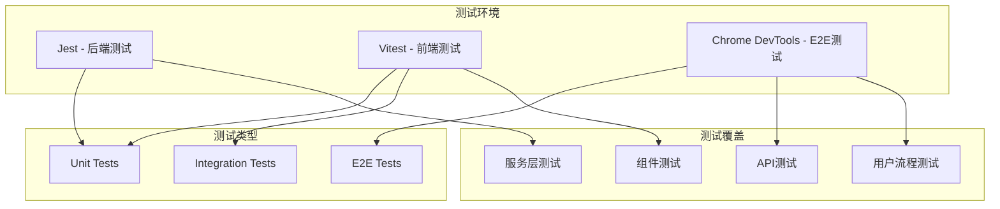
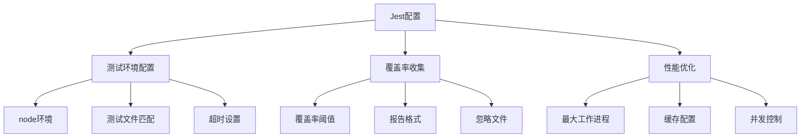
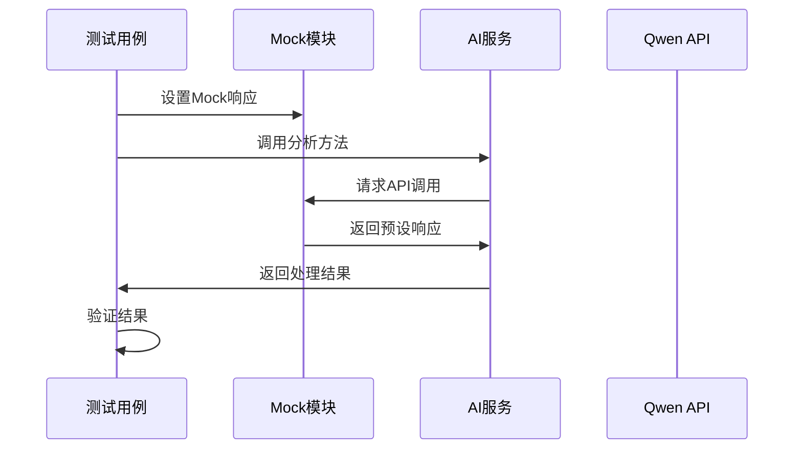
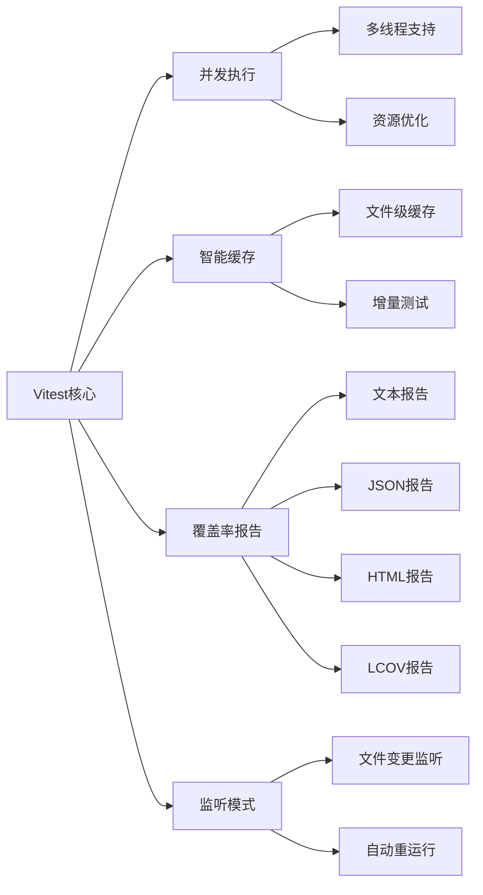
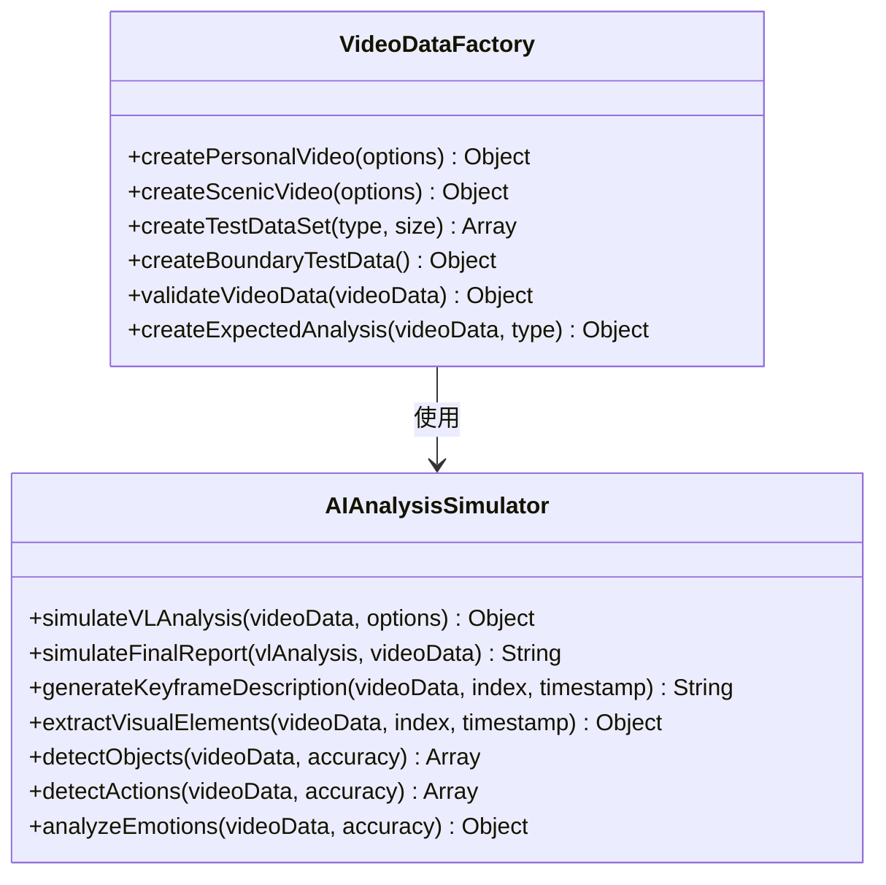
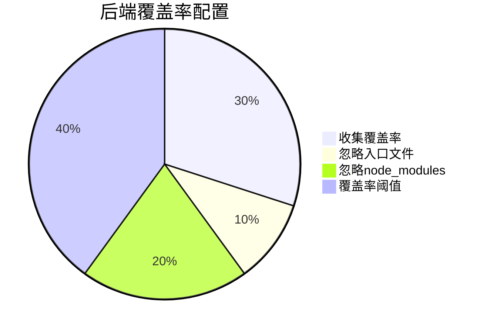

# 测试策略

<cite>
**本文档引用的文件**
- [backend/jest.config.js](file://backend/jest.config.js)
- [frontend/vitest.config.js](file://frontend/vitest.config.js)
- [backend/tests/services/aiService.test.js](file://backend/tests/services/aiService.test.js)
- [frontend/src/composables/useAIAnalysis.js](file://frontend/src/composables/useAIAnalysis.js)
- [frontend/src/tests/fixtures/dataFactory.js](file://frontend/src/tests/fixtures/dataFactory.js)
- [frontend/src/tests/unit/useAIAnalysis.test.js](file://frontend/src/tests/unit/useAIAnalysis.test.js)
- [frontend/src/tests/e2e/contentAnalysis.test.js](file://frontend/src/tests/e2e/contentAnalysis.test.js)
- [frontend/src/tests/integration/uploadAnalysisFlow.test.js](file://frontend/src/tests/integration/uploadAnalysisFlow.test.js)
- [frontend/src/tests/integration/resultDisplay.test.js](file://frontend/src/tests/integration/resultDisplay.test.js)
- [frontend/src/tests/unit/analysisDataStructures.test.js](file://frontend/src/tests/unit/analysisDataStructures.test.js)
- [frontend/src/tests/unit/analysisStorage.test.js](file://frontend/src/tests/unit/analysisStorage.test.js)
</cite>

## 目录
1. [概述](#概述)
2. [测试架构设计](#测试架构设计)
3. [后端测试策略](#后端测试策略)
4. [前端测试策略](#前端测试策略)
5. [测试数据工厂](#测试数据工厂)
6. [测试覆盖率报告](#测试覆盖率报告)
7. [测试执行命令](#测试执行命令)
8. [CI/CD集成建议](#cicd集成建议)
9. [测试最佳实践](#测试最佳实践)
10. [故障排除指南](#故障排除指南)

## 概述

本项目采用多层次的测试策略，涵盖单元测试、集成测试和端到端测试，确保AI视频分析系统的稳定性和可靠性。测试框架基于现代JavaScript生态系统，后端使用Jest，前端使用Vitest，提供全面的测试覆盖。

### 测试目标

- **可靠性**：确保AI分析功能的准确性和稳定性
- **性能**：验证系统在各种负载下的响应能力
- **用户体验**：保证用户界面的流畅性和易用性
- **数据完整性**：确保分析结果的准确性和一致性
- **错误处理**：验证系统对异常情况的处理能力

## 测试架构设计



**图表来源**
- [backend/jest.config.js](file://backend/jest.config.js#L1-L82)
- [frontend/vitest.config.js](file://frontend/vitest.config.js#L1-L122)

### 测试层次结构

1. **单元测试层**：独立的功能模块测试
2. **集成测试层**：组件和服务间的协作测试
3. **端到端测试层**：完整用户场景测试
4. **性能测试层**：系统性能和负载测试

## 后端测试策略

### Jest配置和优化

后端测试使用Jest作为测试框架，配置了多项优化措施以提升测试性能和可靠性：



**图表来源**
- [backend/jest.config.js](file://backend/jest.config.js#L1-L82)

### AI服务单元测试

后端AI服务测试重点验证与Qwen API的交互和数据处理逻辑：

#### 关键测试场景

1. **正常视频分析场景**
   - 验证API响应格式
   - 测试数据结构验证
   - 确认API调用参数正确性

2. **API调用失败处理**
   - 超时错误处理
   - 认证错误处理
   - 网络连接错误处理

3. **无效视频路径处理**
   - 空路径验证
   - null值处理
   - undefined值处理

4. **返回数据格式验证**
   - JSON格式验证
   - 数据结构完整性检查
   - 边界情况测试

**章节来源**
- [backend/tests/services/aiService.test.js](file://backend/tests/services/aiService.test.js#L1-L800)

### 外部API模拟策略

后端测试采用全面的API模拟策略，确保测试的独立性和可重复性：



**图表来源**
- [backend/tests/services/aiService.test.js](file://backend/tests/services/aiService.test.js#L5-L38)

## 前端测试策略

### Vitest配置和特性

前端测试使用Vitest，提供现代化的测试体验和强大的功能：

#### 核心配置特性

1. **并发测试**：支持多线程并发执行
2. **智能缓存**：提升测试执行速度
3. **覆盖率报告**：多种格式的覆盖率报告
4. **监听模式**：开发时自动重新运行测试



**图表来源**
- [frontend/vitest.config.js](file://frontend/vitest.config.js#L1-L122)

### 组合式函数测试

前端使用Vue 3组合式API，测试重点验证`useAIAnalysis`的完整功能：

#### 测试覆盖范围

1. **AI分析服务初始化**
   - 状态初始化验证
   - 方法可用性检查
   - 依赖注入测试

2. **视频内容分析功能**
   - API调用验证
   - 状态变化跟踪
   - 错误处理测试

3. **视频融合分析功能**
   - 双文件分析流程
   - 融合方案生成
   - 音乐提示词生成

4. **状态管理和错误处理**
   - 异步操作处理
   - 状态重置功能
   - 错误边界测试

**章节来源**
- [frontend/src/tests/unit/useAIAnalysis.test.js](file://frontend/src/tests/unit/useAIAnalysis.test.js#L1-L796)

### 组件集成测试

集成测试验证组件间的协作和数据流：

#### 关键测试场景

1. **文件上传到分析流程**
   - 上传进度跟踪
   - 分析状态同步
   - 错误恢复机制

2. **结果展示组件**
   - 内容分析结果展示
   - 融合分析结果展示
   - 音乐提示词展示

3. **实时进度更新**
   - 上传进度监控
   - 分析进度跟踪
   - WebSocket连接管理

**章节来源**
- [frontend/src/tests/integration/uploadAnalysisFlow.test.js](file://frontend/src/tests/integration/uploadAnalysisFlow.test.js#L1-L749)
- [frontend/src/tests/integration/resultDisplay.test.js](file://frontend/src/tests/integration/resultDisplay.test.js#L1-L770)

## 测试数据工厂

### 数据工厂设计原则

测试数据工厂提供真实可靠的测试数据，基于Qwen模型的最佳实践生成：



**图表来源**
- [frontend/src/tests/fixtures/dataFactory.js](file://frontend/src/tests/fixtures/dataFactory.js#L1-L708)

### 测试数据类型

1. **个人视频数据**
   - 家庭旅行场景
   - 生日聚会场景
   - 运动活动场景
   - 烹饪课程场景

2. **景区视频数据**
   - 山岳风光
   - 瀑布景观
   - 城市夜景
   - 海边风光

3. **边界测试数据**
   - 超大文件测试
   - 最小文件测试
   - 特殊字符文件名
   - Unicode文件名

**章节来源**
- [frontend/src/tests/fixtures/dataFactory.js](file://frontend/src/tests/fixtures/dataFactory.js#L9-L282)

### 数据验证机制

测试数据工厂内置完整的数据验证机制：

- **必需字段验证**：确保关键字段存在
- **类型验证**：验证数据类型正确性
- **范围验证**：检查数值范围合理性
- **警告验证**：识别潜在问题

## 测试覆盖率报告

### 后端覆盖率配置

后端测试配置了灵活的覆盖率收集策略：



**图表来源**
- [backend/jest.config.js](file://backend/jest.config.js#L12-L32)

### 前端覆盖率配置

前端测试提供了更严格的覆盖率要求：

- **全局覆盖率阈值**：95%
- **分支覆盖率**：95%
- **函数覆盖率**：95%
- **语句覆盖率**：95%
- **行覆盖率**：95%

**章节来源**
- [frontend/vitest.config.js](file://frontend/vitest.config.js#L62-L68)

### 覆盖率报告格式

前端测试支持多种覆盖率报告格式：

1. **文本报告**：简洁的控制台输出
2. **JSON报告**：机器可读的数据格式
3. **HTML报告**：可视化网页报告
4. **LCOV报告**：标准覆盖率格式

## 测试执行命令

### 后端测试命令

```bash
# 运行所有后端测试
npm test

# 运行特定测试文件
npm test -- tests/services/aiService.test.js

# 生成覆盖率报告
npm test -- --coverage

# 监听模式运行测试
npm test -- --watch

# 运行测试并显示详细输出
npm test -- --verbose
```

### 前端测试命令

```bash
# 运行所有前端测试
npm run test:unit

# 运行特定测试文件
npm run test:unit -- src/tests/unit/useAIAnalysis.test.js

# 运行集成测试
npm run test:integration

# 运行端到端测试
npm run test:e2e

# 生成覆盖率报告
npm run test:coverage

# 运行测试并监视文件变化
npm run test:watch
```

### 测试配置文件

前后端测试都有专门的配置文件：

- **后端**：`backend/jest.config.js`
- **前端**：`frontend/vitest.config.js`

这些配置文件包含了测试环境、覆盖率、性能优化等关键设置。

## CI/CD集成建议

### GitHub Actions集成

推荐使用GitHub Actions进行持续集成：

```yaml
name: 测试管道
on: [push, pull_request]
jobs:
  test:
    runs-on: ubuntu-latest
    steps:
      - uses: actions/checkout@v2
      - name: 设置Node.js
        uses: actions/setup-node@v2
        with:
          node-version: '18'
      - name: 安装依赖
        run: npm install
      - name: 运行测试
        run: npm test
      - name: 上传覆盖率报告
        uses: codecov/codecov-action@v1
```

### 测试环境要求

1. **Node.js版本**：建议使用18.x或更高版本
2. **内存要求**：至少2GB RAM用于测试执行
3. **网络连接**：需要访问Qwen API（仅限E2E测试）
4. **存储空间**：至少1GB用于测试数据和缓存

### 测试环境变量

对于E2E测试，需要设置以下环境变量：

```bash
VITE_QWEN_API_KEY=your_api_key_here
VITE_API_BASE=http://localhost:8005
```

## 测试最佳实践

### 单元测试最佳实践

1. **测试隔离**：每个测试独立运行，不依赖其他测试
2. **清晰命名**：测试名称应明确描述测试意图
3. **适当断言**：使用合适的断言方法验证结果
4. **Mock使用**：合理使用Mock减少外部依赖

### 集成测试最佳实践

1. **真实数据**：使用接近生产环境的数据
2. **端到端验证**：验证完整的用户流程
3. **错误场景**：充分测试错误处理逻辑
4. **性能监控**：监控测试执行时间和资源使用

### E2E测试最佳实践

1. **真实环境**：在真实浏览器环境中运行
2. **网络模拟**：模拟不同的网络条件
3. **跨平台测试**：在不同设备和浏览器上测试
4. **截图验证**：使用截图验证UI正确性

### 数据驱动测试

利用测试数据工厂创建多样化的测试场景：

- **正常场景**：验证功能的正常工作
- **边界场景**：测试极限情况
- **异常场景**：验证错误处理
- **性能场景**：测试系统性能

## 故障排除指南

### 常见测试问题

1. **测试超时**
   - 检查网络连接
   - 增加超时时间设置
   - 验证Mock响应

2. **覆盖率不足**
   - 检查测试覆盖范围
   - 添加边界条件测试
   - 验证代码分支覆盖

3. **Mock失效**
   - 确认Mock设置时机
   - 检查模块导入顺序
   - 验证Mock调用参数

4. **并发问题**
   - 检查异步操作处理
   - 验证状态同步
   - 确认资源清理

### 调试技巧

1. **使用调试器**：在IDE中设置断点调试
2. **日志输出**：添加适当的日志信息
3. **截图验证**：使用截图工具验证UI状态
4. **网络监控**：监控API调用和响应

### 性能优化

1. **测试分组**：将相关测试组织在一起
2. **并行执行**：利用并发特性加速测试
3. **缓存利用**：启用测试缓存机制
4. **资源管理**：及时清理测试资源

通过遵循这些测试策略和最佳实践，可以确保AI视频分析系统的质量和可靠性，为用户提供稳定高效的分析服务。