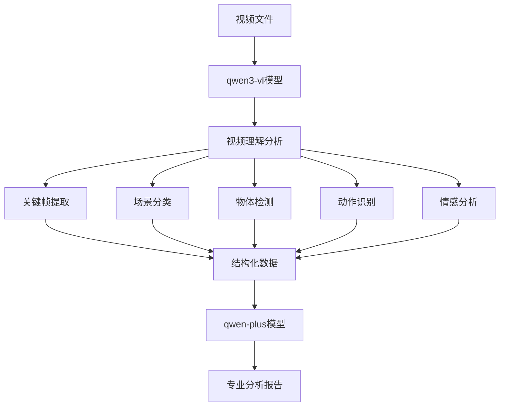
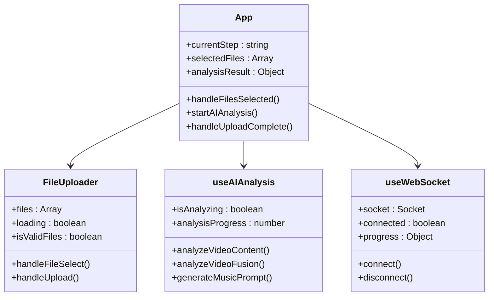
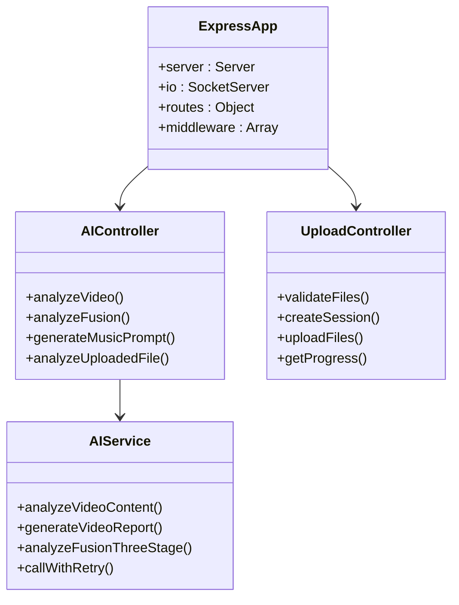
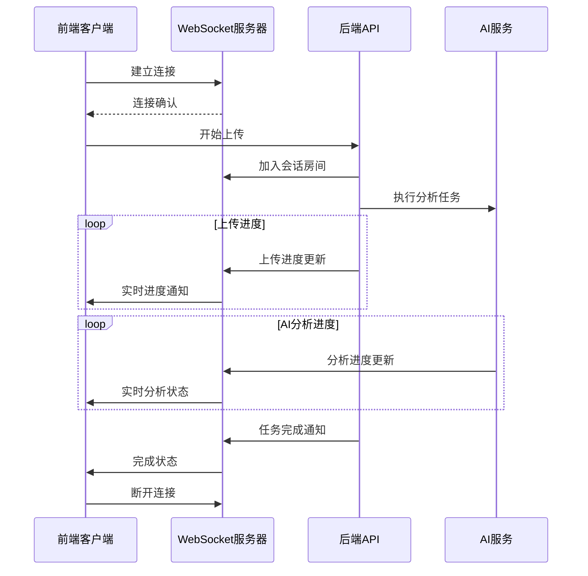
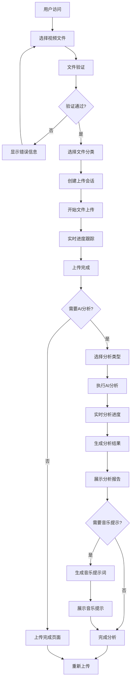
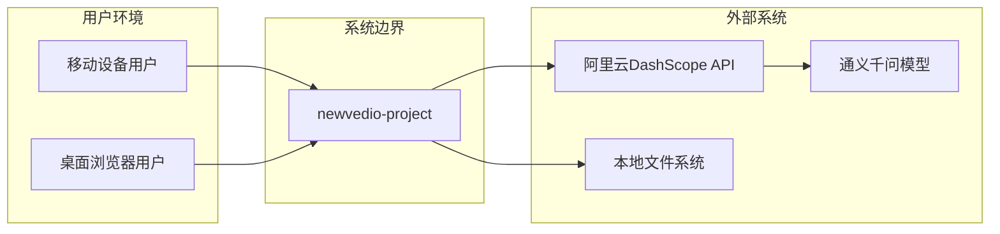

# 系统概述

<cite>
**本文档引用的文件**
- [app.js](file://backend/src/app.js)
- [main.js](file://frontend/src/main.js)
- [aiController.js](file://backend/src/controllers/aiController.js)
- [FileUploader.vue](file://frontend/src/components/FileUploader.vue)
- [aiService.js](file://backend/src/services/aiService.js)
- [useAIAnalysis.js](file://frontend/src/composables/useAIAnalysis.js)
- [App.vue](file://frontend/src/App.vue)
- [ai.js](file://backend/src/routes/ai.js)
- [upload.js](file://backend/src/routes/upload.js)
- [useWebSocket.js](file://frontend/src/composables/useWebSocket.js)
- [package.json](file://backend/package.json)
- [package.json](file://frontend/package.json)
- [project.md](file://openspec/project.md)
- [API.md](file://backend/API.md)
</cite>

## 目录
1. [项目简介](#项目简介)
2. [核心目标与愿景](#核心目标与愿景)
3. [系统架构概览](#系统架构概览)
4. [技术栈与设计原则](#技术栈与设计原则)
5. [AI智能分析能力](#ai智能分析能力)
6. [前后端分离架构](#前后端分离架构)
7. [实时通信机制](#实时通信机制)
8. [用户工作流程](#用户工作流程)
9. [系统上下文图](#系统上下文图)
10. [核心组件交互示意图](#核心组件交互示意图)
11. [技术决策与权衡](#技术决策与权衡)
12. [总结](#总结)

## 项目简介

newvedio-project是一个创新的全栈H5视频上传与AI智能分析平台，专为现代移动互联网环境设计。该项目采用前后端分离架构，集成了先进的AI视频分析能力，为用户提供从视频上传到智能分析的完整解决方案。

### 项目特色
- **响应式H5设计**：专为移动设备优化的用户体验
- **AI驱动分析**：集成通义千问AI模型的智能分析能力
- **实时进度反馈**：基于WebSocket的实时上传进度跟踪
- **多模态处理**：支持视频内容理解、融合分析和音乐提示生成
- **简洁实用**：专注于核心功能，避免过度设计

## 核心目标与愿景

### 核心目标
1. **简化视频处理流程**：为普通用户提供直观易用的视频上传和分析工具
2. **AI赋能内容创作**：通过智能分析帮助用户提升视频内容质量
3. **实时交互体验**：提供流畅的上传进度和分析结果反馈
4. **跨平台兼容性**：确保在各种移动设备上的良好性能

### 愿景
成为移动互联网时代最便捷的视频内容分析工具，让AI技术真正服务于普通用户的日常内容创作需求。

## 系统架构概览

newvedio-project采用现代化的前后端分离架构，遵循API First设计理念，确保系统的可扩展性和维护性。

```mermaid
graph TB
subgraph "前端层 (Vue.js)"
A[App.vue] --> B[FileUploader.vue]
A --> C[AIAnalysisProgress.vue]
A --> D[AnalysisResultDisplay.vue]
A --> E[useAIAnalysis.js]
F[useWebSocket.js] --> G[WebSocket连接]
end
subgraph "后端层 (Node.js/Express)"
H[app.js] --> I[路由层]
I --> J[控制器层]
J --> K[服务层]
K --> L[AI服务]
M[WebSocket服务器] --> N[Socket.IO]
end
subgraph "外部服务"
O[阿里云DashScope API]
P[通义千问VL模型]
Q[通义千问文本模型]
end
A < --> H
E --> F
K --> O
L --> P
L --> Q
G --> M
```

**架构图来源**
- [app.js](file://backend/src/app.js#L1-L166)
- [main.js](file://frontend/src/main.js#L1-L7)
- [App.vue](file://frontend/src/App.vue#L1-L682)

### 架构特点
- **分层设计**：清晰的职责分离，便于维护和扩展
- **API优先**：后端API先行开发，支持并行开发模式
- **微服务化思维**：AI服务独立封装，易于替换和升级
- **实时通信**：WebSocket实现实时进度反馈

**章节来源**
- [app.js](file://backend/src/app.js#L19-L134)
- [project.md](file://openspec/project.md#L40-L51)

## 技术栈与设计原则

### 前端技术栈
- **Vue.js 3**：采用Composition API，提供更好的逻辑复用和类型支持
- **Vite**：现代化构建工具，提供快速的开发体验
- **CSS Modules**：确保样式隔离，避免全局污染
- **TypeScript**：提供类型安全和更好的开发体验

### 后端技术栈
- **Node.js + Express**：轻量级Web框架，适合API服务
- **Socket.IO**：实现实时双向通信
- **Multer**：处理文件上传中间件
- **Winston**：结构化日志记录

### 设计原则
1. **简洁实用**：避免过度设计，专注于核心功能
2. **移动端优先**：响应式设计，适配各种移动设备
3. **用户友好**：直观的界面设计和清晰的错误提示
4. **性能优先**：优化加载时间和响应速度

**章节来源**
- [package.json](file://frontend/package.json#L1-L38)
- [package.json](file://backend/package.json#L1-L41)
- [project.md](file://openspec/project.md#L34-L46)

## AI智能分析能力

newvedio-project集成了强大的AI视频分析能力，基于阿里云通义千问模型系列，提供三个核心AI能力：

### 视频内容理解分析



**流程图来源**
- [aiService.js](file://backend/src/services/aiService.js#L417-L444)

### 融合方案设计

系统能够分析两个视频文件，生成专业的视频融合建议：

1. **内容兼容性分析**：评估视频内容的相似度和融合潜力
2. **技术对齐分析**：检查视频的技术参数匹配度
3. **分段策略设计**：提供精确到秒级的融合时间轴
4. **转场效果建议**：多种转场方案的详细说明

### 背景音乐提示生成

基于融合方案生成专业的音乐创作提示词：

1. **情感曲线设计**：音乐的情绪变化规划
2. **乐器配置**：主奏乐器和伴奏乐器的选择
3. **节奏设计**：与视频节奏相匹配的音乐节拍
4. **技术参数**：音乐制作的标准参数设置

**章节来源**
- [aiService.js](file://backend/src/services/aiService.js#L1-L672)
- [aiController.js](file://backend/src/controllers/aiController.js#L1-L237)

## 前后端分离架构

### 前端架构设计

前端采用Vue.js 3的Composition API，实现了模块化的组件架构：



**类图来源**
- [App.vue](file://frontend/src/App.vue#L183-L682)
- [FileUploader.vue](file://frontend/src/components/FileUploader.vue#L78-L304)
- [useAIAnalysis.js](file://frontend/src/composables/useAIAnalysis.js#L14-L448)

### 后端架构设计

后端采用经典的MVC架构模式：



**类图来源**
- [app.js](file://backend/src/app.js#L19-L134)
- [aiController.js](file://backend/src/controllers/aiController.js#L5-L237)
- [aiService.js](file://backend/src/services/aiService.js#L8-L672)

### API设计原则

系统采用RESTful API设计，遵循以下原则：

1. **统一的响应格式**：成功和错误响应的一致性
2. **适当的HTTP状态码**：语义化的状态码使用
3. **版本控制**：API版本管理
4. **错误处理**：详细的错误信息和解决方案建议

**章节来源**
- [ai.js](file://backend/src/routes/ai.js#L1-L71)
- [upload.js](file://backend/src/routes/upload.js#L1-L62)
- [API.md](file://backend/API.md#L1-L337)

## 实时通信机制

### WebSocket架构

系统采用Socket.IO实现实时通信，提供上传进度和分析状态的实时反馈：



**序列图来源**
- [app.js](file://backend/src/app.js#L113-L130)
- [useWebSocket.js](file://frontend/src/composables/useWebSocket.js#L21-L139)

### 实时功能特性

1. **上传进度跟踪**：实时显示文件上传进度
2. **分析状态更新**：AI分析过程中的状态反馈
3. **错误即时通知**：网络或服务异常的及时提醒
4. **连接状态管理**：自动重连和降级处理

### 降级策略

当WebSocket连接失败时，系统自动降级到HTTP轮询模式：

- **连接超时**：3秒内未建立连接则切换
- **网络异常**：自动重连机制
- **浏览器兼容**：支持多种传输协议

**章节来源**
- [useWebSocket.js](file://frontend/src/composables/useWebSocket.js#L21-L139)
- [app.js](file://backend/src/app.js#L113-L130)

## 用户工作流程

### 完整用户工作流



**流程图来源**
- [App.vue](file://frontend/src/App.vue#L183-L682)
- [FileUploader.vue](file://frontend/src/components/FileUploader.vue#L78-L304)
- [useAIAnalysis.js](file://frontend/src/composables/useAIAnalysis.js#L14-L448)

### 关键交互节点

1. **文件选择与验证**：支持拖拽上传和文件类型检查
2. **分类选择**：区分个人视频和景区视频
3. **上传进度**：实时显示上传状态和预计剩余时间
4. **AI分析选项**：提供内容分析、融合分析和音乐生成三种选择
5. **结果展示**：专业化的分析报告和建议

### 错误处理机制

系统实现了完善的错误处理机制：

- **文件验证错误**：格式、大小、数量限制检查
- **上传中断恢复**：网络异常时的断点续传
- **AI分析失败**：重试机制和降级处理
- **用户友好提示**：清晰的错误信息和解决方案

**章节来源**
- [FileUploader.vue](file://frontend/src/components/FileUploader.vue#L78-L304)
- [App.vue](file://frontend/src/App.vue#L183-L682)
- [useAIAnalysis.js](file://frontend/src/composables/useAIAnalysis.js#L14-L448)

## 系统上下文图



**上下文图来源**
- [project.md](file://openspec/project.md#L107-L131)

### 外部依赖关系

1. **AI服务依赖**：阿里云通义千问模型API
2. **存储依赖**：本地文件系统存储
3. **网络依赖**：稳定的互联网连接
4. **浏览器依赖**：支持ES6+和WebSocket的现代浏览器

## 核心组件交互示意图

### 数据流架构

```mermaid
graph TB
subgraph "前端数据流"
A[用户输入] --> B[文件验证]
B --> C[状态管理]
C --> D[API调用]
D --> E[WebSocket监听]
E --> F[实时更新]
end
subgraph "后端数据流"
G[文件上传] --> H[路由处理]
H --> I[控制器]
I --> J[服务层]
J --> K[AI分析]
K --> L[结果缓存]
L --> M[响应返回]
end
subgraph "实时通信"
N[Socket.IO] --> O[进度广播]
O --> P[状态同步]
end
D < --> G
F < --> N
M < --> E
```

**数据流图来源**
- [useAIAnalysis.js](file://frontend/src/composables/useAIAnalysis.js#L14-L448)
- [aiService.js](file://backend/src/services/aiService.js#L417-L672)
- [useWebSocket.js](file://frontend/src/composables/useWebSocket.js#L21-L139)

### 组件通信模式

1. **父子组件通信**：通过props和emit进行数据传递
2. **组合式函数通信**：useAIAnalysis和useWebSocket的状态共享
3. **全局状态管理**：Vuex-like的状态管理模式
4. **事件总线模式**：WebSocket事件的统一处理

**章节来源**
- [App.vue](file://frontend/src/App.vue#L183-L682)
- [useAIAnalysis.js](file://frontend/src/composables/useAIAnalysis.js#L14-L448)
- [aiService.js](file://backend/src/services/aiService.js#L417-L672)

## 技术决策与权衡

### API First开发模式

**决策依据**：
- 后端API先行开发，确保接口稳定性
- 支持前后端并行开发，提高开发效率
- 便于API文档的自动生成和维护

**权衡考虑**：
- 需要额外的时间投入进行API设计
- 前后端团队需要良好的沟通协调
- 但总体提高了项目的可维护性和扩展性

### MVC架构选择

**优势**：
- 清晰的职责分离，便于维护
- 易于单元测试和集成测试
- 支持大型团队协作开发

**权衡**：
- 对于小型项目可能显得过于复杂
- 需要更多的样板代码
- 但提供了良好的可扩展性基础

### WebSocket vs HTTP轮询

**WebSocket优势**：
- 实时性强，延迟低
- 减少不必要的网络请求
- 更好的用户体验

**降级策略**：
- 自动检测浏览器兼容性
- 优雅降级到HTTP轮询
- 保持功能完整性

### AI服务集成策略

**双模型协同**：
- qwen3-vl负责视频理解
- qwen-plus负责文本生成
- 确保输出质量和稳定性

**重试机制**：
- 指数退避算法
- 最大重试次数限制
- 错误信息丰富化

**章节来源**
- [project.md](file://openspec/project.md#L40-L51)
- [aiService.js](file://backend/src/services/aiService.js#L614-L672)
- [useWebSocket.js](file://frontend/src/composables/useWebSocket.js#L21-L139)

## 总结

newvedio-project代表了现代Web应用开发的最佳实践，成功地将传统文件上传功能与前沿AI技术相结合。通过精心设计的前后端分离架构、实时通信机制和AI智能分析能力，为用户提供了前所未有的视频处理体验。

### 核心价值

1. **技术创新**：将AI视频分析能力融入H5应用
2. **用户体验**：简洁直观的操作界面和实时反馈
3. **技术先进**：采用最新的Web技术和AI服务
4. **架构合理**：清晰的分层设计和良好的可扩展性

### 发展前景

随着AI技术的不断发展和用户需求的持续增长，newvedio-project具备良好的扩展基础，可以进一步集成更多AI能力，如视频编辑、字幕生成、内容推荐等功能，为用户提供更加智能化的视频处理解决方案。

这个项目不仅展示了技术实力，更重要的是体现了以用户为中心的设计理念，真正做到了让复杂的AI技术变得简单易用，让每个人都能享受到科技带来的便利。