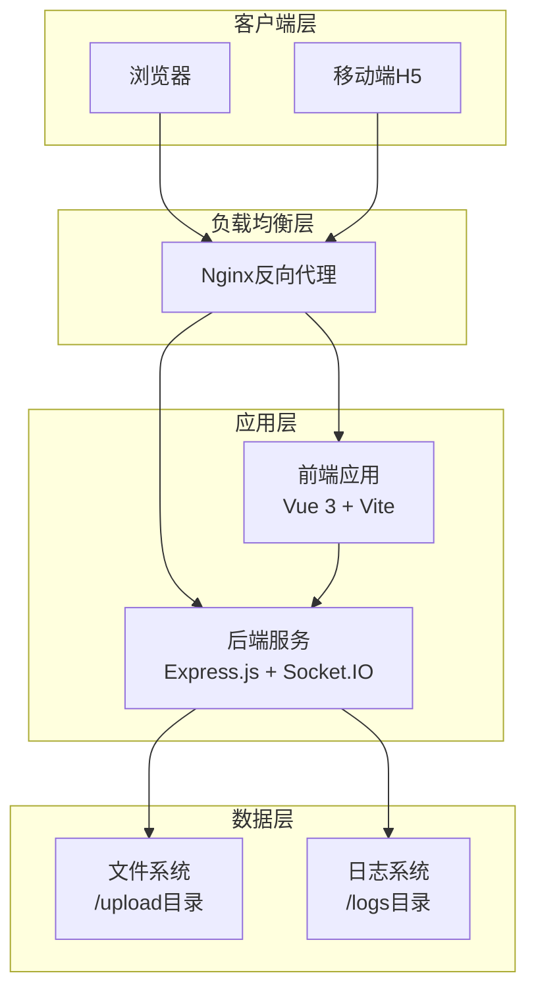

# 生产环境部署指南

<cite>
**本文档中引用的文件**
- [backend/package.json](file://backend/package.json)
- [frontend/package.json](file://frontend/package.json)
- [backend/src/app.js](file://backend/src/app.js)
- [frontend/vite.config.js](file://frontend/vite.config.js)
- [backend/src/utils/logger.js](file://backend/src/utils/logger.js)
- [backend/src/config/upload.js](file://backend/src/config/upload.js)
- [backend/API.md](file://backend/API.md)
- [frontend/src/composables/useWebSocket.js](file://frontend/src/composables/useWebSocket.js)
- [frontend/src/main.js](file://frontend/src/main.js)
</cite>

## 目录
1. [项目概述](#项目概述)
2. [系统架构](#系统架构)
3. [构建流程](#构建流程)
4. [Docker容器化部署](#docker容器化部署)
5. [Nginx反向代理配置](#nginx反向代理配置)
6. [PM2进程管理](#pm2进程管理)
7. [环境变量配置](#环境变量配置)
8. [日志管理](#日志管理)
9. [监控建议](#监控建议)
10. [故障排除](#故障排除)

## 项目概述

本项目是一个基于Vue 3和Express.js的视频文件上传系统，支持：
- 前端：Vue 3单页应用，使用Vite构建工具
- 后端：Express.js REST API，支持文件上传和WebSocket实时通信
- 核心功能：视频文件批量上传、AI分析、实时进度跟踪

### 技术栈
- **前端**：Vue 3, Vite, Socket.IO客户端
- **后端**：Node.js, Express.js, Socket.IO服务器
- **数据库**：本地文件系统存储
- **部署**：Docker容器化，Nginx反向代理

## 系统架构



**图表来源**
- [backend/src/app.js](file://backend/src/app.js#L1-L166)
- [frontend/vite.config.js](file://frontend/vite.config.js#L1-L33)

## 构建流程

### 前端构建

前端使用Vite进行构建，生成优化的静态文件。

#### 构建步骤
1. **安装依赖**
```bash
cd frontend
npm install
```

2. **执行构建**
```bash
npm run build
```

3. **构建输出**
- 输出目录：`frontend/dist/`
- 包含：HTML、CSS、JavaScript、图片等静态资源
- 支持生产环境优化（压缩、tree-shaking）

#### 构建配置要点
- **目标环境**：生产环境
- **输出目录**：`dist/`
- **资源路径**：自动处理相对路径
- **源码映射**：生产环境关闭

**章节来源**
- [frontend/package.json](file://frontend/package.json#L7-L10)
- [frontend/vite.config.js](file://frontend/vite.config.js#L18-L27)

### 后端构建

后端采用Node.js原生部署方式，无需额外编译。

#### 构建步骤
1. **安装依赖**
```bash
cd backend
npm install --production
```

2. **环境配置**
设置必要的环境变量（见环境变量配置章节）

3. **启动服务**
```bash
npm start
```

#### 关键配置
- **入口文件**：`src/app.js`
- **端口**：默认8005，可通过环境变量配置
- **依赖管理**：生产环境仅安装`dependencies`，不包含开发依赖

**章节来源**
- [backend/package.json](file://backend/package.json#L1-L41)
- [backend/src/app.js](file://backend/src/app.js#L1-L166)

## Docker容器化部署

### 多阶段Dockerfile

以下是推荐的Dockerfile配置，支持多阶段构建以优化镜像大小。

```dockerfile
# 构建阶段
FROM node:18-alpine AS builder

WORKDIR /app

# 复制package.json并安装依赖
COPY backend/package*.json ./
RUN npm ci --only=production

# 复制后端源码
COPY backend/src ./src

# 前端构建阶段
FROM node:18-alpine AS frontend-builder

WORKDIR /app

# 复制前端项目
COPY frontend/package*.json ./
RUN npm ci

COPY frontend .
RUN npm run build

# 最终镜像
FROM node:18-alpine

WORKDIR /app

# 安装运行时依赖
RUN apk add --no-cache dumb-init

# 复制构建产物
COPY --from=builder /app/node_modules ./node_modules
COPY --from=builder /app/src ./src
COPY --from=frontend-builder /app/dist ./dist

# 创建非root用户
RUN addgroup -g 1001 -S nodejs
RUN adduser -S nextjs -u 1001

# 设置权限
RUN chown -R nodejs:nodejs /app
USER nodejs

# 暴露端口
EXPOSE 8005

# 健康检查
HEALTHCHECK --interval=30s --timeout=3s --start-period=5s --retries=3 \
  CMD curl -f http://localhost:8005/health || exit 1

# 启动命令
CMD ["dumb-init", "node", "src/app.js"]
```

### Docker Compose配置

```yaml
version: '3.8'

services:
  video-upload:
    build:
      context: .
      target: production
    ports:
      - "8005:8005"
    volumes:
      - ./upload:/app/upload
      - ./logs:/app/logs
    environment:
      - NODE_ENV=production
      - PORT=8005
      - MAX_FILE_SIZE=500000000
      - UPLOAD_BASE_DIR=/app/upload
    restart: unless-stopped
    healthcheck:
      test: ["CMD", "curl", "-f", "http://localhost:8005/health"]
      interval: 30s
      timeout: 10s
      retries: 3
      start_period: 40s

  nginx:
    image: nginx:alpine
    ports:
      - "80:80"
      - "443:443"
    volumes:
      - ./upload:/app/upload:ro
      - ./logs:/app/logs:rw
      - ./nginx.conf:/etc/nginx/nginx.conf:ro
      - ./ssl:/etc/nginx/ssl:ro
    depends_on:
      - video-upload
    restart: unless-stopped
```

### 镜像优化策略

1. **多阶段构建**：分离构建环境和运行环境
2. **Alpine Linux**：使用轻量级基础镜像
3. **非root用户**：提高安全性
4. **健康检查**：确保容器健康状态
5. **资源限制**：可添加内存和CPU限制

## Nginx反向代理配置

### 基础配置

```nginx
# /etc/nginx/nginx.conf
user nginx;
worker_processes auto;
error_log /var/log/nginx/error.log warn;
pid /var/run/nginx.pid;

events {
    worker_connections 1024;
    use epoll;
    multi_accept on;
}

http {
    # 基本配置
    include /etc/nginx/mime.types;
    default_type application/octet-stream;
    
    # 日志格式
    log_format main '$remote_addr - $remote_user [$time_local] "$request" '
                    '$status $body_bytes_sent "$http_referer" '
                    '"$http_user_agent" "$http_x_forwarded_for"';
    
    access_log /var/log/nginx/access.log main;
    
    # 性能优化
    sendfile on;
    tcp_nopush on;
    tcp_nodelay on;
    keepalive_timeout 65;
    types_hash_max_size 2048;
    
    # Gzip压缩
    gzip on;
    gzip_vary on;
    gzip_min_length 1024;
    gzip_comp_level 6;
    gzip_proxied any;
    gzip_types
        text/plain
        text/css
        text/xml
        text/javascript
        application/javascript
        application/json
        application/xml+rss
        application/atom+xml
        application/xhtml+xml
        application/x-font-ttf
        image/svg+xml;
    
    # 虚拟主机配置
    server {
        listen 80;
        server_name your-domain.com;
        
        # 强制HTTPS
        return 301 https://$server_name$request_uri;
    }
    
    server {
        listen 443 ssl http2;
        server_name your-domain.com;
        
        # SSL配置
        ssl_certificate /etc/nginx/ssl/cert.pem;
        ssl_certificate_key /etc/nginx/ssl/key.pem;
        ssl_protocols TLSv1.2 TLSv1.3;
        ssl_ciphers ECDHE-RSA-AES256-GCM-SHA512:DHE-RSA-AES256-GCM-SHA512:ECDHE-RSA-AES256-GCM-SHA384:DHE-RSA-AES256-GCM-SHA384;
        ssl_prefer_server_ciphers off;
        ssl_session_cache shared:SSL:10m;
        ssl_session_timeout 10m;
        
        # 安全头
        add_header X-Frame-Options DENY;
        add_header X-Content-Type-Options nosniff;
        add_header X-XSS-Protection "1; mode=block";
        add_header Referrer-Policy "strict-origin-when-cross-origin";
        
        # 静态文件缓存
        location / {
            root /app/dist;
            try_files $uri $uri/ /index.html;
            expires 1y;
            add_header Cache-Control "public";
        }
        
        # API代理
        location /api/ {
            proxy_pass http://localhost:8005/;
            proxy_http_version 1.1;
            proxy_set_header Upgrade $http_upgrade;
            proxy_set_header Connection "upgrade";
            proxy_set_header Host $host;
            proxy_set_header X-Real-IP $remote_addr;
            proxy_set_header X-Forwarded-For $proxy_add_x_forwarded_for;
            proxy_set_header X-Forwarded-Proto $scheme;
            
            # 超时设置
            proxy_connect_timeout 60s;
            proxy_send_timeout 60s;
            proxy_read_timeout 60s;
            
            # 错误处理
            error_page 500 502 503 504 /50x.html;
            location = /50x.html {
                root /usr/share/nginx/html;
            }
        }
        
        # WebSocket升级
        location /socket.io/ {
            proxy_pass http://localhost:8005/socket.io/;
            proxy_http_version 1.1;
            proxy_set_header Upgrade $http_upgrade;
            proxy_set_header Connection "upgrade";
            proxy_set_header Host $host;
            proxy_set_header X-Real-IP $remote_addr;
            proxy_set_header X-Forwarded-For $proxy_add_x_forwarded_for;
            proxy_set_header X-Forwarded-Proto $scheme;
            
            # WebSocket超时设置
            proxy_connect_timeout 60s;
            proxy_send_timeout 60s;
            proxy_read_timeout 86400;
            proxy_buffering off;
        }
        
        # 文件上传代理
        location /upload/ {
            proxy_pass http://localhost:8005/upload/;
            proxy_http_version 1.1;
            proxy_set_header Upgrade $http_upgrade;
            proxy_set_header Connection "upgrade";
            proxy_set_header Host $host;
            proxy_set_header X-Real-IP $remote_addr;
            proxy_set_header X-Forwarded-For $proxy_add_x_forwarded_for;
            proxy_set_header X-Forwarded-Proto $scheme;
            
            # 大文件上传支持
            client_max_body_size 500M;
            client_body_buffer_size 128k;
            proxy_request_buffering off;
        }
        
        # 健康检查
        location /health {
            proxy_pass http://localhost:8005/health;
            proxy_http_version 1.1;
            proxy_set_header Host $host;
            proxy_set_header X-Real-IP $remote_addr;
            proxy_set_header X-Forwarded-For $proxy_add_x_forwarded_for;
            proxy_set_header X-Forwarded-Proto $scheme;
        }
    }
}
```

### WebSocket升级配置详解

Nginx需要特殊配置来支持WebSocket协议升级：

```nginx
# WebSocket升级配置
location /socket.io/ {
    proxy_pass http://localhost:8005/socket.io/;
    proxy_http_version 1.1;
    proxy_set_header Upgrade $http_upgrade;
    proxy_set_header Connection "upgrade";
    proxy_set_header Host $host;
    proxy_set_header X-Real-IP $remote_addr;
    proxy_set_header X-Forwarded-For $proxy_add_x_forwarded_for;
    proxy_set_header X-Forwarded-Proto $scheme;
    
    # WebSocket专用超时设置
    proxy_connect_timeout 60s;
    proxy_send_timeout 60s;
    proxy_read_timeout 86400;  # 24小时
    proxy_buffering off;
}
```

**章节来源**
- [backend/src/app.js](file://backend/src/app.js#L20-L30)
- [frontend/src/composables/useWebSocket.js](file://frontend/src/composables/useWebSocket.js#L30-L37)

## PM2进程管理

### PM2配置文件

创建`ecosystem.config.js`文件：

```javascript
module.exports = {
  apps: [{
    name: 'video-upload-app',
    script: './src/app.js',
    instances: 'max',
    exec_mode: 'cluster',
    env: {
      NODE_ENV: 'production',
      PORT: 8005,
      LOG_LEVEL: 'info'
    },
    env_production: {
      NODE_ENV: 'production',
      PORT: 8005,
      LOG_LEVEL: 'warn'
    },
    out_file: './logs/pm2-out.log',
    error_file: './logs/pm2-error.log',
    log_file: './logs/pm2-combined.log',
    time: true,
    merge_logs: true,
    max_memory_restart: '1G',
    node_args: '--max-old-space-size=1024',
    cron_restart: '0 2 * * *', // 每天凌晨2点重启
    autorestart: true,
    watch: false,
    min_uptime: '10s',
    max_restarts: 10,
    restart_delay: 4000,
    kill_timeout: 3000
  }]
};
```

### PM2部署脚本

```bash
#!/bin/bash
# deploy.sh

set -e

echo "开始部署视频上传应用..."

# 1. 构建前端
echo "构建前端..."
cd frontend
npm install
npm run build
cd ..

# 2. 构建后端
echo "构建后端..."
cd backend
npm install --production
cd ..

# 3. 停止现有进程
echo "停止现有进程..."
pm2 stop video-upload-app || true

# 4. 清理旧进程
echo "清理旧进程..."
pm2 delete video-upload-app || true

# 5. 启动新进程
echo "启动新进程..."
pm2 start ecosystem.config.js --env production

# 6. 设置开机自启
echo "设置开机自启..."
pm2 startup
pm2 save

# 7. 检查状态
echo "检查部署状态..."
pm2 list
pm2 logs video-upload-app --lines 50

echo "部署完成！"
```

### PM2监控命令

```bash
# 查看应用状态
pm2 status

# 查看日志
pm2 logs video-upload-app

# 监控性能
pm2 monit

# 重启应用
pm2 restart video-upload-app

# 停止应用
pm2 stop video-upload-app

# 删除应用
pm2 delete video-upload-app
```

## 环境变量配置

### 后端环境变量

创建`.env.production`文件：

```env
# 基本配置
NODE_ENV=production
PORT=8005

# 文件上传配置
MAX_FILE_SIZE=500000000          # 500MB
MAX_FILES_PER_SESSION=3
UPLOAD_BASE_DIR=/app/upload
CORS_ORIGIN=https://your-domain.com

# 安全配置
RATE_LIMIT_WINDOW=900000         # 15分钟
RATE_LIMIT_MAX=100

# 日志配置
LOG_LEVEL=warn
LOG_MAX_SIZE=10485760          # 10MB
LOG_MAX_FILES=10

# 数据库配置（如需）
# MONGODB_URI=mongodb://localhost:27017/video_upload
# REDIS_URL=redis://localhost:6379

# 第三方服务配置
OPENAI_API_KEY=your-api-key
AI_SERVICE_URL=https://api.openai.com/v1
```

### 前端环境变量

创建`.env.production`文件：

```env
# 基本配置
VITE_API_BASE_URL=https://your-domain.com/api
VITE_WS_BASE_URL=wss://your-domain.com

# 功能开关
VITE_FEATURE_AI_ANALYSIS=true
VITE_FEATURE_UPLOAD_PROGRESS=true

# 调试配置
VITE_DEBUG=false
VITE_LOG_LEVEL=warn

# CDN配置
VITE_CDN_URL=https://cdn.your-domain.com
```

### 环境变量安全

```bash
# 创建环境变量文件
cat > .env.production << EOF
NODE_ENV=production
PORT=8005
MAX_FILE_SIZE=500000000
UPLOAD_BASE_DIR=/app/upload
CORS_ORIGIN=https://your-domain.com
LOG_LEVEL=warn
EOF

# 设置文件权限
chmod 600 .env.production
chown root:root .env.production
```

**章节来源**
- [backend/src/config/upload.js](file://backend/src/config/upload.js#L1-L53)
- [backend/src/app.js](file://backend/src/app.js#L1-L166)

## 日志管理

### 后端日志配置

系统使用Winston日志库，支持多种传输方式：

```javascript
// 日志配置示例
const logger = winston.createLogger({
  level: process.env.LOG_LEVEL || 'info',
  format: winston.format.combine(
    winston.format.timestamp({
      format: 'YYYY-MM-DD HH:mm:ss'
    }),
    winston.format.errors({ stack: true }),
    winston.format.json()
  ),
  transports: [
    // 错误日志文件（最多5个5MB文件）
    new winston.transports.File({
      filename: path.join(__dirname, '../../logs/error.log'),
      level: 'error',
      maxsize: 5242880, // 5MB
      maxFiles: 5,
    }),
    // 综合日志文件（最多5个5MB文件）
    new winston.transports.File({
      filename: path.join(__dirname, '../../logs/combined.log'),
      maxsize: 5242880, // 5MB
      maxFiles: 5,
    })
  ],
});

// 开发环境添加控制台输出
if (process.env.NODE_ENV !== 'production') {
  logger.add(new winston.transports.Console({
    format: winston.format.combine(
      winston.format.colorize(),
      winston.format.simple()
    )
  }));
}
```

### 日志轮转配置

使用logrotate管理日志文件：

```bash
# /etc/logrotate.d/video-upload
/app/logs/*.log {
    daily
    missingok
    rotate 30
    compress
    delaycompress
    notifempty
    create 644 nodejs nodejs
    postrotate
        pm2 reloadLogs
    endscript
}
```

### 日志分析脚本

```bash
#!/bin/bash
# log-analyzer.sh

LOG_DIR="/app/logs"
DATE=$(date +%Y-%m-%d)

echo "=== 视频上传应用日志分析 (${DATE}) ==="
echo

# 错误统计
echo "错误统计:"
grep -c "error" "${LOG_DIR}/error.log" || echo "无错误记录"
echo

# 请求统计
echo "API请求统计:"
grep -E "\[INFO\].*GET|POST|PUT|DELETE" "${LOG_DIR}/combined.log" | wc -l
echo

# 性能指标
echo "性能指标:"
grep -E "\[INFO\].*upload-progress" "${LOG_DIR}/combined.log" | tail -10
echo

# 连接统计
echo "WebSocket连接统计:"
grep -c "Client connected" "${LOG_DIR}/combined.log" || echo "无连接记录"
```

**章节来源**
- [backend/src/utils/logger.js](file://backend/src/utils/logger.js#L1-L66)

## 监控建议

### 应用监控

#### 1. 健康检查端点

```javascript
// 健康检查实现
app.get('/health', (req, res) => {
  res.json({
    status: 'OK',
    timestamp: new Date().toISOString(),
    uptime: process.uptime(),
    memory: process.memoryUsage(),
    cpu: process.cpuUsage(),
    environment: process.env.NODE_ENV,
    version: process.version
  });
});
```

#### 2. 性能监控

```bash
#!/bin/bash
# monitor.sh

while true; do
    echo "$(date): 应用监控"
    
    # 内存使用
    MEMORY_USAGE=$(ps -o pid,ppid,cmd,%mem,%cpu --no-headers -p $(pgrep -f "node src/app.js") | awk '{print $4}')
    echo "内存使用: ${MEMORY_USAGE}%"
    
    # CPU使用
    CPU_USAGE=$(ps -o pid,ppid,cmd,%mem,%cpu --no-headers -p $(pgrep -f "node src.app.js") | awk '{print $5}')
    echo "CPU使用: ${CPU_USAGE}%"
    
    # 连接数
    CONNECTIONS=$(netstat -an | grep :8005 | wc -l)
    echo "连接数: ${CONNECTIONS}"
    
    # 磁盘空间
    DISK_USAGE=$(df -h /app | tail -1 | awk '{print $5}' | sed 's/%//')
    echo "磁盘使用: ${DISK_USAGE}%"
    
    echo "---"
    sleep 60
done
```

### 前端监控

```javascript
// 前端性能监控
if (window.performance) {
  window.addEventListener('load', () => {
    const perfData = window.performance.getEntriesByType('navigation')[0];
    
    // 页面加载时间
    console.log('页面加载时间:', perfData.loadEventEnd - perfData.fetchStart, 'ms');
    
    // DNS解析时间
    console.log('DNS解析时间:', perfData.domainLookupEnd - perfData.domainLookupStart, 'ms');
    
    // TCP连接时间
    console.log('TCP连接时间:', perfData.connectEnd - perfData.connectStart, 'ms');
  });
}
```

### 告警配置

```yaml
# alert-rules.yml
groups:
  - name: video-upload-alerts
    rules:
      - alert: HighMemoryUsage
        expr: nodejs_memory_usage_percentage > 80
        for: 5m
        labels:
          severity: warning
        annotations:
          summary: "应用内存使用率过高"
          description: "应用内存使用率超过80%，当前值: {{ $value }}%"
          
      - alert: HighCPUUsage
        expr: nodejs_cpu_usage_percentage > 70
        for: 5m
        labels:
          severity: warning
        annotations:
          summary: "应用CPU使用率过高"
          description: "应用CPU使用率超过70%，当前值: {{ $value }}%"
          
      - alert: ServiceDown
        expr: up{job="video-upload"} == 0
        for: 1m
        labels:
          severity: critical
        annotations:
          summary: "视频上传服务不可用"
          description: "视频上传服务已停止响应"
```

## 故障排除

### 常见问题及解决方案

#### 1. 文件上传失败

**症状**：文件上传过程中断或失败

**排查步骤**：
```bash
# 检查磁盘空间
df -h /app/upload

# 检查文件权限
ls -la /app/upload/

# 检查日志
tail -f /app/logs/error.log

# 检查网络连接
curl -I http://localhost:8005/health
```

**解决方案**：
```bash
# 清理临时文件
find /app/upload -name "*.tmp" -mtime +1 -delete

# 修复权限
chown -R nodejs:nodejs /app/upload
chmod -R 755 /app/upload
```

#### 2. WebSocket连接问题

**症状**：实时进度更新不工作

**排查步骤**：
```bash
# 检查Nginx配置
nginx -t

# 检查WebSocket连接
curl -i -N -H "Connection: Upgrade" \
     -H "Upgrade: websocket" \
     -H "Sec-WebSocket-Key: SGVsbG8sIHdvcmxkIQ==" \
     -H "Sec-WebSocket-Version: 13" \
     http://localhost:8005/socket.io/

# 检查防火墙
iptables -L | grep 8005
```

**解决方案**：
```nginx
# 确保WebSocket升级配置正确
location /socket.io/ {
    proxy_pass http://localhost:8005/socket.io/;
    proxy_http_version 1.1;
    proxy_set_header Upgrade $http_upgrade;
    proxy_set_header Connection "upgrade";
    proxy_set_header Host $host;
    proxy_set_header X-Real-IP $remote_addr;
    proxy_set_header X-Forwarded-For $proxy_add_x_forwarded_for;
    proxy_set_header X-Forwarded-Proto $scheme;
    
    # 增加超时时间
    proxy_read_timeout 86400s;
    proxy_connect_timeout 60s;
    proxy_send_timeout 60s;
}
```

#### 3. 性能问题

**症状**：响应缓慢或超时

**排查步骤**：
```bash
# 检查系统资源
top -p $(pgrep -f "node src/app.js")

# 检查网络延迟
ping localhost

# 检查数据库连接（如适用）
mongo --eval "db.stats()"
```

**解决方案**：
```bash
# 增加Node.js内存限制
export NODE_OPTIONS="--max-old-space-size=2048"

# 优化PM2配置
pm2 update
pm2 scale video-upload-app 4
```

### 调试工具

#### 1. 网络调试

```bash
#!/bin/bash
# network-debug.sh

echo "=== 网络调试信息 ==="

# 检查端口监听
echo "监听端口:"
netstat -tlnp | grep :8005

# 检查防火墙规则
echo "防火墙规则:"
iptables -L | grep 8005

# 检查DNS解析
echo "DNS解析:"
nslookup localhost

# 检查SSL证书
echo "SSL证书:"
openssl s_client -connect localhost:443 -servername localhost
```

#### 2. 应用调试

```javascript
// debug-middleware.js
const debugMiddleware = (req, res, next) => {
  console.log(`[${new Date().toISOString()}] ${req.method} ${req.url}`);
  console.log('Headers:', req.headers);
  console.log('Body:', req.body);
  
  const startTime = Date.now();
  res.on('finish', () => {
    const duration = Date.now() - startTime;
    console.log(`[${new Date().toISOString()}] ${req.method} ${req.url} ${res.statusCode} ${duration}ms`);
  });
  
  next();
};

// 在app.js中使用
if (process.env.NODE_ENV === 'development') {
  app.use(debugMiddleware);
}
```

**章节来源**
- [backend/src/app.js](file://backend/src/app.js#L74-L82)
- [backend/src/utils/logger.js](file://backend/src/utils/logger.js#L1-L66)

## 结论

本部署指南提供了完整的生产环境部署方案，涵盖了从构建到监控的各个环节。通过遵循本指南，您可以：

1. **稳定部署**：使用Docker容器化确保环境一致性
2. **高性能**：通过Nginx反向代理和WebSocket优化提升性能
3. **高可用**：使用PM2进程管理和健康检查确保服务稳定性
4. **可观测性**：完善的日志管理和监控体系
5. **可维护性**：清晰的故障排除和调试指南

建议定期更新部署脚本和监控配置，根据实际运行情况调整性能参数和安全策略。