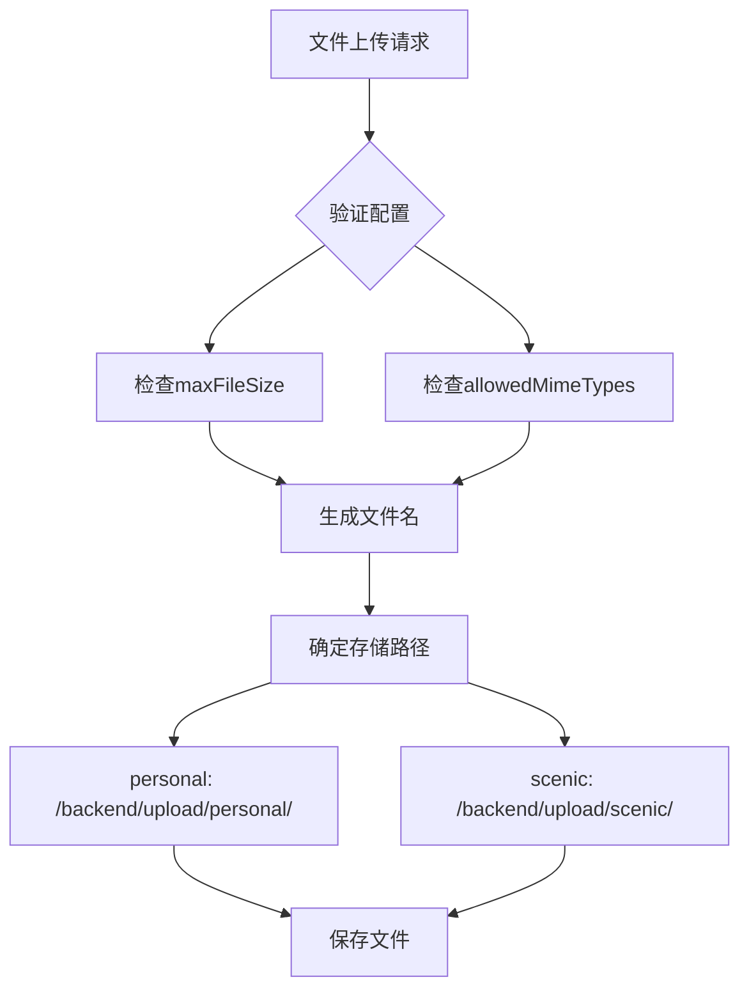
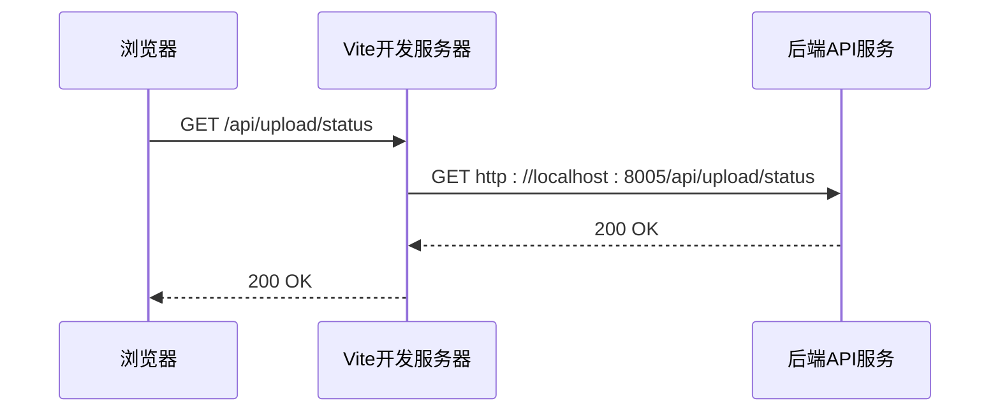
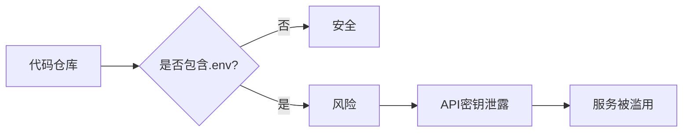
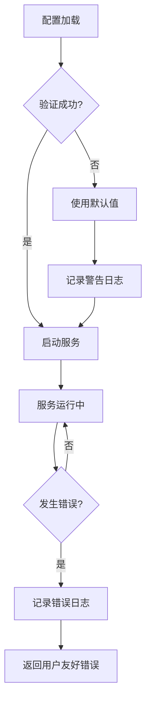

# 配置与环境

<cite>
**本文档引用的文件**  
- [upload.js](file://backend/src/config/upload.js)
- [vite.config.js](file://frontend/vite.config.js)
- [app.js](file://backend/src/app.js)
- [aiService.js](file://backend/src/services/aiService.js)
- [logger.js](file://backend/src/utils/logger.js)
- [useAIAnalysis.js](file://frontend/src/composables/useAIAnalysis.js)
</cite>

## 目录
1. [简介](#简介)
2. [后端文件上传配置](#后端文件上传配置)
3. [前端开发服务器配置](#前端开发服务器配置)
4. [敏感配置管理](#敏感配置管理)
5. [多环境配置策略](#多环境配置策略)
6. [配置验证与错误处理](#配置验证与错误处理)
7. [最佳实践总结](#最佳实践总结)

## 简介
本配置管理文档系统性地阐述了视频上传项目中的所有可配置项及其作用。文档重点分析了后端文件上传服务的存储路径、支持的MIME类型和文件大小限制等核心配置，以及前端开发服务器的代理设置和环境变量注入机制。同时，文档详细说明了敏感API密钥的安全管理方式，提供了开发、测试、生产等不同环境的配置示例，并介绍了配置验证和错误处理的最佳实践，为项目的稳定运行和安全部署提供全面指导。

## 后端文件上传配置

后端文件上传配置主要在 `backend/src/config/upload.js` 文件中定义，涵盖了服务器端口、文件限制、存储路径、安全设置等多个方面。

### 文件存储路径配置
文件上传服务使用 `uploadBaseDir` 配置项来确定基础存储目录。默认情况下，文件将存储在项目根目录下的 `upload` 文件夹中，具体路径为 `backend/upload`。该路径可以通过环境变量 `UPLOAD_BASE_DIR` 进行覆盖，以适应不同的部署需求。



**图示来源**  
- [upload.js](file://backend/src/config/upload.js#L19-L26)

### 支持的MIME类型
系统支持以下视频文件格式：
- `video/mp4`：标准MP4视频格式
- `video/avi` 和 `video/x-msvideo`：AVI视频格式

这些MIME类型在 `allowedMimeTypes` 数组中定义，同时通过 `allowedExtensions` 配置项支持 `.mp4` 和 `.avi` 文件扩展名。

### 最大文件大小限制
系统通过 `maxFileSize` 配置项限制单个文件的大小，其默认值为300MB（300 * 1024 * 1024字节）。此值可以通过环境变量 `MAX_FILE_SIZE` 进行动态调整。此外，系统还通过 `maxFilesPerSession` 配置项限制每个会话最多上传3个文件。

**本节来源**  
- [upload.js](file://backend/src/config/upload.js#L7-L18)

## 前端开发服务器配置

前端开发服务器的配置在 `frontend/vite.config.js` 文件中定义，主要涉及开发服务器端口、代理设置和路径别名等功能。

### 代理设置（解决跨域）
为了在开发环境中解决前端（运行在3005端口）与后端API（运行在8005端口）之间的跨域问题，Vite配置了代理规则。所有以 `/api` 开头的请求都会被代理到 `http://localhost:8005`，即后端服务器地址。



**图示来源**  
- [vite.config.js](file://frontend/vite.config.js#L10-L15)

### 环境变量注入机制
Vite通过 `import.meta.env` 对象提供环境变量注入功能。前端代码中可以通过 `import.meta.env.VITE_API_BASE` 访问自定义的环境变量。如果该变量未设置，则使用默认值 `http://localhost:8005` 作为API基础URL。

**本节来源**  
- [vite.config.js](file://frontend/vite.config.js#L5-L17)
- [useAIAnalysis.js](file://frontend/src/composables/useAIAnalysis.js#L24-L25)

## 敏感配置管理

项目中的敏感配置，如API密钥，需要通过安全的方式进行管理，避免泄露。

### 敏感配置项
项目中涉及以下敏感配置：
- `DASHSCOPE_API_KEY`：用于访问通义千问AI服务的API密钥
- `MUREKA_API_SECRET`：用于访问Mureka服务的API密钥（在代码中未直接出现，但根据文档要求提及）

这些密钥在 `aiService.js` 中被用于初始化AI服务客户端。

### .env文件管理
推荐使用 `.env` 文件来管理敏感配置。项目根目录下应创建 `.env` 文件，并将敏感信息写入其中：
```
DASHSCOPE_API_KEY=your_actual_api_key_here
MUREKA_API_SECRET=your_actual_secret_here
```

同时，必须在 `.gitignore` 文件中添加 `.env`，确保敏感信息不会被提交到版本控制系统中。



**图示来源**  
- [aiService.js](file://backend/src/services/aiService.js#L10-L11)
- [app.js](file://backend/src/app.js#L1-L2)

**本节来源**  
- [aiService.js](file://backend/src/services/aiService.js#L10-L17)

## 多环境配置策略

项目支持通过环境变量在不同环境中使用不同的配置。

### 环境变量配置
系统通过 `process.env.NODE_ENV` 环境变量来区分不同环境。常见的环境包括：
- `development`：开发环境
- `test`：测试环境
- `production`：生产环境

### 不同环境的配置示例
**开发环境 (.env.development)**
```
NODE_ENV=development
PORT=8005
CORS_ORIGIN=http://localhost:3005
DASHSCOPE_API_KEY=dev_api_key_123
LOG_LEVEL=debug
```

**测试环境 (.env.test)**
```
NODE_ENV=test
PORT=8006
CORS_ORIGIN=http://localhost:3006
DASHSCOPE_API_KEY=test_api_key_456
LOG_LEVEL=info
```

**生产环境 (.env.production)**
```
NODE_ENV=production
PORT=80
CORS_ORIGIN=https://yourdomain.com
DASHSCOPE_API_KEY=prod_api_key_789
LOG_LEVEL=warn
```

### 环境变量覆盖机制
配置系统采用"环境变量优先"的原则。以端口配置为例：
```javascript
port: process.env.PORT || 8005
```
这意味着系统会首先尝试从环境变量 `PORT` 中读取值，如果未设置，则使用默认值8005。这种机制允许在不修改代码的情况下，通过设置环境变量来覆盖默认配置。

**本节来源**  
- [upload.js](file://backend/src/config/upload.js#L5-L6)
- [logger.js](file://backend/src/utils/logger.js#L18-L19)
- [app.js](file://backend/src/app.js#L30-L31)

## 配置验证与错误处理

系统实现了多层次的配置验证和错误处理机制，确保服务的稳定性和可靠性。

### 配置验证
系统在启动时会自动验证关键配置：
- 通过 `fs.ensureDirSync` 确保上传目录存在
- 通过 `parseInt` 确保数值型配置的正确性
- 通过默认值机制确保关键配置不会为空

### 错误处理最佳实践
1. **日志记录**：使用Winston日志库记录不同级别的日志，便于问题排查
2. **用户友好错误**：对用户显示简洁明了的错误信息，而详细错误信息仅记录在日志中
3. **优雅降级**：当非关键功能失败时（如结果保存），不影响主流程的执行



**图示来源**  
- [app.js](file://backend/src/app.js#L64-L72)
- [logger.js](file://backend/src/utils/logger.js#L18-L46)

**本节来源**  
- [app.js](file://backend/src/app.js#L92-L102)
- [logger.js](file://backend/src/utils/logger.js#L1-L66)

## 最佳实践总结
1. **始终使用.env文件管理敏感信息**，并将其加入 `.gitignore`
2. **为所有关键配置提供合理的默认值**，确保服务在缺少环境变量时仍能运行
3. **在不同环境中使用不同的.env文件**，如 `.env.development`、`.env.production`
4. **通过环境变量而非代码来区分不同环境的配置**
5. **实现配置验证和错误处理**，确保系统的健壮性
6. **在日志中避免记录敏感信息**，防止信息泄露
7. **定期审查和更新配置管理策略**，适应项目发展需求

**本节来源**  
- [app.js](file://backend/src/app.js#L1-L166)
- [upload.js](file://backend/src/config/upload.js#L1-L53)
- [vite.config.js](file://frontend/vite.config.js#L1-L33)