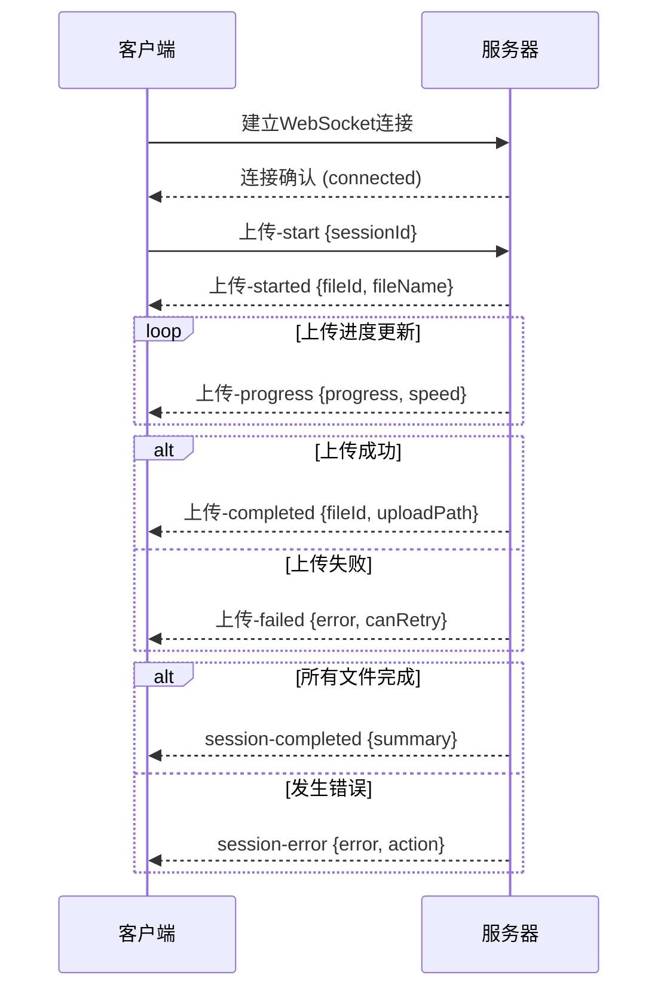

# WebSocket API 合约文档

**Version**: 1.0.0
**Created**: 2025-11-14
**Feature**: 响应式H5文件上传页面实时通信

## 概述

WebSocket API为文件上传提供实时进度更新和状态通知，确保用户能够获得即时的上传反馈。

## 连接信息

### 连接地址
```
ws://localhost:3000/socket.io
wss://api.example.com/socket.io (生产环境)
```

### 连接参数
- `sessionId`: 上传会话ID (必需)
- `clientType`: 客户端类型 (web/mobile)

```javascript
const socket = io('ws://localhost:3000', {
  query: {
    sessionId: '550e8400-e29b-41d4-a716-446655440000',
    clientType: 'web'
  }
});
```

## 事件类型

### 客户端发送事件

#### 1. `upload-start`
开始上传会话

```typescript
interface UploadStartEvent {
  sessionId: string;
  fileIds: string[];
  category: 'personal' | 'scenic';
}

// 示例
socket.emit('upload-start', {
  sessionId: '550e8400-e29b-41d4-a716-446655440000',
  fileIds: ['file-1', 'file-2', 'file-3'],
  category: 'personal'
});
```

#### 2. `upload-progress`
手动更新文件进度(通常由服务器推送，客户端也可请求)

```typescript
interface UploadProgressEvent {
  sessionId: string;
  fileId: string;
  progress?: number;
  requestUpdate?: boolean;
}

// 示例
socket.emit('upload-progress', {
  sessionId: '550e8400-e29b-41d4-a716-446655440000',
  fileId: 'file-1',
  requestUpdate: true
});
```

#### 3. `upload-cancel`
取消文件上传

```typescript
interface UploadCancelEvent {
  sessionId: string;
  fileId?: string; // 可选，不指定则取消整个会话
  reason?: string;
}

// 示例
socket.emit('upload-cancel', {
  sessionId: '550e8400-e29b-41d4-a716-446655440000',
  fileId: 'file-1',
  reason: '用户主动取消'
});
```

#### 4. `upload-pause`
暂停文件上传

```typescript
interface UploadPauseEvent {
  sessionId: string;
  fileId?: string;
  reason?: string;
}

// 示例
socket.emit('upload-pause', {
  sessionId: '550e8400-e29b-41d4-a716-446655440000',
  fileId: 'file-1'
});
```

#### 5. `upload-resume`
恢复文件上传

```typescript
interface UploadResumeEvent {
  sessionId: string;
  fileId?: string;
}

// 示例
socket.emit('upload-resume', {
  sessionId: '550e8400-e29b-41d4-a716-446655440000',
  fileId: 'file-1'
});
```

### 服务器推送事件

#### 1. `upload-progress`
实时进度更新

```typescript
interface ProgressUpdateEvent {
  sessionId: string;
  fileId: string;
  progress: number;
  speed: number;
  uploadedBytes: number;
  totalBytes: number;
  estimatedTimeRemaining: number;
  timestamp: string;
}

// 示例
socket.on('upload-progress', (data) => {
  console.log(`文件 ${data.fileId} 进度: ${data.progress}%`);
  console.log(`上传速度: ${data.speed} bytes/s`);
  console.log(`预估剩余时间: ${data.estimatedTimeRemaining} 秒`);
});
```

#### 2. `upload-started`
文件开始上传

```typescript
interface UploadStartedEvent {
  sessionId: string;
  fileId: string;
  fileName: string;
  fileSize: number;
  startTime: string;
}

// 示例
socket.on('upload-started', (data) => {
  console.log(`文件 ${data.fileName} 开始上传`);
});
```

#### 3. `upload-completed`
文件上传完成

```typescript
interface UploadCompletedEvent {
  sessionId: string;
  fileId: string;
  fileName: string;
  fileSize: number;
  uploadPath: string;
  endTime: string;
  duration: number;
  finalSpeed: number;
}

// 示例
socket.on('upload-completed', (data) => {
  console.log(`文件 ${data.fileName} 上传完成`);
  console.log(`存储路径: ${data.uploadPath}`);
  console.log(`上传耗时: ${data.duration} 秒`);
});
```

#### 4. `upload-failed`
文件上传失败

```typescript
interface UploadFailedEvent {
  sessionId: string;
  fileId: string;
  fileName: string;
  error: {
    code: string;
    message: string;
    details?: string;
  };
  failedAt: string;
  canRetry: boolean;
  retryCount: number;
  maxRetries: number;
}

// 示例
socket.on('upload-failed', (data) => {
  console.log(`文件 ${data.fileName} 上传失败: ${data.error.message}`);
  if (data.canRetry) {
    console.log(`可以重试，当前重试次数: ${data.retryCount}/${data.maxRetries}`);
  }
});
```

#### 5. `upload-cancelled`
上传被取消

```typescript
interface UploadCancelledEvent {
  sessionId: string;
  fileId?: string;
  reason: string;
  cancelledAt: string;
  uploadedBytes: number;
}

// 示例
socket.on('upload-cancelled', (data) => {
  console.log(`上传被取消: ${data.reason}`);
  console.log(`已上传: ${data.uploadedBytes} bytes`);
});
```

#### 6. `session-completed`
整个上传会话完成

```typescript
interface SessionCompletedEvent {
  sessionId: string;
  summary: {
    totalFiles: number;
    completedFiles: number;
    failedFiles: number;
    cancelledFiles: number;
    totalSize: number;
    uploadedSize: number;
    averageSpeed: number;
    totalTime: number;
  };
  endTime: string;
  uploadPaths: string[];
}

// 示例
socket.on('session-completed', (data) => {
  console.log(`上传会话 ${data.sessionId} 完成`);
  console.log(`成功上传: ${data.summary.completedFiles}/${data.summary.totalFiles} 个文件`);
  console.log(`总大小: ${data.formatBytes(data.summary.uploadedSize)}`);
});
```

#### 7. `session-error`
会话级错误

```typescript
interface SessionErrorEvent {
  sessionId: string;
  error: {
    code: string;
    message: string;
    details?: string;
  };
  action: 'stop' | 'pause' | 'continue';
  affectedFiles: string[];
  timestamp: string;
}

// 示例
socket.on('session-error', (data) => {
  console.log(`会话错误: ${data.error.message}`);
  console.log(`建议操作: ${data.action}`);
  if (data.affectedFiles.length > 0) {
    console.log(`影响文件: ${data.affectedFiles.join(', ')}`);
  }
});
```

#### 8. `connection-status`
连接状态通知

```typescript
interface ConnectionStatusEvent {
  status: 'connected' | 'disconnected' | 'reconnecting' | 'error';
  message?: string;
  retryCount?: number;
  maxRetries?: number;
}

// 示例
socket.on('connection-status', (data) => {
  console.log(`连接状态: ${data.status}`);
  if (data.message) {
    console.log(`状态信息: ${data.message}`);
  }
});
```

## 错误处理

### 错误事件格式

```typescript
interface SocketError {
  event: string;
  error: {
    code: string;
    message: string;
    details?: any;
  };
  timestamp: string;
  requestId?: string;
}
```

### 常见错误代码

| 错误代码 | 描述 | 处理建议 |
|---------|------|----------|
| `SESSION_NOT_FOUND` | 会话不存在 | 重新创建会话 |
| `INVALID_SESSION` | 无效会话 | 检查会话ID格式 |
| `FILE_NOT_FOUND` | 文件不存在 | 检查文件ID |
| `UPLOAD_NOT_STARTED` | 上传未开始 | 检查上传状态 |
| `UPLOAD_ALREADY_COMPLETED` | 上传已完成 | 无需重复操作 |
| `INSUFFICIENT_PERMISSIONS` | 权限不足 | 检查用户权限 |
| `RATE_LIMIT_EXCEEDED` | 频率限制 | 降低请求频率 |
| `CONNECTION_TIMEOUT` | 连接超时 | 检查网络连接 |

## 连接生命周期

### 连接流程图



### 重连机制

```javascript
// 客户端重连配置
const socket = io('ws://localhost:3000', {
  reconnection: true,
  reconnectionAttempts: 5,
  reconnectionDelay: 1000,
  reconnectionDelayMax: 5000,
  timeout: 20000
});

// 监听重连事件
socket.on('reconnecting', (attemptNumber) => {
  console.log(`正在重连，第 ${attemptNumber} 次尝试...`);
});

socket.on('reconnect', (attemptNumber) => {
  console.log(`重连成功，尝试次数: ${attemptNumber}`);
});

socket.on('reconnect_failed', () => {
  console.log('重连失败，请检查网络连接');
});
```

## 性能考虑

### 节流策略

```typescript
// 服务器端进度更新节流
const THROTTLE_INTERVAL = 500; // 500ms发送一次进度更新
const MIN_PROGRESS_CHANGE = 1; // 最小进度变化1%

class ProgressThrottler {
  private lastProgress: Map<string, number> = new Map();
  private lastUpdate: Map<string, number> = new Map();

  shouldUpdate(sessionId: string, fileId: string, progress: number): boolean {
    const now = Date.now();
    const lastUpdate = this.lastUpdate.get(`${sessionId}_${fileId}`) || 0;
    const lastProgress = this.lastProgress.get(`${sessionId}_${fileId}`) || 0;

    return (
      now - lastUpdate > THROTTLE_INTERVAL &&
      Math.abs(progress - lastProgress) >= MIN_PROGRESS_CHANGE
    );
  }
}
```

### 内存管理

```typescript
// 会话清理策略
class SessionManager {
  private sessions: Map<string, SessionData> = new Map();
  private readonly SESSION_TIMEOUT = 30 * 60 * 1000; // 30分钟

  cleanup() {
    const now = Date.now();
    for (const [sessionId, session] of this.sessions.entries()) {
      if (now - session.lastActivity > this.SESSION_TIMEOUT) {
        this.sessions.delete(sessionId);
        this.notifySessionTimeout(sessionId);
      }
    }
  }
}
```

## 测试用例

### 单元测试示例

```typescript
// 测试进度更新事件
describe('WebSocket Progress Events', () => {
  test('should receive progress updates', (done) => {
    const socket = createTestSocket();

    socket.on('upload-progress', (data) => {
      expect(data.progress).toBeGreaterThanOrEqual(0);
      expect(data.progress).toBeLessThanOrEqual(100);
      expect(data.speed).toBeGreaterThan(0);
      done();
    });

    socket.emit('upload-start', {
      sessionId: 'test-session',
      fileIds: ['test-file'],
      category: 'personal'
    });
  });
});
```

### 集成测试示例

```typescript
// 测试完整的上传流程
describe('Complete Upload Flow', () => {
  test('should handle full upload lifecycle', async () => {
    const socket = createTestSocket();
    const sessionId = await createUploadSession();

    let progressReceived = false;
    let completedReceived = false;

    socket.on('upload-progress', () => {
      progressReceived = true;
    });

    socket.on('upload-completed', () => {
      completedReceived = true;
    });

    await simulateFileUpload(sessionId, 'test-file.mp4');

    expect(progressReceived).toBe(true);
    expect(completedReceived).toBe(true);
  });
});
```

## 监控和日志

### 连接监控

```typescript
// 连接统计
interface ConnectionStats {
  totalConnections: number;
  activeConnections: number;
  sessionsInProgress: number;
  averageSessionDuration: number;
  errorsPerHour: number;
}

// 日志格式
interface LogEntry {
  timestamp: string;
  level: 'info' | 'warn' | 'error';
  event: string;
  sessionId?: string;
  fileId?: string;
  data?: any;
  userId?: string;
}
```

### 性能指标

```typescript
// 关键性能指标
interface PerformanceMetrics {
  // 连接指标
  connectionLatency: number;
  reconnectionRate: number;
  messageThroughput: number;

  // 上传指标
  averageUploadSpeed: number;
  uploadSuccessRate: number;
  errorRecoveryTime: number;

  // 系统指标
  memoryUsage: number;
  cpuUsage: number;
  activeSessions: number;
}
```