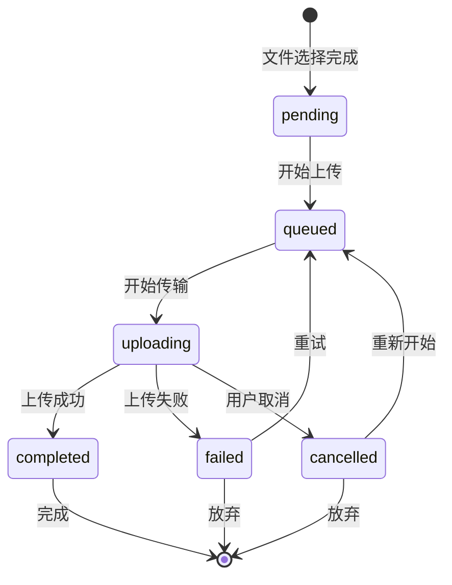
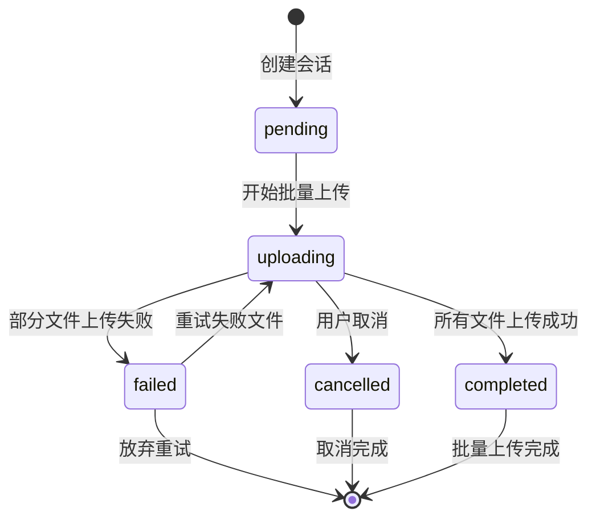

# Data Model: 响应式H5文件上传页面

**Created**: 2025-11-14
**Feature**: 响应式H5文件上传页面
**Technology Stack**: Vue.js 3 + Node.js + Express.js

## Core Entities

### 1. FileUpload

文件上传实体，代表单个文件的上传状态和元数据。

```typescript
interface FileUpload {
  // 基础属性
  id: string;                    // UUID - 唯一标识符
  sessionId: string;             // 关联的批量上传会话ID
  originalName: string;          // 用户原始文件名
  fileName: string;              // 存储文件名 (UUID重命名)
  filePath: string;              // 完整文件路径
  fileSize: number;              // 文件大小 (bytes)
  fileType: 'mp4' | 'avi';       // 文件类型

  // 上传状态
  uploadStatus: 'pending' | 'uploading' | 'completed' | 'failed' | 'cancelled' | 'queued';
  uploadProgress: number;        // 上传进度 (0-100)
  uploadSpeed: number;           // 上传速度 (bytes/s)
  uploadStartTime?: Date;        // 上传开始时间
  uploadEndTime?: Date;          // 上传结束时间

  // 错误处理
  errorMessage?: string;         // 错误信息
  errorCode?: string;            // 错误代码
  retryCount: number;            // 重试次数

  // 文件验证
  isValidFormat: boolean;        // 格式是否有效
  isValidSize: boolean;          // 大小是否有效

  // 系统字段
  createdAt: Date;               // 创建时间
  updatedAt: Date;               // 更新时间
}
```

### 2. BatchUploadSession

批量上传会话实体，管理一次上传操作中的所有文件。

```typescript
interface BatchUploadSession {
  // 会话标识
  sessionId: string;             // UUID - 会话唯一标识符
  userId?: string;               // 用户ID (可选，为后续扩展预留)

  // 文件管理
  files: FileUpload[];           // 文件列表 (最多3个)
  maxFiles: number;              // 最大文件数 (3)
  allowedTypes: ('mp4' | 'avi')[]; // 允许的文件类型

  // 批次类型
  batchType: 'mp4' | 'avi' | 'mixed'; // 批次类型 (必须同类型)
  category: 'personal' | 'scenic';    // 文件分类

  // 存储信息
  uploadPath: string;            // 上传路径 (/backend/upload/personal/ 或 /backend/upload/scenic/)

  // 会话状态
  overallStatus: 'pending' | 'uploading' | 'completed' | 'failed' | 'cancelled';
  totalProgress: number;         // 总体进度 (0-100)
  completedFiles: number;        // 已完成文件数
  failedFiles: number;           // 失败文件数

  // 时间信息
  sessionStartTime: Date;        // 会话开始时间
  sessionEndTime?: Date;         // 会话结束时间
  estimatedDuration?: number;    // 预估完成时间 (seconds)

  // 系统字段
  createdAt: Date;               // 创建时间
  updatedAt: Date;               // 更新时间
}
```

### 3. FileCategory

文件分类实体，定义文件分类和对应的存储路径。

```typescript
interface FileCategory {
  categoryId: 'personal' | 'scenic'; // 分类ID
  categoryName: string;              // 分类显示名称
  categoryDescription: string;       // 分类描述
  uploadPath: string;                // 对应上传目录路径
  allowedMaxSize: number;            // 该分类最大文件大小 (bytes)
  allowedExtensions: string[];       // 允许的文件扩展名

  // 访问控制
  isPublic: boolean;                 // 是否公开访问
  requiresAuth: boolean;             // 是否需要认证

  // 系统字段
  createdAt: Date;                   // 创建时间
  updatedAt: Date;                   // 更新时间
}
```

### 4. UserInterface

用户界面状态实体，管理前端界面状态和用户交互。

```typescript
interface UserInterface {
  // 界面状态
  currentStep: 'selection' | 'category' | 'uploading' | 'completed';
  isDragging: boolean;               // 是否正在拖拽

  // 对话框状态
  showCategoryDialog: boolean;       // 是否显示分类选择对话框
  showErrorDialog: boolean;          // 是否显示错误对话框
  showSuccessDialog: boolean;        // 是否显示成功对话框

  // 错误信息
  currentError: {
    code: string;
    message: string;
    details?: string;
    solution?: string;
  } | null;

  // 进度信息
  showProgress: boolean;             // 是否显示进度
  progressAnimation: 'smooth' | 'stepped'; // 进度动画类型

  // 用户偏好
  rememberCategory: boolean;         // 是否记住分类选择
  autoRetry: boolean;                // 是否自动重试失败文件

  // 系统字段
  lastActivity: Date;                // 最后活动时间
}
```

## State Management

### State Transitions

#### FileUpload State Machine



#### BatchUploadSession State Machine



### Data Validation Rules

#### File Validation

```typescript
interface FileValidationRules {
  // 文件类型验证
  allowedMimeTypes: [
    'video/mp4',
    'video/avi',
    'video/x-msvideo'  // .avi文件的MIME类型
  ];

  allowedExtensions: ['.mp4', '.avi'];

  // 文件大小验证
  maxFileSize: 300 * 1024 * 1024; // 300MB
  minFileSize: 1;                  // 1 byte

  // 文件数量验证
  maxFilesPerSession: 3;
  minFilesPerSession: 1;

  // 批次类型验证
  requireSameType: true;            // 同批次必须是同类型

  // 文件名验证
  fileNamePattern: /^[a-zA-Z0-9._-]+$/;
  maxFileNameLength: 255;
}
```

#### Category Validation

```typescript
interface CategoryValidationRules {
  // 分类枚举
  allowedCategories: ['personal', 'scenic'];

  // 路径验证
  pathPattern: /^\/upload\/(personal|scenic)\/.+$/;

  // 权限验证
  validPermissions: ['read', 'write', 'delete'];
}
```

## Data Storage Strategy

### In-Memory Storage (Runtime)

```typescript
// 存储当前活跃的上传会话
interface ActiveSessions {
  [sessionId: string]: BatchUploadSession;
}

// 存储文件上传进度
interface UploadProgress {
  [fileId: string]: {
    progress: number;
    speed: number;
    lastUpdate: Date;
  };
}
```

### File System Storage

```
/upload/
├── personal/
│   ├── 2025/
│   │   ├── 11/
│   │   │   ├── [user-id]/
│   │   │   │   ├── [sessionId]_[timestamp]_[originalName].mp4
│   │   │   │   └── metadata.json
│   │   │   └── temp/
│   │   │       ├── [sessionId]_[fileId].tmp
│   │   │       └── .gitkeep
├── scenic/
│   ├── 2025/
│   │   ├── 11/
│   │   │   ├── [location-id]/
│   │   │   │   ├── [sessionId]_[timestamp]_[originalName].avi
│   │   │   │   └── metadata.json
│   │   │   └── temp/
│   │   │       ├── [sessionId]_[fileId].tmp
│   │   │       └── .gitkeep
└── .gitkeep
```

### Metadata Storage

```typescript
interface FileMetadata {
  id: string;
  sessionId: string;
  originalName: string;
  storedName: string;
  category: 'personal' | 'scenic';
  uploadPath: string;
  fileSize: number;
  fileType: string;
  uploadedAt: Date;
  ipAddress?: string;
  userAgent?: string;
}
```

## API Data Contracts

### Request/Response Formats

#### File Upload Request

```typescript
interface FileUploadRequest {
  files: File[];                     // HTML5 File objects
  category: 'personal' | 'scenic';
  sessionId: string;
}

interface FileUploadResponse {
  success: boolean;
  sessionId: string;
  files: {
    id: string;
    originalName: string;
    status: string;
    message?: string;
  }[];
}
```

#### Progress Update Request

```typescript
interface ProgressUpdateEvent {
  sessionId: string;
  fileId: string;
  progress: number;
  speed: number;
  status: string;
  error?: {
    code: string;
    message: string;
  };
}
```

## Security Considerations

### Data Sanitization

```typescript
interface SanitizationRules {
  // 文件名清理
  fileNameSanitization: {
    removeCharacters: /[^a-zA-Z0-9._-]/g;
    maxLength: 255;
    preventPathTraversal: /\.\./g;
  };

  // 路径验证
  pathValidation: {
    allowedPaths: ['/backend/upload/personal/', '/backend/upload/scenic/'];
    preventAbsolutePath: /^\//;
    preventBackReference: /\.\./;
  };

  // MIME类型验证
  mimeTypeValidation: {
    serverSideCheck: true;
    fileSignatureCheck: true; // 检查文件头魔数
  };
}
```

### Access Control

```typescript
interface AccessControl {
  // 文件访问权限
  filePermissions: {
    owner: ['read', 'write', 'delete'];
    public: ['read']; // 根据分类设置
    admin: ['read', 'write', 'delete'];
  };

  // API访问限制
  rateLimiting: {
    uploadRequests: 10; // 每分钟10次上传请求
    progressRequests: 100; // 每分钟100次进度查询
    windowMs: 60000; // 1分钟窗口
  };
}
```

## Performance Optimization

### Caching Strategy

```typescript
interface CacheStrategy {
  // 内存缓存
  sessionCache: {
    maxSize: 1000; // 缓存1000个会话
    ttl: 3600000;  // 1小时过期
    cleanupInterval: 300000; // 5分钟清理一次
  };

  // 文件信息缓存
  fileInfoCache: {
    maxSize: 10000;
    ttl: 86400000; // 24小时过期
  };
}
```

### Cleanup Strategy

```typescript
interface CleanupStrategy {
  // 临时文件清理
  tempFileCleanup: {
    maxAge: 3600000; // 1小时后清理
    cleanupInterval: 1800000; // 30分钟检查一次
  };

  // 会话清理
  sessionCleanup: {
    maxAge: 86400000; // 24小时后清理完成的会话
    cleanupInterval: 3600000; // 1小时检查一次
  };
}
```

## Error Handling

### Error Codes and Messages

```typescript
interface ErrorCodes {
  // 文件验证错误 (1000-1099)
  INVALID_FILE_FORMAT: '1001';
  FILE_TOO_LARGE: '1002';
  TOO_MANY_FILES: '1003';
  MIXED_FILE_TYPES: '1004';

  // 存储错误 (2000-2099)
  STORAGE_FULL: '2001';
  PERMISSION_DENIED: '2002';
  DIRECTORY_CREATION_FAILED: '2003';

  // 网络错误 (3000-3099)
  UPLOAD_TIMEOUT: '3001';
  CONNECTION_LOST: '3002';
  SERVER_ERROR: '3003';

  // 会话错误 (4000-4099)
  SESSION_NOT_FOUND: '4001';
  SESSION_EXPIRED: '4002';
  INVALID_SESSION_STATE: '4003';
}

interface ErrorMessages {
  [key: string]: {
    userMessage: string;
    technicalMessage: string;
    solution: string;
  };
}
```

## Testing Data Models

### Test Fixtures

```typescript
interface TestData {
  // 模拟文件数据
  mockFiles: {
    valid: File[];
    invalid: File[];
    oversized: File[];
  };

  // 模拟会话数据
  mockSessions: BatchUploadSession[];

  // 边界测试数据
  boundaryTests: {
    maxFileSize: File;
    maxFileCount: File[];
    edgeCaseFormats: File[];
  };
}
```