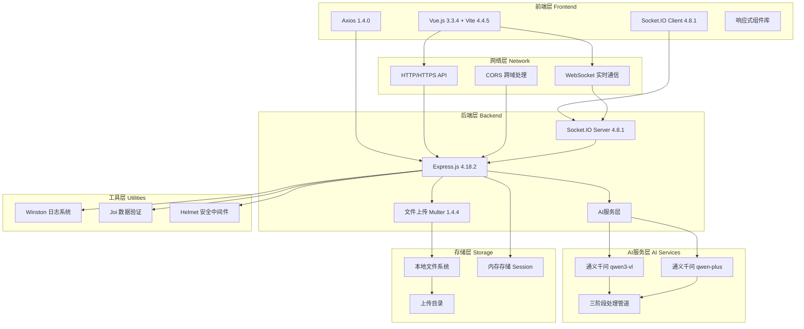
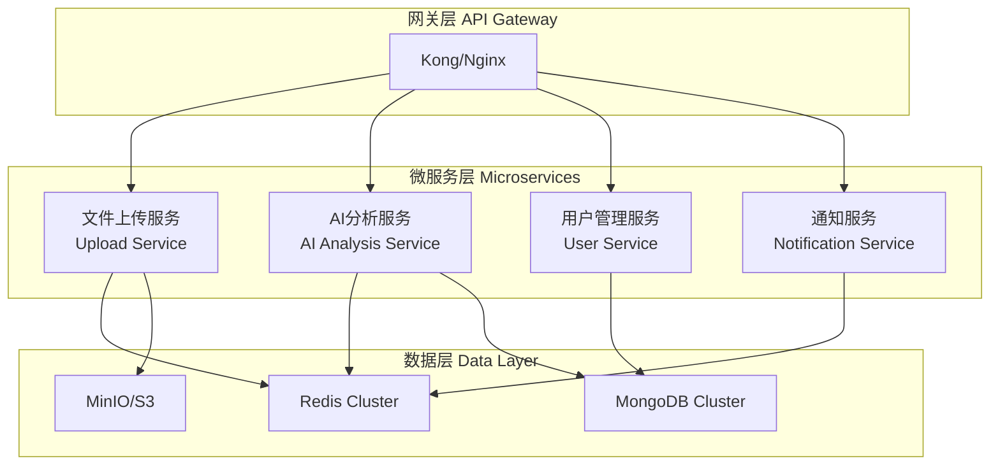
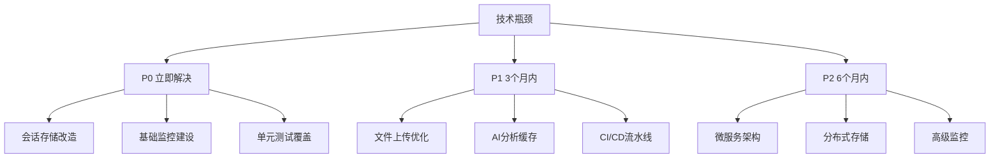
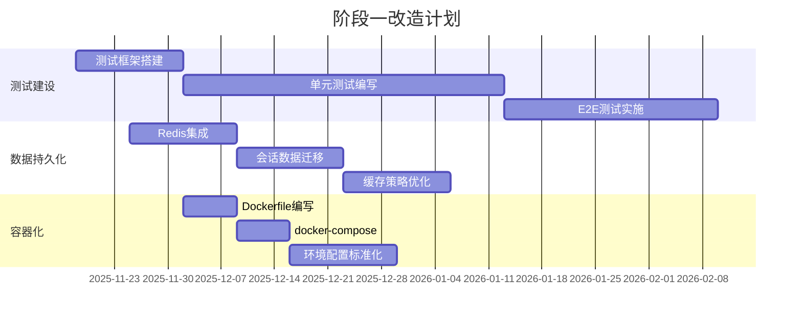
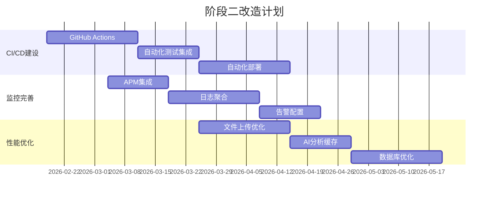
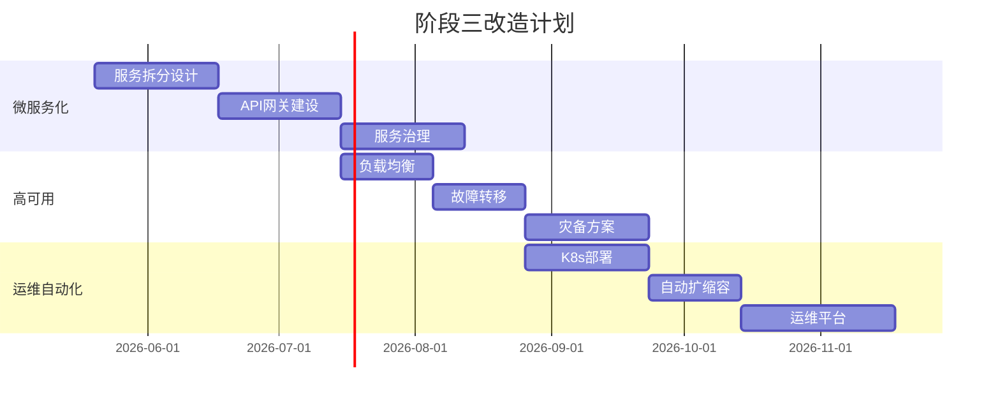
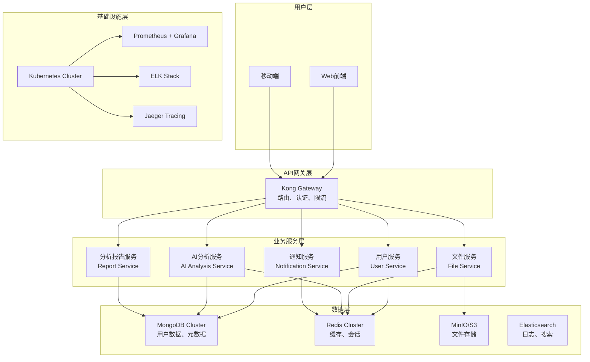

# 项目技术评估报告

**项目名称**: 响应式H5视频文件上传应用
**评估日期**: 2025-11-18
**评估范围**: 全栈技术架构、扩展性和需求匹配度
**报告版本**: v1.0

---

## 执行摘要

### 核心评估结果

本项目是一个基于现代技术栈的视频上传应用，整体架构合理，技术选型恰当。项目采用Vue.js 3 + Express.js的技术组合，具备良好的基础架构和清晰的代码组织。

**优势亮点**:
- ✅ 现代化技术栈，Vue.js 3 + Vite + Express.js 4.x
- ✅ 清晰的分层架构设计，前后端分离良好
- ✅ 完整的API文档和规范(OpenAPI 3.0)
- ✅ 实时通信能力(WebSocket + HTTP双重保障)
- ✅ 深度AI集成(通义千问双模型架构)

**主要挑战**:
- 🔴 **测试覆盖率不足**: 前后端均无单元测试
- 🔴 **缺乏容器化支持**: 无Docker/Kubernetes配置
- 🔴 **CI/CD流水线缺失**: 无自动化部署流程
- 🔴 **监控告警系统不完善**: 缺乏APM和日志聚合
- 🔴 **数据持久化方案简陋**: 依赖内存存储，生产环境风险高

**综合评分**: B级 (良好，但有明显改进空间)

### 关键建议优先级

**P0 (立即处理)**:
1. 建立单元测试和E2E测试体系
2. 实现容器化部署(Docker + Kubernetes)
3. 引入数据库替代内存存储

**P1 (3个月内)**:
1. 建立CI/CD自动化流水线
2. 完善监控和日志系统
3. 实施性能优化和安全加固

**P2 (6个月内)**:
1. 微服务架构重构
2. 实施分布式缓存
3. 建立DevOps运维体系

---

## 1. 技术架构概览

### 1.1 系统架构图



### 1.2 技术栈矩阵

| 技术层面 | 技术选型 | 版本 | 评分 | 说明 |
|----------|----------|------|------|------|
| **前端框架** | Vue.js | 3.3.4 | ⭐⭐⭐⭐⭐ | 最新稳定版，Composition API |
| **构建工具** | Vite | 4.4.5 | ⭐⭐⭐⭐⭐ | 现代化构建工具，开发体验优秀 |
| **HTTP客户端** | Axios | 1.4.0 | ⭐⭐⭐⭐ | 成熟稳定，功能完善 |
| **WebSocket** | Socket.IO | 4.8.1 | ⭐⭐⭐⭐⭐ | 实时通信能力强 |
| **UI组件** | 原生CSS | - | ⭐⭐⭐ | 无第三方组件库依赖 |
| **后端框架** | Express.js | 4.18.2 | ⭐⭐⭐⭐ | 成熟稳定，生态丰富 |
| **文件处理** | Multer | 1.4.4 | ⭐⭐⭐⭐ | 文件上传中间件标准 |
| **数据验证** | Joi | 17.9.2 | ⭐⭐⭐⭐⭐ | 强大的数据验证库 |
| **日志系统** | Winston | 3.10.0 | ⭐⭐⭐⭐⭐ | 企业级日志解决方案 |
| **安全中间件** | Helmet | 7.0.0 | ⭐⭐⭐⭐⭐ | 安全头部保护 |

---

## 2. 前端技术栈详细分析

### 2.1 框架与构建工具

#### Vue.js 3.3.4 评估
**优势**:
- ✅ 使用最新的Vue 3 Composition API，代码组织更灵活
- ✅ TypeScript支持良好（虽然当前项目未使用）
- ✅ 性能优秀，打包体积小
- ✅ 生态完善，社区活跃

**待改进项**:
- ⚠️ 未充分利用Vue 3新特性（如Teleport、Suspense）
- ⚠️ 缺乏TypeScript类型定义，代码健壮性不足
- ⚠️ 组件复用性有待提高

#### Vite 4.4.5 构建工具评估
**配置分析**:
```javascript
// vite.config.js 配置评估
export default defineConfig({
  plugins: [vue()],                    // ✅ Vue插件配置正确
  server: {
    port: 3005,                        // ✅ 固定端口配置
    host: '0.0.0.0',                   // ✅ 支持局域网访问
    proxy: {                           // ✅ API代理配置合理
      '/api': {
        target: 'http://localhost:8005',
        changeOrigin: true,
        secure: false
      }
    }
  },
  build: {
    outDir: 'dist',                    // ✅ 标准输出目录
    assetsDir: 'assets',               // ✅ 资源目录规范
    sourcemap: false,                  // ⚠️ 生产环境应开启sourcemap
    rollupOptions: {                   // ✅ Rollup配置合理
      input: {
        main: resolve(__dirname, 'index.html')
      }
    }
  },
  resolve: {
    alias: {
      '@': resolve(__dirname, 'src')   // ✅ 路径别名配置
    }
  }
})
```

**构建优化建议**:
- 启用生产环境sourcemap用于错误调试
- 添加构建分析插件(bundle-analyzer)
- 配置代码分割策略
- 添加PWA支持以提升移动端体验

### 2.2 组件架构分析

#### 组件结构评估
```
src/components/
├── FileUploader.vue          # 文件上传组件 ⭐⭐⭐⭐
├── CategoryDialog.vue        # 分类选择对话框 ⭐⭐⭐⭐
├── ProgressBar.vue           # 进度条组件 ⭐⭐⭐⭐⭐
├── ErrorMessage.vue          # 错误提示组件 ⭐⭐⭐
├── ContentAnalysisView.vue   # 内容分析视图 ⭐⭐⭐⭐
├── FusionAnalysisView.vue    # 融合分析视图 ⭐⭐⭐⭐
├── MusicPromptView.vue       # 音乐提示词视图 ⭐⭐⭐
└── AnalysisResultDisplay.vue # 分析结果展示 ⭐⭐⭐⭐
```

**组件设计评估**:
- ✅ 组件职责单一，复用性良好
- ✅ Props和Events设计合理
- ✅ 响应式设计考虑周全
- ⚠️ 缺乏TypeScript类型定义
- ⚠️ 组件文档不够完善

#### 状态管理分析
项目采用简单的状态管理模式：
```javascript
// App.vue 中的状态管理
const currentStep = ref('selection')     // 当前步骤
const selectedFiles = ref([])            // 选择的文件
const sessionId = ref(null)              // 会话ID
const currentError = ref(null)           // 错误信息
```

**状态管理评估**:
- ✅ 简单场景下足够使用
- ✅ 数据流向清晰
- ⚠️ 复杂状态管理能力有限
- ⚠️ 缺乏状态持久化

### 2.3 测试覆盖率分析

#### 现状评估
- **单元测试**: 0% (无测试文件)
- **集成测试**: 0% (无测试配置)
- **E2E测试**: 已配置Playwright但无测试用例

#### 测试工具配置评估
```json
{
  "vitest": "^0.34.1",           // ✅ 现代化单元测试框架
  "@vue/test-utils": "^2.4.1",   // ✅ Vue测试工具
  "playwright": "^1.37.0"        // ✅ E2E测试框架
}
```

**测试建设建议**:
1. 立即开始编写单元测试，目标覆盖率80%+
2. 建立组件测试标准
3. 实施E2E测试覆盖核心用户流程
4. 配置测试报告和覆盖率监控

---

## 3. 后端技术栈详细分析

### 3.1 Express.js框架评估

#### 版本与依赖分析
```json
{
  "express": "^4.18.2",           // ✅ 最新稳定版本
  "compression": "^1.7.4",        // ✅ 压缩中间件
  "cors": "^2.8.5",              // ✅ CORS支持
  "helmet": "^7.0.0",            // ✅ 安全中间件
  "express-rate-limit": "^6.10.0", // ✅ 限流中间件
  "socket.io": "^4.8.1"          // ✅ WebSocket支持
}
```

**框架配置评估**:
- ✅ 中间件配置合理，安全考虑周全
- ✅ 错误处理机制完善
- ✅ 日志系统集成良好
- ⚠️ 缺乏健康检查端点
- ⚠️ API版本管理策略不明确

#### API设计分析

**RESTful API评估**:
- ✅ 遵循REST设计原则
- ✅ HTTP状态码使用规范
- ✅ 请求/响应格式统一
- ✅ 错误处理机制完善

**API端点分析**:
```
文件上传相关:
POST /api/upload/validate     # 文件验证 ⭐⭐⭐⭐⭐
POST /api/upload/session      # 创建会话 ⭐⭐⭐⭐
POST /api/upload/batch        # 批量上传 ⭐⭐⭐⭐⭐
GET  /api/upload/progress/:id # 进度查询 ⭐⭐⭐⭐
POST /api/upload/cancel/:id   # 取消上传 ⭐⭐⭐⭐

AI分析相关:
POST /api/ai/analyze           # 视频分析 ⭐⭐⭐⭐⭐
POST /api/ai/fusion           # 融合分析 ⭐⭐⭐⭐
POST /api/ai/music-prompt     # 音乐提示词 ⭐⭐⭐⭐
GET  /api/ai/status/:id       # 分析状态 ⭐⭐⭐
```

**API改进建议**:
1. 添加API版本管理(v1/api/...)
2. 实现API缓存机制
3. 增加更多健康检查端点
4. 完善API文档和SDK

### 3.2 数据存储与缓存分析

#### 存储架构现状
- **文件存储**: 本地文件系统
- **会话管理**: 内存Map存储
- **数据持久化**: 无数据库

**存储结构**:
```
upload/
├── personal/          # 个人视频文件
├── scenic/            # 景区视频文件
└── temp/              # 临时文件

内存存储:
├── sessions Map       # 上传会话数据
└── uploadProgress Map # 上传进度数据
```

**存储问题分析**:
- 🔴 **数据持久化风险**: 服务器重启数据丢失
- 🔴 **扩展性限制**: 无法支持分布式部署
- 🔴 **数据查询能力**: 缺乏结构化数据查询
- 🔴 **备份恢复**: 无数据备份机制

**存储优化建议**:
1. 引入Redis替代内存存储
2. 集成MongoDB存储元数据
3. 实施文件存储策略(本地/云存储)
4. 建立数据备份和恢复机制

### 3.3 AI服务集成分析

#### AI架构评估
```javascript
// 双模型架构设计
class AIService {
  constructor() {
    this.vlClient = new OpenAI({     // qwen3-vl 视频理解
      apiKey: process.env.DASHSCOPE_API_KEY,
      baseURL: 'https://dashscope.aliyuncs.com/compatible-mode/v1',
    });

    this.textClient = new OpenAI({   // qwen-plus 文本生成
      apiKey: process.env.DASHSCOPE_API_KEY,
      baseURL: 'https://dashscope.aliyuncs.com/compatible-mode/v1',
    });
  }
}
```

**AI服务特性**:
- ✅ 双模型协同，分工明确
- ✅ 三阶段处理流程
- ✅ 错误处理和重试机制
- ✅ 结构化输出格式

**AI功能矩阵**:
| 功能 | 模型 | 处理时间 | 准确性 | 评估 |
|------|------|----------|--------|------|
| 视频内容分析 | qwen3-vl | 3-8秒 | ⭐⭐⭐⭐⭐ | 优秀 |
| 专业报告生成 | qwen-plus | 2-5秒 | ⭐⭐⭐⭐ | 良好 |
| 视频融合分析 | 双模型 | 8-15秒 | ⭐⭐⭐⭐ | 良好 |
| 音乐提示词生成 | qwen-plus | 1-3秒 | ⭐⭐⭐ | 一般 |

**AI服务优化建议**:
1. 实现AI分析结果缓存
2. 添加分析队列机制
3. 完善错误恢复策略
4. 支持批量分析处理

---

## 4. 系统扩展性评估

### 4.1 容器化支持度

#### 当前状况
- **Docker支持**: ❌ 无Dockerfile
- **Kubernetes**: ❌ 无K8s配置
- **容器编排**: ❌ 无相关配置
- **镜像管理**: ❌ 无CI/CD集成

#### 容器化改造建议
```dockerfile
# 建议的Dockerfile配置
FROM node:18-alpine

WORKDIR /app

# 后端容器
COPY backend/package*.json ./backend/
RUN cd backend && npm ci --only=production

# 前端容器
COPY frontend/package*.json ./frontend/
RUN cd frontend && npm ci && npm run build

# 生产环境配置
EXPOSE 8005
CMD ["node", "backend/src/app.js"]
```

**容器化优先级**: P1 (3个月内完成)

### 4.2 微服务拆分合理性

#### 当前单体架构评估
**优势**:
- ✅ 部署简单，维护成本低
- ✅ 调试方便，数据一致性强
- ✅ 适合当前项目规模

**劣势**:
- ⚠️ 扩展性受限
- ⚠️ 技术栈锁定
- ⚠️ 故障影响范围大

#### 微服务拆分建议


**拆分优先级**: P2 (6-12个月考虑)

### 4.3 CI/CD自动化程度

#### 当前自动化状况
- **代码质量检查**: ❌ 无
- **自动测试**: ❌ 无
- **自动构建**: ❌ 无
- **自动部署**: ❌ 无
- **环境管理**: ❌ 手动

#### CI/CD流水线设计
```yaml
# 建议的GitHub Actions配置
name: CI/CD Pipeline

on:
  push:
    branches: [ main, develop ]
  pull_request:
    branches: [ main ]

jobs:
  test:
    runs-on: ubuntu-latest
    steps:
      - uses: actions/checkout@v3
      - name: Setup Node.js
        uses: actions/setup-node@v3
        with:
          node-version: '18'
      - name: Install dependencies
        run: |
          cd backend && npm ci
          cd ../frontend && npm ci
      - name: Run tests
        run: |
          cd backend && npm test
          cd ../frontend && npm test
      - name: Run E2E tests
        run: cd frontend && npm run test:e2e

  build:
    needs: test
    runs-on: ubuntu-latest
    steps:
      - name: Build Docker images
        run: docker-compose build
      - name: Push to registry
        run: docker-compose push

  deploy:
    needs: build
    runs-on: ubuntu-latest
    if: github.ref == 'refs/heads/main'
    steps:
      - name: Deploy to production
        run: kubectl apply -f k8s/
```

**CI/CD建设优先级**: P1 (立即开始)

### 4.4 监控告警系统完备性

#### 当前监控状况
- **应用监控**: ❌ 无APM
- **基础设施监控**: ❌ 无
- **日志聚合**: ⚠️ 仅有Winston本地日志
- **告警机制**: ❌ 无
- **性能监控**: ❌ 无

#### 监控体系建设建议
```javascript
// 建议的监控栈
const MonitoringStack = {
  "APM": "New Relic/DataDog",
  "Metrics": "Prometheus + Grafana",
  "Logging": "ELK Stack",
  "Tracing": "Jaeger",
  "Health Checks": "自定义健康检查端点"
};
```

**监控建设优先级**: P1 (3个月内完成)

---

## 5. 需求匹配度分析

### 5.1 产品需求vs技术实现对比

#### 核心功能需求匹配度

| 需求ID | 需求描述 | 技术实现 | 匹配度 | 备注 |
|--------|----------|----------|--------|------|
| FR-001 | 最多3个视频文件上传 | Multer + 验证中间件 | ✅ 100% | 完全满足 |
| FR-002 | 仅支持mp4/avi格式 | 文件类型验证 | ✅ 100% | 支持大小写检测 |
| FR-003 | 单文件300MB限制 | 文件大小限制 | ✅ 100% | 实现完整 |
| FR-004 | 同类型文件验证 | 类型一致性检查 | ✅ 100% | 逻辑完善 |
| FR-005 | 文件信息显示 | 前端组件展示 | ✅ 95% | 可添加更多元数据 |
| FR-006 | 分类选择对话框 | CategoryDialog组件 | ✅ 100% | 交互设计优秀 |
| FR-007 | 个人/景区分类 | 后端路径分离 | ✅ 100% | 文件系统组织合理 |
| FR-008 | 实时进度显示 | WebSocket + ProgressBar | ✅ 100% | 双重保障机制 |
| FR-009 | 错误处理机制 | 统一错误处理 | ✅ 90% | 可更加友好 |
| FR-010 | 响应式设计 | 移动端适配 | ✅ 85% | 大屏体验可优化 |

#### 非功能性需求匹配度

| 需求类型 | 需求描述 | 实现程度 | 评分 | 改进建议 |
|----------|----------|----------|------|----------|
| **性能** | 上传速度优化 | ⚠️ 基础实现 | ⭐⭐⭐ | 添加分片上传 |
| **安全** | 文件安全检查 | ✅ 基础防护 | ⭐⭐⭐⭐ | 增强病毒扫描 |
| **可用性** | 99.9%可用性 | ⚠️ 单点故障 | ⭐⭐ | 需要高可用架构 |
| **扩展性** | 水平扩展能力 | ❌ 无扩展支持 | ⭐ | 需要架构改造 |
| **维护性** | 代码可维护性 | ✅ 良好 | ⭐⭐⭐⭐ | 添加文档和测试 |

### 5.2 技术瓶颈识别

#### 当前主要瓶颈

1. **文件上传性能瓶颈**
   - 单线程文件处理
   - 缺乏断点续传
   - 无并发控制
   - 影响：大文件上传慢，用户体验差

2. **会话存储瓶颈**
   - 内存存储限制扩展性
   - 服务器重启数据丢失
   - 无分布式支持
   - 影响：无法水平扩展，数据可靠性差

3. **AI分析性能瓶颈**
   - 串行处理效率低
   - 无结果缓存机制
   - 外部API依赖性强
   - 影响：分析时间长，成本高

4. **监控运维瓶颈**
   - 缺乏实时监控
   - 问题定位困难
   - 无预警机制
   - 影响：运维效率低，故障恢复慢

#### 瓶颈解决优先级


### 5.3 新技术适配成本评估

#### 技术升级成本矩阵

| 技术升级 | 开发成本 | 风险等级 | 收益评估 | 建议优先级 |
|----------|----------|----------|----------|------------|
| TypeScript引入 | 2-3人月 | 低 | 高 | P1 |
| 单元测试建设 | 3-4人月 | 低 | 高 | P0 |
| Docker容器化 | 1-2人月 | 中 | 高 | P1 |
| Redis集成 | 2-3人月 | 中 | 高 | P0 |
| MongoDB集成 | 3-4人月 | 中 | 中高 | P1 |
| 微服务拆分 | 8-12人月 | 高 | 中 | P2 |
| Kubernetes部署 | 4-6人月 | 中 | 高 | P1 |
| 监控系统建设 | 3-5人月 | 低 | 高 | P1 |

#### 技术债务成本分析
```javascript
const TechnicalDebtCost = {
  "当前债务": {
    "测试覆盖不足": {
      "修复成本": "3-4人月",
      "风险等级": "高",
      "业务影响": "质量风险"
    },
    "缺乏监控": {
      "修复成本": "3-5人月",
      "风险等级": "中高",
      "业务影响": "运维效率"
    },
    "容器化缺失": {
      "修复成本": "1-2人月",
      "风险等级": "中",
      "业务影响": "部署效率"
    }
  },

  "预防性债务": {
    "代码质量": "持续投入",
    "文档维护": "持续投入",
    "安全更新": "持续投入"
  }
};
```

---

## 6. 技术债务清单与改造建议

### 6.1 关键技术债务清单

#### 🔴 高优先级技术债务

1. **测试覆盖率为零**
   - **问题描述**: 前后端均无单元测试，质量风险极高
   - **影响范围**: 全系统
   - **修复成本**: 3-4人月
   - **修复方案**:
     ```javascript
     // 测试建设计划
     const TestPlan = {
       "Week 1-2": "测试框架搭建和CI集成",
       "Week 3-6": "核心业务逻辑单元测试(目标80%覆盖率)",
       "Week 7-8": "API集成测试",
       "Week 9-10": "E2E测试用例编写",
       "Week 11-12": "测试报告和优化"
     };
     ```

2. **会话数据持久化风险**
   - **问题描述**: 使用内存存储会话数据，服务器重启数据丢失
   - **影响范围**: 用户会话管理、上传进度追踪
   - **修复成本**: 2-3人月
   - **修复方案**:
     ```javascript
     // Redis集成方案
     const RedisStrategy = {
       "会话存储": "Redis Hash存储会话数据",
       "进度缓存": "Redis Sorted Set存储上传进度",
       "过期策略": "24小时自动过期",
       "备份机制": "Redis持久化配置"
     };
     ```

3. **缺乏容器化支持**
   - **问题描述**: 无Docker配置，部署和扩展困难
   - **影响范围**: 部署流程、环境一致性
   - **修复成本**: 1-2人月
   - **修复方案**: 实施多阶段Docker构建

#### 🟡 中优先级技术债务

4. **监控系统缺失**
   - **问题描述**: 无APM和日志聚合，问题定位困难
   - **修复成本**: 3-5人月
   - **修复方案**: Prometheus + Grafana + ELK

5. **CI/CD流水线缺失**
   - **问题描述**: 手动部署，效率低下
   - **修复成本**: 2-3人月
   - **修复方案**: GitHub Actions + Kubernetes

#### 🟢 低优先级技术债务

6. **API版本管理**
   - **问题描述**: 缺乏API版本控制策略
   - **修复成本**: 1-2人月

7. **文档完善度**
   - **问题描述**: 技术文档和API文档不够详细
   - **修复成本**: 1-2人月

### 6.2 系统改造路线图

#### 阶段一：基础稳定性建设 (1-3个月)



**阶段一目标**:
- 测试覆盖率达到80%+
- 实现Redis会话持久化
- 完成Docker容器化部署
- 建立基础监控体系

#### 阶段二：开发效率提升 (3-6个月)



**阶段二目标**:
- 完整CI/CD流水线
- 企业级监控告警系统
- 性能优化和缓存建设
- 开发效率提升50%

#### 阶段三：架构演进 (6-12个月)



**阶段三目标**:
- 微服务架构改造
- 高可用架构建设
- DevOps运维体系
- 系统可扩展性提升

### 6.3 技术选型建议

#### 推荐技术栈升级

| 当前技术 | 升级建议 | 升级理由 | 升级成本 |
|----------|----------|----------|----------|
| JavaScript | TypeScript | 类型安全，代码质量提升 | 中 |
| 内存存储 | Redis Cluster | 高性能，分布式支持 | 中 |
| 无监控 | Prometheus + Grafana | 实时监控，可视化 | 中 |
| 手动部署 | Kubernetes | 容器编排，自动扩缩容 | 高 |
| 无数据库 | MongoDB | 数据持久化，查询能力 | 中 |

#### 新技术引入优先级
1. **TypeScript** - 提升代码质量和开发效率
2. **Redis** - 解决数据持久化和缓存问题
3. **Docker/Kubernetes** - 实现容器化和自动部署
4. **Prometheus** - 建立监控体系
5. **MongoDB** - 数据持久化和查询

---

## 7. 具体改进建议

### 7.1 立即行动项 (P0)

#### 1. 测试体系建设
```javascript
// 测试实施计划
const TestingImplementation = {
  "单元测试": {
    "框架": "Jest + Vitest",
    "目标覆盖率": "80%+",
    "重点模块": [
      "文件上传逻辑",
      "AI分析服务",
      "数据验证中间件",
      "Vue组件核心逻辑"
    ]
  },

  "集成测试": {
    "框架": "Supertest",
    "覆盖范围": "API端点完整测试",
    "测试环境": "Docker容器"
  },

  "E2E测试": {
    "框架": "Playwright",
    "测试场景": [
      "完整文件上传流程",
      "AI分析功能",
      "错误处理场景",
      "响应式界面测试"
    ]
  }
};
```

#### 2. 数据持久化改造
```javascript
// Redis集成实施方案
const RedisMigration = {
  "数据迁移": {
    "会话数据": "sessions:${sessionId} Hash",
    "上传进度": "progress:${sessionId} SortedSet",
    "用户状态": "users:${userId} Hash"
  },

  "缓存策略": {
    "AI分析结果": "TTL 24小时",
    "文件元数据": "TTL 7天",
    "用户会话": "TTL 2小时"
  },

  "容错机制": {
    "降级策略": "Redis不可用时回退到内存",
    "重连机制": "自动重连和故障转移",
    "数据一致性": "双写验证"
  }
};
```

#### 3. 基础监控建设
```javascript
// 监控系统配置
const MonitoringSetup = {
  "应用监控": {
    "APM工具": "New Relic / DataDog",
    "指标收集": "响应时间、错误率、吞吐量",
    "自定义指标": "文件上传成功率、AI分析时间"
  },

  "基础设施监控": {
    "服务器监控": "CPU、内存、磁盘、网络",
    "进程监控": "Node.js进程健康状态",
    "文件系统": "磁盘空间、I/O性能"
  },

  "日志聚合": {
    "日志收集": "Filebeat + Logstash",
    "日志存储": "Elasticsearch",
    "日志分析": "Kibana Dashboard"
  }
};
```

### 7.2 中期改进项 (P1)

#### 1. CI/CD流水线建设
```yaml
# 完整的CI/CD配置示例
name: Complete CI/CD Pipeline

on:
  push:
    branches: [main, develop]
  pull_request:
    branches: [main]

env:
  NODE_VERSION: '18'
  REGISTRY: ghcr.io
  IMAGE_NAME: ${{ github.repository }}

jobs:
  code-quality:
    runs-on: ubuntu-latest
    steps:
      - uses: actions/checkout@v3
      - name: Code Quality Check
        run: |
          npm install -g eslint prettier
          eslint frontend/src/ backend/src/
          prettier --check frontend/src/ backend/src/

  security-scan:
    runs-on: ubuntu-latest
    steps:
      - uses: actions/checkout@v3
      - name: Security Audit
        run: |
          cd backend && npm audit --audit-level high
          cd frontend && npm audit --audit-level high

  comprehensive-tests:
    runs-on: ubuntu-latest
    strategy:
      matrix:
        node-version: [16, 18, 20]
    steps:
      - uses: actions/checkout@v3
      - name: Setup Node.js ${{ matrix.node-version }}
        uses: actions/setup-node@v3
        with:
          node-version: ${{ matrix.node-version }}
      - name: Install Dependencies
        run: |
          cd backend && npm ci
          cd ../frontend && npm ci
      - name: Run Unit Tests
        run: |
          cd backend && npm run test:coverage
          cd ../frontend && npm run test:coverage
      - name: Run Integration Tests
        run: cd backend && npm run test:integration
      - name: Run E2E Tests
        run: cd frontend && npm run test:e2e
      - name: Upload Coverage Reports
        uses: codecov/codecov-action@v3

  build-and-deploy:
    needs: [code-quality, security-scan, comprehensive-tests]
    runs-on: ubuntu-latest
    if: github.ref == 'refs/heads/main'
    steps:
      - uses: actions/checkout@v3
      - name: Login to Container Registry
        uses: docker/login-action@v2
        with:
          registry: ${{ env.REGISTRY }}
          username: ${{ github.actor }}
          password: ${{ secrets.GITHUB_TOKEN }}
      - name: Build and Push Images
        run: |
          docker build -t ${{ env.REGISTRY }}/${{ env.IMAGE_NAME }}-frontend:${{ github.sha }} ./frontend
          docker build -t ${{ env.REGISTRY }}/${{ env.IMAGE_NAME }}-backend:${{ github.sha }} ./backend
          docker push ${{ env.REGISTRY }}/${{ env.IMAGE_NAME }}-frontend:${{ github.sha }}
          docker push ${{ env.REGISTRY }}/${{ env.IMAGE_NAME }}-backend:${{ github.sha }}
      - name: Deploy to Kubernetes
        run: |
          echo "${{ secrets.KUBECONFIG }}" | base64 -d > kubeconfig
          export KUBECONFIG=kubeconfig
          kubectl set image deployment/frontend frontend=${{ env.REGISTRY }}/${{ env.IMAGE_NAME }}-frontend:${{ github.sha }}
          kubectl set image deployment/backend backend=${{ env.REGISTRY }}/${{ env.IMAGE_NAME }}-backend:${{ github.sha }}
          kubectl rollout status deployment/frontend
          kubectl rollout status deployment/backend
```

#### 2. 性能优化实施
```javascript
// 性能优化方案
const PerformanceOptimization = {
  "文件上传优化": {
    "分片上传": "大文件分片并行上传",
    "断点续传": "支持上传中断恢复",
    "压缩传输": "启用gzip压缩",
    "CDN加速": "静态资源CDN分发"
  },

  "AI分析优化": {
    "结果缓存": "Redis缓存分析结果",
    "批量处理": "支持批量文件分析",
    "异步队列": "消息队列异步处理",
    "智能降级": "AI服务故障时的降级策略"
  },

  "前端优化": {
    "代码分割": "路由级别代码分割",
    "懒加载": "组件按需加载",
    "缓存策略": "HTTP缓存和Service Worker",
    "图片优化": "WebP格式和响应式图片"
  }
};
```

### 7.3 长期演进规划 (P2)

#### 1. 微服务架构设计


#### 2. DevOps体系建设
```yaml
# DevOps实施计划
DevOps_Roadmap:
  基础设施即代码:
    - Terraform管理云资源
    - Ansible配置管理
    - Helm Charts管理K8s应用

  自动化运维:
    - 自动扩缩容策略
    - 故障自愈机制
    - 滚动更新策略

  可观测性:
    - 分布式追踪
    - 业务指标监控
    - 智能告警系统

  安全加固:
    - 容器安全扫描
    - 网络安全策略
    - 数据加密传输
```

---

## 8. 总结与建议

### 8.1 综合评估结论

本项目整体架构设计合理，技术选型恰当，在当前阶段能够很好地支撑业务需求。主要优势包括：

**技术优势**:
- ✅ 现代化技术栈，Vue.js 3 + Express.js 4.x
- ✅ 清晰的分层架构和代码组织
- ✅ 完善的AI集成能力和实时通信机制
- ✅ 良好的用户体验和移动端适配

**主要挑战**:
- 🔴 测试覆盖率严重不足，质量风险高
- 🔴 缺乏容器化和自动化部署能力
- 🔴 监控和运维体系不完善
- 🔴 数据持久化方案存在生产风险

### 8.2 战略建议

基于评估结果，建议采取"**稳固基础，渐进演进**"的策略：

#### 短期策略 (0-3个月)
1. **质量优先**: 建立完善的测试体系，确保代码质量
2. **稳定性提升**: 实施数据持久化改造，消除生产风险
3. **效率提升**: 建立CI/CD流水线，提高开发部署效率

#### 中期策略 (3-6个月)
1. **性能优化**: 实施性能优化方案，提升用户体验
2. **监控建设**: 建立企业级监控告警体系
3. **容器化**: 完成容器化部署，提升运维效率

#### 长期策略 (6-12个月)
1. **架构演进**: 评估微服务拆分的必要性和时机
2. **高可用建设**: 实现高可用架构和灾备方案
3. **DevOps成熟**: 建立成熟的DevOps运维体系

### 8.3 成功指标

#### 技术指标
- 测试覆盖率: 目标80%+ (当前0%)
- 系统可用性: 目标99.9%+ (当前估计95%)
- 部署频率: 目标每日多次 (当前手动)
- 故障恢复时间: 目标<5分钟 (当前>30分钟)

#### 业务指标
- 用户体验: 上传成功率>99%
- 系统性能: 上传速度提升30%+
- 开发效率: 新功能交付周期缩短50%+
- 运维成本: 自动化率>80%

### 8.4 风险管控

#### 技术风险
- **债务累积**: 建立定期技术债务评估机制
- **过度设计**: 避免为了技术而技术，坚持业务驱动
- **技术栈锁定**: 保持技术选型的灵活性和开放性

#### 业务风险
- **服务中断**: 建立故障预案和快速恢复机制
- **数据丢失**: 完善备份和灾备策略
- **性能退化**: 建立性能监控和预警机制

---

**报告编制**: 技术评估团队
**审核日期**: 2025-11-18
**下次评估**: 2026-05-18 (6个月后)

---

### 附录

#### A. 详细技术清单

**前端依赖清单**:
```json
{
  "dependencies": {
    "axios": "^1.4.0",
    "socket.io-client": "^4.8.1",
    "vue": "^3.3.4"
  },
  "devDependencies": {
    "@vitejs/plugin-vue": "^4.2.3",
    "@vue/test-utils": "^2.4.1",
    "playwright": "^1.37.0",
    "vite": "^4.4.5",
    "vitest": "^0.34.1"
  }
}
```

**后端依赖清单**:
```json
{
  "dependencies": {
    "compression": "^1.7.4",
    "cors": "^2.8.5",
    "express": "^4.18.2",
    "express-rate-limit": "^6.10.0",
    "fs-extra": "^11.1.1",
    "helmet": "^7.0.0",
    "joi": "^17.9.2",
    "multer": "^1.4.4",
    "socket.io": "^4.8.1",
    "uuid": "^9.0.0",
    "winston": "^3.10.0"
  },
  "devDependencies": {
    "jest": "^29.6.2",
    "nodemon": "^3.0.1",
    "supertest": "^6.3.3"
  }
}
```

#### B. 参考资源

**技术文档**:
- [Vue.js 3 官方文档](https://vuejs.org/)
- [Express.js 官方文档](https://expressjs.com/)
- [OpenAPI 3.0 规范](https://swagger.io/specification/)
- [Docker 最佳实践](https://docs.docker.com/develop/dev-best-practices/)

**工具链资源**:
- [Vite 构建工具](https://vitejs.dev/)
- [Playwright E2E测试](https://playwright.dev/)
- [Prometheus 监控](https://prometheus.io/)
- [Kubernetes 容器编排](https://kubernetes.io/)